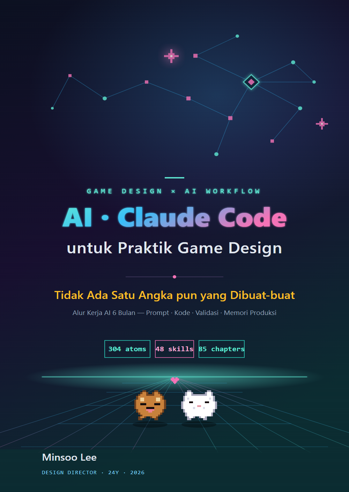

# AI dan Claude Code untuk Praktik Game Design

> Tidak Ada Satu Angka pun yang Dibuat-buat — Panduan Lapangan 6 Bulan untuk Claude Code, Prompt, Validasi, dan Memori Produksi

[](LICENSE)
[-blue.svg)](https://github.com/eremes81/game-design-ai-practice)
[-orange.svg)](https://bookk.co.kr/bookStore/6a298be0ff49b1a6034c7703)

**🌐 Edisi:** [한국어 — Asli](https://github.com/eremes81/game-design-ai-practice) · [English](https://github.com/eremes81/game-design-ai-practice-en) · [日本語](https://github.com/eremes81/game-design-ai-practice-ja) · **Bahasa Indonesia**



Panduan lapangan praktis dari seorang design director dengan 24 tahun di industri game tentang membawa AI generatif (Claude Code) ke dalam **pekerjaan produksi sehari-hari**. Bukan teori atau ramalan — buku ini menelusuri satu tugas demi satu tugas, dari layar paling awal (instalasi, akun, harga) melalui desain sistem, pertarungan, naratif, level design, balance, UX, dan Live Ops, hingga mengubah notula rapat menjadi keputusan, gerbang validasi, manajemen biaya, dan hak cipta.

Subjudul — **"Tidak Ada Satu Angka pun yang Dibuat-buat"** — adalah janji buku ini. Setiap angka dan kasus dalam teks berasal dari pekerjaan nyata, bukan contoh karangan, dan sebagian besar kodenya berjalan apa adanya hanya dengan pustaka standar Python.

Buku ini juga terbuka bagi pembaca di luar game. Alur kerja seperti mengubah notula rapat menjadi keputusan, menelusuri efek riak sebuah keputusan, dan menjaga kualitas dengan gerbang validasi berlaku terlepas dari pekerjaan Anda. Kotak "Penerapan di Luar Game" di tiap bab adalah jembatannya, dan tiap bab juga memuat "Versi Ringkas Solo" untuk mereka yang membangun sendirian, tanpa tim.

---

## 🌐 Tentang Edisi Ini

Ini adalah **edisi Bahasa Indonesia** dari naskah asli berbahasa Korea, *게임 기획 실무에서 바로 쓰는 AI·클로드 코드 활용법* (BOOKK, 2026 · ISBN 979-11-12-21479-9).

Sesuai prinsip "kejujuran lebih dulu" buku ini, inilah persisnya cara edisi ini dibuat: ia **diterjemahkan dari naskah asli Korea menggunakan alur kerja AI buku ini sendiri** (terjemahan dibantu Claude di bawah lembar terminologi tetap), lalu ditinjau oleh penulis — yang bukan penutur asli Bahasa Indonesia. Semua worked transcript adalah terjemahan dari sesi asli berbahasa Korea, **bukan dijalankan ulang dalam Bahasa Indonesia**; naskah asli Korea yang tak diubah ada di [repository Korea](https://github.com/eremes81/game-design-ai-practice). Sintaksis kode, pengidentifikasi, angka, dan nilai verifikasi tidak diubah.

**Koreksi dari penutur asli sangat kami harapkan** — jika ada kalimat yang terasa keliru, silakan buka Issue atau Pull Request.

---

## 📖 Mulai Membaca

- **[Kata Pengantar · Cara Membaca Buku Ini](manuscript/_front-matter.md)** — mulai di sini untuk melihat rute baca
- **[1.0 Sebelum Anda Mulai — Instalasi, Akun, Harga, dan Kit Bertahan di Terminal](manuscript/part01-foundation/chapter-0-setup-survival-kit.md)** — ikuti langkah demi langkah dari layar paling awal
- Diagram ditulis sebagai blok kode ` ```mermaid ` dan **dirender secara native di GitHub**. Klik bab mana pun di bawah dan baca.

## Edisi Cetak Asli (Korea)

| | |
|---|---|
| Penulis | Minsoo Lee (이민수) |
| Penerbit | BOOKK · sampul lunak (Korea) |
| ISBN | 979-11-12-21479-9 |
| Terbit | 2026-06-11 |
| Ukuran | 876 halaman · 24 bagian + lampiran A\~N + epilog |
| Beli | **[Toko BOOKK (edisi cetak Korea)](https://bookk.co.kr/bookStore/6a298be0ff49b1a6034c7703)** |

Repository ini adalah **edisi Bahasa Indonesia (sumber markdown)** dari buku yang sama, dirilis di bawah lisensi di bawah ini. Naskah asli Korea ada di [eremes81/game-design-ai-practice](https://github.com/eremes81/game-design-ai-practice).

## Daftar Isi Lengkap

> **24 bagian + lampiran A\~N + epilog · 100 bab.** Lampiran ada di [`manuscript/part99-appendix/`](manuscript/part99-appendix), kolofon di [`manuscript/_colophon.md`](manuscript/_colophon.md).

### Bagian 1 · Dasar

- [1.0 Sebelum Memulai — Instalasi, Akun, Biaya, dan Kit Bertahan Terminal](manuscript/part01-foundation/chapter-0-setup-survival-kit.md)
- [1.1 Perjumpaan Pertama Seorang Game Designer dengan Claude Code](manuscript/part01-foundation/chapter-1-first-encounter.md)
- [1.2 Model, Token, Harness — Jalan yang Dilalui Token dalam Satu Pekerjaan](manuscript/part01-foundation/chapter-2-model-token-harness.md)
- [1.3 Infrastruktur Memori, Izin, dan Konfigurasi](manuscript/part01-foundation/chapter-3-memory-permission-setting.md)

### Bagian 2 · Arsitektur Informasi

- [2.1 YAML Frontmatter — Setiap Dokumen sebagai Data](manuscript/part02-info-architecture/chapter-4-yaml-frontmatter.md)
- [2.2 Atom per Halaman — Anatomi Satu Dokumen Satu Keputusan](manuscript/part02-info-architecture/chapter-5-page-atom.md)
- [2.3 Desain Layer — Abstraksi Sistem Game](manuscript/part02-info-architecture/chapter-6-layer-design.md)
- [2.4 Ontologi dan Graf wikilink — Memverifikasi Panah Makna](manuscript/part02-info-architecture/chapter-7-ontology-graph.md)

### Bagian 3 · Desain Sistem

- [3.1 Pekerjaan System Designer dan Koordinat Layer](manuscript/part03-system-design/chapter-09-system-designer-and-layer.md)
- [3.2 Skema Dulu — $skema Datang Sebelum Data](manuscript/part03-system-design/chapter-10-schema-first.md)
- [3.3 Visualisasi Peta Relasi — Melihat Dependensi dengan Mata](manuscript/part03-system-design/chapter-11-relation-map.md)
- [3.4 Pola Prompt untuk Desain Sistem Berbantuan AI](manuscript/part03-system-design/chapter-12-ai-assist-prompt-patterns.md)

### Bagian 4 · Desain Pertarungan

- [4.1 Combat Designer dan Layer — Di Kotak Mana Hit Feel Diletakkan](manuscript/part04-combat-design/chapter-13-combat-designer-and-layer.md)
- [4.2 Look & Feel Pertarungan — Tempat Menangkap Game Feel dengan Data](manuscript/part04-combat-design/chapter-14-look-and-feel.md)
- [4.3 Kombo, Cancel, dan Input Queue — Mengenumerasi dan Memverifikasi Setiap Jalur](manuscript/part04-combat-design/chapter-15-combo-cancel-input.md)
- [4.4 Simulasi dan Verifikasi Pertarungan dengan Bantuan AI](manuscript/part04-combat-design/chapter-16-ai-combat-simulation.md)

### Bagian 5 · Naratif

- [5.1 Struktur NarrativeDocs Layer 0–4](manuscript/part05-narrative-design/chapter-1-narrative-docs-layers.md)
- [5.2 Verifikasi Konsistensi: Dunia → Karakter → Quest](manuscript/part05-narrative-design/chapter-2-consistency-verification.md)
- [5.3 Penulisan Naratif dengan Bantuan AI](manuscript/part05-narrative-design/chapter-3-ai-assisted-narrative.md)
- [5.4 Konsistensi Dialog dan Voice](manuscript/part05-narrative-design/chapter-4-dialogue-voice-consistency.md)

### Bagian 6 · Desain Konten

- [6.1 Pembangkitan Konten Prosedural dan AI — Satu Sel tempat Dua Sumbu Berpotongan](manuscript/part06-content-design/chapter-1-procedural-content-ai.md)
- [6.2 city_hunting_generator — Membuat 30 Kota dalam 4 Minggu](manuscript/part06-content-design/chapter-2-city-hunting-generator.md)
- [6.3 Persona dan Squad NPC — Dari Museum Boneka Menjadi Masyarakat Kecil](manuscript/part06-content-design/chapter-3-npc-persona-squad-pipeline.md)
- [6.4 Alur Kerja Produksi Konten — Merangkai Beberapa Generator dalam Satu Lini](manuscript/part06-content-design/chapter-4-content-production-workflow.md)

### Bagian 7 · Level Design

- [7.1 Menguasai Desain Level Prosedural](manuscript/part07-level-design/chapter-1-procedural-level-design-master.md)
- [7.2 Editor BehaviorTree — Worked Transcript Saat Manusia dan AI Bersama-sama Menyunting dan Memverifikasi BT json](manuscript/part07-level-design/chapter-2-behaviortree-editor.md)
- [7.3 Pustaka Pola Dungeon dan Field](manuscript/part07-level-design/chapter-3-dungeon-field-pattern-library.md)

### Bagian 8 · Balance

- [8.1 Formula Balans Tempur — Tempat Rulebook bernama Determinisme](manuscript/part08-balance-design/chapter-1-combat-balance-formula.md)
- [8.2 Memodelkan Ekonomi dengan Machinations — Menangkap Inflasi lewat Simulasi, Bukan Rapat](manuscript/part08-balance-design/chapter-2-economy-machinations.md)
- [8.3 Damage Simulator — Hari Ketika DPS Spesifikasi dan Hasil Simulasi Berpisah](manuscript/part08-balance-design/chapter-3-damage-simulator-2008.md)
- [8.4 Simulasi Balancing dengan Bantuan AI](manuscript/part08-balance-design/chapter-4-ai-balance-simulation.md)
- [8.5 Balance PvP dan Kompetitif — Matriks Win Rate, Matchmaking, dan Otoritas Server](manuscript/part08-balance-design/chapter-5-pvp-competitive-balance.md)

### Bagian 9 · UX/UI

- [9.1 Memasukkan Tangkapan Layar HUD ke dalam lint — Tempat AI Menangkap Pengalihan Pandangan dan Kontras yang Kurang](manuscript/part09-ux-ui-design/chapter-1-hud-layout.md)
- [9.2 Penataan Tombol Skill — AI Menyusun 3 Rancangan Tata Letak, lint Menggugurkannya](manuscript/part09-ux-ui-design/chapter-2-skill-ui-button-column.md)
- [9.3 ArtGuide/06_UI Kolaborasi — Game Designer Menulis dengan md, Tim Art Hanya Melihat html](manuscript/part09-ux-ui-design/chapter-3-artguide-ui-collaboration.md)

### Bagian 10 · QA

- [10.1 Atom Verifikasi Konsistensi — Cascade yang Menjaga FK pada 30 Sheet](manuscript/part10-qa-design/chapter-1-integrity-check-atoms.md)
- [10.2 Sensor 3-Layer Validasi Keputusan — Tempat Bukti Tinjauan Manusia](manuscript/part10-qa-design/chapter-2-decision-validation-3-layer.md)
- [10.3 Alpha Gap Report — Mengklasifikasikan Celah dengan Bahasa Alami dan Manusia Menetapkan Prioritas](manuscript/part10-qa-design/chapter-3-alpha-gap-report.md)

### Bagian 11 · Karakter, Pet, dan Tunggangan

- [11.1 Konvensi Penamaan dan Pemetaan Skill-Aset Seni](manuscript/part11-character-pet-mount/chapter-1-naming-and-skill-art-mapping.md)
- [11.2 Sistem Pet dan Mount — dari 1 Template ke 50 Instance](manuscript/part11-character-pet-mount/chapter-2-pet-mount-system.md)

### Bagian 12 · Art

- [12.1 Pipeline Aset Seni AI — Produksi Massal di Tahap yang Dapat Dibalik, Berhenti di Depan Gerbang yang Tidak Dapat Dibalik](manuscript/part12-art-direction/chapter-1-ai-art-asset-pipeline.md)
- [12.2 Tujuh Area ArtGuide (Karakter, Animasi, Monster, NPC, VFX, UI, Lingkungan)](manuscript/part12-art-direction/chapter-2-artguide-7-areas.md)
- [12.3 Alur dari Dokumen Desain ke Konsep ke Aset dalam Game](manuscript/part12-art-direction/chapter-3-spec-to-asset-flow.md)

### Bagian 13 · Data dan KPI

- [13.1 Ratusan Jawaban Terbuka Menjadi Topik — Klasterisasi oleh AI, Diagnosis oleh Manusia](manuscript/part13-data-kpi/chapter-1-faq-meta-game-analysis.md)
- [13.2 Definisi & Pelacakan KPI — Definisi oleh Manusia, Diagnosis Sinyal Anomali oleh AI](manuscript/part13-data-kpi/chapter-2-kpi-definition-tracking.md)
- [13.3 Dari Metrik Anomali hingga Keputusan — AI Membuat Hipotesis, Manusia Membuat Keputusan](manuscript/part13-data-kpi/chapter-3-data-driven-decisions.md)

### Bagian 14 · Mobile

- [14.1 Dari 30 Elemen HUD PC Menjadi 10 Elemen Mobile — Batasan Jadi Rulebook, Kompresi Jadi Tugas AI](manuscript/part14-mobile-platform/chapter-1-mobile-hud-compression.md)
- [14.2 Perbedaan Antarplatform (iOS / Android / PC)](manuscript/part14-mobile-platform/chapter-2-platform-differences.md)
- [14.3 Desain Input Sentuh / Mouse](manuscript/part14-mobile-platform/chapter-3-touch-mouse-input-design.md)

### Bagian 15 · Live Ops

- [15.1 Gambaran Umum Live Ops — AI Menyusun Kandidat Event, Rulebook Menyaring, Manusia Memilih](manuscript/part15-live-ops/chapter-1-live-ops-overview.md)
- [15.2 Operasional Event dan Musim — Dari Satu Lembar Templat, Sepuluh Kandidat Variasi, Hanya Tinjauan yang Dikerjakan Manusia](manuscript/part15-live-ops/chapter-2-event-season-ops.md)
- [15.3 Mengubah 100 Umpan Balik Jadi Topik — Klasterisasi ke LLM, Prioritas ke Manusia](manuscript/part15-live-ops/chapter-3-user-feedback-cycle.md)

### Bagian 16 · Sang Komunikator

- [16.1 Mengoperasikan TF Tempur — Hanya Keputusan yang Menjadi Versi Resmi di Ruang Kerja Terisolasi](manuscript/part16-communicator/chapter-1-taskforce-operations.md)
- [16.2 Kolaborasi Lintas Peran — Memilah Permintaan Eksternal ke dalam 3 Jalur](manuscript/part16-communicator/chapter-2-cross-job-collaboration.md)
- [16.3 Satu Keputusan, Tiga Kemasan — Framing Artefak per Disiplin](manuscript/part16-communicator/chapter-3-cross-team-artifact-framing.md)

### Bagian 17 · Notula Rapat

- [17.1 Mengapa Notula Rapat Adalah Titik Nyeri Terbesar](manuscript/part17-meeting-notes/chapter-1-concept-and-motivation.md)
- [17.2 Pipeline Ekstraksi untuk Menambang Keputusan dari Notula Rapat](manuscript/part17-meeting-notes/chapter-2-extraction-pipeline.md)
- [17.3 Klasifikasi, Caption, dan Sinkronisasi Rapat — Tiga Poros Notula yang Menjadi Aset](manuscript/part17-meeting-notes/chapter-3-categories-and-sync.md)
- [17.4 Dari Notula Rapat Menjadi Basis Data Keputusan — Lima Titik Otomatisasi AI](manuscript/part17-meeting-notes/chapter-4-ai-meeting-automation.md)

### Bagian 18 · Keputusan dan Dampak

- [18.1 Sistem Pelacakan Keputusan](manuscript/part18-decision-impact/chapter-1-decision-tracking-system.md)
- [18.2 Propagasi Impact dan Klasifikasi Tingkat](manuscript/part18-decision-impact/chapter-2-impact-propagation-classification.md)
- [18.3 Alur Kerja Pelacakan Dampak Sebelum dan Sesudah Keputusan — dari Penilaian Awal hingga Verifikasi Akhir](manuscript/part18-decision-impact/chapter-3-pre-post-tracking-workflow.md)
- [18.4 Alur Kerja grep Dampak Dokumen — Menarik Cakupan Dampak dengan impact](manuscript/part18-decision-impact/chapter-4-doc-impact-grep-workflow.md)

### Bagian 19 · Lead dan Kepemimpinan Tim

- [19.1 Mengubah Visi Menjadi Lembar Penilaian Keputusan — Menguji 26 Keputusan di decisions/ pada LLM](manuscript/part19-team-lead/chapter-1-vision-and-delegation.md)
- [19.2 Mengklasifikasikan Konflik dan Tidak Membiarkan Keputusan Bocor dari Rapat — AI Pendukung Kepemimpinan Rapat](manuscript/part19-team-lead/chapter-2-conflict-and-meeting-leadership.md)
- [19.3 Strategi Adopsi AI dan Meyakinkan Manajemen — dari Konservatif ke Progresif, ROI Tidak Direkayasa](manuscript/part19-team-lead/chapter-3-ai-adoption-strategy.md)

### Bagian 20 · Kolaborasi Tim

- [20.1 Seorang DD Solo Menjalankan Memori Kolaborasi untuk Lima Orang — Sistem team_memory](manuscript/part20-team-collab/chapter-1-team-memory-operations.md)
- [20.2 Memori per Anggota Tim — Memisahkan Kolom Pengguna dan Kolom Bersama](manuscript/part20-team-collab/chapter-2-team-member-memory.md)
- [20.3 Portal Desain — Pintu Masuk Tim Lewat Browser](manuscript/part20-team-collab/chapter-3-portal-web.md)
- [20.4 Manajemen Proyek dengan MCP — Menghubungkan Alat Kolaborasi dan Dokumen ke LLM](manuscript/part20-team-collab/chapter-4-mcp-project-management.md)

### Bagian 21 · Pengembangan Diri

- [Bagian 21 · Bab 1. Retrospektif, Titik Awal dari Segalanya](manuscript/part21-self-improving/chapter-1-retro-as-origin.md)
- [Bagian 21 · Bab 2. Sistem Retrospektif dan Promosi atom — Mengubah Temuan Menjadi Aset Permanen](manuscript/part21-self-improving/chapter-2-retro-system-atom-promotion.md)
- [Bagian 21 · Bab 3. Menutup Loop Self-Improving](manuscript/part21-self-improving/chapter-3-closing-the-loop.md)

### Bagian 22 · Tata Kelola

- [22.1 Rekayasa Prompt — Satu Halaman Surat Perintah Kerja bagi Game Designer](manuscript/part22-governance/chapter-1-prompt-engineering.md)
- [22.2 Rekan Kerja yang Berbohong dengan Penuh Percaya Diri — Mencegah Halusinasi dengan Gerbang Verifikasi](manuscript/part22-governance/chapter-2-ai-safety-hallucination.md)
- [22.3 Manajemen Biaya AI — Menjaga Anggaran Token lewat Kode](manuscript/part22-governance/chapter-3-ai-cost-management.md)
- [22.4 Hak Cipta dan Etika — Menutup Hak, Pelabelan, dan Kesepakatan atas Keluaran dalam Satu Prosedur](manuscript/part22-governance/chapter-4-copyright-ethics.md)

### Bagian 23 · Ekstensi dan Langkah Berikutnya

- [Part 23 · Bab 1. Pola Wrapper, Cascade, dan Junction](manuscript/part23-extension/chapter-1-wrapper-cascade-junction.md)
- [Bagian 23 · Bab 2. Catatan Mengadopsi Hermes Agent](manuscript/part23-extension/chapter-2-hermes-agent.md)
- [Bagian 23 · Bab 3. Kurasi Alat — Memangkas Alat yang Tidak Terpakai Berdasarkan Data](manuscript/part23-extension/chapter-3-tool-curation.md)
- [Bagian 23 · Bab 4. Game Puzzle yang Saya Buat Sendiri — Catatan Praktik Critter Sort](manuscript/part23-extension/chapter-4-personal-game-dev.md)

### Bagian 24 · Kiat Operasional

- [24.1 Sistem Verifikasi — Menangkap Konsistensi, Tautan, dan Stale dengan Kode](manuscript/part24-ops-deep/chapter-1-verification-system.md)
- [24.2 Otomatisasi Diagram Mermaid — Membuat Dokumen Menggambar Dirinya Sendiri](manuscript/part24-ops-deep/chapter-2-mermaid-diagram-automation.md)
- [24.3 Wikilink dan Hierarki Dokumen — Koneksi dan Klasifikasi, Dua Pintu Masuk Pencarian](manuscript/part24-ops-deep/chapter-3-wikilink-and-hierarchy.md)
- [24.4 Pelacakan Sumber dan Data Lineage](manuscript/part24-ops-deep/chapter-4-source-tracking-data-lineage.md)

### Epilog · Lampiran

- [Epilog — Dari Jendela Tanya ke Ruang Desain Game](manuscript/part99-appendix/epilogue.md)
- [Lampiran A. Inventaris Rinci Sistem PC Kantor](manuscript/part99-appendix/appendix-A-company-inventory.md)
- [Lampiran B. Prosedur Peminjaman Alat (Menggeneralisasi dari Perusahaan ke Penggunaan Pribadi)](manuscript/part99-appendix/appendix-B-tool-adoption-procedure.md)
- [Lampiran C. Referensi Izin dan Pengaturan](manuscript/part99-appendix/appendix-C-permissions-settings.md)
- [Lampiran D. Standar Penamaan dan Frontmatter Dokumen R&D](manuscript/part99-appendix/appendix-D-naming-frontmatter-standard.md)
- [Lampiran E. Katalog Server MCP (dari Sudut Pandang Game Designer)](manuscript/part99-appendix/appendix-E-mcp-server-catalog.md)
- [Lampiran F. Indeks Kasus (Perusahaan / PC Pribadi)](manuscript/part99-appendix/appendix-F-case-index.md)
- [Lampiran G. Kumpulan Kasus Skrip Operasional](manuscript/part99-appendix/appendix-G-operation-scripts.md)
- [Lampiran H. Mendaur Ulang Materi Pekerjaan Lama](manuscript/part99-appendix/appendix-H-past-work-reuse.md)
- [Lampiran I. Studi Kasus Editor BehaviorTree (Mendalam)](manuscript/part99-appendix/appendix-I-behaviortree-editor.md)
- [Lampiran J. Daftar Singkatan dan Istilah](manuscript/part99-appendix/appendix-J-glossary.md)
- [Lampiran K. Memindahkan ke LLM atau Harness Lain](manuscript/part99-appendix/appendix-K-tool-neutral-porting.md)
- [Lampiran L. Lembar Kerja TCO dan Onboarding Adopsi Tim](manuscript/part99-appendix/appendix-L-team-adoption-tco.md)
- [Lampiran M. Vektor Dimensi dan Embedding — Intuisi untuk Game Designer](manuscript/part99-appendix/appendix-M-embedding-intuition.md)
- [Lampiran N. Jadwal Perkuliahan 15 Minggu dan Panduan Tingkat Kesulitan](manuscript/part99-appendix/appendix-N-course-syllabus.md)


---

## Lisensi

Karya ini dilisensikan di bawah **[CC BY-NC-SA 4.0](LICENSE)** (Atribusi-NonKomersial-BerbagiSerupa).

- Berbagi, menerjemahkan, dan mengadaptasi untuk tujuan nonkomersial diizinkan dengan mencantumkan kredit penulis asli (Minsoo Lee · 이민수) dan sumbernya.
- Penggunaan komersial memerlukan izin tersendiri dari penulis.

Beberapa referensi gambar raster contoh (mis. `char_skill_ui.png`) adalah placeholder tanpa berkas asli dan mungkin tampil sebagai gambar rusak — pada edisi cetak/PDF resmi, slot tersebut terisi.

ⓒ Minsoo Lee 2026
