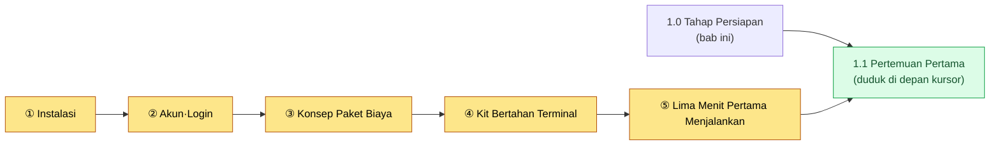
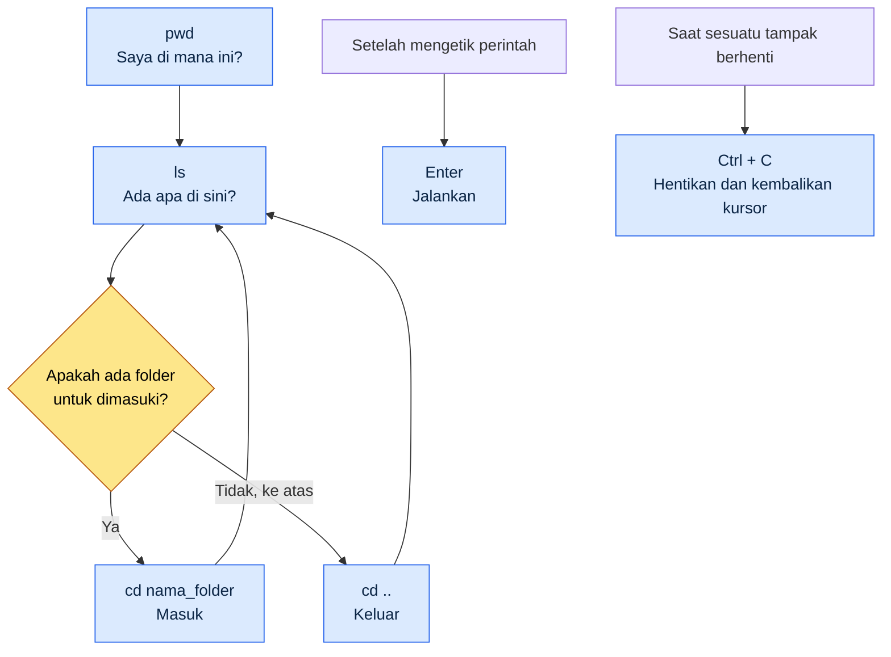
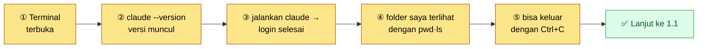

# 1.0 Sebelum Memulai — Instalasi, Akun, Biaya, dan Kit Bertahan Terminal

Bab 1.1 adalah "pertemuan pertama". Itulah momen ketika Anda duduk di depan kursor yang berkedip dan mencoba mengetikkan sesuatu. Namun untuk bisa duduk di kursi itu, ada beberapa hal yang harus disiapkan lebih dulu. Alatnya sudah terpasang, Anda sudah masuk (login), Anda sudah punya gambaran kasar tentang bagaimana biaya dikenakan, dan Anda bisa mengetikkan beberapa karakter di layar hitam. Bab ini berada satu langkah sebelum 1.1.

Banyak buku pengantar melewatkan tahap ini. Mereka menulis satu baris saja, "Buka terminal," lalu melanjutkan. Padahal pemula justru tersangkut tepat pada satu baris itu. Di mana terminalnya, apa yang harus dipasang, dan apa yang harus dilakukan ketika tulisan merah muncul saat memasang — orang yang berhenti di baris pertama tidak akan pernah sampai ke 1.1. Tujuan bab ini hanya satu: memastikan Anda tidak tersangkut di baris pertama.

Bab ini terdiri atas lima bagian: instalasi, akun dan login, konsep paket biaya, kit bertahan terminal, dan daftar periksa "lima menit pertama menjalankan". Jika Anda mengikutinya secara berurutan, persiapan untuk duduk di kursi 1.1 akan selesai.



---

## 1.0.1 Instalasi — Satu Baris untuk Tiap OS

Prinsipnya, ikuti panduan resmi saat memasang. Alat sering berubah, dan berkas instalasi yang diunduh dari jalur tidak resmi itu berbahaya. Karena itu buku ini tidak mencantumkan tautan unduhan, melainkan memandu cara menemukan jalur resmi. Jika Anda mengetik "Claude Code dokumentasi resmi" atau "Claude Code install" di kotak pencarian, halaman dokumentasi resmi Anthropic akan muncul paling atas. Cara teraman adalah menggunakan perintah instalasi persis seperti yang tertera di halaman itu.

Ada baiknya Anda memahami gambaran besarnya. Claude Code (buku ini menyeragamkan penulisannya dalam bahasa Inggris) adalah alat yang berjalan di terminal, dan biasanya dipasang dengan perintah satu baris. Alurnya sedikit berbeda untuk tiap OS.

| OS | Yang Diperlukan | Alur Instalasi (konsep) |
|---|---|---|
| Windows | PowerShell (bawaan) | Tempelkan satu baris perintah instalasi dari dokumentasi resmi ke PowerShell |
| macOS | Terminal (bawaan) | Tempelkan satu baris perintah instalasi dari dokumentasi resmi ke Terminal |
| Linux | Terminal | Tempelkan satu baris perintah instalasi dari dokumentasi resmi ke Terminal |

Pada ketiga OS, alurnya sama: "Buka terminal → tempelkan satu baris dari dokumentasi resmi → tekan Enter." Anda tidak perlu menghafal perintahnya. Yang baku adalah menyalin dan menempelkannya dari dokumentasi resmi.

Jika tulisan merah (error) muncul saat memasang, Anda tidak perlu panik. Error instalasi yang ditemui pemula umumnya salah satu dari dua hal: masalah izin, atau ketiadaan alat prasyarat (misalnya runtime seperti Node.js). Jika tulisan merah muncul, salin seluruh kalimat itu apa adanya lalu cari di mesin pencari atau tanyakan ke AI, dan sembilan dari sepuluh kali masalahnya akan terpecahkan. Pesan error bukanlah musuh, melainkan petunjuk.

> Cara memastikan instalasi berhasil: ketik `claude --version` di terminal lalu tekan Enter. Jika satu baris nomor versi muncul, instalasi berhasil. Jika muncul pesan semacam "command not found" (perintah tidak ditemukan), berarti instalasi belum selesai atau Anda perlu membuka terminal yang baru. Tutup terminal sepenuhnya, buka kembali, lalu periksa sekali lagi.

---

## 1.0.2 Akun dan Login

Selesai memasang bukan berarti langsung bisa dipakai. Claude Code adalah alat yang meminjam model AI dari Anthropic, sehingga diperlukan tahap login untuk memastikan siapa yang memakainya.

Alurnya sederhana. Saat Anda menjalankan `claude` untuk pertama kali di terminal, panduan login akan muncul. Biasanya peramban web terbuka secara otomatis, dan di sana Anda cukup masuk dengan akun Anthropic (jika belum punya, Anda bisa membuatnya di layar itu juga). Setelah login selesai, peramban menampilkan panduan semacam "Anda sudah bisa kembali ke terminal," dan di sisi terminal pun muncul tanda selesai.

Ada dua titik yang sering menyangkut pemula di sini.

Pertama, kasus ketika peramban tidak terbuka secara otomatis. Dalam hal ini, sebuah alamat panjang (URL) ditampilkan dalam satu baris di terminal. Salin alamat itu, tempelkan ke kolom alamat peramban, lalu masuk. Anda tidak benar-benar tersangkut — hanya perlu satu langkah manual tambahan.

Kedua, kasus tertukar jenis akun. Bagaimana akun yang Anda pakai di obrolan web (Claude.ai) terhubung dengan akun dan biaya Claude Code bisa berbeda kebijakannya dari waktu ke waktu. Yang paling akurat adalah mengikuti panduan di layar login dan dokumentasi resmi. Jika Anda mengikuti apa yang diminta layar saat pertama dijalankan, login umumnya berjalan tanpa kendala.

Login cukup dilakukan sekali dan akan tetap tersimpan di PC tersebut. Anda tidak perlu mengulanginya setiap kali.

---

## 1.0.3 Konsep Paket Biaya — Langganan Tetap vs API Pakai-Bayar

Bagian yang paling membuat pemula cemas adalah "berapa biayanya nanti?". Ada ketakutan samar bahwa biaya bertambah setiap kali mengetik sebuah karakter. Jika Anda memahami gambaran besarnya lebih dulu, kecemasan ini akan berkurang. Cara penagihan secara garis besar terbagi dua.

| Cara | Bentuk Penagihan | Perumpamaan | Untuk Siapa |
|---|---|---|---|
| Langganan tetap | Jumlah tetap per bulan | Paket tarif telekomunikasi tetap | Pemula·penggunaan sehari-hari |
| API pakai-bayar | Sebanyak yang dipakai (per token) | Meteran listrik | Volume besar·otomatisasi·integrasi pengembangan |

**Langganan tetap** adalah cara membayar jumlah tertentu per bulan dan memakainya sampai batas kuota. Mirip paket tarif ponsel berlangganan. Karena jumlah yang keluar sama setiap bulan, prediksinya mudah dan Anda tidak perlu memikirkan "berapa biaya tiap baris yang saya ketik". Karena itu, biasanya pemula lebih tenang jika memulai dengan langganan tetap (perkiraan penulis — karena susunan paket dan kuota yang tepat berubah dari waktu ke waktu, periksa di halaman biaya resmi). Jika melewati kuota, Anda menunggu hingga siklus berikutnya atau menaikkan ke paket yang lebih tinggi.

**API pakai-bayar** adalah cara penagihan yang sebanding dengan jumlah yang benar-benar dipakai (token). Seperti meteran listrik, Anda ditagih sebanyak yang dipakai. Cara ini cocok untuk pemrosesan volume besar, alur kerja otomatis (pipeline), atau integrasi dengan program lain. Jika digunakan dengan cermat, ia efisien, tetapi pada tahap awal prediksi biayanya bisa sulit sampai Anda punya rasa terhadap volume pemakaian.

Apa itu token dan mengapa penagihan dilakukan berdasarkan token dibahas lebih rinci di 1.2 (Model AI·Token·Harness). Di sini Anda cukup mengingat satu hal saja. **Pemula biasanya memulai dengan langganan tetap.** Sebab jumlah tiap bulan tetap, sehingga Anda bisa berlatih tanpa rasa takut "jangan-jangan tiba-tiba kena tagihan besar saat dipakai". Karena nama paket, harga, dan kuota sering berubah, buku ini tidak mencantumkan angka tertentu. Isi buku ini ditulis dengan acuan pertengahan tahun 2026, dan paket biaya, model, serta fitur akan terus berubah setelahnya. Nilai terkini paling akurat diperiksa di halaman biaya resmi.

> Ringkasan satu baris: ketakutan jangan-jangan biaya keluar tiap kali memakai → dengan langganan tetap, jumlahnya tetap setiap bulan. Untuk pemula, memulai dengan langganan tetap membuat hati lebih tenang.

---

## 1.0.4 Kit Bertahan Terminal — Mengurangi Rasa Takut pada Layar Hitam

Sekarang tembok terbesarnya: layar hitam. Inilah alasan mengapa 1.1 dimulai dengan "tersendat di depan kursor yang berkedip". Bagi tangan yang sudah 24 tahun bekerja dengan GUI, terminal terasa asing. Namun perintah yang dibutuhkan agar tidak tersangkut di baris pertama tidaklah banyak. Enam perintah berikut sudah cukup.

| Perintah | Cara Membaca | Fungsinya | Perumpamaan |
|---|---|---|---|
| `pwd` | pi-dabel-yu-di | Menunjukkan folder mana yang sedang saya tempati | "Saya di mana ini?" |
| `ls` | el-es | Daftar isi folder saat ini | Membuka jendela folder |
| `cd nama_folder` | si-di | Masuk ke dalam folder itu | Klik ganda folder |
| `cd ..` | si-di titik titik | Keluar ke folder satu tingkat di atas | Tombol kembali |
| `Enter` | enter | Menjalankan perintah yang diketik | Tombol konfirmasi |
| `Ctrl + C` | kontrol si | Menghentikan apa yang sedang berjalan | Tombol stop |

(Pada Windows PowerShell pun `ls`·`cd`·`pwd` tetap berfungsi. Di macOS·Linux juga sama. Karena itu enam perintah ini tidak memilih-milih OS.)

Jika fungsi keenam perintah ini digambarkan, hasilnya seperti berikut. Berpindah di terminal pada akhirnya hanyalah keluar-masuk folder, dan itu sama dengan tindakan klik ganda folder atau kembali ke belakang di GUI.



Alasan sebenarnya layar hitam terasa menakutkan adalah perasaan "kalau salah ketik, sepertinya akan rusak". Namun di antara keenam perintah di atas tidak ada satu pun yang merusak sesuatu. `pwd`·`ls`·`cd` hanya melihat atau berpindah, tidak menghapus atau mengubah berkas. `Enter` hanyalah menjalankan, `Ctrl + C` hanyalah menghentikan. Jadi keenam perintah ini boleh Anda ketik dengan tenang kapan saja.

Ada kalanya layar tampak seperti berhenti. Yaitu ketika Anda sudah mengetik perintah tetapi lama tidak ada respons, atau kursor berkedip di baris lain seolah menunggu sesuatu yang lain. Saat itu, tekan `Ctrl + C` sekali dan biasanya Anda akan kembali ke kursor semula. Cukup dengan mengetahui bahwa ada "tombol stop" ini saja, layar hitam terasa jauh lebih tidak menakutkan. Jika tersangkut, keluar dengan `Ctrl + C` lalu mulai lagi.

Terakhir, ketika karakter yang Anda ketik menumpuk banyak dan terasa kacau, Anda bisa mengosongkan layar. Windows PowerShell·macOS·Linux semuanya mengosongkannya dengan perintah `clear`. Mengosongkan layar tidak menghilangkan apa yang sudah dikerjakan; hanya karakter yang terlihat saja yang dirapikan.

---

## 1.0.5 Daftar Periksa "Lima Menit Pertama Menjalankan"

Jika Anda sudah sampai di sini, persiapan sudah selesai. Jika Anda bisa melewati lima kolom berikut dalam waktu lima menit, Anda telah memenuhi syarat untuk duduk di kursi 1.1. Jika tersangkut pada satu kolom saja, kembalilah ke subbab terkait (1.0.1\~1.0.4).



- [ ] ① Saya bisa membuka terminal (Windows: PowerShell / macOS: Terminal)
- [ ] ② Saat saya mengetik `claude --version`, satu baris nomor versi muncul (konfirmasi instalasi)
- [ ] ③ Saat saya menjalankan `claude`, saya sudah dalam keadaan login (atau login selesai sesuai panduan)
- [ ] ④ Saya bisa melihat lokasi saat ini dengan `pwd` dan isi folder dengan `ls`
- [ ] ⑤ Saat sesuatu berhenti, saya bisa keluar dengan `Ctrl + C`

Jika kelima kolom sudah terisi, layar hitam bukan lagi tembok yang misterius. Alatnya sudah terpasang, Anda sudah login, Anda tahu gambaran besar cara penagihan, serta bisa berpindah dan berhenti di dalam layar. Bab 1.1 dimulai di atas persiapan ini. Anda tinggal beranjak ke momen itu — duduk di depan kursor yang berkedip dan untuk pertama kalinya mengetik "ringkas apa saja yang ada di folder ini".

---

## 1.0.6 Python·pip — Kalau Mau Menjalankan Alatnya (hanya saat diperlukan)

Bagian awal buku ini (Bagian 1·2) bisa diikuti hanya dengan prompt berbahasa alami. Namun mulai Bagian 4, sebagian bab langsung menjalankan skrip Python kecil (misalnya `pip install pyyaml`, `pip install pyvis`). Tidak masalah jika Anda baru pertama kali berkenalan dengan Python. Ada dua jalan.


Pertama, **jalan memasang sendiri.** Python diunduh dan dipasang dari python.org (pada layar instalasi, jangan lupa centang "Add to PATH"), lalu dipastikan dengan `python --version` di terminal. `pip` adalah alat pemasang paket yang ikut terpasang bersama Python, sehingga paket yang Anda butuhkan bisa diambil dalam satu baris seperti `pip install pyyaml`.

Kedua, **jalan menyerahkannya ke AI (disarankan).** Jalan yang lebih mudah adalah menyuruh AI sendiri yang menyiapkan lingkungannya. Anda cukup memintanya seperti ini di terminal.

```
Periksa apakah Python sudah terpasang, dan jika belum, beri tahu cara instalasi yang sesuai dengan OS saya.
Lalu berikan perintah satu baris untuk memasang paket pyyaml yang diperlukan di bab ini.
```

AI akan memeriksa lingkungan Anda dan membuatkan perintah instalasinya. Jika tersangkut, di tempat itu juga tempelkan pesan error apa adanya lalu tanyakan "bagaimana cara mengatasi error ini?". Untuk tiap bab yang menjalankan alat, satu pola ini sudah cukup. Pada tahap di mana Python·pip terasa memberatkan, bagian "Versi Ringkas Solo" di bab tersebut memandu jalan yang lebih ringan tanpa kode.

---

### Pratinjau Bab Berikutnya
- 1.1 Pertemuan Pertama Game Designer dengan Claude Code — bertahan 30 menit pertama di depan kursor

---

## Coba Sendiri

**setup**
1. Bukalah terminal pada OS yang Anda pakai (Windows: PowerShell, macOS: Terminal).
2. Cari "Claude Code dokumentasi resmi" lalu buka halaman panduan instalasi resmi.
3. Setel pengatur waktu ke 5 menit — tujuannya adalah melewati lima kolom daftar periksa 1.0.5.

**prompt** (ketik satu per satu, secara berurutan. Ini perintah, bukan pertanyaan berbahasa alami)
```
① claude --version      # Jika versi muncul, instalasi berhasil
② pwd                   # Folder mana yang sedang saya tempati
③ ls                    # Ada apa di folder ini
④ cd ..                 # Keluar satu tingkat ke atas (lalu ls lagi)
⑤ claude                # Jalankan Claude Code (jika panduan login muncul, ikuti saja)
```

**verify**
- Pada ①, jika satu baris nomor versi muncul, instalasi sudah selesai. Jika muncul "command not found", tutup terminal lalu buka kembali dan coba sekali lagi.
- Selagi melihat dan berpindah folder dengan ②·③·④, pastikan sendiri bahwa tidak ada apa pun yang rusak. Ketiganya adalah perintah aman yang hanya melihat dan berpindah.
- Jika tampak berhenti saat menjalankan ⑤, keluar dengan `Ctrl + C`. Jika Anda berhasil keluar, Anda telah membuktikan langsung melalui pengalaman bahwa "ada tombol stop".

### Versi Ringkas Solo

Jika Anda perorangan yang tidak punya tim maupun folder perusahaan, kuasai dulu instalasi (①) dan keluar dengan `Ctrl + C` saja. Dengan memastikan "alatnya terpasang" lewat `claude --version` dan "saya bisa keluar walau tersangkut" lewat `Ctrl + C`, separuh dari rasa takut pada layar hitam bisa dibereskan sendirian dalam waktu lima menit. Untuk biaya, jika Anda memulai dengan langganan tetap, Anda bisa berlatih sepuasnya tanpa khawatir soal biaya.
