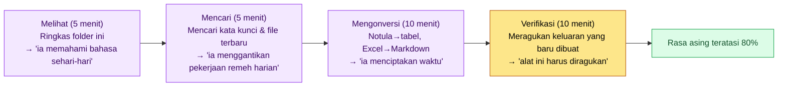

# 1.1 Perjumpaan Pertama Seorang Game Designer dengan Claude Code

Layar hitam muncul. Kursor berkedip. Di hadapannya duduk seorang Game Designer dengan pengalaman 24 tahun. Tangan yang selama 24 tahun bekerja dengan PowerPoint dan Excel, wiki dan Figma, berhenti sejenak di atas keyboard. Sekilas teringat zaman ketika masih ada kursus komputer, mirip DOS. Setelah itu, benda bernama terminal hanyalah sesuatu yang terlihat di meja para programmer. Tidak tahu harus mengetik apa, dan rasanya kalau salah ketik, sesuatu akan rusak. Keraguan inilah titik awal buku ini.

Kebanyakan orang menutup jendelanya di titik ini. Lalu di rapat mereka kembali mengulang, "Kita juga harus mencoba sesuatu." Bab ini ikut duduk di posisi orang yang tidak menutup jendela itu dan bertahan selama 30 menit pertama. Tujuannya bukan strategi adopsi yang muluk-muluk, melainkan memberi Anda hal konkret untuk dipegang: apa yang bisa Anda ketik di depan kursor yang berkedip untuk mencairkan rasa asing itu.

---

Ketika seorang Game Designer pertama kali duduk di depan alat pengodean AI seperti Claude Code, rasa kagum dan rasa tidak nyaman muncul bersamaan di tempat yang sama. Fakta bahwa kedua emosi ini berbenturan justru menjadi petunjuk pertama dalam adopsi.

Alasan kagumnya jelas. Pemeriksaan konsistensi sheet data yang biasanya memakan setengah hari kini selesai dalam hitungan menit, notula rapat yang berlarut-larut diringkas menjadi tabel keputusan, dan dokumen desain yang terkubur setahun lalu bisa ditarik kembali hanya dengan satu kalimat bahasa sehari-hari.

Alasan tidak nyamannya pun sama jelasnya. Layar hitam, kursor yang berkedip, dan perintah berbahasa Inggris terlalu berbeda dari lanskap pekerjaan sehari-hari. Hari-hari seorang Game Designer mengalir di atas GUI, sementara tindakan mengetik huruf di terminal hitam terasa kurang menyatu dengan identitas profesi. Namun, rasa tidak nyaman ini bukan cacat alatnya, melainkan biaya adaptasi bagi orang yang sudah terbiasa dengan GUI. Hanya dengan mengakui satu hal ini saja, separuh rasa asing itu sudah terselesaikan.

Buku ini hadir untuk mengurangi rasa asing tersebut. Subbab 1.1 ikut duduk di tempat perjumpaan pertama dan merangkum apa yang perlu dilihat, apa yang perlu dicoba, dan apa yang boleh ditunda untuk sementara.

---

## 1.1.1 Mengapa Sekarang Seorang Game Designer Harus Menggunakan AI

Game design bergabung dengan arus AI lebih lambat dibanding profesi lain. Orang-orang yang menangani kode masuk lebih dulu, lalu diikuti desainer dan artis. Game Designer sering kali terjebak pola menunda sambil mengulang, "Kita juga harus mencoba sesuatu."

Alasan menundanya masuk akal. Hasil kerja seorang Game Designer tidak terstandardisasi seperti kode; teks, tabel, diagram, rapat, dan kesepakatan lisan tercampur menjadi satu. Keandalan keluaran AI tampak rendah, kebohongan yang terdengar meyakinkan terasa berbahaya, dan apakah AI benar-benar memahami sistem game pun masih diragukan.

Namun, di antara tahun 2024–2026, ada tiga hal yang berubah.

Pertama, kemampuan penalaran model AI telah melewati titik kritis. Ia tidak lagi sekadar menghasilkan kalimat sederhana, melainkan menangani desain sistem yang kompleks, verifikasi konsistensi, dan analisis dampak. Seri Claude terbaru membantu sebagian besar alur kerja game design. Namun, ini tidak berarti semuanya bisa diserahkan. Verifikasi dan tanggung jawab tetap menjadi bagian manusia. (Cakupan bantuannya sangat bervariasi tergantung jenis pekerjaan dan kematangan tim — perkiraan penulis, belum terverifikasi.)

Kedua, harness telah matang. Alat seperti Claude Code bukan sekadar chat. Ia membaca dan menulis file secara langsung, menjalankan perintah, dan menerima kembali hasilnya sebagai masukan. Cara kerjanya menyerupai cara manusia bekerja.

Ketiga, teknik operasional seperti memori, atom, dan skill telah mapan. AI tidak dipakai sekali lalu selesai; melainkan ada metodologi yang mengakumulasi pengetahuan tim sehingga semakin lama semakin cerdas. Bagian akhir buku ini membahas inti dari akumulasi inilah.

Ketika ketiga hal ini berkumpul, adopsi AI pun menjadi pilihan yang masuk akal bagi seorang Game Designer. Memulai sebelum terlambat adalah keuntungan.

---

## 1.1.2 Apa Itu Claude Code — Perbedaannya dengan Alat Lain

Alat AI yang biasa ditemui seorang Game Designer ada dua jenis. Tipe chatbot yang melempar pertanyaan ke jendela chat (ChatGPT, aplikasi web Claude) dan tipe terintegrasi editor yang melakukan pelengkapan otomatis di dalam editor kode (Cursor, Copilot).

Claude Code adalah jenis ketiga. Ia bekerja di CLI (terminal) dan mengakses keseluruhan lingkungan kerja seseorang. Berikut adalah satu lembar yang menunjukkan di mana ketiga jenis ini berbeda.

<svg viewBox="0 0 720 300" xmlns="http://www.w3.org/2000/svg" font-family="sans-serif" font-size="13">
  <rect x="0" y="0" width="720" height="300" fill="#fafafa" stroke="#ddd"/>
  <!-- column headers -->
  <rect x="200" y="10" width="160" height="34" fill="#eef2f7" stroke="#bbb"/>
  <text x="280" y="32" text-anchor="middle" font-weight="bold">Tipe Chatbot</text>
  <rect x="360" y="10" width="160" height="34" fill="#eef2f7" stroke="#bbb"/>
  <text x="440" y="32" text-anchor="middle" font-weight="bold">Tipe Terintegrasi Editor</text>
  <rect x="520" y="10" width="180" height="34" fill="#e8f0e6" stroke="#9bbf8f"/>
  <text x="610" y="32" text-anchor="middle" font-weight="bold">Claude Code</text>
  <!-- rows -->
  <text x="10" y="68" font-weight="bold">Lokasi Input</text>
  <text x="280" y="68" text-anchor="middle">Jendela chat web</text>
  <text x="440" y="68" text-anchor="middle">Editor kode</text>
  <text x="610" y="68" text-anchor="middle" font-weight="bold">Terminal</text>
  <line x1="10" y1="80" x2="700" y2="80" stroke="#e0e0e0"/>
  <text x="10" y="108" font-weight="bold">Akses File</text>
  <text x="280" y="108" text-anchor="middle">Perlu diunggah</text>
  <text x="440" y="108" text-anchor="middle">File yang terbuka</text>
  <text x="610" y="108" text-anchor="middle" font-weight="bold">Seluruh proyek</text>
  <line x1="10" y1="120" x2="700" y2="120" stroke="#e0e0e0"/>
  <text x="10" y="148" font-weight="bold">Eksekusi Perintah</text>
  <text x="280" y="148" text-anchor="middle">Tidak bisa</text>
  <text x="440" y="148" text-anchor="middle">Sebagian bisa</text>
  <text x="610" y="148" text-anchor="middle" font-weight="bold">Bebas (dalam izin)</text>
  <line x1="10" y1="160" x2="700" y2="160" stroke="#e0e0e0"/>
  <text x="10" y="188" font-weight="bold">Bentuk Keluaran</text>
  <text x="280" y="188" text-anchor="middle">Teks</text>
  <text x="440" y="188" text-anchor="middle">Usulan kode</text>
  <text x="610" y="188" text-anchor="middle" font-weight="bold">Perubahan file & hasil eksekusi</text>
  <line x1="10" y1="200" x2="700" y2="200" stroke="#e0e0e0"/>
  <text x="10" y="228" font-weight="bold">Kecocokan Desain</text>
  <text x="280" y="228" text-anchor="middle">Rendah</text>
  <text x="440" y="228" text-anchor="middle">Rendah</text>
  <text x="610" y="228" text-anchor="middle" font-weight="bold" fill="#3a7a2f">Tinggi</text>
  <line x1="10" y1="240" x2="700" y2="240" stroke="#e0e0e0"/>
  <text x="10" y="270" font-weight="bold">Perumpamaan</text>
  <text x="280" y="270" text-anchor="middle">Meja resepsionis</text>
  <text x="440" y="270" text-anchor="middle">Pena pelengkap otomatis</text>
  <text x="610" y="270" text-anchor="middle" font-weight="bold">Rekan kerja di sebelah</text>
</svg>

Pekerjaan seorang Game Designer bukanlah kode, melainkan dokumen, tabel, dan relasi. Kekuatan Claude Code terletak pada kemampuannya melihat, memahami, dan memanipulasi seluruh folder tempat seseorang bekerja. Anda tidak perlu menyalin dan menempel materi setiap kali seperti pada chatbot.

Dengan perumpamaan kantor, tipe chatbot itu seperti meja resepsionis. Satu pertanyaan, satu jawaban, dan materinya harus dikeluarkan lagi setiap kali. Claude Code lebih mirip rekan kerja di meja sebelah. Ia tahu di mana materinya berada, membuka file dengan tangannya sendiri, dan merapikan hasilnya lalu meletakkannya kembali di meja. Walaupun sama-sama Claude, pekerjaan yang dikuasainya berbeda tergantung di meja mana ia didudukkan.

---

## 1.1.3 30 Menit Pertama — Apa yang Dilihat dan Apa yang Dicoba

Instalasi dan konfigurasi dibahas di subbab 1.0. Subbab 1.1 berfokus pada apa yang perlu dialami dalam 30 menit pertama agar rasa asing berkurang. 30 menit pertama terbagi menjadi empat segmen, dan di setiap segmen sebagian rasa asing menghilang secara bertahap.



### 5 Menit Pertama — Melihat

Saat Anda membuka terminal dan menjalankan Claude Code, layar hitam muncul dan kursor berkedip. Banyak orang berhenti di titik ini, tetapi kalau berhenti, Anda kehilangan kesempatan pertama untuk mencairkan rasa asing. Ketiklah satu kalimat dalam bahasa sehari-hari.

```
Tolong ringkas apa saja yang ada di folder ini
```

Ini satu kalimat, bukan kode maupun perintah. Claude Code memindai struktur folder, lalu merapikan dan menjawab file apa saja yang ada dan tampak sebagai proyek yang menangani apa. Jika Anda mengetik baris ini di folder berisi dokumen desain, kira-kira respons seperti inilah yang kembali.

```text
> Tolong ringkas apa saja yang ada di folder ini

Saya telah memindai folder ini. Tampaknya ini folder kerja untuk data game & dokumen desain.

  Jenis File       Jumlah  Perkiraan Isi
  ─────────────   ────    ───────────────────────────
  .xlsm            12     Sheet data (item, quest, NPC, dll.)
  .md              34     Draf dokumen desain & notula rapat
  .png             88     Mockup UI & gambar referensi
  Subfolder         6     /data /docs /ref /meeting /export /tmp

Observasi:
  - Di folder /meeting menumpuk 5 notula rapat dari seminggu terakhir.
  - item_table.xlsm dan quest_table.xlsm tampak berbagi
    kolom ID yang sama (kandidat FK).
  - Di folder /tmp ada banyak file export sementara — mungkin perlu dirapikan.

Mana yang ingin Anda telusuri lebih dulu?
```

Dari satu respons ini, fakta bahwa "alat ini memahami bahasa sehari-hari, bukan perintah" masuk ke dalam diri Anda secara langsung. Pengalaman menerima gambaran rapi tentang apa yang ada di mana, tanpa harus membuka folder secara langsung, mengikis separuh rasa asing seketika di tempat itu.

### 5 Menit Berikutnya — Mencari

Mintalah pencarian kecil. Permintaan seperti "Beri tahu saya 5 file Markdown yang diubah dalam seminggu terakhir" atau "Di file mana ada kata 'reward'?". Pekerjaan yang biasa dilakukan seorang Game Designer setiap hari — membuka Find in Files, mengetik kata kunci, lalu menggulir hasilnya — diterima Claude Code dalam bahasa sehari-hari, dirapikan, dan dikembalikan. Sensasi bahwa alat ini menggantikan pekerjaan remeh harian akan tertanam di 5 menit kedua ini.

### 10 Menit Berikutnya — Mengonversi

Mintalah konversi kecil. Permintaan seperti "Ekstrak hanya keputusan dari notula rapat ini dan buatkan tabel" atau "Ubah baris 1–10 sheet Excel ini menjadi tabel Markdown". Pengalaman konversi yang secara manual butuh 5–10 menit, lalu selesai dalam waktu singkat, mengantar pada sensasi bahwa alat ini tidak berhenti pada menggantikan pencarian, melainkan menciptakan waktu untuk Anda.

### 10 Menit Terakhir — Verifikasi

Alasan mengapa berbahaya jika berhenti di sini adalah karena AI bisa berbohong dengan meyakinkan. Buatlah AI meragukan sendiri keluaran yang baru saja ia buat.

```
Tolong periksa lagi apakah tabel yang baru kamu buat cocok dengan aslinya. Ada item yang terlewat?
```

Maka Claude Code akan membaca ulang aslinya, membandingkan keluarannya sendiri baris demi baris, dan melaporkan ketidakcocokan. Pada segmen ini sering muncul layar seperti ini.

```text
> Tolong periksa lagi apakah tabel yang baru kamu buat cocok dengan aslinya. Ada item yang terlewat?

Saya telah membandingkan ulang aslinya (meeting_0603.md) dengan tabel yang baru saya buat.
Saya menemukan 3 ketidakcocokan.

  ⚠ Terlewat  "Penurunan reward tutorial 50%" — ada di baris 12 aslinya tetapi tidak ada di tabel
  ⚠ Salah tulis  Penanggung jawab "Kim OO" → di tabel keliru ditulis "Lee OO"
  ⚠ Ambigu   "Pembahasan ulang reward" — tidak jelas dari teks aslinya apakah ini keputusan atau ditunda.
           Saya memasukkannya ke 'keputusan' atas penilaian sendiri, tetapi perlu dikonfirmasi.

Apakah saya buatkan ulang tabel yang sudah dikoreksi? Beri tahu saya
bagaimana menangani item yang ambigu, akan saya terapkan.
```

Bahwa alat ini mampu meragukan keluarannya sendiri, dan bahwa ia melakukan keraguan itu bersama manusia, adalah inti dari 10 menit terakhir. Sikap balik bertanya seperti pada item ketiga — "saya menilai sendiri, jadi tolong dikonfirmasi" — adalah pengaman yang menyisakan verifikasi di tangan manusia.

Setelah 30 menit berlalu, 80% rasa asing sudah menghilang. Sisa 20% akan berkurang perlahan di bab-bab berikutnya.

---

## 1.1.4 Pemandangan dari Perusahaan — Enam Bulan Sebuah Tim Menengah

Sebuah proyek MMORPG yang penulis kelola sebagai Design Director (selanjutnya disebut "Proyek A") telah menjalankan alur kerja berbasis Claude Code selama sekitar 6 bulan bersama tim desain (4–5 orang) (tim pengembangan Proyek A secara keseluruhan berukuran menengah, 10–50 orang). Berikut beberapa pemandangannya.

Mari kita pisahkan satu kasus yang paling konkret dengan pengukuran nyata. Yaitu pemeriksaan konsistensi FK (foreign key/kunci asing) yang menjangkau lebih dari 30 sheet data. Ini pekerjaan menelusuri dengan mata manusia apakah ID di satu sheet direferensikan dengan benar di sheet lain, dan semakin bertambah sheet-nya, kombinasinya membengkak secara eksponensial.

- **Before**: Seorang Game Designer membuka sheet bergantian untuk membandingkan ID. Satu kali putaran melalui 30-an sheet butuh setengah hari (sekitar 4 jam). Kalau konsentrasi terputus di tengah, ada baris yang terlewat.
- **After**: Alat deteksi relasi membandingkan FK antar-sheet secara otomatis dan hanya mengeluarkan daftar referensi yang rusak. Satu kali putaran sekitar 5 menit.

Dari setengah hari menjadi 5 menit. Saya tidak akan menggeneralisasi satu baris ini. Pekerjaan lain punya margin penghematan yang lebih kecil, atau malah menambah waktu peninjauan baru. Pemandangan-pemandangan lain yang saya lihat selama 6 bulan yang sama hanya saya tuliskan dalam arah dan proporsi.

- Ekstraksi keputusan dari notula rapat (akumulasi 5–10 kasus per minggu): pekerjaan yang dilacak manusia dengan pencarian & menggulir → tabel ekstraksi otomatis. Beban pelacakan hampir hilang.
- Draf GDD (Game Design Document): waktu penulisan turun menjadi kurang dari separuh, tetapi sebagai gantinya waktu peninjauan & penghalusan bertambah. Total berkurang, namun pusat gravitasi pekerjaan bergeser dari 'menulis' ke 'menilai'.
- Diagram relasi sheet data: struktur dependensi yang berulang dijelaskan secara lisan di rapat → dibuat sekali sebagai HTML interaktif lalu dibagikan.

Akumulasi waktu yang dihemat selama 6 bulan setelah setiap alat dibuat sekali, menurut penghayatan penulis, bukan dalam satuan person-week melainkan person-month (penjumlahan persisnya belum diukur, masih perkiraan). Dengan waktu itu, kami bisa berfokus pada desain yang lebih mendalam.

Alat semacam ini, sekali dibuat, akan bekerja lama. Namun, 'lama' tidak otomatis berarti 'tanpa awak'. Ia bertahan lama hanya kalau orang yang mengoperasikan dan struktur verifikasi disiapkan bersama-sama; jika alatnya ditinggal dan orangnya pergi, ia membusuk dalam dua kuartal. Bagian-bagian akhir buku ini membahas bagaimana masing-masing alat di atas dibuat dan dioperasikan.

---

## 1.1.5 Ketakutan dan Harapan — Membahasnya dengan Jujur

Mari kita bahas dengan jujur ketakutan yang umum dimiliki seorang Game Designer di depan alat AI. Membahasnya tanpa menghindar adalah langkah pertama adopsi.

Ketakutan bahwa "AI menggantikan pekerjaan saya" separuh benar, separuh salah. Pekerjaan remeh sederhana (pemeriksaan konsistensi, konversi dokumen, pencarian) memang digantikan AI, tetapi keputusan, prioritas, dan desain emosi pemain tidak bisa digantikan. Sebaliknya, Game Designer yang pandai memakai AI terbebas dari pekerjaan remeh dan berfokus pada esensi. Mari bertanya pada diri sendiri: "Berapa rasio pekerjaan remeh dan esensi dalam pekerjaan saya?" Kalau pekerjaan remeh 70%, maka esensi 30% tetap menjadi bagian Anda sendiri, dan intinya 30% itu justru menjadi lebih penting.

Pertanyaan "Kalau AI salah, siapa yang bertanggung jawab" juga sering muncul. Tanggung jawab atas keputusan seorang Game Designer selalu menjadi milik Game Designer itu. Menggunakan keluaran AI begitu saja tanpa verifikasi adalah kesalahan Game Designer, bukan kesalahan AI. Merancang prosedur verifikasi bersama-sama adalah bagian dari adopsi. 'Membuat AI meragukan keluarannya sendiri' yang kita lihat di 10 menit terakhir subbab 1.1.3 adalah benih terkecil dari prosedur itu.

Ketakutan "Saya tidak bisa pakai karena tidak paham kode" akan segera terurai. Claude Code bekerja dengan bahasa sehari-hari, jadi kalau tidak paham kode, Anda bisa mulai apa adanya sesuai keadaan itu. Karena Anda membaca skrip buatan AI bersama-sama, setelah beberapa bulan Anda akan bisa membaca dan memodifikasi skrip sederhana. Pembelajaran mengikuti dengan sendirinya.

"Alatnya berubah terlalu cepat" juga kekhawatiran yang umum. Kalau Anda berusaha mengejar semua model, fitur, dan tren, Anda akan kelelahan. Dalamilah hanya 1–2 fitur yang berguna bagi alur kerja Anda, dan sisanya lihat saat dibutuhkan.

Saya ingatkan lebih dulu. Walaupun layar respons di subbab 1.1.3 tampak mulus, dalam 30 menit pertama yang sesungguhnya akan tercampur jawaban yang meleset, ringkasan file yang ngawur, dan keluaran yang tersendat. Itu normal. Buku ini bukan kisah sukses yang mulus, melainkan lebih banyak membahas bagaimana meminta ulang keluaran yang meleset untuk membetulkannya.

---

## 1.1.6 Cara Menggunakan Buku Ini

Buku ini terdiri dari 24 bagian. Anda tidak harus membacanya berurutan dari awal sampai akhir. Pilih saja salah satu dari tiga pola berikut yang sesuai dengan situasi Anda.

| Pola | Jalur | Durasi |
|---|---|---|
| Pola Adopsi | Bagian 1 (Pendahuluan) → Bagian 2 (Arsitektur Informasi) → 1 bidang Anda sendiri | 1–2 bulan |
| Pola Lengkap | Bagian 1–2 → per bidang (3–15) → proses (16–19) → operasi (20–24) | 6 bulan–1 tahun, cocok untuk skala tim |
| Pola Pemecahan Masalah | Indeks lampiran → mundur ke bab terkait | Sekitar 1 minggu, saat ada masalah mendesak |

Kalau Anda bingung memilih jalur, bagilah berdasarkan posisi mana yang paling dekat dengan Anda. **Jika Anda Game Designer, PM, atau karyawan umum di luar game**, alih-alih tiga pola di atas, saya sarankan "Jalur Profesi Umum" (Bagian 1·2 → Bagian 17 notula rapat → Bagian 16 kolaborasi → Bagian 18 pengambilan keputusan → Bagian 21·22 perbaikan-diri & tata kelola) — bahkan dengan melewati bab-bab domain game, kerangka intinya tetap berdiri utuh, dan kotak "Penerapan di Luar Game" pada tiap bab menjadi jembatan untuk membacanya ke dalam profesi Anda sendiri (indeksnya di Lampiran F.5). Kalau tidak ada waktu, mengikuti empat bab saja — 17.1 → 16.2 → 22.1 → 21.1 — sudah cukup. **Jika Anda pembaca non-teknis yang baru memulai alat AI**, dengan "Pola Adopsi" peganglah erat satu bidang Anda sendiri (atau bidang yang paling dekat) sampai tuntas, dan untuk bagian bidang yang mendalam (4, 8, 11, dll.) cukup ambil 'satu baris untuk non-teknis' di bagian pendahuluannya, lalu turun ke isi utama saat dibutuhkan.

Setiap bab dalam buku ini tidak masuk sampai kedalaman akademis, melainkan berhenti di tingkat yang bisa dioperasikan. Tujuannya adalah memindahkan apa adanya teknik yang benar-benar berjalan selama 6 bulan di tim menengah, lalu berjalan bersama Anda menempuh jalan untuk mulai dari kecil dan membesarkannya.

---

## 1.1.7 Sambungan ke Bab Berikutnya

Subbab 1.1 adalah bab untuk mengurangi rasa asing. Subbab 1.2 masuk satu tingkat lebih dalam dan menjelaskan mekanisme dasar alat ini dengan bahasa yang ramah bagi Game Designer. Tujuan subbab 1.2 adalah membuat Anda tidak lagi takut pada kata-kata seperti model, token, konteks, dan harness. Penyiapan yang sesungguhnya (memori, izin, settings.json) dibahas di subbab 1.3.

---

### Poin-Poin Penting
- Rasa asing pada perjumpaan pertama bukan cacat alat, melainkan biaya adaptasi bagi orang yang terbiasa dengan GUI
- Claude Code bukan chatbot, melainkan lebih mirip rekan kerja di sebelah yang menangani seluruh folder
- Dengan melewati melihat, mencari, mengonversi, dan verifikasi masing-masing sekali dalam 30 menit pertama, 80% rasa asing menghilang

### Pratinjau Bab Berikutnya
- Bab 2. Model AI, Token, Harness — Mekanisme dasar untuk seorang Game Designer

---

## Coba Sendiri

**setup**
1. Bukalah terminal (Windows: PowerShell, macOS: Terminal).
2. Pindahlah ke folder tempat dokumen desain Anda terkumpul, lalu jalankan Claude Code (instalasi di 1.0).
3. Setel timer ke 30 menit — 5 menit (melihat), 5 menit (mencari), 10 menit (mengonversi), 10 menit (verifikasi).

**prompt** (satu baris per segmen, ketiklah secara berurutan)
```
① Tolong ringkas apa saja yang ada di folder ini
② Di file mana ada kata 'reward'?
③ Ekstrak hanya keputusan dari notula rapat ini dan buatkan tabel
④ Tolong periksa lagi apakah tabel yang baru dibuat cocok dengan aslinya. Ada item yang terlewat?
```

**verify**
- Pada ①, cocokkan dengan mata apakah ringkasan struktur folder sesuai dengan folder yang sebenarnya.
- Kalau laporan ketidakcocokan pada ④ keluar walau hanya satu kasus, berarti berhasil. Artinya Anda telah melihat sendiri adegan AI meragukan keluarannya sendiri.
- Kalaupun keluar jawaban yang meleset, itu bukan kegagalan. Meminta ulang seperti "barusan jawabannya salah, tolong lihat lagi file ini saja" pun termasuk bagian dari latihan 30 menit pertama.

### Versi Ringkas Solo

Jika Anda perorangan yang tidak punya tim maupun folder perusahaan, cobalah ketik hanya prompt ① dan ④ di atas pada salah satu folder kerja apa pun di PC Anda (misalnya folder Unduhan atau folder catatan). Dengan ① mengonfirmasi "ia memahami bahasa sehari-hari" dan dengan ④ mengonfirmasi "keluaran bisa diragukan", dua poin inti bab ini bisa Anda hayati sendirian dalam 5 menit pun.
