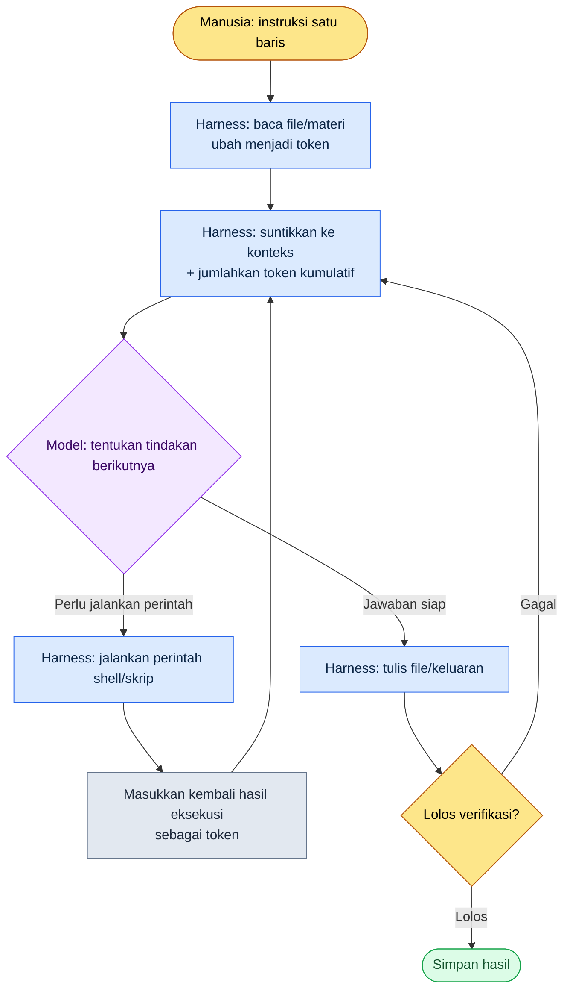

# 1.2 Model, Token, Harness — Jalan yang Dilalui Token dalam Satu Pekerjaan

Saat itu saya baru menyelesaikan satu pekerjaan lalu mengecek penggunaan. Lima notula rapat minggu ini menumpuk di sebuah folder, dan sebelum stand-up pagi Senin saya harus merangkum "hanya yang sudah diputuskan" ke dalam satu halaman. Saya menuliskan satu baris di jendela Claude Code: "Ambil hanya keputusan dari notula rapat di folder ini dan buatkan tabel." Kira-kira 0.4 detik setelah saya menekan Enter, tulisan abu-abu kecil berkedip di bagian bawah layar.

```
Reading meeting-2026-05-25.md ... (1,840 tokens)
Reading meeting-2026-05-27.md ... (2,310 tokens)
```

Tulisan abu-abu inilah tema bab ini. Ketika saya melemparkan satu kalimat berbahasa Korea, alat tersebut memotongnya menjadi token, membaca file menjadi token lalu memasukkannya ke model, menerima jawaban model, dan menuliskannya ke file. Setiap kali siklus bolak-balik ini berputar sekali, biaya dikenakan, dan materi menumpuk dalam "jangkauan pandang" model. Bab ini membongkar apa yang terjadi di balik tulisan abu-abu itu dengan bahasa seorang Game Designer. Empat kata sudah cukup: model, token, konteks, dan harness.

> **Catatan Istilah**
> - Model (model): otak yang menghasilkan jawaban. Ada berbagai jenis dengan ukuran dan karakter berbeda seperti Opus, Sonnet, dan Haiku.
> - Token (token): potongan teks yang dipotong halus. Penagihan, kecepatan, dan jangkauan pandang semuanya dihitung dalam satuan ini.
> - Context window (jendela konteks): jumlah maksimum token yang dapat ditampung model dalam pikirannya sekaligus.
> - Harness (harness): rangka yang membuat model bekerja. Claude Code adalah salah satu contohnya.

---

## 1.2.1 Loop Harness — Identitas Tulisan Abu-Abu

Tulisan abu-abu di atas bukan log acak, melainkan satu kotak dari sebuah siklus yang sudah ditetapkan. Apa yang dilakukan harness pada akhirnya adalah memutar lingkaran yang sama dengan cepat. Ia membaca file lalu memasukkannya ke model; jika model berkata "jalankan perintah ini", ia menjalankannya; lalu hasilnya dimasukkan kembali ke model. Lingkaran ini berputar sampai pekerjaan selesai.



Dalam gambar ini, kotak yang disentuh manusia hanya dua: paling atas (instruksi) dan paling bawah (memeriksa hasil verifikasi); lingkaran di tengah diputar harness secara otonom. Tulisan abu-abu yang berkedip lima kali sewaktu membaca lima notula rapat berarti kotak `Read → Inject` telah berputar lima putaran. Kalau ini chat web, Anda harus membuka kelima file secara langsung lalu menyalin dan menempelnya. Bahwa harness mengambil alih kerja itu menggantikan Anda — inilah perbedaan menentukan yang membuat chatbot dan harness berbasis CLI menjadi dua alat yang berbeda.

Setiap kali loop berputar satu putaran, token kumulatif dijumlahkan di kotak `Inject`. Karena itu, tanpa lebih dulu memahami token, baik biaya maupun batas loop ini tidak akan terlihat. Kita mulai dari token.

---

## 1.2.2 Token — Mata Uang Nyata yang Dibelanjakan Satu Pekerjaan

Token bukan huruf, melainkan potongan teks yang dipotong oleh model. Sebagai aturan praktis, bahasa Inggris kira-kira 4 huruf per token, sedangkan bahasa Korea mendekati 2 huruf per token (ini bukan konversi resmi, melainkan perkiraan operasional — nilai sebenarnya ditentukan oleh tokenizer model dan berbeda untuk tiap kalimat). Untuk bahasa Korea, 20 huruf termasuk spasi kira-kira setara 10 token.

Mari kita telusuri pekerjaan notula rapat tadi dalam satuan token (angka di bawah ini adalah satu kali pengukuran tunggal dari pekerjaan yang sama. Karena nilainya berubah tergantung volume notula dan panjang ringkasan, saya sarankan membacanya bukan sebagai nilai absolut melainkan sebagai orde besaran dan rasio).

| Tahap | Apa | Token (masukan) | Token (keluaran) |
|---|---|---|---|
| Instruksi | Satu baris "ambil hanya keputusan menjadi tabel" | \~25 | — |
| Membaca notula ×5 | Isi 5 file md | \~10,400 | — |
| Menyuntikkan aturan klasifikasi | 1 atom kategori rapat (JIT) | \~480 | — |
| Penalaran model & penyusunan tabel | 12 keputusan menjadi tabel | — | \~1,600 |
| Masukan ulang verifikasi | Pertanyaan ulang atas 1 kekurangan yang ditemukan linter | \~320 | \~210 |
| **Kumulatif** | | **\~11,225** | **\~1,810** |

Dua hal langsung terlihat. Pertama, instruksi yang saya ketik hanya 25 token, tetapi keseluruhan pekerjaan melebihi 11 ribu token hanya pada masukan. Hampir seluruh biaya datang bukan dari kalimat saya, melainkan dari materi yang dibaca oleh alat itu. Kedua, keluaran (1,810) hanya sekitar seperenam dari masukan (11,225). Sebagian besar otomatisasi perancangan memang banyak membaca dan sedikit menulis seperti ini. Karena itu, untuk menekan biaya, jauh lebih besar dampaknya mengendalikan volume materi masukan ketimbang memoles keluaran.

Setelah pekerjaan selesai, ketik `/context` dan Anda akan melihat seberapa besar konteks yang dipakai sesi itu. Kalau tidak menyadari token, ia mengalir keluar tanpa disadari seperti kertas cetak, tetapi begitu sekali dijadikan terlihat, sikap Anda berubah. Visualisasi inilah titik awal penghematan.

Alat untuk mengendalikan token bukan semangat penghematan yang abstrak, melainkan teknik-teknik konkret untuk memperlakukan materi masukan secara halus.

1. **Penyuntikan JIT** — alih-alih memuat seluruh materi terlebih dahulu, materi ditarik hanya saat dibutuhkan lewat pencocokan kata kunci. "Menyuntikkan aturan klasifikasi 480 token" pada tabel di atas adalah contohnya. Bukan seluruh dokumen aturan klasifikasi rapat (ribuan token), melainkan hanya satu atom yang cocok yang masuk.
2. **Cache ringkasan** — untuk dokumen panjang, sediakan versi ringkasan untuk AI terpisah dari aslinya untuk manusia. AI membaca versi ringkasan.
3. **Pemecahan atom** — kalau satu file hanya memuat satu keputusan (dijelaskan rinci di 2.2), hanya potongan yang dibutuhkan yang dapat ditarik secara tepat, sehingga token dihemat.
4. **Merapikan konteks** — kalau sesi memanjang, lakukan kompresi. Claude Code mendukung kompresi otomatis.
5. **Pemilihan model** — memakai model besar untuk konversi sederhana membuat token yang sama jadi lebih mahal. Inilah tema bagian berikutnya.

Di antaranya, nomor 1, penyuntikan JIT, adalah perangkat yang benar-benar berjalan di lingkungan kerja buku ini. Ketika satu baris masukan masuk, hook `inject_memory.py` mencocokkan atom memori berdasarkan urutan skor, memilih beberapa teratas saja untuk disuntikkan, dan tidak menghentikan alur kerja meski gagal (detail implementasi dijelaskan rinci di 1.3). Prinsip penghematan token — "hanya materi yang dibutuhkan, hanya beberapa teratas, dan diam-diam saja meski gagal" — termuat apa adanya dalam satu file kode.

---

## 1.2.3 Model — Rangka yang Sama, Mesin yang Berbeda

Model bagaikan mesin mobil, sehingga ke rangka yang sama bernama Claude Code dapat dipasangkan mesin berbeda bernama Opus, Sonnet, dan Haiku. Mengganti mesin mengubah sifat pekerjaan.

<svg viewBox="0 0 640 230" xmlns="http://www.w3.org/2000/svg" font-family="sans-serif" font-size="13">
  <rect x="0" y="0" width="640" height="230" fill="#fafafa" stroke="#ddd"/>
  <text x="20" y="28" font-size="15" font-weight="bold">Pencocokan Model — Kedalaman vs Kecepatan/Biaya</text>
  <!-- axes -->
  <line x1="80" y1="190" x2="600" y2="190" stroke="#888" stroke-width="1.5"/>
  <line x1="80" y1="190" x2="80" y2="55" stroke="#888" stroke-width="1.5"/>
  <text x="600" y="224" text-anchor="end" fill="#555">→ Cepat & murah</text>
  <text x="76" y="50" text-anchor="end" fill="#555">Kedalaman penalaran ↑</text>
  <!-- Opus -->
  <circle cx="150" cy="80" r="34" fill="#7b4fbf" opacity="0.85"/>
  <text x="150" y="78" text-anchor="middle" fill="#fff" font-weight="bold">Opus</text>
  <text x="150" y="94" text-anchor="middle" fill="#fff" font-size="11">Mesin besar</text>
  <text x="150" y="138" text-anchor="middle" fill="#444" font-size="11">Tinjauan desain & sintesis GDD</text>
  <!-- Sonnet -->
  <circle cx="330" cy="120" r="34" fill="#3a86c8" opacity="0.85"/>
  <text x="330" y="118" text-anchor="middle" fill="#fff" font-weight="bold">Sonnet</text>
  <text x="330" y="134" text-anchor="middle" fill="#fff" font-size="11">Mesin sedang</text>
  <text x="330" y="170" text-anchor="middle" fill="#444" font-size="11">Notula & 80% rutin harian</text>
  <!-- Haiku -->
  <circle cx="510" cy="155" r="34" fill="#2a9d6f" opacity="0.85"/>
  <text x="510" y="153" text-anchor="middle" fill="#fff" font-weight="bold">Haiku</text>
  <text x="510" y="169" text-anchor="middle" fill="#fff" font-size="11">Kompak</text>
  <text x="510" y="205" text-anchor="middle" fill="#444" font-size="11">Konversi sederhana sheet</text>
</svg>

Disesuaikan dengan pekerjaan perancangan, pembagiannya seperti ini. Pekerjaan yang membutuhkan penalaran mendalam dan konsistensi — seperti tinjauan desain sistem atau sintesis draf GDD (Game Design Document, dokumen spesifikasi rinci) yang menggabungkan berbagai materi — ke Opus; sebagian besar pekerjaan harian seperti ekstraksi keputusan dari notula atau ringkasan harian ke Sonnet; dan pekerjaan yang nyaris tanpa pertimbangan seperti konversi format sederhana sheet data ke Haiku. Menjalankan pekerjaan notula di bagian sebelumnya dengan Sonnet pun mengikuti kriteria ini — memilih keputusan dan memindahkannya ke tabel lebih cocok dengan keseimbangan dan kecepatan ketimbang penalaran mendalam.

Ada jebakan yang dijatuhi siapa pun di awal adopsi. Yaitu dorongan untuk menjalankan semua pekerjaan dengan mesin terbaik, yakni Opus. Kalau mengikuti dorongan itu, beban biaya dan kecepatan segera berbalik menjadi beban operasional, dan kepekaan untuk mencocokkan model dengan pekerjaan tidak akan tertanam. Keterampilan operasional yang sesungguhnya bukan memilih model di kepala setiap kali, melainkan mengunci pola dengan otomatisasi setelah polanya tertangkap.

- Penulisan retrospektif harian → otomatis Sonnet
- Tinjauan desain sistem → otomatis Opus
- Pemeriksaan konsistensi sheet data → otomatis Haiku

Penetapan semacam ini dilakukan dengan menuliskan model secara eksplisit di dalam settings.json atau slash command (dijelaskan rinci di 1.3). Sekali dikunci, repotnya memilih setiap kali pun lenyap.

Model merilis versi baru kira-kira setiap setengah tahun, dan meski namanya sama, 4.5 dan 4.6 itu berbeda. Saat versi baru muncul, bandingkan hanya lima pekerjaan inti dari alur kerja dengan masukan yang sama. Kalau berusaha menguji semuanya, Anda akan kelelahan. Perbedaan hasil dari kelima pekerjaan itu saja sudah cukup untuk memutuskan apakah perlu beralih.

---

## 1.2.4 Context Window — Batas yang Terisi oleh Loop

Tadi disebutkan bahwa setiap kali loop berputar satu putaran, token menumpuk di kotak `Inject`. Langit-langit yang dibentur oleh tumpukan itu adalah context window, yakni jumlah maksimum token yang dapat diproses model dalam sekali jalan. Bila diibaratkan manusia, inilah working memory (memori kerja).

- Seri Claude 4: standar 200K token, opsi perluasan 1M token
- 200K token ≈ setara sekitar 400 halaman A4 dalam bahasa Korea

Pekerjaan notula sebelumnya memiliki masukan kumulatif di kisaran 11 ribu token, sekitar 6% dari langit-langit 200K, jadi masih longgar. Namun kalau Anda menarik sesi panjang di jendela yang sama tanpa beralih pekerjaan, Anda mendekati langit-langit. Begitu terisi penuh, isi lama terpotong dan model mulai kehilangan "ingatan" bagian awal, lalu kompresi otomatis terpicu dan percakapan sebelumnya digantikan oleh versi ringkasan.

Ada empat kebiasaan untuk mengendalikan langit-langit ini.

| Pola | Kapan |
|---|---|
| Pemisahan sesi | Saat berpindah ke topik berbeda, buka sesi baru |
| Kompresi eksplisit | Saat satu pekerjaan selesai, sisakan intinya saja lalu kompres |
| Eksternalisasi memori | Materi yang sering dipakai dikeluarkan menjadi atom lalu disuntikkan lewat JIT saat itu juga |
| Visualisasi konteks | Periksa penggunaan saat ini dengan mata lewat `/context` |

Kasus berat yang sering ditemui Game Designer adalah pekerjaan yang sekaligus membutuhkan materi rapat, GDD, dan sheet data; di saat seperti inilah opsi 1M berguna. Namun karena 1M disertai beban biaya dan kecepatan, biasanya 200K sudah cukup dan opsi itu hanya dikeluarkan saat kumpulan materi benar-benar besar.

---

## 1.2.5 Saat Harness Benar-Benar Menyaring Kebohongan — Kotak Verifikasi

Kita kembali ke kotak `Lolos verifikasi?` di paling bawah gambar loop. Tanpa kotak ini, kebohongan model yang tampak meyakinkan akan langsung tersimpan ke file. Model kadang mengeluarkan jawaban yang salah dengan penuh percaya diri seolah-olah itu benar (halusinasi, hallucination), dan frekuensinya berkurang seiring naiknya generasi tetapi tidak pernah menjadi nol. Karena itu verifikasi ditempatkan sebagai kotak permanen.

Halusinasi yang berbahaya dalam perancangan bersifat konkret. Model mengutip kolom sheet data yang tidak ada, menghitung balancing dengan rumus yang salah, atau merangkum hal yang belum diputuskan dalam rapat seolah-olah sudah diputuskan. Dalam pekerjaan notula, yang paling menakutkan adalah yang ketiga — kasus di mana "hal yang hanya dibahas lalu ditangguhkan" menyelinap naik ke tabel keputusan.

Verifikasi memiliki lima pola.

1. **Pencocokan dengan sumber asli** — keluaran AI dibandingkan ulang dengan materi aslinya ("tolong periksa apakah ini benar-benar ada di materi itu").
2. **Konversi dua arah** — setelah diubah A→B, dikonversi balik B→A untuk melihat kecocokannya.
3. **Tinjauan sampel** — 3–5 keluaran acak diperiksa langsung oleh manusia.
4. **Otomatisasi linter** — diperiksa secara otomatis apakah keluaran melanggar format, rentang, atau aturan yang ditetapkan.
5. **Verifikasi silang dua model** — keluaran Sonnet ditinjau oleh Opus.

Kelimanya tidak dilakukan semua setiap kali, melainkan 1–3 yang dipilih sesuai tingkat risiko pekerjaan. Dalam pekerjaan notula, saya menggabungkan nomor 4 linter ("apakah keputusan memuat lengkap subjek, isi, dan tenggat") dengan satu kali tinjauan sampel nomor 3. Baris terakhir tabel token sebelumnya, "masukan ulang verifikasi 320 token", justru itulah putaran bolak-balik ketika linter menangkap kekurangan lalu menanyakannya kembali ke model — kalau diukur dengan gambar loop, ia berputar satu putaran lagi lewat `verifikasi gagal → Inject`.

Kalau manusia memverifikasi semuanya setiap kali, manfaat adopsi berkurang separuh, jadi verifikasi pun menjadi sasaran otomatisasi. Pada ekstraksi keputusan notula, linter memeriksa kekurangan format secara otomatis; pada konversi sheet data, jumlah baris, total, dan konsistensi kunci asing (FK); pada pembuatan GDD otomatis, kekurangan bagian inti. Yang lolos tidak perlu dilihat manusia, dan hanya yang tidak lolos yang dilihat. Pemandangannya seperti di antara dokumen yang memenuhi lemari, hanya mengambil folder bertanda merah ke tangan. Merancang agar pandangan manusia hanya jatuh ke tempat yang berbahaya — itulah tujuan otomatisasi verifikasi.

---

## 1.2.6 Tempat Keempat Kata Terangkai dalam Satu Pekerjaan

Sekarang mari kita rapikan bagaimana keempat kata terjalin dalam satu baris, dari awal sampai akhir pekerjaan notula itu.

| Kotak | Apa yang terjadi | Konsep mana |
|---|---|---|
| 1 | Menjalankan Claude Code di folder notula | Harness |
| 2 | Karena pekerjaannya analisis notula, Sonnet dipilih | Model |
| 3 | Total sekitar 11K token, masih dalam jendela 200K — OK | Token & konteks |
| 4 | Atom aturan klasifikasi rapat disuntikkan otomatis lewat JIT | Token (hemat) |
| 5 | Model mengeluarkan 12 keputusan menjadi tabel | Model & loop harness |
| 6 | Linter menangkap 1 kekurangan format → ditanyakan ulang lalu dilengkapi | Verifikasi (1 putaran loop tambahan) |
| 7 | Disimpan & di-commit sebagai `weekly-decisions-2026-W21.md` | Harness |

Kalau dikerjakan dengan tangan, membuka dan membaca lima notula, memilih hanya keputusan lalu menyalinnya, dan menyesuaikan formatnya butuh 30 menit. Begitu diotomatisasi, ia menyusut menjadi 5 menit, dan dalam 5 menit itu kerja tangan manusia hanya menyapu sekali sampel verifikasi. Waktu manusia jatuh hanya ke tempat yang benar-benar membutuhkannya (apakah hal yang ditangguhkan tidak salah naik menjadi keputusan). Yang menjadi inti bukanlah 25 menit yang dihemat, melainkan berubahnya tempat ke mana pandangan itu jatuh.

---

## 1.2.7 Kesalahpahaman yang Umum

"Opus selalu lebih baik" adalah yang paling umum. Itu benar kalau biaya dan kecepatan diabaikan, tetapi untuk pekerjaan sederhana Opus adalah pemborosan. Pencocokan per pekerjaan adalah jawabannya.

"Konteks 1M selalu dibutuhkan" juga sering muncul. Sebagian besar cukup dengan 200K, dan karena 1M disertai beban, ia hanya dipakai untuk kumpulan materi yang benar-benar besar.

"Verifikasi itu pekerjaan manusia" hanya benar separuh. Sebagian besar dapat diverifikasi secara otomatis, dan manusia berfokus pada sisanya.

"Token tidak perlu dipikirkan" sampai batas tertentu berlaku pada pekerjaan pribadi, tetapi kalau dipakai bersama banyak orang, biaya kumulatif membesar dengan cepat. Lebih aman menanamkan pola visualisasi dan penghematan sejak awal.

"Harness tidak ada bedanya" juga ternyata banyak. Model yang sama pun terbelah menjadi alat yang berbeda tergantung apakah chatbot atau CLI. Ada-tidaknya kerja salin-tempel yang kita lihat di awal adalah perbedaan itu.

---

## 1.2.8 Coba Sendiri

Putar langsung keempat kata bab ini dengan satu pekerjaan kecil.

**setup**

- Dalam keadaan Claude Code sudah terpasang, siapkan satu folder berisi 2–3 catatan teks (notula/memo).
- Buka Claude Code di folder itu.

**prompt**

```
Pilih hanya "yang sudah diputuskan" dari catatan-catatan di folder ini
dan buatkan tabel 3 kolom: subjek, isi, tenggat.
Kecualikan yang ditangguhkan atau masih dibahas, dan untuk setiap baris
yang dimasukkan ke tabel, tuliskan juga nama file asalnya.
```

**verify**

- Setelah pekerjaan selesai, ketik `/context` untuk melihat token yang dipakai sesi ini (Anda akan mendapati masukannya lebih besar dari dugaan).
- Pilih satu-dua baris tabel, buka nama file yang tertera, dan cocokkan dengan sumber asli apakah memang tertulis sebagai "keputusan" (verifikasi pencocokan sumber asli).
- Sapu sekali untuk memastikan hal yang ditangguhkan tidak salah naik ke tabel (tinjauan sampel).

**Versi Ringkas Solo**

Kalau Anda baru saja memulai alat ini, ambil dua hal saja dari atas. Pertama, serahkan catatan sefolder utuh dan jangan menyalin-tempel sendiri (serahkan ke loop harness). Kedua, tabel keluaran mutlak harus diterima dengan nama file, dan buka sumber asli hanya untuk baris yang mencurigakan. Pemilihan model atau visualisasi token tidak terlambat untuk ditambahkan setelah Anda terbiasa. Hanya dengan dua kebiasaan ini — tidak mengangkut materi dengan tangan dan mencocokkan keluaran dengan sumber asli — separuh dari adopsi sudah tertata.

---

### Poin-Poin Penting
- Harness memutar loop baca→eksekusi→masukan ulang secara otonom, dan manusia hanya menyentuh dua kotak: instruksi dan verifikasi
- Biaya satu pekerjaan datang hampir seluruhnya bukan dari instruksi yang saya ketik, melainkan dari materi yang dibaca oleh alat
- Model diganti-pasang sesuai pekerjaan, sedangkan langit-langit konteks dan verifikasi dikendalikan dengan otomatisasi

### Pratinjau Bab Berikutnya
- Bab 3. Infrastruktur Memori, Izin, dan Pengaturan — fondasi yang sekali diatur lalu bekerja selamanya
