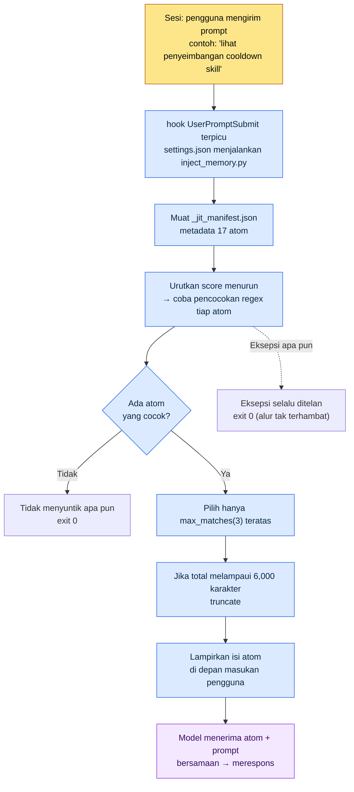

# 1.3 Infrastruktur Memori, Izin, dan Konfigurasi

Saya membuka sesi baru dan mengetik, "Coba kita lihat penyeimbangan cooldown skill." Sebelum menekan Enter, sebaris teks abu-abu kecil melintas di bagian bawah layar. `[memory injected: 2 atoms, 1,842 chars]`. Artinya, meskipun saya belum membuka satu berkas pun, dokumen aturan cooldown yang saya kunci jadi aturan minggu lalu sudah menempel di depan masukan model. Inilah sinyal pertama dari lingkungan kerja yang sudah terpasang infrastrukturnya. Begitu alat dinyalakan, alat itu sudah mengingat saya.

Agar adegan ini bisa terjadi, tiga hal harus lebih dulu menempati posisinya. Apa yang akan diingat AI (memori), apa yang boleh dilakukan AI tanpa persetujuan manusia (izin), dan sakelar pusat yang menghidupkan serta mematikan keduanya (settings.json). Waktu yang dibutuhkan untuk pemasangan pertama paling lama satu jam, dan satu jam itu akan kembali sebagai waktu yang dihemat setiap hari selama enam bulan berikutnya. Hampir seluruhnya adalah investasi yang terbayar kembali.

Bab ini adalah panduan langkah demi langkah (walk-through) yang membentangkan secara berurutan satu baris `settings.json` yang benar-benar saya jalankan di PC pribadi, `inject_memory.py` yang dipanggil baris itu, dan `_jit_manifest.json` yang dibaca berkas tersebut. Jika Anda membacanya sampai habis, Anda akan bisa menunjuk dengan tangan di berkas mana dan baris mana ungkapan "memori disuntikkan secara otomatis" itu sebenarnya terjadi.

---

## 1.3.1 settings.json — Satu Baris tempat Segalanya Bermula

Mari kita lihat kesimpulannya lebih dulu. Yang menghidupkan penyuntikan memori otomatis di PC pribadi saya hanyalah satu blok di dalam `settings.json`.

```json
{
  "hooks": {
    "UserPromptSubmit": [
      {
        "hooks": [
          {
            "type": "command",
            "command": "python ~/.claude/hooks/inject_memory.py"
          }
        ]
      }
    ]
  }
}
```

Jika diuraikan, inilah maksud blok tersebut. "Setiap kali terjadi peristiwa pengguna mengirimkan prompt (`UserPromptSubmit`), jalankan satu kali skrip Python bernama `inject_memory.py`." Itu saja. AI tidak mengingat dengan sendirinya karena pintar, melainkan strukturnya begini: setiap kali masukan datang, skrip yang sudah didaftarkan manusia menyisip satu kali.

`settings.json` adalah berkas pusat yang mengendalikan seluruh perilaku Claude Code, dan terbagi menjadi dua lapis.

- `~/.claude/settings.json` — global. Berlaku untuk semua sesi. Konfigurasi yang bisa dibagikan ke tim.
- `~/.claude/settings.local.json` — lokal. Berlaku hanya di PC ini. Konfigurasi khusus PC pribadi.

Keduanya diterapkan setelah digabungkan (merge). Karena itu, saya menempatkan hook dan izin yang perlu dibagikan tim di `settings.json`, sedangkan jalur absolut atau jalur alat pribadi yang hanya dipakai di PC rumah ini saya pisahkan ke `settings.local.json`. Pemisahan ini menghindari konflik git saat berkolaborasi dan mencegah konfigurasi pribadi bocor ke repositori tim.

Selain hook, ada beberapa butir lain yang sering disinggahi.

- `effortLevel` — kedalaman penalaran model. low / medium / high. Pekerjaan yang membutuhkan pertimbangan mendalam, seperti merancang GDD, saya setel ke high.
- `permissions` — cakupan perintah yang boleh dijalankan AI tanpa persetujuan (dibahas rinci di 1.3.4).
- `enabledPlugins` — daftar plugin yang diaktifkan.

Di sini ada satu kebiasaan operasional terpenting. `settings.json` bisa membuat alatnya sendiri gagal muncul hanya karena satu salah ketik kecil. Satu koma JSON yang hilang saja sudah merusak penguraian (parsing). Karena itu, mencadangkan sebelum mengubah adalah wajib. Di PC saya, berkas cadangan semacam ini benar-benar ada.

```
settings.json.bak_2026-05
settings.local.json.bak_2026-05
```

Cukup buat satu salinan dengan akhiran (suffix) tanggal, dan rollback hanya butuh 1 detik. Akan lebih baik lagi jika dikelola dengan git. Seperti sekumpulan kunci tua di dalam laci, biasanya tidak terpakai, tetapi pasti tiba saat ia dibutuhkan satu kali di depan pintu yang terkunci.

---

## 1.3.2 inject_memory.py — Apa yang Sebenarnya Terjadi di Dalam hook

Sekarang kita masuk ke dalam skrip yang dipanggil `settings.json`. Inilah tulang punggung panduan langkah demi langkah ini. Kodenya kira-kira 100 baris, tetapi intinya ada lima tindakan.



Jika kelima tindakan diuraikan, hasilnya begini.

**1) Membaca manifest.** Skrip pertama-tama membuka `~/.claude/projects/C--Users-user/memory/_jit_manifest.json`. Berkas ini berisi metadata atom (nama, jalur, regex pencocokan, skor) yang sudah tertata. PC pribadi saya saat ini terdaftar 17 atom.

**2) Mengurutkan score secara menurun.** Setiap atom memiliki nilai `score`. Atom dengan skor lebih tinggi dicoba dicocokkan lebih dulu. Saat satu kata kunci yang sama tersangkut beberapa atom, skor inilah yang menentukan siapa yang lebih diprioritaskan.

**3) Mencocokkan dengan regex.** Skrip membandingkan string masukan pengguna dengan pola `regex` tiap atom. Jika "쿨다운" ada dalam masukan, atom yang memiliki pola `쿨다운|cooldown|GCD` akan tersangkut. Perbandingan dilakukan tanpa membedakan huruf besar dan kecil.

**4) Memotong hingga maksimal 3.** Sebanyak apa pun yang cocok, jika melampaui `max_matches` (di lingkungan saya 3), hanya 3 teratas yang disisakan. Selain itu, jika total panjang isi atom yang terpilih melampaui 6,000 karakter, isi tersebut akan dipotong (truncate). Dua lapis batas ini adalah pengaman agar masukan tidak membengkak.

**5) Selalu berakhir dengan exit 0 pada eksepsi apa pun.** Inilah inti rancangannya. Entah manifest rusak, berkas hilang, atau regex keliru, skrip diam-diam menelan eksepsi dan berakhir dengan kode keluar 0. Sebab, jika hook mati dengan kode selain 0, prompt pengguna itu sendiri bisa terhambat. Prinsip "meskipun penyuntikan memori gagal, alur kerja pengguna tidak boleh terhambat sama sekali" tercatat di try/except paling luar dari kode.

Titik berat ada pada nomor 4 dan 5. Nomor 4 (batas) mencegah memori meledakkan jumlah token, dan nomor 5 (menelan eksepsi) mencegah infrastruktur mengganggu pekerjaan. Keduanya adalah dua wajah dari filosofi yang sama: "otomatisasi tidak boleh membuat manusia terbebani."

---

## 1.3.3 _jit_manifest.json — Kamus Kata Kunci yang Membangunkan atom

Di 1.2 saya berjanji soal prinsip penghematan token "hanya materi yang perlu, hanya beberapa teratas, dan diam saja meski gagal," lalu menyerahkan detail implementasinya ke bab ini. Tempat tinggal detail itu adalah manifest yang dibaca `inject_memory.py`. Ini adalah jantung JIT (Just-In-Time, cara memuat materi hanya saat dibutuhkan), dan satu entri atom berbentuk seperti berikut.

```json
{
  "atoms": [
    {
      "name": "combat_cooldown_rule_v2",
      "path": "atoms/combat/combat_cooldown_rule_v2.md",
      "regex": "쿨다운|cooldown|GCD",
      "score": 80
    },
    {
      "name": "user_health",
      "path": "memory/user_health.md",
      "regex": "건강|복약|컨디션|약물",
      "score": 95
    }
  ],
  "config": {
    "max_matches": 3,
    "case_insensitive": true
  }
}
```

Empat ruas (field) mendefinisikan satu atom.

- `name` — nama unik atom.
- `path` — jalur berkas yang isinya dibaca ketika cocok.
- `regex` — pola yang mendefinisikan kata kunci mana di masukan yang akan membangunkan atom ini.
- `score` — prioritas pengurutan. Makin tinggi, makin dulu dicocokkan dan makin dulu menempati tempat.

`max_matches: 3` pada blok `config` adalah sumber dari batas "maksimal 3" yang kita lihat di 1.3.2. Begitu manifest diubah dengan tangan, perilakunya langsung berganti.

Saya tegaskan satu rasa skala. **PC pribadi** saya beroperasi ringan dengan 17 atom dan satu manifest. Sebaliknya, lingkungan kerja nyata (Proyek A) per Mei 2026, berdasarkan cadangan, terdaftar 304 atom tim dan 48 skill. Satu hot atom punya score yang naik sampai 356.53 (seri `view_html_filename_convention` yang menangani aturan penamaan berkas); angka itu tidak tinggi sejak awal, melainkan jejak yang terakumulasi melalui pemanggilan dan verifikasi berulang.

Yang dikatakan selisih antara 17 atom di PC pribadi dan 304 di kantor adalah: meskipun mekanisme JIT-nya sama, kecepatan dan skala penumpukan materi sebanding dengan kepadatan proyek. Tidak perlu membuat 304 dari awal. Jika Anda mulai dengan lima atom inti dan mengunci satu-dua atom jadi aturan setiap minggu, tanpa terasa manifest pun menebal.

> Perkiraan penulis (belum terverifikasi): Pernyataan bahwa score terakumulasi sesuai jumlah pencocokan dan verifikasi adalah interpretasi berdasarkan pola operasional. Karena rumus penghitungan skor itu sendiri berbeda-beda menurut desain manifest tiap lingkungan, nilai absolut seperti 356.53 di atas hanyalah cuplikan terukur dari lingkungan saya, bukan standar umum.

Prinsip membagi memori menjadi dua lapis juga saya tegaskan kembali di sini.

| Kategori | Lokasi | Kapan dimuat | Kegunaan |
|---|---|---|---|
| Global | `~/.claude/memory/` | Semua sesi | Identitas diri, aturan kolaborasi, pengaturan bahasa |
| Proyek | `~/.claude/projects/<proyek>/memory/` | Sesi proyek terkait | atom, aturan, dan materi per proyek |

Menjaga global tetap ringan lebih aman. Sebab, jika global menjadi berat, beban itu terakumulasi sebagai biaya token di semua sesi. Jika diandaikan dengan kantor, global adalah tempat kartu nama di atas meja (makin ringan makin nyaman dipakai sehari-hari), sedangkan memori proyek adalah folder di kabinet di sebelah (boleh menebal per proyek tanpa membebani keseharian). Karena itu, di global yang dimuat otomatis hanya ditaruh yang inti, lalu materi yang kaya ditumpuk di memori proyek dan dibangunkan dengan JIT hanya saat dibutuhkan.

---

## 1.3.4 Izin — Daftar Putih tempat Jejak Penumpukan Pekerjaan Mengendap

Sekarang sumbu ketiga infrastruktur, yaitu izin. Claude Code bisa menghapus berkas, menjalankan perintah, dan memanggil API eksternal. Kekuatan datang bersama bahaya. Sistem izin mengelola bahaya itu.

Izin terbagi menjadi dua jenis. Yang dijalankan otomatis tanpa persetujuan manusia, dan yang setiap kali harus mendapat persetujuan. Apa yang ditaruh di sisi mana didefinisikan di blok `permissions` pada `settings.json`.

```json
{
  "permissions": {
    "allow": [
      "Bash(ls:*)",
      "Bash(git status:*)",
      "Bash(git diff:*)",
      "Read(*)",
      "Grep(*)"
    ],
    "deny": [
      "Bash(rm -rf:*)",
      "Bash(git push --force:*)"
    ]
  }
}
```

Di sini diperlukan pergeseran sudut pandang. Daftar `allow` ini bukan sekadar nilai konfigurasi, melainkan **jejak penumpukan pekerjaan**. Pada awalnya, hanya membaca dan mencari yang ditaruh sebagai izin otomatis, dan daftarnya hampir kosong. Namun, setelah satu-dua bulan mengulang pekerjaan yang sama, muncul pola "perintah ini repot kalau harus menekan persetujuan setiap kali," dan saya memindahkannya satu per satu ke `allow`. Daftar yang memanjang itu segera menjadi sidik jari tentang apa yang berulang kali saya kerjakan dengan alat ini.

Lingkungan kerja saya (Proyek A) memiliki sekitar 80 pola izin otomatis. Dimulai dengan 20, lalu selama enam bulan bertambah 60 lagi; dan jika 60 itu dibaca terbalik, terungkap pekerjaan apa yang berulang saya lakukan selama setengah tahun terakhir. Ekstraksi sheet data, pembuatan diagram relasi, pendokumentasian skema — alat yang sering dipakai adalah izin yang sering diberikan.

Dalam pengelolaan izin, terbentuk empat pola.

- **Mulai dengan whitelist** — izin otomatis berangkat dari minimum dan ditambah hanya saat diperlukan. Bukan membuka lebar lalu menyempitkan, melainkan menutup sempit lalu membuka.
- **Perintah berbahaya diblokir secara eksplisit** — perintah yang satu kesalahannya fatal, seperti `rm -rf` dan `git push --force`, dimasukkan ke `deny`. Sekalipun izin otomatis diperluas, kedua hal ini tidak disentuh.
- **Pembersihan berkala** — tiap kuartal, `allow` ditinjau ulang dan izin yang sudah tidak terpakai dikurangi. Jejak yang hanya menumpuk akan menjadi derau (noise).
- **Pemisahan per domain** — pisahkan izin global dan izin proyek. Sebagaimana PC rumah dan PC kantor punya kebijakan berbeda, cakupan izin pun berbeda per lingkungan.

Jika pop-up persetujuan muncul setiap kali, manusia menjadi lelah. Ada pula perangkat untuk mengurangi kelelahan itu. Misalnya, mendaftarkan sekaligus pola yang sering muncul lewat slash command seperti `fewer-permission-prompts`, memberikan izin sementara hanya selama satu sesi, atau menggunakan mode izin otomatis penuh khusus untuk pekerjaan pribadi. Hanya saja, opsi terakhir tidak saya sarankan di lingkungan tim.

Keseimbangan antara rasa lelah dan keamanan diatur sendiri. Jika terlalu ketat, pekerjaan tidak bergulir; jika terlalu longgar, terjadi kecelakaan. Sekalipun mulai dengan longgar, asalkan ada siklus pembersihan kuartalan, keseimbangan akan terbentuk secara alami.

---

## 1.3.5 Saat Sesi Dimulai — Gambar Memori dan Izin yang Dimuat Bersamaan

Sekarang saya bentangkan, dengan acuan satu baris masukan, bagaimana ketiga sumbu (settings, memori, izin) yang sudah kita lihat sejauh ini bekerja serentak dalam satu sesi. Berikut adalah penampang dari apa yang sebenarnya terjadi ketika "lihat penyeimbangan cooldown skill" dimasukkan.

<svg viewBox="0 0 720 400" xmlns="http://www.w3.org/2000/svg" font-family="sans-serif" font-size="13">
  <rect x="0" y="0" width="720" height="400" fill="#fafafa"/>
  <!-- 세로 레인 -->
  <rect x="20" y="20" width="200" height="360" fill="#eef3fb" stroke="#9bb8e0"/>
  <rect x="260" y="20" width="200" height="360" fill="#eef9f0" stroke="#9bd0a8"/>
  <rect x="500" y="20" width="200" height="360" fill="#fdf3ec" stroke="#e0b893"/>
  <text x="120" y="42" text-anchor="middle" font-weight="bold">settings.json</text>
  <text x="360" y="42" text-anchor="middle" font-weight="bold">Memori (JIT)</text>
  <text x="600" y="42" text-anchor="middle" font-weight="bold">Izin (permissions)</text>
  <!-- settings 레인 박스 -->
  <rect x="35" y="60" width="170" height="46" rx="5" fill="#ffffff" stroke="#7aa0d0"/>
  <text x="120" y="80" text-anchor="middle">UserPromptSubmit</text>
  <text x="120" y="97" text-anchor="middle">hook terpicu</text>
  <rect x="35" y="130" width="170" height="46" rx="5" fill="#ffffff" stroke="#7aa0d0"/>
  <text x="120" y="150" text-anchor="middle">inject_memory.py</text>
  <text x="120" y="167" text-anchor="middle">jalan (exit 0 dijamin)</text>
  <!-- 메모리 레인 박스 -->
  <rect x="275" y="130" width="170" height="46" rx="5" fill="#ffffff" stroke="#5fae7e"/>
  <text x="360" y="150" text-anchor="middle">manifest 17 atom</text>
  <text x="360" y="167" text-anchor="middle">urut score · regex</text>
  <rect x="275" y="200" width="170" height="46" rx="5" fill="#ffffff" stroke="#5fae7e"/>
  <text x="360" y="220" text-anchor="middle">3 teratas · 6000 karakter</text>
  <text x="360" y="237" text-anchor="middle">batas diterapkan</text>
  <rect x="275" y="270" width="170" height="46" rx="5" fill="#ffffff" stroke="#5fae7e"/>
  <text x="360" y="290" text-anchor="middle">cooldown atom</text>
  <text x="360" y="307" text-anchor="middle">dilampirkan di depan masukan</text>
  <!-- 권한 레인 박스 -->
  <rect x="515" y="270" width="170" height="46" rx="5" fill="#ffffff" stroke="#cf9560"/>
  <text x="600" y="290" text-anchor="middle">allow / deny</text>
  <text x="600" y="307" text-anchor="middle">cek tiap panggilan alat</text>
  <rect x="515" y="340" width="170" height="34" rx="5" fill="#ffffff" stroke="#cf9560"/>
  <text x="600" y="361" text-anchor="middle">baca otomatis · hapus disetujui</text>
  <!-- 화살표 -->
  <line x1="120" y1="106" x2="120" y2="130" stroke="#555" stroke-width="1.5" marker-end="url(#a)"/>
  <line x1="205" y1="153" x2="275" y2="153" stroke="#555" stroke-width="1.5" marker-end="url(#a)"/>
  <line x1="360" y1="176" x2="360" y2="200" stroke="#555" stroke-width="1.5" marker-end="url(#a)"/>
  <line x1="360" y1="246" x2="360" y2="270" stroke="#555" stroke-width="1.5" marker-end="url(#a)"/>
  <line x1="445" y1="293" x2="515" y2="293" stroke="#555" stroke-width="1.5" marker-end="url(#a)"/>
  <defs>
    <marker id="a" markerWidth="8" markerHeight="8" refX="6" refY="3" orient="auto">
      <path d="M0,0 L6,3 L0,6 Z" fill="#555"/>
    </marker>
  </defs>
</svg>

Ketiga lajur bertemu pada satu masukan. settings.json membangunkan hook, hook memilih memori lalu menempelkannya ke masukan, dan ketika respons yang terbentuk demikian memanggil alat, izin bekerja sebagai gerbang terakhir. Pengguna hanya mengetik satu baris "lihat cooldown," tetapi ketiga infrastruktur bekerja secara berurutan di tempat yang tak terlihat. Inilah struktur internal dari momen ketika alat terasa sebagai "alat saya sendiri."

---

## 1.3.6 Panduan Konfigurasi Pertama — Siap Beroperasi dalam 1 Jam

Setelah melihat teorinya, kini saatnya menggerakkan tangan. Setelah pertama kali memasang Claude Code, dalam satu jam Anda bisa memasang seluruh gambar di atas ke PC Anda sendiri. Kita bagi menjadi lima rentang.

**0\~10 menit, memastikan instalasi dan eksekusi.** Setelah instalasi, jalankan Claude Code dari terminal. Di sebuah folder, tanyakan "ada apa di folder ini?" dan periksa responsnya. Mulailah dari memastikan apakah alatnya hidup.

**10\~25 menit, menulis tiga memori global.** Untuk global yang dimuat otomatis, tiga berkas sudah cukup.

- `MEMORY.md` (5 baris) — satu baris identitas diri + penunjuk (pointer) ke berkas-berkas lain.
- `user-profile.md` (20\~30 baris) — nama, peran, bidang keahlian, kontak.
- `feedback-collaboration-style.md` (20\~30 baris) — aturan kolaborasi seperti bahasa, gaya bicara, prioritas eksekusi, dan penjelasan yang ringkas.

Anda boleh memulai dengan menyalin langsung contoh dari saya. Cukup disempurnakan sambil beroperasi.

**25\~40 menit, pengaturan dasar settings.json.** Setel `effortLevel` ke high, masukkan set izin awal (baca dan cari otomatis; tulis dan hapus disetujui), lalu buat satu cadangan (`settings.json.bak_<tanggal>`). Cadangan adalah satu baris terpenting di rentang ini.

**40\~55 menit, lima atom proyek pertama.** Buat lima atom dari keputusan yang selalu Anda lupakan dan informasi yang sering Anda tanyakan. Foldernya `~/.claude/projects/<proyek>/memory/`. Untuk formatnya, lihat Bab 5. Dengan lima atom, tanpa harus segera membuat manifest JIT pun, efeknya sudah muncul hanya dari pemuatan otomatis global.

**55\~60 menit, satu kali pengujian.** Buka sesi baru dan lemparkan satu pertanyaan dari bidang Anda. Periksa apakah memori global termuat otomatis dan apakah nada responsnya mengikuti aturan kolaborasi Anda.

Sampai sini satu jam. Manifest JIT dan hook tidak terlambat diperkenalkan sekitar saat jumlah atom melampaui 50, ketika pemuatan otomatis mulai terasa berat. Pada titik itu, Anda tinggal memasang `inject_memory.py` dari 1.3.2.

---

## 1.3.7 Kesalahan Umum dan Cara Menghindarinya

Kesalahan yang berulang pada awal penerapan dapat dikelompokkan menjadi lima, dan masing-masing berdiri di atas akar penyebab yang sama.

| Kesalahan | Akar penyebab | Cara menghindari |
|---|---|---|
| Memasukkan terlalu banyak ke global | Semua sesi menjadi berat dan boros token | Global di bawah 5KB, detail dipindah ke memori proyek |
| Mengotomatiskan semua izin | Kemudahan menutupi bahaya sejak awal | Baca dan cari saja otomatis; tulis dan hapus disetujui (termasuk pembersihan kuartalan) |
| Mengubah settings tanpa cadangan | Settings yang rusak membuat alat sendiri gagal muncul | Simpan otomatis `settings.json.bak_<tanggal>` sebelum mengubah |
| Menumpuk atom tanpa batas di folder memori | Pemuatan otomatis menekan batas token | Perkenalkan manifest JIT mulai sekitar 50 |
| Mencampur konfigurasi tim dan pribadi dalam satu berkas | Konflik git dan kebocoran konfigurasi pribadi | Tim di `settings.json`, milik sendiri di `settings.local.json` |

Tidak perlu menghindari kelimanya sejak hari pertama. Pembengkakan global dan luputnya cadangan sebaiknya pola penghindarannya sudah dipasang dalam satu jam pertama, sedangkan tiga sisanya lebih alami jika perangkat penghindarnya disisipkan di tempat yang paling mungkin menjadi kecelakaan bagi Anda, sambil beroperasi sekitar satu bulan.

---

## 1.3.8 Menutup Bagian 1

1.1 adalah tempat untuk mengurangi rasa jarak di hadapan alat, 1.2 adalah tempat untuk memahami mekanisme kerja minimum alat itu, dan 1.3 adalah tempat untuk memasang infrastruktur pertama dengan memori, izin, dan settings. Ketiga bab ini merupakan bagian pembuka buku. Begitu sampai sini, kerangka dasar untuk mengoperasikan alat tanpa berhenti pun sudah menempati posisinya.

Intinya adalah bahwa kerangka ini bukanlah konfigurasi yang statis. atom di manifest bertambah tiap minggu, daftar `allow` memanjang mengikuti jejak pekerjaan, dan score terakumulasi melalui verifikasi. Infrastruktur tidak selesai begitu dipasang, melainkan tumbuh bersama pengguna di atas yang sudah terpasang. Selisih yang melebar dari 17 di PC pribadi menjadi 304 di kantor adalah jarak pertumbuhan itu.

Mulai Bagian 2, kita masuk ke arsitektur informasi yang sesungguhnya. Bab 4 YAML frontmatter, Bab 5 Atom, Bab 6 Layer, dan Bab 7 ontologi mengikuti secara berurutan. atom yang di 1.3 hanya kita lihat sebagai satu entri manifest akan menjadi tokoh utama satu bab di 2.2. Hanya setelah tulang punggung terpasang, bab-bab per bidang akan menemukan tempatnya masing-masing di atas koordinat yang sama.

---

### Poin-Poin Penting
- Penyuntikan memori otomatis berstruktur: satu baris hook di settings.json membangunkan inject_memory.py
- Daftar allow izin bukanlah konfigurasi melainkan jejak penumpukan pekerjaan, dan dibersihkan tiap kuartal
- Infrastruktur bukan selesai begitu dipasang, melainkan kerangka hidup tempat atom, izin, dan score tumbuh bersama

### Pratinjau Bab Berikutnya
- Awal Bagian 2: Bab 4. YAML frontmatter — Menjadikan setiap dokumen sebagai data

---

## Coba Sendiri

**setup**
1. Buka `~/.claude/settings.json`, dan sebelum mengubah, buat cadangan sebagai `settings.json.bak_<tanggal hari ini>`.
2. Masukkan `Read(*)`, `Grep(*)`, `Bash(ls:*)`, `Bash(git status:*)` ke `permissions.allow`, dan masukkan `Bash(rm -rf:*)`, `Bash(git push --force:*)` ke `permissions.deny`.
3. (Saat atom 50 atau lebih) Daftarkan `python ~/.claude/hooks/inject_memory.py` di `hooks.UserPromptSubmit`, lalu tulis entri atom (name, path, regex, score) dan `config.max_matches: 3` di `_jit_manifest.json`.

**prompt**
- Di sesi baru, lemparkan pertanyaan yang sengaja memuat salah satu kata kunci atom di manifest. Contoh: "lihat penyeimbangan skill berdasarkan aturan cooldown".

**verify**
- Periksa apakah segera setelah masukan muncul sinyal seperti `[memory injected: N atoms]`.
- Lihat apakah atom yang Anda maksudkan tercermin dalam respons.
- Coba sengaja masukkan JSON yang rusak ke manifest, lalu pastikan prompt tetap tidak terhambat dan berjalan (exit 0 dijamin), kemudian kembalikan ke semula.

**Versi Ringkas Solo**
- Mulailah tanpa hook maupun manifest. Tulis saja 3 baris identitas + 3 baris aturan kolaborasi di satu berkas global `MEMORY.md`, dan setel hanya `Read(*)` dan `Grep(*)` sebagai izin otomatis. Saat atom sudah terbiasa di tangan dan mendekati 50, baru saat itu pasangkan hook dari 1.3.2. Infrastruktur dimulai kecil lalu dibesarkan mengikuti jejak, bukan dilengkapi 304 sejak awal.
