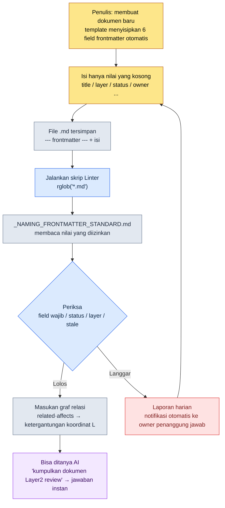

# 2.1 YAML Frontmatter — Setiap Dokumen sebagai Data

Malam menjelang build milestone, rekan tim System Designer, anggota A, bertanya lewat messenger. "Ada berapa dokumen yang menyentuh kurva reward minggu ini? Sampai mana yang sudah selesai ditinjau?" Saya tidak tahu jawabannya. Dokumen-dokumen itu ada di suatu tempat dalam folder, dan soal siapa yang terakhir menyentuhnya atau milestone mana — semuanya tercecer di ingatan masing-masing orang dan di kesepakatan penamaan file. Yang kami lakukan malam itu adalah membuat satu kesepakatan: menulis enam baris di awal setiap dokumen. Enam baris itulah yang, mulai milestone berikutnya, membuat pertanyaan anggota A bisa dijawab tanpa seorang pun perlu membuka folder.

Beberapa baris YAML yang ditulis di antara tanda `---` di paling atas dokumen. Inilah yang disebut frontmatter. Kesepakatan ini memberi tahu "dokumen ini apa" kepada manusia dan mesin secara bersamaan, tanpa membaca satu huruf pun dari isi dokumen. Bab ini menelusuri bagaimana satu baris itu menjadi koordinat masuk ke seluruh arsitektur informasi, dengan skrip yang benar-benar berjalan.

Ada satu istilah yang ingin saya tegaskan lebih dulu. Buku ini membagi dokumen desain menjadi lima **Layer** (dibahas serius di Bab 6). L0=worldview/konsep, L1=aturan sistem, L2=konten, L3=data, L4=koordinat implementasi. Arah ketergantungan yang normal adalah dari atas ke bawah. `layer: 2` yang muncul di subbab berikutnya adalah deklarasi koordinat yang berarti "dokumen ini adalah Layer konten".

---

## 2.1.1 Mengapa Bukan "Dokumen", tetapi "Dokumen sebagai Data"

Dokumen desain tradisional hidup di atas Word, PPT, dan Google Docs. Isinya dioptimalkan agar enak dibaca manusia. Namun metainformasi seperti jenis dokumen, penanggung jawab, status, dan lokasi justru melebur ke dalam isi, atau bergantung pada struktur folder dan kesepakatan penamaan file. Akibatnya, untuk mengetahui "dokumen ini milik milestone yang mana, siapa penanggung jawabnya, dan kapan terakhir ditinjau", Anda harus membuka dan membaca isinya.

Di sini bertumpuk dua keterbatasan. Pertama, dokumen tidak menyatakan identitasnya sendiri. Identitas itu ada di ingatan orang dan kesepakatan folder, dan kesepakatan itu lapuk seiring waktu. Kedua, AI tidak punya petunjuk untuk menyimpulkan konteks. Jika Anda meminta Claude Code "tinjau dokumen ini", ia akan membaca isinya dari awal hingga akhir sambil memboroskan token, dan ia pun tidak tahu sampai mana batas tanggung jawab dokumen itu.

YAML frontmatter menyelesaikan keduanya sekaligus. Jika Anda menuliskan metadata secara eksplisit di baris-baris awal dokumen, manusia maupun mesin bisa mengidentifikasi dokumen tanpa membuka isinya. Sama seperti label yang ditempel di muka laci lemari arsip: Anda tahu isi laci tanpa membukanya. Dan label ini bukan sekadar alat klasifikasi. Seperti yang akan kita lihat nanti, satu field `layer` saja menjadi koordinat masuk bagi procedural generation (pembangkitan prosedural) dan tinjauan otomatis.

---

## 2.1.2 Frontmatter Nyata — 14 Baris Pertama dari Sebuah Dokumen

Alih-alih contoh abstrak, kita lihat langsung frontmatter yang benar-benar dipikul di kepala dokumen kurva reward Proyek A (hanya ID dan nama asli yang disamarkan; strukturnya persis seperti yang dioperasikan).

```yaml
---
title: "Kurva Reward Quest Utama Bab 12"
layer: 2
status: review
owner: teammate_a
created: 2026-04-15
updated: 2026-05-20
related:
  - quest_main_chapter12
  - reward_curve_milestone_2
affects:
  - L3_BalanceSheet_v2
ip_check: passed
---

# Kurva Reward Quest Utama Bab 12

(isi dokumen dimulai)
```

Intinya adalah pemisahan antara bagian di atas dan di bawah `---`. Bagian atas adalah data yang dibaca parser; bagian bawah adalah isi yang dibaca manusia. Renderer Markdown umumnya menyembunyikan frontmatter, sehingga tidak mengganggu saat dibaca. Satu file memuat data (frontmatter) dan konten (isi) sekaligus, sehingga menjadi sumber kebenaran tunggal (single source of truth).

`layer: 2` dan `affects: [L3_BalanceSheet_v2]` — dua baris inilah yang patut diperhatikan. Ini adalah deklarasi bahwa "dokumen konten (L2) ini memberi pengaruh pada balance sheet di Layer data (L3)". Hanya dengan ini, alat bantu bisa menggambar relasi ketergantungan L2→L3 dalam bentuk graf tanpa membaca isi. Sebaliknya, jika dokumen data L3 mereferensikan aturan sistem L1 lewat `depends_on` (ketergantungan terbalik dari bawah ke atas), itu adalah aroma desain yang buruk (design smell). Alat bantu mendeteksi referensi terbalik itu secara otomatis.

Alasan YAML lebih nyaman ditulis tangan daripada JSON sederhana saja: struktur dinyatakan dengan indentasi, tanda kutip nyaris tak diperlukan, dan Anda bisa menulis komentar dengan `#`. Cocok untuk diisi sendiri oleh Game Designer.

---

## 2.1.3 Di Mana Standar Itu Tinggal — `_NAMING_FRONTMATTER_STANDARD`

Field bisa ditambah tanpa batas. Semakin banyak ditambah, beban penulisan makin besar dan standar pun runtuh. Karena itu Proyek A mengoperasikannya dalam dua lapis: field inti minimum yang sama untuk semua dokumen, dan field perluasan domain per bidang.

Field inti minimum yang berlaku umum ada enam.

| Field | Format | Kegunaan |
|------|------|------|
| `title` | string | Judul yang enak dibaca manusia. Boleh berbeda dari nama file |
| `layer` | 0\~4 | Koordinat Layer dari Bab 6 |
| `status` | draft / review / approved / archived | Status dokumen |
| `owner` | nama pengguna | Penanggung jawab (1 orang) |
| `created` | YYYY-MM-DD | Tanggal pembuatan |
| `updated` | YYYY-MM-DD | Tanggal modifikasi terakhir |

Hanya dengan enam ini, Anda langsung tahu kesegaran, tanggung jawab, dan lokasi dokumen. Tahan dorongan untuk menambah lebih banyak selama bulan pertama. Saat dijalankan, field mana yang benar-benar diperlukan akan muncul dengan sendirinya.

Field perluasan per bidang berbeda-beda untuk tiap domain. System Designer gemar memakai `depends_on`·`affects`, Combat Designer memakai `combat_phase`·`anim_target`, naratif memakai `world_region`·`chapter`, dan balancing memakai `data_sheet`·`formula_id`. Karena field-field perluasan ini tidak boleh tercecer bebas, satu dokumen standar tunggal yang memaku nama resmi, nilai yang diizinkan, dan contohnya. Dokumen itu adalah `_NAMING_FRONTMATTER_STANDARD.md`. Untuk menambah field baru, Anda harus melewati dokumen ini. Dan dokumen standar ini sendiri terdaftar sebagai atom, sehingga dikelola dalam keluarga yang sama dengan aturan yang memaksa nomor Layer di depan nama dokumen (atom `docs_layer_numeric_prefix_naming`).

Di sinilah terjadi peralihan penting. Jika standar hanya berupa dokumen yang dibaca manusia, manusia akan melanggarnya. Jika standar dijadikan **data yang dibaca mesin**, mesin yang akan memaksanya. Subbab berikutnya adalah kode nyata dari peralihan itu.

---

## 2.1.4 Worked Transcript — Memaksa Standar Lewat Kode, dan Pelajaran dari Bug datetime

Sekarang saya menyuruh Claude Code membuat "Linter yang memeriksa apakah semua dokumen Markdown Proyek A mematuhi standar frontmatter". Tuntutan intinya ada dua. Pertama, ia harus menangkap item pemeriksaan (field wajib yang hilang, nilai status non-standar, pelanggaran layer 0\~4, dokumen yang berstatus review tetapi tak berubah lebih dari 90 hari). Kedua, **jangan menanam nilai yang diizinkan langsung ke dalam kode (hardcode); bacalah dari dokumen standar**. Pemisahan inilah intinya. Jika Anda mengubah standar, kriteria pemeriksaan berubah tanpa perlu mengubah kode. (Naskah lengkap skrip dan prosedur menjalankannya secara langsung diletakkan di bagian "Coba Sendiri" di akhir bab ini.)

Di sini terjadi sebuah insiden. Kode yang pertama kali dikeluarkan Claude menghitung selisih tanggal dengan `today - fm["updated"]` di pemeriksaan STALE, dan pada komentar ia menulis "kalau ditulis seperti `updated: 2026-05-20`, PyYAML akan otomatis mem-parsing-nya menjadi `datetime.date`". Pernyataan ini hanya separuh benar. Saat dijalankan pada dokumen nyata, sebagian file memunculkan traceback.

```
TypeError: unsupported operand type(s) for -: 'datetime.date' and 'str'
```

Penyebabnya ada di tangan manusia. Sebagian penulis menulis `updated: 2026-05-20` (terparsing sebagai date), sebagian lain menulis `updated: "2026-05-20"` dengan tanda kutip (terparsing sebagai string). Di tempat yang tidak dipaku standar soal format tanggal, tangan manusia bercabang, dan Claude hanya berasumsi pada satu sisi. Saya menolak kode itu dan kembali meminta "normalisasikan kedua notasi dengan aman menjadi date, dan saring juga kasus saat `updated` tidak ada". Claude menyisipkan helper yang memeriksa tipe input lalu menormalkan keduanya menjadi `datetime.date` (blok perbaikannya juga lihat "Coba Sendiri").

Pelajaran yang sesungguhnya bukanlah bug kode itu. Melainkan bahwa **di tempat yang tidak dipaku standar soal format penulisan tanggal, tangan manusia bercabang**. Karena itu saya menambahkan satu baris `updated: YYYY-MM-DD (tanpa tanda kutip)` ke dalam `_NAMING_FRONTMATTER_STANDARD.md`. Linter, saat memeriksa kode, justru menyingkapkan lubang pada standar yang menjadi acuan pemeriksaan itu sendiri.

Keluaran pertama dari skrip yang sudah diperbaiki tidaklah bersih. Saya biarkan apa adanya hasil berantakan yang benar-benar muncul.

```
[NO-FM]   manuscript/legacy/old_combat_notes.md
[MISSING] manuscript/system/quest_flag_table.md: layer
[STATUS]  manuscript/content/town_intro.md: WIP
[LAYER]   manuscript/balance/dps_v2.md: None
[STALE]   manuscript/system/inventory_rules.md: 134d
```

Lima baris ini adalah kondisi nyata tim di awal penerapan. Dokumen lama sama sekali tak punya frontmatter (`NO-FM`), satu dokumen melupakan `layer`, seseorang memakai nilai non-standar `status: WIP`, satu dokumen balancing mengosongkan `layer` menjadi `None`, dan satu dokumen aturan sistem tertidur dalam status `review` selama 134 hari. Standar memang tidak dipatuhi sejak awal. Linter hanya menyingkapkan kenyataan itu setiap pagi.

---

## 2.1.5 Dari frontmatter ke Skrip — Alurnya

Jika worked transcript di atas dipadatkan menjadi satu alur, hasilnya seperti berikut. Ia memperlihatkan bagaimana satu baris yang ditulis manusia mengalir hingga ke gerbang pemeriksaan mesin.



Intinya ada dua. Pertama, standar (E) terpisah dari skrip (D). Jika Anda mengubah standar, kriteria pemeriksaan berubah tanpa perlu mengubah kode. Kedua, pelanggaran (H) bukanlah jalan buntu, melainkan loop yang berputar kembali ke tahap penulisan (B). Ini bukan menyalahkan orang, melainkan mengembalikan agar penulis sendiri memperbaiki dokumennya sendiri.

---

## 2.1.6 Kasus Operasional — Enam Bulan di Sebuah Tim Berukuran Menengah

Proyek A yang saya operasikan sebagai direktur menerapkan frontmatter ke seluruh tim desain (4\~5 orang) kira-kira enam bulan lalu. Penerapannya tidak terjadi sekaligus, melainkan melewati empat ruas.

Penolakan terbesar di minggu pertama penerapan adalah "harus menulis ini dengan tangan setiap kali?" Menghafal dan menuliskan enam baris untuk tiap dokumen baru itu merepotkan. Solusinya adalah penyisipan template otomatis. Snippet VSCode, template Obsidian, dan tombol "dokumen baru" di portal desain menyisipkan blok YAML kosong secara otomatis. Penulis hanya mengisi nilai yang kosong. Penolakan itu lenyap dalam waktu seminggu.

Pada bulan pertama, bentrokan standar meletus. Saat banyak orang menambah field secara bebas, `owner`·`responsible`·`author` muncul bersamaan. Konsepnya sama tetapi notasinya tiga macam, sehingga pencarian maupun otomatisasi pun rusak. Solusinya adalah merapikan nama resmi, nilai yang diizinkan, dan contoh untuk semua field ke dalam satu dokumen `_NAMING_FRONTMATTER_STANDARD.md`, lalu menjadikan penambahan field baru sebagai aturan yang harus lewat dokumen ini. Standar stabil dalam waktu sebulan.

Pada bulan ketiga, masuklah Linter yang kita lihat di 2.1.4. Meski ada standar, manusia tetap melanggar. Karena itu setiap pagi laporan konsistensi dibuat otomatis dan jatuh ke kanal bersama di messenger tim. Penanggung jawab cukup melihat dokumennya sendiri. Setelah otomatisasi, pelanggaran standar berkurang secara mencolok (perkiraan penulis, bukan nilai pengukuran presisi — terasa kira-kira separuh ke bawah).

Pada bulan keenam, perpaduan dengan AI bersinar. Begitu standar stabil, pertanyaan seperti berikut kembali sebagai jawaban instan.

- "Kumpulkan semua dokumen Layer 2 yang diperbarui dalam 2 minggu terakhir yang status-nya review"
- "Gambarkan linimasa perubahan status dari semua dokumen yang owner-nya saya"
- "Tarik daftar dokumen lain yang terpengaruh oleh permintaan perubahan ini" — secara otomatis mengikuti graf `related`·`affects`

Pada akhirnya frontmatter menjadi kosakata bersama antara manusia dan AI. Saat manusia menulis, AI memahaminya; saat AI menulis, manusia memverifikasinya. Keduanya melihat key yang sama. Hanya saja, penolakan minggu pertama, bentrokan bulan pertama, Linter bulan ketiga, perpaduan bulan keenam — semua itu hasil dari enam bulan yang menumpuk, bukan sesuatu yang muncul dalam sekali jalan.

---

## 2.1.7 Kesalahan Umum dan Cara Menghindarinya

Kesalahan yang berulang di awal penerapan terangkum dalam lima hal. Semuanya berdiri di atas akar yang sama — "tempat di mana standar hanya diserahkan kepada kemauan manusia".

| Kesalahan | Penyebab masalah | Cara menghindari |
|---|---|---|
| Mendefinisikan terlalu banyak field sejak awal | Penulis lelah mengisi nilai kosong sehingga kualitas merosot | Mulai dengan 6 inti, tambahkan hanya yang sering dipakai setelah 1\~2 bulan |
| Nama field terus berubah (`tag`→`tags`→`category`) | Nama lama tertinggal di dokumen yang menumpuk sehingga pencarian·otomatisasi rusak | Saat mengganti penamaan, sertakan skrip migrasi. Saat nama lama ditemukan, konversi otomatis atau beri peringatan |
| Manusia menulis dengan tangan setiap kali | Typo, field hilang, dan percabangan notasi tanggal (bug di 2.1.4 itu) menjadi sehari-hari | Utamakan otomatisasi template·snippet·"dokumen baru". Tangan manusia hanya untuk nilai yang bermakna |
| Hanya menaruh standar lalu dibiarkan tanpa verifikasi | Meski ada standar, tak tahu siapa yang melanggar dan terjadi pelapukan alami | Buat pelanggar memperbaiki sendiri lewat Linter + laporan otomatis harian |
| Lupa field `layer` | Tanpa koordinat Layer, visibilitas antar bidang maupun gerbang tinjauan sama-sama tak terbentuk | Paksa `layer` sebagai field wajib. Linter mendeteksi yang hilang |

Tak perlu mencegah kelima kesalahan ini sejak hari pertama. Lebih alami jika pola penghindaran untuk nomor 1·3 ditetapkan di minggu pertama penerapan, sementara nomor 2·4·5 disisipkan satu per satu mulai dari tempat yang paling sering ditubruk tim Anda sendiri sambil berjalan.

---

## 2.1.8 Mulai dari yang Kecil — Memapankan dalam 3 Minggu

Penerapan frontmatter ternyata pekerjaan yang ringan. Dalam 3 minggu, ia sudah mapan dalam satu tim.

Pada minggu pertama, definisikan enam field inti dan buat template, lalu terapkan hanya pada dokumen baru agar beban penulisan minimal. Pada minggu kedua, terapkan secara manual pada 20 dokumen teratas yang paling sering dilihat, untuk memeriksa field mana yang kurang dalam penggunaan nyata. Pada minggu ketiga, jika Linter dan laporan harian dijalankan, sejak saat itu standar dijaga bukan oleh kemauan manusia, melainkan oleh kekuatan alat.

Jangan memigrasikan seluruh dokumen lama sekaligus. Terapkan mulai dari yang sering dilihat, mulai dari dokumen baru. Setelah sekitar enam bulan, frontmatter menempel pada hampir semua dokumen. Meski begitu, 100% bukanlah targetnya. Menghabiskan waktu memigrasikan bahkan dokumen lama yang tak pernah sekali pun dibuka adalah pemborosan.

---

## Coba Sendiri

Dalam unit terkecil, kita putar satu siklus secara langsung.

**setup**
- Taruh 2\~3 dokumen `.md` sasaran pemeriksaan di folder kerja. Sengaja kosongkan `layer` pada sebagian, atau masukkan nilai non-standar seperti `status: WIP`.
- Taruh satu baris dokumen standar di folder yang sama.
  ```
  status: allowed = ["draft", "review", "approved", "archived"]
  updated: YYYY-MM-DD (tanpa tanda kutip)
  ```

**prompt** (masukkan ke Claude Code)
> Tuliskan skrip Python yang memeriksa YAML frontmatter dari semua .md di bawah folder ini. Tangkap field wajib title·layer·status·owner yang hilang, pelanggaran nilai status yang diizinkan (baca dari dokumen standar), pelanggaran layer yang bukan bilangan bulat 0\~4, dan dokumen berstatus review yang updated-nya melebihi 90 hari. Tangani dengan aman baik saat `updated` datang sebagai string maupun sebagai date, dan keluarkan pelanggaran per file.

**verify**
- Jalankan skrip dan pastikan semua pelanggaran yang sengaja ditanam tertangkap.
- Tambahkan `WIP` ke daftar `allowed` di dokumen standar, lalu jalankan ulang, dan pastikan `status: WIP` berubah menjadi lolos meski Anda tidak mengubah satu baris kode pun. Ini bukti bahwa standar dan kode terpisah.
- Masukkan baik dokumen yang `updated`-nya diberi tanda kutip maupun yang tidak, dan pastikan `TypeError` yang kita lihat di 2.1.4 tidak muncul.

**Referensi: Naskah Lengkap Skrip Linter**

Inilah kode yang pertama kali dikeluarkan Claude di 2.1.4. Pada baris pemeriksaan STALE (`age = (today - fm["updated"]).days`) bug datetime masih ada apa adanya.

```python
import sys, datetime, pathlib, re
import yaml  # PyYAML

ROOT = pathlib.Path("manuscript")
STANDARD = pathlib.Path("_NAMING_FRONTMATTER_STANDARD.md")
REQUIRED = ["title", "layer", "status", "owner"]

def load_allowed_status(standard_path):
    # Mengekstrak nilai `status` yang diizinkan dari dokumen standar
    text = standard_path.read_text(encoding="utf-8")
    m = re.search(r"status:\s*allowed\s*=\s*\[(.*?)\]", text)
    if not m:
        return ["draft", "review", "approved", "archived"]
    return [s.strip().strip('"').strip("'") for s in m.group(1).split(",")]

def parse_frontmatter(md_path):
    text = md_path.read_text(encoding="utf-8")
    if not text.startswith("---"):
        return None
    end = text.find("---", 3)
    block = text[3:end]
    return yaml.safe_load(block)

def main():
    allowed = load_allowed_status(STANDARD)
    today = datetime.date.today()
    violations = 0
    for md in ROOT.rglob("*.md"):
        fm = parse_frontmatter(md)
        if fm is None:
            print(f"[NO-FM]   {md}")
            violations += 1
            continue
        for field in REQUIRED:
            if field not in fm:
                print(f"[MISSING] {md}: {field}")
                violations += 1
        if fm.get("status") not in allowed:
            print(f"[STATUS]  {md}: {fm.get('status')}")
            violations += 1
        if not isinstance(fm.get("layer"), int) or not (0 <= fm.get("layer") <= 4):
            print(f"[LAYER]   {md}: {fm.get('layer')}")
            violations += 1
        if fm.get("status") == "review":
            age = (today - fm["updated"]).days   # ← di sinilah yang rusak
            if age > 90:
                print(f"[STALE]   {md}: {age}d")
                violations += 1
    sys.exit(violations)
```

Blok inti yang diperbaiki setelah permintaan ulang. `updated` dinormalkan dengan aman baik saat datang sebagai string maupun sebagai date.

```python
def as_date(v):
    if isinstance(v, datetime.date):
        return v
    if isinstance(v, str):
        return datetime.date.fromisoformat(v.strip())
    return None

# Bagian pengganti pemeriksaan STALE di dalam main()
if fm.get("status") == "review":
    upd = as_date(fm.get("updated"))
    if upd is None:
        print(f"[MISSING] {md}: updated")
        violations += 1
    elif (today - upd).days > 90:
        print(f"[STALE]   {md}: {(today - upd).days}d")
        violations += 1
```

### Versi Ringkas Solo

Anda tidak perlu punya tim. Di folder catatan yang Anda pakai sendiri, kurangi field inti menjadi tiga saja — `title`·`status`·`updated` — dan biarkan Linter hanya menangkap "dokumen yang status-nya review tetapi updated-nya melebihi 30 hari". Hanya dengan ini pun, "dokumen yang saya tinggalkan setengah jadi saat meninjau lalu lupa" akan muncul ke permukaan sekali setiap minggu. Segitiga standar-template-pemeriksaan tetap bekerja apa adanya bahkan pada skala satu orang.

---

### Poin-Poin Penting
- Satu baris frontmatter adalah bata data terkecil untuk mengidentifikasi dokumen tanpa membaca isinya
- Jika standar dipisahkan dari kode dan ditaruh sebagai dokumen, kriteria pemeriksaan bisa diubah tanpa mengubah kode
- Satu field `layer` menjadi koordinat masuk bagi procedural generation (pembangkitan prosedural) dan tinjauan otomatis
