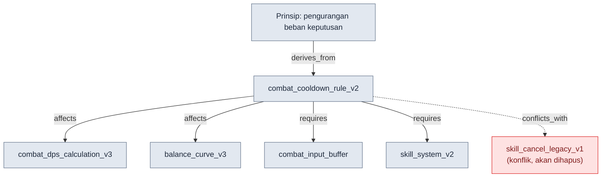
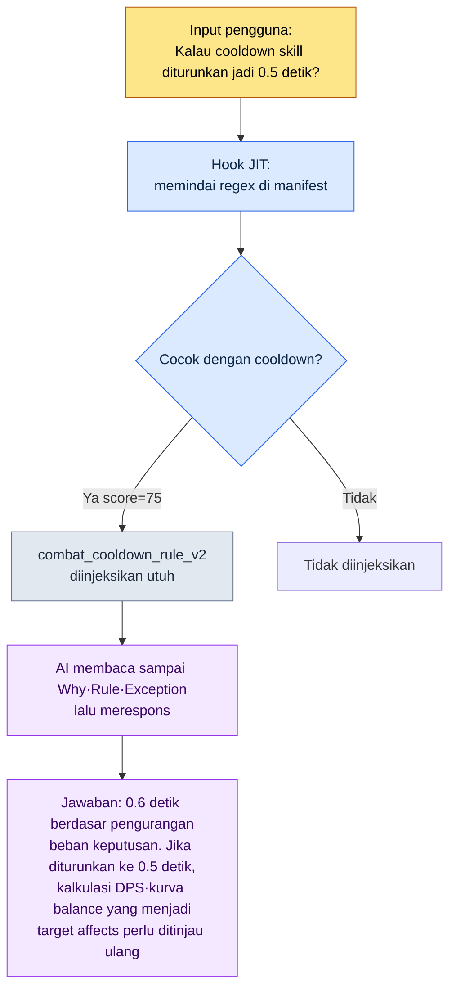

# 2.2 Atom per Halaman — Anatomi Satu Dokumen Satu Keputusan

Pada minggu pertama seorang anggota baru bergabung, ia bertanya lewat chat. "Apakah cooldown (waktu jeda) tempur memang 0.6 detik? Tertulis di dokumen yang mana?" Saya menjawab, "Ada di GDD (Game Design Document, spesifikasi rinci) sistem skill." Ia bertanya lagi. "Bagian mana di GDD itu? Setelah desain class ada kurva damage, lalu sampai cara menampilkan UI — totalnya 220 baris, lho." Saya buka filenya dan saya carikan sendiri untuknya. Ada di baris ke-137. Pertanyaan terakhirnya: "Tapi kenapa 0.6 detik? Apa 0.5 tidak boleh?" Jawaban itu tidak ada di dokumen mana pun. Saya ingat keputusannya diambil pada rapat 6 bulan lalu, tetapi alasannya terkubur di suatu tempat dalam notulen rapat.

Di dalam percakapan 5 menit ini, terkandung tiga kegagalan dari dokumen gabungan 220 baris itu. Tidak bisa menemukan lokasinya (kegagalan pencarian), tidak ada alasannya (konteks hilang), dan setiap kali harus ada manusia yang menjadi perantara (tidak bisa diotomasi). Jika pertanyaan yang sama dilemparkan ke AI, keadaannya bahkan lebih buruk. AI membaca seluruh 220 baris itu, lalu menjawab sambil mencampurkan pembahasan kurva damage yang sama sekali tidak berhubungan dengan cooldown.

Resep bab ini sederhana. **Satu dokumen hanya memuat satu keputusan.** Dokumen unit keputusan yang dipotong halus dengan prinsip ini saya sebut atom. Jika GDD 220 baris itu dipecah, "cooldown adalah 0.6 detik" menjadi satu atom, dan di dalam atom itu lokasi, isi, alasan, pengecualian, dan relasi berkumpul di satu tempat. Bab ini, alih-alih berbicara secara abstrak, membedah satu atom nyata hingga tuntas. Bagaimana memberinya nama, frontmatter apa yang diisi, bagaimana relasinya dinyatakan, dan akhirnya bagaimana AI memilih tepat satu atom itu saja secara akurat.

---

## 2.2.1 Memilih Satu Spesimen — `combat_cooldown_rule_v2`

Spesimen yang akan dibedah adalah satu atom yang benar-benar dijalankan di Proyek A. Namanya `combat_cooldown_rule_v2`. Isi lengkap filenya seperti berikut. Tidak panjang. Karena hanya memuat satu keputusan.

```markdown
---
name: combat_cooldown_rule_v2
title: "Aturan Cooldown Tempur — v2"
type: rule
layer: 1
status: approved
owner: 이민수
created: 2026-03-10
updated: 2026-05-12
applies_to: [skill_system, item_system]
---

# Aturan Cooldown Tempur v2

Why (mengapa): Untuk membatasi jumlah skill yang dapat dipakai
bersamaan sehingga beban pengambilan keputusan instan berkurang,
dan untuk mempertahankan makna dari input combo.

Rule (aturan): Semua skill aktif memiliki global cooldown 0.6 detik +
cooldown individual (didefinisikan per skill). Selama global cooldown
sedang berjalan, tidak ada skill aktif yang bisa di-cast.

How to apply (penerapan):
- Saat mendefinisikan skill baru, cooldown individual wajib dinyatakan
- Jika kolom cooldown pada L3_SkillSheet bernilai 0, itu pelanggaran aturan ini
- Pemeriksaan konsistensi pada tahap build mendeteksi pelanggaran secara otomatis

Exceptions (pengecualian):
- Skill pasif tidak terkena aturan ini
- Ultimate menggunakan sistem gauge tersendiri (See: [[ultimate_gauge_system]])

Relations (relasi):
- affects: [[combat_dps_calculation_v3]], [[balance_curve_v3]]
- derives_from: [[principle_decision_load_reduction]]
- conflicts_with: [[skill_cancel_rule_legacy_v1]]
- requires: [[combat_input_buffer_system]], [[skill_system_v2]]
- is_a: rule
- part_of: combat_system_master
```

Satu lembar file ini saya belah menjadi lima bagian: penamaan, frontmatter, keputusan tunggal, relasi, dan ketertelusuran. Kelima bagian itu harus lengkap agar AI membaca atom ini sebagai "unit yang masuk akal meski berdiri sendiri".

---

## 2.2.2 Bagian ① Penamaan — Nama Itu Sendiri adalah Koordinat

Nama filenya adalah `combat_cooldown_rule_v2`. Bukan nama yang dibuat asal-asalan, melainkan memiliki struktur tiga potongan.

```
combat_         cooldown_rule          _v2
└ prefix        └ isi keputusan        └ versi
  (domain mana)   (keputusan tentang apa) (revisi ke berapa)
```

Prefix `combat_` adalah koordinat yang menyatakan "ini keputusan di domain tempur". Atom aturan Proyek A dipisahkan domainnya berdasarkan prefix. `quest_` (quest), `data_` (operasional data), `docs_` (operasional dokumen), `meeting_` (notulen rapat), `portal_` (penampil desain). Cukup dengan melihat prefix saja, sudah terlihat keputusan ini berada di wilayah tanggung jawab siapa dan dari mana ia menerima pengaruh.

Jika penamaan goyah, semuanya ikut goyah. Jika keputusan yang sama hadir dua kali sebagai `skill-cooldown.md` dan `cooldown_skill_v2.md`, pencarian pun rusak dan pencocokan JIT yang akan dibahas nanti juga rusak. Karena itu, Proyek A lebih dulu mengunci aturan penamaan itu sendiri sebagai satu atom. Itulah `atom_naming_convention_v1`, yang memaksakan snake_case, prefix wajib, dan suffix versi. Dan aturan ini dijaga bukan oleh kemauan manusia, melainkan oleh Linter. Jika nama file tanpa prefix di-commit, ia akan tertangkap pada tahap build.

Di balik penamaan tertanam desain yang lebih besar, yang menembus seluruh buku ini. `layer: 1` pada frontmatter adalah koordinat kedua itu. Jika prefix menyatakan "domain mana", maka Layer menyatakan "lapisan abstraksi mana". Kedua koordinat harus bergabung agar posisi atom terkunci sebagai satu titik pada sebuah bidang. Di sini Layer hanyalah koordinat (detail definisi lapisan 0\~4 ada di 2.3). Aturan cooldown adalah "aturan input yang mengontrol pembangkitan", sehingga ia duduk di Layer 1. Ada pula aturan tersendiri yang memaksakan koordinat Layer ini sebagai prefix angka di depan nama dokumen — `docs_layer_numeric_prefix_naming`. Dengan kata lain, di dalam satu nama tertera dua sumbu koordinat.

Esensi dari desain ini bukanlah obsesi kerapian. Ada kalimat yang berulang kali saya katakan ke tim. **"Layer itu kita bagi memang demi procedural generation, kan."** Jika setiap atom memiliki koordinat domain (prefix) dan koordinat lapisan (Layer) yang dinyatakan secara eksplisit, nantinya menjadi mungkin bagi AI untuk "menerima seluruh aturan combat Layer 1 sebagai input dan membangkitkan konten Layer 2 secara otomatis". Nama adalah sistem alamat dari otomasi itu.

---

## 2.2.3 Bagian ② frontmatter — Label yang Dibaca Mesin

Blok YAML di antara `---` di atas isi adalah frontmatter. Ini adalah penerapan standar yang dibahas di 2.1 langsung ke atom, dan merupakan label yang dibaca bukan oleh manusia melainkan oleh mesin (skrip build, hook JIT, generator peta relasi).

| Field | Nilai | Yang dilakukan mesin dengan ini |
|---|---|---|
| `name` | combat_cooldown_rule_v2 | ID unik yang menjadi target link dari atom lain |
| `type` | rule | Statistik/filter per kategori (rule / concept / decision …) |
| `layer` | 1 | Pewarnaan/pengurutan per Layer, sumbu acuan untuk mendeteksi referensi terbalik |
| `status` | approved | Dari draft·approved·archived, hanya approved yang masuk build |
| `applies_to` | [skill_system, item_system] | Jangkauan pengaruh — sistem mana saja yang disentuh aturan ini |
| `created`/`updated` | 2026-03-10 / 2026-05-12 | Pelacakan perubahan, tanggal acuan untuk meninjau atom yang sudah usang |

Jika label-label ini sudah terisi, pemeriksaan otomatis menjadi mungkin. Sebagai contoh, jika sebuah aturan sistem yang dideklarasikan dengan `layer: 1` di dalam isinya langsung mereferensikan atom data (Layer 3) seperti `[[L3_SkillSheet_row_0042]]`, maka itu adalah **referensi terbalik (L3→L1)** di mana lapisan atas terikat pada nilai konkret lapisan bawah. Proyek A mendeteksi pola ini secara otomatis pada tahap build. Sebab aturan harus mereferensikan format data, bukan satu baris data. Tanpa satu baris `layer` di frontmatter, pemeriksaan ini sendiri tidak dapat terbentuk.

Penanganan `status: archived` juga merupakan tugas frontmatter. Jika sebuah keputusan berubah, atom tidak dihapus melainkan menerima `status: archived` + tanggal `archived_at`. Build dan JIT mengecualikan atom yang archived. Catatannya tetap ada, tetapi ia keluar dari barisan aktif. Dalam operasional 6 bulan di Proyek A, tingkat pengarsipan (archived) sekitar 15% (pengukuran nyata penulis). Jika rasio ini mendekati 0%, saya membacanya sebagai sinyal bahwa alur kerja pengarsipan tidak berfungsi.

---

## 2.2.4 Bagian ③ Keputusan Tunggal — Apakah Bisa Diringkas dalam Satu Kalimat

Inti dari membedah atom adalah memastikan bahwa isinya hanya memuat satu keputusan. Cara memeriksanya sederhana. **Coba ringkas keputusan atom ini dalam satu kalimat.**

> "Semua skill aktif memiliki global cooldown 0.6 detik."

Selesai dalam satu kalimat. Lulus. Jika ringkasannya menjadi dua kalimat seperti "cooldown adalah 0.6 detik, dan selama combo dipangkas 50%", itu berarti dua keputusan. Pecahlah menjadi `combat_cooldown_rule_v2` (cooldown dasar) dan `combat_combo_cooldown_reduction_v1` (pemangkasan combo).

Ada dua pemeriksaan bantu lagi untuk melihat ketunggalan.

**Pemeriksaan penghapusan independen.** Apakah jika hanya atom ini saja yang dihapus, sistem tidak runtuh? Jika aturan cooldown dihapus, balance tempur memang goyah, tetapi sistem tetap berjalan. Unitnya tepat. Sebaliknya, jika saat dihapus lima atom lain ikut runtuh bersamanya, maka kelima atom itu sebenarnya adalah lima kepingan dari satu keputusan. Mereka harus disatukan menjadi atom yang lebih besar.

**Pemeriksaan referensi tunggal.** Apakah dari tempat lain, dengan hanya men-link `[[combat_cooldown_rule_v2]]` satu kali, maknanya sudah tersampaikan? Jika ya, unitnya tepat. Jika untuk mereferensikan satu baris ini Anda harus membaca banyak bagian isi, berarti ia belum cukup dipecah.

Isi yang lolos pemeriksaan-pemeriksaan ini secara alami tertata menjadi lima seksi — Why, Rule, How, Exceptions, Relations. Terutama, **jangan hapus Why.** Jawaban atas "kenapa 0.6 detik?" yang ditanyakan anggota baru di akhir pada pengantar di depan tadi ada di sini — "untuk mengurangi beban pengambilan keputusan instan dan mempertahankan makna input combo." Saat 6 bulan kemudian seseorang mengusulkan "ayo turunkan jadi 0.5 detik", satu baris ini menjadi titik tolak diskusi. Atom yang Why-nya hilang akan menjadi fosil yang tak seorang pun berani menyentuhnya.

---

## 2.2.5 Bagian ④ Relasi — Panah Membuat Analisis Dampak

Seksi Relations di paling bawah atom menjadikan spesimen ini bukan memo yang terisolasi, melainkan satu node dalam sebuah graf. Intinya bukan sekadar "dokumen terkait", melainkan bahwa ia **menyatakan secara eksplisit jenis relasinya**.



Enam jenis relasi masing-masing melakukan tugas yang berbeda.

- `derives_from`: dari prinsip atas mana keputusan ini diturunkan. Cooldown 0.6 detik adalah perwujudan konkret dari prinsip "pengurangan beban pengambilan keputusan".
- `affects`: jika atom ini berubah, apa yang terkena dampak. Jika 0.6 detik diubah jadi 0.5 detik, kalkulasi DPS dan kurva balance akan goyah. **Sebelum melakukan perubahan, jangkauan dampaknya bisa ditarik secara otomatis.**
- `requires`: agar keputusan ini berdiri, apa yang harus ada lebih dulu. Tanpa sistem input buffer, global cooldown akan "memakan" input.
- `conflicts_with`: dengan apa ia bertentangan. Ia berkonflik dengan aturan skill cancel versi lama, dan link ini adalah sinyal bahwa "salah satu dari keduanya harus dihapus".
- `is_a` / `part_of`: klasifikasi (rule) dan keanggotaan (combat_system_master). Kerangka graf.

Seandainya hanya berupa link sederhana "Related: [Dokumen A], [Dokumen B]", manusia harus menelaahnya satu per satu. Jika jenis relasi diisi sebagai enum, mesinlah yang menelaahnya. "Tunjukkan semua yang terkena dampak jika atom ini diubah" menjadi kueri otomatis yang menelusuri `affects`, dan "cari semua aturan yang sekarang saling bertentangan" menjadi pemeriksaan otomatis yang memindai `conflicts_with`. Desain ontologi yang lengkap untuk keenam enum ini dibahas di 2.4, dan 2.2 hanya menegaskan bahwa standar atom sudah menerapkan enum itu terlebih dahulu.

Panah relasi juga merupakan input bagi alat pembuat peta relasi. `gen_relation_map.py` milik Proyek A membaca `layer` di frontmatter dan seksi Relations dari setiap atom, lalu secara otomatis menggambar peta relasi HTML interaktif yang diwarnai per Layer. Ini mungkin karena tiap-tiap atom memiliki koordinat (Layer) dan panah (Relations).

---

## 2.2.6 Bagian ⑤ Ketertelusuran — 30 Menit yang Dicegah oleh Satu Atom

Atom yang kelima bagiannya lengkap dapat ditelusuri. Siapa, kapan, dan mengapa membuat keputusan ini, serta apa yang ditangkap sebagai pelanggaran — semuanya ada di satu tempat. Nilai ketertelusuran paling jelas terlihat bukan dari statistik, melainkan dari insiden nyata yang berhasil dicegah.

Atom `meeting_image_caption_standard` milik Proyek A adalah aturan yang mewajibkan, pada gambar lampiran notulen rapat, menyatakan dalam caption "layar apa ini, mengapa dilampirkan, dan apa keputusannya". Pada masa sebelum atom ini ada, sebuah screenshot ditempel tanpa caption di suatu notulen, dan seminggu kemudian anggota tim yang melihatnya butuh 30 menit untuk mengonfirmasi "ini layar apa, ya?" kepada penulis notulen. Setelah atom itu dibuat, ketika kelalaian yang sama terulang, Linter pada tahap build secara otomatis menangkap gambar tanpa caption. Sampai perbaikannya selesai: 5 menit. 30 menit menjadi 5 menit.

Spesimen lain, `skill_listing_budget_wrapper_only_policy`, adalah aturan yang membatasi slot slash command global menjadi 12 buah, dan menempatkan skill induk di direktori terpisah tetapi hanya mengekspos 12 wrapper saja ke global. Sebelum dikunci jadi aturan, slash command global membengkak hampir 40 buah sehingga menggerogoti anggaran token setiap kali sesi dimulai. Setelah definisi atom, alat perapian otomatis merapikan kelebihannya setiap kali sesi dimulai. Aturan ditegakkan oleh alat, bukan oleh ingatan manusia.

Atom semacam ini terkumpul sekitar 304 buah di Proyek A (pengukuran nyata penulis, pada titik operasional 6 bulan). Jika dilihat hanya cabang besar distribusinya, aturan pencegahan kekambuhan (rule) memiliki porsi terbesar, lalu disusul oleh pengunci keputusan sekali pakai (decision), konsep domain (concept), dan koreksi kolaborasi (feedback), berurutan. Waktu yang dicegah oleh satu atom memang dalam hitungan menit, tetapi jika 304 buah terkumpul, akumulasi penghematannya melewati hitungan hari. Inilah alasan saya menyebut atom sebagai "aset" dan bukan "kerapian".

---

## 2.2.7 Dari Anatomi ke Injeksi Otomatis — Cara Kerja Nyata JIT

Sejauh ini saya membedah satu atom secara statis. Sekarang kita lihat saat ia bergerak hidup. Hook JIT (Just-In-Time) dari 1.3 hanya memilih atom yang cocok dengan kata kunci input, lalu menginjeksikannya ke konteks di tempat itu juga. Manifest JIT adalah JSON yang memetakan kata kunci pencocokan dan skor ke tiap atom.

```json
{
  "name": "combat_cooldown_rule_v2",
  "path": "atoms/combat/combat_cooldown_rule_v2.md",
  "regex": "쿨다운|cooldown|글로벌 쿨다운|GCD",
  "score": 75
}
```

Injeksi yang sebenarnya mengalir seperti ini.



Intinya ada di kotak terakhir. AI tidak hanya menjawab "tadinya 0.6 detik". Karena ia membaca Why dari atom, ia memberikan alasan; dan karena ia membaca `affects` dari Relations, ia bahkan menunjukkan lebih dulu target yang akan goyah saat diubah (kalkulasi DPS, kurva balance). Kelima bagian — yang dipecah halus, ditulis alasannya, dan dinyatakan relasinya — semuanya hidup dalam respons.

Di sinilah terlihat bahwa prinsip keputusan tunggal adalah prasyarat otomasi. Seandainya atom ini adalah GDD gabungan 220 baris, begitu satu kata "cooldown" cocok, desain class, kurva damage, hingga UI ikut diinjeksikan utuh sehingga anggaran token terpangkas, dan AI kehilangan fokus harus menjawab keputusan yang mana dari lima keputusan itu. **Semakin kecil dan jelas atom, semakin tinggi akurasi JIT. Keadaan yang dipecah halus bukanlah kebajikan kerapian, melainkan prasyarat dari injeksi otomatis.**

score adalah perangkat untuk menjaga anggaran konteks. Jika beberapa atom cocok dengan satu input, hanya N teratas berdasarkan score yang diinjeksikan (default 3 buah). Kriteria pemberian skor ditetapkan sambil beroperasi.

- atom terkait keselamatan·keamanan·kesehatan = 95\~99 (pantang terlewat)
- atom pesan inti·filosofi = 90\~94
- aturan inti domain = 75\~89 (aturan cooldown di sini, 75)
- atom rujukan·riwayat = 30\~50

---

## 2.2.8 Atom Pribadi dan Atom Bersama Tim — Pemisahan Dua Lapis

Spesimen yang dibedah, `combat_cooldown_rule_v2`, adalah atom bersama tim yang telah menerima `status: approved`. Tidak semua atom langsung sampai di posisi ini sejak awal. Proyek A membagi atom menjadi dua lapis.

- **Atom pribadi** — hipotesis belum pasti, memo pribadi, pengunci momen. Hanya dilihat sendiri. Standarnya longgar.
- **Atom bersama tim** — aturan yang sudah terverifikasi. Dilihat seluruh anggota tim. Harus lolos prosedur penamaan, struktur, dan persetujuan.

Alasan pemisahannya bersifat psikologis. Atom pribadi harus bebas agar hipotesis sebelum verifikasi bisa dicatat tanpa beban, dan bisa dibuang seminggu kemudian. Jika sejak awal terbuka ke tim, muncul pikiran "bagaimana kalau ini salah" sehingga akhirnya malah tidak dicatat sama sekali. Sebaliknya, atom bersama tim harus ketat agar semua orang mempercayai dan mereferensikannya.

`combat_cooldown_rule_v2` pun mungkin pada awalnya hanyalah memo satu baris di atom pribadi, "ayo kita tes cooldown 0.6 detik". Setelah terverifikasi pada build alpha, ia dipromosikan menjadi atom bersama tim dalam bentuk permintaan perubahan, lalu melalui tinjauan game designer lain ia menjadi `approved`. Alur promosi dari pribadi ke tim ini sendiri adalah salah satu sumbu dari loop self-improving, tempat sistem atom menjadi makin pintar seiring waktu.

---

## 2.2.9 Lima Kesalahan yang Umum Terjadi

Kesalahan yang berulang pada awal operasional atom dapat dirangkum menjadi lima. Semuanya berasal dari akar yang sama: "memperlakukan atom sebagai memo sekali pakai, bukan aset".

| Kesalahan | Apa yang rusak | Cara menghindari |
|---|---|---|
| Membuat terlalu banyak di minggu pertama | Atom belum terverifikasi menumpuk dan operasional runtuh | Mulai dari satu-dua yang terverifikasi, biarkan tumbuh alami |
| Tidak menghapus | Atom usang terus cocok di JIT dan menghasilkan jawaban salah | Tinjau triwulanan, `status: archived` + `archived_at` |
| Terlalu abstrak/konkret | "Membuat desain yang baik" tak bisa diverifikasi; satu baris remeh tak bermakna | Sampai level "range hanya 0.5/1.5/3.0/5.0" |
| Nama tidak konsisten | Pencarian·pencocokan JIT rusak total | Buat dulu atom aturan penamaan dan paksakan dengan Linter |
| Tidak menulis Why | Seiring waktu menjadi fosil yang tak seorang pun berani menyentuh | Paksakan 5 seksi Why·Rule·How·Exception·Relations |

Tidak perlu menghindari kelimanya secara sempurna sejak bulan pertama. Nomor 1 dan 4 terselesaikan bersamaan hanya dengan satu atom aturan penamaan, sementara nomor 2·3·5 akan tertata secara alami jika tinjauan triwulanan dijalankan sekali pada titik operasional 3 bulan.

---

## 2.2.10 Menuju Bab Berikutnya

Pada bab ini saya membelah satu atom menjadi lima bagian. Nama (koordinat), frontmatter (label mesin), keputusan tunggal (pemeriksaan satu kalimat), relasi (analisis dampak), ketertelusuran (30 menit yang dicegah). Dan saya konfirmasi bagaimana kelima bagian itu hidup utuh pada injeksi otomatis JIT.

Salah satu dari dua koordinat yang tertera pada nama, yaitu `layer: 1`, hanya disinggung sekilas oleh 2.2. 2.3 membahas Layer itu secara langsung. Jika setiap atom diberi koordinat Layer, meski bidangnya berbeda, mulai terlihat di mana letak luaran masing-masing. Dan 2.4 memformalkan menjadi ontologi keenam relasi yang pada bab ini hanya dipinjam namanya sebagai enum (affects·derives_from·conflicts_with·requires·is_a·part_of). Dari rangka arsitektur informasi yang berlanjut YAML (2.1) → Atom (2.2) → Layer (2.3) → Ontology (2.4), bab ini adalah ruas keduanya.

---

### Poin-Poin Penting
- Satu atom adalah jumlah dari lima bagian: nama·frontmatter·keputusan tunggal·relasi·ketertelusuran
- Prinsip keputusan tunggal bukan obsesi kerapian, melainkan prasyarat dari injeksi otomatis JIT
- Dua koordinat domain·Layer yang tertera pada nama menjadi sistem alamat dari procedural generation

---

## Coba Sendiri — Membuat Satu Atom lalu Menginjeksikannya lewat JIT

**setup.** Buatlah direktori `atoms/` di folder kerja Anda, dan tulislah lebih dulu atom aturan penamaan (`atom_naming_convention_v1`). Menulis tiga baris saja — snake_case·prefix wajib·suffix versi — sudah cukup. Jika Anda memakai JIT, sediakan satu `_jit_manifest.json` berisi array kosong.

**prompt.** Pilihlah satu keputusan yang selalu Anda lupakan, lalu mintalah draf atom dengan prompt berikut.

> "Buatkan keputusan berikut dalam format standar atom. Keputusan: 'Skill aktif memiliki global cooldown 0.6 detik.' Seksinya lima: Why·Rule·How to apply·Exceptions·Relations. Pada frontmatter, masukkan name (snake_case+prefix), type, layer, status: draft, owner, created. Pastikan juga di akhir apakah keputusan ini bisa diringkas dalam satu kalimat."

**verify.** Periksalah atom yang Anda terima dengan tiga hal. ① Apakah keputusannya bisa diringkas dalam satu kalimat (kalau tidak, pecahlah). ② Apakah Why tidak kosong. ③ Tambahkan satu baris `{"name", "path", "regex", "score"}` ke manifest, lalu apakah atom terinjeksikan saat kata kunci regex itu benar-benar Anda lemparkan sebagai input. Jika ketiganya lolos, berarti atom pertama Anda sudah jadi.

---

## Versi Ringkas Solo

Jika Anda developer solo tanpa tim, tanpa Linter, dan tanpa pipeline build, Anda bisa menyusutkan seluruh bab ini menjadi satu folder di aplikasi catatan.

- **Penamaan**: Satukan nama file dengan satu aturan `domain_decision_v1`. Sebagai ganti Linter, Anda yang menjaganya dengan mata sendiri.
- **Keputusan tunggal**: Satu catatan satu keputusan. Jika judulnya tidak bisa ditulis dalam satu kalimat, pecahlah menjadi dua catatan.
- **Why wajib**: Tulislah satu baris "mengapa saya memutuskan demikian" di paling atas catatan. Satu baris ini menyelamatkan diri Anda sendiri 6 bulan kemudian.
- **Pengganti relasi**: Sebagai ganti enum resmi, hanya dengan menulis tiga tanda `→ dampak:`, `↑ dasar:`, `✕ konflik:`, sekitar 90% dari pelacakan dampak sudah terselamatkan.
- **Pengganti JIT**: Sebagai ganti manifest, sebelum memulai pekerjaan, bukalah sendiri 1.2\~1.3 catatan terkait dan tempelkan ke AI. Itu JIT manual.

Intinya bukan alat, melainkan kebiasaan lima bagian itu. Sepuluh catatan pertama paling sulit, dan begitu Anda melewati rintangan itu, 100 catatan berikutnya akan dibuat sendiri oleh tangan Anda.
