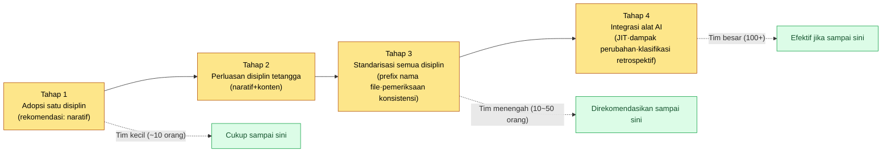

# 2.3 Desain Layer — Abstraksi Sistem Game

Ini terjadi pada masa ketika jumlah disiplin kami bertambah dari tiga menjadi delapan. Seorang Game Designer combat menetapkan jangkauan skill pada 8m. Pada minggu yang sama, seorang Level Designer mengunci lebar lorong dungeon pada 6m. Keduanya merupakan keputusan yang sepenuhnya masuk akal di dalam disiplin masing-masing. Masalahnya baru terungkap pada build tiga minggu kemudian. Skill area-of-effect (AoE) menembus dinding lorong, dan musuh mati di tempat yang bahkan tidak terlihat. Itu bukan kesalahan siapa pun. Kedua orang itu hanya tidak punya jendela untuk mengintip keputusan satu sama lain.

Bab ini bercerita tentang cara membuat jendela tersebut. Yaitu, membuat setiap disiplin tetap memiliki ruangannya sendiri, sambil bisa mengetahui apa yang terjadi di ruangan sebelah hanya melalui satu koordinat. Sistem koordinat itu kita sebut Layer.

---

## 2.3.1 Silo — Musuh yang Berulang Kali Kita Temui

Desain game terbagi-bagi menjadi disiplin yang sangat halus. Sistem, combat, naratif, konten, level, balance, UX, QA. Setiap disiplin punya alat, keluaran, dan rapatnya sendiri. Semakin besar skalanya, masing-masing semakin tenggelam dalam wilayahnya sendiri, hingga tidak tahu apa yang dikerjakan disiplin lain. Keadaan ini disebut silo.

Biaya dari silo baru terlihat setelah waktu berlalu.

- Jangkauan skill yang diputuskan oleh desain combat tidak cocok dengan lebar lorong dari desain level.
- Motivasi NPC yang dirancang naratif berbenturan dengan struktur reward quest dari desain konten.
- Siklus ekonomi yang ditetapkan desain balance tidak selaras dengan jadwal reward kehadiran dari Live Ops.

Penyebabnya bukan kurangnya kemampuan. Masing-masing memutuskan secara rasional di dalam disiplinnya sendiri, dan hanya tidak memiliki jalur untuk menyadari keputusan disiplin lain. Jika ditambal dengan rapat, rapat akan meledak jumlahnya; jika ditambal dengan grup chat, sinyal akan tenggelam dalam noise. Bukan berarti rapat dan grup chat tidak berharga, melainkan intinya adalah memperjelas batas antara bagian yang bisa ditambal dan yang tidak.

Solusinya adalah membuat agar setiap disiplin bisa saling mengetahui alur kerja masing-masing (visibilitas terintegrasi) tanpa mempersempit wilayahnya (mempertahankan diferensiasi disiplin). Dua kebutuhan yang tampak berseberangan ini bisa dicapai sekaligus jika diselaraskan di atas satu sistem koordinat yang sama. Sistem koordinat itu adalah Layer. Diibaratkan kantor, ini seperti masing-masing punya mejanya sendiri sambil melihat jam dinding dan kalender yang sama.

---

## 2.3.2 Definisi Layer — Abstraksi 5 Tingkat

Layer yang digunakan dalam buku ini adalah abstraksi 5 tingkat dari 0 sampai 4. Semakin ke atas semakin abstrak dan jarang berubah; semakin ke bawah semakin konkret dan sering berubah.

<svg viewBox="0 0 760 300" xmlns="http://www.w3.org/2000/svg" font-family="sans-serif" role="img" aria-label="Struktur abstraksi 5 tingkat Layer 0 sampai 4 dan peran procedural generation tiap tingkat">
  <defs>
    <marker id="arrowDown" markerWidth="8" markerHeight="8" refX="4" refY="7" orient="auto">
      <path d="M0,0 L8,0 L4,8 z" fill="#555"/>
    </marker>
  </defs>
  <text x="20" y="24" font-size="13" fill="#888">Abstrak · Tetap</text>
  <text x="640" y="24" font-size="13" fill="#888">Konkret · Berubah</text>

  <rect x="20" y="36" width="720" height="42" rx="6" fill="#c0392b" opacity="0.9"/>
  <text x="34" y="55" font-size="14" fill="#fff" font-weight="bold">L0 Visi · Nilai Inti</text>
  <text x="34" y="72" font-size="12" fill="#fff">Peran procedural generation: jangkar konteks — tetap, titik acuan yang diinjeksikan setiap pemanggilan</text>

  <rect x="20" y="86" width="720" height="42" rx="6" fill="#e67e22" opacity="0.9"/>
  <text x="34" y="105" font-size="14" fill="#fff" font-weight="bold">L1 Kerangka Sistem · Dunia</text>
  <text x="34" y="122" font-size="12" fill="#fff">Peran procedural generation: aturan input generasi — rulebook · relasi · tag (kendala yang dipatuhi generator)</text>

  <rect x="20" y="136" width="720" height="42" rx="6" fill="#f1c40f" opacity="0.95"/>
  <text x="34" y="155" font-size="14" fill="#333" font-weight="bold">L2 Konten · Flow</text>
  <text x="34" y="172" font-size="12" fill="#333">Peran procedural generation: tempat isi hasil generasi menumpuk — quest · progresi · kurva level</text>

  <rect x="20" y="186" width="720" height="42" rx="6" fill="#27ae60" opacity="0.9"/>
  <text x="34" y="205" font-size="14" fill="#fff" font-weight="bold">L3 Implementasi · Sheet Data</text>
  <text x="34" y="222" font-size="12" fill="#fff">Peran procedural generation: nilai · ID · relasi — nilai input untuk simulasi</text>

  <rect x="20" y="236" width="720" height="42" rx="6" fill="#2980b9" opacity="0.9"/>
  <text x="34" y="255" font-size="14" fill="#fff" font-weight="bold">L4 Build · Keluaran QA</text>
  <text x="34" y="272" font-size="12" fill="#fff">Peran procedural generation: verification gate (gerbang verifikasi) — hasil build · bug · play capture</text>

  <line x1="10" y1="40" x2="10" y2="274" stroke="#555" stroke-width="1.5" marker-end="url(#arrowDown)"/>
</svg>

Peran yang dipikul masing-masing dari lima tingkat ini dalam pipeline procedural generation dan otomatisasi tertera pada label sisi kanan diagram di atas. Pemetaan inilah tulang punggung bab ini. Jika Anda hanya memandang Layer sebagai "folder yang rapi", Anda baru melihat setengahnya. Setiap tingkat berkorespondensi tepat dengan satu tahap pipeline generasi (jangkar → aturan → isi → nilai → gate).

| Layer | Apa yang Diisikan | Frekuensi Perubahan |
|-------|---------------|-----------|
| Layer 0 | Pengalaman inti yang ingin diberikan game kepada pemain. Bisa dipadatkan menjadi satu kalimat | Sangat rendah (sepanjang umur proyek) |
| Layer 1 | Struktur besar sistem game dan kerangka latar dunia | Rendah (per milestone) |
| Layer 2 | Alur permainan, quest line, tahap progresi, kurva level | Sedang (per sprint) |
| Layer 3 | Nilai data aktual, parameter, rumus, variabel | Tinggi (per hari) |
| Layer 4 | Hasil yang dikonfirmasi pada build, bug report, video gameplay | Sangat tinggi (real-time) |

Kelima tingkat ini bukan konsep eksklusif game. Tulang punggung yang sama bisa dipindahkan apa adanya ke pengembangan produk IT umum. Pembaca yang belum pernah membuat game dapat menyandingkan setiap tingkat dengan keluarannya sendiri melalui tabel terjemahan peran di bawah (kiri adalah Layer desain game, kanan adalah keluaran yang menempati posisi yang sama pada SaaS, aplikasi, sistem internal, dan sebagainya).

| Layer | Desain Game | Produk IT Umum | Pertanyaan yang Sama |
|-------|-----------|--------------|-----------|
| L0 Pengalaman Inti | Pengalaman inti yang ingin diberikan kepada pemain (satu kalimat) | Visi produk — masalah siapa dan apa yang dipecahkan, serta bagaimana | "Mengapa ini dibuat" |
| L1 Aturan Sistem | Struktur sistem · kerangka latar dunia | Aturan bisnis · fungsi — aturan domain, model otorisasi, alur kerja inti | "Apa yang harus bekerja dan bagaimana" |
| L2 Konten | Quest line · tahap progresi · kurva level | Rilis · roadmap — paket fitur, urutan peluncuran, milestone | "Apa yang dikeluarkan dan kapan" |
| L3 Data | Nilai data · parameter · rumus | Sheet spesifikasi — spesifikasi API, definisi field, nilai konfigurasi, ambang batas | "Berapa nilai dan apa definisi yang tepat" |
| L4 Build · QA | Hasil build · bug · video gameplay | Deployment · QA — keluaran deployment, bug report, log monitoring | "Apakah yang benar-benar dirilis berjalan dengan benar" |

Cara membacanya sama persis dengan game. Semakin ke atas semakin jarang berubah (visi produk berubah sekali per kuartal), semakin ke bawah semakin sering (nilai konfigurasi berubah setiap hari). Kecelakaan silo yang kita lihat sebelumnya — adegan ketika jangkauan dan lebar lorong berbenturan — memiliki struktur yang persis sama dengan kejadian di IT umum: "definisi field backend (L3) dan aturan tampilan frontend (L1) tidak selaras lalu meletus tepat sebelum peluncuran". Hanya nama disiplinnya yang berbeda, tulang punggungnya satu.

Kelima tingkat ini tidak bersifat absolut. Tergantung skala dan domain, 4 tingkat bisa pas, atau 6 tingkat bisa diperlukan. Intinya bukan bahwa angkanya 5, melainkan tindakan mendefinisikan tingkat secara eksplisit itu sendiri.

Satu keluaran bisa membentang di dua Layer. "GDD (Game Design Document, spesifikasi rinci) sistem skill" memuat desain sistem (Layer 1) dan data konkret (Layer 3) sekaligus. Dalam kasus ini, pecah dokumennya atau letakkan Layer utama pada 1 lalu pisahkan bagian data menjadi sheet tersendiri; cara apa pun yang dipakai, nyatakan secara eksplisit di Layer mana setiap bagian berada.

---

## 2.3.3 Prinsip Meta — Diferensiasi dan Integrasi Sekaligus

Disiplin membentang secara horizontal, sedangkan Layer bertumpuk secara vertikal. Pekerjaan satu disiplin membentang di beberapa Layer. Matriks di bawah merepresentasikan pusat massa distribusi dari 11 disiplin (horizontal) × Layer 0 sampai 4 (vertikal) melalui tingkat kepekatan warna sel. Sel yang lebih pekat adalah Layer pusat massa disiplin tersebut.

<svg viewBox="0 0 820 320" xmlns="http://www.w3.org/2000/svg" font-family="sans-serif" font-size="11" role="img" aria-label="Matriks diferensiasi integrasi dengan sumbu horizontal 11 disiplin dan sumbu vertikal Layer 0 sampai 4">
  <!-- column headers (분야) -->
  <g fill="#333">
    <text x="120" y="30" transform="rotate(-35 120 30)">Sistem</text>
    <text x="180" y="30" transform="rotate(-35 180 30)">Combat</text>
    <text x="240" y="30" transform="rotate(-35 240 30)">Naratif</text>
    <text x="300" y="30" transform="rotate(-35 300 30)">Konten</text>
    <text x="360" y="30" transform="rotate(-35 360 30)">Level</text>
    <text x="420" y="30" transform="rotate(-35 420 30)">Balance</text>
    <text x="480" y="30" transform="rotate(-35 480 30)">UX/UI</text>
    <text x="540" y="30" transform="rotate(-35 540 30)">QA</text>
    <text x="600" y="30" transform="rotate(-35 600 30)">Karakter</text>
    <text x="660" y="30" transform="rotate(-35 660 30)">Art</text>
    <text x="720" y="30" transform="rotate(-35 720 30)">Live</text>
  </g>
  <!-- row labels (Layer) -->
  <g fill="#333" text-anchor="end">
    <text x="95" y="74">L0 Visi</text>
    <text x="95" y="124">L1 Sistem</text>
    <text x="95" y="174">L2 Konten</text>
    <text x="95" y="224">L3 Data</text>
    <text x="95" y="274">L4 Build·QA</text>
  </g>
  <!-- grid cells: x columns at 110,170,...,710 ; y rows at 60,110,160,210,260 ; cell 50x40 -->
  <!-- color helper: dark=#2c3e50 mid=#7f8c9b light=#dfe4ea -->
  <!-- L0 row (y=60) -->
  <g>
    <rect x="110" y="60" width="50" height="40" fill="#dfe4ea" stroke="#fff"/>
    <rect x="170" y="60" width="50" height="40" fill="#dfe4ea" stroke="#fff"/>
    <rect x="230" y="60" width="50" height="40" fill="#2c3e50" stroke="#fff"/>
    <rect x="290" y="60" width="50" height="40" fill="#dfe4ea" stroke="#fff"/>
    <rect x="350" y="60" width="50" height="40" fill="#dfe4ea" stroke="#fff"/>
    <rect x="410" y="60" width="50" height="40" fill="#dfe4ea" stroke="#fff"/>
    <rect x="470" y="60" width="50" height="40" fill="#dfe4ea" stroke="#fff"/>
    <rect x="530" y="60" width="50" height="40" fill="#7f8c9b" stroke="#fff"/>
    <rect x="590" y="60" width="50" height="40" fill="#dfe4ea" stroke="#fff"/>
    <rect x="650" y="60" width="50" height="40" fill="#2c3e50" stroke="#fff"/>
    <rect x="710" y="60" width="50" height="40" fill="#dfe4ea" stroke="#fff"/>
  </g>
  <!-- L1 row (y=110) -->
  <g>
    <rect x="110" y="110" width="50" height="40" fill="#2c3e50" stroke="#fff"/>
    <rect x="170" y="110" width="50" height="40" fill="#2c3e50" stroke="#fff"/>
    <rect x="230" y="110" width="50" height="40" fill="#7f8c9b" stroke="#fff"/>
    <rect x="290" y="110" width="50" height="40" fill="#dfe4ea" stroke="#fff"/>
    <rect x="350" y="110" width="50" height="40" fill="#7f8c9b" stroke="#fff"/>
    <rect x="410" y="110" width="50" height="40" fill="#dfe4ea" stroke="#fff"/>
    <rect x="470" y="110" width="50" height="40" fill="#2c3e50" stroke="#fff"/>
    <rect x="530" y="110" width="50" height="40" fill="#7f8c9b" stroke="#fff"/>
    <rect x="590" y="110" width="50" height="40" fill="#2c3e50" stroke="#fff"/>
    <rect x="650" y="110" width="50" height="40" fill="#7f8c9b" stroke="#fff"/>
    <rect x="710" y="110" width="50" height="40" fill="#dfe4ea" stroke="#fff"/>
  </g>
  <!-- L2 row (y=160) -->
  <g>
    <rect x="110" y="160" width="50" height="40" fill="#7f8c9b" stroke="#fff"/>
    <rect x="170" y="160" width="50" height="40" fill="#7f8c9b" stroke="#fff"/>
    <rect x="230" y="160" width="50" height="40" fill="#2c3e50" stroke="#fff"/>
    <rect x="290" y="160" width="50" height="40" fill="#2c3e50" stroke="#fff"/>
    <rect x="350" y="160" width="50" height="40" fill="#2c3e50" stroke="#fff"/>
    <rect x="410" y="160" width="50" height="40" fill="#dfe4ea" stroke="#fff"/>
    <rect x="470" y="160" width="50" height="40" fill="#7f8c9b" stroke="#fff"/>
    <rect x="530" y="160" width="50" height="40" fill="#dfe4ea" stroke="#fff"/>
    <rect x="590" y="160" width="50" height="40" fill="#7f8c9b" stroke="#fff"/>
    <rect x="650" y="160" width="50" height="40" fill="#dfe4ea" stroke="#fff"/>
    <rect x="710" y="160" width="50" height="40" fill="#2c3e50" stroke="#fff"/>
  </g>
  <!-- L3 row (y=210) -->
  <g>
    <rect x="110" y="210" width="50" height="40" fill="#2c3e50" stroke="#fff"/>
    <rect x="170" y="210" width="50" height="40" fill="#2c3e50" stroke="#fff"/>
    <rect x="230" y="210" width="50" height="40" fill="#7f8c9b" stroke="#fff"/>
    <rect x="290" y="210" width="50" height="40" fill="#7f8c9b" stroke="#fff"/>
    <rect x="350" y="210" width="50" height="40" fill="#2c3e50" stroke="#fff"/>
    <rect x="410" y="210" width="50" height="40" fill="#2c3e50" stroke="#fff"/>
    <rect x="470" y="210" width="50" height="40" fill="#7f8c9b" stroke="#fff"/>
    <rect x="530" y="210" width="50" height="40" fill="#7f8c9b" stroke="#fff"/>
    <rect x="590" y="210" width="50" height="40" fill="#2c3e50" stroke="#fff"/>
    <rect x="650" y="210" width="50" height="40" fill="#dfe4ea" stroke="#fff"/>
    <rect x="710" y="210" width="50" height="40" fill="#7f8c9b" stroke="#fff"/>
  </g>
  <!-- L4 row (y=260) -->
  <g>
    <rect x="110" y="260" width="50" height="40" fill="#dfe4ea" stroke="#fff"/>
    <rect x="170" y="260" width="50" height="40" fill="#7f8c9b" stroke="#fff"/>
    <rect x="230" y="260" width="50" height="40" fill="#7f8c9b" stroke="#fff"/>
    <rect x="290" y="260" width="50" height="40" fill="#dfe4ea" stroke="#fff"/>
    <rect x="350" y="260" width="50" height="40" fill="#dfe4ea" stroke="#fff"/>
    <rect x="410" y="260" width="50" height="40" fill="#7f8c9b" stroke="#fff"/>
    <rect x="470" y="260" width="50" height="40" fill="#dfe4ea" stroke="#fff"/>
    <rect x="530" y="260" width="50" height="40" fill="#2c3e50" stroke="#fff"/>
    <rect x="590" y="260" width="50" height="40" fill="#dfe4ea" stroke="#fff"/>
    <rect x="650" y="260" width="50" height="40" fill="#7f8c9b" stroke="#fff"/>
    <rect x="710" y="260" width="50" height="40" fill="#2c3e50" stroke="#fff"/>
  </g>
  <!-- legend -->
  <g>
    <rect x="110" y="305" width="14" height="12" fill="#2c3e50"/>
    <text x="128" y="315" fill="#333">Pusat massa</text>
    <rect x="220" y="305" width="14" height="12" fill="#7f8c9b"/>
    <text x="238" y="315" fill="#333">Distribusi sekunder</text>
    <rect x="320" y="305" width="14" height="12" fill="#dfe4ea"/>
    <text x="338" y="315" fill="#333">Minim · tidak ada</text>
  </g>
</svg>

Jika dibaca secara vertikal, terlihat satu disiplin membentang di Layer mana saja; jika dibaca secara horizontal, terlihat disiplin mana saja yang berkumpul di satu Layer. Baris L0 (visi) paling pekat pada naratif dan art direction — dua disiplin yang paling dekat dengan visi. Baris L3 (data) berkumpul pekat pada sistem, combat, level, balance, dan karakter — sinyal bahwa mereka saling berbenturan di sheet data.

Dengan memiliki distribusi ini secara eksplisit, disiplin lain langsung tahu posisinya ketika berkata "aku harus melihat Layer 2 milik combat". Bukan tembok silo yang runtuh, melainkan jendela yang dilubangkan di tembok itu.

Jika seluruh matriks diringkas menjadi satu kalimat, jadinya begini. Sumbu vertikal Layer dibagi untuk mengotomatiskan generasi, sumbu horizontal disiplin dibagi untuk menghidupkan keahlian. Keduanya bertemu di satu sel kisi.

---

## 2.3.4 Studi Kasus Operasional — Pengukuran Nyata Sebuah Proyek MMORPG

Proyek MMORPG A yang saya kelola sebagai Design Director telah mengoperasikan sistem Layer selama sekitar 6 bulan bersama tim desain (4 sampai 5 orang) (keseluruhan tim pengembangan berskala menengah, 10 sampai 50 orang). Mari kita lihat kasus konkretnya.

Pertama, 5 tingkat naratif. Folder desain naratif itu sendiri terbagi berdasarkan Layer.

<svg viewBox="0 0 640 230" xmlns="http://www.w3.org/2000/svg" font-family="sans-serif" font-size="13" role="img" aria-label="Struktur pembagian Layer 0 sampai 4 pada folder naratif">
  <text x="20" y="26" font-weight="bold" fill="#333">NarrativeDocs/</text>
  <g>
    <rect x="40" y="40" width="240" height="30" rx="4" fill="#c0392b" opacity="0.9"/>
    <text x="52" y="60" fill="#fff">Layer0_Vision/</text>
    <text x="300" y="60" fill="#555">Pesan inti dunia, 1.1~1.2</text>
  </g>
  <g>
    <rect x="40" y="76" width="240" height="30" rx="4" fill="#e67e22" opacity="0.9"/>
    <text x="52" y="96" fill="#fff">Layer1_World/</text>
    <text x="300" y="96" fill="#555">Penataan wilayah · faksi · era</text>
  </g>
  <g>
    <rect x="40" y="112" width="240" height="30" rx="4" fill="#f1c40f" opacity="0.95"/>
    <text x="52" y="132" fill="#333">Layer2_StoryLine/</text>
    <text x="300" y="132" fill="#555">Alur main quest</text>
  </g>
  <g>
    <rect x="40" y="148" width="240" height="30" rx="4" fill="#27ae60" opacity="0.9"/>
    <text x="52" y="168" fill="#fff">Layer3_DialogueSheet/</text>
    <text x="300" y="168" fill="#555">Data dialog · nama aktual</text>
  </g>
  <g>
    <rect x="40" y="184" width="240" height="30" rx="4" fill="#2980b9" opacity="0.9"/>
    <text x="52" y="204" fill="#fff">Layer4_BuildVO/</text>
    <text x="300" y="204" fill="#555">Voice over yang masuk ke build</text>
  </g>
</svg>

Ketika penulis naratif mengubah satu percabangan main story di Layer 2, dampaknya merembet ke sheet dialog Layer 3, dan ke voice Layer 4 yang sudah direkam bisa muncul dampak yang tidak dapat dibalik. Karena Layer dinyatakan eksplisit, rentang dampak langsung dapat dilacak.

Alat pembuat peta relasi otomatis `gen_relation_map.py` juga dioperasikan bersama. Alat ini menganalisis relasi foreign key antar-sheet data untuk membuat peta relasi HTML interaktif, dan merepresentasikan Layer melalui warna node (merah=L1 sistem, kuning=L2 konten, hijau=L3 data). Dari Layer mana ke Layer mana dependensi mengalir terlihat sekilas. Jika dependensi mengalir terbalik — jika L3 menembakkan panah ke arah L1 — hampir selalu itu cacat desain.

Dokumen master procedural level generation menyatakan koordinat Layer di frontmatter.

```yaml
---
title: Master Desain Level Prosedural v0.1
layer_inputs: [L1.World, L2.StoryLine]
layer_outputs: [L3.LevelData, L4.PlayCapture]
---
```

Dengan dua baris ini, dideklarasikan bahwa "pipeline ini menerima input Layer 1·2 dan membuat Layer 3·4", dan penghitungan rentang dampak saat perubahan menjadi otomatis. Visi L0 selalu menjadi input meski tidak dinyatakan — karena jangkar visi selalu ikut menempel di setiap generasi apa pun.

Ada pula aturan atom yang memaksakan prefix Layer pada nama dokumen. Salah satu atom yang dibagi tim adalah seperti ini.

> **`docs_layer_numeric_prefix_naming`**: Nama file sheet data wajib memiliki prefix nomor Layer (`L1_`, `L2_`, `L3_`). Sheet tanpa prefix akan diberi peringatan pada pemeriksaan konsistensi.

Aturan semakin sederhana semakin kuat. Dengan sekadar mengurutkan berdasarkan nama saja, file sudah terkelompok per Layer, dan alat AI pun tahu Layer hanya dari nama file. Meski manusia lupa, pemeriksaan konsistensi akan menangkapnya.

---

## 2.3.5 Deteksi Referensi Terbalik — Worked Transcript (rekaman sesi nyata)

Pada subbab sebelumnya (2.3.4) telah dikatakan "jika L3 menembakkan panah ke arah L1, hampir selalu itu cacat desain". Apa yang terjadi jika deteksi ini diserahkan kepada AI alih-alih mata manusia? Saya pindahkan apa adanya satu sesi nyata yang benar-benar saya jalankan, tanpa dirapikan (hanya informasi yang mengidentifikasi perusahaan yang dianonimkan).

**[Teks Lengkap Prompt]**

```
Lihat dua frontmatter terlampir dan periksa apakah arah dependensi Layer normal.
Referensi hanya boleh mengalir dari nomor tinggi → nomor rendah agar normal. Kalau terbalik, beri peringatan.

--- Dokumen A (L1_combat_system.md) ---
title: Kerangka Sistem Combat
layer: L1
refs: [L3_skill_damage_sheet, L2_combat_flow]

--- Dokumen B (L3_skill_damage_sheet.md) ---
title: Sheet Damage Skill
layer: L3
refs: [L1_combat_system]
```

**[Keluaran Mentah Claude — Apa Adanya Tanpa Ringkasan]**

```
Saya telah memeriksa kedua dokumen.

Dokumen B (L3_skill_damage_sheet, L3):
  refs → [L1_combat_system]
  Arah: L3 → L1 (konkret → abstrak)
  Putusan: Normal. Sheet data yang merujuk kerangka sistem
        yang diikutinya adalah arah yang wajar.

Dokumen A (L1_combat_system, L1):
  refs → [L3_skill_damage_sheet, L2_combat_flow]
  - L1 → L2 : Normal (desain menunjuk ke alur di bawahnya)
  - L1 → L3 : ⚠ Peringatan arah terbalik
        Kerangka sistem L1 secara langsung merujuk sheet
        data L3. Ini berarti "dokumen desain bergantung pada
        nilai data tertentu", sehingga menciptakan kopling
        yang mengharuskan dokumen desain disentuh setiap kali
        data berubah.

Rekomendasi: Hapus L3_skill_damage_sheet dari refs Dokumen A.
      Jika kerangka sistem perlu mengetahui nilai konkret,
      pindahkan nilai itu menjadi aturan abstrak di L1
      (misal: "damage dasar adalah koefisien kelas × level"),
      atau lewati melalui dokumen flow L2.

Ringkasan: 1 referensi arah terbalik terdeteksi (A: L1 → L3).
```

**[Verifikasi Manusia / Penolakan]**

Putusan AI benar. Hanya saja, rekomendasi "lewati melalui dokumen flow L2" terlalu berlebihan pada kasus ini. Yang perlu diketahui L1 adalah *bentuk* rumus damage, bukan sel tertentu dari sheet. Karena itu saya hanya menerima rekomendasi kedua (mengangkatnya menjadi aturan abstrak) dan menolak usul melewati L2.

**[Permintaan Ulang]**

```
Tanpa usul melewati, tunjukkan saja diff perbaikan
L1_combat_system.md ke arah "hanya bentuk rumus damage yang
diangkat menjadi aturan abstrak di L1". Rapikan juga refs-nya.
```

Satu siklus inilah markas besar deteksi referensi terbalik. AI menangkap pelanggaran arah (otomatis), manusia memangkas batas kewajaran rekomendasi (tinjauan), lalu hanya pekerjaan yang sudah dipersempit yang dijalankan ulang (permintaan ulang). Pada Proyek A, `gen_relation_map.py` bekerja pada level graf, dan atom `portal_layer_change_impact_check` aktif pada saat perubahan terdeteksi untuk memaksakan pemeriksaan rentang dampak.

Jika perbandingan ini dilakukan manusia sendiri, membuka dua dokumen, mencocokkan refs, dan memutuskan arahnya butuh beberapa menit. Jika dokumen bertambah menjadi ratusan, ini praktis mustahil. Referensi terbalik selalu menyusup satu-dua diam-diam, dan baru meletus pada build jauh kemudian.

---

## 2.3.6 Dekomposisi Layer = Prasyarat Procedural Generation dan Otomatisasi

Tujuan permukaan integrasi Layer adalah menghapus silo dan menyatukan bahasa kolaborasi (2.3.1\~2.3.5). Tujuan esensialnya satu langkah lebih dalam. Jika dekomposisi Layer mengakar, prasyarat untuk procedural generation dan otomatisasi pun terpenuhi.

Studi kasus operasional dari dua subbab sebelumnya berada pada tahap manusia memutuskan dan AI membantu verifikasi serta injeksi. Berikutnya, kita masuk ke tahap di mana produksi massal disiplin itu sendiri dibuat AI sebagai kandidat dan manusia yang mengadopsinya. Ada tiga alasan mengapa prasyarat perpindahan ini adalah dekomposisi Layer. ① Generasi kandidat AI harus bisa menyatakan secara eksplisit "Layer mana dan apa yang akan digenerasi". ② Pemeriksaan konsistensi otomatis baru bekerja jika arah dependensi antar-Layer terstandar (deteksi referensi terbalik pada 2.3.5). ③ Penghitungan dampak perubahan otomatis baru mungkin jika ada koordinat tentang di Layer mana perubahan terjadi. Ketiganya berkumpul pada satu titik: "tanpa dekomposisi Layer, otomatisasi itu sendiri tersumbat". Di ujung tangan yang membagi koordinat, sejak awal sudah terletak procedural generation.

Karena belum perlu masuk dalam-dalam pada tahap di mana bagian per-disiplin belum dilihat, saya hanya menggariskan dua tahap penerapannya secara garis besar. **Penerapan konservatif** adalah manusia memutuskan, dan AI secara otomatis membantu pemeriksaan konsistensi, penghitungan dampak perubahan, dan injeksi JIT — studi kasus operasional 2.3.4·2.3.5 ada di sini. Biaya alatnya kecil dan efek akumulatifnya muncul sekitar bulan ke-6 operasional, sehingga sebagian besar tim berskala menengah (10 sampai 50 orang) dapat mencapainya. **Penerapan progresif** melangkah satu langkah lebih jauh: AI membuat produksi massal disiplin itu sendiri sebagai kandidat (Persona naratif, rulebook PCG, level prosedural, kandidat perubahan balance, aset art, dan sebagainya) dan manusia hanya memutuskan "kandidat mana yang diadopsi". Bentuk dan kematangan alat per-disiplin dibahas pada bagian disiplin yang bersangkutan.

Tiga elemen yang dibutuhkan secara umum lintas disiplin untuk penerapan progresif adalah ① infrastruktur pemisahan dan pelabelan Layer (frontmatter · atom · prefix nama file), ② siklus generasi dan evaluasi kandidat (N kandidat AI → evaluasi otomatis → laporan peringkat dan dasar), ③ verification gate (gerbang verifikasi) manusia (hanya hasil yang diadopsi yang naik ke Layer berikutnya). Namun, pada titik kapan pun, inti deterministik (simulasi · fisika · kendala hukum) ditangani oleh manusia dan kode deterministik, dan semua tinjauan diselesaikan pada tahap yang dapat dibalik sebelum memasuki tahap yang tidak dapat dibalik (rekaman · casting · paparan live, dan sebagainya) — batas dapat dibalik / tidak dapat dibalik ini adalah prinsip umum lintas disiplin.

Terakhir, satu catatan waktu. Penerapan konservatif sebagian mungkin dilakukan bahkan pada dekade 2010-an, tetapi penerapan progresif terhalang tiga keterbatasan: daya ungkap generasi kandidat AI, interpretasi bahasa alami pada evaluasi otomatis, dan beban tinjauan manusia. Setelah perkembangan LLM, ketiganya masuk ke ranah praktis, dan penerapan progresif turun dari visi di atas kertas ke tahap praktik. Di sinilah letak pesan meta yang menembus seluruh buku ini: perkembangan AI mengangkat kelayakan realisasi procedural generation dan otomatisasi.

---

## 2.3.7 Koordinat Disiplin — Tempat Bagian Per-Disiplin Buku Ini Tinggal

Bagian per-disiplin buku ini menyatakan secara eksplisit di pengantar Layer mana yang umumnya didistribusi tiap disiplin, dan di dalam bab pun sering menggunakan koordinat Layer. Saya rangkum lebih dahulu (ini memindahkan pusat massa matriks 2.3.3 ke dalam tabel).

| Disiplin | Layer Utama | Catatan |
|------|----------|------|
| System Design | L1\~L3 | Luas dari kerangka desain sampai sheet data |
| Combat Design | L1\~L3, sebagian L4 | Kerangka combo\~sheet damage, pengukuran build |
| Narrative Design | L0\~L4 | Mengoperasikan struktur 5 lapis sebagai folder |
| Content Design | Berpusat di L2 | Alur progresi · quest line |
| Level Design | L2\~L3 | Termasuk pipeline procedural generation |
| Balance Design | Berpusat di L3, pengukuran L4 | Nilai data · kurva · pengukuran verifikasi |
| UX/UI Design | L1\~L3 | Kerangka interaksi\~data tampilan |
| QA Design | Berpusat di L4, verifikasi L0\~L3 | Verifikasi apakah semua Layer terefleksi di build |
| Karakter · Pet · Mount | L1\~L3 | Sistem · dunia · data |
| Art Direction | L0\~L1 + keluaran L4 | Panduan visi · dunia + tinjauan build |
| Live Ops | L2\~L4 | Siklus operasional · data real-time |

Setiap disiplin menyentuh Layer lain juga, tetapi jika kita tahu pusat massanya, jalur kolaborasi terlihat. Balance (L3) dan Live (L2\~L4) bertemu di L3 sehingga harus selalu berkolaborasi erat, dan dua disiplin yang paling dekat dengan visi (L0) adalah naratif dan art direction. Hubungan kedekatan seperti ini terungkap secara alami di atas sistem koordinat.

---

## 2.3.8 Mulai Kecil, Tumbuhkan Besar

Jika Anda berniat menerapkan sistem Layer dengan sempurna sejak awal, Anda bahkan tidak akan bisa memulai. Memasukkannya secara bertahap adalah jawabannya.



- **Tahap 1 (Satu Disiplin)**: Pilih hanya satu disiplin (rekomendasi: naratif) lalu bagi foldernya berdasarkan Layer. Biarkan disiplin lain, operasikan satu-dua bulan sambil mematangkan definisi Layer.
- **Tahap 2 (Perluasan Disiplin Tetangga)**: Terapkan sekaligus pada dua disiplin yang kurva diferensiasinya berdekatan (misal: naratif+konten) untuk mengamati pola bagaimana Layer saling bertaut, lalu buat 1\~2 aturan konsistensi dengan atom.
- **Tahap 3 (Standarisasi Semua Disiplin)**: Berikan koordinat Layer ke semua disiplin, perkenalkan aturan nama file (prefix `L1_`·`L2_`·`L3_`), dan otomatiskan peta relasi serta pemeriksaan konsistensi.
- **Tahap 4 (Integrasi Alat AI)**: Manfaatkan metadata Layer pada JIT hook, hitung otomatis rentang dampak perubahan, dan tambahkan klasifikasi Layer ke sistem retrospektif.

Setiap tahap minimal satu bulan, paling lama satuan kuartal. Jika dipaksakan, manusia akan lelah. Mengatur kecepatan agar beban operasional tidak melampaui nilai adopsi adalah tugas direktur.

Skala kecil (\~10 orang) sampai tahap 1\~2, menengah (10\~50 orang) tahap 3, besar (100+) harus sampai tahap 4 baru efektif. Bukan berarti tim kecil tidak bisa menggunakannya. Hanya kedalamannya yang berbeda; nilai intinya sudah dimulai sejak tahap 1.

---

## 2.3.9 Kesimpulan — Tulang Punggung Seluruh Buku

Layer bukan sekadar teknik merapikan folder. Ia adalah prinsip meta yang mengikat desain game yang terdiferensiasi menjadi satu sistem koordinat agar AI bisa bernalar, dan lebih jauh lagi merupakan prasyarat umum procedural generation dan otomatisasi per-disiplin.

- Diferensiasi dihidupkan — keahlian dan alat setiap disiplin dibiarkan apa adanya.
- Integrasi ditambahkan — semua keluaran diselaraskan di atas sistem koordinat yang sama.
- AI memahami sistem koordinat ini untuk melakukan injeksi otomatis · pemeriksaan konsistensi · propagasi perubahan (penerapan konservatif).
- Di atas sistem koordinat yang sama, penerapan progresif per-disiplin tumbuh secara bertahap.

Seluruh bagian buku ini yang tersisa mengandaikan bab ini. Bagian per-disiplin menyatakan secara eksplisit di pengantar koordinat yang ditempati tiap disiplin pada Layer, bagian proses membahas sistem operasional yang melintasi Layer, dan bagian operasional membahas siklus self-improving dari sistem Layer itu sendiri.

Bab berikutnya (Ontologi Game dan Knowledge Graph) menambahkan relasi makna di atas Layer. Jika Layer adalah koordinat, ontologi adalah panah makna di atas koordinat itu. Hanya jika keduanya bergabung, AI baru dapat bernalar secara mandiri bahwa "dokumen ini memberi dampak pada dokumen itu".

Ada satu hal yang perlu saya pertegas. Tidak ada otomatisasi apa pun di bab ini yang menggantikan keputusan. Pada deteksi referensi terbalik, mesin hanya menggelar kandidat pelanggaran; yang memilih apa dan sampai mana harus diterima adalah tangan manusia. Layer adalah sistem koordinat yang membantu manusia mengambil keputusan yang lebih baik dengan lebih cepat, bukan perangkat untuk melempar keputusan.

---

### Poin-Poin Penting

- Layer adalah sistem koordinat yang menambahkan visibilitas terintegrasi sambil menghidupkan diferensiasi disiplin, sekaligus tulang punggung seluruh buku.
- Masing-masing dari 5 tingkat berkorespondensi dengan satu peran procedural generation (jangkar · aturan · isi · nilai · gate).
- Seperti deteksi referensi terbalik (L3→L1), bentuk jawaban otomatisasi yang benar adalah AI menangkap dan manusia memangkas.

### Atom Inti Bab Ini (Referensi)

- `layer_unified_design_philosophy` — atom induk bab ini
- `docs_layer_numeric_prefix_naming` — aturan pemaksaan prefix nama file
- `dead_table_5layer_cleanup` — aturan perapian sheet di luar 5 tingkat
- `portal_layer_change_impact_check` — pemeriksaan otomatis dampak perubahan

### Pratinjau Bab Berikutnya

- Bab 7. Ontologi Game dan Knowledge Graph — Menambahkan panah makna di atas koordinat Layer
- Bab 8. Sistem Wikilink — Pola referensi yang diekstrak dari pengetahuan operasional

---

## Coba Sendiri

**setup** — Pilih satu folder disiplin (rekomendasi: naratif) lalu bagi subfoldernya menjadi 5, dari `Layer0_Vision/` sampai `Layer4_BuildVO/`. Pindahkan file yang ada ke Layer yang sesuai. File yang namanya ambigu ditempatkan berdasarkan "seberapa sering dokumen ini berubah" (semakin sering berubah, semakin ke Layer bawah).

**prompt** — Pilih dua frontmatter sheet data, tempel apa adanya teks lengkap prompt 2.3.5, dan minta AI memutuskan arah dependensi Layer. Cukup berikan satu baris aturan inti dengan tepat. "Referensi hanya boleh mengalir dari konkret→abstrak (nomor tinggi→nomor rendah) agar normal."

**verify** — Jika AI menangkap referensi arah terbalik, jangan terima rekomendasinya apa adanya, tetapi pangkas sendiri batas kewajarannya (lihat "Verifikasi Manusia/Penolakan" pada 2.3.5). Minta ulang hanya arah yang Anda adopsi dalam bentuk diff. Jika setelah diurutkan berdasarkan nama Layer terlihat terkelompok dari atas ke bawah, berarti aturan prefix sudah mengakar.

## Versi Ringkas Solo

Layer tetap bekerja meski Anda bekerja sendiri. Karena tidak ada tim, tidak ada "silo antar-disiplin", tetapi ada "silo antar-waktu". Saya tiga minggu lalu dan saya hari ini saling melupakan keputusan masing-masing. Dengan sekadar membagi folder menjadi Layer 0\~4 saja — satu lembar visi, beberapa lembar kerangka sistem, alur progresi, sheet data, memo build — saya langsung menemukan di sel mana saya yang dahulu menaruh apa. Jika kepada AI saya tambahkan satu baris saja "sekarang sedang mengerjakan L2", ia tidak akan menarik materi Layer yang tak relevan. Boleh juga dikurangi menjadi 4 tingkat atau 3 tingkat. Yang menjadi inti bukan angkanya, melainkan tindakan "menyatakan tingkat secara eksplisit".
