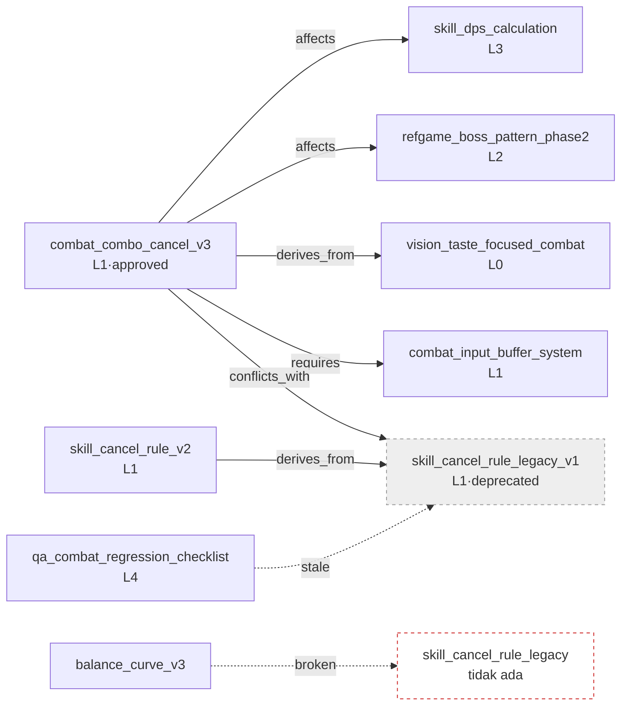

# 2.4 Ontologi dan Graf wikilink — Memverifikasi Panah Makna

Senin pagi, sebuah permintaan perubahan masuk. Anggota tim A dari tim combat menulis satu baris di messenger tim internal. "Saya akan ubah global cooldown dari 0.5 detik → 0.3 detik. Ada yang terdampak?" Biasanya, dari sinilah rapat 30 menit dimulai. Penanggung jawab rumus perhitungan damage mengangkat tangan, penanggung jawab aturan combo cancel ikut menimpali, dan seseorang bertanya, "Bukankah pola boss juga terpengaruh?" Tidak ada satu orang pun yang memegang seluruh gambaran di kepalanya, jadi rapat pun terisi dengan upaya mengingat-ingat.

Tapi kali ini berbeda. Satu detik setelah permintaan diajukan, sebuah bot otomatis menambahkan komentar. "Jika Anda mengubah atom ini, 4 atom akan terdampak. `skill_dps_calculation`, `combat_combo_cancel_v3`, `refgame_boss_pattern_phase2`, `balance_curve_v3`. Penanggung jawab: anggota tim B, anggota tim A, anggota tim C." Rapat tidak digelar. Empat orang masing-masing memeriksa atom-nya sendiri, dan selesai. (Bot ini akan kita buat sendiri nanti — 2.4.3.)

Komentar ini bukan sihir. Pada 2.3, kita memberikan koordinat Layer ke setiap atom, dan di atasnya, pada bab ini, kita menambahkan **panah makna** — keputusan mana memengaruhi keputusan mana. Koordinat hanya menyatakan sejauh "ada sesuatu di sini". Relasi seperti "ini memengaruhi itu", "itu harus ada lebih dulu agar ini berlaku", "kedua hal ini tidak boleh diaktifkan bersamaan" adalah panah yang digambar di atas koordinat. Bab ini membahas bagaimana menuliskan panah itu, dan bagaimana menangkap panah yang rusak secara otomatis.

> **Catatan Istilah**
> - ontologi (ontology): sistem yang mendefinisikan secara eksplisit konsep beserta relasi di antaranya. Dalam buku ini kita memakai versi ringan yang disederhanakan menjadi 6\~12 relasi.
> - wikilink: tautan antar-dokumen dalam format `[[atom_name]]`. Notasi ini dipinjam dari Obsidian, Roam, dan sejenisnya.
> - backlink (rujukan balik): daftar "atom-atom yang menunjuk ke atom ini". Arah kebalikan dari rujukan maju.
> - orphan (node yatim): atom yang tidak dirujuk dari mana pun. Sinyal kandidat untuk dihapus.
> - broken link (tautan rusak): wikilink yang menunjuk ke atom yang tidak ada. Jejak salah ketik atau perubahan nama.

---

## 2.4.1 Relasi Adalah Panah — Mengapa wikilink Saja Tidak Cukup

Pada 2.1 kita melekatkan metadata dengan frontmatter YAML, dan menaburkan wikilink di badan atom. Hanya dengan itu, dokumen sudah saling terhubung seperti jaring. Masalahnya, koneksi itu **tidak menuliskan apa maknanya**.

```markdown
Keputusan ini berlaku di atas [[skill_cooldown_rule_v2]].
```

Satu baris ini hanya menyatakan sejauh "menyebut skill_cooldown_rule_v2". Mengapa menyebutnya? Apakah keputusan ini **membutuhkan** aturan itu (requires), **diturunkan** dari aturan itu (derives_from), atau **berkonflik** dengan aturan itu (conflicts_with)? Manusia tahu begitu membaca kalimatnya, tapi mesin tidak. Bahkan jika Anda bertanya ke AI "kalau keputusan ini saya aktifkan, ada yang rusak?", tautan tanpa makna saja tidak bisa menjawabnya.

Karena itu kita melapisi wikilink dengan **tipe relasi**. Relasi yang benar-benar dipakai dalam game design ternyata sedikit. Enam relasi berikut menutupi lebih dari 90%.

<svg viewBox="0 0 720 250" xmlns="http://www.w3.org/2000/svg" font-family="sans-serif" font-size="13">
  <rect x="0" y="0" width="720" height="250" fill="#fbfbfd" stroke="#ddd"/>
  <!-- affects -->
  <rect x="20" y="20" width="120" height="44" rx="6" fill="#fff" stroke="#222"/>
  <text x="80" y="40" text-anchor="middle" font-weight="bold">affects</text>
  <text x="80" y="56" text-anchor="middle" fill="#666">memengaruhi</text>
  <!-- derives_from -->
  <rect x="160" y="20" width="120" height="44" rx="6" fill="#fff" stroke="#1a66cc"/>
  <text x="220" y="40" text-anchor="middle" font-weight="bold" fill="#1a66cc">derives_from</text>
  <text x="220" y="56" text-anchor="middle" fill="#666">diturunkan dari</text>
  <!-- requires -->
  <rect x="300" y="20" width="120" height="44" rx="6" fill="#fff" stroke="#e08a00"/>
  <text x="360" y="40" text-anchor="middle" font-weight="bold" fill="#e08a00">requires</text>
  <text x="360" y="56" text-anchor="middle" fill="#666">harus ada lebih dulu</text>
  <!-- conflicts_with -->
  <rect x="440" y="20" width="130" height="44" rx="6" fill="#fff" stroke="#cc2222"/>
  <text x="505" y="40" text-anchor="middle" font-weight="bold" fill="#cc2222">conflicts_with</text>
  <text x="505" y="56" text-anchor="middle" fill="#666">tak bisa aktif bersamaan</text>
  <!-- is_a -->
  <rect x="590" y="20" width="110" height="44" rx="6" fill="#fff" stroke="#888"/>
  <text x="645" y="40" text-anchor="middle" font-weight="bold" fill="#888">is_a</text>
  <text x="645" y="56" text-anchor="middle" fill="#666">kasus khusus</text>
  <!-- part_of -->
  <rect x="300" y="90" width="120" height="44" rx="6" fill="#fff" stroke="#bbb"/>
  <text x="360" y="110" text-anchor="middle" font-weight="bold" fill="#999">part_of</text>
  <text x="360" y="126" text-anchor="middle" fill="#666">bagian dari</text>
  <!-- example wiring -->
  <text x="360" y="175" text-anchor="middle" fill="#333" font-size="14">Contoh: combat_combo_cancel_v3 —[affects]→ skill_dps_calculation</text>
  <text x="360" y="200" text-anchor="middle" fill="#333" font-size="14">combat_combo_cancel_v3 —[derives_from]→ vision_taste_focused_combat</text>
  <text x="360" y="225" text-anchor="middle" fill="#333" font-size="14">combat_combo_cancel_v3 —[requires]→ combat_input_buffer_system</text>
</svg>

Atom yang mengunci keenam relasi ini sebagai enum adalah `ontology_relation_enum_v1`. Untuk menambahkan tipe relasi baru, kita haruskan melewati tinjauan permintaan perubahan. Bahkan kalau bertambah, 10\~12 relasi sudah merupakan batas yang wajar, dan untuk awal cukup mulai dengan tiga saja: affects, derives_from, requires. Tempat menuliskan relasi adalah frontmatter YAML dari atom.

```yaml
---
name: combat_combo_cancel_v3
layer: 1
affects: [skill_dps_calculation, refgame_boss_pattern_phase2]
derives_from: [vision_taste_focused_combat]
requires: [combat_input_buffer_system, skill_cooldown_rule_v2]
conflicts_with: [skill_cancel_rule_legacy_v1]
---
```

Manusia hanya menulis satu baris arah maju. Arah balik ("siapa yang meng-affects saya") dihitung oleh alat yang memindai keseluruhan. Jika affects ditulis di kedua sisi, beban sinkronisasi menjadi dua kali lipat, dan begitu Anda memperbaiki satu sisi lalu lupa sisi lainnya, graf mulai berbohong. **Satu arah dengan tangan, arah sebaliknya dengan alat** — itulah prinsip yang menembus seluruh bab ini.

---

## 2.4.2 worked transcript — Memverifikasi Rujukan Balik wikilink dan Integritas Graf Sekaligus

Mulai dari sini saya memindahkan satu sesi nyata secara utuh. Situasinya begini. Saat mengganti aturan combo cancel dari v2 ke v3, saya memutuskan untuk menghentikan `skill_cancel_rule_legacy_v1`. Namun sebelum menghentikannya, saya harus memastikan **apakah ada atom lain yang menunjuk ke atom ini** (rujukan balik), dan **apakah setelah dihentikan tidak ada tautan rusak atau konflik yang tersisa** (integritas graf). Kalau grep dengan tangan, pasti ada yang terlewat. Saya serahkan ke Claude.

### Prompt (Lengkap)

```
Di folder atom yang dilampirkan (decisions/) ada atom-atom, dan di
frontmatter-nya tertulis relasi (affects/derives_from/requires/
conflicts_with/is_a/part_of). Di badan teks juga ada wikilink. Sekarang
saya hendak menghentikan skill_cancel_rule_legacy_v1; sebelum dihentikan,
periksa 3 hal: 1) rujukan balik 2) tautan rusak 3) konflik. Jangan menebak,
baca file-nya sungguhan lalu jawab. Kalau tidak ketemu, bilang tidak ketemu.
// rujukan balik = relasi YAML + wikilink badan teks, kedua sisi
// tautan rusak = tautan yang jadi stale/tidak ada akibat penghentian
// konflik = apakah lawan conflicts_with masih hidup dengan status: approved
```

### Keluaran Claude (Mentah — Tidak Diringkas atau Dirapikan)

> Saya telah membaca 47 file di folder decisions/. Berikut hasil 3 pemeriksaan terhadap `skill_cancel_rule_legacy_v1`.
>
> **1. Rujukan balik (atom yang menunjuk ke atom ini)**
>
> Atom yang menunjuk via relasi YAML:
> - `combat_combo_cancel_v3` — `conflicts_with: [skill_cancel_rule_legacy_v1]`
> - `skill_cancel_rule_v2` — `derives_from: [skill_cancel_rule_legacy_v1]`
>
> Atom yang menunjuk via wikilink badan teks:
> - badan `combat_combo_cancel_v3`: "menyelesaikan masalah input buffer pada versi lama `[[skill_cancel_rule_legacy_v1]]`"
> - badan `qa_combat_regression_checklist`: "Item regresi nomor 3 disusun berdasarkan `[[skill_cancel_rule_legacy_v1]]`"
>
> Jadi **4 atom merujuk ke atom ini**. (YAML 2 + wikilink badan teks 2, namun karena combat_combo_cancel_v3 muncul di kedua sisi, jumlah atom sebenarnya adalah 3)
>
> **2. Tautan rusak (yang rusak saat penghentian)**
>
> Penghentian itu sendiri tidak membuat wikilink "rusak" — file-nya tetap ada, hanya status-nya menjadi deprecated. Tapi:
> - `qa_combat_regression_checklist` mendefinisikan item regresinya berdasarkan atom yang dihentikan, sehingga **menjadi tidak sahih secara isi**. Ini bukan tautan rusak, melainkan stale link. Perlu ditinjau.
> - Jika Anda sampai **menghapus** file-nya, maka keempat rujukan di atas semuanya menjadi tautan rusak.
>
> ⚠️ Satu hal yang ambigu: di badan `balance_curve_v3` ada tautan `[[skill_cancel_rule_legacy]]` (tanpa `_v1` di belakang). Apakah ini salah ketik yang sebenarnya hendak menunjuk `_v1`, atau memang dimaksudkan ke atom terpisah, tidak dapat saya pastikan hanya dari file. File dengan nama `skill_cancel_rule_legacy` **tidak ada** di folder. Jadi besar kemungkinan ini sudah merupakan tautan rusak. Perlu konfirmasi.
>
> **3. Sisa konflik (apakah lawan conflicts_with masih hidup)**
>
> Atom yang terikat `conflicts_with` dengan `skill_cancel_rule_legacy_v1`: hanya satu, `combat_combo_cancel_v3`.
> - status `combat_combo_cancel_v3`: **approved** (masih hidup)
>
> → Aturan baru yang berkonflik dengan target penghentian berada dalam status disetujui secara normal. Ini normal. Ini pergantian wajar di mana versi lama dihentikan dan versi baru bertahan. **Bukan peringatan sisa konflik.**
>
> ---
> **Ringkasan**: Penghentian aman, tapi tangani dua hal ini lebih dulu.
> (a) stale link pada `qa_combat_regression_checklist` — perbarui item regresi nomor 3.
> (b) `[[skill_cancel_rule_legacy]]` pada `balance_curve_v3` — diduga salah ketik. Bisa jadi sudah merupakan tautan rusak.

### Verifikasi dan Penolakan oleh Manusia

Di sini saya tidak menerima keluaran begitu saja. (a) benar — saya sendiri yang harus memperbarui checklist regresi. Tapi saya berhenti di (b). Claude menyebut `[[skill_cancel_rule_legacy]]` pada `balance_curve_v3` "diduga salah ketik", tapi apakah itu benar-benar tautan rusak harus saya periksa sendiri dengan membuka folder. "Tidak dapat dipastikan" dari AI adalah sinyal yang jujur, bukan kesimpulan.

Begitu saya buka foldernya dan periksa, file bernama `skill_cancel_rule_legacy` memang tidak ada. Namun saat saya lihat git log, ada **commit yang sekadar mengganti nama** `skill_cancel_rule_legacy` → `skill_cancel_rule_legacy_v1` enam bulan lalu. Saat itu tautan di badan `balance_curve_v3` tidak ikut diperbarui dan terabaikan. Jadi ini bukan salah ketik, melainkan **tautan rusak yang menjadi yatim setelah perubahan nama**. Tebakan Claude "diduga salah ketik" hanya benar separuh. Penyebabnya bukan salah ketik, melainkan rename yang terlewat. Andai saya tidak menangkap perbedaan ini, saya hanya akan memperbaiki checklist regresi dan tautan rusaknya akan terkubur begitu saja.

### Permintaan Ulang (Mencerminkan Fakta yang Sudah Terkonfirmasi)

```
Sudah saya periksa. [[skill_cancel_rule_legacy]] bukan salah ketik,
melainkan tautan rusak yang lupa diperbaiki di badan teks saat rename
(_legacy → _legacy_v1) enam bulan lalu.

Kalau begitu, sekalian carikan di seluruh folder semua "wikilink yang
menunjuk ke atom yang tidak ada". Berdasarkan wikilink badan teks, semua
yang file targetnya tidak ada di folder. Tampilkan nama file dan tautan
rusak di dalamnya dalam bentuk tabel.
```

> Saya mengumpulkan semua wikilink badan teks `[[...]]` dari 47 file dan membandingkannya dengan daftar file di folder. Tautan rusak yang file targetnya tidak ada berjumlah **3 buah**.
>
> | File yang memuat tautan | wikilink rusak | Dugaan penyebab |
> |---|---|---|
> | `balance_curve_v3` | `[[skill_cancel_rule_legacy]]` | rename terlewat (→ `_v1`) |
> | `quest_reward_table_v2` | `[[concept_reward_currency]]` | atom target belum dibuat (baru direncanakan, file belum ada) |
> | `refgame_boss_pattern_phase2` | `[[skill_global_cooldown]]` | rename terlewat (→ `skill_global_cooldown_rule`) |
>
> Dari 3 kasus, 2 (rename terlewat) cukup diperbaiki dengan mengoreksi nama atom target menjadi `_v1` / `_rule`. 1 kasus (`concept_reward_currency`) atom yang dituju memang tidak ada, jadi Anda harus membuatnya atau menghapus tautannya. Saya tidak memperbaikinya secara otomatis — silakan konfirmasi mana yang Anda maksudkan, baru lanjutkan.

Ketiga kasus itu benar. Andai saya grep dengan tangan, tautan rusak pada `quest_reward_table_v2` hampir pasti terlewat. Tautan itu adalah rujukan masa depan yang disengaja — "menunjuk lebih dulu ke atom yang belum dibuat" — tapi selama 6 bulan tak seorang pun membuat atom itu, sehingga praktis menjadi janji yang mati.

Apa yang ditunjukkan sesi ini sederhana. **Deteksi rujukan balik dan deteksi tautan rusak adalah pekerjaan yang AI unggul melakukannya — membaca seluruh folder lalu membandingkan — sedangkan penilaian penyebab dan konfirmasi maksud dilakukan manusia.** AI sampai "ini rusak", manusia sampai "kenapa rusak dan bagaimana memperbaikinya".

---

## 2.4.3 Yang Terlihat Saat Digambar sebagai Graf — Memindahkan Verifikasi ke Bidang Visual

Pemeriksaan di subbab sebelumnya bisa saja dijalankan ulang dengan prompt setiap kali, tapi jika pemeriksaan yang sama dibekukan menjadi kode, semuanya terlihat sekaligus di atas graf. Pada Proyek A, alat graf yang memperluas `gen_relation_map.py` yang diperkenalkan di 2.3 sedang berjalan sebagai R&D. Intinya adalah membaca atom di folder, membangunnya menjadi graf berarah `networkx`, lalu menambahkan empat fungsi pemeriksaan.

```python
import networkx as nx

# build_graph(folder): membaca folder atom lalu membuat DiGraph dari
#   node (=atom) dan edge relasi YAML. (lengkapnya di "Coba Sendiri")

def find_cycles(G):                      # dependensi siklik
    return list(nx.simple_cycles(G))

def find_orphans(G):                     # inbound 0 = kandidat yatim
    return [n for n in G.nodes if G.in_degree(n) == 0]
```

Intinya dua baris. `simple_cycles` menangkap dependensi siklik (A requires B requires C requires A), dan `in_degree(n) == 0` menangkap node yatim — Anda tidak perlu menulis DFS sendiri. Dua fungsi sisanya pun sama-sama berupa satu baris dengan watak yang sama. `find_broken_wikilinks` mengumpulkan `[[...]]` badan teks dengan ekspresi reguler lalu menyaring yang tidak ada di daftar node, dan rujukan balik muncul dengan menyusuri graf secara terbalik (lengkapnya di "Coba Sendiri"). Visualisasi mewarnai node berdasarkan Layer dan edge berdasarkan tipe relasi, serta menggambar node yang banyak dirujuk (banyak edge inbound) lebih besar agar hub menonjol. Seperti folder yang ditata dengan label warna pada kabinet, pola muncul lebih dulu dalam jangkauan pandang.

Di bawah ini graf yang memindahkan relasi nyata dari atom-atom yang dibahas pada sesi 2.4.2. Arah panah berarti "atom asal menjalin relasi menuju atom tujuan".



Dua edge yang digambar dengan garis putus-putus adalah masalah yang ditangkap lewat verifikasi manusia di 2.4.2. `qa → legacy` adalah stale link berbasis atom yang dihentikan, `balance_curve_v3 → skill_cancel_rule_legacy` adalah tautan rusak yang menunjuk ke node yang tidak ada. Begitu digambar sebagai graf, kedua garis putus-putus ini menonjol di antara garis-garis utuh. Andai dioperasikan hanya dengan teks, ia akan terkubur di suatu tempat di antara 47 file dan tak pernah terlihat.

Aturan yang berjalan otomatis di gerbang verifikasi (Layer 4) ada empat.

- **Dependensi siklik**: jika rantai `requires` kembali ke dirinya sendiri, beri peringatan. Dideteksi dengan `simple_cycles`.
- **Aktivasi konflik**: jika dua atom yang terikat `conflicts_with` keduanya `status: approved`, beri peringatan. (Kasus di 2.4.2 lolos karena salah satu sudah deprecated.)
- **Node yatim**: atom dengan inbound 0 dan tanpa induk pun menjadi kandidat penghentian untuk diperiksa per kuartal. Atom `graph_orphan_detection_quarterly` menyatakan siklus ini.
- **Pembalikan Layer**: affects L1 → L3 normal (keputusan tingkat atas memengaruhi data tingkat bawah), affects L3 → L1 mencurigakan. Prinsipnya sama dengan deteksi rujukan terbalik di 2.3. Karena atom `docs_layer_numeric_prefix_naming` mewajibkan prefix nomor Layer pada nama dokumen, pembalikan tersaring lebih awal hanya dengan melihat nama file.

Jika keempat aturan ini dibekukan menjadi kode, Anda tidak perlu menyusun prompt setiap kali seperti di 2.4.2. Begitu permintaan perubahan masuk, bot membangun ulang graf dan menambahkan komentar otomatis berisi daftar atom yang terdampak beserta tautan rusak, siklus, dan konflik. Komentar "4 atom terdampak" di awal bab inilah itu — bot ini adalah bot yang sudah diisyaratkan sebelumnya.

---

## 2.4.4 Mengapa Layer — Koordinat yang Dibagi demi Procedural Generation

Di sini perlu kita tegaskan mengapa 2.3 dan 2.4 menjadi satu kesatuan. Koordinat Layer dan panah relasi bukan diperkenalkan secara terpisah, melainkan dua sisi dari tujuan yang sama.

Di permukaan, Layer menyatukan bahasa kolaborasi — kalau menyebut "ini keputusan sistem L1", "itu data L3", maka bidang yang berbeda pun berbagi koordinat yang sama. Tapi tujuan esensialnya ada di tempat lain. **Layer adalah koordinat yang dibagi demi procedural generation (pembangkitan prosedural).**

Visi L0 adalah jangkar konteks — tidak berubah, dan diinjeksikan ke AI setiap kali. Sistem L1 adalah aturan input bagi pembangkitan — rulebook, relasi, tag tinggal di sini. Konten L2 adalah tempat badan teks hasil bangkitan menumpuk, data L3 adalah input simulasi berupa angka, ID, dan relasi, sedangkan build/QA L4 adalah gerbang verifikasi. Panah relasi bekerja di atas koordinat ini sebagai **batasan (constraint) bagi pembangkitan**. Saat AI membuat konten baru, panah `requires` menjadi prasyarat "ini harus ada lebih dulu", dan panah `conflicts_with` menjadi larangan "ini tidak boleh diaktifkan bersamaan".

Bidang-bidang memang terdiferensiasi (combat, quest, ekonomi masing-masing memiliki keahliannya sendiri), tetapi karena semua keluaran memiliki koordinat Layer, mereka saling menyadari satu sama lain. Diferensiasi dan integrasi berlaku bersamaan di atas satu sistem koordinat. Jika graf ini tumbuh cukup besar, AI membaca panah relasi sebagai batasan otomatis sambil membangkitkan kandidat, dan manusia cukup memeriksa apakah ada pelanggaran di gerbang tinjauan. worked transcript di 2.4.2 adalah versi mininya — AI membaca graf untuk menemukan pelanggaran batasan (tautan rusak, konflik), dan manusia memutuskan di gerbang.

---

## 2.4.5 Konsep Domain pun Node — Kamus Kosakata Kecil

Node yang menjadi titik asal dan tujuan panah relasi tidak hanya berupa atom keputusan. Atom yang mendefinisikan konsep domain seperti "skill", "quest", "reward" juga merupakan warga kelas satu dalam graf. `concept_skill_definition_v1` tampak seperti ini.

```markdown
# Skill (Skill)
Definition: aksi satuan yang diaktifkan karakter selama combat. Mencakup input, cooldown, sumber daya, dan efek.
Required Properties: input / cooldown / cost / effects
Subtypes: active_skill (is_a) / passive_skill (is_a) / ultimate_skill (is_a)
Bukan skill: serangan otomatis [[concept_auto_attack]] / transformasi [[concept_transformation]]
```

Jika Anda menulis `boss_skill is_a skill`, aturan konsep tingkat atas otomatis diwariskan. Pada Proyek A ada sekitar 19 atom definisi konsep semacam ini, dan semua atom keputusan merujuk padanya. Begitu kosakata disatukan menjadi satu kamus, beban penerjemahan antara rapat, dokumen, dan kode lenyap. Ibaratnya berbagi satu kamus yang sama, bukan menaruh kamus yang berbeda di tiap meja. `concept_reward_currency` yang tertangkap sebagai tautan rusak di worked transcript sebelumnya adalah persis "item kosong yang sudah disepakati untuk didaftarkan di kamus tapi belum dibuat".

---

## 2.4.6 Pertahankan Tetap Ringan — Jebakan Ontologi Akademis

Sampai di sini, akan muncul pertanyaan "bukankah ini ontologi formal seperti OWL/RDF?". Bukan. Dan sengaja saya buat bukan seperti itu.

Ontologi akademis (OWL, RDF, SKOS) memang ampuh, tapi tipe relasinya berjumlah puluhan hingga ratusan, memerlukan mesin inferensi khusus, dan untuk mengoperasikannya harus ada pakar ontologi yang mendampingi. Di ranah seperti mesin pencari, medis, dan hukum — di mana inferensi presisi menentukan hidup-mati — itu wajib. Tapi inferensi yang benar-benar dibutuhkan dalam game design hanyalah "cakupan dampak perubahan", "dependensi prasyarat", dan "deteksi konflik", dan semuanya selesai di level penelusuran sederhana (BFS, DFS) yang menyusuri graf satu petak demi satu petak. Subbab sebelumnya yang menangkap siklus dengan satu baris `networkx` adalah buktinya. Mesin inferensi formal itu berlebihan.

Kriterianya satu. **Apakah Game Designer bisa mengoperasikannya dengan tangan.** 6 enum YAML, pemrosesan `networkx`, visualisasi pyvis atau D3.js. Begitu Anda melewati garis ini, alat berhenti menjadi alat dan berubah menjadi satu beban tambahan. Keringanan bukan kompromi, melainkan niat desain.

Ada lima kesalahan yang berulang dalam menghindari jebakan ini. Semuanya tumbuh dari akar yang sama, yaitu "memperlakukan ontologi sebagai standar yang dipaksakan".

| Kesalahan | Cara menghindar |
|---|---|
| Mendefinisikan terlalu banyak tipe relasi sejak awal | Mulai dengan tiga (affects, derives_from, requires), tambah hanya saat perlu |
| Memaksakan relasi pada setiap keputusan | Akui atom tanpa relasi sebagai hal yang normal — relasi kosong mengotori graf |
| Menulis affects dua arah | Satu arah dengan tangan, arah balik dihitung otomatis oleh alat |
| Terobsesi pada OWL/RDF | Bertahan pada level yang bisa dioperasikan (YAML + enum) |
| Mengoperasikan hanya dengan teks tanpa visualisasi | Sediakan sejak awal walau cuma tampilan HTML sederhana — seperti garis putus-putus di 2.4.3, kalau tidak terlihat tidak akan diperbaiki |

Nomor 1·2·3 polanya tertangkap dalam 1 bulan sejak penerapan, dan nomor 4·5 akan tertata secara alami jika diperiksa pada retrospektif bulan ke-3.

---

## 2.4.7 Awal yang Kecil dan Bab Berikutnya

Bulan pertama merugi. Hanya beban menulis relasi yang menumpuk dan efek yang terlihat tidak ada. Karena itu kita mulai dari kecil. Pekan pertama hanya tiga relasi affects, derives_from, requires; pada pekan ke-2 sampai 4 terapkan pada 20 atom inti sambil mengamati graf tumbuh. Jika pada bulan ke-1 Anda membuat satu tampilan graf HTML setingkat subbab sebelumnya, maka mulai bulan kedua visualisasi mulai menunjukkan nilainya, dan pada bulan ketiga verifikasi otomatis (siklus, konflik, yatim, tautan rusak) langsung memangkas waktu rapat. Bertahan melewati satu bulan yang merugi itulah titik cabang yang menentukan sukses-gagalnya penerapan.

Bab 8 berikutnya, Wikilink, menggali secara mendalam dari sisi operasional notasi `[[...]]` yang di bab ini ditangani sebagai panah — bagaimana memakai panel rujukan balik setiap hari, bagaimana memperbarui tautan sekaligus saat mengganti nama (cara mencegah sejak awal rename terlewat seperti di 2.4.2), bagaimana melebur tampilan graf alat seperti Obsidian ke dalam praktik kerja. YAML (bab 4) → Atom (bab 5) → Layer (bab 6) → Ontology (bab 7) → Wikilink (bab 8) adalah pentagon utuh dari arsitektur informasi.

---

## Coba Sendiri

**setup.** Tentukan folder tempat atom dikumpulkan (mis. `decisions/`), dan siapkan untuk menulis kunci relasi pada YAML tiap atom. Untuk awal hanya tiga: `affects`, `derives_from`, `requires`. Satukan tautan badan teks ke format `[[atom_name]]`.

**prompt.** Lemparkan yang berikut sebelum penghentian atau perubahan nama.

```
Baca atom-atom markdown di folder ini; saya hendak menghentikan/mengubah
[target_atom], lalu periksakan:
(1) rujukan balik: semua atom yang menunjuk ke atom ini lewat relasi YAML dan wikilink badan teks
(2) tautan rusak: tautan yang rusak atau menjadi stale saat perubahan/penghapusan
(3) sisa konflik: lawan conflicts_with yang status: approved
Jangan menebak, baca file-nya sungguhan, dan kalau tidak ketemu bilang tidak ketemu.
```

**verify.** Bukalah sendiri tempat-tempat yang ditandai AI sebagai "diduga salah ketik" atau "tidak dapat dipastikan". **Penyebab** tautan rusak (salah ketik, rename terlewat, atau belum dibuat) diputuskan manusia lewat git log dan kondisi nyata folder. Jangan suruh perbaikan otomatis; perbaiki sendiri setelah memastikan maksudnya.

### Graf Tool Lengkap (Cuplikan 2.4.3)

Di badan teks (2.4.3) saya hanya menampilkan dua fungsi inti. Versi lengkap yang membangun seluruh folder menjadi graf dan memasang empat pemeriksaan adalah sebagai berikut.

```python
import networkx as nx
import re, yaml, glob, os

REL_TYPES = ["affects", "derives_from", "requires",
             "conflicts_with", "is_a", "part_of"]
WIKILINK = re.compile(r"\[\[([a-zA-Z0-9_]+)\]\]")

def build_graph(folder):
    G = nx.DiGraph()
    files = {}
    for path in glob.glob(os.path.join(folder, "*.md")):
        name = os.path.splitext(os.path.basename(path))[0]
        text = open(path, encoding="utf-8").read()
        fm = yaml.safe_load(text.split("---")[1]) or {}
        files[name] = fm
        G.add_node(name, layer=fm.get("layer"), status=fm.get("status"))
    # edge relasi YAML
    for name, fm in files.items():
        for rel in REL_TYPES:
            for tgt in (fm.get(rel) or []):
                G.add_edge(name, tgt, type=rel)
    return G, files

def find_broken_wikilinks(folder, known_nodes):
    broken = []
    for path in glob.glob(os.path.join(folder, "*.md")):
        text = open(path, encoding="utf-8").read()
        for m in WIKILINK.findall(text):
            if m not in known_nodes:
                broken.append((os.path.basename(path), m))
    return broken

def find_orphans(G):
    # node dengan inbound 0 dan tanpa induk part_of/is_a
    return [n for n in G.nodes if G.in_degree(n) == 0]

def find_cycles(G):
    return list(nx.simple_cycles(G))
```

### Versi Ringkas Solo

Anda tidak perlu alat. Satu folder atom dan satu Claude sudah cukup. Saat menulis keputusan baru, tambahkan saja dua baris `requires`·`affects` pada YAML, dan setiap kali ada penghentian atau perubahan nama, jalankan prompt di atas sekali. Visualisasi graf urusan belakangan — kebiasaan menyapu tautan rusak dan konflik sekali tepat sebelum perubahan, satu sapuan itulah yang mencegah kerugian terbesar dalam operasi solo.

---

### Poin-Poin Penting
- Hanya dengan melapisi panah makna di atas koordinat, "apa memengaruhi apa" bisa disimpulkan secara otomatis
- Deteksi rujukan balik dan tautan rusak dilakukan AI, penilaian penyebab dan konfirmasi maksud dilakukan manusia
- Keringanan bukan kompromi melainkan niat desain — kalau tidak bisa dioperasikan dengan tangan, alat menjadi beban
