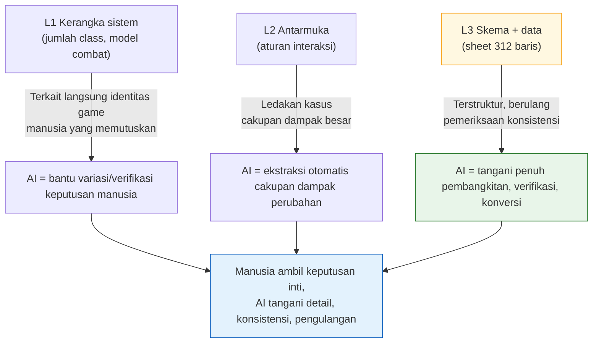

# 3.1 Pekerjaan System Designer dan Koordinat Layer

Kamis pukul 16.50. Sheet skill yang baru saja diisi oleh penanggung jawab balancing baru saja diunggah. 312 skill. Setiap skill harus mengisi nomor efek di kolom bernama `effect_id`, dan nomor itu menunjuk ke sebuah baris pada sheet efek terpisah. Keduanya harus cocok agar game berjalan. Kalau tidak cocok, klien akan memanggil efek kosong atau mati diam-diam.

Dulu saya memeriksa ini dengan tangan. Satu sel di sheet skill, lompat ke sheet efek, cek nomor, lalu kembali lagi. 312 kali. Paling cepat dua jam. Pada 50 baris terakhir, saat mata mulai kabur, selalu ada satu-dua yang terlewat, dan satu-dua itulah yang meledak di build QA.

Bab ini adalah cerita tentang ke mana dua jam itu pergi, dan tentang di koordinat mana pada peta kerja System Designer pemeriksaan konsistensi tersebut ditandai. Kalau koordinat tidak ditetapkan lebih dulu, Anda akan selamanya menentukan tempat menyisipkan AI hanya dengan firasat.

---

## 3.1.1 System Designer Membuat Empat Hal

System Designer adalah orang yang berpindah paling lebar antara tingkat abstraksi dan tingkat konkret. Ia menerima kabut bernama visi, lalu menariknya turun sampai ke angka padat berupa sel terakhir pada sheet data. Sepanjang perjalanan itu, ada empat jenis keluaran yang dihasilkan.

**(1) Menerjemahkan visi menjadi struktur.** Ketika direktur berkata "pertempuran aksi dengan rasa hantaman yang hidup", System Designer mengubahnya menjadi kerangka berupa skill, combo, cancel, dan hitstop. "Hak penentuan diri atas pertumbuhan" menjadi sistem class, skill tree, dan equipment. Inilah momen pertama saat kabut berubah menjadi struktur.

**(2) Menspesifikasikan antarmuka antar-sistem.** Combat, gerakan, inventory, toko, quest, dan guild berjalan bersamaan. Apakah membuka inventory di tengah pertempuran memberikan kekebalan? Bagaimana jika ada ajakan PvP masuk di tengah proses enhancement? Jawaban atas kasus-kasus ini berkumpul dan menciptakan rasa "dibuat dengan baik". Di setiap tempat yang jawabannya hilang, pengguna merasa kesal.

**(3) Bertanggung jawab atas sheet data dan skemanya.** Koefisien dari 312 skill, efek dari ratusan item, perilaku dari puluhan jenis monster. Nilainya bisa diisi sendiri atau diserahkan ke bidang balancing dan content. Namun **definisi kolom (skema)** dari sheet itu wajib dipegang oleh System Designer. Ini adalah pekerjaan membuatkan laci berlabel. Kalau lacinya asal-asalan, tiap orang mengisinya dengan cara berbeda sehingga konsistensi pun rusak.

**(4) Merancang logika perilaku.** AI karakter dan monster keluar dalam bentuk seperti state machine (FSM, Finite State Machine, mesin keadaan terhingga), Behavior Tree (selanjutnya BT), tabel keputusan, dan aturan prosedural. Materi ini diserahkan ke programmer dan menjadi kode.

Intinya adalah keempat hal ini bertemu di atas meja satu orang yang sama. Karena itu, "hari ini akan dipakai untuk apa waktunya" menjadi keputusan operasional terbesar bagi seorang System Designer.

---

## 3.1.2 Keluaran Sistem Memiliki Koordinat Layer

Pada 2.3 kita menempatkan seluruh produk pembuatan game di atas sumbu koordinat dari L0 (visi) sampai L4 (build). Sekarang keempat keluaran dari 3.1.1 kita tandai langsung di atas sumbu itu. Jarang ada bidang yang keluarannya tersebar selebar System Designer di banyak Layer.

Berikut adalah peta yang menggambar dalam satu lembar: di mana keluaran itu tinggal di atas Layer, dan di setiap koordinat bertemu dengan siapa.

<svg viewBox="0 0 720 360" xmlns="http://www.w3.org/2000/svg" font-family="sans-serif" font-size="13">
  <!-- Layer bands -->
  <rect x="20" y="20" width="680" height="60" fill="#eceff1" stroke="#b0bec5"/>
  <rect x="20" y="80" width="680" height="60" fill="#e3f2fd" stroke="#90caf9"/>
  <rect x="20" y="140" width="680" height="60" fill="#e8f5e9" stroke="#a5d6a7"/>
  <rect x="20" y="200" width="680" height="60" fill="#fff8e1" stroke="#ffe082"/>
  <rect x="20" y="260" width="680" height="60" fill="#eceff1" stroke="#b0bec5"/>
  <!-- Layer labels -->
  <text x="34" y="55" font-weight="bold">L0</text>
  <text x="34" y="115" font-weight="bold" fill="#1565c0">L1</text>
  <text x="34" y="175" font-weight="bold" fill="#2e7d32">L2</text>
  <text x="34" y="235" font-weight="bold" fill="#f9a825">L3</text>
  <text x="34" y="295" font-weight="bold">L4</text>
  <!-- Layer descriptions -->
  <text x="80" y="55" fill="#607d8b">Visi — System Designer hanya menerima</text>
  <text x="80" y="108" fill="#0d47a1">Kerangka sistem: definisi class, combat, inventory, guild</text>
  <text x="80" y="168" fill="#1b5e20">Antarmuka: aturan interaksi antar-sistem, prioritas</text>
  <text x="80" y="228" fill="#e65100">Skema + data: definisi kolom sheet, sebagian nilai</text>
  <text x="80" y="295" fill="#607d8b">Build — QA memverifikasi penerapan maksud</text>
  <!-- Collaborator column -->
  <line x1="500" y1="20" x2="500" y2="320" stroke="#90a4ae" stroke-dasharray="4 3"/>
  <text x="512" y="55" fill="#607d8b" font-size="12">↔ Direktur, naratif</text>
  <text x="512" y="115" fill="#1565c0" font-size="12">↔ Arahan seni</text>
  <text x="512" y="175" fill="#2e7d32" font-size="12">↔ System Designer lain</text>
  <text x="512" y="235" fill="#f9a825" font-size="12">↔ Balancing, content</text>
  <text x="512" y="295" fill="#607d8b" font-size="12">↔ QA</text>
  <!-- responsibility arrow -->
  <line x1="62" y1="90" x2="62" y2="250" stroke="#c62828" stroke-width="2.5" marker-end="url(#ah)"/>
  <defs>
    <marker id="ah" markerWidth="8" markerHeight="8" refX="4" refY="4" orient="auto">
      <path d="M0,0 L8,4 L0,8 Z" fill="#c62828"/>
    </marker>
  </defs>
  <text x="335" y="338" fill="#c62828" font-size="12" font-weight="bold">Rentang yang dibuat langsung System Designer (L1→L3)</text>
</svg>

Peta ini menyampaikan dua hal. Pertama, System Designer bertanggung jawab atas jarak panjang dari **menerima** L0 hingga **menyentuh** sampai L4. Kedua, rentang yang dibuat langsung dengan tangan adalah L1–L3, dan di setiap tiga kotak itu mitra kolaborasinya berganti. Karena bahasa kolaborasi berubah setiap kali kotaknya berganti, kalau koordinatnya tidak disadari, rapat akan terus berputar sia-sia.

Namun ini bukan berarti satu orang menyentuh seluruh L1–L3. Kalau timnya besar, penanggung jawab L1–L2 dan penanggung jawab L3 terpisah. Kalau timnya kecil, satu orang menangani semuanya. Koordinat adalah peta pembagian peran, bukan perintah untuk menimpakan semuanya pada satu orang.

---

## 3.1.3 Begitu Koordinat Ditetapkan, Tempat Menyisipkan AI Pun Terlihat

Petanya sudah digambar, sekarang saatnya memberi warna. Koordinat mana yang efek pengenalan AI-nya besar? Bukan asal "otomatiskan semua", melainkan pilih dengan melihat sifat koordinatnya.



Intinya adalah **semakin koordinat turun ke bawah, semakin besar porsi yang ditangani penuh oleh AI**. "Mau berapa class" pada L1 adalah identitas game sehingga harus dipegang manusia. Sebaliknya "apakah 312 baris foreign key (kunci asing) semuanya cocok" pada L3 bersifat terstruktur dan berulang, jadi AI harus mengambilnya secara utuh. L2 berada di tengah — keputusannya tetap diambil manusia, tetapi AI menopang ekstraksi cakupan dampak berupa "kalau aturan ini diubah, sejauh mana yang ikut goyah".

Gambar ini menjelaskan mengapa semua latihan setelah 3.1.4 dimulai di sekitar L3. Karena di situlah tempat dengan efek terbesar dan risiko terkecil. Sekalipun alat skema salah berfungsi, tidak terjadi kecelakaan; relation map hanya menggambar gambar saja; dan pemeriksaan konsistensi bisa ditolak manusia.

---

## 3.1.4 Worked Transcript: Menyerahkan Pemeriksaan Konsistensi ke AI di Koordinat L3

Teorinya sampai di sini. Sekarang kita kembali ke Kamis di awal 3.1 itu. Apakah `effect_id` dari 312 skill cocok dengan sheet efek, mari kita coba serahkan ke AI. Tanpa rangkuman, dipindahkan persis seperti yang benar-benar dipertukarkan.

Input data mengikuti prinsip `schema-first`. Artinya, manusia lebih dulu mendefinisikan **sheet spesifikasi**, dari situ keluar Enum dan `.proto` (Export VBA (bahasa makro Excel)), dan terakhir data csv diisi. Karena itu prompt verifikasi pun dimulai dengan "baca dari skema dulu". Saya menegaskan bahwa sumber resmi bukanlah dokumen skema, melainkan **JSON yang benar-benar di-export** (`json_over_schema_doc_as_source_of_truth`). Sebab dokumen bisa berbohong, tetapi JSON hasil export tidak bisa berbohong.

### Prompt (Lengkap)

> Kamu adalah pemeriksa konsistensi data untuk proyek kami.
> Inputnya adalah dua export JSON.
> 1) `skill.json` — setiap objek skill memiliki field `skill_id`, `name`, `effect_id`.
> 2) `effect.json` — setiap objek efek memiliki `effect_id`, `effect_type`.
>
> Periksa hal-hal berikut.
> (A) Apakah semua `effect_id` di `skill.json` ada di `effect.json` (konsistensi foreign key).
> (B) Efek orphan (yatim) yang ada di `effect.json` tetapi tidak dirujuk oleh skill mana pun.
> (C) Baris di dalam `skill.json` yang `effect_id`-nya kosong atau 0.
>
> Aturan: jangan menebak. Field yang tidak ada di JSON laporkan sebagai "field tidak ada".
> Keluaran terdiri dari tiga bagian (A)(B)(C), untuk setiap kasus pelanggaran tulis `skill_id` (atau effect_id) dan alasannya dalam satu baris.
> Jika tidak ada pelanggaran, cukup tulis "tidak ada pelanggaran" di bagian terkait.

### Keluaran Mentah Claude (Tanpa Olah, Tanpa Poles)

> Saya tidak menerima dua input JSON tersebut. Pada pesan saat ini tidak ada isi file yang dilampirkan.
> Silakan kirim ulang dengan salah satu cara berikut.
> - Isi sebenarnya dari `skill.json` dan `effect.json` (tempel atau lampirkan file)
> - Atau path kedua file
>
> Setelah menerima isinya, saya akan memeriksa dengan urutan (A)(B)(C). Saya tidak akan mengarang hasil tanpa file.

Berhenti di sini justru merupakan sinyal kepercayaan. Seandainya laporan yang terlihat meyakinkan tetap dikembalikan padahal input kosong, justru kerapian itulah yang menjadi sinyal bahaya. Pihak yang tidak mengarang hasil pemeriksaan dengan tangan kosong dan malah balik bertanya "berikan filenya dulu" lebih layak dipercaya. Saya benar-benar menempelkan kedua JSON dan meminta ulang (karena keterbatasan ruang, di teks utama hanya dikutip sebagian).

```json
// skill.json (kutipan)
[
  {"skill_id": 1001, "name": "Hantaman Keras", "effect_id": 5001},
  {"skill_id": 1002, "name": "Tebasan Putar",  "effect_id": 5002},
  {"skill_id": 1003, "name": "Angkat Perisai", "effect_id": 0},
  {"skill_id": 1004, "name": "Olesan Racun",   "effect_id": 5099}
]
```

```json
// effect.json (kutipan)
[
  {"effect_id": 5001, "effect_type": "DAMAGE"},
  {"effect_id": 5002, "effect_type": "DAMAGE"},
  {"effect_id": 5003, "effect_type": "BUFF"}
]
```

### Keluaran Kedua Claude (Berdasarkan Data Sebenarnya)

> **(A) Konsistensi foreign key — 1 pelanggaran**
> - `skill_id: 1004` → `effect_id: 5099` tidak ada di `effect.json` (dangling reference)
>
> **(B) Efek orphan — 1 pelanggaran**
> - `effect_id: 5003` (BUFF) → tidak dirujuk oleh skill mana pun
>
> **(C) effect_id kosong/0 — 1 pelanggaran**
> - `skill_id: 1003` → `effect_id: 0`. Bisa jadi ini "tanpa efek" yang disengaja, jadi perlu dicek di skema apakah 0 merupakan nilai yang valid.

### Verifikasi dan Penolakan oleh Manusia

Dua dari tiga kasus itu jelas bug. `5099` adalah nomor yang ditulis lebih dulu pada skill oleh penanggung jawab balancing sebelum ia menambahkan barisnya ke sheet efek — kasus klasik di mana urutan kerja kebalik. Tertangkap.

Namun (C) saya **tolak**. Di proyek kami, `effect_id: 0` adalah nilai kesepakatan yang valid yang berarti "slot pasif, tanpa efek". AI tidak tahu itu, jadi menaikkannya sebagai "perlu dicek", dan penilaian itu benar tetapi bukan hal yang patut dihitung sebagai pelanggaran. Maka saya beralih ke langkah berikutnya — membakukan kesepakatan ini sebagai atom, supaya mulai pemeriksaan berikutnya AI tahu bahwa 0 adalah nilai yang valid.

### Permintaan Ulang (Injeksi Pengetahuan Domain)

> Aturan tambahan: `effect_id == 0` adalah nilai kesepakatan valid pada proyek kami yang berarti "pasif, tanpa efek".
> Maka pada (C), `effect_id == 0` bukan pelanggaran. Laporkan sebagai pelanggaran (C) hanya jika string kosong, null, atau angka negatif.

> **(C) effect_id kosong/0 — tidak ada pelanggaran**
> (`effect_id: 0` diperlakukan sebagai nilai kesepakatan valid. Tidak ada kosong/null/negatif.)

Kesepakatan satu baris inilah akumulasi pengetahuan domain. Keputusan desain sistem relatif permanen, jadi sekali dibakukan, satu tahun kemudian pun pemeriksaan yang sama berjalan dengan standar yang sama. Satu lembar decision card (kartu keputusan) bertambah di kabinet.

Yang dilakukan manusia dalam transcript ini **hanya tiga hal** — (1) menentukan urutan input agar membaca dari skema dulu, (2) memastikan bahwa `5099` benar-benar bug, (3) mengetahui bahwa `0` adalah nilai valid lalu menolak dan mengoreksi penilaian AI. Dua jam yang dulu dihabiskan untuk melompati 312 baris satu per satu pun lenyap. Yang diotomatiskan adalah kerja kasar berupa lompatan dan pembandingan, dan tiga baris penilaian yang tersisa itulah intinya.

---

## 3.1.5 Aset yang Terakumulasi: Mengeraskan Koordinat Menjadi Kode

Pemeriksaan dari transcript di atas bisa saja diperintahkan dengan tangan setiap kali, tetapi pekerjaan yang berulang di L3 sebaiknya dikeraskan menjadi alat — itulah praktik baku desain sistem. Saya mengutip dua hal yang saya operasikan sendiri — bukan "alat Proyek A" yang abstrak, melainkan hal-hal yang benar-benar berjalan di atas meja.

`gen_relation_map.py` menganalisis nama kolom dan nilai pada sheet untuk mendeteksi otomatis relasi foreign key dan menghasilkan relation map HTML interaktif. Jika pada 3.1.4 panah `skill.effect_id → effect.effect_id` digambar manusia di dalam kepala, skrip ini menggambar panah itu menjadi gambar untuk seluruh sheet. Tempat di mana dependensi mengalir mundur (risiko data L3 merujuk balik ke kerangka L1) langsung mencolok dari gambar.

Skill `schema-doc` mem-parsing **sheet $skema** dari xlsm dan secara otomatis menghasilkan dokumen skema markdown. Skema yang sama dengan yang muncul pada pertanyaan 3.1.4 (C) "perlu dicek di skema apakah 0 merupakan nilai valid" — membuat manusia langsung membaca skema terkini tanpa harus mengaduk-aduk file lain. Karena dokumen ikut berubah saat sheet berubah, penyakit kronis berupa ketidaksesuaian antara dokumen dan data sebenarnya pun berkurang.

Kalau posisi kedua alat itu dinyatakan ulang dengan koordinat, jadinya seperti ini. `schema-doc` menjaga **definisi kolom** di L3, dan `gen_relation_map.py` menjaga **relasi** antara L2–L3. Prompt bantuan AI (verifikasi seperti pada 3.1.4) berjalan di atasnya. Ketiganya bukan berjalan sendiri-sendiri, melainkan menangani ketinggian berbeda dari sumbu koordinat yang sama.

Cara penggunaan nyata alat-alat ini diikuti dengan tangan pada 3.2, 3.3, dan 3.4. 3.1 adalah peta yang menentukan di mana menyisipkannya, dan tiga bab berikutnya adalah pekerjaan menyisipkannya.

---

## 3.1.6 Pengenalan Bertahap: Dari Koordinat yang Risikonya Kecil

Kalau ketiga alat diaktifkan sekaligus, beban operasional tiba lebih dulu daripada efeknya. Menurut pengalaman saya, urutan yang aman adalah dari koordinat yang risikonya kecil (sisi bawah).

| Waktu (disarankan) | Pengenalan | Koordinat | Yang terjadi kalau salah |
|---|---|---|---|
| 1 bulan | Skema dulu (3.2) | L3 | Dokumen sekadar tidak terperbarui sekali |
| 2–3 bulan | Visualisasi relation map (3.3) | L2–L3 | Gambarnya sekadar tidak akurat |
| 3–6 bulan | Prompt bantuan AI (3.4) | L1–L3 | Karena melalui verifikasi, manusia bisa menolak |

Durasi bukan patokan mutlak. Tergantung ukuran tim dan infrastruktur yang ada, bisa makan waktu dua kali lipat atau selesai dalam setengahnya (perkiraan penulis, belum terverifikasi). Yang tidak berubah adalah **urutannya**. Dengan menempatkan bantuan keputusan berisiko besar di paling akhir, tempat paling sensitif baru disentuh setelah tim sudah membiasakan diri dengan kebiasaan verifikasi melalui dua alat sebelumnya.

---

## 3.1.7 Pengukuran — Secara Jujur

Saya menuliskan angka tanpa memolesnya. Berikut adalah hal yang saya amati di tim desain (4–5 orang, tim pengembangan secara keseluruhan berskala menengah 10–50 orang, operasi sekitar 6 bulan) pada proyek MMORPG yang saya operasikan sebagai direktur (selanjutnya "Proyek A"). Ini bukan pengukuran otomatis yang presisi, melainkan **pengamatan penulis** berdasarkan log kerja dan catatan retrospektif, dan saya sarankan dibaca hanya sebagai arah dan rasio kasarnya saja.

- **Pemeriksaan konsistensi**: Pembandingan foreign key skill↔efek sebanyak 312 baris paling cepat dua jam dengan tangan (Kamis di awal itu). Dengan verifikasi AI, di luar persiapan input, daftar pelanggaran keluar dalam hitungan menit. Yang berkurang adalah kerja kasar lompat dan banding, bukan penilaian.
- **Onboarding Game Designer baru**: Kalau ada satu lembar relation map HTML, rapat yang dulu menjelaskan struktur dependensi sistem dengan kata-kata bisa dikurangi beberapa kali. Jumlah pastinya berbeda tiap orang sehingga tidak saya pastikan (pengamatan penulis).
- **Diskusi dampak perubahan**: "Kalau aturan ini diubah, di mana yang goyah" yang dulu diraba lewat rapat, saya ubah menjadi cara di mana AI lebih dulu memberi draf cakupan dampak lalu manusia meninjaunya. Rapatnya bukan lenyap, melainkan rapat berubah menjadi **tinjauan**.

Intinya adalah waktu yang dihemat bukanlah waktu yang tidak dipakai membuat game. Waktu itu dikembalikan ke keputusan mendalam yang tidak bisa diserahkan ke AI, seperti kerangka L1. Mengurangi kerja kasar untuk dipakai pada penilaian — itulah satu baris yang dianjurkan bab ini.

---

## Coba Sendiri: Satu Kali Pemeriksaan Konsistensi di Koordinat L3

**setup.** Export dua sheet (misal: skill, efek) ke csv. Kalau sempat, konversikan ke JSON terlebih dahulu (prinsip bahwa sumber resmi adalah hasil export, bukan dokumen). Pilih satu pasang foreign key di antara dua sheet (misal: `skill.effect_id → effect.effect_id`).

**prompt.** Gunakan prompt lengkap dari 3.1.4 apa adanya. Jangan lewatkan tiga baris intinya — (1) "baca dari skema/struktur dulu", (2) "jangan menebak, yang tidak ada laporkan sebagai tidak ada", (3) "kalau tidak ada pelanggaran cukup tulis tidak ada pelanggaran".

**verify.** Manusia memeriksa daftar pelanggaran yang dinaikkan AI baris demi baris. Bug sungguhan diperbaiki, sedangkan false positive yang muncul karena nilai kesepakatan domain (misal: `0 = tanpa efek`) **ditolak** dan kesepakatan itu ditambahkan ke prompt (atau atom). Kalau mulai pemeriksaan berikutnya false positive yang sama lenyap, berarti satu lembar aset telah bertambah.

### Versi Ringkas Solo

Kalau Anda developer solo yang tidak punya tim maupun sheet, dua tab Google Sheet sudah cukup. Satu tab "skill", tab lainnya "efek". Hubungkan keduanya dengan satu kolom `effect_id`. Kalau Anda mengunduh tab sebagai csv dan menempelkannya ke prompt 3.1.4, maka bukan hanya pada sheet 312 baris, pada sheet 30 baris pun dangling reference dan efek orphan tetap tertangkap dengan cara yang sama. Hanya skalanya yang berbeda, koordinatnya sama. Mulailah dari L3, dan begitu sudah terbiasa, naiklah satu kotak demi satu kotak ke relation map dan cakupan dampak.

---

### Poin-Poin Penting
- Keempat keluaran sistem memiliki koordinat dari kerangka L1 sampai sheet L3, dan koordinat itu sendiri adalah mitra kolaborasi
- Semakin koordinat turun ke bawah (L3), semakin besar porsi yang ditangani penuh AI dan semakin kecil risikonya
- Yang diotomatiskan adalah kerja kasar lompat dan banding, sedangkan penilaian berupa konfirmasi bug dan penolakan false positive adalah bagian manusia
