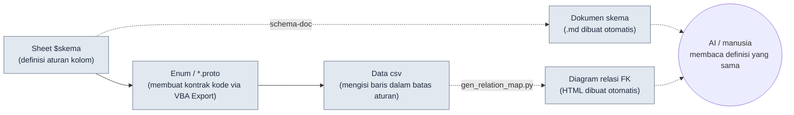

# 3.2 Skema Dulu — $skema Datang Sebelum Data

Senin pagi, saya membangun 120 baris sheet skill yang baru saja diisi oleh seorang Game Designer baru menjadi csv, dan log klien menampilkan 28 garis merah. `class_id` mereferensikan nomor 47, padahal di sheet kelas tidak ada nomor 47. Pada kolom `element`, seseorang menulis `Fire`, sementara yang lain menulis `fire`, dan satu baris bahkan ditulis `화염` dalam aksara Korea. Setengah sore lenyap hanya untuk meraba 28 garis merah itu satu per satu dengan tangan.

Penyebab insiden ini bukanlah datanya yang salah. **Penyebabnya adalah aturan yang harus dipatuhi data itu tidak dituliskan sebelum datanya dibuat.** Jika aturan hanya ada di dalam kepala, begitu orangnya berganti, aturannya pun ikut berganti. Bab ini membahas alur kerja yang membuat aturan—skema—lebih dulu daripada data. Lalu membuat aturan itu ditegakkan sebagai dokumen oleh alat, bukan oleh tangan manusia.

---

> **Catatan Istilah**
> - Skema (schema): definisi kolom pada sheet data. Nama, tipe, rentang, kunci asing, dan deskripsi.
> - `$skema`: sheet khusus untuk definisi kolom yang diletakkan di dalam sheet data Excel (xlsm). Sheet ini hanya memuat aturan kolom, bukan baris data.
> - FK (kunci asing): kolom yang mereferensikan PK (kunci primer) sheet lain. Misalnya `class_id` menunjuk ke baris pada sheet Class.
> - proto: definisi Protocol Buffers (`.proto`). Kontrak struktur data dan Enum yang dibagikan antara klien dan server.
> - Single source of truth (sumber kebenaran tunggal): prinsip operasional yang mengelola informasi yang sama hanya di satu tempat sehingga semua orang melihat tempat itu.

---

## 3.2.1 Urutan Input Itulah Skemanya

Jika "skema dulu" hanya dipahami sebagai "mendefinisikan kolom lebih awal", itu baru setengah ditangkap. Intinya ada pada **urutan apa yang diinput lebih dulu**. Urutan gerakan tangan yang mengisi data menentukan apakah integritas terjaga atau runtuh.

Urutan input yang direkomendasikan buku ini adalah pipeline beruas empat.



Garis penuh yang mengalir dari kiri ke kanan adalah **urutan input yang dipaksakan**. Definisikan `$skema` lebih dulu, dari sana tarik Enum dan proto melalui VBA (bahasa makro Excel) Export, dan isi data csv hanya di dalam batas kontrak itu. Garis putus-putus adalah keluaran yang otomatis diturunkan dari input tersebut—dokumen skema (`schema-doc`) dan diagram relasi FK (`gen_relation_map.py`)—dan manusia maupun AI melihat definisi yang sama melalui turunan ini.

Selama urutan ini dipaksakan, sebagian besar dari 28 garis merah yang kita lihat di pembuka bab ini akan tertutup **sebelum mengisi data**. Jika fakta bahwa `element` adalah salah satu dari empat nilai `fire/ice/lightning/none` sudah dipatok sebagai Enum proto, maka baik `Fire` maupun `화염` akan tersaring di tahap input. Jika fakta bahwa `class_id` mereferensikan PK sheet Class sudah dituliskan di `$skema`, maka nomor 47 yang hilang akan tertangkap lebih dulu di pemeriksaan, bukan di build.

Jika urutan dibalik—mengisi data lebih dulu lalu merapikan skema kemudian—maka skema menjadi pembersihan setelah fakta. Jika kita mengutak-atik aturan kolom pada posisi yang sudah menumpuk 1000 baris, aturan justru mengikuti data, dan pada saat itu sumber kebenaran terbalik.

---

## 3.2.2 Worked Transcript (rekaman sesi nyata) — dari `$skema` sampai csv Sekaligus

Alih-alih menjelaskan dengan kata-kata, mari kita lewatkan satu sheet sungguhan dari awal sampai akhir. Misalkan kita membuat sheet skill baru. Berikut adalah rekaman lengkap yang dijalankan dengan bantuan AI. Saya tidak meringkasnya, dan membiarkan apa adanya bagian yang melenceng serta bagian yang ditolak manusia.

### Langkah 1 — Manusia menulis `$skema` lebih dulu dengan tangan

Belum memanggil alat maupun AI. Manusia mendefinisikan sendiri aturan kolom secara langsung. Khusus langkah ini tidak didelegasikan.

```
# $skema sheet Skill (ditulis manusia)
kolom           tipe       rentang/batasan           FK                  deskripsi
skill_id       int        1000~9999            (PK)                ID unik skill
name           string     1~30 karakter         -                  nama tampilan
class_id       int(FK)    -                    Class.class_id      kelas yang dapat memakai
cooldown       float      0.0~120.0            -                   waktu jeda pakai ulang (detik)
damage_coef    float      0.0~10.0             -                   koefisien pengali serangan
element        enum       fire/ice/lightning/none  -              atribut
is_passive     bool       true/false           -                  apakah pasif
```

### Langkah 2 — Menyuruh AI membuat draf Enum proto (prompt lengkap)

Pekerjaan memindahkan enum `element` dan struktur FK dari `$skema` ke kontrak proto. Karena ini konversi format, ini pekerjaan yang bisa diserahkan ke AI.

> **Prompt (lengkap):**
> Berikut adalah spesifikasi kolom sheet data game. Konversikan spesifikasi ini menjadi pesan dan Enum Protocol Buffers (proto3). Aturan: (1) kolom bertipe enum didefinisikan sebagai enum terpisah dan nilai pertama harus dimulai dengan `_UNSPECIFIED = 0`. (2) kolom FK menyertakan target referensi sebagai komentar. (3) batasan rentang tidak dapat dinyatakan dengan proto, jadi cukup sertakan sebagai komentar. Jangan tambahkan kolom yang tidak ada dalam spesifikasi.
> ```
> skill_id int PK / name string / class_id int FK→Class.class_id /
> cooldown float 0~120 / damage_coef float 0~10 /
> element enum{fire,ice,lightning,none} / is_passive bool
> ```

### Langkah 3 — Keluaran mentah Claude (apa adanya, tanpa disentuh)

```proto
syntax = "proto3";

// Kontrak data sheet Skill
// Catatan: batasan rentang (cooldown 0~120, damage_coef 0~10)
//          tidak dapat dipaksakan dengan proto. Periksa di Linter.

enum SkillElement {
  SKILL_ELEMENT_UNSPECIFIED = 0;
  SKILL_ELEMENT_FIRE = 1;
  SKILL_ELEMENT_ICE = 2;
  SKILL_ELEMENT_LIGHTNING = 3;
  SKILL_ELEMENT_NONE = 4;   // ← penanda tinjauan manusia
}

message Skill {
  int32 skill_id = 1;       // PK
  string name = 2;
  int32 class_id = 3;       // FK → Class.class_id
  float cooldown = 4;
  float damage_coef = 5;
  SkillElement element = 6;
  bool is_passive = 7;
}
```

### Langkah 4 — Verifikasi dan penolakan oleh manusia

Di sini manusia menolak satu tempat. AI menempatkan `none` sebagai `SKILL_ELEMENT_NONE = 4` di **akhir** enum, padahal di `$skema` `none` adalah keadaan default yang berarti "tanpa atribut". Persoalannya ada pada nilai ke-0 proto. Dalam proto3, nilai ke-0 enum adalah "posisi yang otomatis terisi ketika nilai tidak diisi", sehingga keputusan terbelah antara mengosongkan nilai ke-0 sebagai `_UNSPECIFIED` (nilai tidak diinput) atau mengisinya dengan nilai bermakna seperti `none` (tanpa atribut secara sengaja). Jika keduanya digabung dalam satu posisi, **baris yang mengosongkan kolom (kekeliruan)** dan **baris yang sengaja memilih tanpa atribut (kesengajaan)** sama-sama masuk sebagai 0 dan selamanya tidak dapat dibedakan. AI memang menaruh `_UNSPECIFIED = 0` dan `none` secara terpisah, tetapi mengirim `none` ke posisi akhir nomor 4, sehingga keadaan default yang paling sering muncul justru menjauh dari jangkauan pencarian dan debugging.

Keputusan yang diambil manusia:
- `_UNSPECIFIED = 0` dipertahankan (untuk deteksi kehilangan).
- `none` dibiarkan apa adanya, tetapi pada aturan penulisan csv ditambahkan "tanpa atribut harus secara eksplisit `none`, kolom kosong dilarang". Kosong=0=UNSPECIFIED dianggap kesalahan input.
- Keputusan ini ditambahkan satu baris ke deskripsi baris `element` pada `$skema`: "tanpa atribut pun harus dieksplisitkan (none). Kolom kosong adalah kesalahan."

Keluaran AI tidak dipakai apa adanya. Formatnya diterima, tetapi batas maknanya digariskan oleh manusia.

### Langkah 5 — Menarik Enum/proto dari sheet dengan tombol VBA Export

Definisi proto yang sudah terverifikasi dikeluarkan secara konsisten oleh makro Export Excel (tombol pada sheet `$skema`). Manusia tidak mengetik ulang di IDE. Karena sheet adalah sumber kebenaran, proto keluar dari sheet. Urutan ini adalah kelanjutan dari prinsip "keluaran adalah naskah resmi" (`json_over_schema_doc_as_source_of_truth`) yang akan dibahas di 3.3—bukan dokumen yang menjelaskan kode, melainkan sheet yang melahirkan kode.

### Langkah 6 — Baru kemudian mengisi data csv (dengan bantuan AI, termasuk permintaan ulang)

> **Prompt (lengkap):**
> Buatkan 5 baris csv yang memenuhi proto Skill dan $skema di atas. Batasan: class_id adalah salah satu dari [1,2,3] (PK yang saat ini ada di sheet Class), damage_coef adalah 0.0 jika pasif (is_passive=true), element adalah string fire/ice/lightning/none apa adanya, dan kolom kosong dilarang.

Pada keluaran pertama Claude, satu baris melenceng.

```
skill_id,name,class_id,cooldown,damage_coef,element,is_passive
1001,Tebasan Api,1,3.5,2.4,fire,false
1002,Tangan Beku,2,8.0,3.1,ice,false
1003,Pemulihan HP,1,0.0,1.2,none,true     ← ditolak: pasif tapi damage_coef≠0
1004,Tombak Petir,3,5.0,2.8,lightning,false
1005,Sikap Bertahan,2,0.0,0.0,none,true
```

Baris 1003 melanggar aturan (jika `is_passive=true` maka `damage_coef=0.0` seharusnya). Manusia menolak dan meminta ulang.

> **Permintaan ulang (lengkap):** Baris 1003 melanggar aturan. is_passive=true tetapi damage_coef=1.2. Pasif seharusnya 0.0. Perbaiki hanya 1003 lalu berikan lagi.

> **Keluaran ulang Claude:** `1003,Pemulihan HP,1,0.0,0.0,none,true`

AI tidak menjawab semuanya dengan benar pada percobaan pertama bukanlah cacat, melainkan sekadar hal yang biasa terjadi. Yang penting adalah berkat skema sudah terpasang, satu baris yang melenceng itu **bisa ditunjuk dengan mata dan dikembalikan dengan satu baris**. Seandainya tidak ada skema, baris 1003 baru akan ditemukan sebagai bug pasif yang menghasilkan damage di dalam game setelah build.

Pelajaran dari keseluruhan transcript ini sederhana. Jika urutan input dipatok menjadi `$skema → proto → csv`, AI mengisi format dengan cepat dan manusia hanya meninjau makna serta pelanggaran. Jika urutan runtuh, manusia memikul semuanya mulai dari format sampai makna.

---

## 3.2.3 schema-doc — Agar Manusia Tidak Menyalin Ulang Skema

Meletakkan `$skema` di dalam Excel memang nyaman bagi Game Designer, tetapi merupakan posisi yang tertutup bagi AI, git, dan alat eksternal. Karena itu saya mengoperasikan alat yang otomatis mengonversi `$skema` menjadi Markdown. Slash skill `schema-doc` mengerjakan hal ini.

Cara kerjanya empat langkah.

1. Mem-parsing sheet `$skema` dari Excel (xlsm) (python-calamine, akselerasi Rust)
2. Mengekstrak 5 elemen definisi kolom
3. Mengonversi menjadi tabel Markdown
4. Membuat `<nama_sheet>_schema.md` di folder yang sama

Intinya adalah **manusia tidak menulis skema dua kali**. Setelah didefinisikan sekali di Excel, Markdown-nya dibuat oleh alat. Keduanya tidak mungkin melenceng. Jebakan "jika dokumen skema dijadikan naskah resmi, ia akan melenceng dari keluaran sebenarnya" yang akan dibahas di 3.3, di sini dihindari dengan membaliknya menjadi "Excel adalah naskah resmi, dokumen adalah turunan".

Hasil yang dibuat `schema-doc` (berdasarkan sheet Skill dari transcript sebelumnya):

```markdown
# Skema sheet Skill  (dibuat otomatis — dilarang mengubah langsung)

| kolom | tipe | rentang/batasan | FK | deskripsi |
|---|---|---|---|---|
| skill_id | int | 1000~9999 | (PK) | ID unik skill |
| name | string | 1~30 karakter | - | nama tampilan |
| class_id | int(FK) | - | Class.class_id | kelas yang dapat memakai |
| cooldown | float | 0.0~120.0 | - | waktu jeda pakai ulang (detik) |
| damage_coef | float | 0.0~10.0 | - | koefisien pengali serangan |
| element | enum | fire/ice/lightning/none | - | atribut. tanpa atribut pun dieksplisitkan (none), kolom kosong adalah kesalahan |
| is_passive | bool | true/false | - | apakah pasif. jika true maka damage_coef=0 |

_source: Skill.xlsm / generated by schema-doc_
```

Perhatikan bahwa batas yang digariskan manusia pada langkah 4 dan 6 di 3.2.2 ikut masuk apa adanya ke kolom deskripsi `element` dan `is_passive`. Manusia menulis satu baris di `$skema`, dan dokumen, proto, serta verifikasi semuanya jadi berbagi aturan yang sama. Inilah wujud nyata single source of truth saat bekerja.

Skema yang sudah turun menjadi Markdown langsung dipakai di tiga tempat.

- **Pembuatan data AI**: sebelum membuat baris, AI membaca tabel ini dan hanya membuat baris yang mematuhi 7 kolom yang didefinisikan, tiap batasan, dan FK.
- **Onboarding Game Designer baru**: satu lembar tabel ini lebih cepat daripada tiga kali rapat.
- **Linter**: otomatis membandingkan apakah tiap baris csv melanggar tabel ini.

---

## 3.2.4 gen_relation_map.py — Apakah FK Masih Hidup, Lewat Grafik

Jika skema adalah aturan **di dalam** sheet, maka FK adalah aturan **di antara** sheet-sheet. Definisi bahwa `class_id` mereferensikan sheet Class memang tertulis di `$skema`, tetapi apakah referensi itu benar-benar hidup pada saat ini memerlukan pemeriksaan terpisah.

`gen_relation_map.py` otomatis mendeteksi relasi FK antar sheet data dan menggambarkannya sebagai diagram relasi HTML interaktif. Ketika panah-panah seperti `class_id`→Class milik Skill dan `set_id`→ItemSet milik Item berkumpul dalam satu layar, "FK yang target referensinya telah hilang" mencolok sebagai panah yang terputus. Insiden seperti nomor 47 yang hilang di pembuka bab ini terlihat sebagai garis terputus pada diagram relasi **saat sedang mengisi data**, bukan sebagai garis merah di log build.

Penggunaan worked transcript dan visualisasi alat ini dibahas serius di 3.3. Yang perlu diingat di bab ini hanya satu. Jika `$skema` tidak mengeksplisitkan FK, maka baik diagram relasi maupun pemeriksaan integritas tidak punya grafik untuk digambar. **Mengeksplisitkan FK bukanlah pilihan, melainkan prasyarat dari skema dulu.**

---

## 3.2.5 Alur Kerja 5 Langkah Skema Dulu

Jika transcript di 3.2.2 digeneralisasi, jadilah lima langkah. Bila kita pisahkan pelaku dan keluaran tiap langkah, akan jelas apa yang dipegang manusia dan apa yang diserahkan ke alat.

<svg xmlns="http://www.w3.org/2000/svg" width="720" height="300" font-family="sans-serif" font-size="13">
  <rect x="0" y="0" width="720" height="300" fill="#fbfbfb" stroke="#ddd"/>
  <text x="20" y="28" font-size="15" font-weight="bold">Skema Dulu 5 Langkah — Pelaku × Keluaran</text>
  <!-- columns header -->
  <text x="40" y="62" font-weight="bold">Langkah</text>
  <text x="230" y="62" font-weight="bold">Pelaku</text>
  <text x="430" y="62" font-weight="bold">Keluaran</text>
  <line x1="20" y1="72" x2="700" y2="72" stroke="#bbb"/>
  <!-- rows -->
  <text x="40" y="100">1. Desain skema</text>
  <rect x="220" y="86" width="120" height="22" fill="#e8f0fe" stroke="#9bb"/>
  <text x="232" y="102">Manusia</text>
  <text x="430" y="100">5 elemen $skema · definisi FK</text>
  <text x="40" y="138">2. Dokumentasi otomatis</text>
  <rect x="220" y="124" width="120" height="22" fill="#e6f4ea" stroke="#9c9"/>
  <text x="232" y="140">schema-doc</text>
  <text x="430" y="138">skema .md</text>
  <text x="40" y="176">3. Ekstraksi kontrak</text>
  <rect x="220" y="162" width="120" height="22" fill="#e6f4ea" stroke="#9c9"/>
  <text x="232" y="178">VBA Export</text>
  <text x="430" y="176">Enum / *.proto</text>
  <text x="40" y="214">4. Draf data</text>
  <rect x="220" y="200" width="120" height="22" fill="#fef7e0" stroke="#dca"/>
  <text x="232" y="216">AI + manusia</text>
  <text x="430" y="214">baris csv (tolak pelanggaran · minta ulang)</text>
  <text x="40" y="252">5. Integritas · dampak</text>
  <rect x="220" y="238" width="120" height="22" fill="#e6f4ea" stroke="#9c9"/>
  <text x="232" y="254">Linter / diagram relasi</text>
  <text x="430" y="252">laporan pelanggaran · grafik FK</text>
  <line x1="20" y1="270" x2="700" y2="270" stroke="#bbb"/>
  <text x="40" y="290" font-size="11" fill="#666">biru=keputusan manusia / hijau=otomatis oleh alat / kuning=draf AI+tinjauan manusia</text>
</svg>

Tidak perlu melengkapi kelima langkah pada bulan pertama. Menjalankan langkah 1 dan 2 saja (desain skema + dokumentasi otomatis) sudah menangkap separuh nilainya. Langkah 3\~5 ditambahkan secara bertahap setelah operasionalnya terbiasa. Jika memaksakan 5 langkah sejak awal, beban penulis akan menghentikan operasional sebelum sempat mapan.

---

## 3.2.6 Apa yang Diukur di Proyek A

Pada suatu proyek MMORPG yang saya jalankan sebagai direktur (selanjutnya "Proyek A"), saya menjalankan alur kerja ini selama sekitar 6 bulan. Di antara angka-angka berikut, konsistensi kolom sheet data dan waktu draf sheet baru adalah hasil pengukuran nyata yang dihimpun dari log alat dan catatan kerja, sedangkan frekuensi FK rusak adalah **perkiraan penulis (belum terverifikasi)** yang dihitung mundur dari isu kegagalan build.

| Item | Sebelum diterapkan | Sesudah diterapkan | Dasar |
|---|---|---|---|
| Konsistensi nama kolom | sekitar 60% | sekitar 95% | pengukuran nyata pembandingan schema-doc |
| Frekuensi FK rusak | 2\~3 kali/minggu | 1 kali/bulan ke bawah | hitung mundur isu build (perkiraan penulis) |
| Waktu draf sheet baru | 4\~8 jam | 1\~2 jam | pengukuran nyata catatan kerja |
| Pemahaman sheet Game Designer baru | 3 kali rapat | 1 kali dokumen + 1 kali rapat | kasus onboarding (arah saja) |

Biaya penerapan adalah pengembangan awal alat sekitar 3 hari + pemantapan operasional sekitar 1 bulan. Kesimpulan operasional adalah bahwa biaya penerapan kecil dibandingkan efek kumulatif selama 6 bulan. Namun rasio di atas adalah kasus tunggal dari satu tim dan satu proyek, sehingga tidak ada jaminan bahwa ia dapat dipindahkan apa adanya ke tim lain.

---

## 3.2.7 Sinergi AI dengan Skema, dan Batasnya

Jika skema sudah terpasang, keandalan pembuatan data oleh AI melonjak drastis. Alasannya, skema menutup lebih dulu rentang input ambigu yang menjadi celah bagi halusinasi. Untuk permintaan "buatkan 20 skill", jika tidak ada skema, AI akan menemukan kolom yang tampak masuk akal dan mengisi nilai yang tidak kompatibel dengan sheet Anda sendiri. Jika ada skema, permintaan yang sama kembali sebagai baris yang mematuhi 7 kolom yang didefinisikan, tiap batasan, dan FK. Seperti kasus baris 1003 di 3.2.2, sekalipun muncul pelanggaran, cukup menunjuk satu baris dan meminta ulang, selesai.

Sebagai gantinya batasnya jelas. **Nilai balance tidak disuruh dikerjakan AI.** Jika AI menentukan `damage_coef` "sekenanya", ia akan berbenturan dengan maksud game. Bagian AI hanya sampai menggelar kandidat yang formatnya cocok dengan cepat, dan "apakah koefisien skill ini benar 2.4" dijawab oleh manusia. Itu bukan berarti AI tidak berguna untuk balance—kehalusan kurva, pencilan, dan statistik rentang ditangkap AI dengan cepat. Mengukur angka diserahkan ke alat, dan apakah angka itu benar disaring oleh manusia.

---

## 3.2.8 Kesalahan Umum dan Cara Menghindarinya

| Kesalahan | Cara menghindari |
|---|---|
| Menerapkan skema setelah menumpuk 1000 baris | Sheet baru wajib `$skema` lebih dulu |
| Sinkronisasi `$skema` dan csv runtuh | Ikat keduanya ke satu sumber dengan otomatisasi schema-doc |
| Tidak mengeksplisitkan FK | Jika FK tidak dieksplisitkan, diagram relasi dan pemeriksaan integritas tidak berarti |
| Memakai nilai ke-0 Enum proto sebagai nilai bermakna | 0 adalah `_UNSPECIFIED` (deteksi kehilangan), nilai bermakna mulai dari 1 |
| Dokumen skema hanya dibaca manusia | Satukan tabel Markdown + meta agar AI juga dapat membacanya |

---

## Coba Sendiri

**setup**
1. Pilihlah satu sheet paling inti dari bidang Anda (salah satu dari skill, item, atau monster).
2. Tambahkan sheet bernama `$skema` ke file Excel itu, dan tuliskan 5 elemen (nama, tipe, rentang, FK, deskripsi) satu baris untuk tiap kolom. Langkah ini dikerjakan langsung oleh manusia.

**prompt** (AI hanya dipakai untuk draf proto/csv)
> Konversikan $skema di bawah ini menjadi pesan proto3 dan Enum. Nilai pertama enum `_UNSPECIFIED = 0`. FK menyertakan target referensi sebagai komentar. Batasan rentang cukup sebagai komentar. Dilarang menambah kolom yang tidak ada dalam spesifikasi.
> (tempelkan $skema Anda di sini)

Lalu lanjutkan:
> 5 baris csv yang memenuhi proto dan $skema di atas. Jangan buat baris yang melanggar batasan. Jika is_passive=true maka damage_coef=0.

**verify**
1. Bandingkan 5 baris yang diberikan AI satu per satu dengan skema. Jika ada baris yang melanggar, minta ulang dengan "Baris N melanggar, perbaiki hanya baris itu" (penolakan dan permintaan ulang adalah proses normal).
2. Tarik `$skema` menjadi `.md` dengan `schema-doc` (atau skrip Python sederhana setara), lalu periksa apakah definisi Excel dan dokumen cocok.
3. Jika ada FK, bandingkan sekali apakah PK target referensi benar-benar ada.

---

## Versi Ringkas Solo

Jika Anda memulai sendirian tanpa alat maupun tim, satu file Excel dan satu text editor sudah cukup.

1. Buat `$skema` pada tab pertama sheet dan tuliskan aturan kolom sebagai 5 elemen (15 menit).
2. Salin spesifikasi itu apa adanya dan minta AI "Enum proto + 5 baris csv" (10 menit).
3. Bandingkan csv yang diterima dengan skema secara visual, dan perbaiki satu baris yang melanggar lewat permintaan ulang (10 menit).
4. Simpan teks `$skema` ke Notepad sebagai `skill_schema.md`. Inilah single source of truth pertama Anda.

Saat beralih ke sheet berikutnya, ulangi 4 langkah yang sama. Begitu 5\~10 sheet inti dalam satu kuartal sudah tersusun dengan urutan yang sama, barulah muncul nilai untuk memasang otomatisasi seperti schema-doc.

---

### Poin-Poin Penting
- Jika urutan input dipaksakan menjadi `$skema→Enum/proto→csv`, pelanggaran tertutup sebelum mengisi data
- Excel adalah naskah resmi dan dokumen adalah turunan, schema-doc mengikat keduanya ke satu sumber sehingga manusia dan AI melihat definisi yang sama
- Nilai balance ditentukan oleh manusia, sedangkan AI hanya menangani kandidat format dan pengukuran pencilan

### Pratinjau Bab Berikutnya
- 3.3. Visualisasi diagram relasi — melihat dependensi FK dengan mata lewat gen_relation_map.py
