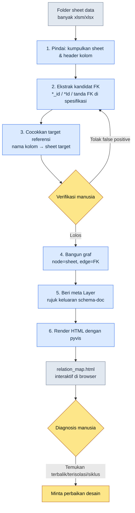

# 3.3 Visualisasi Peta Relasi — Melihat Dependensi dengan Mata

Seorang Game Designer baru datang ke meja saya pada minggu pertamanya bekerja. "Saya mau menyentuh tabel hadiah quest, tapi kalau ini saya ubah, bagian mana yang akan rusak?" Saya hendak menunjuk monitor untuk menjawab, lalu berhenti. Di kepala saya sudah ada gambarnya. `RewardTable` menggigit `ItemTable`, `ItemTable` menggigit `ItemEffectTable`, dan di atasnya `QuestTable` mereferensikan hadiah… tetapi begitu gambar itu saya ubah jadi kata-kata, bentuknya runtuh di kepala si pendengar. Saya menggambar tujuh kotak di papan tulis. Anak-anak panahnya mulai kusut. Tiga puluh menit kemudian, ia mengangguk lalu kembali ke mejanya, dan keesokan harinya ia datang lagi membawa pertanyaan yang persis sama.

Adegan inilah yang membuat saya menulis bab ini. Di kepala seorang System Designer ada graf dependensi. Masalahnya, graf itu hanya ada di kepalanya. Begitu orangnya berganti, gambarnya pun lenyap. Saya butuh alat untuk mengeksternalisasi gambar itu, dan itulah yang saya buat: `gen_relation_map.py`.

Saat sheet data hanya 5–10 buah, kepala kita masih cukup. Begitu melewati 30, memori kerja manusia tidak sanggup lagi. Folder sheet sebuah proyek biasanya melampaui batas itu sejak dini. Tabel yang menuliskan dependensi dari mana ke mana dalam bentuk teks, sekalipun dibaca, tidak membentuk gambar di kepala. Bab ini mengikuti dari awal sampai akhir proses nyata (worked process) untuk membangkitkan peta relasi kunci asing (FK) secara otomatis menjadi peta relasi HTML interaktif.

---

## 3.3.1 Empat Masalah yang Dipecahkan Peta Relasi

Sebelum membuat alatnya, mari kita tunjuk dahulu apa sebenarnya yang tersumbat saat peta relasi tidak ada. Ada empat adegan yang berulang.

**Onboarding Game Designer baru.** Seorang Game Designer baru menjadwalkan rapat untuk mempelajari struktur sistem. Itulah adegan di atas. Dependensi yang disampaikan secara lisan tidak bertahan beberapa hari pun di kepala si pendengar. Kalau kita mengeklik satu lembar peta relasi bersama-sama, lebih dari separuhnya sudah terbentuk pada rapat pertama. Perbedaan mendasarnya dengan gambar tangan di papan tulis adalah gambarnya tidak terhapus dan tetap ada di tempatnya.

**Diskusi cakupan dampak perubahan.** Sebuah permintaan perubahan sistem masuk. "Ini berdampak ke mana saja?" Rapat dijadwalkan, sudah didiskusikan lama pun masih saja ada satu-dua area yang terlewat. Kalau ada peta relasi, dengan mengeklik node yang menjadi target perubahan lalu menelusuri edge masuk (inbound), cakupan dampaknya langsung terlihat. Diskusinya tinggal menetapkan "apakah dampak ini benar-benar tepat" dan prioritasnya saja.

**Deteksi dependensi terbalik.** Sheet data L3 mereferensikan dokumen sistem L1 adalah hal yang normal. Arah sebaliknya (Layer di atas mereferensikan langsung sheet data di bawahnya) hampir selalu merupakan cacat desain. Pada daftar FK yang dijejer dalam bentuk teks, manusia tidak bisa menangkap arah terbalik ini. Pada gambar, ini langsung tersingkap lewat satu anak panah yang warna Layer-nya bertolak belakang.

**Penemuan sheet yang terisolasi.** Sesekali ditemukan sheet yang tidak direferensikan dari mana pun. Bisa jadi sisa-sisa desain lama, atau kasus di mana sudah diputuskan untuk dibuang tetapi filenya masih tertinggal. Sama seperti pemandangan kotak tanpa label yang menggelinding di sudut kantor. Kita baru menemukan pulau terpencil itu kalau ada gambarnya.

Kesamaan dari keempat masalah ini adalah semuanya "baru terpecahkan kalau strukturnya dilihat dengan mata". Dengan teks dan tabel, semuanya tersumbat.

---

## 3.3.2 Worked Transcript: Dari Sheet Data sampai Peta Relasi

Sekarang kita ikuti prosesnya secara nyata. Inputnya satu folder berisi sheet data, outputnya satu lembar HTML interaktif yang dibuka di browser. Di antara keduanya, saya catat tanpa ada yang terlewat: apa yang dikerjakan AI dan di titik mana manusia memverifikasi/menolak.

### 3.3.2.1 Alur Keseluruhan



Intinya ada pada loop verifikasi manusia di antara langkah 3 dan 5. Ekstraksi kandidat FK dikerjakan mesin sebagai draf awal, lalu manusia menyaring false positive dari situ. Kalau loop ini dilewati, peta relasi memang tampak meyakinkan tetapi menjadi gambar yang salah.

### 3.3.2.2 Dari Mana FK Berasal — Urutan Input

Akurasi alat ini ditentukan oleh dari mana inputnya ditarik. Prinsip schema-first yang ditetapkan di 3.2 berlaku langsung di sini. Urutan sumber utama (canonical) untuk informasi FK adalah sebagai berikut.

1. **Sheet `$스키마`** — sumber utama pertama dari setiap sheet data. Untuk tiap kolom, tipe, Enum, dan target FK ditulis secara eksplisit. Kalau FK sudah tertulis di sini, itulah prioritas pertama.
2. **Definisi `*.proto` / Enum** — skema yang dikeluarkan lewat Export VBA (bahasa makro Excel). Memperkuat informasi tipe ketika spesifikasi kosong.
3. **Keluaran `csv` aktual** — data nyata yang diekspor oleh sheet. Relasi yang tidak ada di spesifikasi pun tersingkap dari data sebagai sebuah pola (misalnya: kalau semua nilai pada kolom `npc_id` berada dalam rentang key `NPCTable`, itu praktis adalah FK).

Di sini ada satu prinsip yang saya tegaskan. **Yang menjadi sumber utama adalah keluaran JSON/csv aktual, bukan dokumen skema.** Sekalipun di spesifikasi tertulis bahwa `reward_id` adalah FK, kalau pada data nyata kolom itu kosong atau menunjuk nilai yang tidak relevan, berarti spesifikasinya yang salah. Ketika keduanya bertolak belakang, alat ini memercayai sisi data, dan ketidaksesuaian itu sendiri ditinggalkan dalam laporan. Inilah alasan mengapa schema-doc tidak dijadikan sumber utama.

### 3.3.2.3 Tahap 1 — Pindai Folder dan Ekstraksi Kandidat FK

Aksi pertama alat ini adalah membuka semua xlsm/xlsx di dalam folder lalu mengumpulkan sheet dan header kolom. Tahap ini sendiri bersifat mekanis sehingga tidak menarik. Yang menarik adalah aturan untuk menarik kandidat FK. Awalnya sederhana. Kalau nama kolom diakhiri `*_id` atau `*Id`, dianggap kandidat FK. Namun, hanya dengan satu aturan ini, false positive dan kelewatan sama-sama muncul.

Di sinilah saya menyambungkan AI. Saya serahkan seluruh daftar header kolom dan meminta AI menyimpulkan sheet target FK-nya. Berikut adalah prompt lengkap yang benar-benar saya lemparkan beserta keluaran mentahnya.

> **Prompt:**
> Berikut adalah nama sheet dan daftar header kolom dari beberapa sheet data game. Simpulkan apakah tiap kolom adalah kunci asing (FK), dan jika FK, kolom dari sheet mana yang direferensikannya. Aturan penamaan kolom biasanya `<bentuk_tunggal_sheet_target>_id`. Namun, kalau tidak yakin, tandai dengan "tidak pasti" dan tuliskan alasannya. Jangan mengisi dengan tebakan.
>
> ```
> QuestTable: quest_id, title, npc_id, reward_id, prev_quest_id, region_id
> NPCTable: npc_id, name, region_id, faction_id
> RewardTable: reward_id, item_id, count, currency_id
> ItemTable: item_id, name, item_effect_id, grade
> ItemEffectTable: item_effect_id, effect_type, value
> RegionTable: region_id, name, parent_region_id
> ```

> **Keluaran mentah Claude (baris PK dihilangkan, hanya penilaian FK yang dikutip):**
>
> **QuestTable**
> - `npc_id` → NPCTable.npc_id (diperkirakan NPC yang memberikan quest)
> - `reward_id` → RewardTable.reward_id
> - `prev_quest_id` → QuestTable.quest_id (quest pendahulu, **referensi mandiri**)
> - `region_id` → RegionTable.region_id
>
> **NPCTable**
> - `region_id` → RegionTable.region_id
> - `faction_id` → **tidak pasti**: FactionTable tidak ada dalam daftar input. Berdasarkan aturan penamaan kolom, kemungkinan mereferensikan FactionTable.faction_id, tetapi karena sheet tersebut tidak disediakan, targetnya tidak dapat dipastikan.
>
> **RewardTable**
> - `item_id` → ItemTable.item_id
> - `currency_id` → **tidak pasti**: CurrencyTable tidak ada dalam daftar. Ada kemungkinan jenis mata uang dikelola sebagai Enum sehingga mungkin bukan FK. Perlu pengecekan spesifikasi.
>
> **ItemTable**
> - `item_effect_id` → ItemEffectTable.item_effect_id
> - `grade` → Bukan FK (diperkirakan Enum: nilai tingkatan/grade)
>
> **ItemEffectTable**
> - `effect_type` → Bukan FK (diperkirakan Enum)
>
> **RegionTable**
> - `parent_region_id` → RegionTable.region_id (**referensi mandiri**, struktur hierarki wilayah)
>
> Perhatian: inferensi di atas berdasarkan aturan penamaan kolom, dan nilai data aktual belum diperiksa. Khususnya, kolom yang tidak diakhiri `_id` seperti `count`, `value` dikecualikan dari pemeriksaan FK, sehingga kalau ada referensi tersembunyi, hal itu akan terlewat.

Pada keluaran ini, ada tiga hal yang dikerjakan manusia.

- **Penolakan 1:** `faction_id` → AI memprosesnya sebagai tidak pasti karena FactionTable tidak ada. Benar. Hanya saja kenyataannya `faction_id` adalah Enum. Karena faksi tetap berjumlah 6 jenis, ia dikelola sebagai Enum tanpa sheet terpisah. Berkat AI tidak mengarang sheet yang tidak ada dan menghentikan penilaian, manusia bisa melihat spesifikasi lalu memastikannya sebagai Enum. **Dikeluarkan dari FK.**
- **Penolakan 2:** `currency_id` → AI membiarkan kedua kemungkinan terbuka. Setelah melihat data aktual, ternyata `CurrencyTable` memang ada (saya yang melewatkannya dari daftar input). **Dipastikan sebagai FK.** Ini kelalaian input dari manusia yang tidak bisa menyalahkan AI.
- **Penerimaan:** deteksi referensi mandiri pada `prev_quest_id` dan `parent_region_id`. Hal ini akan terlewat seandainya hanya mengandalkan aturan ekspresi reguler (regex) sederhana. AI membantu mempercepat verifikasi karena menambahkan makna seperti "quest pendahulu" dan "hierarki wilayah".

Pelajaran yang saya peroleh di sini jelas. Bagian di mana AI paling berguna bukanlah inferensi yang cepat, melainkan **pengendalian dirinya untuk membiarkan kosong tempat yang tidak diketahui dengan tanda "tidak pasti"**. Seandainya kotak kosong itu dipaksa diisi, `faction_id` akan tersambung ke sheet yang keliru, dan false positive itu akan tertinggal sebagai anak panah palsu di peta relasi serta menyesatkan Game Designer baru.

### 3.3.2.4 Tahap 2 — Membangun Graf dan Memberi Layer

Begitu daftar FK yang terverifikasi keluar, `gen_relation_map.py` membangun grafnya. Sheet menjadi node, FK menjadi edge berarah. Jumlah edge masuk (seberapa banyak sheet lain mereferensikan saya) dihitung untuk menentukan ukuran node. Semakin banyak direferensikan, semakin besar node-nya, yaitu hub dari sistem.

Metadata Layer ditarik dari dokumen skema Markdown yang dibuat oleh skill `schema-doc`. Koordinat Layer (L0–L4) yang didefinisikan di 3.1 melekat sebagai label pada tiap sheet, dan alat ini membacanya untuk mewarnai node. Sambungan ini penting. Kalau peta relasi tidak mengenal Layer, ia hanyalah kotak dan anak panah; baru setelah mengenal Layer, "arah terbalik" bisa didiagnosis dengan warna.

Kalau struktur internal alat ini ditampilkan sebagai kerangka kode, bentuknya seperti ini (hanya alur inti yang dikutip).

```python
# gen_relation_map.py (kutipan alur inti)
from pyvis.network import Network

LAYER_COLORS = {          # Palet Layer — distandarkan jadi satu atom
    "L0": "#2c3e50",      # meta/umum
    "L1": "#2980b9",      # sistem
    "L2": "#27ae60",      # konten
    "L3": "#f39c12",      # instans data
    "L4": "#c0392b",      # turunan/cache
}

def build_graph(fk_list, layer_map):
    net = Network(directed=True, height="900px")
    inbound = count_inbound(fk_list)          # hitung edge masuk
    for sheet in all_sheets(fk_list):
        layer = layer_map.get(sheet, "L0")
        size = 10 + inbound[sheet] * 3        # makin hub, makin besar node
        net.add_node(sheet, color=LAYER_COLORS[layer],
                     size=size, title=sheet_tooltip(sheet))
    for src, dst, col in fk_list:
        # Deteksi Layer terbalik: kalau Layer atas mereferensikan yang bawah, beri warna peringatan
        edge_color = "#e74c3c" if is_reverse(src, dst, layer_map) else "#888"
        net.add_edge(src, dst, title=col, color=edge_color)
    return net
```

`is_reverse` adalah inti kecil dari alat ini. Kalau sheet asal sebuah edge berada di Layer yang lebih atas daripada sheet tujuannya (misalnya L1 → L3), itu dianggap arah terbalik dan edge-nya diwarnai merah. Saat manusia membuka gambar dan melihat anak panah merah, itu hampir selalu tempat yang perlu diperbaiki.

### 3.3.2.5 Tahap 3 — Render HTML dan Struktur Hasil

Tahap terakhir adalah pyvis memuntahkan HTML interaktif. Saat node diklik, kolom, Layer, dan jumlah edge masuk sheet tersebut muncul sebagai tooltip, dan kita bisa memfilter berdasarkan nama sheet di kotak pencarian. Alasan mengapa harus HTML dan bukan PNG statis ada di sini — kalau jumlah node melewati puluhan, pada gambar statis anak panahnya kusut sehingga tidak ada yang terlihat. Kita harus menarik dengan mouse untuk membentangkannya, lalu mempersempit hanya ke area yang diminati dengan klik, barulah polanya tertangkap.

Kalau struktur peta relasi yang dibuat dari data contoh di atas dipindahkan ke SVG, bentuknya seperti ini. Warna menunjukkan Layer, dan anak panah merah berarti tempat arah terbalik (meskipun pada contoh ini tidak ada).

<svg viewBox="0 0 720 360" xmlns="http://www.w3.org/2000/svg" font-family="sans-serif" font-size="13">
  <defs>
    <marker id="arrow" markerWidth="10" markerHeight="10" refX="9" refY="3" orient="auto" markerUnits="strokeWidth">
      <path d="M0,0 L9,3 L0,6 Z" fill="#888"/>
    </marker>
  </defs>
  <!-- nodes -->
  <rect x="40" y="30" width="130" height="40" rx="6" fill="#2980b9"/>
  <text x="105" y="55" fill="#fff" text-anchor="middle">RegionTable (L1)</text>
  <rect x="300" y="30" width="130" height="40" rx="6" fill="#27ae60"/>
  <text x="365" y="55" fill="#fff" text-anchor="middle">QuestTable (L2)</text>
  <rect x="560" y="30" width="130" height="40" rx="6" fill="#27ae60"/>
  <text x="625" y="55" fill="#fff" text-anchor="middle">NPCTable (L2)</text>
  <rect x="300" y="150" width="130" height="40" rx="6" fill="#f39c12"/>
  <text x="365" y="175" fill="#fff" text-anchor="middle">RewardTable (L3)</text>
  <rect x="560" y="150" width="130" height="40" rx="6" fill="#f39c12"/>
  <text x="625" y="175" fill="#fff" text-anchor="middle">ItemTable (L3)</text>
  <rect x="560" y="270" width="150" height="40" rx="6" fill="#f39c12"/>
  <text x="635" y="295" fill="#fff" text-anchor="middle">ItemEffectTable (L3)</text>
  <!-- edges -->
  <line x1="300" y1="50" x2="172" y2="50" stroke="#888" stroke-width="2" marker-end="url(#arrow)"/>
  <line x1="560" y1="50" x2="432" y2="50" stroke="#888" stroke-width="2" marker-end="url(#arrow)"/>
  <line x1="625" y1="70" x2="380" y2="150" stroke="#888" stroke-width="2" marker-end="url(#arrow)"/>
  <line x1="365" y1="70" x2="365" y2="150" stroke="#888" stroke-width="2" marker-end="url(#arrow)"/>
  <line x1="560" y1="170" x2="432" y2="170" stroke="#888" stroke-width="2" marker-end="url(#arrow)"/>
  <line x1="625" y1="190" x2="625" y2="270" stroke="#888" stroke-width="2" marker-end="url(#arrow)"/>
  <!-- self-ref -->
  <path d="M170,40 q40,-30 0,-10" fill="none" stroke="#888" stroke-width="2" marker-end="url(#arrow)"/>
  <text x="200" y="20" fill="#666" font-size="11">parent_region_id (referensi mandiri)</text>
</svg>

Kalau dilihat dari ukuran node, `RegionTable` paling banyak direferensikan (Quest dan NPC semuanya menunjuk ke sana). Inilah hub-nya. `ItemEffectTable` adalah node daun sehingga kecil. Jawaban atas pertanyaan Game Designer baru, "Untuk memahami sistem ini, dari mana saya harus mulai melihat?", sudah ada di dalam gambar berdasarkan urutan ukuran node.

---

## 3.3.3 Diagnosis yang Dihasilkan Gambar — Berpadu dengan Layer

Di 3.1 koordinat Layer sudah didefinisikan. Ketika peta relasi pada bab ini mengangkat koordinat itu ke ranah visual, empat diagnosis yang mustahil dilakukan dengan teks atau tabel menjadi mungkin dalam satu layar.

- **Layer terbalik** — anak panah yang warna Layer-nya mengalir ke arah berlawanan (merah). Struktur tidak wajar di mana sheet data justru memengaruhi desain sistem secara terbalik.
- **Node terisolasi** — pulau terpencil yang tidak terhubung dengan edge mana pun. Kandidat untuk dibuang.
- **Hub kelebihan beban** — node raksasa dengan edge masuk yang luar biasa banyak. Ini sinyal bahwa satu sheet memikul terlalu banyak tanggung jawab, sehingga pemecahan (split) perlu dipertimbangkan.
- **Dependensi siklik** — tempat anak panah membentuk lingkaran. Hampir selalu cacat desain, dan berujung pada masalah urutan pemuatan data.

Namun, ini tidak berarti gambar menangkap semua masalah. Gambar menangkap **cacat struktural**. Apakah FK ini benar-benar relasi yang tepat secara makna (misalnya: apakah `npc_id` benar-benar "NPC yang memberikan quest" atau "NPC yang muncul dalam quest") tidak terpecahkan oleh gambar. Itu bagian dari penilaian domain manusia. Alat ini hanya menyiapkan panggung tempat penilaian manusia bisa bekerja.

---

## 3.3.4 Tanpa Pembaruan Otomatis, Peta Akan Lapuk

Peta relasi tidak selesai dengan sekali dibuat. Sheet ditambah dan diubah setiap minggu. Peta relasi yang diserahkan pada pembaruan manual akan menyimpang dari struktur nyata dalam satu-dua bulan, dan peta yang menyimpang justru memandu ke jalan yang salah, sehingga lebih baik tidak ada sama sekali. Anggota tim yang pernah terbakar oleh gambar yang sekali salah, setelah itu tidak akan melihat gambar lagi — inilah kegagalan yang paling mahal.

Karena itu, pembaruan dikaitkan dengan pemicu otomatis.

- **Git pre-push hook** — membangkitkan ulang peta relasi sebelum mem-push sheet data. Selalu terjamin dalam kondisi paling baru.
- **Saat permintaan perubahan** — begitu permintaan perubahan sheet data masuk, peta relasi sebelum dan sesudah perubahan dibandingkan secara diff lalu dilampirkan ke komentar. Edge yang ditambahkan berwarna hijau, edge yang hilang berwarna merah. Reviewer melihat cakupan dampak lewat gambar.
- **Batch malam** — setiap malam dibuat peta relasi baru dan ditinggalkan diff-nya dengan hari sebelumnya.
- **Perintah manual** — slash command `/relation-map` untuk pembuatan instan. Dipakai saat ingin menampilkannya secara dadakan di tengah rapat.

HTML yang dihasilkan otomatis di-deploy ke hosting statis internal (portal perencanaan). Tanpa perlu memasang alat tambahan, siapa pun yang punya browser bisa melihat peta yang sama. Sama seperti peta yang selalu terbentang di samping meja. Siapa pun yang bertanya, kami menjawab sambil sama-sama menunjuk gambar yang sama.

---

## 3.3.5 Kesalahan Umum dan Cara Menghindarinya

| Kesalahan | Mengapa Terjadi | Cara Menghindari |
|---|---|---|
| Node melewati 100 sehingga gambar kusut | Memaksa seluruh bidang masuk ke satu layar | Filter per domain, tampilan terpecah per grup |
| Warna Layer berbeda di tiap alat | Palet didefinisikan ulang di tiap kode | Standarkan palet jadi satu atom (`LAYER_COLORS`) |
| Deteksi FK hanya menangkap `*_id` sehingga ada kelewatan/false positive | Bergantung pada satu baris regex | Padukan FK eksplisit di spesifikasi + verifikasi nilai data nyata |
| Gambar dibuat tetapi tidak ada yang melihat | Tidak dikaitkan ke alur kerja | Wajibkan lampiran gambar pada permintaan perubahan & rapat |
| Dibuat lalu tidak diperbarui sehingga lapuk | Bergantung pada pembaruan manual | Pemicu otomatis wajib; yang manual jadi tak berguna dalam sebulan |

Dalam pengoperasian `gen_relation_map.py`, yang paling sering membuat saya terbakar adalah baris ketiga. Kalau hanya memercayai aturan `*_id`, referensi tersembunyi seperti `count` atau `value` akan terlewat (AI di 3.3.2.3 pun memperingatkan batasan ini sendiri), dan `grade` yang merupakan Enum jadi false positive sebagai FK. Loop verifikasi yang melihat spesifikasi sekaligus data nyata adalah jawaban untuk baris ini.

---

## 3.3.6 Mencoba Dahulu dengan Versi Ringkas Solo

Kalau langsung mencoba menangani seluruh sheet data perusahaan sekaligus, hasilnya berat, dan kita keburu lelah bahkan sebelum bisa menunjukkan nilainya. Mulailah dari kecil, dari satu folder bidang Anda sendiri.

### Coba Sendiri

**setup.**
1. Pilihlah satu folder berisi 5–10 sheet data yang Anda tangani.
2. Pasang dependensi dengan `pip install pyvis openpyxl` (untuk membaca Excel gunakan skill `excel-reader` atau openpyxl).
3. Periksa dahulu di sheet `$스키마` tiap sheet apakah FK sudah ditulis eksplisit. Kalau tidak ada, cukup kumpulkan header kolomnya.

**prompt.** Kumpulkan daftar header kolom lalu lemparkan prompt dari 3.3.2.3 apa adanya. Intinya ada di satu baris terakhir — "Kalau tidak yakin, tandai dengan tidak pasti, dan jangan mengisi dengan tebakan." Kalimat inilah yang mencegah anak panah palsu.

**verify.**
1. Lihatlah kandidat FK yang dilemparkan AI satu baris demi satu baris. Pastikan baris yang ditandai "tidak pasti" dengan spesifikasi/data nyata.
2. Keluarkan dari FK kolom yang dicurigai sebagai Enum (yang tampak seperti FK padahal tanpa `_id`, seperti `grade`, `effect_type`).
3. Pastikan referensi mandiri (`prev_*_id`, `parent_*_id`) tertangkap dengan benar.
4. Gambar grafnya dengan daftar yang terverifikasi, buka di browser, lalu cari dengan mata anak panah merah (terbalik) dan pulau terpencil (terisolasi).

### Versi Ringkas Solo

Kalau tidak ada waktu untuk membuat alatnya, pada minggu pertama Anda boleh mulai dengan satu lembar mermaid yang digambar tangan. Tuliskan langsung FK dari 5 sheet ke mermaid dengan format 3.3.2.3. Kalau Anda membawa satu lembar ini ke rapat lalu menunjukkan "inilah dependensi sistem kita", nilainya terbukti di tempat itu juga. Begitu nilainya terlihat, alat otomasi secara alami akan menyusul berikutnya. Beban bahwa sejak awal harus keluar alat yang langsung berfungsi, boleh Anda turunkan.

Perluasannya mengalir secara alami dengan urutan ini — minggu ke-1 gambar tangan mermaid sheet Anda sendiri → minggu ke-2 menambahkan warna Layer dan klik → 1 bulan pembaruan otomatis (git hook atau batch malam) → 3 bulan deploy ke portal internal → 6 bulan peta relasi gabungan seluruh sheet.

---

## 3.3.7 Sambungan ke Bab Berikutnya

Di 3.2 dibahas bagian dalam sheet (skema), dan di 3.3 dibahas bagian luar sheet (relasi). Di 3.4 di atas semua ini ditumpukkan pola prompt berbantuan AI. Di atas sistem yang skema dan relasinya sudah tertata, pembahasan berlanjut ke pola-pola praktis tentang bagaimana AI membantu pemeriksaan konsistensi dan ekstraksi cakupan dampak.

---

### Poin-Poin Penting
- Kalau graf dependensi yang ada di kepala dieksternalisasi, gambar yang sama tetap ada di tempatnya meskipun orangnya berganti.
- Ekstraksi FK memperoleh akurasinya dari loop verifikasi di mana manusia menyaring false positive dari draf yang dihampar AI.
- Peta relasi tanpa pembaruan otomatis akan lapuk dalam satu-dua bulan dan kehilangan kepercayaan.

### Pratinjau Bab Berikutnya
- 3.4. Pola Prompt Desain Sistem Berbantuan AI
