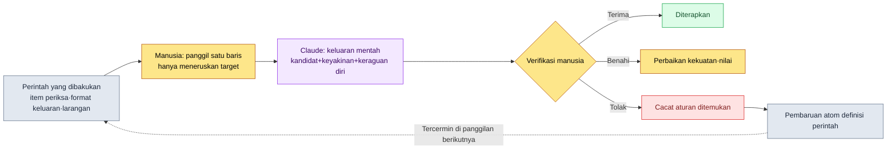
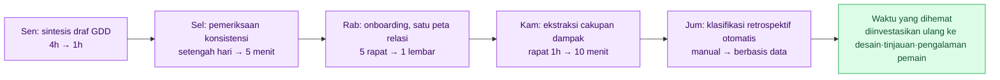

# 3.4 Pola Prompt untuk Desain Sistem Berbantuan AI

Itu minggu menjelang alpha build. Saya menambahkan satu baris class baru ke sheet skill, lalu menyimpannya. Ternyata buff_id yang dirujuk class itu adalah baris yang sehari sebelumnya dihapus oleh seseorang — dan saya baru menyadarinya keesokan paginya, setelah build-nya rusak. Menelusuri kembali build yang rusak itu untuk mencari penyebabnya memakan waktu dua jam. Dua jam yang tidak akan terbuang seandainya, sebelum menghapus satu baris, saya bisa bertanya lebih dulu: "Boleh nggak baris ini dihapus?"

Bab ini adalah tentang cara menyuruh AI mengajukan pertanyaan itu. Intinya bukan kiat menulis prompt yang bagus. Intinya adalah membakukan pertanyaan yang sama agar tidak perlu ditulis ulang dari nol setiap kali. Di 3.2 kita memasang skema, di 3.3 kita memasang peta relasi. Keduanya adalah kerangka data. Bab ini mengukuhkan pertanyaan yang dilemparkan manusia kepada AI di atas kerangka itu menjadi aset.

Lebih dulu saya kunci satu hal. Yang dibuat AI bukan jawaban, melainkan kandidat. Dalam semua pola yang muncul di bab ini, tangan yang membuat keputusan akhir tetap berada di sisi manusia sampai akhir.

---

## 3.4.1 Dua Titik Bocor pada Prompt Dadakan

Saat baru mulai menggunakan AI, kita mengetiknya secara dadakan dengan bahasa alami setiap kali. Kira-kira begini.

```
Coba lihat sheet skill ini. Cek ada nggak foreign key yang rusak,
kalau ada yang aneh kasih tahu ya. Oh iya, dan yang cooldown-nya negatif juga.
```

Prompt ini bocor di dua titik.

Pertama, item pemeriksaan berubah-ubah setiap kali. Hari ini saya teringat "cooldown negatif", tetapi besok saya lupa. "PK ganda (Primary Key, kunci primer)" yang kemarin sempat tersaring hari ini hilang dari prompt. Pemeriksaan yang bergantung pada ingatan manusia akan terlewat sebanyak kondisi manusia itu sendiri.

Kedua, format hasil berubah-ubah setiap kali. Jika maksud yang sama saya tuliskan berbeda-beda sebagai "tolong cek", "periksa", "lihat sekilas", AI akan menjawab dengan tabel pada satu hari, dan dengan paragraf pada hari lain. Kalau formatnya tidak konsisten, hasilnya tidak bisa diproses ulang secara otomatis.

Solusinya adalah melepaskan prompt dari tangan dan memasukkannya ke laci. Catatan yang setiap kali ditulis tangan diganti menjadi kartu berlabel, lalu diambil dari laci yang sama. Kartu itulah yang dalam buku ini disebut slash command (perintah garis miring) (skill) dan atom.

---

## 3.4.2 Tiga Bentuk Pembakuan dan Kriteria Memilihnya

Pembakuan punya tiga wadah. Apa yang ditaruh di mana ditentukan oleh frekuensi pemanggilan dan stabilitas.

<svg viewBox="0 0 720 300" xmlns="http://www.w3.org/2000/svg" font-family="sans-serif" font-size="13">
  <rect x="0" y="0" width="720" height="300" fill="#fbfbfd"/>
  <line x1="120" y1="40" x2="120" y2="280" stroke="#bbb" stroke-width="1"/>
  <line x1="120" y1="160" x2="700" y2="160" stroke="#bbb" stroke-width="1"/>
  <text x="60" y="35" text-anchor="middle" font-weight="bold">Frekuensi pemanggilan</text>
  <text x="60" y="55" text-anchor="middle" fill="#888" font-size="11">Tinggi ↑</text>
  <text x="60" y="270" text-anchor="middle" fill="#888" font-size="11">Rendah ↓</text>
  <text x="410" y="298" text-anchor="middle" font-weight="bold">Stabilitas definisi →</text>

  <rect x="150" y="70" width="200" height="70" rx="8" fill="#e8f0fe" stroke="#4285f4"/>
  <text x="250" y="98" text-anchor="middle" font-weight="bold">Slash command (skill)</text>
  <text x="250" y="118" text-anchor="middle" font-size="11" fill="#555">Sering·stabil → /check-sheet</text>
  <text x="250" y="133" text-anchor="middle" font-size="11" fill="#555">Panggil satu kata, format hasil tetap</text>

  <rect x="400" y="70" width="270" height="70" rx="8" fill="#fef7e0" stroke="#f9ab00"/>
  <text x="535" y="98" text-anchor="middle" font-weight="bold">Injeksi otomatis atom (JIT)</text>
  <text x="535" y="118" text-anchor="middle" font-size="11" fill="#555">Sering·constraint inti → dipicu kata kunci</text>
  <text x="535" y="133" text-anchor="middle" font-size="11" fill="#555">Tak perlu dihafal, menyisip ke bahasa alami</text>

  <rect x="150" y="190" width="200" height="70" rx="8" fill="#e6f4ea" stroke="#34a853"/>
  <text x="250" y="218" text-anchor="middle" font-weight="bold">File template (.md)</text>
  <text x="250" y="238" text-anchor="middle" font-size="11" fill="#555">Kadang·pekerjaan besar → panggil file</text>
  <text x="250" y="253" text-anchor="middle" font-size="11" fill="#555">Mudah dilihat mata dan diperbaiki</text>

  <rect x="400" y="190" width="270" height="70" rx="8" fill="#f1f3f4" stroke="#9aa0a6"/>
  <text x="535" y="225" text-anchor="middle" font-size="12" fill="#777">Kadang·definisi tak stabil →</text>
  <text x="535" y="243" text-anchor="middle" font-size="12" fill="#777">Jangan dibakukan dulu (biarkan dadakan)</text>
</svg>

Pekerjaan yang sering dipakai dan definisinya sudah mengeras dibuatkan slash command. Yang sering dipakai tetapi merupakan "constraint yang tidak boleh dilupakan" diinjeksikan otomatis lewat atom JIT. Pekerjaan yang jarang tetapi berbadan besar dibuatkan file template. Dan pekerjaan yang definisinya masih goyah tidak dibakukan, melainkan dibiarkan dadakan. Tidak perlu memiliki ketiganya sejak awal. Mulai dengan satu-dua slash command, lalu tambah ketika nilainya mulai terlihat.

---

## 3.4.3 Pola ① Pemeriksaan Konsistensi — Worked Transcript

Alih-alih menjelaskannya dengan kata-kata, saya akan menelusuri satu pola dari awal hingga akhir. Ini pola yang secara otomatis bertanya "Boleh nggak baris ini dihapus?" sebelum sebuah baris kosong dihapus. Namanya `/check-sheet`. Di dalamnya, item pemeriksaan dan format keluaran sudah dibakukan.

Aset yang menjadi landasannya ada pada catatan kerja terukur yang ditanamkan di sana-sini dalam buku ini. Entri data mengikuti prinsip schema-first (atom `data_entry_schema_first`). Urutan entrinya adalah sheet `$스키마` → `Enum/*.proto` (VBA (bahasa makro Excel) Export) → csv. Dan sumber kebenaran bukanlah dokumen skema, melainkan keluaran JSON yang sebenarnya (atom `json_over_schema_doc_as_source_of_truth`). Pemeriksaan konsistensi adalah memindahkan kedua prinsip itu apa adanya menjadi aturan pemeriksaan.

### setup — Isi dari Perintah yang Dibakukan

Jika Anda membuka `/check-sheet`, di dalamnya termuat badan prompt seperti ini. Inilah bagian yang tidak perlu Anda ketik tangan setiap kali.

```
Peran: Kamu adalah pemeriksa konsistensi sheet data game.

Sheet yang diperiksa: {{sheet_name}}
Skema yang dapat dirujuk: sheet $스키마 (tipe·rentang·target FK per kolom)
Sumber kebenaran yang dapat dirujuk: export JSON dari sheet yang sama (lebih utama daripada dokumen skema)

Item pemeriksaan (dengan urutan ini):
1. Validitas foreign key — apakah nilai kolom FK benar-benar ada di sheet target rujukan
2. Pelanggaran rentang — nilai yang keluar dari min/max yang didefinisikan di $스키마
3. Kolom wajib yang kosong — baris kosong pada kolom required=true
4. PK ganda — PK yang sama muncul dua kali atau lebih

Format keluaran (wajib persis tabel ini):
| # | Baris | Kolom | Jenis pelanggaran | Nilai saat ini | Kandidat perbaikan | Tingkat keyakinan |

Aturan:
- Kandidat perbaikan hanya diusulkan. Jangan pernah mengubah sheet secara langsung.
- Tingkat keyakinan salah satu dari tinggi/sedang/rendah. Jika menebak, beri rendah.
- Jika tidak ada pelanggaran, cukup keluarkan "0 pelanggaran" lalu selesai.
```

Yang penting dalam badan ini adalah tiga baris aturan terakhir. "Jangan mengubah langsung", "beri tingkat keyakinan", "akui tebakan sebagai rendah". Ketiga baris ini mengikat AI ke posisi yang mendorong kandidat, bukan posisi yang memberi jawaban.

### prompt — Satu Baris yang Benar-Benar Diketik Manusia

```
/check-sheet skill_table
```

Selesai. Hanya satu nama sheet yang diteruskan. Keempat item pemeriksaan maupun format tabel keluaran tidak ditulis ulang. Itulah nilai dari pembakuan.

### Keluaran Mentah dari Claude

Berikut adalah keluaran yang kembali ketika benar-benar dijalankan. Tanpa diringkas, saya muat apa adanya — termasuk bagian yang ambigu dan tempat AI tampak ragu.

```
Berikut hasil pemeriksaan konsistensi skill_table. Ditemukan total 4 pelanggaran.

| # | Baris | Kolom      | Jenis pelanggaran | Nilai saat ini | Kandidat perbaikan          | Keyakinan |
|---|-------|------------|-------------------|----------------|-----------------------------|-----------|
| 1 | 142   | buff_id    | Pelanggaran FK    | 9007           | 9070 (dugaan salah ketik, 1 digit) | Sedang    |
| 2 | 142   | buff_id    | Pelanggaran FK    | 9007           | 9012 (nama "racun ganas" mirip)    | Rendah    |
| 3 | 88    | cooldown   | Pelanggaran rentang | -1           | 0 (negatif tidak boleh)     | Tinggi    |
| 4 | 215   | combo_next | Wajib kosong      | (kosong)       | Ditangguhkan                | Rendah    |

Saya tambahkan beberapa catatan.

- Nomor 1 dan 2 adalah dua kandidat berbeda untuk kolom yang sama di baris
  yang sama (142). ID 9007 tidak ada di sheet buff. 9070 berbeda satu digit
  angka sehingga mungkin salah ketik, dan 9012 saya naikkan sebagai kandidat
  karena namanya "racun ganas" yang mirip. Keduanya keyakinannya rendah.
  Manusia harus memilih.

- Nomor 4 (combo_next kosong di baris 215) ambigu. Di $스키마 tertulis
  required=true, tetapi setelah saya lihat export JSON, ada 12 baris lain
  yang kolom ini juga kosong. Bisa jadi spesifikasinya bukan yang terbaru,
  atau ada aturan "skill penutup combo membiarkan combo_next kosong" yang
  belum tercermin di spesifikasi. Karena saya tidak bisa memastikannya,
  saya biarkan sebagai "ditangguhkan".

- Selain cooldown, jika ingin menjalankan lebih banyak pemeriksaan rentang,
  perlu memeriksa min/max kolom lain di $스키마, tetapi pada informasi yang
  saya terima sebagian kolom range_check kosong, sehingga kolom cast_time
  tidak bisa saya periksa.
```

Alasan keluaran ini bagus di sini bukan karena ia rapi, melainkan karena ia jujur. Ia tidak memastikan nomor 4 dengan "karena wajib, isi saja", melainkan menunjukkan keraguannya sendiri dengan "spesifikasinya mungkin bukan yang terbaru". Ia juga mengakui keterbatasan bahwa ia tidak bisa melihat cast_time. Seandainya AI menyatakan nomor 4 dengan percaya diri "isi dengan 0", itu bisa jadi jawaban salah yang merusak skill penutup combo.

### verify — Verifikasi dan Veto oleh Manusia

Sekarang manusia memutuskan baris demi baris. Verifikasi yang otomatis menyertai berarti tabel ini muncul otomatis — bukan berarti manusia tidak melihatnya.

- **Nomor 3 (cooldown -1 → 0)**: Diterima. Keyakinan tinggi, cooldown negatif jelas kesalahan entri. Langsung diperbaiki.
- **Nomor 1·2 (buff_id 9007)**: Ditangguhkan. Keduanya keyakinan rendah. Diputuskan membuka langsung sheet buff untuk memeriksa ID asli buff dari keluarga "racun ganas". Kedua kandidat AI tidak diterima.
- **Nomor 4 (combo_next kosong)**: **Ditolak**. Yang diragukan AI ternyata benar. Skill ini adalah penutup combo, sehingga combo_next kosong itu normal. Bukan pelanggaran. Ditolak, dan ini masalah di sisi spesifikasi.

Nomor 4 yang terakhir adalah inti. Di titik yang seandainya keluaran AI dipercaya begitu saja akan merusak data yang sehat, veto manusia bekerja. Pada saat yang sama, nomor 4 juga mengungkap cacat pada aturan pemeriksaan itu sendiri. `required=true` pada spesifikasi itu salah.

### Permintaan Ulang — Penolakan Memperbaiki Aturan

Kita tidak berhenti di sini. Penolakan adalah input yang membuat pemeriksaan berikutnya lebih cerdas. Manusia melanjutkan mengetik.

```
Nomor 4 bukan pelanggaran. Untuk skill dengan combo_finisher=true, combo_next
yang kosong itu normal. Masukkan aturan pengecualian ini ke item pemeriksaan,
supaya ke depan combo_next kosong pada baris finisher tidak dianggap pelanggaran.
Lalu item yang definisi required pada spesifikasinya tampak salah, pisahkan dan
laporkan di bagian "dugaan spesifikasi salah" tersendiri.
```

```
Saya mengerti. Saya akan menerapkan pengecualian pada aturan pemeriksaan /check-sheet.

Aturan yang ditambahkan:
- Saat memeriksa kewajiban combo_next, periksa dulu nilai combo_finisher di
  baris yang sama. Jika combo_finisher=true, combo_next kosong diproses sebagai
  normal (dikecualikan dari pelanggaran).

Bagian baru:
- "Dugaan spesifikasi salah" — ketika distribusi nyata export JSON berbeda dari
  definisi $스키마, pisahkan sebagai kandidat yang seharusnya memperbaiki
  spesifikasi, bukan data, lalu laporkan.
  (Sesuai prinsip bahwa sumber kebenaran adalah JSON, jika mayoritas data
   bertentangan dengan spesifikasi, yang dicurigai adalah sisi spesifikasi.)

Apakah perubahan ini perlu saya catat ke atom definisi perintah /check-sheet?
```

Baris terakhir itulah penyempurnaan pola ini. Satu penolakan tidak berhenti sebagai perbaikan sekali pakai, melainkan tercatat ke atom definisi perintah dan menyebar ke manusia berikutnya·pemeriksaan berikutnya. Inilah bunga majemuk dari pembakuan. Kesalahan yang sama tidak disaring dua kali.

---

## 3.4.4 Pola ② Ekstraksi Cakupan Dampak Perubahan — Worked Transcript

Pola kedua adalah menghapus dua jam dari adegan pembuka itu. Sebelum mengubah satu baris atau satu keputusan, kita bertanya lebih dulu "sejauh mana ini akan menjalar". Namanya `/impact`. Peta relasi yang dibuat di 3.3 (HTML relasi FK yang dihasilkan `gen_relation_map.py`) adalah bahan bakar pola ini.

### setup — Jalur Penelusuran yang Dibakukan

Di dalam `/impact`, "ke mana harus menggali agar dampak ditemukan tanpa terlewat" sudah dibakukan dalam empat cabang.

```
Peran: Kamu adalah pengekstrak cakupan dampak perubahan.

Target perubahan: {{target}}  (salah satu dari nama sheet·kolom·atom_id·keputusan sistem)

Jalur penelusuran (jalankan keempatnya):
1. Inbound peta relasi — di keluaran gen_relation_map.py, sheet-sheet yang
   merujuk {{target}} sebagai FK (panah yang menunjuk ke sheet ini)
2. Penyebutan di teks — dokumen di dalam sources/manuscript tempat ID·nama
   {{target}} muncul langsung
3. Relasi affects atom — atom-atom yang terhubung dengan {{target}} lewat affects
4. Rujukan balik — catatan yang menunjuk {{target}} dengan [[wikilink]]

Format keluaran:
| Jenis | Nama | Dasar koneksi | Kekuatan dampak | Penanggung jawab |

Aturan:
- Kekuatan dampak adalah salah satu dari langsung/tak langsung/lemah. FK langsung = 'langsung', penyebutan teks = 'tak langsung', dugaan = 'lemah'.
- Jika takut ada yang terlewat, naikkan walau hanya sebagai lemah. Lebih baik daripada terlewat.
- Jangan memberi prioritas atau instruksi kerja. Buat daftar saja.
```

### prompt

```
/impact buff_id=9012
```

"Saya ingin mengganti buff racun ganas (9012) dengan efek lain, di mana saja yang akan goyah?" ditanyakan dalam satu baris.

### Keluaran Mentah dari Claude

```
Berikut cakupan dampak perubahan buff_id=9012 (racun ganas). Keempat jalur telah ditelusuri.

| Jenis    | Nama                 | Dasar koneksi              | Kekuatan dampak | Penanggung jawab |
|----------|----------------------|----------------------------|-----------------|------------------|
| Sheet    | skill_table          | Rujukan langsung FK buff_id | Langsung        | teammate_a       |
| Sheet    | monster_drop         | Rujukan FK reward_buff      | Langsung        | teammate_b       |
| Sheet    | set_item_effect      | Rujukan FK proc_buff        | Langsung        | teammate_a       |
| Dokumen  | catatan_balance_lini_racun.md | Penyebutan langsung "9012" di teks | Tak langsung | (penulis)   |
| atom     | poison_stack_rule    | affects: 9012              | Tak langsung    | (penulis)        |
| Catatan  | desain_status_effect.md | Rujukan balik [[racun ganas]] | Lemah        | (penulis)        |

Beberapa tambahan.

- Baris yang merujuk 9012 di skill_table ada 3 (skill class assassin).
  Jika diganti, efek nyata dari 3 skill ini berubah. Ini dampak terkuat.

- Untuk reward_buff di monster_drop, keyakinan saya agak lemah. Nama kolomnya
  reward_buff, tetapi sebagian baris tampak mengandung nilai yang menunjuk item
  alih-alih buff. Saya sarankan Anda membuka langsung sheet ini sekali untuk
  memeriksanya.

- "catatan_balance_lini_racun.md" hanya menyebut 9012 sebagai teks dan bukan FK,
  sehingga saya taruh sebagai tak langsung. Namun karena ini dokumen yang memuat
  niat balance, dampak nyatanya bisa kuat. Perhatikan bahwa kekuatan (tak langsung)
  dan tingkat kepentingan bisa berbeda.

- set_item_effect menggunakan 9012 sebagai proc_buff di 4 jenis set item.
  Jika racun ganas dilepas, konsep set-set ini berubah.
```

### verify — Verifikasi dan Veto oleh Manusia

- **skill_table (langsung, anggota tim A)**: Dikonfirmasi. 3 skill assassin terdampak langsung. Perlu dibagikan ke anggota tim A. Diterima.
- **monster_drop (langsung)**: Item yang diragukan AI sendiri. Sheet dibuka langsung untuk diperiksa. Hasil: kolom reward_buff memang mengandung ID item bercampur, dan baris yang merujuk 9012 ternyata hanya 1. Pengakuan "keyakinan lemah" dari AI tepat. Kekuatan **diturunkan** dari langsung→tak langsung.
- **set_item_effect (langsung, anggota tim A)**: Dikonfirmasi. 4 jenis set terdampak. Diterima.
- **desain_status_effect.md (lemah)**: Rujukan balik biasa, tidak ada dampak pada teks. Tetap disimpan di daftar tetapi dikeluarkan dari target kerja.

Di sini pun kejujuran AI membantu verifikasi. Seandainya monster_drop dipastikan sebagai langsung, dampak akan dilebih-lebihkan dan rapat koordinasi yang tidak perlu akan terjadwal. Berkat AI yang mengoper bola ke manusia dengan "saya sarankan Anda memeriksa", kekuatannya bisa dibenahi.

### Permintaan Ulang — Dari Ekstraksi ke Pembagian

Setelah daftar terverifikasi, tangan berikutnya adalah menyampaikannya kepada manusia.

```
Kelompokkan berdasarkan penanggung jawab yang terdampak langsung, lalu buatkan
draf memo pembagian singkat untuk dikirim ke teammate_a / teammate_b. Pakai format
"sedang mempertimbangkan mengganti racun ganas 9012 dengan X, N baris di sheet Anda
terdampak". Keputusan belum diambil, jadi pakai nada permintaan pendapat, bukan
pemberitahuan.
```

```
Berikut draf memo pembagian per penanggung jawab. Saya susun dengan nada permintaan pendapat, bukan pemberitahuan.

[Untuk teammate_a]
Sedang mempertimbangkan opsi mengganti buff racun ganas (9012) dengan efek lain.
Belum final dan saya ingin mendengar pendapat lebih dulu. Cakupan dampak:
- skill_table: 3 baris skill assassin merujuk 9012 (dampak langsung)
- set_item_effect: 4 jenis set item memakai 9012 sebagai proc_buff
Saat diganti, konsep skill·set ini berubah. Jika ada keberatan atau usulan
pelengkap, beri tahu saya dalam minggu ini.

[Untuk teammate_b]
Mohon konfirmasi terkait reward_buff di monster_drop. Sedang dipertimbangkan
penggantian buff racun ganas (9012), dan baris terdampak tampak ada 1 (kolom
reward_buff mengandung ID item bercampur, sehingga awalnya tampak lebih banyak).
Bisakah Anda memastikan apakah benar hanya 1 baris ini?

Kedua memo saya buat sebagai "sedang dipertimbangkan·permintaan pendapat", dan
ungkapan pemberitahuan final tidak saya masukkan. Sebelum mengirim, Anda perlu
mengisi efek kandidat pengganti (posisi X).
```

Dua jam dari adegan pembuka lenyap di sini. Sebelum perubahan kita menanyakan dampaknya, membagikannya lebih dulu ke penanggung jawab, dan koordinasi selesai sebelum build rusak keesokan harinya. Dan yang dibuat AI sampai akhir hanyalah draf memo — jari yang menekan kirim adalah milik manusia.

---

## 3.4.5 Kerangka yang Dibagi Dua Pola

Kedua transcript di atas mengikuti kerangka yang sama. Semua pola lain pun bertumpu pada kerangka ini.



Intinya adalah garis putus-putus di kanan bawah. Penolakan bukan akhir, melainkan kembali sebagai input yang memperbaiki perintah itu sendiri. Nomor 4 yang ditolak dalam pemeriksaan konsistensi menjadi aturan pengecualian finisher, dan aturan itu tercatat ke atom lalu menyebar ke pemeriksaan berikutnya. Tanpa umpan balik ini, jawaban salah yang sama akan disaring ulang setiap minggu.

Tangan manusia tertinggal di tiga titik. Pemanggilan (memilih target), verifikasi (terima·benahi·tolak), dan perbaikan aturan (mengembalikan penolakan ke aliran). AI hanya mengerjakan dorongan kandidat di antara ketiganya.

---

## 3.4.6 Pola Sisanya — Variasi dari Kerangka yang Sama

Jika kerangka yang sama dipindahkan ke pekerjaan lain, polanya bertambah. Tanpa transcript, saya hanya menunjuk posisinya. Karena semuanya mengikuti persis kerangka 3.4.5, intinya saat membuat adalah tidak melewatkan "item pemeriksaan yang dibakukan" dan "titik verifikasi manusia".

| Pola | Panggilan satu baris | Kandidat yang didorong AI | Keputusan yang dipegang manusia |
|---|---|---|---|
| Sintesis draf GDD | `/gdd-new <sistem>` | Draf 9 bagian standar, yang belum pasti [TBD] | Visi·prioritas·penghapusan |
| Konversi state machine/BT | `/diagram-state` | Bahasa alami → mermaid + verifikasi reachability | Definisi state·kondisi transisi |
| Pemeriksaan konflik interface | `/check-interface <GDD>` | Kasus konflik input-output·jendela waktu | Aturan prioritas |
| Kalkulasi balance | `/balance-calc <sheet> <atom rumus>` | Nilai hitung kurva + diff dengan yang lama | Rumus·niat game |
| Klasifikasi pekerjaan retrospektif | `/retro-classify <periode>` | Distribusi Layer×bidang + sinyal anomali | Koreksi klasifikasi·interpretasi |

Pada kalkulasi balance ada satu hal yang saya kunci. Meski kurva turun mulus secara angka, apakah kemulusan itu cocok dengan niat game adalah soal lain. Ada kalanya saya ingin sengaja membuat segmen tepat sebelum boss menjadi curam, tetapi AI memangkasnya rata sambil menyebutnya "outlier". Karena itu meski kalkulasi balance sudah otomatis disertai verifikasi kurva, baris terakhirnya baru tertutup setelah manusia membandingkannya dengan niat.

---

## 3.4.7 Lima Prinsip Operasional dan Titik Konvergensi

Ketika pola bertambah, disiplin operasional dibutuhkan. Lima prinsip di bawah ini bukan aturan untuk dihafal, melainkan prinsip desain yang ditanam ke dalam alat itu sendiri.

| Prinsip | Mengapa |
|---|---|
| Satu perintah = satu pekerjaan | Makin kecil makin mudah dipakai ulang·di-debug. Jangan menjejalkan periksa·perbaiki·bagikan ke dalam `/check` |
| Sertakan verifikasi otomatis pada perintah | Masukkan kolom keyakinan·dasar ke tabel keluaran sendiri untuk mengurangi beban verifikasi manusia |
| Definisi perintah sebagai atom | Seperti penolakan→aliran aturan di 3.4.3, tinggalkan alasan·contoh·riwayat perubahan di atom |
| Ukur frekuensi penggunaan | Perintah yang dipakai kurang dari 1 kali per bulan adalah kandidat penghapusan. Pangkas dengan data |
| Tangan manusia hanya untuk keputusan | Perintah hanya sampai pembuatan kandidat. Keputusan otomatis dilarang |

Terakhir satu titik konvergensi. Pada suatu proyek MMORPG yang penulis operasikan, slash command yang stabil bertahan di desain sistem seiring waktu mengerucut ke kisaran 12 buah. Ini bukan standar publik, melainkan nilai pengamatan satu proyek (pengalaman penulis, belum terverifikasi). Namun arahnya jelas. Perintah bukan untuk ditambah tanpa batas, melainkan berhenti pada jumlah yang muat di kepala dengan menambah·mengurangi 1\~2 per bulan. Laci dengan 100 label sama saja dengan laci tanpa label.

Adopsi tidak dilakukan sekaligus. Pada bulan pertama, cukup membakukan satu pekerjaan yang Anda ulang setiap minggu menjadi slash command. Jika satu itu menunjukkan nilainya, pada bulan berikutnya ia menyebar sendiri menjadi dua, tiga.

---

## 3.4.8 Menutup Part 3

Di 3.1 kita memasang koordinat Layer desain sistem, di 3.2 skema, di 3.3 peta relasi, dan di 3.4 kita menumpangkan prompt bantuan AI di atasnya. Seminggu seorang System Designer yang melewati keempat bab berubah seperti ini.



Waktu untuk pekerjaan remeh berkurang, dan waktu itu kembali ke pemikiran desain yang mendalam dan pengalaman pemain. Tidak mengisi ulang waktu yang dihemat itu dengan pekerjaan remeh lagi — itulah alasan sebenarnya mengadopsi alat.

Part 4 berikutnya adalah desain tempur. Sebagai saudara terdekat dari desain sistem, alat dan pola 3.1\~3.4 berpindah apa adanya.

---

## Poin-Poin Penting

- Siklus membakukan prompt dadakan menjadi slash command·atom·template adalah titik pemulihan nilai terbesar dari bantuan AI.
- Semua pola mengikuti kerangka yang sama: panggilan satu baris → keluaran mentah → verifikasi·veto manusia → aliran balik aturan.
- AI mendorong kandidat, dan tangan terakhir untuk terima·benahi·tolak tetap berada di sisi manusia sampai akhir.

---

## Coba Sendiri

**setup.** Pilihlah satu pekerjaan pemeriksaan yang Anda ulang setiap minggu (misalnya: konsistensi sheet). Tuliskan 4 item pemeriksaan dan format tabel keluaran untuk pekerjaan itu, lalu bakukan menjadi satu slash command. Tiga baris aturan ("jangan mengubah langsung / beri tingkat keyakinan / akui tebakan") wajib Anda masukkan ke badan perintah.

**prompt.** Panggil dengan meneruskan hanya target dalam satu baris.

```
/check-sheet skill_table
```

**verify.** Putuskan tabel yang kembali baris demi baris sebagai terima·benahi·tolak. Jika muncul penolakan, itu bukan kebetulan melainkan cacat aturan. Kirim ulang satu baris yang menambahkan pengecualian itu ke definisi perintah, agar panggilan berikutnya tidak menyaring kesalahan yang sama dua kali.

### Versi Ringkas Solo

Jika Anda tidak punya tim maupun sistem atom, alih-alih slash command taruhlah satu blok teks di aplikasi catatan. Judulnya "Prompt Pemeriksaan Sheet". Isinya adalah 4 item pemeriksaan + 3 baris aturan dari setup di atas. Setiap kali memeriksa, salin blok ini dan tempel ke AI dengan hanya mengganti nama sheet. Ketika ada yang perlu ditolak, tambahkan sendiri satu baris pengecualian ke blok catatan itu. Entah alatnya slash command atau selembar catatan, siklusnya (bakukan → panggil → verifikasi·tolak → perbarui aturan) berjalan dengan cara yang sama.
