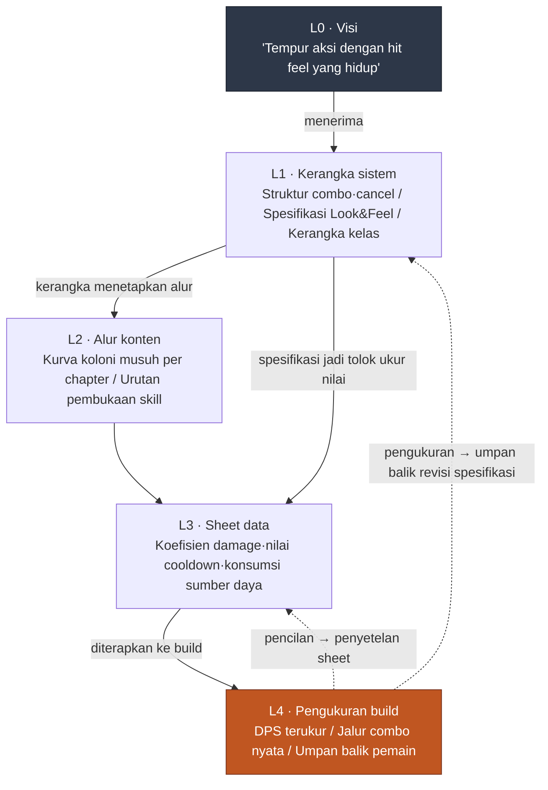

# 4.1 Combat Designer dan Layer — Di Kotak Mana Hit Feel Diletakkan

> **Tujuan pembelajaran bab ini** (tingkat kesulitan 🟡 praktis · prasyarat: aritmetika dasar·kalkulasi tabel): Anda akan mampu menguraikan kata sifat abstrak seperti hit feel (rasa pukulan) menjadi sinyal yang dapat diukur, dan menentukan secara koordinat di kotak Layer mana lima keluaran seorang combat designer diletakkan.

Ruang rapat build. Programmer menampilkan skill baru yang baru saja ia pasang di monitor. Karakter mengayunkan pedang, musuh terdorong ke belakang. Lima orang sedang menyaksikan. Salah seorang berkata.

"Hmm… hit feel-nya kok terasa agak lemah ya."

Orang di sebelahnya mengangguk. "Iya, agak hambar."

Programmer bertanya. "Bagian mana yang harus saya ubah dan bagaimana?"

Hening. Tak satu pun dari lima orang di ruang rapat itu bisa menjawab pertanyaan tersebut dengan angka. "Hit feel-nya lemah" memang dirasakan oleh kelima orang, tetapi tak ada yang bisa berkata "hitstop dari 3 frame ke 5 frame." Rapat berlangsung 40 menit, saling melempar kata sifat seperti "lebih berat lagi", "impact-nya kurang", lalu berakhir dengan "kita lihat lagi di build berikutnya saja."

Adegan ini memadatkan seluruh persoalan combat design. Ini adalah bidang yang paling langsung dirasakan pemain, tetapi begitu rasa itu coba dituangkan ke dalam kata-kata, yang tersisa hanyalah kata sifat. Kata sifat tidak bisa diukur, dan yang tidak bisa diukur tidak bisa disetel. Tugas pertama seorang combat designer adalah menarik kata sifat ini turun menjadi angka.

Bab ini menetapkan di kotak mana angka itu diletakkan. Lima keluaran yang dibuat seorang combat designer masing-masing diletakkan di mana pada Layer, dan mengapa koordinat itu menjadi prasyarat bagi otomatisasi. Alat praktis pada 4.2·4.3·4.4 bergerak di atas koordinat ini.

> **Satu baris untuk pembaca nonteknis.** Anda tidak perlu menghafal nilai tempur atau satuan frame di bagian ini. Satu hal yang perlu Anda bawa pulang hanyalah ini — **"Permintaan yang dipertukarkan dengan kata sifat tidak bisa diukur maupun disetel."** Gagasan bahwa kolaborasi mulai berjalan begitu "lebih berat lagi" ditarik turun menjadi "apa, sebanyak berapa" berlaku sama persis pada umpan balik kabur di jabatan mana pun di luar game. Lima keluaran pada 4.1.1 cukup dibaca sekilas; Anda boleh melaju cukup dengan menggenggam satu hal ini saja.

---

## 4.1.1 Lima Hal di Atas Meja Seorang Combat Designer

Jika keluaran yang menjadi tanggung jawab combat designer diringkas dalam satu baris, itu adalah "seluruh proses ketika input pemain diubah menjadi aksi di layar." Ini dipecah menjadi lima bongkah.

**Pertama, spesifikasi Look & Feel tempur.** Dokumen yang menerjemahkan hal abstrak seperti hit feel·responsivitas·rasa berat menjadi nilai yang dapat diukur. Ini adalah keluaran tersulit di bidang ini sekaligus menjadi tolok ukur untuk menilai empat keluaran lainnya.

Look & Feel kembali diuraikan menjadi empat sinyal.

- **Hit timing** — berapa ms dari saat tombol input ditekan hingga reaksi visual·auditori muncul di layar
- **Hitstop** — berapa frame layar membeku pada saat pukulan mengenai sasaran (umumnya 1\~6 frame)
- **Camera shake** — amplitudo·durasi·kurva peluruhan
- **Sinkronisasi efek** — apakah reaksi VFX·SFX·UI terpicu pada frame yang sama

Tanpa spesifikasi ini, adegan ruang rapat itu terulang. Jika spesifikasinya ada, keluarlah instruksi penyetelan seperti "hitstop 3→5 frame, amplitudo camera shake +20%."

**Kedua, sistem skill·combo·cancel.** Aturan ketika input diubah menjadi aksi.

- Alur penggunaan skill: input → casting → aktivasi → recovery
- Aturan combo: skill mana yang menyambung setelah skill mana, dan apa bonusnya
- Aturan cancel: dari aksi mana ke aksi mana bisa di-cancel
- Input queue: berapa lebar jendela (ms) untuk menerima input berikutnya di tengah aksi

**Ketiga, AI karakter·monster.** Logika perilaku NPC — Behavior Tree (Behavior Tree, selanjutnya BT), state machine (FSM (Finite State Machine, mesin status berhingga)/HFSM), tabel keputusan. Pola perilaku monster, transisi fase bos, kerja sama NPC pendamping, dan simulasi gerombolan masuk di sini.

**Keempat, rumus damage·sumber daya·cooldown.** Matematika ketika pilihan pemain diubah menjadi hasil. Koefisien damage·pengurangan pertahanan·kritikal·koreksi atribut, kurva konsumsi·pemulihan sumber daya (MP/tenaga/stamina), distribusi cooldown.

**Kelima, spesifikasi kontrol animasi.** Cetak biru yang menentukan bagaimana intent desain tampil di build sebenarnya — graf animasi·BT·penyambungan IK. Ini biasanya kolaborasi dengan programmer·animator, tetapi jika designer tidak menyediakan spesifikasi intent, intent itu rusak di build. Kalau hanya melempar material tanpa memberi cetak biru, rumah yang lain yang akan dibangun.

Inti di sini adalah **kelima hal itu bertemu di atas meja yang sama.** Jika aturan combo (kedua) berubah, DPS pada rumus damage (keempat) ikut berbeda, dan itu kembali mengubah rasa berat yang dirasakan pada Look & Feel (pertama). Jika tidak dinyatakan secara eksplisit keluaran mana yang menjadi input keluaran mana, satu perubahan akan menggoyang lima tempat. Karena itulah koordinat dibutuhkan.

---

## 4.1.2 Di Kotak Mana Lima Keluaran Diletakkan pada Layer

Di atas koordinat L0\~L4 yang ditetapkan pada 2.3, kita letakkan lima keluaran tempur. Pemetaan ini adalah tulang punggung bab ini.



Jika dirangkum kembali dalam tabel, hasilnya seperti ini.

| Layer | Keluaran combat design | Frekuensi perubahan |
|---|---|---|
| L0 | (menerima — visi: "Tempur aksi dengan hit feel yang hidup") | Hampir tetap |
| L1 | Struktur combo·cancel / Spesifikasi Look & Feel / Kerangka kelas | Lambat |
| L2 | Kurva progres koloni musuh per chapter / Alur pembukaan skill | Sedang |
| L3 | Sheet koefisien damage skill, nilai cooldown, konsumsi sumber daya | Cepat |
| L4 | DPS terukur build, jalur combo yang nyata-nyata mungkin, umpan balik pemain | Tiap build |

Ciri khas combat design adalah **bobot L4 lebih besar dibanding bidang lain.** Pada desain skenario, spesifikasi L1 hampir langsung menjadi versi final, tetapi tempur berbeda. "Hit feel-nya bagus" adalah wilayah yang baru bisa diketahui dengan memukul langsung dengan tangan di build dan melihat layar. Sekalipun ditulis "hitstop 5 frame" di spesifikasi, apakah itu benar-benar terasa berat hanya terkonfirmasi di L4. Karena itu, alat simulasi dan pengukuran otomatis menciptakan nilai terbesar di bidang ini (4.4).

Namun, bobot L4 yang besar bukan berarti L1 kurang penting. Lihatlah panah garis putus-putus. Nilai pengukuran L4 diumpan balik ke spesifikasi L1. Tanpa spesifikasi, nilai pengukuran kehilangan "tolok ukur untuk dibandingkan." Spesifikasi 5 frame harus ada agar muncul diagnosis "terukur 4 frame, 1 frame hilang." Siklus spesifikasi → build → pengukuran → revisi spesifikasi melewati kelima Layer. Combat designer adalah posisi yang meletakkan tangannya pada seluruh siklus ini, posisi tempat Layer terbanyak berputar serentak di satu meja.

---

## 4.1.3 Kata Sifat Menjadi Angka — Satu Tulang Punggung Pekerjaan Nyata

Pembahasan abstrak sampai di sini. Sekarang kita kembali ke adegan ruang rapat dan melihat proses menarik "hit feel-nya lemah" turun menjadi angka secara nyata, melalui worked transcript (rekaman sesi nyata). Alatnya hanya satu LLM. Keluaran tidak dirapikan, dan bagian yang ditolak manusia pun dibiarkan apa adanya.

Saya merekonstruksi alur nyata ketika men-spesifikasi-kan Look & Feel sebuah skill jarak dekat baru, di TF tempur sebuah proyek MMORPG yang saya jalankan sebagai director (selanjutnya "Proyek A").

### Prompt (lengkap)

```
Ubah Look & Feel skill ini dari kata sifat menjadi nilai ms·frame.
Lima item: hit timing, hitstop, camera shake, sinkronisasi efek, recovery.
Yang tidak yakin, tuliskan "perlu diverifikasi di game ini".

Skill: tebasan vertikal greatsword (heavy_overhead_slash)
Intent: "menebas turun dengan berat, dan musuh terasa terhuyung"
Frame rate: 60fps
```

### Keluaran mentah Claude (tidak diringkas·dirapikan)

> "Rasa berat" tebasan vertikal greatsword terutama dibentuk oleh **panjang hitstop dan recovery**, serta **peluruhan camera shake**. Saya sajikan per item.
>
> **1) Hit timing.** Semakin berat senjatanya, startup dari input→aktivasi harus semakin panjang agar rasa berat itu hidup. Disarankan **50\~80ms** (3\~5 frame) dari input hingga reaksi visual pertama (karakter mulai mengangkat pedang). Namun, reaksi *visual* pertama dan reaksi *pukulan* pertama itu berbeda. Hingga pukulan mengenai sasaran bergantung pada panjang motion, jadi tidak bisa dipastikan di sini — **perlu diverifikasi dengan panjang motion game ini**.
>
> **2) Hitstop.** Variabel kunci dari satu pukulan yang berat. Jika serangan ringan adalah 1\~2 frame, maka tebasan vertikal greatsword disarankan **4\~6 frame** (sekitar 67\~100ms). Jika melewati 6 frame, "berat" beralih menjadi "tersendat" dan responsivitas memburuk.
>
> **3) Camera shake.** Amplitudo sekitar 1\~2% dari tinggi layar, durasi 0.2\~0.3 detik, peluruhan **ease-out (melemah dengan cepat)** ketimbang linear. Untuk satu pukulan berat, kurva yang getaran pertamanya kuat lalu mereda dengan cepat terasa wajar.
>
> **4) Sinkronisasi efek.** VFX (efek pukulan)·SFX (suara pukulan)·hitstop **harus dipicu secara identik pada frame mengenai sasaran**. Selisih 1\~2 frame saja sudah terasa sebagai "hambar". Reaksi UI (angka damage) boleh terlambat 1\~2 frame.
>
> **5) Recovery.** Sebagai harga dari rasa berat, recovery menjadi panjang. Disarankan **20\~30 frame** (333\~500ms) dari mengenai sasaran hingga kembali bisa terkena serangan. Namun nilai ini sangat berubah-ubah tergantung tempo tempur game secara keseluruhan (aksi cepat vs jenis soul yang berat dan serius) — **perlu diverifikasi pada tempo acuan game ini**.
>
> Jika dirangkum, "rasa berat = startup panjang + hitstop 4\~6 frame + shake ease-out + VFX/SFX/stop pada frame yang sama + recovery panjang." Namun angka di atas adalah rentang rekomendasi umum, dan **rasa berat sebenarnya baru terpastikan setelah dipukul langsung dengan tangan di build dan disetel.**

### Verifikasi·Penolakan·Permintaan Ulang dari Manusia

Di sini designer tidak mengadopsi keluaran secara utuh. Ia berhenti di dua tempat.

**Penolakan 1 — amplitudo camera shake "1\~2% tinggi layar".** Game ini mengutamakan mobile. Di layar kecil, 1\~2% nyaris tidak terlihat. Ada juga isu mabuk gerak (motion sickness) di mobile. Designer menolak nilai rekomendasi ini dan menerapkan prinsipnya sendiri: "di mobile, alih-alih shake, rasa berat diekspresikan dengan penekanan hitstop." LLM hanya memberi teori umum; ia tidak tahu kendala platform game ini.

**Penangguhan 2 — hitstop "4\~6 frame".** Ini bukan penolakan melainkan penangguhan. Sebagai rentang sudah benar, tetapi nilai persisnya ditetapkan dengan rasa tangan di build. Di spesifikasi ditulis "masukkan 4 frame sebagai nilai default ke build, lalu buat varian 5·6 frame dan bandingkan ketiganya dengan tangan."

Permintaan ulang dikirim seperti ini.

```
Ini proyek yang mengutamakan mobile. Minimalkan camera shake, dan
tulis ulang spesifikasi ke arah mengekspresikan rasa berat dengan
hitstop·recovery·SFX.
Untuk hitstop, buat tabel tiga varian 4/5/6 frame untuk perbandingan build.
```

Pada keluaran kedua ini, LLM membuat tabel spesifikasi yang mencerminkan kendala mobile. Tabel itu masuk ke build, dan pada rapat build berikutnya designer berkata, alih-alih kata sifat, "varian 4 frame terlalu ringan, adopsi 5 frame." Rapat 40 menit menyusut menjadi keputusan 5 menit.

### Apa yang Ditunjukkan Transcript Ini

Ada tiga hal. Pertama, LLM membuat dengan baik **draf pertama yang menarik kata sifat turun menjadi rentang angka** — inilah yang memecah keheningan ruang rapat. Kedua, LLM **tidak tahu kendala game ini (mobile·tempo·panjang motion)** — karena itu ia hanya memberi nilai rekomendasi umum, dan penolakan·penyetelan adalah bagian manusia. Ketiga, LLM sendiri menegaskan dua kali "baru terpastikan setelah dipukul langsung dengan tangan di build" — bahkan alat itu tahu bahwa penilaian akhir atas rasa berat ada di tangan manusia di L4.

---

## 4.1.4 Empat Tempat AI Memulihkan Nilai Adopsinya

Transcript di atas hanya menunjukkan satu tempat (spesifikasi). Di seluruh combat design, tempat AI menciptakan nilai ada empat.

**1) Simulasi — nilai terbesar.** Menghitung di muka kurva DPS (Damage Per Second, damage per detik)·jalur combo·konsumsi sumber daya tanpa build. Jauh lebih cepat ketimbang membuat build lalu mengukur dengan tangan. Pada 4.4 ditangani langsung dengan simulator `simulate_dps`.

**2) Pembangkitan otomatis state machine·BT.** Mengubah penjelasan bahasa alami seperti "bos ini berubah brutal di bawah 50% HP, dan saat brutal ia memakai pola 3 pukulan beruntun" menjadi diagram BT/FSM. Akurasinya tinggi — struktur aturan adalah wilayah yang ditangani LLM dengan baik. Waktu untuk memindahkan logika dari kepala ke gambar pun hemat.

**3) Analisis otomatis tangkapan build.** Mengekstrak secara otomatis hit timing·tingkat keberhasilan combo·distribusi damage dari rekaman gameplay. Namun, ini adalah **tempat dengan tingkat kesulitan implementasi tertinggi** (di bawah kita timbang dengan jujur).

**4) Usulan kandidat penyetelan balance.** Menganalisis tiap baris sheet data untuk mendeteksi pencilan·ketidakmulusan kurva, lalu mengajukan kandidat penyetelan. Manusia hanya memilih.

Di antara empat tempat ini, analisis otomatis tangkapan build (3) memiliki jarak terjauh antara "bisa dilakukan" dan "bisa dilakukan dengan mudah." Di buku-buku sering ditulis "AI mengekstrak otomatis semuanya dari video", tetapi pada kenyataannya tidak sesederhana itu. Computer vision berbasis piksel video, vision API jadi, log telemetry dalam game — perbandingan akurasi·beban implementasi ketiga metode tangkapan ini, **karena 4.4 adalah rujukan resminya, silakan rujuk ke sana**. Di sini hanya kesimpulan yang ditegaskan.

Jalur yang paling realistis adalah **log telemetry dalam game**. Buat engine langsung mencatat event seperti "pada frame 1204 skill_overhead mengenai sasaran, damage 340, hitungan combo 3." Ini akurat karena merupakan data sumber, dan selesai dengan sekali menyisipkan kode logging. LLM dipakai untuk membaca log itu dan meringkasnya menjadi laporan bahasa alami ("hingga combo 3 efisiensi sumber daya bagus, tetapi mulai combo 4 anjlok drastis"). Video disisakan sebagai pendukung di mana manusia hanya memeriksa kasus yang mencurigakan dengan mata.

Artinya, bentuk realistis dari visi "AI menganalisis video secara otomatis" adalah **log telemetry + ringkasan LLM**, bukan vision piksel. Pembedaan yang jujur ini adalah titik awal pemilihan alat pada 4.4.

Dan ada satu hal yang tidak berubah di keempat tempat. **Penilaian akhir atas "hit feel-nya bagus" tidak bisa dilakukan AI.** Itu adalah wilayah emosi pemain, dan tanggung jawab atas emosi itu diambil manusia. AI hanya membuat dengan cepat **materi dasar** bagi penilaian emosi itu. Nilai simulasi, diagram BT, laporan telemetry — semuanya adalah bahan agar manusia mengambil keputusan dengan rasa tangan.

---

## 4.1.5 Alasan Sebenarnya Membagi Koordinat — Prasyarat Otomatisasi

Sejauh ini adalah alasan permukaan: "jika keluaran dibagi ke dalam Layer, komunikasi saat berkolaborasi menjadi nyambung." Aturan combo diletakkan di L1 dan sheet damage di L3 dijelaskan karena frekuensi perubahannya berbeda. Itu benar, tetapi bukan itu seluruhnya.

Alasan esensial membagi koordinat adalah **karena otomatisasi hanya bekerja di atasnya**. Tesis umum bahwa penguraian Layer adalah prasyarat procedural generation·otomatisasi sudah dibahas pada 2.3, jadi di sini kita persempit ke bagaimana prasyarat itu menentukan nasib tiga otomatisasi di bidang tempur.

**Pertama, simulasi baru berputar jika "apa yang menjadi input dan apa yang bisa diubah" terpisah.** Jika core deterministik (fisika·hitbox — kerangka L1) dan spesifikasi yang dapat diubah (nilai damage·cooldown — sheet L3) bercampur, simulator tidak bisa mendefinisikan "ruang kandidat perubahan". Core tetap, sheet variabel — pemisahan ini harus ada agar `simulate_dps` melakukan eksplorasi seperti "naikkan koefisien damage dari 280 hingga 340 dengan kelipatan 20 lalu gambarkan kurva DPS".

**Kedua, analisis otomatis tangkapan build baru bermakna jika action atom dilabeli.** Harus ada atom yang dilabeli pada tataran spesifikasi sebagai "interval frame ini adalah fase hit dari `skill_overhead`", agar sinyal yang diekstrak dari log telemetry bisa dibandingkan otomatis dengan spesifikasi. Tanpa label, log hanyalah deretan titik tak bermakna berupa "ada sesuatu yang mengenai sasaran pada frame 1204".

**Ketiga, pembangkitan urutan combo oleh LLM baru bekerja jika aturan cancel·input queue terpisah ke dokumen eksternal.** Permintaan terbatas seperti "usulkan 10 urutan 5-combo dalam 7 pasangan yang bisa di-cancel dari karakter ini dan input queue 200ms" hanya mungkin ketika aturan cancel tidak dipaku ke dalam kode melainkan tertuang sebagai dokumen.

Ketiga hal itu mengucapkan satu kalimat yang sama. **Jika core deterministik bercampur dengan spesifikasi, otomatisasi tersumbat; jika terpisah, otomatisasi terbuka.** Penguraian Layer berpurposekan permukaan menyeragamkan bahasa kolaborasi, sedangkan purpose esensialnya adalah memasang prasyarat bagi simulasi otomatis·analisis tangkapan·eksplorasi urutan LLM.

### Dari Penerapan Konservatif ke Penerapan Progresif

Begitu prasyarat ini terpasang, operasional tempur berevolusi dalam dua tahap.

**Penerapan konservatif — manusia merancang, otomatis memverifikasi.** Sekarang sebagian besar operasional tempur aksi·MMORPG ada di sini. Jika manusia menulis sendiri spesifikasi combo·cancel, otomatis menyimulasikan DPS·sumber daya dan menangkapnya dengan telemetry untuk mengeluarkan laporan perbandingan "spesifikasi vs pengukuran". Manusia menafsirkan selisih itu untuk memutuskan revisi spesifikasi, lalu siklus berputar lagi ke penulisan spesifikasi. Perancangan oleh manusia, simulasi·tangkapan·perbandingan oleh otomatis.

**Penerapan progresif — AI mengajukan kandidat, manusia hanya mengadopsi.** Ini tahap berikutnya. AI menyebutkan otomatis 10\~30 urutan dalam pasangan cancel dan input queue, otomatis menyimulasikan secara paralel DPS·sumber daya tiap urutan, dan LLM menempelkan peringkat·tafsir seperti "efisiensi sumber daya peringkat 1, kesulitan input sedang". Keputusan yang tersisa di tangan manusia hanyalah satu, "urutan mana di antara kandidat yang diadopsi sebagai signature", plus keputusan director soal penerapan build·motion capture. Membuat urutan dari nol dan memilih dari 30 adalah beban kerja yang berbeda dimensi.

Agar penerapan progresif tertanam, tiga hal harus tersedia. (1) Infrastruktur simulasi deterministik yang menghitung DPS·sumber daya·waktu bertahan dalam 1 detik tanpa build, (2) action atom dengan combo·cancel·input queue yang terpisah·terlabel ke dokumen eksternal, (3) analisis otomatis tangkapan berbasis telemetry. Ketiganya sama-sama merupakan hasil langsung dari penguraian Layer yang disebut di atas.

### Motion Capture adalah Tahap Tidak Dapat Dibalik — Decision Gate

Terakhir, soal keterbalikan. Dalam siklus tinjauan seorang combat designer tercampur tahap yang dapat dibalik dan yang tidak, dan mengetahui batasnya itu penting.

<svg viewBox="0 0 720 230" xmlns="http://www.w3.org/2000/svg" font-family="sans-serif">
  <rect x="0" y="0" width="720" height="230" fill="#fbfbfb"/>
  <text x="20" y="30" font-size="15" font-weight="bold" fill="#1a202c">Dapat dibalik ──────────────────▶ Decision Gate ──────▶ Tidak dapat dibalik</text>

  <!-- 가역 단계 박스들 -->
  <rect x="20" y="55" width="150" height="44" rx="6" fill="#c6f6d5" stroke="#2f855a"/>
  <text x="95" y="78" font-size="12" text-anchor="middle" fill="#22543d">Revisi spesifikasi</text>
  <text x="95" y="93" font-size="12" text-anchor="middle" fill="#22543d">combo·cancel</text>

  <rect x="20" y="110" width="150" height="44" rx="6" fill="#c6f6d5" stroke="#2f855a"/>
  <text x="95" y="133" font-size="12" text-anchor="middle" fill="#22543d">Jalankan simul·laporan</text>
  <text x="95" y="148" font-size="11" text-anchor="middle" fill="#22543d">(bebas buang hasil)</text>

  <rect x="20" y="165" width="150" height="44" rx="6" fill="#c6f6d5" stroke="#2f855a"/>
  <text x="95" y="188" font-size="12" text-anchor="middle" fill="#22543d">Sheet data</text>
  <text x="95" y="203" font-size="12" text-anchor="middle" fill="#22543d">penyetelan nilai</text>

  <!-- 부분 가역 -->
  <rect x="220" y="110" width="160" height="44" rx="6" fill="#feebc8" stroke="#c05621"/>
  <text x="300" y="133" font-size="12" text-anchor="middle" fill="#7b341e">Penerapan build (dev)</text>
  <text x="300" y="148" font-size="11" text-anchor="middle" fill="#7b341e">Sebagian dapat dibalik</text>

  <!-- 게이트 -->
  <line x1="430" y1="40" x2="430" y2="215" stroke="#e53e3e" stroke-width="2.5" stroke-dasharray="6 4"/>
  <text x="430" y="225" font-size="12" text-anchor="middle" fill="#e53e3e" font-weight="bold">Decision Gate</text>

  <!-- 비가역 -->
  <rect x="480" y="80" width="210" height="48" rx="6" fill="#fed7d7" stroke="#c53030"/>
  <text x="585" y="103" font-size="12" text-anchor="middle" fill="#742a2a">Motion capture (aksi signature)</text>
  <text x="585" y="119" font-size="11" text-anchor="middle" fill="#742a2a">Biaya studio capture·aktor·syuting ulang</text>

  <rect x="480" y="140" width="210" height="48" rx="6" fill="#fed7d7" stroke="#c53030"/>
  <text x="585" y="163" font-size="12" text-anchor="middle" fill="#742a2a">Penerapan build (live)</text>
  <text x="585" y="179" font-size="11" text-anchor="middle" fill="#742a2a">Biaya hotfix·perubahan persepsi pengguna</text>
</svg>

Motion capture adalah tahap tidak dapat dibalik yang paling tebal dalam tempur. Jadwal studio capture, perekrutan aktor, biaya syuting ulang semuanya besar. Karena itu, motion capture aksi signature **hanya dijalankan setelah simulasi·analisis otomatis tangkapan berputar cukup baik sehingga urutannya terpastikan**. Konservatif maupun progresif, motion capture dan tepat sebelum build live diletakkan sebagai decision gate. Semua tinjauan seorang combat designer harus berakhir di tahap yang dapat dibalik di sisi kiri gate ini agar aman.

---

## 4.1.6 Pemandangan di Perusahaan — Apa yang Berkurang

Ini adalah perubahan yang diukur TF tempur Proyek A selama mengoperasikan koordinat dan alat di atas selama 6 bulan. Nilai di bawah adalah rata-rata kasar yang diambil dari catatan operasional TF, dan akan lebih akurat dibaca sebagai **arah perubahan yang dirasakan**, bukan sebagai nilai pengukuran presisi.

| Item | Sebelum adopsi | Setelah adopsi |
|---|---|---|
| Waktu rapat Look & Feel | rata-rata 2 jam (diskusi subjektif) | rata-rata 30 menit (berbasis nilai terukur) |
| Pembuatan diagram combo | 1\~2 jam/set skill | 10 menit/set skill |
| Verifikasi kurva DPS | pengukuran manual pasca-build (≈1 hari) | simulasi (≈10 menit) |
| Penyetelan balance skill baru | 3\~4 siklus build | 1\~2 siklus build |

Yang lebih inti dari angka itu sendiri adalah arahnya. Keempat item sama-sama berpindah dari "diskusi subjektif·pengukuran manual·pengulangan build" ke "otomatisasi nilai terukur·simul·diagram". Di ruang rapat, kata sifat berkurang dan angka bertambah. Itulah satu kalimat yang ingin disampaikan seluruh bab ini — pekerjaan seorang combat designer adalah memasang jembatan yang berpindah dari subjektivitas (hit feel·keseruan) ke objektivitas (nilai·simulasi), dan AI adalah alat yang memasang jembatan itu dengan cepat. Di ujung jembatan, tangan yang memutuskan "ini berat" tetaplah milik manusia.

---

## Poin-Poin Penting

- Combat design adalah posisi tempat Layer terbanyak berputar serentak di satu meja, dari spesifikasi L1, sheet L3, hingga pengukuran build L4.
- Penguraian Layer berpermukaan menyeragamkan bahasa kolaborasi, tetapi esensinya adalah prasyarat otomatisasi berupa simulasi·tangkapan·eksplorasi LLM.
- Penilaian akhir atas "hit feel-nya bagus" adalah bagian manusia, dan AI membuat dengan cepat materi dasar bagi penilaian itu.

---

## Coba Sendiri — Menarik Kata Sifat Turun Menjadi Angka

**setup.** Satu LLM saja cukup. Pilihlah satu skill yang ada di tangan Anda (baru maupun lama). Tuliskan intent skill itu dalam satu baris kata sifat — seperti "berat", "gesit", "tumpul-berat".

**prompt.** Isilah kerangka di bawah dengan informasi skill.

```
Kamu adalah asisten combat design. Ubahlah Look & Feel skill di bawah
menjadi "spesifikasi nilai yang dapat diukur". Bukan kata sifat, melainkan
satuan ms·frame·%.
Untuk item yang tidak yakin, nyatakan "perlu diverifikasi di game ini".

Skill: [nama]
Intent: "[satu baris kata sifat]"
Frame rate: [60fps dll]
Item: 1)hit timing 2)hitstop 3)camera shake 4)sinkronisasi efek 5)recovery
```

**verify.** Lemparkan dua pertanyaan pada setiap angka di keluaran. (1) Apakah nilai ini tepat di bawah kendala game ini (platform·tempo·panjang motion)? → Kalau tidak tepat, beri tahu kendalanya dan minta ulang. (2) Apakah nilai ini harus dipastikan dengan tangan di build? → Kalau ya, alih-alih nilai tunggal, tulis 2\~3 varian di spesifikasi lalu bandingkan di build. Item yang ditegaskan LLM sebagai "perlu diverifikasi" jangan sekali-kali diadopsi apa adanya.

## 4.1.7 Versi Ringkas Solo

Kalau game yang Anda buat sendirian, Anda tidak perlu melengkapi seluruh lima keluaran·lima Layer. Lakukan minimal dua hal saja. **Satu, spesifikasi Look & Feel satu halaman** — untuk 3\~5 aksi inti, tulis hitstop·recovery·sinkronisasi saja dalam angka. Memo yang ditulis dengan kata sifat tidak akan dikenali pun oleh diri Anda sendiri 6 bulan kemudian. **Dua, pisahkan combo·cancel dari kode menjadi satu file** — kalau pasangan cancel Anda keluarkan menjadi data, nanti Anda bisa menyuruh LLM "usulkan 5 combo yang bisa dibuat dengan pasangan ini." Kedua hal ini adalah koordinat minimal yang membiarkan pintu otomatisasi tetap terbuka bahkan di pengembangan solo.
