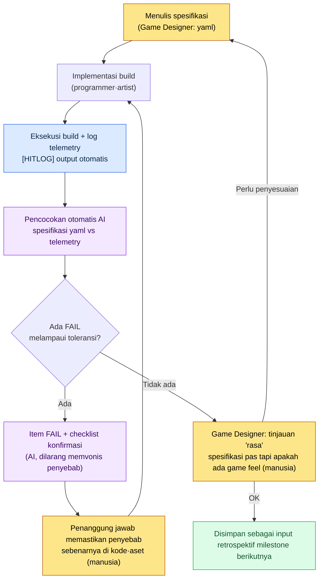

# 4.2 Look & Feel Pertarungan — Tempat Menangkap Game Feel dengan Data

Lima orang berkumpul di depan monitor ruang rapat. Build yang sama, skill yang sama, klip 30 detik yang sama sedang diputar ulang untuk ketiga kalinya di layar. Programmer client yang pertama membuka suara. "Buat saya sih oke." Penanggung jawab art melipat tangan. "Lemah. Rasanya ada yang kurang." Game Designer di sebelahnya menyela. "Efeknya bagus, tapi enggak nempel di tangan." Direktur memandang lama, lalu mengambil keputusan. "Hmm… kita buat sedikit lebih berbobot ya."

Lalu rapat selesai. 'Sedikit lebih berbobot' itu tepatnya berapa ms dan berapa frame, tidak ada yang mencatatnya. Di build berikutnya programmer mengimplementasikan 'rasa berbobot' versi pemahamannya sendiri, dan art menempelkan 'rasa berbobot' versi pemahamannya sendiri. Lalu minggu depan, di ruang rapat yang sama, sambil menonton klip yang sama, percakapan yang sama berulang lagi.

Game feel, sensasi di tangan, Look & Feel. Inilah kata yang paling sering dipakai sekaligus paling tidak terdefinisi dalam desain pertarungan. Semua orang yakin mereka paham, tetapi definisi di kepala masing-masing berbeda-beda, sehingga setelah diskusi selesai, tidak ada yang tersisa. Bab ini membahas pekerjaan memecah 'rasa' itu menjadi angka yang dapat diukur. Inilah tempat menarik turun game feel dari ranah abstrak menjadi data.

---

## 4.2.1 Pertarungan = Look & Feel, Sistem = Cara Kerja

Pertama-tama saya akan menarik batasnya lebih dahulu. Desain pertarungan terbagi menjadi dua cabang besar.

- **Sistem pertarungan**: bagaimana ia bekerja. Rumus damage, cooldown, akumulasi stack, aturan status effect. Ini ranah bab berikutnya (4.3 Combo·Cancel, 4.4 Simulasi AI).
- **Look & Feel pertarungan**: bagaimana ia terasa. Setelah tombol ditekan, kapan layar bereaksi, seberapa lama layar berhenti pada momen tepat sasaran, apakah efek, suara, dan getaran meletus pada momen yang sama.

Bab ini hanya membahas yang kedua. Apakah damage-nya 100 atau 120, tidak berhubungan langsung dengan game feel. Bagaimana pemain merasakan 'momen masuknya' damage 100 itulah yang disebut game feel. Dengan rumus damage yang sama pun, bila timing hit dan hit stop-nya berbeda, game-nya akan terasa benar-benar berbeda.

Pertama, ada hal yang ingin saya tegaskan secara jujur. Game feel tidak selesai hanya dengan tiga angka. Kurva akselerasi·deselerasi dari motion serangan (animasi), reaksi pihak yang terkena (hit reaction·stagger), hingga deformasi (déformer — ekspresi afterimage·distorsi yang melebih-lebihkan karakter dengan meregangkan dan memenyekkannya pada momen pukulan) yang gemar dipakai game action Jepang era 80\~90-an — semuanya harus berkumpul agar sensasi "kena" berdiri sebagai satu kesatuan. **Yang dipusatkan bab ini untuk ditarik turun menjadi angka yang dapat diukur** adalah tiga sumbu di antaranya. Motion·reaction·deformasi adalah ranah yang lebih banyak disentuh tangan animator·artist, sehingga dibahas di bab-bab berikutnya dan di bagian art; di sini saya menaruh bobot pada tiga sumbu yang dapat dikunci oleh Game Designer sebagai spesifikasi dan diverifikasi di build. Ketiga sumbu itu terbagi seperti ini.

<svg viewBox="0 0 720 250" xmlns="http://www.w3.org/2000/svg" font-family="sans-serif">
  <rect x="0" y="0" width="720" height="250" fill="#fafafa" stroke="#ddd"/>
  <text x="360" y="32" text-anchor="middle" font-size="17" font-weight="bold" fill="#222">Tiga sumbu yang dapat diukur (bukan keseluruhan game feel)</text>
  <!-- axis 1 -->
  <rect x="40" y="70" width="190" height="140" rx="8" fill="#e8f0fe" stroke="#4a76d4" stroke-width="2"/>
  <text x="135" y="100" text-anchor="middle" font-size="15" font-weight="bold" fill="#2a4a9a">Timing Hit</text>
  <text x="135" y="128" text-anchor="middle" font-size="12" fill="#444">input → reaksi</text>
  <text x="135" y="148" text-anchor="middle" font-size="12" fill="#444">kapan ia merespons</text>
  <text x="135" y="178" text-anchor="middle" font-size="13" font-weight="bold" fill="#2a4a9a">satuan: ms</text>
  <text x="135" y="198" text-anchor="middle" font-size="11" fill="#777">"apakah responsnya cepat"</text>
  <!-- axis 2 -->
  <rect x="265" y="70" width="190" height="140" rx="8" fill="#fde8e8" stroke="#d44a4a" stroke-width="2"/>
  <text x="360" y="100" text-anchor="middle" font-size="15" font-weight="bold" fill="#9a2a2a">Hit Stop</text>
  <text x="360" y="128" text-anchor="middle" font-size="12" fill="#444">momen tepat sasaran</text>
  <text x="360" y="148" text-anchor="middle" font-size="12" fill="#444">durasi menghentikan waktu</text>
  <text x="360" y="178" text-anchor="middle" font-size="13" font-weight="bold" fill="#9a2a2a">satuan: frame</text>
  <text x="360" y="198" text-anchor="middle" font-size="11" fill="#777">"apakah berbobot"</text>
  <!-- axis 3 -->
  <rect x="490" y="70" width="190" height="140" rx="8" fill="#e8f6ec" stroke="#3a9a5a" stroke-width="2"/>
  <text x="585" y="100" text-anchor="middle" font-size="15" font-weight="bold" fill="#1a6a3a">Sinkronisasi Efek</text>
  <text x="585" y="128" text-anchor="middle" font-size="12" fill="#444">VFX·SFX·UI·</text>
  <text x="585" y="148" text-anchor="middle" font-size="12" fill="#444">kamera·getaran</text>
  <text x="585" y="178" text-anchor="middle" font-size="13" font-weight="bold" fill="#1a6a3a">satuan: frame offset</text>
  <text x="585" y="198" text-anchor="middle" font-size="11" fill="#777">"apakah meletus sebagai satu peristiwa"</text>
  <!-- plus signs -->
  <text x="247" y="148" text-anchor="middle" font-size="26" fill="#999">+</text>
  <text x="472" y="148" text-anchor="middle" font-size="26" fill="#999">+</text>
  <text x="360" y="240" text-anchor="middle" font-size="12" fill="#666">Ketiganya adalah objek ukur — motion·hit reaction·deformasi adalah ranah art·animasi (terpisah)</text>
</svg>

Ketika seseorang di ruang rapat berkata "lemah", kelemahan itu berasal dari salah satu dari ketiganya. Apakah responsnya terlambat (timing), apakah tidak ada sensasi kena (hit stop), atau apakah semuanya bermain sendiri-sendiri (sinkronisasi)? Bila kita memecahnya menjadi tiga sumbu lalu bertanya, barulah 'lemah' menjadi kalimat yang dapat diperbaiki.

Namun penyebab 'lemah' tidak selalu hanya ada pada ketiga sumbu ini. Saya menjabarkan elemen-elemen pembentuk game feel tanpa terlewat, lalu menarik garis sampai sejauh mana bab ini bertanggung jawab.

| Komponen Look & Feel | Apa itu | Di bab ini |
|---|---|---|
| **Timing Hit** | ms dari input → reaksi pertama. Elemen yang paling pertama dicurigai | Ukur·spesifikasi (sumbu 1) |
| **Hit Stop** | Durasi menghentikan waktu pada momen tepat sasaran untuk memberi bobot | Ukur·spesifikasi (sumbu 2) |
| **Camera Shake** | Hentakan layar yang berguncang seiring pukulan | Ukur·spesifikasi (termasuk sumbu 3) |
| **Timing VFX·SFX** | Apakah efek dan suara tersinkron dengan frame hit | Ukur·spesifikasi (termasuk sumbu 3) |
| Motion serangan (animasi) | Akselerasi·deselerasi ayunan, kurva gerakan persiapan dan gerakan lanjutan | Disinggung (ranah art·animasi) |
| Hit reaction·stagger | Reaksi pihak yang terkena tersentak dan kaku sesaat | Disinggung (bab berikutnya·bagian art) |
| Deformasi | Pelebih-lebihan dengan meregangkan dan memenyekkan pada momen pukulan (afterimage·distorsi) | Disinggung (bagian art) |
| Getaran controller | Umpan balik fisik yang sampai ke tangan | Ukur·spesifikasi (termasuk sumbu 3) |

Keempat yang di atas terikat menjadi tiga sumbu bab ini dan menjadi objek pengukuran·spesifikasi, sedangkan ketiga yang di tengah (motion·reaction·deformasi) tidak boleh hilang namun merupakan ranah art·animasi yang sulit dikunci sendirian oleh Game Designer dengan angka, sehingga saya hanya menegaskan dengan jelas 'bahwa mereka ada'. Bila motion-nya kaku atau pihak yang terkena tetap berdiri tanpa goyah, game feel tidak akan hidup meski ketiga sumbu sudah pas semua.

---

## 4.2.2 Timing Hit — Dari Input sampai Reaksi

Ada alasan mengapa di antara tiga sumbu, timing yang pertama dibahas. Ketika pemain meragukan game feel, hal pertama yang tersangkut adalah sensasi 'reaksinya terlambat', dan sehebat apa pun yang lain, bila input-nya lamban, pada momen itu semuanya runtuh. Karena itu kita tangkap timing lebih dahulu.

Sumbu pertama game feel adalah waktu. Dari momen tombol ditekan (0ms) sampai momen layar pertama kali bereaksi, berapa ms yang dibutuhkan. Manusia luar biasa peka terhadap jeda ini. Selisih antara 60ms dan 120ms 'tidak bisa dijelaskan dengan kata-kata, tapi tangan tahu'.

Satu kali serangan bukanlah satu titik sederhana, melainkan beberapa peristiwa yang terbentang di atas sumbu waktu. Bila kita meletakkan 1 hit Basic Attack (serangan dasar) di atas sumbu waktu, bentuknya seperti ini.

<svg viewBox="0 0 720 270" xmlns="http://www.w3.org/2000/svg" font-family="sans-serif">
  <rect x="0" y="0" width="720" height="270" fill="#fafafa" stroke="#ddd"/>
  <text x="360" y="28" text-anchor="middle" font-size="16" font-weight="bold" fill="#222">1 Hit Basic Attack — sumbu waktu (warrior / skill_id 1001)</text>
  <!-- timeline axis -->
  <line x1="60" y1="220" x2="680" y2="220" stroke="#333" stroke-width="2"/>
  <!-- ticks: 0,100,150,250,350 ms mapped 60..680 over 0..380ms => scale (680-60)/380=1.63px/ms -->
  <g font-size="11" fill="#555">
    <line x1="60" y1="215" x2="60" y2="225" stroke="#333"/><text x="60" y="245" text-anchor="middle">0ms</text>
    <line x1="223" y1="215" x2="223" y2="225" stroke="#333"/><text x="223" y="245" text-anchor="middle">100</text>
    <line x1="305" y1="215" x2="305" y2="225" stroke="#333"/><text x="305" y="245" text-anchor="middle">150</text>
    <line x1="468" y1="215" x2="468" y2="225" stroke="#333"/><text x="468" y="245" text-anchor="middle">250</text>
    <line x1="631" y1="215" x2="631" y2="225" stroke="#333"/><text x="631" y="245" text-anchor="middle">350</text>
  </g>
  <!-- input -->
  <line x1="60" y1="60" x2="60" y2="220" stroke="#4a76d4" stroke-width="2" stroke-dasharray="4 3"/>
  <text x="62" y="55" font-size="11" fill="#2a4a9a">input(0)</text>
  <!-- casting motion bar 0..100 -->
  <rect x="60" y="70" width="163" height="20" rx="4" fill="#c9d8f5" stroke="#4a76d4"/>
  <text x="141" y="84" text-anchor="middle" font-size="11" fill="#2a4a9a">motion casting 0~100</text>
  <!-- hitbox 100..150 -->
  <rect x="223" y="98" width="82" height="20" rx="4" fill="#f5d6c9" stroke="#d4764a"/>
  <text x="264" y="112" text-anchor="middle" font-size="10" fill="#9a4a2a">hitbox 100~150</text>
  <!-- vfx 100..250 -->
  <rect x="223" y="126" width="245" height="20" rx="4" fill="#d6e8d9" stroke="#3a9a5a"/>
  <text x="345" y="140" text-anchor="middle" font-size="11" fill="#1a6a3a">efek visual 100~250 (fade setelah jeda 50ms)</text>
  <!-- damage at 110 -->
  <line x1="76" y1="154" x2="76" y2="172" stroke="#d44a4a" stroke-width="0"/>
  <circle cx="239" cy="164" r="6" fill="#d44a4a"/>
  <text x="248" y="168" font-size="10" fill="#9a2a2a">damage diterapkan 110 (10ms setelah visual → praktis dipersepsi bersamaan)</text>
  <!-- afterdelay 150..350 -->
  <rect x="305" y="182" width="326" height="18" rx="4" fill="#eee" stroke="#aaa"/>
  <text x="468" y="195" text-anchor="middle" font-size="10" fill="#777">after-delay 150~350 (sampai menerima input berikutnya)</text>
</svg>

Angka terpenting dalam gambar ini adalah '100ms saat hitbox pertama kali menyala'. Artinya, 100ms setelah tombol ditekan, deteksi serangan dimulai. Nilai inilah yang menentukan kecepatan game feel yang dirasakan.

Rentang yang dianjurkan berbeda menurut genre·karakter, tetapi ada garis acuan kasar.

| Jenis | Anjuran input→reaksi | Catatan |
|---|---|---|
| Reaksi instan (serangan ringan) | 60\~120ms | Rentang inti dari rasa 'nempel' di tangan |
| Reaksi berat (skill besar) | 200\~400ms | Pre-delay yang disengaja demi rasa berbobot |
| Charging (isi ulang panjang) | 500\~2000ms | Penantian yang disengaja, ditangani terpisah |

Rentang ini bukan acuan mutlak. Sebagai **perkiraan penulis (belum terverifikasi)**, mobile kasual cenderung bergeser ±50ms ke arah input yang lebih longgar, sedangkan konsol fighting cenderung dikencangkan lebih ketat. Yang inti bukan angkanya sendiri, melainkan tim berbagi garis acuan 'serangan ringan game kita, kita sepakati di 90ms'. Garis acuan harus ada agar kita bisa berkata 'benar/salah' setelah melihat build.

Namun di sini ada satu jebakan. Mata manusia tidak bisa membedakan 90ms dan 110ms. Pada 60fps, 1 frame kira-kira 16.67ms, dan selisih 20ms ini hanya sekitar satu frame. Apakah ucapan "kok rasanya agak lambat ya?" di ruang rapat benar atau salah, dengan mata akhirnya tidak bisa diputuskan. Karena itu pengukuran dibutuhkan.

---

## 4.2.3 Bagaimana Menarik Timing dari Build — Perbandingan yang Jujur

Di spesifikasi sudah saya tulis 'hitbox 100ms'. Bagaimana memastikan di build ia benar-benar menyala pada 100ms? Jalur otomasi terbagi tiga (analisis video·tool vision siap-pakai·telemetry dalam game), dan perbandingan presisi·tingkat kesulitan ketiga cara itu dibahas secara baku di 4.4. Di sini saya hanya menegaskan kesimpulannya. Yang harus paling pertama dipasang di praktik adalah **telemetry dalam game**. Alasannya sederhana. Dibandingkan menyimpulkan dari video 'frame saat VFX muncul' di layar, jauh lebih akurat dan murah bila kode langsung mencetak satu baris `[HITLOG]` pada frame ketika event `OnHit` dipicu. Analisis video dipakai untuk video eksternal yang tidak punya overlay input (misalnya analisis game pesaing), dan untuk build kita sendiri, telemetry dipasang lebih dahulu.

Log telemetry bentuknya seperti ini.

```
[HITLOG] frame=6  t_ms=100  evt=hitbox_on    skill=1001 char=warrior
[HITLOG] frame=6  t_ms=100  evt=vfx_trigger  skill=1001
[HITLOG] frame=6  t_ms=100  evt=sfx_trigger  skill=1001
[HITLOG] frame=7  t_ms=117  evt=damage_apply skill=1001 dmg=124
[HITLOG] frame=7  t_ms=117  evt=ui_dmgnum    skill=1001
[HITLOG] frame=6  t_ms=100  evt=cam_shake    skill=1001 amp=0.4
```

Yang harus dilakukan Game Designer adalah mencocokkan log ini dengan spesifikasi baris demi baris. Karena sebagian besar berupa konversi angka dan pencocokan mekanis, manusia akan lelah dan salah bila mengulanginya dengan mata, tetapi LLM tidak lelah. Di bagian berikut saya akan benar-benar menyuruhnya melakukannya.

---

## 4.2.4 Worked Transcript — Mencocokkan Log Telemetry dengan Spesifikasi

Saya menempelkan kedua-duanya — yaml spesifikasi dan log telemetry build — lalu menyuruh AI mencocokkan keduanya untuk menemukan tempat yang menyimpang. Di bawah ini adalah teks penuh prompt, keluaran mentah Claude, dan seluruh proses verifikasi manusia. Saya pindahkan apa adanya tanpa meringkas.

### Prompt Pertama

```
Berikut adalah 'spesifikasi timing hit' dari satu skill pertarungan, dan
log telemetry yang ditarik dari build nyata. Rangkumlah dalam tabel item-item
di mana build menyimpang dari spesifikasi.

[Spesifikasi]
character: warrior
skill_id: 1001
fps: 60
events:
  hitbox_on:    {expect_ms: 100, tol_frame: 0}
  vfx_trigger:  {expect_ms: 100, tol_frame: 0}
  sfx_trigger:  {expect_ms: 100, tol_frame: 1}
  damage_apply: {expect_ms: 110, tol_frame: 1}
  ui_dmgnum:    {expect_ms: 100, tol_frame: 2}
  cam_shake:    {expect_ms: 100, tol_frame: 1}

[Log telemetry]
[HITLOG] frame=6  t_ms=100  evt=hitbox_on    skill=1001
[HITLOG] frame=6  t_ms=100  evt=vfx_trigger  skill=1001
[HITLOG] frame=8  t_ms=133  evt=sfx_trigger  skill=1001
[HITLOG] frame=7  t_ms=117  evt=damage_apply skill=1001
[HITLOG] frame=9  t_ms=150  evt=ui_dmgnum    skill=1001
[HITLOG] frame=6  t_ms=100  evt=cam_shake    skill=1001

60fps (1 frame=16.67ms). Konversi expect_ms ke frame, bandingkan dengan
frame pada log, dan bila selisihnya melampaui tol_frame, tandai sebagai FAIL.
```

### Keluaran Mentah Claude (apa adanya)

> Pertama saya akan mengonversi expect_ms dari spesifikasi menjadi frame. Pada 60fps, frame = round(ms / 16.67).
>
> - hitbox_on: 100 / 16.67 ≈ 6.0 → frame 6
> - vfx_trigger: 100 → frame 6
> - sfx_trigger: 100 → frame 6
> - damage_apply: 110 / 16.67 ≈ 6.6 → frame 7 (dibulatkan)
> - ui_dmgnum: 100 → frame 6
> - cam_shake: 100 → frame 6
>
> Berikut hasil perbandingan dengan frame aktual pada log.
>
> | Event | Frame harapan | Frame aktual | Selisih (frame) | Toleransi | Putusan |
> |---|---|---|---|---|---|
> | hitbox_on | 6 | 6 | 0 | 0 | PASS |
> | vfx_trigger | 6 | 6 | 0 | 0 | PASS |
> | sfx_trigger | 6 | 8 | +2 | 1 | **FAIL** |
> | damage_apply | 7 | 7 | 0 | 1 | PASS |
> | ui_dmgnum | 6 | 9 | +3 | 2 | **FAIL** |
> | cam_shake | 6 | 6 | 0 | 1 | PASS |
>
> Dua item melampaui toleransi.
> - **sfx_trigger**: suara terlambat 2 frame (sekitar 33ms) dari hit visual. Melebihi toleransi 1 frame. Pemain kemungkinan besar akan merasa "suaranya sedikit bermain sendiri".
> - **ui_dmgnum**: angka damage muncul terlambat 3 frame (sekitar 50ms). Melebihi toleransi 2 frame. Bisa berujung pada kejanggalan "sudah kena tapi angkanya muncul telat".
>
> damage_apply berada di frame 7 sesuai spesifikasi frame 7 (konversi 110ms), jadi normal. Namun, apakah damage_apply yang berada 1 frame setelah hitbox_on (frame 6) merupakan desain yang disengaja perlu dikonfirmasi.

### Verifikasi Manusia — Menolak Satu Kolom

Setelah menerima keluaran, saya tidak langsung mempercayai semuanya. Ada dua titik verifikasi.

**Verifikasi 1 (batas pembulatan — lolos).** Konversi 110ms pada damage_apply mencurigakan. 110 / 16.67 = 6.598… Bila dibulatkan, 7 memang benar. Tetapi bagaimana bila maksud spesifikasi adalah '6 frame = frame yang sama dengan 100ms'? Setelah saya periksa langsung, ternyata di spesifikasi memang ada `damage_apply: expect_ms 110` yang sengaja memberi selisih 10ms dari vfx (100). Jadi konversi ke frame 7 itu akurat. AI lolos.

**Verifikasi 2 (kalimat terakhir — ditolak).** Tambahan AI di akhir, "apakah damage_apply yang berada 1 frame setelah hitbox_on merupakan desain yang disengaja perlu dikonfirmasi", adalah noise. Padahal di spesifikasi maksudnya sudah ditegaskan dengan expect_ms 110, tetapi AI malah membaliknya menjadi 'perlu dikonfirmasi'. Bila spesifikasi sudah diberikan, jawaban harus ditutup di dalam spesifikasi, tetapi AI malah memunculkan pertanyaan yang tidak perlu. Kalimat ini tidak saya pakai.

Saya mengajukan permintaan ulang sambil memuat alasan penolakan.

### Prompt Kedua (Permintaan Ulang)

```
damage_apply sudah dikunci dengan maksud 110 di spesifikasi, jadi buang komentar 'perlu dikonfirmasi'.
// maksudnya: jangan menanyakan ulang item yang jawabannya sudah tertutup di dalam spesifikasi
Sisakan hanya dua FAIL (sfx, ui_dmgnum), dan alih-alih memvonis penyebab,
berikan sebagai checklist 'lokasi kode/resource yang perlu dicek'.
```

### Keluaran Kedua Claude (apa adanya)

> Berikut checklist konfirmasi untuk dua FAIL. Saya tidak memvonis penyebab, hanya merapikan titik-titik yang perlu dicek.
>
> **sfx_trigger (jeda +2 frame)**
> - [ ] Apakah trigger suara terikat (binding) pada event yang sama dengan `hitbox_on`, atau tergantung pada animation notify terpisah
> - [ ] Apakah ada leading silence pada aset audio itu sendiri — bagian kosong di awal file bisa terlihat seolah jeda
> - [ ] Apakah panggilan pemutaran suara masuk pada frame yang sama tetapi terdorong oleh latency keluaran (buffer audio platform)
>
> **ui_dmgnum (jeda +3 frame)**
> - [ ] Apakah UI angka damage memiliki struktur yang diperbarui di tick terpisah setelah `damage_apply` (frame 7)
> - [ ] Apakah pembaruan UI diproses sekaligus di akhir frame berikutnya (queue render tertunda)
> - [ ] Apakah ada nilai delay tambahan yang dimasukkan ke frame awal animasi pop-up angka
>
> Yang dapat dipastikan: kedua item melampaui toleransi spesifikasi dan terlambat dari hit visual (frame 6). Yang tidak dapat dipastikan: mana di antara penyebab di atas yang sebenarnya, tidak dapat diketahui sebelum kode/aset diperiksa.

Keluaran kedua ini saya pakai apa adanya. Tidak mengarang penyebab dan mengubahnya menjadi 'tempat yang perlu dicek' persis bentuk yang saya inginkan. Checklist ini saya serahkan apa adanya kepada penanggung jawab sound dan penanggung jawab UI, dan ternyata pelaku pada sound adalah leading silence 33ms di awal aset audio (item nomor 2 di checklist). UI ternyata berstruktur pembaruan di frame berikutnya (item nomor 1).

Di sinilah garis pembagian kerja menjadi jelas. **AI mencocokkan spesifikasi dan log secara mekanis untuk menangkap FAIL, dan manusia (a) menolak pertanyaan-balik yang tidak perlu yang dibuat AI serta (b) memastikan penyebab FAIL yang sebenarnya di dalam kode.** Bila AI disuruh memvonis penyebab, ia akan mengarang kebohongan yang tampak masuk akal, sehingga lebih aman menyuruhnya hanya sampai 'tempat yang perlu dicek'.

---

## 4.2.5 Hit Stop — Bobot Pukulan

Sumbu kedua adalah penghentian. Efek menghentikan waktu game sangat singkat atau memperlambatnya pada momen hit tepat sasaran. Inilah yang menentukan kekuatan sensasi "kena". Inilah perkakas game feel terkuat dalam game fighting dan action RPG. Bila terlalu panjang terasa menjemukan, bila terlalu pendek tidak ada bobot.

Rentang yang dianjurkan (berbasis 60fps) adalah sebagai berikut. Angka ini adalah konvensi kasar yang lazim dipakai di game action, dan nilai absolutnya disesuaikan per game.

| Jenis | Anjuran frame | Konversi |
|---|---|---|
| Hit ringan | 1\~2 frame | 16\~33ms |
| Hit sedang | 3\~5 frame | 50\~83ms |
| Hit berat (jurus pamungkas) | 6\~12 frame | 100\~200ms |
| Critical·tepat titik lemah | nilai di atas + 2\~3 frame | — |

Harus diberikan berbeda per karakter·skill. Bila semuanya diberi sama, selisih bobot tidak muncul, dan akhirnya semua serangan konvergen ke nada yang sama. Inilah titik yang menyambung ke salah satu dari tiga poin penting 4.2.

'Siapa yang berhenti' juga merupakan pilihan desain.

| Opsi | Efek | Cocok untuk |
|---|---|---|
| Hanya penyerang berhenti | Rasa bobot di pihak penyerang, yang terkena tetap menjalani knockback·knockdown | Action |
| Hanya yang terkena berhenti | Yang terkena berhenti sesaat, penyerang bebas bergerak | Ramah combo |
| Keduanya berhenti | Rasa bobot terkuat | Tradisi game fighting |

Spesifikasinya diinput seperti ini.

```yaml
character: warrior
skill_id: 1001
hit_stop:
  attacker: 2          # frames
  victim: 4
  critical_multiplier: 1.5   # 1.5 kali saat critical (dibulatkan)
```

Hit stop adalah sumbu yang paling pelik dalam verifikasi game feel, yang 'benar/salah'-nya tidak bisa selesai hanya dengan angka spesifikasi. Dengan telemetry, 'apakah benar-benar berhenti 4 frame' bisa ditangkap, tetapi 'apakah 4 frame itu tepat' harus diputuskan manusia dengan menyentuh build secara langsung. AI menjamin kesesuaian dengan spesifikasi, dan manusia menilai ketepatan dari nilai spesifikasi itu sendiri.

---

## 4.2.6 Sinkronisasi Efek — Apakah Semuanya Meletus di Frame yang Sama

Sumbu ketiga adalah keserempakan. Bila VFX (efek visual)·SFX (suara)·UI (angka damage)·kamera (shake)·getaran (controller) dimulai pada frame yang sama, otak pemain mengikatnya sebagai 'satu peristiwa'. Menyimpang 1\~2 frame saja sudah muncul reaksi "janggal", menyimpang 3\~5 frame muncul reaksi "kayak bug". Pada worked transcript sebelumnya, sfx yang terlambat 2 frame dan ui yang terlambat 3 frame hingga FAIL adalah persis masalah pada sumbu ini.

Berikut 5 objek sinkronisasi beserta toleransinya.

| Elemen | Titik trigger | Toleransi |
|---|---|---|
| VFX (efek visual) | Frame hit | ±0 (wajib serempak) |
| SFX (suara) | Frame hit | ±1 frame (16ms) |
| UI angka damage | Frame hit | ±2 frame |
| Camera shake | Frame hit | ±1 frame |
| Getaran controller | Frame hit | ±2 frame |

Intinya, kelima jenis ini **semuanya** harus masuk ke spesifikasi. Kesalahan yang lazim adalah hanya menulis VFX di spesifikasi dan membiarkan keempat sisanya dengan asumsi 'nanti juga menyesuaikan sendiri'. Bila tidak ada di spesifikasi, acuan verifikasi build pun tidak ada, dan meski ditangkap dengan telemetry, tidak ada objek untuk dibandingkan. Kelima jenis harus ada di spesifikasi agar perbandingan otomatis tertutup.

Untuk perbandingan otomatis, worked transcript di bagian sebelumnya berlaku apa adanya. Bila frame trigger kelima jenis tercetak lengkap di log telemetry, AI mencocokkannya dengan spesifikasi dan hanya melaporkan item yang melampaui toleransi. Manusia tidak perlu memeriksa 100 skill dengan mata setiap build. Namun, AI menangkap penyimpangan spesifikasi dan manusia menangkap ranah "spesifikasinya benar semua tapi rasanya tetap belum hidup" tetap menjadi dua hal yang terpisah.

---

## 4.2.7 Dari Spesifikasi sampai Build Berikutnya — Loop Keseluruhan

Saya menyambung potongan-potongan sejauh ini menjadi satu alur. Begitu loop ini mulai berputar, 'sedikit lebih berbobot' dari ruang rapat diterjemahkan menjadi 'hit stop victim 4→6 frame'.



Dalam loop ini, kolom yang dipegang AI (D, F) dan kolom yang dipegang manusia (A, G, H) terbagi dengan jelas. AI kuat dalam pencocokan mekanis dan pembuatan checklist, sedangkan manusia kuat dalam penetapan garis acuan·pemastian penyebab·penilaian sensasi akhir. Otomasi bukan menyingkirkan manusia, melainkan membebaskan manusia dari 'menghitung frame dengan mata' yang sebelumnya menghabiskan setengah hari setiap kali, agar bisa berfokus hanya pada 'rasa'.

Kolom terakhir loop (I) itu penting. Data pengukuran ini bukan dipakai sekali lalu dibuang, melainkan masuk lagi sebagai input retrospektif milestone berikutnya. Bila pola seperti 'FAIL game feel kuartal lalu terpusat pada sinkronisasi sfx' tersimpan sebagai data, di kuartal berikutnya pipeline audio yang lebih dulu dibenahi.

---

## 4.2.8 Tempat Pengukuran Mengurangi Diskusi — Observasi Operasional

Pada sebuah proyek mobile MMORPG tempat penulis terlibat sebagai direktur (selanjutnya 'Proyek A'), inilah perubahan yang saya amati selama memutar loop di atas sekitar 6 bulan. Angka di bawah ini bukan pengukuran presisi, melainkan **observasi operasional penulis (termasuk perkiraan)** berdasarkan timestamp notula rapat dan catatan verifikasi build, jadi mohon dibaca sebagai arah dan rasio. Jangan dipakai sebagai benchmark yang dapat dikutip dengan nilai absolutnya.

| Item | Sebelum diterapkan | Sesudah diterapkan | Sifat |
|---|---|---|---|
| Waktu 1 rapat Look & Feel | Melar panjang | Terpangkas hingga separuh ke bawah | Basis notula, terasa |
| Verifikasi build (banyak skill) | Hampir sehari | Terpangkas besar | Efek pencocokan otomatis telemetry |
| Penyelesaian feedback "game feel lemah" | Beberapa siklus build | 1\~2 siklus | Sampel sedikit, hanya arah |
| Tingkat kecocokan spesifikasi vs build | Sekitar separuh | Sebagian besar cocok | Jadi terukur setelah telemetry diterapkan |

Yang esensial bukan angkanya sendiri, melainkan perubahan kualitatif. Begitu "lemah nih" muncul di ruang rapat, langsung bisa membalas bertanya "sumbu yang mana? timing? hit stop? sinkronisasi?", dan bila jawabannya tak kunjung muncul, kami menampilkan telemetry bersama-sama. **Bahwa objektivitas yang dapat diukur menciptakan titik akhir bagi diskusi** adalah perubahan terbesar dalam 6 bulan. 'Sedikit lebih berbobot' makin jarang keluar dari ruang rapat.

---

## 4.2.9 Kesalahan Lazim dan Cara Menghindarinya

| Kesalahan | Cara menghindari |
|---|---|
| Memverifikasi dari build tanpa spesifikasi | Spesifikasi lebih dahulu. Tanpa acuan, 'benar/salah' mustahil |
| Mencoba memasang dari analisis video lebih dulu | Build kita dari telemetry lebih dulu. Analisis video hanya untuk video eksternal |
| Menyuruh AI memvonis penyebab FAIL | Cukup sampai checklist 'tempat yang perlu dicek'. Penyebab dipastikan manusia di kode |
| Hanya VFX di spesifikasi, 4 jenis sisanya terlewat | Kelima jenis (VFX·SFX·UI·kamera·getaran) semua di spesifikasi |
| Menyalin spesifikasi satu karakter ke seluruh karakter | Diferensiasi per karakter·skill. Bila sama, game feel konvergen ke satu nada |
| Mengobral hit stop ke semua hit | Hanya pada hit yang bermakna. Bila diobral terasa menjemukan |
| Menerima begitu saja pertanyaan-balik dari keluaran AI | Komentar 'perlu dikonfirmasi' untuk item yang sudah tertutup di dalam spesifikasi: tolak |

---

## Coba Sendiri

Berikut prosedur untuk memasang loop ini ke proyek Anda sendiri dalam skala paling minimal.

**setup**
1. Pilihlah 1 skill yang akan diverifikasi (Basic Attack dianjurkan).
2. Tanam satu baris log di 6 titik trigger pada kode (hitbox_on, vfx, sfx, damage_apply, ui_dmgnum, cam_shake): `[HITLOG] frame=X t_ms=Y evt=... skill=...`.
3. Tulislah yaml spesifikasi (expect_ms + tol_frame pada blok events). Gunakan contoh prompt pertama di bab ini sebagai template.

**prompt**
4. Jalankan build sekali untuk mengumpulkan log telemetry.
5. Tempelkan yaml spesifikasi + log telemetry bersama ke AI dan suruh seperti ini: "Cocokkan item-item di mana build menyimpang dari spesifikasi dengan konversi frame 60fps, dan berikan hanya FAIL dalam tabel. Jangan memvonis penyebab, berikan sebagai checklist 'tempat yang perlu dicek'." (bentuk prompt kedua di bab ini)

**verify**
6. Periksa-ulang sendiri satu kolom konversi frame dari keluaran AI (ms / 16.67 dibulatkan). Bila satu kolom saja salah, curigailah keseluruhannya.
7. Bila AI menanyakan ulang item yang sudah tertutup di dalam spesifikasi atau memvonis penyebab, tolak dan ajukan permintaan ulang.
8. Serahkan checklist FAIL ke penanggung jawab untuk memastikan penyebab sebenarnya di kode·aset.

### Versi Ringkas Solo

Bila Anda developer solo tanpa tim maupun infrastruktur telemetry, perkecil seperti ini. Rekam layar build pada 60fps, dan nyalakan overlay input tombol agar momen input terlihat. Setelah merekam satu kali skill yang akan diverifikasi, di editor video hitung langsung 'frame saat tombol ditekan' dan 'frame saat layar pertama berubah'. Berikan kedua nomor frame dan nilai harapan spesifikasi ke AI lalu suruh "konversi ke ms berbasis 60fps dan bandingkan dengan spesifikasi", maka satu sumbu inti (timing hit) bisa diverifikasi bahkan tanpa telemetry. Sinkronisasi 5 jenis memang sulit, tetapi dengan menangkap satu sumbu 'input→reaksi' saja, separuh diskusi game feel sudah berpindah ke ranah objektif.

---

Bab berikutnya beralih dari satu kali hit ke rangkaian hit-hit. Combo·cancel·input queue — membahas aturan-aturan yang membuat satu hit tersambung secara alami ke hit berikutnya.

---

### Poin-Poin Penting
- Game feel adalah jumlah dari tiga sumbu timing hit·hit stop·sinkronisasi efek, sehingga bila hanya satu sumbu disentuh, sisanya ikut goyah.
- Log telemetry dalam game lebih akurat dan murah ketimbang analisis video — build kita dari telemetry lebih dulu.
- AI menangkap FAIL lewat pencocokan spesifikasi, dan manusia menolak pertanyaan-balik serta memastikan penyebab di kode.

### Pratinjau Bab Berikutnya
- 4.3. Combo·Cancel·Input Queue
