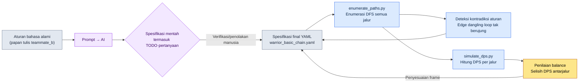

# 4.3 Kombo, Cancel, dan Input Queue — Mengenumerasi dan Memverifikasi Setiap Jalur

Rekan tim B, seorang combat designer, berdiri di depan papan tulis ruang rapat sambil menggambar kotak dengan spidol. Dasar 1, dasar 2, dasar 3, lalu cabang serangan berat (heavy) yang mengarah ke samping. Ketika panah sudah bertambah hingga sekitar tujuh buah, seseorang bertanya, "Jadi, setelah heavy launch, kalau di-cancel dengan dodge, apakah bisa kembali lagi ke dasar 1?" Rekan B menghentikan spidolnya. Pada graf di papan tulis itu, jalur tersebut tidak tergambar. Apakah jalur itu bisa digambar tapi tidak digambar, atau memang tidak mungkin secara aturan — bahkan ia sendiri tidak bisa menjawab seketika.

Inilah masalah sebenarnya dalam desain kombo. Di dalam kepala, kombo tampak seperti satu untaian sederhana: "1-2-3 tersambung, lalu bercabang ke heavy." Tetapi begitu cancel dan input queue ikut masuk, untaian itu berubah menjadi graf. Cukup dengan enam node, tambahkan beberapa edge cancel saja, dan jumlah jalur yang benar-benar bisa dilewati membengkak menjadi puluhan cabang. Manusia tidak bisa membentangkan puluhan cabang itu sekaligus di dalam kepala. Itulah sebabnya pemikiran balancing semacam "jalur ini terlalu kuat" baru ditemukan setelah masuk ke dalam build.

Tujuan bab ini hanya satu: membuat **alur kerja yang mengenumerasi seluruh jalur kombo secara otomatis tanpa menggambarnya dengan tangan, lalu memverifikasi setiap jalur**. Aturan yang ditulis dalam bahasa alami diubah menjadi spesifikasi, jalur dienumerasi dari spesifikasi, dan jalur yang sudah dienumerasi dimasukkan ke dalam simulasi. Dalam proses itu, saya akan menunjukkan apa adanya — sampai sejauh mana AI membantu, dan di titik mana ia berbohong.

---

## 4.3.1 Kombo Bukan Tabel, Melainkan Graf

Kalau kombo ditulis sebagai tabel, hasilnya seperti ini. "Setelah dasar 1, dasar 2; setelah dasar 2, dasar 3." Rapi dalam baris dan kolom. Namun tabel ini berbohong, karena tabel mengasumsikan garis lurus. Dalam pertarungan nyata, pemain keluar dari dasar 2 menuju heavy, men-cancel heavy dengan dodge, lalu tepat setelah dodge menekan dasar 1 lagi. Percabangan dan perulangan ini tersembunyi di antara baris-baris tabel.

Karena itu, wujud kombo yang sebenarnya adalah **graf berarah** (directed graph). Aksi adalah node, sambungan adalah edge. Pada setiap edge melekat input window (kapan input diterima) dan tombol input. Pada node melekat frame durasi, dan pada sebagian node melekat kondisi bonus (pengali damage baru muncul kalau melewati node tertentu).

Kalau satu set kombo dasar karakter prajurit (warrior) digambar sebagai graf, hasilnya seperti berikut. Enam node, termasuk cabang cancel.

<svg viewBox="0 0 720 300" xmlns="http://www.w3.org/2000/svg" font-family="sans-serif" font-size="13">
  <defs>
    <marker id="arrow" markerWidth="10" markerHeight="10" refX="8" refY="3" orient="auto" markerUnits="strokeWidth">
      <path d="M0,0 L8,3 L0,6 Z" fill="#444"/>
    </marker>
  </defs>
  <!-- main chain -->
  <rect x="20" y="40" width="110" height="40" rx="6" fill="#e8f0fe" stroke="#3367d6"/>
  <text x="75" y="65" text-anchor="middle">Dasar 1 (21f)</text>
  <rect x="200" y="40" width="110" height="40" rx="6" fill="#e8f0fe" stroke="#3367d6"/>
  <text x="255" y="65" text-anchor="middle">Dasar 2 (24f)</text>
  <rect x="380" y="40" width="110" height="40" rx="6" fill="#e8f0fe" stroke="#3367d6"/>
  <text x="435" y="65" text-anchor="middle">Dasar 3 (30f)</text>
  <rect x="560" y="40" width="140" height="40" rx="6" fill="#fce8e6" stroke="#c5221f"/>
  <text x="630" y="65" text-anchor="middle">Finisher ×1.5</text>
  <!-- branch -->
  <rect x="200" y="150" width="110" height="40" rx="6" fill="#fef7e0" stroke="#e8a000"/>
  <text x="255" y="175" text-anchor="middle">Heavy (33f)</text>
  <rect x="380" y="150" width="110" height="40" rx="6" fill="#fef7e0" stroke="#e8a000"/>
  <text x="435" y="175" text-anchor="middle">Launch (28f)</text>
  <rect x="200" y="240" width="110" height="40" rx="6" fill="#e6f4ea" stroke="#137333"/>
  <text x="255" y="265" text-anchor="middle">Dodge (18f)</text>
  <!-- edges main -->
  <line x1="130" y1="60" x2="200" y2="60" stroke="#444" marker-end="url(#arrow)"/>
  <text x="165" y="52" text-anchor="middle" font-size="11">10~21f</text>
  <line x1="310" y1="60" x2="380" y2="60" stroke="#444" marker-end="url(#arrow)"/>
  <text x="345" y="52" text-anchor="middle" font-size="11">12~24f</text>
  <line x1="490" y1="60" x2="560" y2="60" stroke="#444" marker-end="url(#arrow)"/>
  <text x="525" y="52" text-anchor="middle" font-size="11">14~30f</text>
  <!-- branch edges -->
  <line x1="255" y1="80" x2="255" y2="150" stroke="#444" marker-end="url(#arrow)"/>
  <text x="300" y="118" text-anchor="middle" font-size="11">Heavy 6~24f</text>
  <line x1="310" y1="170" x2="380" y2="170" stroke="#444" marker-end="url(#arrow)"/>
  <line x1="255" y1="190" x2="255" y2="240" stroke="#444" marker-end="url(#arrow)"/>
  <text x="300" y="218" text-anchor="middle" font-size="11">Cancel dodge</text>
  <!-- loop back -->
  <path d="M200,260 C90,260 75,140 75,80" fill="none" stroke="#137333" stroke-dasharray="5,4" marker-end="url(#arrow)"/>
  <text x="110" y="160" text-anchor="middle" font-size="11" fill="#137333">Masuk ulang ke dasar 1 setelah dodge</text>
</svg>

Ada dua perbedaan mendasar dibanding papan tulis. Pertama, pada setiap edge dicantumkan rentang frame input window-nya. "Heavy 6\~24f" berarti input heavy diterima mulai frame ke-6 sampai frame ke-24 setelah dasar 2 dimulai. Kedua, ada edge masuk-ulang dodge→dasar 1 yang digambar dengan garis putus-putus. Itulah jalur yang tidak bisa dijawab seketika oleh rekan B di ruang rapat. Begitu dicantumkan dalam graf, "ada/tidak ada" menjadi jelas.

Kalau graf ini digambar manusia dengan tangan, hanya enam node dengan tujuh-delapan edge. Tetapi kalau ada dua puluh karakter dan tiap karakter punya tiga-empat set kombo, grafnya menjadi ratusan lembar. Tangan tidak bisa mengikutinya. Karena itu graf ditulis sebagai **spesifikasi teks**, lalu gambar dan verifikasi dibangkitkan secara otomatis dari situ.

---

## 4.3.2 Spesifikasi Dibaca Manusia, tapi Diuraikan Mesin

Graf di atas dipindahkan ke spesifikasi YAML. Intinya tiga blok: node (`nodes`), edge (`edges`), dan bonus (`bonuses`). Aturan cancel pun dianggap sebagai satu jenis edge — karena memutus lalu berpindah ke node lain pada akhirnya juga adalah edge.

```yaml
# warrior_basic_chain.yaml
character: warrior
combo_id: basic_chain

nodes:
  - { id: basic_1,  name: Dasar 1,  duration_frames: 21 }
  - { id: basic_2,  name: Dasar 2,  duration_frames: 24 }
  - { id: basic_3,  name: Dasar 3,  duration_frames: 30 }
  - { id: heavy,    name: Heavy,    duration_frames: 33 }
  - { id: launch,   name: Launch,   duration_frames: 28 }
  - { id: dodge,    name: Dodge,    duration_frames: 18, cancels_recovery: true }

edges:
  - { from: basic_1, to: basic_2, input: light, window: [10, 21] }
  - { from: basic_2, to: basic_3, input: light, window: [12, 24] }
  - { from: basic_2, to: heavy,   input: heavy, window: [6, 24] }
  - { from: heavy,   to: launch,  input: heavy, window: [10, 33] }
  - { from: heavy,   to: dodge,   input: dodge, window: [0, 33], type: cancel }
  - { from: basic_3, to: dodge,   input: dodge, window: [0, 30], type: cancel }
  - { from: dodge,   to: basic_1, input: light, window: [8, 18] }   # masuk ulang

bonuses:
  - { on: basic_3, requires_path: [basic_1, basic_2], damage_multiplier: 1.5 }
```

Spesifikasi ini memuaskan dua pembaca sekaligus. Manusia membaca `window: [6, 24]` dan memahami "oh, heavy diterima mulai pertengahan dasar 2," sementara mesin menguraikan baris yang sama untuk dipakai menggambar graf dan mengenumerasi jalur. Dari satu sumber, pemahaman manusia dan verifikasi mesin keluar secara bersamaan.

Nilai-nilai frame di atas (`21`, `24`, `[6, 24]`) bukan hasil pengukuran, melainkan nilai contoh yang penulis susun untuk keperluan penjelasan bab ini (belum terverifikasi). Di proyek nyata, nilai-nilai ini berasal dari panjang montage yang dibuat animator dan timing notify pada build. Saat pertama kali menulis spesifikasi, kita masukkan nilai intensi desainer, lalu setelah build keluar kita capture dan koreksi menjadi nilai pengukuran nyata — loop koreksi ini dibahas di 4.4.

---

## 4.3.3 Worked Transcript — Dari Bahasa Alami sampai Spesifikasi

Saya berikan aturan yang ditulis rekan B di papan tulis dalam bentuk bahasa alami, lalu meminta diubah menjadi spesifikasi YAML. Tanpa meringkas, saya pindahkan apa adanya: prompt selengkapnya, keluaran mentah Claude, serta verifikasi/penolakan dari manusia.

### Prompt (Selengkapnya)

```
Berikut ini adalah aturan kombo untuk karakter prajurit. Ubah ini menjadi spesifikasi kombo dalam YAML.

Aturan:
- Serangan dasar tersambung dalam pukulan 1, 2, 3. Tombol serangan ringan (light).
- Kalau tombol heavy ditekan di tengah dasar 2, bisa keluar ke heavy.
- Kalau setelah heavy ditekan heavy sekali lagi, musuh terlempar ke atas (launch).
- Heavy bisa di-cancel dengan dodge kapan saja.
- Dasar 3 juga bisa di-cancel dengan dodge.
- Tepat setelah dodge, dasar 1 bisa dimulai lagi dengan serangan ringan.
- Dasar 3 baru mendapat damage 1.5x kalau sudah melewati dasar 1 dan dasar 2 keduanya.

Format spesifikasi:
- nodes(id, name, duration_frames), edges(from, to, input, window, type),
  bonuses(on, requires_path, damage_multiplier)
- Edge cancel ditandai dengan type: cancel.
- Untuk nilai frame yang tidak aku berikan, jangan kamu tentukan sendiri, biarkan kosong sebagai TODO.
```

Baris terakhir itulah intinya. Saya menyatakan secara eksplisit: kalau frame tidak diberikan, jangan dikarang. Ini memaksakan standar v3 nomor 3 (kejujuran angka) pada level prompt.

### Keluaran Mentah Claude (Tanpa Editan)

````
Sudah saya ubah menjadi spesifikasi. Nilai frame tidak disediakan, jadi saya biarkan sebagai TODO.

```yaml
character: warrior
combo_id: basic_chain
nodes:
  - { id: basic_1, name: Dasar 1, duration_frames: TODO }
  - { id: basic_2, name: Dasar 2, duration_frames: TODO }
  - { id: basic_3, name: Dasar 3, duration_frames: TODO }
  - { id: heavy,   name: Heavy, duration_frames: TODO }
  - { id: launch,  name: Launch, duration_frames: TODO }
  - { id: dodge,   name: Dodge,   duration_frames: TODO }
edges:
  - { from: basic_1, to: basic_2, input: light, window: TODO }
  - { from: basic_2, to: basic_3, input: light, window: TODO }
  - { from: basic_2, to: heavy,   input: heavy, window: TODO }
  - { from: heavy,   to: launch,  input: heavy, window: TODO }
  - { from: heavy,   to: dodge,   input: dodge, window: TODO, type: cancel }
  - { from: basic_3, to: dodge,   input: dodge, window: TODO, type: cancel }
  - { from: dodge,   to: basic_1, input: light, window: TODO }
bonuses:
  - { on: basic_3, requires_path: [basic_1, basic_2], damage_multiplier: 1.5 }
```

Bagian yang perlu dikonfirmasi:
1. "Mulai ulang dasar 1 tepat setelah dodge" saya masukkan sebagai edge dodge -> basic_1, tetapi
   tidak jelas apakah input diterima selama recovery dodge atau setelah dodge benar-benar selesai.
2. Tidak ada aturan apakah ada air combo yang menyusul setelah launch.
   Perlu dikonfirmasi apakah launch adalah akhir kombo.
3. Tidak jelas apakah dodge ditaruh sebagai node atau hanya sebagai edge (aksi cancel). Untuk sementara saya
   taruh sebagai node — saya menganggap dodge sendiri adalah aksi yang punya durasi.
````

Mari kita evaluasi di sini. Yang baik: frame tidak dikarang dan semuanya dikosongkan sebagai TODO. Batasan dalam prompt dipatuhi. Lalu ketiga pertanyaan di akhir semuanya benar-benar titik yang ambigu — khususnya nomor 1 (timing input masuk-ulang) adalah persis lubang yang tidak bisa dijawab seketika oleh rekan B di ruang rapat. AI menemukan lubang itu lebih dulu daripada manusia.

Yang masih kabur: keputusan menaruh dodge sebagai node di nomor 3 bisa diperdebatkan. Dodge adalah "aksi cancel" sekaligus "aksi yang punya durasi," jadi keduanya sama-sama benar. AI memilih satu sisi lalu melaporkannya sebagai sesuatu yang ambigu — itu jujur, tapi ini adalah keputusan desain sehingga manusialah yang harus menentukannya.

### Verifikasi/Penolakan oleh Manusia

Saya jawab ketiga pertanyaan dan menolak sebagian.

- **Nomor 1 (timing masuk ulang):** input diterima selama recovery dodge (8\~18f). Bukan setelah dodge ditonton sampai habis, melainkan masuk ulang ke dasar 1 lewat cancel recovery. → Diterima, `window: [8, 18]`.
- **Nomor 2 (setelah launch):** dalam lingkup bab ini, launch ditaruh sebagai akhir kombo. Air combo dipisahkan ke set tersendiri. → Penilaian AI diterima.
- **Nomor 3 (dodge=node):** ditaruh sebagai node. Hanya saja saya tambahkan atribut `cancels_recovery: true` untuk menyatakan bahwa ini adalah "aksi yang memutus recovery." → Diterima sebagian + penambahan atribut.

Dan satu hal saya **tolak**. AI tidak menempelkan `type: cancel` pada edge `dodge → basic_1`, padahal ini memutus recovery dodge lalu masuk, jadi sifatnya memang cancel. Namun di sini saya menganggapnya sebagai "masuk normal setelah dodge" dan menaruhnya sebagai edge biasa — karena untuk karakter ini, pembedaan antara cancel recovery dan sambungan normal tidak menghasilkan perbedaan dari sisi rasa main. Ini adalah kasus di mana manusia menimpa klasifikasi AI dengan penilaian domain.

### Permintaan Ulang

```
Bagus. Keluarkan ulang spesifikasi final dengan mencerminkan hal-hal berikut:
- Tambahkan cancels_recovery: true pada dodge.
- window untuk edge dodge -> basic_1 adalah [8, 18].
- Untuk frame lain, karena aku tetap belum memberikannya, pertahankan TODO. Tapi karena aku akan
  memakai nilai contoh dari graf di atas (basic_1=21, basic_2=24, basic_3=30, heavy=33, launch=28, dodge=18),
  isi dengan nilai-nilai itu. Beri komentar bahwa ini nilai contoh yang belum terverifikasi.
```

Hasil dari permintaan ulang inilah YAML di 4.3.2. Tidak selesai dalam sekali jalan. Prompt → mentah → verifikasi/penolakan → permintaan ulang. Siklus inilah yang membangun keandalan spesifikasi. AI menandai tempat yang ambigu, dan manusia memutuskan dengan pengetahuan domain — keduanya tidak bisa berjalan sendirian.

---

## 4.3.4 Mengenumerasi Jalur Secara Otomatis

Karena spesifikasi adalah graf, enumerasi jalur kombo menjadi persoalan **penelusuran graf** (graph traversal). Yaitu depth-first search (DFS) yang mencari semua jalur dari node awal sampai node akhir (atau finisher). Manusia tidak bisa melakukannya di kepala, tapi kode menyelesaikannya dalam sekejap.

Di dalam workspace terisolasi tim penulis, `95_BattleTF`, ada skrip kecil yang menangani enumerasi ini. Skrip itu membaca spesifikasi YAML, mengeluarkan semua jalur, dan memverifikasi apakah setiap jalur mungkin secara aturan (apakah edge-nya ada). Kalau hanya logika intinya yang ditampilkan, seperti ini.

```python
# 95_BattleTF/enumerate_paths.py (kutipan)
import yaml

def load_graph(path):
    spec = yaml.safe_load(open(path, encoding="utf-8"))
    adj = {}
    for e in spec["edges"]:
        adj.setdefault(e["from"], []).append(e)
    return spec, adj

def enumerate_paths(adj, start, max_depth=8):
    results = []
    def dfs(node, path, edges):
        # node akhir (tanpa edge keluar) atau batas kedalaman, jalur ditetapkan
        outs = adj.get(node, [])
        if not outs or len(path) >= max_depth:
            results.append((list(path), list(edges)))
            return
        for e in outs:
            if e["to"] in path:        # cegah perulangan: node sama 1 kali per jalur
                results.append((list(path), list(edges)))
                continue
            dfs(e["to"], path + [e["to"]], edges + [e])
    dfs(start, [start], [])
    return results
```

Kalau dijalankan mulai dari `basic_1`, mengucur jalur-jalur yang dengan tangan mustahil dibentangkan seluruhnya. Kalau hanya sebagian yang ditampilkan, seperti berikut.

| # | Jalur | Catatan |
|---|---|---|
| 1 | Dasar 1 → Dasar 2 → Dasar 3 | 3-pukulan standar, bonus finisher terpenuhi |
| 2 | Dasar 1 → Dasar 2 → Heavy → Launch | kombo cabang |
| 3 | Dasar 1 → Dasar 2 → Heavy → Dodge → Dasar 1 → … | masuk perulangan |
| 4 | Dasar 1 → Dasar 2 → Dasar 3 → Dodge → Dasar 1 → … | reset setelah finisher |

Nomor 3 dan 4 penting. Karena edge masuk-ulang dodge, kombo **berulang** (siklik). Yang tidak terlihat manusia di papan tulis justru jalur siklik semacam ini. Kalau guard cegah-perulangan (node sama 1 kali per jalur) tidak dimasukkan ke DFS, enumerasi terjebak dalam loop tak berujung — ini adalah jebakan yang benar-benar saya sadari saat kode pertama kali dijalankan dan ia berhenti membeku. Kalau graf memuat siklus, enumerator wajib punya guard.

Keluaran tahap enumerasi ada dua. Pertama, daftar semua jalur yang mungkin secara aturan. Kedua, **deteksi kontradiksi aturan** — kalau di spesifikasi ada edge `dodge → basic_1` tetapi definisi node `dodge` justru hilang, enumerator menangkapnya sebagai "edge yang menunjuk ke node yang tidak terdefinisi." Kesalahan paling umum saat menulis spesifikasi dengan tangan adalah dangling reference semacam ini.

---

## 4.3.5 Memasukkan Jalur yang Dienumerasi ke dalam Simulasi

Daftar jalur saja tidak memberi tahu "jalur mana yang terlalu kuat." Setiap jalur harus dimasukkan ke simulator DPS. `simulate_dps` milik tim penulis berperan di sini — ia menerima jalur (urutan node), damage dan frame tiap node, serta aturan bonus, lalu menghitung total damage dan total frame yang dibutuhkan, dan menghasilkan damage per detik (DPS).

```python
# 95_BattleTF/simulate_dps.py (kutipan, asumsi 60fps)
def simulate(path_nodes, node_dmg, node_frames, bonuses):
    total_dmg = 0
    total_frames = 0
    visited = []
    for nid in path_nodes:
        dmg = node_dmg.get(nid, 0)
        # bonus: kalau requires_path semuanya dilewati, terapkan pengali
        for b in bonuses:
            if b["on"] == nid and all(r in visited for r in b["requires_path"]):
                dmg *= b["damage_multiplier"]
        total_dmg += dmg
        total_frames += node_frames[nid]
        visited.append(nid)
    seconds = total_frames / 60.0
    return {"dmg": total_dmg, "frames": total_frames,
            "dps": round(total_dmg / seconds, 1) if seconds else 0}
```

Kalau hasil enumerasi di 4.3.4 dialirkan utuh ke sini, DPS tiap jalur jatuh dalam bentuk tabel. Di bawah ini hasil dengan memasukkan damage node sebagai nilai contoh (pukulan dasar 100, heavy 180, launch 140 — semuanya nilai olahan yang belum terverifikasi) lalu dijalankan.

| Jalur | Total Damage | Total Frame | DPS |
|---|---|---|---|
| Dasar 1→Dasar 2→Dasar 3 (finisher ×1.5) | 100+100+150 = 350 | 75 | 280.0 |
| Dasar 1→Dasar 2→Heavy→Launch | 100+100+180+140 = 520 | 106 | 294.3 |
| Dasar 1→Dasar 2→Dasar 3→Dodge→Dasar 1 | 350+0+100 = 450 | 144 | 187.5 |

Tabel ini mengubah diskusi. Intuisi "cabang heavy kelihatan lebih kuat daripada 3-pukulan standar?" berubah menjadi angka "DPS jalur heavy 294 vs standar 280, unggul 5%." Kalau keunggulan 5% itu memang disengaja, lolos; kalau tidak, frame heavy diperpanjang untuk menurunkan DPS-nya. Penilaian ini dilakukan **sebelum** build keluar, pada tahap spesifikasi.

Kalau seluruh alur kerja dilihat dalam satu lembar, hasilnya seperti ini.



Spesifikasi (D) berada di pusat, dan enumerasi (E), verifikasi (F), serta simulasi (G) bercabang dari situ. Kalau kontradiksi tertangkap atau balance meleset, kembali ke spesifikasi dan perbaiki. Papan tulis tidak punya loop ini — itulah sebabnya kombo papan tulis baru ketahuan salah setelah masuk ke build.

---

## 4.3.6 Cancel dan Input Queue — Dua Tuas yang Menambah dan Mempersempit Jalur

Sampai sini kita telah melihat graf kombo dan enumerasi jalur. Cancel dan input queue adalah dua tuas yang menyetel graf ini. Arahnya berlawanan persis.

**Cancel menambah edge.** Setiap kali satu aturan cancel ditambahkan, sebuah edge menempel pada graf, dan jumlah jalur yang dienumerasi membengkak secara perkalian. Karena itu, cancel bukanlah "semakin longgar semakin baik." Semakin cancel dilonggarkan, semakin jalur meledak, dan semakin tinggi kemungkinan tercampurnya jalur kuat yang tak diniatkan (seperti jalur siklik di subbab sebelumnya). Di sinilah alasan mengapa tradisi fighting game menaruh cancel secara ketat, sementara action RPG menaruhnya secara longgar — genre yang menentukan "berapa banyak jalur yang boleh diizinkan." Tidak ada nilai window jawaban yang absolut.

Saat menangani cancel, harus selalu dipisahkan dan dinyatakan secara eksplisit. Kalau ditaruh sebagai "cancel apa saja" yang terpadu, enumerator akan membuat edge cancel di antara semua node sehingga jalur bertambah tak terkendali.

| Jenis Cancel | Representasi Spesifikasi | Efek pada Jalur |
|---|---|---|
| Action cancel | node tertentu → node tertentu, type: cancel | hanya menambah cabang selektif |
| Dodge cancel | banyak node → dodge, window: [0, dur] | pintu keluar hampir di tiap node |
| Guard cancel | banyak node → guard | masuk bertahan, biasanya terbatas pada recovery |
| No cancel | tanpa edge cancel keluar | sampai habis setelah dipicu (super armor) |

**Input queue tidak mempersempit jalur, melainkan membuatnya benar-benar bisa diinjak.** Tanpa queue, pemain harus menepatkan input window tiap edge (misalnya `[12, 24]`) secara persis per frame. Dengan reaksi manusia, itu hampir mustahil. Queue menyimpan input yang ditekan sebelum window ke dalam buffer, lalu otomatis memicunya tepat saat window terbuka. Artinya, queue tidak mengubah jalur pada graf, tetapi memasangkan sepatu pada manusia agar bisa berjalan di atas graf.

```yaml
input_queue:
  window_start_ratio: 0.5   # buffering input berikutnya mulai dari progres aksi 50%
  expire_frames: 10         # masa berlaku input yang di-buffer
  priority: latest          # saat banyak input bersamaan, yang terakhir diprioritaskan
```

Keseimbangan ketiga parameter inilah intinya. Kalau `window_start_ratio` terlalu kecil, input di awal aksi pun ikut di-buffer sehingga aksi berikutnya yang tak diniatkan melompat keluar. Kalau `expire_frames` terlalu pendek, queue kehilangan maknanya dan kembali menuntut ketepatan; kalau terlalu panjang, input yang ditekan jauh sebelumnya terpicu telat sehingga muncul kejadian "kenapa tiba-tiba bergerak." Nilai awal yang disarankan adalah `expire_frames` 5\~15 dan `window_start_ratio` sekitar 0.5 — tetapi ini adalah garis awal yang perlu disetel sesuai genre dan bobot karakter, bukan jawaban pasti.

Satu hal soal operasional. Jangan menaruh parameter input queue berbeda-beda sepenuhnya untuk tiap karakter. Taruh satu nilai default global, dan hanya karakter yang bobotnya sangat berbeda (tipe bos raksasa, dsb.) yang di-override. Kalau nilai queue dua puluh karakter dikelola terpisah-pisah, mana yang merupakan perbedaan yang diniatkan dan mana yang merupakan kesalahan menjadi tak terbedakan.

Terakhir, ada satu hal lagi yang perlu ditandai. Sampai sini kita hanya menangani edge sebagai "ada/tidak ada," tetapi meskipun edge-nya ada, **bagaimana sebenarnya perpindahan dari satu node ke node berikutnya terjadi** adalah keputusan lain lagi. Cara menyambungkan antarkombo punya tiga percabangan inti, dan karena di luar kedalaman buku ini, hal itu tidak saya tangani dengan kode; namun kalau tidak disebutkan, spesifikasi jadi tergambar separuh saja.

- **Cancel notify:** mulai titik mana animasi saat ini diputus dan input berikutnya diterima. Window edge di atas (`window: [10, 21]`) justru merupakan representasi notify ini. Kalau notify dimajukan, kombo jadi lebih cepat (sebelum pukulan selesai sudah ke berikutnya); kalau dimundurkan, tiap pukulan terasa lebih berat. Artinya nilai awal window bukan sekadar angka, melainkan keputusan rasa: "akankah pukulan ini ditampilkan sampai habis, atau cepat dilewatkan ke berikutnya."
- **Anim blending:** mencampur dua node secara mulus saat berpindah. Dari pose akhir heavy ke pose awal launch diinterpolasi selama beberapa frame. Sambungannya halus dan alami, tetapi pada segmen blending mudah muncul celah deteksi pukulan dan "rasa terputus" jadi hilang.
- **Frame skip (lewati frame):** tanpa blending, frame sisa animasi saat ini dilewati dan node berikutnya langsung dimulai. Sambungannya gesit dan reaksinya cepat, tetapi pose bisa terlihat patah-patah. "Rasa cancel" pada fighting game dan action game umumnya yang ini.

Ketiganya membuat rasa main game berlawanan persis meskipun edge-nya sama. Pada tahap spesifikasi, hanya keberadaan edge dan window yang ditentukan; cara menyambungkan (blending vs frame skip) biasanya ditentukan bersama animator pada tahap build. Hanya saja, kalau di spesifikasi disisakan satu baris field seperti `transition: blend` / `transition: skip` lebih dulu, maka pada tahap build tidak perlu bertanya lagi "edge ini diputuskan disambung bagaimana, ya." Cara menyambungkan adalah sumbu ketiga tersembunyi dari graf kombo.

---

## 4.3.7 Verifikasi Build Adalah Pekerjaan Tersendiri (Pratinjau 4.4)

Semua verifikasi sampai sini terjadi **di atas spesifikasi**. Enumerasi jalur, simulasi DPS, deteksi kontradiksi — semuanya menyasar YAML. Tetapi nilai frame pada spesifikasi adalah nilai intensi desainer, bukan nilai pengukuran build. Panjang sebenarnya montage yang dibuat animator, frame saat notify pada build benar-benar terpicu, window saat input queue benar-benar bekerja di engine — ini harus diukur dengan men-capture build.

Mengekstraksi secara otomatis 5 sinyal (frame terjadinya pukulan, recovery, cancel window, input queue, hitstop) dari video build punya tingkat implementasi yang tinggi, dan secara realistis yang paling dapat diandalkan adalah telemetri di dalam game — biarkan di dalam build dicetak log "aksi ini menerima input ini pada frame ini," lalu log itu diadu dengan spesifikasi (perbandingan metode capture lihat 4.4). Loop pengaduan inilah tema 4.4. Kalau window yang menurut spesifikasi `[12, 24]` ternyata terukur `[14, 26]` pada build, maka spesifikasi dikoreksi mengikuti pengukuran build.

---

## 4.3.8 Kesalahan Umum dan Cara Menghindarinya

| Kesalahan | Mengapa Berbahaya | Cara Menghindari |
|---|---|---|
| Menulis kombo sebagai tabel garis lurus | Cabang·siklus tersembunyi di antara baris sampai terlewat | Spesifikasi sebagai graf (node+edge), tidak digambar dengan tangan |
| Menyatukan cancel jadi "apa saja" | Jalur enumerasi meledak, jalur kuat tercampur | Pisahkan secara eksplisit cancel action·dodge·guard |
| Enumerator tanpa guard siklus | Loop tak berujung pada masuk-ulang dodge | Guard node 1 kali per jalur |
| Salah mengira frame spesifikasi sebagai pengukuran | Nilai intensi berbeda dari nilai build | Tandai sebagai nilai intensi, koreksi dengan capture build (4.4) |
| Input queue terpisah per karakter | Perbedaan yang diniatkan/kesalahan tak terbedakan | Default global + sebagian saja di-override |
| Mempercayai begitu saja frame yang diisi AI | Angka karangan masuk ke spesifikasi | Paksa dengan prompt "nilai yang tak diberikan = TODO" |

---

### Poin-Poin Penting
- Karena kombo bukan garis lurus melainkan graf, jalur dienumerasi oleh kode, bukan oleh manusia.
- Cancel adalah tuas yang menambah jalur, input queue adalah sepatu yang membuat jalur bisa dijalani.
- Meskipun edge-nya sama, cara menyambungkan (cancel notify·anim blending·frame skip) membuat rasa main berlawanan persis.
- Verifikasi di atas spesifikasi dan verifikasi di atas build adalah pekerjaan yang berbeda, dan untuk yang kedua telemetri adalah pilihan yang realistis.

---

## Coba Sendiri — Mini Pipeline Enumerasi Jalur Kombo

Ini adalah prosedur minimal yang bisa Anda ikuti dengan tangan. Cukup ada Python dan `pyyaml`.

**setup.** Buat satu folder kerja dan taruh di dalamnya file spesifikasi dan dua skrip.

```
combo-mini/
  warrior_basic_chain.yaml   # spesifikasi dari 4.3.2
  enumerate_paths.py         # enumerator DFS dari 4.3.4
  simulate_dps.py            # simulator dari 4.3.5
```

Setelah `pip install pyyaml`, tempelkan YAML dari 4.3.2 apa adanya ke dalam file spesifikasi.

**prompt.** Tahap mengubah aturan bahasa alami menjadi spesifikasi serahkan pada AI. Pakai prompt dari 4.3.3 apa adanya, tapi pastikan menyertakan batasan terakhir.

```
Untuk nilai frame yang tidak aku berikan, jangan kamu tentukan sendiri, biarkan kosong sebagai TODO.
Edge cancel ditandai dengan type: cancel, dan bagian yang ambigu pisahkan sebagai pertanyaan tersendiri.
```

Dua baris ini mencegah pemalsuan angka dan penilaian sembarang oleh AI. Pada spesifikasi yang keluar, daftar TODO dan pertanyaan diisi oleh manusia.

**verify.** Kalau spesifikasi sudah selesai, verifikasi dua kali.

```bash
python enumerate_paths.py warrior_basic_chain.yaml   # semua jalur + keluaran kontradiksi
python simulate_dps.py    warrior_basic_chain.yaml   # tabel DPS per jalur
```

Pada keluaran enumerasi, periksa (1) apakah jalur siklik tidak bertambah tak berujung, (2) apakah tidak ada dangling edge yang menunjuk ke node yang tidak terdefinisi. Pada keluaran DPS, lihat apakah selisih antarjalur berada dalam rentang yang diniatkan. Kalau selisihnya besar, perbaiki frame/damage pada spesifikasi lalu jalankan lagi.

### Versi Ringkas Solo

Kalau tidak ada waktu untuk membuat alat terpisah, selesaikan penulisan spesifikasi dan enumerasi jalur dalam satu percakapan AI saja. Berikan aturan bahasa alami, lalu masukkan ke dalam satu prompt: "Ubah menjadi spesifikasi kombo YAML, lalu mulai dari node awal daftarkan seluruh jalur yang mungkin secara depth-first hingga tuntas, dan untuk siklus putuskan agar hanya berputar sekali. Kalau ada edge yang menunjuk ke node yang tidak terdefinisi, tandai." AI akan melakukan penyusunan spesifikasi, enumerasi, dan deteksi kontradiksi sekaligus. Untuk simulasi DPS, kalau damage node diberikan sekalian dalam bentuk tabel, terimalah lewat permintaan lanjutan "hitung total damage dan frame tiap jalur lalu berikan dalam bentuk tabel." Presisinya memang menurun, tapi tetap memandang jauh lebih ke depan dibanding papan tulis. Intinya tidak berubah — jangan bentangkan kombo di dalam kepala, tampilkan dengan mengenumerasinya.
