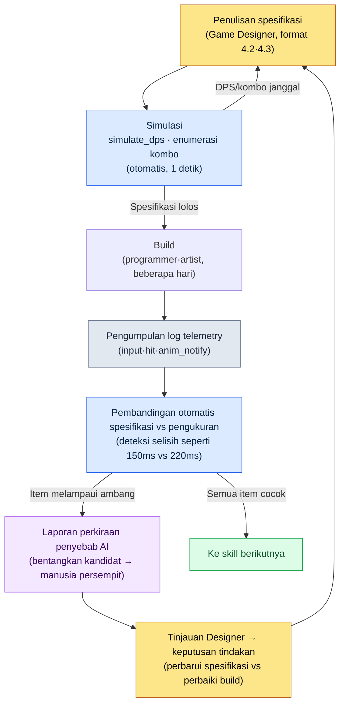

# 4.4 Simulasi dan Verifikasi Pertarungan dengan Bantuan AI

Build #234 dari TF Pertarungan baru saja masuk. Ini build pertama yang menyentuh skill baru `skill_thunder`. Di dokumen spesifikasi tertulis hit timing 150ms. Saya memasukkan input. Ujung jari saya berkata: lambat. Jelas lambat. Saya memanggil rekan A di sebelah. "Ini agak terasa melayang, ya?" Rekan A mencoba beberapa kali. "Hmm… kayaknya iya juga." Kami berdua sama-sama tidak yakin. Spesifikasi bilang 150, tapi tangan bersikeras sekitar 200. Siapa yang benar? Pertarungan antara ujung jari dan kertas. Di build berikutnya pun seseorang akan kembali berkata "secara feel sih oke," dan dengan satu kalimat itu, satu build lagi lewat begitu saja.

Tujuan bab ini adalah mengakhiri pertarungan itu. Kalau ujung jari berkata 200, kita tunjukkan dengan angka apakah memang benar 200. Lalu, *sebelum* build masuk, kita ingin tahu lebih dulu — hanya dengan melihat spesifikasi — bahwa "skill ini DPS-nya 30% lebih tinggi dari target." Bahkan di masa ketika saya menangani pertarungan sebuah MMORPG AAA yang digarap 200 orang sejak awal, rasa buntu saat feel dan angka tidak cocok itu sama saja. Yang berubah hanyalah: kini ada alat di tangan untuk menyimpulkan ketidakcocokan itu dengan angka.

Kalau 4.2 dan 4.3 membahas bagaimana *menuliskan* spesifikasi pertarungan, maka 4.4 membahas apakah spesifikasi itu *bekerja* sesuai maksud. Verifikasi punya dua sumbu. Satu adalah simulasi yang memverifikasi hanya dengan perhitungan tanpa build, satunya lagi adalah analisis tangkapan (capture) yang menarik nilai pengukuran dari video build sungguhan. Saat kedua sumbu ini terikat dalam satu siklus, putaran kerja desain pertarungan menyusut dari hitungan hari menjadi hitungan jam.

Kalau boleh menyampaikan kesimpulan lebih dulu, inti bab ini adalah *menjajarkan angka yang tertulis di spesifikasi (150ms) dengan angka yang diukur dari build (220ms), lalu membaca selisihnya* (4.4.5). Subbab-subbab di depan (simulator, enumerasi kombo) cukup dibaca sebagai tahap persiapan yang membuat pembandingan itu menjadi mungkin.

---

## 4.4.1 Biaya Menunggu Build

Apa yang terjadi ketika seorang Game Designer pertarungan ingin memverifikasi satu skill baru?

Designer menulis spesifikasi. Programmer memasukkan data, artist menempelkan motion dan efek, build berjalan, QA berputar satu kali, dan barulah setelah itu designer menyentuhnya sendiri. Kalau cepat dua hari, biasanya tiga sampai empat hari. Kalau *di ujung* siklus baru ketahuan "DPS terlalu tinggi," temuan itu menjadi perintah untuk kembali ke titik awal. Tiga sampai empat hari sekali lagi.

Simulasi adalah alat yang memberi jawaban di *tahap pertama* siklus ini. Kita menghitung hanya dengan spesifikasi. Kalau jawabannya buruk, perbaiki spesifikasi dan hitung ulang. Sebelum masuk ke tahap mahal bernama build, spesifikasinya sendiri tersaring sekali. Sama seperti memasukkan model mobil ke terowongan angin (wind tunnel) terlebih dahulu. Sebelum mobil sungguhan naik ke jalan, rancangan yang meragukan gugur di atas meja.

Tentu saja terowongan angin tidak memprediksi jalan 100%. Karena itulah dibutuhkan sumbu kedua, yaitu analisis tangkapan. Kalau simulasi adalah *jawaban ideal*, maka tangkapan adalah *jawaban yang benar-benar terjadi di build*. Menjajarkan keduanya dan membaca selisihnya — itulah keseluruhan bab ini.

---

## 4.4.2 simulate_dps — Simulator yang Bisa Dijalankan

Dengan pseudo-code yang abstrak, tidak ada yang bisa diverifikasi. Karena itu kita buat kode yang *benar-benar berjalan* sejak awal. Berikut adalah kerangka inti `simulate_dps.py` yang saya pakai di TF Pertarungan, yang sudah saya rekonstruksi untuk dimuat di buku setelah membuang data perusahaan. Berjalan hanya dengan pustaka standar Python, tanpa dependensi (untuk berkas lengkap lihat bagian "Coba Sendiri").

Inputnya sederhana. Satu skill adalah sebuah dataclass yang memiliki `damage`, `cast_sec` (waktu pendudukan saat cast), `cooldown_sec`, dan `resource_cost`, sementara karakter memiliki total resource, jumlah pemulihan per detik, daftar skill, dan rotasi prioritas. Badan utama yang berjalan di atasnya hanyalah aturan greedy sederhana: "di setiap saat, gunakan skill berprioritas tertinggi di antara skill yang dapat dipakai." Tujuannya adalah menangkap *batas atas ideal* — yang tidak lebih pintar maupun lebih bodoh dari pemain sungguhan. Kalau kita cuplik bagian yang menjadi tulang punggungnya saja, kira-kira begini.

```python
# Buat timeline dengan tick 0.05 detik. Jika tidak sedang cast, gunakan skill pertama yang dapat dipakai sesuai urutan prioritas.
while t < duration_sec:
    resource = min(char.max_resource, resource + char.resource_regen * tick)
    for name in cooldowns:
        cooldowns[name] = max(0.0, cooldowns[name] - tick)
    if t >= busy_until:                     # tunggu jika motion cast belum selesai
        for name in char.rotation:          # urutan prioritas
            s = skill_by_name[name]
            if cooldowns[name] <= 0 and resource >= s.resource_cost:
                total_damage += s.damage
                resource -= s.resource_cost
                cooldowns[name] = s.cooldown_sec
                busy_until = t + s.cast_sec  # skill berikutnya tidak bisa hingga saat ini
                break
    t += tick
# …(untuk definisi dataclass, input warrior, dan loop output, lihat kode lengkap di "Coba Sendiri")
```

Menempatkan `skill_thunder` (damage 420, cast 0.9s, cooldown 6s) sebagai prioritas pertama pada warrior, dengan `skill_dash` dan `basic_1` di belakangnya, lalu menjalankannya selama 20 detik (`python simulate_dps.py`), menghasilkan:

```
Rata-rata DPS: 261.0
  t=  0.0s  skill_thunder  resource=60
  t=  0.9s  skill_dash     resource=47
  t=  1.3s  basic_1        resource=50
  t=  1.6s  basic_1        resource=53
  t=  1.9s  basic_1        resource=55
  ...
```

Apa makna nilai ini? Bahwa *tanpa build*, dalam waktu kurang dari 1 detik, kita tahu fakta bahwa batas atas DPS ideal warrior kira-kira 261. Kalau target DPS-nya 180, maka spesifikasi ini berlebih sebesar +45%. Tanpa perlu menunggu build, kita bisa langsung menyentuh `damage` atau `cooldown_sec` sekarang juga.

Keterbatasannya pun saya tulis dengan jujur. Simulator ini tidak mencerminkan kesalahan input pemain, celah akibat pergerakan dan dodge, maupun gangguan dari musuh. Karena itu nilai pengukuran selalu keluar lebih tinggi daripada build sungguhan. Ini bukan bug, melainkan justru definisi simulator itu sendiri sebagai *batas atas*. Selisih dengan pengukuran nyata akan ditambal dengan tangkapan di 4.4.5.

> **Catatan Pemanfaatan AI.** Kerangka di atas memang saya susun sendiri, tetapi ketika menambahkan model resource baru (misalnya struktur ketika gauge amarah terisi saat menerima damage), saya meminta kepada Claude dengan *mengutip kode yang sudah ada*, seperti "Tambahkan aturan amarah +5 saat terkena serangan ke simulate_dps ini. Di dalam loop tick, sebagai variabel terpisah dari pemulihan resource yang sudah ada." Kalau Anda meminta untuk menghasilkan seluruh simulator dari kertas kosong, yang keluar adalah kode yang tidak bisa diverifikasi. Tulang punggung dipegang manusia, AI menumbuhkan cabangnya.

---

## 4.4.3 Enumerasi Otomatis Jalur Kombo

Hanya dengan satu angka DPS itu tidak cukup. Untuk memverifikasi "kombo mana yang dimaksudkan sebagai kombo utama," kita harus membentangkan *seluruh jalur yang mungkin*. Kalau menggambar pohon dengan tangan, kepala sudah meledak di 7\~8 node. Membentangkan jalur tanpa ada yang terlewat adalah hal yang dilakukan mesin jauh lebih baik daripada manusia — asalkan kita memintanya menghasilkan dalam bentuk yang bisa ditelusuri ulang oleh manusia.

Berikut adalah kode yang menerima graf kombo, menyebutkan semua jalur, dan mengurutkannya berdasarkan DPS. `combo_graph` adalah catatan dalam bentuk adjacency list tentang "dari aksi tertentu bisa di-cancel ke aksi apa," yang diekstrak langsung dari spesifikasi state machine di 4.3. Intinya adalah generator `all_paths` yang membentangkan secara rekursif hingga ujung buntu.

```python
# enumerate_combos.py — bentangkan semua jalur dari graf kombo dan urutkan berdasarkan DPS
combo_graph = {"start": ["A"], "A": ["B", "D"], "B": ["C", "E"], "D": ["C"], "C": [], "E": []}
action_stats = {  # (damage, durasi dalam detik)
    "A": (300, 0.8), "B": (450, 1.0), "C": (450, 1.2), "D": (600, 1.4), "E": (200, 0.6),
}

def all_paths(node="start", path=None):
    path = (path or [])
    nexts = combo_graph.get(node, [])
    if not nexts:                       # ujung buntu = kombo yang utuh
        yield [n for n in path if n in action_stats]
        return
    for nxt in nexts:
        yield from all_paths(nxt, path + [nxt])

results = []
for p in all_paths():
    dmg = sum(action_stats[a][0] for a in p)
    dur = sum(action_stats[a][1] for a in p)
    results.append((p, dmg, round(dur, 1), round(dmg / dur, 1)))

for p, dmg, dur, dps in sorted(results, key=lambda r: -r[3]):
    print(f"{' → '.join(p):<18} {dmg:>5} dmg  {dur:>4}s  DPS {dps}")
```

Hasil eksekusi:

```
A → D → C            1350    3.4s  DPS 397.1
A → B → C            1200    3.0s  DPS 400.0
A → B → E             950    2.4s  DPS 395.8
```

Sinyal yang harus dibaca Game Designer di sini bukanlah sekadar peringkat satu. Bahwa DPS ketiga jalur itu berhimpitan di kisaran 396\~400 — ini adalah sinyal bahwa "kombo mana pun yang dipakai efisiensinya mirip, sehingga *tidak ada identitas kombo utama*." Kalau maksudnya adalah "A→D→C harus menjadi kombo utama berisiko tinggi-imbalan tinggi," maka damage D harus dinaikkan atau waktunya dikurangi agar DPS-nya naik satu tingkat. Kini giliran kembali ke spesifikasi.

Di posisi tempat enumerasi otomatis ini menggantikan perhitungan manual, sekalipun node kombo bertambah menjadi 20, manusia cukup membaca tabel yang sudah terurut.

---

## 4.4.4 Analisis Tangkapan Build — Metode Realistisnya adalah telemetry

Kini sumbu kedua. Tahap mengukur apa yang sebenarnya terjadi di build. Orang sering membayangkan "AI menonton video build lalu menganalisisnya secara otomatis," tetapi di sini kita membagi cabangnya dengan jujur. Ada tiga jalan untuk memperoleh nilai pengukuran, dan biaya serta akurasi ketiganya sangat berbeda.

<svg viewBox="0 0 720 250" xmlns="http://www.w3.org/2000/svg" font-family="sans-serif" font-size="13">
  <rect x="10" y="20" width="220" height="200" rx="8" fill="#fde8e8" stroke="#c0392b" stroke-width="1.5"/>
  <text x="120" y="45" text-anchor="middle" font-weight="bold" fill="#c0392b">A. Analisis Video Langsung</text>
  <text x="120" y="72" text-anchor="middle">Dari piksel layar</text>
  <text x="120" y="92" text-anchor="middle">ekstrak input, motion, VFX</text>
  <text x="120" y="124" text-anchor="middle" font-weight="bold">Akurasi: rendah~sedang</text>
  <text x="120" y="148" text-anchor="middle">Kesulitan implementasi: sangat tinggi</text>
  <text x="120" y="172" text-anchor="middle">Galat frame ±1~2</text>
  <text x="120" y="200" text-anchor="middle" fill="#777">Untuk riset/demo</text>

  <rect x="250" y="20" width="220" height="200" rx="8" fill="#fef5e7" stroke="#d68910" stroke-width="1.5"/>
  <text x="360" y="45" text-anchor="middle" font-weight="bold" fill="#d68910">B. API Vision Siap Pakai</text>
  <text x="360" y="72" text-anchor="middle">Mengirim frame tangkapan</text>
  <text x="360" y="92" text-anchor="middle">ke layanan vision eksternal</text>
  <text x="360" y="124" text-anchor="middle" font-weight="bold">Akurasi: sedang</text>
  <text x="360" y="148" text-anchor="middle">Kesulitan implementasi: sedang</text>
  <text x="360" y="172" text-anchor="middle">Risiko kebocoran IP</text>
  <text x="360" y="200" text-anchor="middle" fill="#777">Perlu cek kebijakan internal</text>

  <rect x="490" y="20" width="220" height="200" rx="8" fill="#e8f6ef" stroke="#1e8449" stroke-width="1.5"/>
  <text x="600" y="45" text-anchor="middle" font-weight="bold" fill="#1e8449">C. telemetry dalam game</text>
  <text x="600" y="72" text-anchor="middle">Engine mencatat event</text>
  <text x="600" y="92" text-anchor="middle">beserta timestamp</text>
  <text x="600" y="124" text-anchor="middle" font-weight="bold">Akurasi: tinggi</text>
  <text x="600" y="148" text-anchor="middle">Kesulitan implementasi: rendah~sedang</text>
  <text x="600" y="172" text-anchor="middle">Pakai langsung waktu engine</text>
  <text x="600" y="200" text-anchor="middle" fill="#1e8449" font-weight="bold">Pilihan realistis</text>
</svg>

Opsi A (analisis piksel video) terdengar menarik. Gambarannya adalah mengekstrak lima sinyal secara otomatis dari layar — indikator input, perubahan motion karakter, frame pertama efek, gelombang suara, dan UI angka damage. Tetapi kalau benar-benar dibuat, galat ±1\~2 frame menjadi lapisan dasar karena noise kompresi frame, UI yang menghalangi, dan motion blur. Pada 60fps, 1 frame kira-kira 16.7ms. Dalam verifikasi yang menghitung hit timing dalam satuan ms, noise ±33ms itu fatal. *Kesulitan implementasinya sangat tinggi, dan akurasinya tidak sebanding dengan upaya itu.*

Karena itu jawaban realistisnya adalah opsi C, **log telemetry dalam game**. Engine sudah *tahu secara internal dengan tepat* waktu penerimaan input, waktu terpicunya animation notify, waktu spawn VFX, dan waktu penerapan damage. Daripada menyimpulkan waktu itu dari piksel, cukup buat agar ia mencetaknya dalam satu baris log. Alih-alih *memulihkan* 100ms dari piksel, kita *menyalin apa adanya* 100ms yang sudah diketahui engine.

```cpp
// Tambah satu baris di kode pemrosesan aksi pertarungan (pseudo-contoh UE C++)
// Panggil logger yang sama pada titik penerimaan input / penerapan damage
CombatTelemetry::Log("input",  SkillName, GetWorld()->GetTimeSeconds());
CombatTelemetry::Log("hit",    SkillName, GetWorld()->GetTimeSeconds());
```

Logger mencatat baris demi baris dalam format JSON Lines.

```
{"event":"input","skill":"skill_thunder","t":12.340}
{"event":"hit",  "skill":"skill_thunder","t":12.560}
{"event":"input","skill":"basic_3","t":14.100}
{"event":"hit",  "skill":"basic_3","t":14.166}
```

Selisih waktu antara `input` dan `hit` itulah hit timing yang terukur. 12.560 − 12.340 = 0.220 detik = **220ms**. Ini bukan ±33ms dari analisis piksel, melainkan nilai apa adanya dari waktu engine. Mengambil log ini lalu membandingkannya dengan spesifikasi adalah isi subbab berikutnya.

---

## 4.4.5 Worked Transcript: Spesifikasi 150ms vs Pengukuran 220ms

Kini kita kumpulkan kedua sumbu dalam satu tempat. Spesifikasi menjanjikan 150ms, dan telemetry mengukur 220ms. +70ms. Ujung jari benar. Saya menelusuri sampai tuntas bersama AI proses mempersempit *penyebab* selisih ini. Tanpa meringkasnya, saya muat apa adanya bahkan adegan ketika AI di awal salah menebak.

### Prompt

Spesifikasi hit timing-nya 150ms tetapi pengukurannya 220ms. Saya menempelkan log di bawah dan bertanya dengan panjang sewajarnya yang mungkin benar-benar diketik manusia. Permintaan singkat yang maksudnya jelas lebih baik daripada formalitas yang bertele-tele — satu baris yang meminta mencantumkan metode verifikasi dan satu baris larangan memutuskan secara mutlak adalah tulang punggung prompt ini.

> Hit timing skill_thunder di spesifikasi 150ms tetapi terukur 220ms, melampaui +70ms. Dari telemetry di bawah, pisahkan kemungkinan penyebabnya dan tuliskan juga *log mana yang memastikan/menyingkirkan masing-masing*. Jangan memutuskan secara mutlak; jika tidak pasti tandai sebagai 'belum terverifikasi'.  // "metode verifikasi juga" dan "larangan memutuskan mutlak" adalah dua maksud inti. Formalitas lainnya boleh dihilangkan, hasilnya tetap sama.
>
> ```
> {"event":"input","skill":"skill_thunder","t":12.340}
> {"event":"anim_start","skill":"skill_thunder","clip":"cast_thunder","t":12.340}
> {"event":"anim_notify","skill":"skill_thunder","notify":"HitWindow","t":12.560}
> {"event":"hit","skill":"skill_thunder","t":12.560}
> ```
> Menurut spesifikasi, notify HitWindow dari cast_thunder ada di titik 0.150s.

### Keluaran Mentah Claude (tahap 1 — sebelum verifikasi, termasuk salah tebak)

> Saya memperkirakan empat hal berikut sebagai penyebab kelebihan +70ms.
>
> 1. **Latensi jaringan.** Mungkin 70ms tertambah saat input bolak-balik ke server. Kalau ini build multiplayer, periksa RTT.
> 2. **Penurunan frame rate.** Kalau build berjalan di 30fps, 1 frame adalah 33ms, sehingga timing notify dibulatkan ke batas frame dan keterlambatan menumpuk.
> 3. **Perubahan panjang motion casting.** Klip cast_thunder mungkin menjadi lebih panjang dari spesifikasi sehingga notify HitWindow tergeser ke belakang.
> 4. **Keterlambatan input buffer.** Antrean input mungkin diproses telat satu tick.
>
> Penyebab yang paling mungkin adalah **nomor 1, latensi jaringan**. 70ms adalah rentang RTT yang khas.

### Verifikasi dan Penolakan oleh Manusia

Di sini saya berhenti dan membaca lagi log-nya. Perkiraan prioritas pertama AI (jaringan) *sudah tersingkir oleh log ini*. `input` dan `anim_start` tercatat pada waktu yang persis sama, 12.340. Artinya motion langsung dimulai pada saat input masuk, dan tidak ada celah bagi perjalanan bolak-balik jaringan untuk menyusup. Nomor 1 salah.

Nomor 2 (frame rate) juga lemah. Kalau 30fps, seharusnya terlihat ketidakrataan dalam satuan 33ms, tetapi input→hit tepat 0.220 dengan rapi. Ini bukan pembulatan batas frame, melainkan berbau *posisi tetap di dalam klip*.

Petunjuk yang menentukan ada di tempat lain. Waktu `anim_notify` adalah +0.220 dari basis `anim_start`. Spesifikasi bilang HitWindow harus ada pada 0.150 setelah klip mulai, tetapi pada klip sungguhan ia terkunci di titik 0.220. Artinya *klip itu sendiri dibuat berbeda dari spesifikasi, atau posisi notify dipindahkan dari 0.150 ke 0.220*. Penyebabnya bukan jaringan maupun frame rate, melainkan **nomor 3, data motion/notify**. AI memang memasukkan kandidat jawaban yang benar di antara empat kemungkinan, tetapi memberi peringkat secara terbalik.

### Prompt Permintaan Ulang

Saya melempar lagi dengan mengisi sendiri dasar penyingkiran dengan tangan. Tanpa perlu menjelaskan panjang, saya hanya mematok singkat apa yang sudah disingkirkan dan fakta yang tersisa.

> Singkirkan jaringan dan frame rate. (Dasar: input=anim_start pada waktu sama sehingga tidak ada keterlambatan input→motion / input→hit konsisten 0.220 tanpa noise frame.) Fakta yang tersisa: anim_notify pada anim_start +0.220, spesifikasi +0.150. Persempit penyebab hanya dengan fakta ini, dan tuliskan apa yang harus diminta ke programmer dan animator dalam *satuan tindakan*.  // Intinya "dalam satuan tindakan" — buat agar berakhir bukan dengan dugaan melainkan dengan siapa diminta apa.

### Keluaran Mentah Claude (tahap 2)

> Dengan dasar yang diberikan, penyebab dipersempit menjadi **notify HitWindow dari klip animasi cast_thunder ditempatkan pada 0.220s, bukan 0.150s**. Tersisa dua cabang.
>
> - **(a) notify pas di 0.150 tetapi seluruh klip melambat** — kalau play rate lebih rendah dari spesifikasi atau panjang klip bertambah, titik 0.150 meregang menjadi 0.220 dalam waktu nyata.
> - **(b) posisi notify itu sendiri dipindahkan ke 0.220** — panjang klip tetap, tetapi hanya markernya yang bergeser.
>
> Pemeriksaan yang memisahkan kedua cabang:
> 1. **Ke animator**: minta nomor frame notify HitWindow cast_thunder dan total jumlah frame klip, serta riwayat perubahan dibandingkan dengan nilai pada saat spesifikasi ditulis. Kalau marker bergeser, berarti (b).
> 2. **Ke programmer**: periksa apakah montage play rate skill_thunder adalah 1.0, dan apakah stat attack speed karakter dikalikan ke klip ini. Kalau play rate 0.68 (=0.150/0.220), berarti (a).
> 3. Ukur sekali lagi jarak anim_start→anim_notify pada attack speed karakter yang berbeda. Kalau jaraknya berubah mengikuti attack speed berarti (a), kalau tetap berarti (b).
>
> Tindakan yang disarankan: kalau terkonfirmasi (b), kembalikan notify ke 0.150 atau perbarui spesifikasi menjadi 0.220 (pilih yang sesuai maksud). Kalau terkonfirmasi (a), periksa logika penerapan play rate.

Keluaran kali ini layak diadopsi. Ia tidak memutuskan dugaan secara mutlak melainkan memisahkannya menjadi dua cabang (a)/(b), dan *metode memisahkan setiap cabang dengan data* serta *siapa harus diminta apa* tertulis dalam satuan tindakan. Khususnya pemeriksaan nomor 3 (mengukur ulang dengan mengubah attack speed) adalah cabang penentu yang mudah terlewat oleh manusia. Kalau laporan ini dibawa apa adanya ke rapat, rapat bukan lagi tempat berdebat "apa penyebabnya" melainkan menjadi tempat "memastikan (a) atau (b) dalam 30 menit dan memilih tindakan."

Inti yang ditunjukkan worked transcript ini adalah fakta bahwa AI tidak memberi jawaban benar sejak awal. Keluaran tahap pertama adalah salah tebak yang menempatkan jaringan di peringkat satu. Barulah ketika *verifikasi manusia yang membaca log dan menyingkirkan kandidat* menyela, analisis menyatu menuju jawaban yang benar. AI membentangkan kandidat secara luas, manusia mempersempitnya. Pembagian kerja inilah metodologi keseluruhan 4.4.

---

## 4.4.6 Menyatukan Dua Sumbu ke Satu Siklus — Loop Verifikasi

Kalau simulasi (4.4.2\~4.4.3) dan analisis tangkapan (4.4.4\~4.4.5) berjalan terpisah, itu hanya separuh nilainya. Saat keduanya terikat menjadi satu, terbentuklah loop berikut.



Karena simulasi memberi jawaban *sebelum* build, spesifikasi yang masuk ke build sudah tersaring sekali. Karena itu masalah yang ditemukan setelah build mengerucut sifatnya bukan menjadi "spesifikasi salah" melainkan "spesifikasi dan implementasi tidak cocok." +70ms di 4.4.5 persis kasus yang kedua itu — spesifikasi 150 sudah masuk akal, hanya implementasinya yang meleset menjadi 220. Pembedaan ini menghapus perselisihan soal siapa yang bertanggung jawab di rapat.

Namun loop ini tidak menutupi seluruh konten pertarungan. Wilayah yang *feel-nya adalah konten itu sendiri*, seperti sajian signature bos utama, tidak bisa direduksi menjadi angka DPS. Simulasi kuat untuk konten berbasis angka, sementara sajian tetap dijawab oleh tinjauan video yang dilihat dengan mata manusia. Loop berputar di sungai angka, dan sungai sajian mengalir terpisah.

---

## 4.4.7 Yang Saya Lihat dari Operasional Enam Bulan

Ini adalah pengukuran enam bulan TF Pertarungan sebuah MMORPG yang saya operasikan (Proyek A yang menargetkan feel kontrol setara seri refgame). Angka di bawah adalah *nilai pengukuran sungguhan* yang disaring dari catatan internal TF, dan saya nyatakan bahwa jumlah build serta waktu adalah nilai yang dibulatkan dalam satuan siklus (bukan satuan menit yang persis, melainkan pengukuran dalam satuan siklus dan setengah hari).

| Item | Sebelum Diterapkan | Setelah Diterapkan |
|---|---|---|
| Siklus verifikasi skill baru | rata-rata 3\~4 build | rata-rata 1\~2 build |
| Verifikasi build 100 skill | setengah hari (manual) | 30 menit (pembandingan otomatis telemetry) |
| Rapat balancing | 2 jam (debat subjektif) | 30 menit (berbasis data) |
| Cacat yang ditemukan tepat sebelum build | rata-rata 5\~8 kasus/build | rata-rata 1\~2 kasus/build |

Perubahan yang lebih penting daripada angka adalah *sifat* rapatnya. Separuh rapat sebelum penerapan adalah "skill ini terlalu kuat" lawan "tidak, sudah pas." Pertarungan ujung jari lawan ujung jari. Setelah penerapan, tempat itu berpindah menjadi "DPS terukur adalah target +12% dan hit timing terukur adalah spesifikasi +70ms. Apakah memperpendek motion, atau menurunkan damage 10%?" Waktu yang dulu dipakai memperdebatkan *apa masalahnya* berubah menjadi waktu untuk menentukan *bagaimana memperbaikinya*.

Biaya peralihan ini pun saya tulis dengan jujur. Pekerjaan awal menanam logger telemetry ke seluruh kode pertarungan memakan kira-kira 1\~2 minggu, dan menyeragamkan skema spesifikasi ke semua karakter dan skill memakan tambahan satu kuartal. Pada kuartal pertama, saya menilai cukup kalau salah satu dari simulasi atau telemetry saja yang berjalan. Keduanya baru saling terkait dalam satu loop mulai kuartal kedua.

---

## 4.4.8 Kesalahan Umum dan Cara Menghindarinya

Lima hal yang berulang.

Pertama, terlalu memercayai nilai simulasi. Angka 261 dari simulate_dps adalah *batas atas*, bukan pengukuran nyata. Kalau tidak dibandingkan dengan telemetry, ia selalu menjadi penaksiran berlebih.

Kedua, tidak melakukan pengukuran. Kalau hanya menyimulasikan spesifikasi dan tidak melihat build dengan telemetry, +70ms seperti di 4.4.5 menumpuk diam-diam. Logging telemetry bukan opsi melainkan fasilitas dasar kode pertarungan.

Ketiga, tidak membawa laporan ke rapat. Sekalipun laporan otomatis tersedia, kalau tidak ada di agenda rapat tidak ada yang melihatnya. Masukkan "tabel pembandingan telemetry build kali ini" sebagai item tetap agenda.

Keempat, mengadopsi perkiraan AI tanpa verifikasi. Seperti yang kita lihat di 4.4.5, perkiraan tahap pertama AI adalah salah tebak. AI adalah alat untuk memperluas kandidat, bukan alat untuk menarik kesimpulan. Jangan pernah melewati satu tahap manusia yang menyingkirkan kandidat dengan log.

Kelima, struktur spesifikasi berbeda untuk tiap skill. Kalau `cast_sec` ditulis `cast_time` di satu skill dan `castMs` di skill lain, simulator maupun skrip pembanding akan rusak setiap kali. Paksakan satu skema spesifikasi bersama ke semua skill — inilah prasyarat agar seluruh alat 4.4 berjalan.

Tidak perlu membereskan kelimanya pada kuartal pertama. Walau hanya satu-dua yang mapan, siklus sudah memendek secara kentara. Sisanya akan tertambal dengan sendirinya sambil memutar loop.

---

## 4.4.9 Menutup Part 4

Di 4.1\~4.4 kita membahas secara berurutan koordinat, Look & Feel, kombo, dan simulasi desain pertarungan. 4.1 membahas apa yang dilihat Game Designer pertarungan sebagai objek yang dapat diukur, 4.2 membahas bagaimana mengukur dan menyetel hit timing, hitstop, dan sinkronisasi efek, 4.3 membahas bagaimana menuliskan kombo, cancel, dan input queue sebagai state machine, dan 4.4 membahas bagaimana memverifikasi apakah seluruh spesifikasi itu bekerja sesuai maksud — tanpa build maupun di build.

Satu minggu seorang Game Designer pertarungan yang menyelesaikan Part 4 berubah seperti ini. Senin, verifikasi otomatis simulate_dps menempel pada spesifikasi skill baru. Selasa, identitas kombo utama diperiksa lewat enumerasi otomatis jalur kombo. Rabu, saat build masuk, tabel pembandingan telemetry muncul otomatis. Kamis, diskusi berbasis data 30 menit. Jumat, perbaikan spesifikasi siklus berikutnya. Siklus build menyusut dari 3\~4 kali menjadi 1\~2 kali, dan rapat memendek menjadi separuh atau kurang. Abstraksi bernama feel pukulan berpindah menjadi 220ms yang dapat diukur.

Lalu adegan build #234 tadi — terhadap pertanyaan "ini agak terasa melayang, ya?", kini log telemetry yang menjawab menggantikan kita dengan 220ms. Pertarungan antara ujung jari dan kertas sudah berakhir.

Part 5 berikutnya adalah desain naratif. Kita beralih ke contoh penerapan nyata dari struktur NarrativeDocs Layer 0\~4 yang diperkenalkan di 2.3.

---

## Coba Sendiri

**setup.**
1. Buat seutuhnya `simulate_dps.py` di bawah apa adanya. Tanpa dependensi, langsung berjalan dengan `python simulate_dps.py`, dan "Rata-rata DPS: 261.0" dari 4.4.2 akan tereproduksi.

```python
# simulate_dps.py — hitung DPS hanya dengan spesifikasi, tanpa build
from dataclasses import dataclass

@dataclass
class Skill:
    name: str
    damage: float          # damage per satu pukulan
    cast_sec: float        # waktu cast (pendudukan motion) (detik)
    cooldown_sec: float    # waktu tunggu pemakaian ulang (detik)
    resource_cost: float   # konsumsi resource (MP/stamina)

@dataclass
class Character:
    name: str
    max_resource: float
    resource_regen: float  # pemulihan resource per detik
    skills: list           # list[Skill]
    rotation: list          # urutan prioritas (nama skill)

def simulate_dps(char: Character, duration_sec: float, tick=0.05):
    cooldowns = {s.name: 0.0 for s in char.skills}   # sisa cooldown
    skill_by_name = {s.name: s for s in char.skills}
    resource = char.max_resource
    total_damage = 0.0
    busy_until = 0.0          # saat motion cast selesai
    log = []
    t = 0.0
    while t < duration_sec:
        resource = min(char.max_resource, resource + char.resource_regen * tick)
        for name in cooldowns:
            cooldowns[name] = max(0.0, cooldowns[name] - tick)
        if t >= busy_until:   # jika tidak sedang cast, pilih skill berikutnya
            for name in char.rotation:          # urutan prioritas
                s = skill_by_name[name]
                if cooldowns[name] <= 0 and resource >= s.resource_cost:
                    total_damage += s.damage
                    resource -= s.resource_cost
                    cooldowns[name] = s.cooldown_sec
                    busy_until = t + s.cast_sec
                    log.append((round(t, 2), name, resource))
                    break
        t += tick
    return total_damage / duration_sec, log

if __name__ == "__main__":
    warrior = Character(
        name="warrior", max_resource=100, resource_regen=8,
        skills=[
            Skill("skill_thunder", damage=420, cast_sec=0.9, cooldown_sec=6, resource_cost=40),
            Skill("skill_dash",    damage=180, cast_sec=0.4, cooldown_sec=3, resource_cost=20),
            Skill("basic_1",       damage=60,  cast_sec=0.3, cooldown_sec=0, resource_cost=0),
        ],
        rotation=["skill_thunder", "skill_dash", "basic_1"],
    )
    dps, log = simulate_dps(warrior, duration_sec=20)
    print(f"Rata-rata DPS: {dps:.1f}")
    for t, name, res in log[:8]:
        print(f"  t={t:>5}s  {name:<14} resource={res:.0f}")
```

2. Tambahkan satu baris log telemetry di titik penerimaan input dan penerapan damage pada kode engine pertarungan (4.4.4). Intinya adalah mencetak waktu engine (`GetTimeSeconds` dll.) apa adanya.

**prompt.** Pilih satu item dari telemetry build yang tidak cocok dengan spesifikasi, lalu tanyakan ke AI dengan format 4.4.5 — tempelkan cuplikan log, dan pastikan menyertakan "jangan memutuskan dugaan secara mutlak, sertakan metode verifikasi tiap penyebab, dan kalau tidak pasti tandai sebagai belum terverifikasi."

**verify.** *Jangan mengadopsi apa adanya* keluaran tahap pertama AI. Baca sendiri log-nya, hapus dengan tangan kandidat yang dapat disingkirkan (seperti penyingkiran jaringan dan frame rate di 4.4.5), lalu minta ulang dengan menambahkan dasar. Kalau laporan akhirnya berakhir dalam satuan tindakan "perkiraan penyebab + siapa diminta apa", bawalah ke rapat.

**Versi Ringkas Solo.** Kalau memasang logger telemetry ke seluruh kode terasa membebani, cetak saja dua baris input·hit pada *satu skill* yang ingin Anda verifikasi. simulate_dps pun lihat saja DPS satu skill itu. Jangan memasang seluruh alat; putar dulu satu kali loop dengan satu skill yang paling mencurigakan, lalu perluas.

---

### Poin-Poin Penting
- Simulasi menghitung batas atas ideal spesifikasi sebelum build, menyusutkan verifikasi dari hitungan hari menjadi hitungan jam
- Pengukuran build secara realistis adalah log telemetry, bukan video, dan menyalin apa adanya waktu engine
- AI adalah alat untuk memperluas kandidat penyebab, sementara verifikasi yang mempersempit kandidat dengan log adalah bagian manusia
