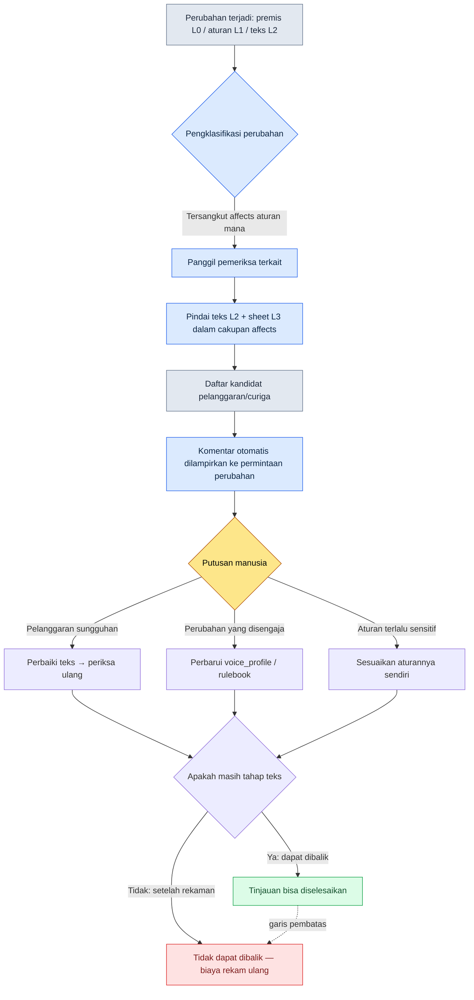

# 5.2 Verifikasi Konsistensi: Dunia → Karakter → Quest

Tepat sebelum beta, sebuah laporan bug masuk dari QA. Judulnya: "Sang Raja berbicara dengan bahasa kasar." Isinya singkat. "Pada cutscene pembuka 3.4, K_001 (Raja) berkata kepada pemain 'Hei, tunggu sebentar'. Karakter ini memakai 'engkau' di seluruh 1.1 sampai 3.3."

Ketika saya tanyakan ke penulis naskah, jawabannya tak terduga. "Dialog itu bukan saya yang menulis." Setelah ditelusuri, ternyata seorang penulis lepas (outsource) memasukkannya saat buru-buru mengisi satu baris cabang cutscene. Character bible kami memang memuat voice_profile, tetapi penulis lepas itu belum pernah melihat dokumen tersebut. Aturannya ada di dalam dokumen, tetapi dialognya masuk dari luar dokumen.

Inilah hakikat dari insiden konsistensi. Bukan karena aturannya tidak ada, melainkan karena aturannya tidak ikut sampai ke teks. Dan jika satu baris ini berupa cutscene, masalahnya jadi lebih menakutkan. Cutscene biasanya disertai rekaman pengisi suara. Saat masih berupa teks, sekali perbaiki selesai; tetapi jika ditemukan setelah direkam, akan mengikuti biaya tak dapat dibalik berupa memanggil ulang pengisi suara, merekam ulang, dan mengulang mixing. Tujuan sejati verifikasi konsistensi adalah menangkapnya "sebelum direkam".

Bab ini membahas alur kerja yang menangkap insiden itu dengan rulebook dan pemeriksa (checker), bukan dengan mata manusia. Kita akan melihat — apa adanya, langsung dari produk nyata — bagaimana rulebook lore_consistency_rule menjadi masukan bagi pemeriksa, bagaimana voice_lint mengangkat goyangan nada (tone) sebagai kandidat curiga, dan mengapa khusus putusan akhir harus tetap menjadi ranah manusia sampai akhir.

---

## 5.2.1 Di Mana Insiden Konsistensi Bocor

Kalau kita kumpulkan ulasan pengguna dari RPG dan MMORPG yang sudah rilis, insiden konsistensi naratif menyatu ke beberapa pola. Jenisnya tampak berbeda-beda, tetapi penyebabnya hampir selalu sama.

- **Kontradiksi dunia (lore)**: Pada 1.1 "sihir dilarang" → pada 1.3 NPC memakai sihir seolah tak terjadi apa-apa
- **Goyangan voice**: NPC yang sama berubah gaya bicara dan tingkat hormatnya dari bab ke bab (insiden "raja yang kasar" di depan)
- **Konflik garis waktu**: NPC yang sudah mati muncul kembali dengan sehat di bagian akhir (sinkronisasi flag kematian terlewat)
- **Hadiah dan narasi tak selaras**: Secara narasi disebut "pedang anugerah dari Raja", tetapi di data hanya item rongsokan biasa
- **Kontradiksi relasi faksi**: Tepat setelah menyatakan permusuhan dengan Faksi A, NPC Faksi A justru menyapa dengan ramah

Kelima hal ini tampak seperti lima insiden berbeda, tetapi kalau ditelusuri, semuanya bocor dari titik yang sama. Layer 0 (premis dunia) atau Layer 1 (aturan) berubah, tetapi perubahan itu tidak menyebar sampai ke Layer 2 (teks) dan Layer 3 (sheet data). Aturannya sudah diperbarui, tetapi teksnya masih berhenti di atas aturan yang lama.

Mencoba mencegah ini dengan tinjauan manusia secara manual itu mustahil. Dalam satu bab terjalin 50 NPC, 2,000 baris dialog, dan 30 quest; ketika satu baris aturan diubah, mustahil bagi manusia menelusuri 100% sejauh mana dampaknya merembet. Satu baris yang terlewat tidak tertangkap di tahap tinjauan, lalu tertangkap di kolom ulasan setelah rilis.

Walau begitu, pemeriksaan otomatis pun tidak menjamin 100%. Intinya adalah pembagian peran. **Pemeriksaan otomatis dengan cepat mengangkat kandidat curiga, dan putusan dilakukan manusia.** Tujuan otomasi adalah mengurangi waktu tinjauan manusia, bukan menghilangkan manusia. Kalau premis ini dikaburkan, semua kegagalan yang akan dibahas di belakang akan mengikuti.

---

## 5.2.2 lore_consistency_rule — Rulebook yang Disuapkan ke Pemeriksa

Salah satu dokumen L1 di Proyek A adalah `lore_consistency_rule.md`. Dokumen ini sekaligus panduan yang dibaca manusia dan masukan yang diurai (parse) oleh pemeriksa. `atoms` dan `affects` di frontmatter mengikat kedua peran itu dalam satu tubuh.

```markdown
---
title: Aturan Konsistensi Lore
layer: L1
atoms:
  - lore_check_world_rule
  - lore_check_character_voice
  - lore_check_timeline
  - lore_check_faction_relation
related:
  derives_from: [world_premise, narrative_pillar]
  affects: [main_quest/*, character_bible/*, dialogue_id_table]
---

## 1. Aturan Dunia (World Rule)
- Dimulai dalam keadaan sihir dilarang → saat sihir dipakai, wajib mencantumkan (waktu, pengguna, justifikasi)
- Dewa dalam keadaan bungkam → dilarang menggambarkan respons langsung (mimpi/penglihatan diizinkan)

## 2. Aturan Voice Karakter
- Wajib merujuk voice_profile masing-masing karakter
- Saat menulis dialog baru, patuhi 5 item voice_profile (kosakata, panjang kalimat, tingkat hormat, ekspresi emosi, ungkapan terlarang)

## 3. Aturan Garis Waktu
- Definisikan status_timeline untuk setiap NPC (hidup / terluka / mati / hilang / berpindah lokasi)
- Periksa otomatis status_timeline pada saat dialog/kemunculan

## 4. Aturan Relasi Faksi
- Catat waktu perubahan faction_relation_matrix
- Dialog setelah perubahan harus mencerminkan relasi yang baru
```

Satu baris `affects` mendefinisikan cakupan pemindaian (scan) pemeriksa. Ketika world_premise berubah, pemeriksa menyapu ulang seluruh `main_quest/*`, `character_bible/*`, dan `dialogue_id_table`. Pekerjaan yang dulu ditelusuri manusia di dalam kepala — "dampaknya sampai ke mana?" — kini digantikan oleh graf dependensi yang tertulis di rulebook.

voice_profile adalah aset L2 terpisah yang dirujuk oleh rulebook ini. Profil satu karakter dimasukkan dalam bentuk angka dan enumerasi agar dapat dipakai pemeriksa sebagai patokan perbandingan.

```yaml
# character_bible/K_001_voice_profile.yaml
character_id: K_001
display_name: Raja
voice_profile:
  vocabulary_register: kuno_formal        # ragam kosakata
  avg_sentence_len: 18                    # panjang kalimat rata-rata (karakter)
  honorific: "engkau"                     # sapaan hormat orang kedua (tetap)
  emotion_expression: tertahan            # tingkat pengungkapan emosi
  forbidden_terms: ["hei", "tunggu sebentar", "wkwk"] # ungkapan terlarang
```

yaml ini harus ada agar insiden "raja berbicara kasar" menjadi item yang bisa dibandingkan mesin, bukan intuisi manusia. Kalau honorific-nya "engkau" tetapi di dialog muncul "hei", itu bukan opini melainkan kandidat pelanggaran aturan.

---

## 5.2.3 Alur Verifikasi Konsistensi

Begitu perubahan terjadi, pemeriksa langsung aktif. Alurnya sebagai berikut.



Percabangan terakhir adalah tulang punggung tersembunyi bab ini. Semua putusan konsistensi **harus selesai di tahap teks, yakni tahap yang dapat dibalik**. Kalau tinjauan sampai melewati rekaman dan casting, perbaikannya menjadi tidak dapat dibalik. Karena itu, pemeriksa seperti voice_lint dan timeline_lint yang penting bukan berjalan dengan cepat, melainkan berjalan **lebih awal**. Dialog cutscene harus lolos sekali sebelum masuk antrean rekaman.

Pemeriksanya ada empat jenis, masing-masing berkorespondensi satu lawan satu dengan satu seksi rulebook.

- `world_rule_lint.py` — Aturan dunia L1 + seluruh teks L2 → kandidat pelanggaran seperti penggunaan sihir, respons dewa, dsb.
- `voice_lint.py` — voice_profile + dialogue_id_table → dialog yang dicurigai mengalami goyangan voice
- `timeline_lint.py` — status_timeline NPC + seluruh waktu dialog/kemunculan → konflik seperti NPC mati yang muncul kembali
- `faction_lint.py` — faction_relation_matrix + nada dialog → dialog yang bertentangan dengan relasi

Keempat pemeriksa tidak 100% akurat. Karena itulah nama keluarannya bukan "pelanggaran", melainkan "kandidat curiga".

---

## 5.2.4 Worked Transcript: Menjalankan voice_lint Satu Putaran

Kalimat abstrak "ada pemeriksa" tak memberi rasa nyata. Mari kita jalankan sekali sungguhan. Berikut masukan yang mereproduksi insiden "raja berbicara kasar" tadi.

**setup** — Ambil dua baris dialog yang akan diperiksa dari dialogue_id_table.

```
dialogue_id_204  speaker=K_001  text="Hei, tunggu sebentar. Kamu bicara duluan."
dialogue_id_217  speaker=K_007  text="...sialan, gagal lagi. Ulang dari awal."
```

**prompt** — Pemeriksanya sendiri berjalan berbasis aturan (ekspresi reguler, perbandingan panjang, pencocokan kata terlarang). AI hanya ditempatkan di posisi menjelaskan "kenapa dicurigai" dalam bahasa alami yang bisa dibaca penulis naskah. Prompt LLM lengkap pada tahap pemeriksaan adalah sebagai berikut.

```
Ini kandidat curiga yang diangkat voice_lint. Jangan beri putusan,
cukup jelaskan dalam 1~2 kalimat saja item voice_profile mana yang sepertinya
dilanggar tiap kandidat, beserta alasannya.
Jangan menyimpulkan "melanggar/tidak melanggar", cukup sampai "dicurigai ~".

[voice_profile]
K_001: honorific="engkau", avg_sentence_len=18, forbidden=["hei","tunggu sebentar"]
K_007: forbidden=["sialan"]

[kandidat curiga]
- dialogue_id_204 (K_001): "Hei, tunggu sebentar. Kamu bicara duluan."
- dialogue_id_217 (K_007): "...sialan, gagal lagi. Ulang dari awal."
```

**Keluaran mentah Claude** (disalin apa adanya, tanpa ringkasan atau penyuntingan)

```
[dialogue_id_204 / K_001]
Dialog ini dicurigai bertentangan dengan item honorific. voice_profile menetapkan
sapaan hormat orang kedua sebagai "engkau", tetapi dialog ini memakai "kamu"
dan sapaan hormatnya sendiri tidak tampak. Selain itu, "hei" dan "tunggu sebentar"
dari forbidden_terms keduanya muncul, sehingga dicurigai menyimpang dari ragam
kosakata (kuno_formal). Terhadap patokan panjang kalimat rata-rata 18 karakter
tidak tampak langsung melanggar, tetapi nada bicaranya sendiri yang menjadi kasual
dicurigai sebagai sinyal pelanggaran.

[dialogue_id_217 / K_007]
"sialan" dari forbidden_terms dipakai apa adanya, sehingga dicurigai melanggar item
ungkapan terlarang. Namun item emotion_expression milik K_007 (cendekiawan) tidak
disediakan, sehingga sulit menilai hanya dari informasi ini apakah ungkapan ini
merupakan luapan emosi yang disengaja atau sekadar penyimpangan. Putusan memerlukan
tinjauan penulis naskah.
```

Pada keluaran ini ada dua kejujuran yang sengaja kami biarkan. Pertama, pada 204, AI berkata "panjang kalimat rata-rata tidak tampak langsung melanggar" — **ia tidak memaksakan item yang bukan pelanggaran sebagai pelanggaran.** Kedua, pada 217, AI berkata "item emotion_expression tidak disediakan sehingga sulit dinilai" — **ia mengakui kekurangan informasi dan menyerahkan putusan kepada manusia.** Seandainya AI mendorong semua kecurigaan menjadi "pelanggaran pasti", itu justru pemeriksa yang lebih berbahaya.

**verify** — Penulis naskah menerima komentar ini apa adanya dari permintaan perubahan. Putusan dilakukan penulis naskah.

- 204: Pelanggaran sungguhan. Dialog yang dimasukkan penulis lepas tanpa melihat voice_profile → perbaiki teks, periksa ulang
- 217: Pelanggaran yang disengaja. Dialog luapan emosi 3.4 saat K_007 runtuh → tambahkan flag `emotion_peak_exception` ke voice_profile, dan daftarkan 217 sebagai pengecualian

Kedua kandidat diangkat oleh pemeriksa yang sama, tetapi akhirnya berlawanan. Yang satu memperbaiki teks, yang satu memperbaiki aturan. Bahwa mesin tidak bisa melakukan percabangan ini secara otomatis adalah inti dari subbab berikutnya.

---

## 5.2.5 Mengapa Putusan adalah Ranah Manusia

Ada tiga alasan mengapa pemeriksa hanya mengangkat sampai kecurigaan dan menyerahkan putusan.

Pertama, **ada pelanggaran yang disengaja.** Di bab tempat karakter runtuh atau berubah, voice memang sengaja digoyangkan. 217 di atas adalah contohnya. Pemeriksa bertipe penolakan otomatis akan menghadang maksud pengarahan (directing) penulis naskah.

Kedua, **aturannya sendiri berevolusi.** Kalau jenis kecurigaan yang sama terus-menerus diputus sebagai "perubahan yang disengaja", itu sinyal bahwa aturan gagal mengikuti kenyataan. Hasil pemeriksaan bukan hanya membuat teks diperbaiki, melainkan juga membuat rulebook diperbaiki.

Ketiga, **karakter dan faksi baru memerlukan masa belajar.** NPC baru yang voice_profile-nya baru terisi dua-tiga item adalah hal wajar kalau banyak memunculkan kecurigaan. Kalau di masa ini kita pasang penolakan otomatis, penulis naskah akan menganggap pemeriksa sebagai musuh.

Batas antara pemeriksaan otomatis dan putusan manusia harus jelas agar pemeriksa bertahan hidup. Kalau dibuat bertipe penolakan otomatis, dalam sebulan para penulis naskah akan bilang "matikan saja ini". Sama seperti memasang sensor otomatis yang terlalu peka di pintu masuk kantor: setiap ada orang lewat, pintunya menutup, sampai akhirnya seseorang mencopot sensornya. Pemeriksa harus menjadi perangkat yang memberi tahu "ada yang lewat di sini", bukan perangkat yang menutup pintu.

Saya tambahkan satu catatan. Prinsip bahwa tinjauan harus selesai di tahap teks (garis pembatas pada flowchart di depan) juga berlaku sama pada putusan manusia. Putusan "pelanggaran yang disengaja" oleh penulis naskah pun harus selesai sebelum rekaman. Pembatalan setelah rekaman berubah dari masalah pemeriksa menjadi masalah biaya proses (gambaran utuh batas dapat-dibalik/tidak-dapat-dibalik ada di 5.4.5).

---

## 5.2.6 Pengukuran — Sebelum dan Sesudah 6 Bulan

Di Proyek A, kami memperkenalkan 4 jenis pemeriksa secara bertahap dan mengukur selama 6 bulan. Berikut berbasis log hasil pengukuran nyata, tetapi dipindahkan dalam arah dan rasio alih-alih nilai absolut (pengukuran internal, bukan perkiraan penulis).

- **Waktu tinjauan untuk 1 bab**: sebelum diperkenalkan sekitar 5 hari → setelah diperkenalkan sekitar 2 hari (separuh atau kurang)
- **Insiden konsistensi yang ditemukan setelah rilis**: 3\~5 kasus per bab → 0\~1 kasus
- **Kecepatan output bab per penulis naskah**: 4 minggu → 2.5 minggu
- **Frekuensi pembaruan rulebook (L1)**: 1\~2 kali per kuartal → 1\~2 kali per bulan

Item terakhir paling menarik. Kalau ada pemeriksa, mengubah aturan sesering apa pun tetap aman. Begitu satu baris aturan diubah, dampaknya otomatis terlihat, sehingga rasa takut akan perubahan berkurang dan aturan berevolusi lebih cepat. Efek sejati dari alat konsistensi lebih dekat ke "jadi bisa mengubah aturan tanpa takut" daripada ke "mengurangi insiden".

Hanya saja, angka di atas adalah angka pada saat 4 jenis pemeriksa semuanya beroperasi. Yang lebih penting, di awal pengenalan, voice_lint saja sudah memberi efek yang kasatmata. Tidak perlu menyalakan keempat jenis sekaligus sejak awal.

---

## 5.2.7 Di Mana Menempatkan AI

Untuk badan pemeriksa otomatis, berbasis aturan lebih efisien. Kepercayaan menumpuk ketika masukan yang sama menghasilkan keluaran yang sama, dan LLM bersifat non-deterministik sehingga tidak cocok di posisi itu. AI masuk ke empat posisi lain.

- **Deteksi kandidat pelanggaran aturan** → aturan (ekspresi reguler, kata kunci, panjang, pemeriksaan struktur). Bukan LLM
- **Penjelasan alasan kandidat curiga** → LLM. Penjelasan bahasa alami "kenapa dicurigai" yang kita lihat di worked transcript di atas
- **Pembuatan draf dialog alternatif** → LLM. Draf untuk ditinjau penulis naskah; finalisasi oleh penulis naskah
- **Usulan kandidat pembaruan otomatis voice_profile** → LLM. Mengekstrak pola dari teks puluhan bab dan menyajikan usulan penguatan item

Aturan itu cepat dan deterministik, sedangkan LLM kuat dalam penjelasan dan pembuatan. Kalau peran keduanya dicampur, keduanya rusak. Kalau pemeriksaan diserahkan ke LLM, akan terjadi dialog yang sama kemarin lolos hari ini tersangkut; kalau penjelasan diserahkan ke ekspresi reguler, yang keluar hanyalah bahasa mesin "pelanggaran item honorific".

---

## 5.2.8 Urutan Pengenalan dan Kegagalan yang Umum

Kalau membuat keempat jenis pemeriksa sejak awal, beban datang lebih dulu daripada efek. Urutan yang disarankan adalah dari yang paling murah dan paling besar efeknya.

1. **Standardisasi 5 item voice_profile** (sekitar 1 bulan) — Tetapkan dulu format character_bible. Ini lebih dahulu daripada pemeriksa
2. **Versi minimal voice_lint** (sekitar 1 minggu) — Hanya pencocokan kosakata terlarang. Menghalangi satu kata saja sudah mengurangi insiden SNS pascarilis sebanyak 1\~2 kasus per kuartal
3. **timeline_lint** (1\~2 minggu) — Pemeriksaan flag kematian. Hanya dengan menangkap NPC mati yang muncul kembali pun sudah terasa besar
4. **world_rule_lint + faction_lint** (1\~2 bulan) — Dua jenis sisanya
5. **Bantuan LLM** (tambahan 1\~2 bulan) — Mengintegrasikan penjelasan dan pembuatan draf

Saya tegaskan bahwa tahap 2 (voice_lint) saja sudah memberi efek besar. Insiden "raja yang kasar" di depan persis jenis yang tertangkap hanya dengan tahap ini.

Kegagalan yang berulang dalam proses pengenalan pun hampir sudah pasti.

- **Membuatnya bertipe penolakan otomatis** → kembalikan ke struktur kandidat curiga + putusan manusia
- **Rulebook dioperasikan terpisah dari penulis naskah** → jadikan kesepakatan penulis naskah wajib untuk mengubah rulebook, dan beri penulis naskah kemampuan meminta perubahan rulebook
- **voice_profile sekadar formalitas** → isi penuh 5 item dengan 1 karakter dulu, baru perluas
- **Tidak tahu di mana hasil pemeriksaan berada** → wajibkan pelampiran otomatis ke komentar permintaan perubahan
- **Menyuruh LLM melakukan pemeriksaan itu sendiri** → pemeriksaan dengan aturan, hanya penjelasan dengan LLM
- **Meninjau setelah rekaman** → tinjauan selesai di tahap teks. Jangan melewati rentang yang dapat dibalik

Item terakhir lebih mahal daripada semua item di atas. Kegagalan lain kehilangan waktu, tetapi kegagalan ini kehilangan jadwal pengisi suara.

---

Pada bab berikutnya (5.3) kita membahas alur menulis teks naratif dengan bantuan AI alih-alih pemeriksa. Kita akan melihat cara menyuntikkan nada L0 dan aturan L1 sebagai konteks, sehingga AI menghasilkan jawaban dunia kita, bukan jawaban yang umum.

---

### Poin-Poin Penting
- Insiden konsistensi terjadi bukan karena aturannya tidak ada, melainkan karena aturannya tidak menyebar sampai ke teks.
- Pemeriksa harus hanya mengangkat sampai kecurigaan dan putusan dilakukan manusia, agar pemeriksa tidak dibuang.
- Semua tinjauan konsistensi harus selesai di tahap teks (dapat dibalik) sebelum rekaman.

### Pratinjau Bab Berikutnya
- 5.3. Penulisan Naratif Berbantuan AI — Penyuntikan konteks nada L0 dan aturan L1

---

## Coba Sendiri

**setup** — Pilih 1 karakter dari character_bible dan isi penuh 5 item voice_profile (ragam kosakata, panjang kalimat rata-rata, sapaan hormat, ekspresi emosi, ungkapan terlarang) dalam bentuk yaml. Ambil 10 baris dialog lama dari karakter yang sama dari dialogue_id_table dan kumpulkan dalam satu berkas.

**prompt** — Pakai apa adanya prompt bantuan pemeriksaan dari worked transcript di atas. Intinya dua batasan. "Jangan memberi putusan" dan "katakan hanya sampai dicurigai \~". Lampirkan voice_profile yaml dan 10 baris dialog pada masukan.

**verify** — Putuskan sendiri satu per satu baris kandidat curiga yang dikeluarkan. Kalau pelanggaran sungguhan perbaiki teks, kalau perubahan yang disengaja tambahkan flag pengecualian ke voice_profile. Periksa juga apakah AI memaksakan "item yang bukan pelanggaran" sebagai pelanggaran, dan apakah ia mengakui "kekurangan informasi". Kalau AI menyimpulkan semua item sebagai pelanggaran, perkuat batasan "jangan memberi putusan" pada prompt.

### Versi Ringkas Solo

Kalau Anda pengembang solo tanpa 4 jenis pemeriksa maupun rulebook, Anda bisa mencapai efek yang sama hanya dengan satu prompt, tanpa badan pemeriksa. Cukup pelihara voice_profile yaml per karakter dengan tangan, dan setiap kali menulis dialog baru, lampirkan yaml karakter terkait + dialog baru ke prompt bantuan di atas untuk menerima "kandidat curiga". Memang tak ada otomasi, tetapi struktur intinya — **putusan oleh manusia, AI memberi penjelasan** — tetap hidup sama persis. Cukup patuhi satu baris saja — lewati tinjauan ini satu kali sebelum menyerahkannya ke rekaman atau sintesis suara. Prinsip tidak melewati tahap yang dapat dibalik tak ada hubungannya dengan ukuran tim.
