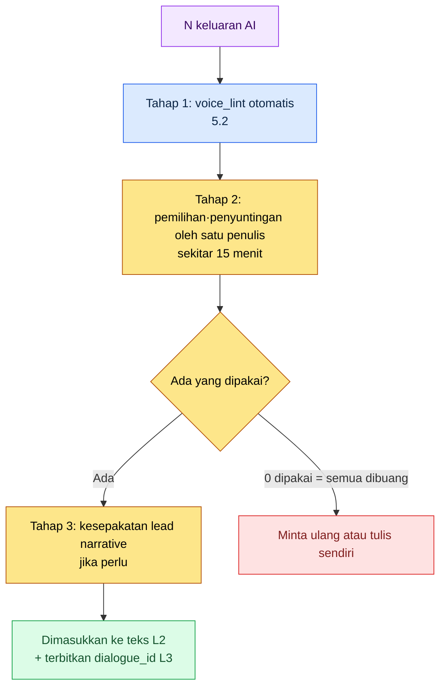
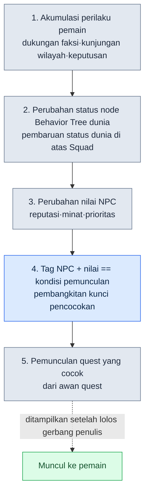

# 5.3 Penulisan Naratif dengan Bantuan AI

Hari itu saya sedang menyusun dialog pertama untuk sebuah NPC sampingan baru. Ke dalam jendela obrolan yang kosong saya ketik, "Buatkan 5 dialog untuk NPC pandai besi desa." Lima detik kemudian muncul di layar, "Wahai pahlawan, percayakanlah senjatamu kepadaku." Kalimat itu bukan sekadar terasa pernah saya lihat di suatu tempat — saya bahkan seolah tahu persis di mana saya pernah melihatnya. Jika prompt yang sama saya masukkan ke game lain dari tim lain, jawabannya pun pasti sama persis. Yang saya sadari saat itu bukanlah bahwa modelnya lemah, melainkan bahwa saya sama sekali tidak memberi tahu model apa pun tentang game kami.

AI piawai menulis kalimat fantasi yang umum. Namun, AI tidak bisa menulis kalimat dunia kita. Perbedaannya cuma satu: injeksi konteks. Jika tone L0 dan rule L1 dikirim bersama pada setiap permintaan, satu baris yang dikeluarkan AI berubah dari "kalimat yang terasa pernah dilihat di suatu tempat" menjadi "kalimat game ini." Bab ini membahas praktik mengoperasikan injeksi itu dalam empat lapisan, dan di akhir menyoroti penerapan progresif yang mengangkat prinsip yang sama ke skala simulasi dunia (Behavior Tree dunia (BehaviorTree, pohon perilaku) + awan quest) sebagai garis terdepan RnD.

---

## 5.3.1 Apa yang Terjadi Ketika Konteks Kosong

Di bidang naratif, bantuan AI adalah area yang paling cepat diadopsi dan paling cepat kehilangan kepercayaan. Sebabnya, pola kegagalannya hampir selalu sama.

Jika Anda lempar "5 dialog pembuka quest," yang kembali adalah 5 jenis fantasi umum yang diawali dengan "Wahai pahlawan, desa kami ini...". Jika Anda minta "Tolong perbaiki dialog karakter ini," voice-nya jadi rata sehingga semua NPC menyatu ke gaya bicara yang mirip-mirip. Jika Anda minta "Tuliskan sinopsis Bab 1," yang keluar adalah nilai rata-rata dari sinopsis-sinopsis RPG yang pernah dilihat.

Masalahnya bukan pada model, melainkan pada konteks yang kosong. Model mengeluarkan rata-rata dari data pelatihannya. Jika Anda tidak menginginkan rata-rata, Anda harus memberi petunjuk yang menjauhkannya dari rata-rata. Tema bab ini adalah bagaimana membuat dan menginjeksikan petunjuk itu.

Pada proyek MMORPG yang saya kelola (selanjutnya disebut Proyek A), bantuan AI naratif menumpuk empat lapisan konteks secara berurutan. Struktur yang di 5.1 menguraikan NarrativeDocs menjadi Layer 0\~4 itu, di sini dipakai ulang persis sebagai unit injeksi.

<svg viewBox="0 0 720 300" xmlns="http://www.w3.org/2000/svg" font-family="sans-serif">
  <rect x="20" y="20" width="680" height="46" rx="6" fill="#1f2d3d"/>
  <text x="40" y="40" fill="#fff" font-size="14" font-weight="bold">Layer A · System Prompt</text>
  <text x="40" y="58" fill="#9fb3c8" font-size="11">Persona penulis · pantangan (hampir tidak berubah, didefinisikan sekali)</text>

  <rect x="20" y="78" width="680" height="46" rx="6" fill="#27496d"/>
  <text x="40" y="98" fill="#fff" font-size="14" font-weight="bold">Layer B · Visi L0</text>
  <text x="40" y="116" fill="#bcd4e6" font-size="11">world_premise · narrative_pillar · tone_manifesto (≈7,000 tok, di-cache)</text>

  <rect x="20" y="136" width="680" height="46" rx="6" fill="#2e6171"/>
  <text x="40" y="156" fill="#fff" font-size="14" font-weight="bold">Layer C · Rule L1 (injeksi selektif)</text>
  <text x="40" y="174" fill="#cfe8df" font-size="11">Hanya bagian _summary dari rule yang relevan dengan tugas (di-cache)</text>

  <rect x="20" y="194" width="680" height="46" rx="6" fill="#3e885b"/>
  <text x="40" y="214" fill="#fff" font-size="14" font-weight="bold">Layer D · Teks Berdekatan L2</text>
  <text x="40" y="232" fill="#e3f2e8" font-size="11">Dialog langsung sebelumnya dari karakter yang sama · sinopsis bab yang sama (apa adanya, berubah tiap kali)</text>

  <rect x="180" y="254" width="360" height="36" rx="6" fill="#c0392b"/>
  <text x="200" y="277" fill="#fff" font-size="13" font-weight="bold">Instruksi tugas: "3 opsi dialog K_007 pada titik ini"</text>

  <line x1="360" y1="66" x2="360" y2="78" stroke="#888" stroke-width="2"/>
  <line x1="360" y1="124" x2="360" y2="136" stroke="#888" stroke-width="2"/>
  <line x1="360" y1="182" x2="360" y2="194" stroke="#888" stroke-width="2"/>
  <line x1="360" y1="240" x2="360" y2="254" stroke="#888" stroke-width="2"/>
</svg>

Tidak setiap kali keempat lapisan dimasukkan semua. Hanya lapisan yang diperlukan yang dikeluarkan sesuai jenis tugas. Untuk draf dialog berikutnya dari satu karakter, cukup A + B (tone saja) + D (10 baris dialog terakhir karakter itu). Untuk sinopsis quest sampingan baru, ditambahkan C (rule struktur quest). Untuk 4 opsi hasil percabangan, C (rule percabangan) + D (seluruh teks tepat sebelum percabangan) menjadi lebih berat. Ibarat memilih lembar persona, satu baris worldview, halaman rulebook, dan seikat teks berdekatan dari laci dokumen di atas meja, lalu mengirimnya sesuai ukuran tugas.

---

## 5.3.2 Satu Worked Transcript — Dialog Emosional Pertama K_007

Alih-alih menjelaskan secara abstrak, saya akan mengikuti satu permintaan nyata sampai tuntas. Tugasnya adalah menyusun 3 opsi dialog untuk adegan di mana karakter yang sama (NPC bertipe sarjana, ID internal `K_007`) untuk pertama kalinya harus menunjukkan emosi. Saya mulai dari prompt selengkapnya.

**Prompt yang dikirim (Layer A + B (tone) + D + instruksi tugas + format keluaran):**

```
[SISTEM]
Kamu penulis naratif Proyek A. Jangan pakai klise RPG seperti "pahlawan" atau "sang terpilih",
ikuti tone gaya bicara dari dialog terakhir di bawah persis seperti itu. Jangan mengarang setelan yang tidak kamu ketahui,
jawab saja "Tidak bisa ditentukan dari konteks". Kamu cuma membuat draf, keputusan ada di tanganku.

[Tone L0 — kutipan tone_manifesto]
Emosi dunia ini adalah pengendalian diri. Tokoh tidak mudah mengucapkan perasaannya.
Emosi muncul bukan sebagai ledakan, melainkan sebagai retakan. Elipsis dan kalimat pendek.

[Referensi — 5 dialog terakhir K_007 (urut waktu, apa adanya)]
1. "...itu pun baru pertama kali saya dengar."
2. "Ada catatannya? Kalau tidak ada, kita harus meragukannya."
3. "Jangan bergerak sampai semuanya pasti."
4. "Sekian pendapat saya."
5. "...Maaf. Apa saya terlalu dingin tadi?"

[Situasi]
NPC rekan kembali dalam keadaan terluka. Untuk pertama kalinya sang sarjana harus menunjukkan emosi.

Cukup 3 opsi saja, masing-masing maksimal 25 karakter. Bubuhkan label di akhir tiap opsi (tipe reaksi: marah/sedih/menyangkal),
dan hilangkan penjelasan atau kata pembuka.
```

**Keluaran mentah Claude (apa adanya, tanpa ringkasan atau penyuntingan):**

```
1. "...kenapa kamu pikul itu sendirian. Bodoh sekali." (tipe reaksi: sedih)
2. "Mestinya kulihat catatannya. Aku, aku terlewat." (tipe reaksi: menyangkal)
3. "Tidak apa-apa. Semua baik-baik saja. Jadi berhenti—" (tipe reaksi: menyangkal)
```

Yang penting adalah tidak berhenti di sini. Penulis membaca ketiga opsi dan memverifikasinya. Opsi 1 tone-nya pas. Retakan yang ditunjukkan "...Maaf" pada dialog terakhir nomor 5 dilanjutkan oleh opsi 1 lewat satu kata, "Bodoh sekali." Ini kandidat untuk dipakai. Opsi 2, gagapnya "Aku, aku terlewat" sedikit menyimpang dari pengendalian diri sang sarjana. Ditahan. Opsi 3 labelnya salah. Mengulang "Tidak apa-apa" itu bukan menyangkal melainkan lebih dekat ke menghindar, padahal di voice_profile kita tidak ada pola sang sarjana memproses emosi dengan menghindar. Ditolak.

**Permintaan ulang (dikirim kembali dengan alasan penolakan dijelaskan):**

```
Opsi 3 ditolak. Pengulangan "Tidak apa-apa" bukan pola sarjana ini. Dia memproses emosi
bukan sebagai penghindaran, melainkan sebagai 'menyalahkan diri atas kegagalan memverifikasi fakta'. Opsi 1 akan kupakai.
Untuk posisi opsi 2 dan 3, beri lagi dua opsi yang nuansanya berbeda dari opsi 1. Tanpa gagap, maksimal 25 karakter.
```

**Keluaran kedua Claude:**

```
2. "Catatan tidak berbohong. Akulah yang tak melihatnya." (tipe reaksi: menyalahkan diri)
3. "...Duduklah. Lukanya dulu. Bicara nanti." (tipe reaksi: sedih)
```

Kali ini keduanya lolos. Opsi 2 memakai ulang "catatan", kosakata inti sang sarjana (dialog terakhir nomor 2 "Ada catatannya?"), sebagai medium menyalahkan diri; opsi 3 lewat bentuk perintah yang terkendali menunjukkan pola sang sarjana menekan emosi menjadi tindakan. Yang akhirnya dipakai adalah opsi 1 + opsi 2 + opsi 3. Ketiga baris ini, setelah lolos pemeriksaan otomatis `voice_lint` dari 5.2, dimasukkan ke teks L2 dan menerima `dialogue_id` di L3.

Dalam satu transcript ini terkandung segala isi bab ini. Injeksi tone (L0) menyelamatkan opsi 1, teks berdekatan apa adanya (L2) membuat kosakata "catatan" milik sang sarjana dipakai ulang pada permintaan ulang, pemaksaan format keluaran mencegah obrolan basa-basi, dan gerbang penolakan penulis menyaring label keliru pada opsi 3. AI tidak menentukan satu baris pun secara final.

---

## 5.3.3 Layer A — System Prompt, Satu Baris Menentukan Segalanya

Inilah definisi persona yang menjadi alas paling atas. Ditetapkan sekali dan hampir tidak diubah. Blok sistem pada transcript di atas adalah wujud nyatanya. Dari kelima baris, baris terakhir ("Penulisan draf, keputusan ada di penulis") yang paling penting. Jika baris ini hilang, AI dengan percaya diri menyodorkan kalimat yang berpura-pura "final", dan penulis pun bukan memeriksa melainkan menilai. Lalu baris ketiga ("Jangan membuat setelan yang tidak diketahui, jawab tidak bisa ditentukan") adalah yang kedua terpenting. Tanpa baris ini, model mengisi ruang kosong dengan kebohongan yang masuk akal. Dalam naratif, kebohongan yang masuk akal akan kembali beberapa hari kemudian sebagai benturan lore.

---

## 5.3.4 Layer B — Posisi Visi L0 dan Caching

L0 berukuran kecil (sekitar 4.5 bab menurut acuan 5.1). Hampir selalu bisa diinjeksikan seluruhnya tiap kali. Berdasarkan perkiraan dengan acuan bahasa Korea, `world_premise.md` sekitar 2,500 token, `narrative_pillar.md` sekitar 1,500 token, `tone_manifesto.md` sekitar 3,000 token, totalnya sekitar 7,000 token. (Angka-angka ini adalah perkiraan penulis dan belum terverifikasi. Nilainya berbeda tergantung tokenizer dan revisi dokumen.)

Mengirim 7,000 token baru pada setiap permintaan akan menumpuk biaya. Karena itu kita pasang prompt caching. Ini fitur yang didukung baik oleh Anthropic maupun OpenAI, dan saat cache hit biaya token masukan turun drastis. Intinya adalah memisahkan yang berubah dari yang tidak berubah di dalam pesan.

```python
messages = [
    {"role": "system", "content": SYSTEM_PROMPT},
    {"role": "user", "content": [
        {"type": "text", "text": L0_FULL,      "cache_control": {"type": "ephemeral"}},
        {"type": "text", "text": L1_SELECTED,  "cache_control": {"type": "ephemeral"}},
        {"type": "text", "text": L2_ADJACENT},   # berubah tiap kali — tidak di-cache
        {"type": "text", "text": TASK_INSTRUCTION},  # berubah tiap kali
    ]},
]
```

L0 dan L1 yang dipasangi `cache_control` adalah target cache, sedangkan teks berdekatan L2 dan instruksi tugas berubah tiap kali sehingga tidak di-cache. Selalu mengumpulkan blok cache di bagian depan pesan adalah yang menentukan tingkat hit. Jika blok yang berubah terselip di depan, semua cache setelahnya menjadi tidak valid. Mengacaukan urutan ini adalah penyebab paling umum mengapa biaya tidak turun meski caching sudah diaktifkan.

> Rincian angka tingkat cache hit dan penghematan biaya dibahas di bab Part 22 (biaya). Di sini cukup mengingat prinsip "dorong yang berubah ke belakang".

---

## 5.3.5 Layer C — Jangan Memasukkan Rule L1 Seutuhnya

Rulebook L1 berukuran besar, sehingga jika dimasukkan semua konteks akan meledak, dan yang lebih buruk, model justru kehilangan inti. Pilih hanya rule yang relevan dengan tugas, itu pun cuma bagian `_summary`-nya.

Saat menyusun hasil percabangan main quest, pilih `dialogue_branching_rule` dan `faction_relation_matrix`. Untuk dialog NPC baru, `voice_profile` dan `tone_manifesto` NPC yang bersangkutan. Untuk entri baru kamus lore, `lore_consistency_rule` dan `world_premise`. Untuk kerangka quest sampingan, `quest_template` dan `reputation_model`. Pemilihan dilakukan langsung oleh manusia atau diekstrak otomatis dengan menelusuri graf wikilink (Part 7), dan saat ekstraksi otomatis, recall diutamakan di atas precision. Sebab kerugian satu rule terlewat jauh lebih besar daripada kerugian satu rule berlebih masuk.

Alih-alih memasukkan seluruh isi rulebook, taruh bagian `_summary` di kepala file rulebook dan injeksikan hanya itu.

```markdown
---
title: Rule Percabangan
layer: L1
---

## _summary
- Percabangan hanya terjadi di akhir bab
- Percabangan 2~3 opsi. Dilarang 4 opsi atau lebih
- Pilihan percabangan memengaruhi reputasi +/-1, percabangan akhir +/-3
- Semua hasil percabangan harus menunjukkan hasilnya dalam 24 jam
- Percabangan tidak dapat dibalik (UI yang menyarankan pemisahan save ditampilkan)

## 1. Rule titik waktu terjadinya percabangan
(Penjelasan rinci, untuk acuan operator — tidak diinjeksikan ke LLM)
...
```

5 baris `_summary` lebih efektif bagi kualitas keluaran LLM daripada 50 baris isi. Model lebih patuh pada aturan yang pendek dan tegas. Penjelasan panjang memecah perhatian model, dan perhatian yang terpecah kembali sebagai pelanggaran aturan.

---

## 5.3.6 Layer D — Teks Berdekatan Jangan Diringkas

Dialog langsung sebelumnya, quest berdekatan, sinopsis bab yang sama. Ini konteks dengan fluktuasi terbesar. Untuk dialog baru karakter yang sama, masukkan 10 baris dialog terakhir karakter itu menurut urutan waktu; untuk quest pertengahan bab, masukkan sinopsis bab dan ringkasan 1 baris quest-quest di bab yang sama; untuk akhir hasil percabangan, masukkan seluruh teks tepat sebelum percabangan dan teks pilihan. Jika dimasukkan terlalu banyak, LLM mengeluarkan rata-rata; jika terlalu sedikit, keluaran jadi tergeneralisasi. Titik optimalnya berada di antara 1,500\~3,000 token (menurut pengamatan penulis, belum terverifikasi).

Satu aturan inti. Teks berdekatan dimasukkan apa adanya tanpa diolah atau diringkas. Pada transcript di atas, karena 5 baris dialog terakhir sang sarjana dimasukkan tanpa disentuh, model bisa menangkap persis kata "catatan" pada tahap permintaan ulang dan memakainya kembali sebagai medium menyalahkan diri. Andai kelima baris itu diringkas menjadi "Sang sarjana itu cermat dan dingin" lalu dimasukkan, seluruh pilihan halus penulis akan lenyap dan model kembali lagi ke rata-rata. Meringkas bukan mengurangi informasi, melainkan menghapus keputusan yang sudah diambil penulis.

---

## 5.3.7 Alur Kerja Tinjauan Penulis — Memakai Tingkat Pembuangan sebagai Metrik

Keluaran AI selalu draf. Tinjauan melewati gerbang yang sudah ditetapkan.



Kasus penulis memilih 0 dari N opsi (semua dibuang) pun normal. Sebagaimana opsi 3 ditolak pada transcript di atas, penolakan bukanlah kegagalan melainkan bukti bahwa gerbang bekerja. Karena itu tingkat pembuangan diukur per penulis dan per karakter, lalu dijadikan metrik kualitas injeksi konteks.

Tingkat pembuangan 0\~20% berarti operasi stabil dengan konteks yang memadai, jadi biarkan apa adanya. 20\~50% adalah rentang operasi umum, jadi cukup dipantau. Jika naik ke 50\~80%, periksa ulang apakah pemilihan rule L1 ada yang terlewat. Jika melewati 80%, itu bukan masalah rule individual melainkan system prompt atau persona itu sendiri yang menyimpang, jadi tulis ulang Layer A. Tingkat pembuangan dihimpun per penulis seminggu sekali dan dibagikan dalam retrospektif.

Namun, tingkat pembuangan bukan metrik mutlak. Karakter yang berubah cepat (misalnya titik balik di mana untuk pertama kalinya menunjukkan emosi, seperti K_007 pada transcript di atas) wajar saja punya tingkat pembuangan tinggi. Angka adalah awal percakapan, bukan vonis.

---

## 5.3.8 Keamanan — Bagaimana Mencegah Kebocoran Konteks

L0\~L1 adalah IP inti game. Jika mengirimkannya apa adanya ke API LLM eksternal terasa membebani, pilihan pun bercabang. Memakai API eksternal apa adanya dengan kontrak tanpa-pelatihan adalah cara tercepat, tetapi butuh tinjauan hukum. Cara mengganti nama perusahaan dan nama diri menjadi placeholder lalu mengirimnya menambah biaya pemrosesan dan merusak kealamian. Self-hosting (model terbuka) aman bagi data tetapi beban kualitas dan operasinya besar. Hibrida yang menaruh L0 di internal dan hanya mengirim draf ke luar rumit dalam pengoperasiannya.

Proyek A milik penulis memakai cara pertama (API eksternal + kontrak tanpa-pelatihan). Cara kedua pernah dicoba lalu ditinggalkan. Sebab penggantian placeholder meratakan teks menjadi bentuk "Sarjana ○○ dari Kerajaan ○○ berbicara tentang ○○" dan meruntuhkan kualitas keluaran. Anonimisasi yang mematikan kualitas adalah trade-off yang berulang di sepanjang buku ini (lihat bab anonimisasi Part 1). Dalam naratif, kerusakan itu terutama besar. Sebab nama diri itu sendiri adalah tone.

---

## 5.3.9 Kegagalan Umum dan Penanganannya

Jika hanya melempar instruksi tugas tanpa system prompt, yang keluar rata-rata. Pasang persona dan pantangan lebih dulu. Jika menginjeksikan L0 seluruhnya tiap kali tanpa memakai caching, biaya bocor. Kumpulkan blok cache ke depan. Jika memasukkan rulebook L1 seutuhnya, model kehilangan inti. Ambil hanya bagian `_summary`. Jika memasukkan teks berdekatan yang diringkas, pilihan penulis terhapus. Kutip apa adanya. Jika tidak menetapkan format keluaran, sebagian besar respons diawali dengan "Berikut 3 kandidat:", dan menyusul pula insiden penulis salah mengira kata pembuka itu sebagai isi teks. Tentukan jumlah, panjang, dan label secara eksplisit. Jika keluaran AI dipakai sebagai final, gerbang tinjauan runtuh. Selalu loloskan melalui gerbang penulis. Jika tingkat pembuangan tidak diukur, kesehatan alat bergantung pada kesan manusia. Himpun secara mingguan dan bagikan dalam retrospektif.

---

## 5.3.10 Dari Penerapan Konservatif ke Penerapan Progresif

Sejauh ini adalah penerapan konservatif. Penulis menginjeksikan konteks dengan saksama, dan AI hanya membuat draf baris demi baris. Unitnya adalah tugas kecil seperti "3 opsi dialog berikutnya karakter ini" atau "sinopsis quest ini". Stabil, tetapi punya keterbatasan pada skala produksi massal dan responsivitas dinamis.

Di sini saya tegaskan dulu satu hal. Procedural generation, simulasi dunia, dan quest dinamis adalah visi yang sudah digambar para Game Designer di atas kertas sejak 20\~30 tahun lalu. PCG berbasis rulebook deterministik menangani area numerik seperti ruang dungeon, opsi senjata, dan distribusi spawn, tetapi belum menyentuh teks bahasa alami, persona karakter, percabangan naratif, dan dialog NPC. Sebagian besar perancangan, boleh dibilang, tetap tertahan di atas kertas. Kemajuan LLM dan model gambar pada 2024\~2026 membawa area itu ke posisi yang bisa diimplementasikan. Makna inti dari kemajuan AI bukanlah skor model, melainkan terbukanya kelayakan realisasi atas perancangan yang lama tertahan di kertas. Hanya saja, terbukanya kemungkinan dengan menetap menjadi sistem yang dapat dioperasikan adalah dua persoalan berbeda.

### Penguraian Layer Adalah Prasyarat Procedural Generation

Penguraian Layer 0\~4 di 5.1 bukan sekadar penataan, melainkan prasyarat procedural generation. Bagaimana kelima lapisan masing-masing berpadanan dengan tahapan tertentu pipeline pembangkitan (L0 jangkar → rulebook L1 → teks L2 → numerik L3 → gerbang L4) sudah dibahas di §6.6 dan 5.1.11. Intinya satu — di atas dokumen yang menggumpal jadi satu, generator tidak bisa menentukan dari mana harus membaca dan ke mana harus menulis, konteks mengabur karena tak tahu di mana L0 berada, dan L1·L2 berbenturan dalam satu file sehingga lini produksi runtuh. Penguraian Layer ada lebih dulu, dan di atasnya procedural generation bekerja. Di sini, prasyarat itu diterapkan pada tahap produksi massal bantuan AI naratif.

### Kerangka Penerapan Progresif — Awan Quest

Tiga elemen terikat menjadi satu. Pertama, NPC Persona dibangkitkan secara prosedural. NPC utama adalah tangan penulis, tetapi NPC sampingan diproduksi massal oleh pipeline generator·Squad dari 6.2\~6.3. Tiap Persona dibubuhi tag (profesi·faksi·kecenderungan·peran) bersama `voice_profile`. Kedua, Behavior Tree dunia menempati posisi di atas Squad. Jika Squad mengikat perilaku satu kelompok NPC di sebuah area perburuan, Behavior Tree dunia di atasnya menerima nilai akumulasi perilaku pemain dan memperbarui status seluruh dunia. Faksi mana yang dibantu pemain, wilayah mana yang sering dikunjungi, keputusan apa yang diambil — semua itu mengguncang status node Behavior Tree dunia, dan node yang terguncang terpantul ke nilai (reputasi·minat·prioritas) NPC dalam jangkauan pengaruhnya. Ketiga, quest mengikuti model awan. Semua quest selain main quest dibangkitkan secara prosedural, lalu melayang-layang sambil membawa tag (siapa·di mana·kenapa·kapan) dan kondisi pemunculan. Tidak ada quest yang terpaku pada NPC tertentu.

Pemunculan melalui lima tahap.



Dengan perumpamaan, quest bukan terselip di rak perpustakaan melainkan awan yang melayang-layang di udara. Ketika NPC mencapai suatu status tertentu, awan yang cocok untuknya turun dan tergenggam di tangan. Dalam struktur ini, AI bukan asisten yang menulis satu baris melainkan menangani tiga hal sekaligus. Teks bahasa alami (deskripsi·dialog) Persona dan quest yang dibangkitkan secara prosedural, perubahan kosakata saat status Behavior Tree dunia terpantul ke NPC (mempertahankan `voice_profile` yang sama tetapi topiknya berubah mengikuti status dunia), dan pengklasifikasi kecurigaan pada tahap verifikasi (bolehkah quest ini muncul pada NPC ini).

### Batas Tak Dapat Dibalik — Tinjauan Harus Selesai di Tahap Teks

Dalam penerapan progresif pun, batas dapat-dibalik/tak-dapat-dibalik (5.4.5) tetap hidup. Jika dialog quest yang muncul dari awan mengalir ke pipeline suara tanpa lolos tinjauan, ia tidak bisa dikembalikan dengan rollback kode. Karena itu, menaruh semua gerbang tinjauan (`voice_lint`, pengklasifikasi kecurigaan, gerbang penulis) di depan batas tak-dapat-dibalik adalah pengaman penerapan progresif. Karena produksi massal otomatis bertambah, gerbang ini harus lebih kokoh daripada di penerapan konservatif.

### Di Mana Berhenti, dan Mengapa Tidak Berhenti

Buku ini tidak membahas bentuk paripurna penerapan progresif. Itu setara dengan satu buku tersendiri, dan prasyarat infrastruktur berbeda di tiap perusahaan dan proyek. Cukup ingat dua hal. Pertama, tim yang tidak bisa melakukan penerapan konservatif juga tidak akan bisa penerapan progresif. Jika gerbang tinjauan tidak berjalan di penerapan konservatif, awan akan mengamuk di penerapan progresif. Agar operasi bertahan hidup, harus tersedia bersama-sama: infrastruktur procedural generation, alat definisi·pengujian node Behavior Tree dunia, klasifikasi kecurigaan otomatis quest yang muncul + gerbang penulis, pelacakan serentak tingkat pemunculan·tingkat pembuangan·kepuasan pemain, serta penarikan·penggantian otomatis quest yang muncul keliru. Jika satu dari lima ini terlewat, ia dibuang dalam satu kuartal. Sebab insiden konsistensi membludak dan tinjauan manusia tak mampu menyusul.

Berikutnya, penerapan progresif bukan alat untuk menambah produksi massal, melainkan alat untuk menambah responsivitas dinamis. Jika hanya mengincar produksi massal, rata-rata RPG umum akan memenuhi seisi awan, dan pemain bertemu dunia yang "tampak lebih beragam tetapi lebih kosong". Meski begitu, jalur ini tidak melulu berbahaya. Area ini adalah garis terdepan RnD perancangan game. Di titik tempat procedural generation, simulasi, dan LLM bertemu, peluang munculnya bentuk game yang benar-benar baru paling tinggi. Walau jarang langsung diterapkan di perusahaan saat ini, ia layak ditengok sebagai salah satu arah untuk 5\~10 tahun ke depan.

---

## 5.3.11 Mengikuti Satu Bab Sampai Tuntas

Berikut prosedur untuk mereproduksi persis penerapan konservatif bab ini.

**setup.** Gabungkan tiga file L0 (`world_premise.md`·`narrative_pillar.md`·`tone_manifesto.md`) menjadi satu teks dan tampung dalam variabel `L0_FULL`. Tulislah system prompt persis seperti lima baris pada transcript di atas, tetapi jangan menghilangkan baris terakhir ("Penulisan draf, keputusan ada di penulis"). Kumpulkan 10 baris dialog terakhir karakter yang dialognya akan disusun sebagai teks apa adanya.

**prompt.** Susunlah pesan dalam urutan `[SISTEM] → [Tone L0] → [Referensi: dialog terakhir apa adanya] → [Situasi] → [format keluaran]`. Pada format keluaran, wajib nyatakan secara eksplisit "tepat N opsi / jumlah karakter maksimum tiap opsi / label / selain itu sama sekali dilarang". Pasang `cache_control` hanya pada L0 dan L1, dan dorong blok yang berubah ke belakang pesan.

**verify.** Verifikasilah N opsi yang diterima baris demi baris. Periksa apakah tone berlanjut dengan dialog terakhir, apakah label cocok dengan reaksi sebenarnya, dan apakah pola yang tidak dipakai karakter kita (menghindar·gagap, dll.) terselip masuk. Untuk opsi yang akan ditolak, mintalah ulang dengan menyatakan alasannya. 0 opsi dipakai pun normal, dan catatlah sebagai tingkat pembuangan. Hanya opsi yang lolos yang dilewatkan `voice_lint`, dimasukkan ke L2, dan diterbitkan `dialogue_id`-nya di L3.

**Versi Ringkas Solo.** Meski tanpa API, caching, dan `voice_lint`, intinya tetap sama. Cukup satu jendela obrolan ChatGPT/Claude. Setiap kali tempel 5\~10 baris dialog terakhir karakter di paling depan, selalu bubuhkan 3 baris format keluaran, dan untuk jawaban yang akan ditolak, tuliskan alasannya lalu minta ulang. Sebagai ganti caching, jika Anda mempertahankan thread percakapan yang sama, konteks sebelumnya tetap tertinggal apa adanya. Untuk tingkat pembuangan, cukup hitung dengan tangan di selembar kertas seperti "minggu ini dipakai 12 / total 30". Walau alatnya kecil, kerangka berupa injeksi empat lapisan dan gerbang tinjauan bekerja sama persisnya bagi penulis solo.

---

### Poin-Poin Penting
- Jika satu lapisan saja terlewat dari empat lapisan konteks (sistem·L0·L1·teks berdekatan), keluaran menyatu ke rata-rata
- Caching hidup dari pemisahan yang mendorong L0·L1 yang tidak berubah ke depan dan menunda teks yang berubah ke belakang
- Gerbang tinjauan dan tingkat pembuangan harus bekerja agar penerapan progresif (awan quest) pun tidak mengamuk

### Pratinjau Bab Berikutnya
- 5.4. Konsistensi Dialog·Voice — mengekstrak·memperbarui `voice_profile` dengan AI dan meninjau voice
