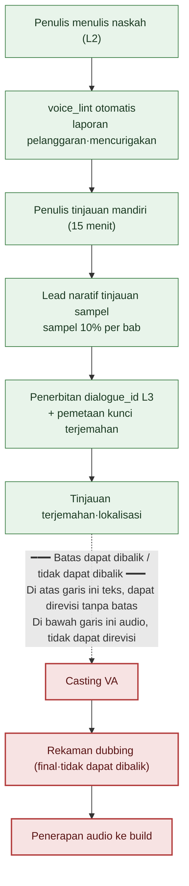

# 5.4 Konsistensi Dialog dan Voice

Bilik rekaman. Sutradara mengenakan headphone, mengangkat tangan untuk memberi aba-aba. Pengisi suara membacakan dialog seorang NPC ilmuwan. "Wah, ini benar-benar luar biasa." Tangan sutradara berhenti. Sepanjang lima bab, karakter ini belum pernah sekali pun memakai seruan "wah". Ia adalah ilmuwan yang tidak pernah mengucapkan kata kasar maupun seruan modern, dan selalu menggantung ujung kalimatnya hingga akhir. Namun di naskah, baris itu tertulis apa adanya.

Di sini dua biaya muncul sekaligus. Pertama, kalau baris itu diperbaiki, pengisi suara harus membacanya ulang. Honor pengisi suara dan waktu studio sudah berjalan seperti jam yang berdetak. Kedua, yang lebih menakutkan adalah ketika sutradara gagal menangkap baris itu dan melewatkannya. Begitu rekaman selesai dan berkas audio masuk ke build, ilmuwan itu akan berbicara seperti itu selamanya di dalam game. Audio yang sudah direkam tidak bisa dibatalkan dengan satu baris perbaikan seperti teks. Kita harus menjadwalkan ulang pengisi suara yang sama, dalam kondisi yang sama, di bilik yang sama.

Bab ini membahas garis putus-putus di depan bilik itu. Di atas garis putus-putus adalah teks, sehingga bisa diperbaiki tanpa batas; di bawah garis putus-putus adalah audio, sehingga tidak bisa diperbaiki. Semua tinjauan dialog harus selesai di atas garis putus-putus. Untuk itu, "orang ini berbicara seperti ini" untuk setiap karakter harus tercatat sebagai berkas, bukan sekadar di dalam kepala, dan setiap kali dialog baru diunggah, ia harus otomatis diadu dengan berkas tersebut. Berkas itu kita sebut `voice_profile`, dan alat pencocoknya kita sebut `voice_lint`.

---

## 5.4.1 Tempat di Mana Voice Goyah

Di antara insiden konsistensi naratif, yang paling sering meledak adalah goyahnya voice karakter. Baru setelah rilis, masuk laporan, "kenapa cara bicara NPC ini tiba-tiba berubah?" Penyebabnya hampir selalu sama.

Ketika penulis berganti, NPC yang sama menjadi orang yang berbeda. Meski penulisnya tidak berganti, setelah enam bulan berlalu ia sendiri lupa nada tokohnya. Ketika menulis dialog baru tanpa membuka kembali dialog karakter itu sebelumnya, konteksnya terputus. Kalau aturan voice hanya ada di kepala penulis dan tidak terdokumentasikan, ia tidak tersampaikan ke orang berikutnya. Dan penyebab kelima yang paling pesat bertambah dalam dua tahun terakhir — kalau kita melempar ke LLM "buatkan dialog NPC ini" tanpa informasi karakter, AI mengembalikan dialog yang rata-rata dan aman, sehingga menjadi bukan suara siapa-siapa (suara tak bertuan).

Yang kelima adalah efek samping dari adopsi AI. Injeksi konteks pada bab sebelumnya (5.3) adalah resepnya, tetapi kalau konteks yang akan diinjeksikan itu sendiri rapuh, tidak ada yang bisa diinjeksikan. Konteks itulah yang disebut `voice_profile`. Bab ini menelusuri satu siklus: membuat berkas tersebut, memeriksanya secara otomatis, dan mengakhirinya di depan bilik rekaman.

---

## 5.4.2 voice_profile — Suara yang Dikunci dengan Lima Butir

Di Proyek A, setiap NPC memiliki `voice_profile` dengan lima butir. Ranah kosakata (kelompok kata yang sering dipakai / kelompok kata yang sama sekali tak dipakai), panjang kalimat (rata-rata dan maksimum jumlah karakter), sistem penghormatan (kata ganti orang pertama dan kedua, proporsi bahasa hormat, sebutan), ekspresi emosi (cara mana di antara langsung, tak langsung, atau ditahan), dan ungkapan tabu (kata atau frasa yang sama sekali tak dipakai). Kelima butir harus disertai contoh konkret. Kalau hanya ada deskripsi abstrak seperti "ilmuwan yang serius", setiap orang membacanya secara berbeda. Penulis berikutnya akan membayangkan ilmuwan itu menurut caranya sendiri.

Format profil sesungguhnya dari NPC ilmuwan `K_007` adalah seperti ini. Berkas inilah yang menjadi masukan bagi `voice_lint`.

```markdown
---
title: K_007 voice_profile ilmuwan
layer: L1
character_id: K_007
atoms:
  - voice_profile_k_007
related:
  derives_from: [character_bible/k_007.md]
  affects: [dialogue_id_table (semua dialog K_007)]
---

## 1. Ranah Kosakata
- Sering: "catatan", "dasar", "situasi", "perkiraan", "data", "kasus"
- Sama sekali tak dipakai: "perasaan", "firasat", "takdir", "kehendak dewa", "suara hati"

## 2. Panjang Kalimat
- Rata-rata: 18 karakter
- Maksimum: 35 karakter (lebih dari itu dipecah jadi dua kalimat)
- Sering terputus pendek: "...bukan begitu." "Mulai dari catatan."

## 3. Sistem Penghormatan
- Orang pertama: "saya"
- Orang kedua: utamakan jabatan (Komandan, Panglima). Nama hanya setelah menjadi akrab.
- Bahasa hormat 100% (kecuali adegan kilas balik)
- Hampir tak ada seruan. Kalaupun ada, "...ah."

## 4. Ekspresi Emosi
- Nyaris tak ada ekspresi langsung (marah, gembira)
- Diungkapkan lewat keheningan dan ujung kalimat yang digantung ("...kalau memang begitu.")
- Kesedihan: dihindari dengan mengalihkan topik ("...mari bicara hal lain.")

## 5. Ungkapan Tabu
- Segala kata kasar
- Seruan modern "wah", "astaga", "luar biasa"
- Dua atau lebih kata serapan Han berjumlah tiga suku kata atau lebih dalam satu kalimat
- Kosakata mistis seperti "takdir", "ramalan"
```

Inti dari format ini adalah bahwa pada setiap tempat yang abstrak melekat baris contoh. Bukan "menahan emosi", melainkan dialog nyata `"...kalau memang begitu."` yang melekat. Dengan begitu penulis berikutnya, penerjemah, maupun `voice_lint` melihat tolok ukur yang sama.
Kalau kita melihat ulang lima butir tersebut dengan mata penerjemahan dan lokalisasi, mereka terbagi menjadi dua jenis. Atribut **bergantung pada bahasa** (bentuk permukaan dari ranah kosakata, panjang kalimat, dan sistem penghormatan) harus ditetapkan ulang untuk setiap bahasa yang diterjemahkan, sedangkan atribut **tak bergantung pada bahasa** (sikap seperti apakah emosi ditahan atau diungkapkan langsung, apa yang tetap tak diucapkan sampai akhir) harus tetap terjaga ke dalam bahasa apa pun ia dipindahkan. Kalau pembedaan ini ikut diserahkan saat memberikan pekerjaan lokalisasi, kita bisa mencegah penerjemah hanya mengganti kosakata permukaan tetapi sampai menggoyahkan sikap karakter.

---

## 5.4.3 Worked Transcript: Menimba profile dari Naskah Utama

Kalau dari awal kita menulis 50 NPC × 5 butir = 250 berkas dari nol, hasilnya mengalir ke arah abstrak. Kalau kita menulis "karakter ini adalah ilmuwan yang dingin" tanpa satu baris pun dari naskah, tak seorang pun tahu seperti apa dinginnya itu. Maka kita balik urutannya. Hanya 5–7 NPC utama yang ditulis penuh sejak awal, sedangkan sisanya diekstraksi-balik profile-nya dari dialog setelah 20–30 baris dialog naskah terkumpul.

Berikut adalah worked transcript (rekaman sesi nyata) sesungguhnya, ketika draf profile ditarik setelah 25 baris dialog `K_007` terkumpul. Tidak diringkas, dan tempat di mana AI keliru pun dibiarkan apa adanya.

**[Prompt lengkap yang dilemparkan penulis]**

```
Berikut 25 baris dialog karakter K_007.

1. "Mari mulai dari catatan."
2. "...situasinya tidak cocok."
3. "Itu hanya perkiraan. Tidak ada dasarnya."
4. "Kasus itu pun saya ketahui."
5. "...bukan begitu. Datanya berbeda."
   (... nomor 6~23 dikutip seluruhnya tanpa dipotong ...)
24. "...kalau memang begitu, saya mundur."
25. "Mari bicara hal lain."

Dari sini tariklah lima hal berikut: kosakata yang sering dipakai (hanya yang
benar-benar muncul), panjang kalimat rata-rata, pola penghormatan dan sebutan,
cara ekspresi emosi, dan ranah ungkapan yang sama sekali tak dipakai.
Untuk tiap butir, kutip 2~3 baris dialog sebagai dasar dengan nomornya, dan
jangan menulis kesan subjektif seperti "serius" atau "dingin".
```

**[Keluaran mentah Claude — tidak dipoles]**

```
1. Kosakata yang sering dipakai
   - "catatan" (no. 1), "situasi" (no. 2), "perkiraan/dasar" (no. 3),
     "kasus" (no. 4), "data" (no. 5)
   → Terpusat pada nomina kategori fakta dan bukti.

2. Panjang kalimat rata-rata
   - Rata-rata 25 baris sekitar 14.6 karakter. Terpanjang 21 karakter (no. 24).
   → Didominasi kalimat tunggal yang pendek.

3. Penghormatan dan sebutan
   - Orang pertama "saya" (no. 3, 24). Akhiran "-습니다/-요" bahasa hormat.
   - Sebutan orang kedua tidak muncul dalam 25 baris ini.
     → Pola sebutan tak bisa dipastikan hanya dari sampel ini. (Perlu konfirmasi penulis)

4. Ekspresi emosi
   - Tidak ada kata emosi langsung. Penolakan ditangani dengan "saya mundur" (no. 24),
     kesedihan/penghindaran dengan pengalihan topik "mari bicara hal lain" (no. 25).
   → Tipe ditahan dan tak langsung.

5. Ranah yang sama sekali tak dipakai
   - Seruan, kata kasar, dan kosakata mistis semuanya tak muncul.
   ※ Namun, "tak muncul" tidak menjamin "tabu".
      Karena sampel hanya 25 baris dan sedikit, bisa jadi ketidakmunculan yang kebetulan.
```

Di sini ada dua hal yang harus dicatat. Pertama, AI berhenti pada butir nomor 3. Ia sendiri menarik batas dengan mengatakan "tak bisa dipastikan hanya dari sampel ini". Karena sebutan tak muncul dalam 25 baris, ia tidak berspekulasi — inilah keluaran yang jujur. Seandainya AI mengisinya dengan "orang kedua diperkirakan 'Komandan'", itu adalah halusinasi, dan kalau masuk ke profile, itu kontaminasi. Kedua, pada butir nomor 5 AI sendiri menambahkan penyangkalan. "Tak muncul ≠ tabu" adalah peringatan inti. Tidak munculnya seruan dalam 25 baris bisa saja kebetulan.

**[Verifikasi dan penolakan penulis]**

Penulis menerima butir nomor 1, 2, dan 4. Untuk sebutan di nomor 3, ia membuka character_bible lalu mengisi secara manual "utamakan Komandan, nama setelah akrab" — manusia mengisi tempat yang dikosongkan AI. Untuk nomor 5, sesuai peringatan AI, ia tidak langsung menaikkan "tak muncul" menjadi "tabu". Alih-alih, dengan menimbang dari setelan karakter, penulis hanya memastikan "seruan modern, kata kasar, dan mistisisme" sebagai tabu, sedangkan kosakata lain yang tak muncul diberi status ditahan dulu.

**[Permintaan ulang penulis]**

```
"takdir", "ramalan" akan saya pastikan sebagai tabu. Tariklah 10 lagi kosakata mistis
yang maknanya tumpang tindih. Tapi karena K_007 sebagai ilmuwan bisa saja mengutipnya
dalam konteks pembantahan/kritik, tampilkan juga kasus pengecualian itu dalam satu baris.
```

Permintaan ulang terakhir inilah yang penting. Kalau tabu diperluas secara mekanis, sampai dialog yang sah pun ikut terhalang — seperti "ilmuwan yang mengkritik takhayul sambil berkata 'takdir apaan'". Maka untuk tabu, kita ikut mendefinisikan konteks pengecualiannya. AI memperluas kandidat, penulis menarik garis batasnya. Baru setelah memutar satu putaran ini, `voice_profile_k_007` ditetapkan dan dikunci di L1.

Dengan memaksakan kutipan dasar ("kutip dengan nomor") dan melarang adjektiva subjektif ("dilarang 'serius'"), halusinasi AI berkurang dan tercipta permukaan yang bisa diverifikasi penulis. profile bukan ditulis AI, melainkan AI yang menghamparkan draf dan penulis yang menguncinya.

---

## 5.4.4 voice_lint — Pencocokan Otomatis untuk Setiap Dialog Baru

Kalau `voice_profile` tersedia sebagai berkas, pencocokan otomatis menjadi mungkin setiap kali dialog baru diunggah. Di antara lima pemeriksaan, yang efeknya besar di lapangan ada dua: pencocokan kosakata tabu (apakah kosakata tersangkut di daftar tabu) dan pelanggaran ranah kosakata (apakah masuk ke kelompok kata yang sama sekali tak dipakai). Penyimpangan panjang kalimat, hilangnya penghormatan, dan rasio kosakata yang sering dipakai banyak menimbulkan positif palsu (false positive), jadi dipakai sebagai pelengkap saja. Kalau kita sampai menangkap semua hal seperti satu baris adegan kilas balik yang menggoyahkan panjang rata-rata, penulis akan mati rasa terhadap peringatan.

`voice_lint` menerima kumpulan dialog baru per bab lalu mengeluarkan laporan seperti ini.

```
Hasil voice_lint (ch04 dialog baru 32 baris, profile=voice_profile_k_007)
─────────────────────────────────────────────
[Pelanggaran] dialogue_id_412 — K_007
  Isi: "Wah, ini benar-benar luar biasa!"
  Alasan: kosakata tabu "wah", "luar biasa" (profile §5)
  → Perlu tinjauan penulis

[Mencurigakan] dialogue_id_421 — K_007
  Isi: "Takdir itu sulit untuk diterima."
  Alasan: ranah kosakata tabu "takdir" (profile §5)
        Namun, mungkin pengecualian 'konteks pembantahan/kritik' — penilaian penulis
  → Perlu tinjauan penulis

[Normal] 30 dialog
─────────────────────────────────────────────
Ringkasan: pelanggaran 1 / mencurigakan 1 / normal 30
```

Pelanggaran ditandai merah, yang mencurigakan ditandai kuning. Keduanya harus melewati penilaian penulis untuk lolos. Di sini ada satu prinsip mutlak — `voice_lint` tidak menolak secara otomatis (perpanjangan dari prinsip 5.2). Lihat `dialogue_id_421` di atas. "Takdir" memang tabu, tetapi kalau dalam konteks ilmuwan yang membantah takhayul, ia bisa jadi kutipan yang sah. Penilaian itu tak bisa dilakukan alat. lint bertipe penolakan otomatis akan menghalangi semua tempat yang lembut ini, sampai merampas kesempatan penulis untuk memoles nada. lint adalah senter yang menyorot titik-titik yang mencurigakan, bukan gembok yang mengunci pintu.

---

## 5.4.5 Gerbang Tinjauan — Garis Putus-Putus antara Dapat Dibalik dan Tidak Dapat Dibalik

Tulang punggung bab ini adalah satu lembar diagram berikut. Selama satu baris dialog berangkat dari tangan penulis hingga sampai ke mulut pengisi suara, gerbang tinjauan terhampar di setiap tahap. Dan di tengah-tengah alur itu ada garis putus-putus yang tebal.



Hijau adalah tahap dapat dibalik, merah adalah tahap tidak dapat dibalik. Di atas garis putus-putus (hijau) semuanya teks. Kalau satu baris dialog tidak berkenan, cukup perbaiki dengan papan ketik. Biayanya hanya beberapa menit penulis. Di bawah garis putus-putus (merah) adalah audio. Begitu pengisi suara membaca baris itu di bilik dan audionya masuk ke build, dialog itu terkunci sebagai aset. Untuk memperbaikinya, kita harus menjadwalkan ulang pengisi suara yang sama dalam kondisi yang sama di studio yang sama, dan honor pengisi suara, studio, serta waktu sutradara kembali habis persis seperti pertama kali. Kalau jadwalnya ketat, sesi tambahan dengan pengisi suara yang sama bahkan kadang tak bisa dijadwalkan sama sekali.

Maka satu aturan tunggal menguasai seluruh alur kerja — **semua gerbang tinjauan selesai di atas garis putus-putus.** Rekaman bukan tahap tinjauan. Ia adalah tahap mengunci hasil yang tinjauannya sudah selesai sebagai aset. Kalau di bawah garis putus-putus muncul keraguan "dialog ini aneh", itu bukan tempat untuk meninjau lagi, melainkan sinyal bahwa tinjauan di tahap atas terlewatkan. Senter harus menyorot tuntas di atas garis putus-putus. Bilik bukan tempat yang boleh gelap, melainkan tempat yang tidak boleh gelap.

Di tengah-tengah diagram, tinjauan sampel lead ditetapkan sebesar "sampel 10% per bab". Rasio ini adalah titik keseimbangan antara waktu tinjauan dan akurasi (angka operasional penulis, perkiraan belum terverifikasi). Kalau diturunkan di bawah 5%, insiden bocor; kalau dinaikkan di atas 20%, satu orang lead menjadi penghambat. Karena lint sudah menyaring pelanggaran dan yang mencurigakan terlebih dahulu, sampel ditarik dari bagian yang lolos lint — mata manusia berfokus pada kesalahan konteks yang tak bisa ditangkap alat (misalnya, kutipan "takdir" yang tampak sah ternyata adalah keruntuhan karakter).

---

## 5.4.6 Karakter Berubah — Manajemen Versi profile

Kalau karakter berbicara sama persis hingga akhir, plot menjadi mandek. Kalau ilmuwan yang mengalami kematian rekannya berbicara dengan nada yang persis sama seperti sebelumnya, justru itu palsu. Kalau perubahannya disengaja, `voice_profile` pun ikut dinaikkan versinya.

```markdown
---
character_id: K_007
voice_profile_versions:
  - v1: ch01~ch05 (awal — emosi ditahan, ilmuwan berkalimat pendek)
  - v2: ch06~ch10 (setelah kematian rekan — frekuensi ekspresi emosi meningkat)
  - v3: ch11~ (setelah pencerahan — muncul gaya bicara langsung)
---
```

Setiap versi memiliki berkas profile tersendiri, dan `voice_lint` melihat nomor bab dari dialog yang diperiksa lalu memilih versi mana yang akan diterapkan. Kalau aturan "emosi ditahan" dari v1 diterapkan pada dialog ch07, semua dialog perubahan yang sebenarnya wajar akan muncul sebagai mencurigakan. Perubahan bukan bug, melainkan rancangan.

Sinyal untuk menaikkan versi ada tiga. Kalau penulis dengan sengaja menggoyahkan nada, ia mengusulkan versi baru dan menyepakatinya dengan lead. Kalau jumlah kasus mencurigakan dari `voice_lint` pada satu karakter terus bertambah, itu adalah sinyal bahwa penulis secara tak sadar sedang menggeser nada — bahwa saatnya pembaruan versi telah tiba. Kalau peristiwa perubahan (kematian, pencerahan, pengkhianatan) ditambahkan ke character_bible, muncul alert pembaruan profile. Namun, kalau satu karakter berubah pada setiap bab, konsistensi runtuh, jadi jumlah versi yang realistis adalah 2–4 per karakter.

> **[Penanda arah — kalau kita melihat antarkarakter melalui ruang voice (untuk saat ini masih terlalu dini)]** Kalau `voice_lint` menjaga konsistensi 'di dalam satu karakter' lewat aturan, maka 'ruang voice' — yang menyematkan (embedding) kumpulan dialog nyata tiap karakter (seluruh dialog yang diucapkan satu karakter) sebagai satu titik — melihat apakah jarak 'antarkarakter' sudah cukup terbentang. Kalau titik-titik itu saling menggumpal mendekat, itu menjadi nilai ukur langsung dari penyeragaman dan konvergensi voice yang ditunjuk §5.3.1 dan §5.4.1. Hanya saja, jangan mengunci ambang jarak sebagai angka mutlak, dan bacalah hanya sebagai penanda arah 'sedang menggumpal'; ini bukan gerbang penilaian yang menggantikan `voice_lint` (gagasan ini berada di tempat yang sama dengan kompresi vektor dimensi pada §8.2.7, dan intuisi konsepnya telah diuraikan sebagai satu lembar peta di Lampiran M — ini bukan resep, melainkan penanda arah).

---

## 5.4.7 Unit Konsistensi yang Bertambah karena Multibahasa dan VA

Kalau dialog diterjemahkan ke banyak bahasa dan voice pengisi suara dilekatkan, unit yang dikelola bertambah berlipat ganda. Satu baris bahasa Korea bercabang ke bahasa Inggris dan bahasa Asia Tenggara, dan masing-masing diberi nada.

Tempat yang paling sering bocor dalam konsistensi terjemahan adalah ungkapan yang sama diterjemahkan berbeda di setiap bab (ditangkap dengan pemeriksaan konsistensi memori terjemahan). Diikuti oleh tidak terpantulnya `voice_profile` karakter ke dalam terjemahan (dilekatkan panduan terjemahan tersendiri per karakter), dan tidak terdaftarnya kosakata baru di glosarium (lint glosarium). Panduan terjemahan dibangkitkan secara otomatis dari `voice_profile` — "karakter ini gaya formal 100%, tanpa seruan, kosakata mistis tabu" dilekatkan secara otomatis di kepala lembar instruksi terjemahan. Saat penerjemah memindahkan ilmuwan itu ke bahasa Inggris, ia melihat batas yang sama.

Tinjauan VA (Voice Actor, pengisi suara) adalah tinjauan tahap teks yang masih dapat dibalik yang terakhir, tepat sebelum menyentuh bawah garis putus-putus. Konsistensi nada (intensitas ekspresi marah dan sedih) ditinjau sutradara dan tim naratif, akurasi pelafalan (nama diri) oleh penanggung jawab glosarium, serta tarikan napas dan jeda (instruksi seperti "sering terputus pendek" pada profile) oleh sutradara. Hasil tinjauan dicatat sebagai lolos atau ditolak di `voice_review_log.md` (L4), dan dirujuk saat casting karakter berikutnya.

Penolakan diselesaikan sebisa mungkin tepat sebelum casting dan rekaman. Kesalahan naskah yang ditemukan di dalam bilik meruntuhkan sesi hari itu sepenuhnya dan menggoyahkan hingga jadwal sesi berikutnya. Namun, menunda rekaman sambil mematikan tinjauan bukanlah jawabannya. Kalau tinjauan sering tersumbat tepat sebelum bilik, itu berarti alur kerja tahap atas (penulis, lead) yang terlambat, bukan masalah jadwal rekaman.

---

## 5.4.8 Pengukuran dan Biaya selama 6 Bulan

Di Proyek A, sebelum dan sesudah penerapan `voice_profile` + `voice_lint` ditelusuri selama 6 bulan. Jumlah absolutnya adalah perkiraan penulis (belum terverifikasi); cukup percayai arah dan rasionya saja.

| Butir | Sebelum penerapan | Setelah penerapan | Arah |
|---|---|---|---|
| Insiden voice per bab (setelah rilis) | 5\~8 kasus | 1\~2 kasus | sekitar 1/4 |
| Pemantapan voice NPC baru | 3 bab | 1 bab | 1/3 |
| Jumlah NPC yang dikelola 1 penulis | sekitar 15 orang | sekitar 40 orang | sekitar 2.5 kali |
| Insiden konsistensi terjemahan (per bab) | 10\~15 kasus | 2\~4 kasus | sekitar 1/4 |
| Waktu tinjauan voice (per bab) | 3 hari | 1 hari | 1/3 |

Baris yang paling bermakna adalah jumlah NPC yang dikelola 1 penulis. Sekitar 2.5 kali bukan berarti kita mengurangi penulis, melainkan penulis yang sama bisa menambah keragaman NPC per bab. Dunia menjadi lebih ramai.

Kalau kita lihat struktur biayanya, biaya operasional jauh lebih kecil daripada biaya penerapan. Penulisan `voice_profile` memakan 2 minggu penulis untuk 7 karakter utama, alat `voice_lint` memakan 1\~2 minggu pengembangan dengan pemeliharaan 1 hari per bulan. Di sisi operasional, per bab ada tinjauan mandiri penulis 15 menit, tinjauan sampel lead sekitar 2 jam (sampel 10%), dan pembaruan profile pada bab perubahan sebesar 1\~2 hari per karakter. Biaya operasional harus kecil agar sistem bisa bertahan. Alat yang berat operasionalnya akan diam-diam ditinggalkan dalam satu kuartal.

---

## 5.4.9 Kegagalan yang Umum

| Pola | Resep |
|---|---|
| profile hanya berisi deskripsi abstrak ("serius") | Wajibkan contoh dialog nyata di tiap 5 butir |
| Mengincar penulisan penuh 50 orang sejak awal | 7 orang utama penuh + sisanya ekstraksi-balik dari akumulasi naskah |
| voice_lint bertipe penolakan otomatis | Pelanggaran·mencurigakan + penilaian penulis. Penolakan hanya oleh manusia |
| Memperluas tabu secara mekanis | Sertakan konteks pengecualian pada tabu ("boleh dikutip untuk pembantahan") |
| Tidak memperbarui profile saat karakter berubah | Manajemen versi (v1·v2·v3), terapkan berdasarkan nomor bab |
| Tidak meneruskan profile ke terjemahan | Bangkitkan panduan terjemahan otomatis dari profile |
| Mencoba merevisi dialog setelah rekaman | Rekaman tidak dapat dibalik. Tinjauan diakhiri di atas garis putus-putus |
| Memampatkan tinjauan ke dalam jadwal rekaman | Selesaikan dengan perbaikan alur kerja tahap atas |
| Menyimpan profile hanya di dalam kepala | Wajib dijadikan berkas. Isi kepala hilang saat penulis berganti |

---

## Coba Sendiri — Satu Siklus voice_lint

Ketika dialog bab baru diunggah, ini adalah prosedur minimum untuk memutar satu putaran dengan satu profile.

**setup**
1. Bukalah `voice_profile_<id>.md` dari karakter sasaran. Kalau belum ada, kumpulkan 20–30 baris dialog naskah.
2. Siapkan dialog baru sebagai kumpulan teks polos berformat `id / karakter / isi`.

**prompt**

```
Ini voice_profile K_007 §5 (ungkapan tabu).
[tempelkan daftar tabu]

Dialog baru ch04 sebanyak 32 baris.
[tempelkan dalam format id / isi]

Klasifikasikan tiap dialog sebagai [Pelanggaran] (langsung memuat kosakata tabu) /
[Mencurigakan] (menyentuh ranah tabu tapi mungkin konteks pengecualian) / [Normal].
[Pelanggaran]·[Mencurigakan] tampilkan id·isi·alasan dalam tabel. Penilaian saya yang
lakukan, jadi jangan menolak secara otomatis.
```

**verify**
1. Lihat [Pelanggaran] lebih dulu. Kalau jelas, perbaiki teksnya (gratis karena di atas garis putus-putus).
2. [Mencurigakan] dinilai berdasarkan konteks. Kalau kutipannya sah, loloskan; kalau tidak, perbaiki.
3. Dari bagian yang lolos, kirim 10% sebagai sampel ke lead untuk sekali lagi menyaring kesalahan konteks.
4. Hanya setelah semua penilaian selesai, terbitkan dialogue_id dan teruskan ke antrean rekaman. Di depan bilik, tidak ada lagi pemeriksaan.

**Versi Ringkas Solo** — Kalau Anda pengembang solo yang tak bisa membuat alat, tulislah `voice_profile` hanya satu butir §5 (ungkapan tabu) per karakter. Setiap kali menulis dialog baru, lekatkan daftar tabu itu di kepala prompt lalu suruh AI "tandai hanya baris yang tersangkut di daftar ini". Tanpa alat, dengan satu baris prompt Anda mendapat 80% dari lint. Sebelum menyerahkan ke rekaman (atau TTS), cukup loloskan sekali ini saja, maka garis putus-putus di depan bilik tetap terjaga.

---

### Poin-Poin Penting
- Di antara lima penyebab goyahnya voice, penyeragaman oleh AI yang paling pesat bertambah, dan resepnya bukan konteks yang rapuh, melainkan voice_profile yang memuat contoh.
- voice_lint hanya menandai pelanggaran dan yang mencurigakan, sedangkan penolakan dilakukan manusia, dan pada tabu didefinisikan pula konteks pengecualian.
- Semua tinjauan diakhiri di atas garis putus-putus di depan bilik rekaman — audio di bawah garis putus-putus tidak bisa dibatalkan seperti teks.

### Pratinjau Bab Berikutnya
- 6.1. Pembangkitan Konten Prosedural dan AI — Di Mana Mereka Bertemu
