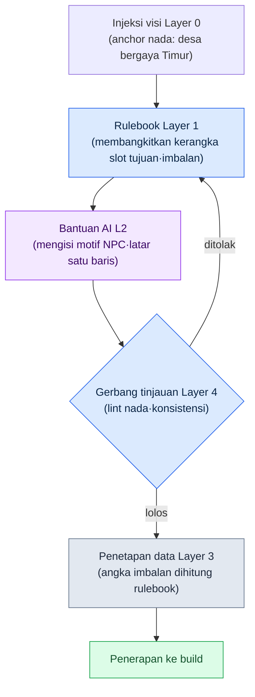

# 6.1 Pembangkitan Konten Prosedural dan AI — Satu Sel tempat Dua Sumbu Berpotongan

Rapat perencanaan Senin pagi. Di papan tulis tertulis satu baris. "1,000 side quest sampai rilis." Seseorang menekan-nekan kalkulator. Kalau satu penulis menghabiskan satu hari untuk satu quest, itu butuh 4 tahun. Bahkan kalau lima orang dikerahkan, hampir genap 1 tahun. Udara di ruangan jadi berat. Saya yang sudah 24 tahun duduk di ruangan ini tahu bahwa di hadapan angka itu orang selalu terbelah ke dua arah yang sama. Satu pihak berkata "kurangi saja volumenya", pihak lain berkata "cetak saja dengan alat". Dan hampir selalu keputusannya adalah keduanya.

Pembangkitan konten prosedural (Procedural Content Generation, selanjutnya disebut PCG) adalah jawaban lama dari pihak "cetak saja dengan alat" itu. Penataan ruang dungeon, kombinasi opsi senjata, dan pool spawn musuh sudah diotomatiskan dengan rulebook dan tabel probabilitas sejak 20 tahun lalu. Yang baru bukanlah PCG itu sendiri, melainkan kenyataan bahwa LLM dan model generatif kini menempati posisi tempat bahasa alami, gambar, dan narasi masuk.

Namun yang ingin saya katakan dalam buku ini bukanlah "tempelkan AI ke PCG". Itu dilakukan siapa saja. Persoalannya adalah *di mana* Anda menempelkannya. Jika Anda mengambil satu bongkah konten, lalu tidak memakukan ke satu sel pada intensitas otomasi mana dan pada lapisan struktur mana ia bertemu, jadilah keadaan di mana alat ada tetapi tempatnya tidak ada. Bab ini melihat cara menggambar satu sel itu sebagai koordinat, dan bagaimana satu potong konten benar-benar berputar satu kali melewati pipeline di atas sel itu.

---

## 6.1.1 Tempat di Mana PCG Berhenti Bergerak

PCG tradisional kuat dalam determinisme. Input yang sama menghasilkan output yang sama, dan verifikasi dimungkinkan. Itulah sebabnya graf ruang dungeon, prefix·suffix opsi senjata, dan distribusi spawn musuh mapan sejak dini. "Pedang Api +5" sudah keluar secara otomatis bahkan 20 tahun lalu.

Persoalannya selalu ada di tempat berikutnya. Ruang sudah ditata, tetapi nama, penampilan, dan latar belakang singkat NPC di dalam ruang itu tetap tinggal di tangan penulis. "Pedang Api +5" keluar, tetapi satu baris "pedang terakhir yang hilang dari sang raja" tidak keluar. Sekalipun quest generator mengambil kombinasi tujuan dan imbalan, "mengapa mengerjakan quest ini" tetap ditulis manusia.

Pada game berskala besar, tempat ini selalu menjadi bottleneck. Rasio antara area yang dapat diproduksi massal dan area yang membutuhkan tangan manusia kira-kira 4 berbanding 6, dan 6 bagian tangan manusia itu memakan sebagian besar jadwal. Sekalipun lini produksi massal membuat 4 bagian dengan cepat, jika 6 bagian tidak menyusul, seluruh siklus terkunci pada kecepatan itu.

Tempat masuknya LLM dan model gambar persis di situ. Cakupan yang dapat diproduksi massal meluas hingga ke area bahasa alami, narasi, dan visual yang tidak bisa ditangani rulebook. Meski begitu, menyerahkan tempat itu bulat-bulat ke AI bukanlah jawabannya. AI mengeluarkan jawaban yang sedikit berbeda setiap kali, dan ketika konteksnya kosong, ia memuntahkan rata-rata RPG generik. Karena itu, dibutuhkan desain *titik penggabungan*. Titik penggabungan didefinisikan oleh dua sumbu koordinat.

---

## 6.1.2 Sumbu Pertama: Intensitas Otomasi (L0–L3)

Sumbu vertikal adalah *dengan rasio berapa* Anda mencampur manusia, rulebook, dan AI. Di sebuah pengembang MMORPG tempat saya bekerja (selanjutnya 'Proyek A'), pencampuran ini dipotong menjadi empat tingkat.

**L0 — Sepenuhnya manual.** Semua huruf dan keputusan keluar dari tangan manusia. Teks utama main quest, dialog karakter signature, ending percabangan. Tempat di mana konsistensi dan kedalaman narasi langsung terkait dengan identitas game.

**L1 — Otomasi rulebook.** Tempat PCG tradisional. Algoritma deterministik seperti rulebook, tabel probabilitas, dan BSP membuat output, dan manusia hanya meninjau. Penataan ruang dungeon, kombinasi opsi senjata, dan spawn musuh adalah yang representatif.

**L2 — Rulebook + bantuan AI.** Rulebook menyusun kerangka dan AI mengisi detail. Sinopsis side quest, nama dan latar belakang singkat NPC biasa, teks pengantar area perburuan. Manusia hanya bertanggung jawab atas metadata input dan gerbang tinjauan terakhir.

**L3 — AI lebih dulu + tinjauan manusia.** AI membuat teks utama dan manusia hanya masuk untuk meninjau. Menggiurkan, tetapi risiko non-determinisme, halusinasi, dan kerusakan konsistensi semuanya berkumpul di sini.

Intinya adalah L2. Ia menggabungkan stabilitas L1 dengan daya produksi massal L3, dan menutup kelemahan kedua area itu dengan verification gate. Godaan untuk segera menerapkan L3 memang besar, tetapi saya sudah beberapa kali melihat kasus di mana beban tinjauan meledak sehingga L3 dibuang dalam satu-dua kuartal. Jika 70 dari 100 naik sebagai item yang meragukan, itu lebih mahal daripada manusia menulis 100 dari awal.

---

## 6.1.3 Sumbu Kedua: Struktur Layer (L0–L4)

Hanya dengan memegang sumbu vertikal, lini produksi massal tidak akan berjalan. Konten itu *sendiri* harus terurai menjadi lapisan agar muncul tempat bagi otomasi untuk masuk. Inilah penguraian Layer yang dibahas di Bagian 5, dan ini adalah sumbu horizontal di bidang konten. Penjelasan umum bahwa kelima lapisan masing-masing berkorespondensi dengan satu peran pembangkitan prosedural (anchor·rulebook·teks utama·angka·gerbang) sudah dibahas di §2.3.6, dan di sini kita masukkan langsung ke lini produksi massal konten. Layer 0 visi adalah anchor nada dan dunia (disuntikkan setiap kali membangkitkan), Layer 1 sistem adalah rulebook pembangkitan (aturan·tabel probabilitas·sistem tag), Layer 2 konten adalah tempat teks utama di mana hasil pembangkitan menumpuk (side quest·latar belakang NPC·teks pengantar kota), Layer 3 data adalah angka·ID·relasi (imbalan·spawn·kurva), dan Layer 4 build·QA adalah verification gate (lint·pemeriksaan konsistensi·tinjauan penulis).

Kedua sumbu ini adalah cerita yang berbeda. Sumbu vertikal berbicara tentang "seberapa banyak manusia menyentuhnya", sumbu horizontal tentang "bagian mana dari konten". Namun keduanya baru bermakna lewat perkalian. Hanya ketika satu potong konten dipakukan ke titik potong kedua sumbu, yakni *satu sel*, barulah ditentukan "siapa, di bagian mana, dan bagaimana membuatnya".

---

## 6.1.4 Dua Sumbu dalam Satu Lembar — Matriks Otomasi × Layer

Kita tumpuk kedua sumbu yang sejauh ini diurai dengan tulisan menjadi satu lembar kisi. Horizontal adalah Layer konten, vertikal adalah intensitas otomasi. Label di tiap sel adalah konten yang sebenarnya menempati sel itu di Proyek A. Makin pekat warna selnya, makin dekat ia ke pusat gravitasi lini produksi massal.

<svg viewBox="0 0 760 440" xmlns="http://www.w3.org/2000/svg" font-family="sans-serif" font-size="12">
  <rect x="0" y="0" width="760" height="440" fill="#ffffff"/>
  <!-- 축 제목 -->
  <text x="380" y="22" text-anchor="middle" font-size="14" font-weight="bold">Intensitas Otomasi (vertikal) × Struktur Layer (horizontal)</text>
  <text x="380" y="416" text-anchor="middle" font-weight="bold">→ Struktur Layer (bagian mana dari konten)</text>
  <text x="18" y="220" text-anchor="middle" font-weight="bold" transform="rotate(-90 18 220)">↑ Intensitas Otomasi (seberapa banyak manusia menyentuh)</text>
  <!-- 열 헤더 -->
  <g text-anchor="middle" font-size="11" font-weight="bold">
    <text x="190" y="52">L0 Visi</text>
    <text x="310" y="52">L1 Sistem (Rulebook)</text>
    <text x="430" y="52">L2 Konten (Teks Utama)</text>
    <text x="550" y="52">L3 Data</text>
    <text x="670" y="52">L4 Build·QA</text>
  </g>
  <!-- 행 헤더 -->
  <g text-anchor="end" font-size="11" font-weight="bold">
    <text x="124" y="92">L0 Manual</text>
    <text x="124" y="172">L1 Rulebook</text>
    <text x="124" y="252">L2 Rulebook+AI</text>
    <text x="124" y="332">L3 AI Dulu</text>
  </g>
  <!-- 격자 칸: x=130..730 (5열,120폭) y=60..380 (4행,80높이) -->
  <!-- 행 L0 수작업 -->
  <rect x="130" y="60" width="120" height="80" fill="#dfe7f3" stroke="#7a93c0"/>
  <text x="190" y="104" text-anchor="middle" font-size="10">Tulis satu baris nada langsung</text>
  <rect x="250" y="60" width="120" height="80" fill="#f4f6fa" stroke="#c8c8c8"/>
  <rect x="370" y="60" width="120" height="80" fill="#eef1f6" stroke="#c8c8c8"/>
  <text x="430" y="98" text-anchor="middle" font-size="10">Main quest</text>
  <text x="430" y="112" text-anchor="middle" font-size="10">Dialog signature</text>
  <rect x="490" y="60" width="120" height="80" fill="#f4f6fa" stroke="#c8c8c8"/>
  <rect x="610" y="60" width="120" height="80" fill="#f4f6fa" stroke="#c8c8c8"/>
  <!-- 행 L1 룰북 -->
  <rect x="130" y="140" width="120" height="80" fill="#f4f6fa" stroke="#c8c8c8"/>
  <rect x="250" y="140" width="120" height="80" fill="#b9cae6" stroke="#5b78ad"/>
  <text x="310" y="178" text-anchor="middle" font-size="10">Penataan ruang dungeon</text>
  <text x="310" y="192" text-anchor="middle" font-size="10">Tabel probabilitas opsi·spawn</text>
  <rect x="370" y="140" width="120" height="80" fill="#f4f6fa" stroke="#c8c8c8"/>
  <rect x="490" y="140" width="120" height="80" fill="#eef1f6" stroke="#c8c8c8"/>
  <text x="550" y="184" text-anchor="middle" font-size="10">Perhitungan kurva imbalan</text>
  <rect x="610" y="140" width="120" height="80" fill="#f4f6fa" stroke="#c8c8c8"/>
  <!-- 행 L2 룰북+AI (무게중심) -->
  <rect x="130" y="220" width="120" height="80" fill="#f4f6fa" stroke="#c8c8c8"/>
  <rect x="250" y="220" width="120" height="80" fill="#eef1f6" stroke="#c8c8c8"/>
  <text x="310" y="264" text-anchor="middle" font-size="10">Definisi rulebook pembangkitan</text>
  <rect x="370" y="220" width="120" height="80" fill="#7fa0d4" stroke="#385583"/>
  <text x="430" y="258" text-anchor="middle" font-size="10" font-weight="bold" fill="#ffffff">Kerangka side quest</text>
  <text x="430" y="274" text-anchor="middle" font-size="10" fill="#ffffff">Latar singkat·pengantar NPC</text>
  <text x="430" y="289" text-anchor="middle" font-size="9" fill="#ffffff">★ Pusat gravitasi</text>
  <rect x="490" y="220" width="120" height="80" fill="#f4f6fa" stroke="#c8c8c8"/>
  <rect x="610" y="220" width="120" height="80" fill="#eef1f6" stroke="#c8c8c8"/>
  <text x="670" y="264" text-anchor="middle" font-size="10">Pemeriksaan lint·konsistensi</text>
  <!-- 행 L3 AI우선 -->
  <rect x="130" y="300" width="120" height="80" fill="#f4f6fa" stroke="#c8c8c8"/>
  <rect x="250" y="300" width="120" height="80" fill="#f4f6fa" stroke="#c8c8c8"/>
  <rect x="370" y="300" width="120" height="80" fill="#e6ddec" stroke="#a98ec0"/>
  <text x="430" y="344" text-anchor="middle" font-size="10">Draf patch notes</text>
  <rect x="490" y="300" width="120" height="80" fill="#f4f6fa" stroke="#c8c8c8"/>
  <rect x="610" y="300" width="120" height="80" fill="#eef1f6" stroke="#c8c8c8"/>
  <text x="670" y="344" text-anchor="middle" font-size="10">Gerbang tinjauan penulis</text>
</svg>

Kisi inilah inti bab ini. Penilaian yang tadinya berserakan dalam tulisan seperti "main itu L0", "side itu L2", "imbalan itu rulebook" kini berkumpul ke *satu koordinat*. Ketika konten baru naik jadi agenda di rapat, satu pertanyaan "ini sel yang mana" sudah cukup. Begitu selnya ditentukan, koordinat vertikal sel itu memberi tahu siapa yang menyentuh, dan koordinat horizontalnya memberi tahu bagian mana.

Saat membaca kisi ini, dua hal menarik perhatian. Pertama, pusat gravitasi (sel pekat) ada di baris L2 × kolom Layer 2. Kerangka side quest·latar belakang NPC ada di tempat itu. Itulah jantung lini produksi massal. Kedua, satu konten tidak hanya berada di satu sel. Teks utama (Layer 2) side quest ada di sel L2, tetapi angka imbalannya (Layer 3) turun ke sel L1. Sekalipun quest yang sama, *tiap bagian tinggal di sel yang berbeda*. Inilah alasan kedua sumbu dipisahkan.

---

## 6.1.5 Mini-Pipeline yang Berputar di Atas Satu Sel

Di atas sel pusat gravitasi — baris L2 × kolom Layer 2, kerangka side quest — kita lihat satu potong konten benar-benar berputar satu kali. Alurnya seperti berikut.



Kita ikuti alur ini sekali sebagai worked transcript (rekaman sesi nyata). Anggap kita membuat satu quest tugas remeh di desa pedesaan.

**Tahap 1 — Rulebook Layer 1 mengambil kerangka.** Rulebook bersifat deterministik. Ia keluar dengan hanya mengisi slot.

```
[Kerangka quest — keluaran rulebook]
Wilayah: desa_3
Peran pemberi tugas: tukang ramuan
Tipe tujuan: pengumpulan (bahan obat x6)
Faktor pengganggu: spawn serigala (malam)
Slot imbalan: { gold: ?, exp: ?, item: arit pemetik }
```

**Tahap 2 — Kita meminta detail ke AI.** Teks lengkap prompt-nya seperti ini. (Visi Layer 0 dimasukkan lebih dulu sebagai konteks.)

> Kamu adalah penulis quest sebuah MMORPG berlatar desa pedesaan fantasi Timur. Anchor nada: "sederhana tetapi diliputi takhayul dan ketakutan, suasana kampung". Terima kerangka di bawah, lalu tuliskan satu baris motif pemberi tugas, nama NPC, dan dua kalimat teks permintaan yang terlihat oleh pemain. Jangan sekali-kali membuat angka imbalan (sistem yang menentukannya). Keluaran berupa JSON.
> Kerangka: { wilayah: desa_3, pemberi tugas: tukang ramuan, tujuan: kumpulkan 6 bahan obat, pengganggu: serigala malam, item imbalan: arit pemetik }

**Tahap 3 — Keluaran mentah (raw output) dari Claude.** (Disalin apa adanya tanpa diringkas.)

```json
{
  "npc_name": "Bibi Sammwol",
  "motive": "Setiap malam lolongan serigala merusak kebun ramuannya, hingga ia tak berani pergi mencabut bahan obat terakhir.",
  "quest_text": "Kalau malam tiba, serigala-serigala mengobrak-abrik kebun ramuan. Aku takut sampai kaki tak bisa melangkah, jadi tolong cabutkan saja enam akar bahan obat di kaki bukit untukku.",
  "reward": { "gold": 120, "exp": 300 }
}
```

Ada yang harus kita berhenti dan cermati di sini. AI membuat dan memasukkan field `reward` *padahal tidak disuruh*. Ini persis menunjukkan mengapa sumbu 1 dan sumbu 2 harus dipisahkan. Angka imbalan (Layer 3) adalah tempat rulebook L1, bukan tempat AI (L2). Kalau itu diserahkan ke AI, angkanya goyah setiap pemanggilan dan kurva imbalan runtuh.

**Tahap 4 — Verifikasi·penolakan manusia.** Peninjau melakukan dua hal. (1) *Menghapus* field `reward` — ini sel yang harus diisi rulebook. (2) Memeriksa nada. "Bibi Sammwol", satu baris motif, dan dua kalimat teks permintaan cocok dengan nada desa pedesaan. Lolos. Seandainya AI memasukkan kata di luar dunia seperti "permintaan dari guild penyihir", di sini ia ditolak dan dikembalikan ke tahap kerangka.

**Tahap 5 — Penetapan data Layer 3.** Slot imbalan yang dihapus diisi ulang oleh rulebook. Ini rumus deterministik yang terikat pada level wilayah dan tingkat kesulitan tujuan. `gold: 85, exp: 240`. Yang masuk adalah nilai yang sesuai kurva, bukan 120·300 yang dimuntahkan AI secara sembarang.

Satu putaran ini adalah siklus standar sel pusat gravitasi. Rulebook membuat kerangka, AI menempelkan daging, manusia menjadi gerbang, rulebook lagi yang menetapkan angka. Seluruh 1,000 konten berputar mengikuti siklus ini. Karena selnya sudah ditentukan, setiap kali tidak perlu lagi memperdebatkan "siapa yang membuat ini".

---

## 6.1.6 Lima Pertanyaan yang Diajukan saat Menentukan Sel

Untuk memutuskan di sel mana dari kisi sebuah konten baru ditempatkan, lima pertanyaan membantu. Jika setiap kali agenda produksi massal naik di rapat Anda mencatatnya dan menjawabnya bersama, konsistensi penempatan sel akan mapan dalam satu kuartal.

Satu, seberapa besar beban produksi massal. Apakah dibutuhkan N buah sampai rilis. Jika N melampaui 100, baris L0 hampir mustahil.

Dua, seberapa besar tuntutan konsistensi. Jika konsistensi antarkonten adalah inti pengalaman, gerbang tinjauan (Layer 4) harus kuat; jika keragaman yang menjadi inti, ada ruang untuk naik ke baris lebih atas.

Tiga, apakah non-determinisme dapat ditoleransi. Apakah ini area di mana hasil yang sedikit berbeda setiap kali menciptakan kekayaan, atau area di mana hasil yang sama adalah inti kepercayaan.

Empat, berapa biaya tinjauan. Apakah 5 menit atau 30 menit per konten itulah yang menentukan panjang siklus operasional.

Lima, berapa biaya ketika terjadi insiden. Apakah pembuangan·penulisan ulang bebas dilakukan, atau sekali keluar langsung berujung insiden bagi pengguna.

Jika Anda melemparkan lima ini ke side quest, jawabannya berkumpul ke satu arah. Lebih dari 1,000 (L0 mustahil), konsistensi lebih rendah daripada main, non-determinisme ditoleransi, tinjauan 5–10 menit, biaya insiden rendah (bisa dibuang per item). Karena kelima jawaban berkumpul, sel baris L2 × Layer 2 menjadi wajar. Jika lima yang sama dilemparkan ke main quest, jawabannya berkumpul ke arah sebaliknya. 50 buah, konsistensi·kedalaman narasi tertinggi, non-determinisme tidak diizinkan, biaya tinjauan besar, biaya insiden sangat besar — itu sel L0.

---

## 6.1.7 Empat Jebakan yang Umum

Sekalipun kisi sudah digambar, jebakan yang menjerat serupa. Empat hal berulang.

Pertama, **kasus memulai dari baris L3.** Jika berangkat dengan harapan "AI akan mengurus 100 buah sendiri", tinjauan meledak. Mapankan dulu sel L1, naik ke L2, dan L3 hanya pada sebagian dengan hati-hati. Pada mini-pipeline di atas, satu gerakan ketika manusia menghapus field imbalan itu menunjukkan secara kecil mengapa baris L3 berbahaya.

Kedua, **kasus mendelegasikan bulat-bulat ke AI tanpa rulebook.** "Buatkan 100 side quest" memanggil rata-rata RPG generik. Rulebook Layer 1 harus menyusun kerangka lebih dulu dan AI menempelkan daging di atasnya, barulah keluar konten game kita. Menulis satu rulebook adalah pekerjaan yang paling makan tenaga dan paling tidak menarik dalam PCG, tetapi jika ini dilewati, seluruh produksi massal di atasnya merosot ke nilai rata-rata.

Ketiga, **kasus gerbang tinjauan (Layer 4) kosong.** Jika keluaran AI otomatis diterapkan ke build, insiden konsistensi langsung terjadi. Di sel mana pun, gerbang manusia wajib ada.

Keempat, **kasus menentukan alat hanya dengan melihat biaya.** Biaya LLM API turun setiap kuartal, tetapi biaya insiden konsistensi tidak turun. Keputusan alat dilihat dengan menambahkan jumlah waktu konsistensi·tinjauan ke biaya API.

---

## 6.1.8 Pengukuran — Enam Bulan setelah Pindah ke Sel Pusat Gravitasi

Di Proyek A, setelah memindahkan side quest dari sel L0 ke sel L2, saya mengukur selama enam bulan. Di antara angka berikut, nilai absolutnya adalah perkiraan penulis (belum terverifikasi), sedangkan arah dan rasio perubahanlah yang teramati dalam pengukuran nyata.

| Item | Periode L0 | Setelah beralih ke L2 |
|---|---|---|
| Penulisan 1 quest per penulis | sekitar 4 jam | sekitar 50 menit (meta 30 menit + AI 5 menit + tinjauan 8 menit) |
| Produksi massal per minggu | 5 buah | 30–40 buah |
| Tingkat pembuangan | hampir 0% | sekitar 20% |
| Insiden konsistensi (per kuartal) | 3–5 kasus | 5–8 kasus (normal setelah diperkuat) |
| Kepuasan penulis (skala 10) | 8 | 6 → 7 (setelah kebijakan diperkuat) |

Tingkat pembuangan naik ke 20%, tetapi karena kecepatan produksi massal 6–8 kali lipat, throughput bersih naik 4–5 kali lipat. Insiden konsistensi sedikit naik menjadi 5–8 kasus per kuartal, tetapi dengan penguatan verification gate dan rulebook, ia kembali ke rentang normal dalam satu kuartal.

Perubahan terbesar bukanlah angka melainkan manusia. Mula-mula para penulis merasa menjadi "peninjau produksi massal" sehingga kepuasan turun dari 8 ke 6. Untuk memulihkannya, saya menyisipkan kebijakan yang secara eksplisit menjamin waktu penulis pada main quest dan side quest signature (1–2 per kota). Saya memakukan agar lini produksi massal bukan menyedot waktu penulis, melainkan menjadi alat yang mengembalikan waktu itu ke main. Enam bulan kemudian kepuasan kembali ke 7.

Satu hal yang dapat diambil dari pengukuran ini. Keputusan memindahkan sel harus diikuti bersamaan oleh throughput·distribusi waktu penulis·kepuasan. Jika hanya melihat throughput, produksi massal berhasil tetapi manusianya pergi.

---

## 6.1.9 Penguraian Layer Dulu, PCG di Atasnya

Tesis umum bahwa penguraian Layer adalah prasyarat pembangkitan prosedural ada di §2.3.6. Di sini kita hanya melihat bagaimana hal itu tampak di atas kisi PCG. Pada tim yang sumbu horizontalnya (Layer 0–4) kabur, tidak ada satu sel pun yang dapat berjalan stabil. Jika tidak tahu di mana letak visi Layer 0, anchor nada tiap generator kosong sehingga keluar rata-rata RPG generik; jika rulebook Layer 1 dan teks utama Layer 2 tercampur dalam satu file, ketika memperbaiki satu baris aturan harus ikut menyentuh puluhan tempat di teks utama; dan jika data Layer 3 dimasukkan ke dalam teks utama, satu kali penyesuaian kurva imbalan membuat penulis menghabiskan 1 minggu — inilah alasan imbalan dilepas sebagai slot terpisah pada mini-pipeline di atas.

Karena itu, yang harus diperiksa sebelum menerapkan PCG bukanlah pemilihan alat, melainkan *apakah sumbu horizontal sudah terurai*. Pada tim yang kelima lapisannya sudah lengkap, biaya menempelkan L1 generator adalah satu kuartal seorang penulis. Pada tim yang kelima lapisannya tercampur, penerapan yang sama akan dibuang dalam dua kuartal karena insiden konsistensi.

Kelima sel tidak perlu sempurna sejak awal. Pisahkan secara bertahap, antarmuka secukupnya saja. Pada kuartal pertama, melepas satu baris nada Layer 0 dan satu rulebook Layer 1 saja sudah membuka tempat bagi generator untuk masuk. Itu bukan berarti boleh ditunda tanpa batas. Jika teks utama Layer 2 dan data Layer 3 tetap menjadi satu bongkah sampai akhir, alat konkret pada bab berikutnya pun tidak akan menemukan tempatnya.

---

## 6.1.10 Pratinjau Bab Berikutnya

Pada bab berikutnya kita membedah satu alat konkret yang menempati sel pusat gravitasi kisi ini. Itu adalah `proj_city_hunting_generator` yang memproduksi massal area perburuan tiap kota. Kita lihat bagaimana metadata input·kerangka rulebook·teks utama AI·verification gate terikat menjadi satu siklus, dan bagaimana mini-pipeline bab ini membesar pada skala alat nyata.

---

### Poin-Poin Penting
- Intensitas otomasi (vertikal L0–L3) dan struktur Layer (horizontal 0–4) baru bermakna lewat perkalian.
- Pusat gravitasi lini produksi massal adalah sel baris L2 × Layer 2, yakni kerangka side quest.
- Penguraian sumbu horizontal lebih dulu, dan PCG hanya berjalan pada satu sel di atasnya.

---

## Coba Sendiri — Menaikkan Satu Konten ke Satu Sel

**setup.** Pilihlah satu jenis konten kandidat produksi massal (misalnya: side quest). Lepaskan satu baris nada Layer 0 dan kerangka rulebook Layer 1 (definisi slot) sebagai file terpisah. Slot angka imbalan biarkan kosong di sisi rulebook.

**prompt.** Setelah memasukkan visi sebagai konteks, berikan kerangkanya, lalu tegaskan "jangan buat angka imbalan, keluaran berupa JSON". Anda cukup memvariasikan prompt Tahap 2 di atas apa adanya.

**verify.** Lihatlah tiga hal. (1) Jika AI memasukkan field imbalan secara sembarang, hapuslah (L3 adalah tempat rulebook). (2) Jika ada kata di luar dunia, tolak ke tahap kerangka. (3) Hanya bagian yang lolos yang diisi angka imbalannya oleh rulebook lalu dimasukkan ke build.

**Versi Ringkas Solo.** Tanpa tim pun bisa. Buatlah sendiri satu rulebook (5 slot) dan satu baris nada saja sebagai file teks. Coba putar 10 quest dengan siklus di atas, dan hitung berapa yang Anda tolak pada tinjauan. Jika tingkat penolakan melampaui 30%, berarti selnya salah — rapatkan kerangka rulebook lebih jauh atau turun satu baris (L1) lalu lihat ulang. Jika tingkat penolakan stabil, itulah sinyal bahwa sel itu bekerja pada skala Anda.
