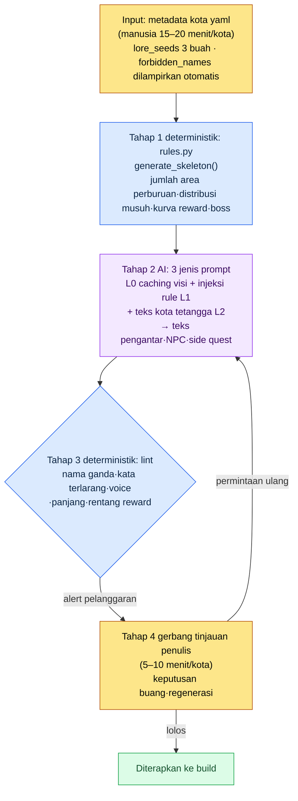

# 6.2 city_hunting_generator — Membuat 30 Kota dalam 4 Minggu

> Pembaca utama: Game Designer MMORPG yang bertanggung jawab atas produksi konten massal (tim skala menengah, 10–50 orang)
> Versi ringkas untuk pembaca solo/hobi: §6.2.10 "Versi Ringkas Solo"

Saya masih ingat perhitungan di hari pertama saat menerima jadwal yang menyatakan bahwa 30 kota harus siap sebelum rilis. Satu kota terdiri atas teks pengantar 5–10 baris, 3–5 area perburuan, 5–10 NPC dan 2–3 side quest per area perburuan, 1–3 jenis item khas, serta 1 boss kota. Membentuk satu kota dengan tangan memakan waktu 1–2 minggu. Untuk 30 kota, itu berarti satu penulis menghabiskan enam bulan penuh hanya untuk kota.

Tetapi enam bulan itu tidak ada. Waktu penulis sudah terikat pada main quest dan karakter signature, sementara 30 kota harus dikerjakan paralel dengan pekerjaan itu. Dorongan pertama, "Bukankah cukup minta AI membuat 30 kota saja?", langsung runtuh. Kalau diserahkan utuh, yang keluar adalah 30 desa fantasi yang saling mirip. Bab ini melihat bagaimana alat `city_hunting_generator` — yang saya buat sebagai pengganti dorongan itu — mengikat empat tahap (input, rulebook, AI, dan verifikasi) menjadi satu siklus, lalu melihat apa yang benar-benar dihasilkan dan apa yang dibuang ketika siklus itu dijalankan sungguh-sungguh sampai tuntas sekali.

> **Catatan Operasional Nyata Penulis**
> `city_hunting_generator` dalam bab ini adalah versi anonim dari alat nyata yang saya operasikan di folder R&D perusahaan. Nama berkas, struktur kode, dan item verifikasi saya pindahkan setia dari alat aslinya, sementara nama kota (seperti silvermark) dan istilah khas perusahaan diganti untuk keperluan buku. Teks keluaran adalah rekonstruksi dari sesi yang nyata.

---

## 6.2.1 Manusia Hanya Mengerjakan Metadata dan Tinjauan Akhir

Alur menyeluruh alat ini terdiri atas empat tahap. Intinya, tahap 1 dan 3 bersifat deterministik (rulebook) dan hanya tahap 2 yang AI. Ketika rulebook menjaga kerangka dan verifikasi dari kedua sisi, maka meskipun AI yang terjepit di tengah memberi jawaban yang sedikit berbeda setiap kali, konsistensi antarkota tidak goyah. Manusia hanya masuk pada input pertama (metadata) dan gerbang terakhir (tinjauan).



Dalam gambar ini, tempat yang tersentuh tangan manusia hanya ada dua. Di paling atas, tempat memasukkan satu halaman metadata secara bersih; di paling bawah, tempat membuat keputusan ihwal nada dan narasi yang tak bisa ditangkap lint. Di antara keduanya, pembuatan kerangka yang membosankan dan produksi teks massal dijalankan oleh rulebook dan AI. Rancangan yang menentukan ialah: meskipun lint (tahap 3) menemukan pelanggaran, ia tidak membuang otomatis, melainkan hanya menaikkan alert ke gerbang penulis (tahap 4). Alasannya akan kita lihat di §6.2.5.

---

## 6.2.2 Input — Satu Halaman Metadata Kota

Penulis menulis satu halaman metadata per kota. Waktu pengerjaan 15–20 menit. Singkat, tetapi satu halaman ini adalah seluruh input bagi tiga tahap berikutnya.

```yaml
# city_021_silvermark.meta.yaml
city_id: city_021_silvermark
region: west
climate: cold_arid
dominant_faction: scholar_guild
cultural_tone: scholarly_strict
level_range: [25, 30]
lore_seeds:
  - Merupakan pusat segel sihir 100 tahun lalu
  - Pertanda pertama melemahnya segel teramati di kota ini
  - Lokasi markas guild kaum cendekia
neighbors: [city_018, city_023]
# forbidden_names: (dilampirkan otomatis oleh skrip — tidak perlu input penulis)
```

Slot yang paling penting adalah `lore_seeds`. Tiga sampai lima peristiwa inti menentukan identitas kota. Kalau terlalu sedikit, AI memuntahkan kota fantasi umum; kalau terlalu banyak, peristiwa-peristiwanya saling bertentangan. Berdasarkan pengalaman saya, tiga buah adalah yang paling stabil.

`forbidden_names` tidak diisi penulis. Skrip membaca daftar nama kota dan karakter yang sudah ada, lalu melampirkannya otomatis ke metadata. Sebab, ketika 30 kota × rata-rata 50 NPC menumpuk, memeriksa duplikasi 1,500 nama dengan kepala manusia adalah hal yang mustahil. Tidak perlu menulis "buatkan agar tidak tumpang tindih dengan NPC kota lain" dengan tangan setiap kali.

---

## 6.2.3 Tahap 1 Rulebook — Menyusun Kerangka Secara Deterministik

Rulebook menerima metadata dan membuat kerangka struktur kota. Kodenya sederhana.

```python
# city_hunting_generator/rules.py (kerangka)
def generate_skeleton(meta):
    region_rules = REGION_RULES[meta.region]
    hg_count = region_rules.hunting_grounds_range.sample()
    enemy_dist = ENEMY_RULES[meta.climate][meta.dominant_faction]

    skeleton = {
        "hunting_grounds": [
            {
                "id": f"{meta.city_id}_hg_{i}",
                "level": meta.level_range[0] + i,
                "enemy_types": enemy_dist.sample(k=3),
                "reward_curve": calc_reward(meta.level_range[0] + i),
                "npc_count": region_rules.npc_per_hg,
                "sidequest_count": region_rules.sidequest_per_hg,
            }
            for i in range(hg_count)
        ],
        "boss": {
            "id": f"{meta.city_id}_boss",
            "level": meta.level_range[1] + 2,
            "pattern": BOSS_PATTERNS[meta.region],
        },
    }
    return skeleton
```

Hasilnya deterministik. Memasukkan metadata yang sama akan menghasilkan kerangka yang sama. Apakah kurva reward berada dalam rentang standar per region·level, dan apakah distribusi musuh sesuai rule climate·faction, dijamin oleh kode, dan pengujian regresi pun menangkapnya. Tahap ini sama sekali tidak diserahkan ke AI. Sebab, jika AI menarik angka kurva reward yang berbeda setiap panggilan, balance antarkota langsung goyah saat itu juga.

Jika metadata silvermark dimasukkan, `rules.py` mengembalikan kerangka kosong berupa 4 area perburuan (`city_021_silvermark_hg_0`\~`hg_3`), 6 slot NPC dan 3 slot side quest di tiap area perburuan, serta 1 boss level 32. Itu adalah tabel sel-sel yang harus diisi, yang belum punya nama maupun teks. Mengisi sel-sel itu adalah tugas tahap 2 AI.

---

## 6.2.4 Tahap 2 AI — Pembuatan Teks Bahasa Alami

Setelah rulebook membuat kerangka, AI mengisi teks bahasa alami di atasnya. Teks pengantar kota, nama·penampilan·latar singkat NPC, sinopsis side quest, serta flavor text item khas keluar di sini.

Pola pemanggilannya persis struktur empat lapis injeksi konteks. Visi L0 (world_premise + tone_manifesto) di-caching, rule L1 (city_naming_rule + region_west_lore) diinjeksikan secara selektif, teks tetangga L2 (daftar nama NPC kota lain) ditambahkan, lalu di akhir instruksi pekerjaan dilekatkan. Prompt teks pengantar kota berbentuk sedemikian rupa sehingga bisa langsung disalin dan dipakai.

```
[Konteks L0] world_premise + narrative_pillar + tone_manifesto  (caching)
[Konteks L1] city_naming_rule, region_west_lore
[Input] city_021_silvermark.meta.yaml + lore_seeds 3 buah

Tuliskan teks pengantar kota ini dalam 6–8 baris. Lebur ketiga lore_seeds secara
alami, dan buang klise RPG seperti "desa yang damai". Buat nadanya cendekia dan
ketat, tahan sentimen. Hanya teks isinya, tanpa kata pengantar maupun penjelasan.
```

Pola yang sama berulang persis pada produksi NPC dan pemanggilan side quest. Bedanya hanya pada konteks dan format keluaran. Pada pemanggilan NPC masuk slot `forbidden_names` (larangan nama NPC ganda dengan kota lain), dan pada pemanggilan side quest masuk batasan "pilih NPC pemberi tugas dari NPC yang dibuat di atas".

Lalu, apa yang sebenarnya keluar? Mari kita jalankan sampai tuntas sekali.

---

## 6.2.5 Satu Siklus sampai Tuntas — Keluaran, Verifikasi, Pembuangan

Kalau hanya ditulis secara abstrak "AI mengisi teks", kita tidak tahu apa sebenarnya yang dimuntahkan alat ini. Mari kita ikuti satu siklus kota silvermark, dari input hingga pembuangan, sampai tuntas sekali.

> **[Keluaran Tahap 2 AI — Teks Pengantar Kota] (rekonstruksi sesi nyata)**
>
> Silvermark adalah kota segel. Seratus tahun lalu, tujuh cendekiawan mendirikan lingkaran segel di bawah tanah ini untuk menahan luapan mana dari barat, dan kota itu tumbuh dengan menumpuk batu satu per satu di atas lingkaran tersebut. Menara lonceng markas guild kaum cendekia adalah observatorium untuk membaca denyut segel, bukan menara puncak yang menjulang ke arah dewa. Tiga tahun terakhir, satu baris berulang tercatat dalam rekaman pengamatan: "Denyutnya mendingin." Pertanda pertama melemahnya segel pertama kali bergetar bukan di tempat lain mana pun, melainkan di panel instrumen kota inilah. Para cendekiawan di jalan tidak mengucapkannya dengan suara keras. Hanya saja, kian bertambah hari-hari ketika api di menara lonceng tak padam sepanjang malam.

Di sini ketiga lore_seeds (pusat segel·pertanda pertama melemahnya·markas guild kaum cendekia) semuanya termuat dalam teks, tidak ada klise seperti "desa damai yang menyambut petualang", dan nada scholarly_strict (menahan sentimen, kosakata pengamatan·rekaman) terjaga. Beginilah rupa keluaran yang layak lolos.

Berikutnya, siklus yang sama mengisi 3 dari 6 slot NPC di area perburuan `hg_0`.

> **[Keluaran Tahap 2 AI — 3 NPC] (rekonstruksi sesi nyata)**
>
> **1) Doren Vale** — Asisten pengamatan menara lonceng. Usia 50-an, kaca pembesar kuningan terpasang permanen di satu mata. Sudah 30 tahun mengerjakan pencatatan getaran halus denyut segel. Pendiam, dan hanya berbicara lewat angka. *"Hari ini 12.4. Kemarin 12.1. Sedang naik. Bukan pertanda baik."*
>
> **2) Mira Kost** — Pustakawan arsip guild. Usia 30-an, noda tinta tak hilang dari jarinya. Ia menjaga rancangan asli lingkaran segel, tetapi justru meyakini bahwa para cendekiawan yang sanggup membaca cetak biru itu sudah mati semua. Sangat waspada terhadap orang luar.
>
> **3) Grem** — Penjaga perapian di bawah menara lonceng. Tak diketahui asal-usulnya, usianya tak jelas. Satu-satunya tugasnya adalah menjaga agar api menara lonceng tak padam, dan kepada siapa pun yang bertanya soal segel ia hanya menjawab, "Lihat saja apinya." *(Ditandai ambigu — dilaporkan sendiri oleh AI)*

Perhatikan bahwa pada NPC ketiga, 'Grem', AI sendiri melekatkan *tanda ambigu*. Prompt yang baik membuat AI bisa mengatakan, "Yang ini saya tidak yakin." Sekarang lint tahap 3 menghantam kumpulan keluaran ini.

> **[Keluaran Lint Tahap 3] (format nyata)**
>
> ```
> [PASS] Pemeriksaan panjang: teks pengantar 7 baris (standar 6–8)
> [PASS] Rentang reward: reward_curve hg_0~hg_3 dalam rentang standar
> [WARN] Nama ganda: "Mira Kost" — marga (Kost/Veldt) berbeda dari "Mira Veldt"
>        di city_014_riverhold, tetapi nama depan (Mira) sama. Bentrok dekat forbidden_names.
> [PASS] Kosakata terlarang: 0 pelanggaran tone_manifesto
> [WARN] Konsistensi voice: dialog "Grem" voice_lint reliabilitas 0.62 (di bawah ambang 0.70)
> ```

Lint menangkap 2 pelanggaran, tetapi tidak ada satu pun yang dibuang secara otomatis. Ia hanya menaikkannya ke gerbang penulis sebagai WARN. Inilah inti rancangan yang sudah saya beri tahu di §6.2.1. Kalau pemeriksa diberi pula wewenang menolak otomatis, dalam satu-dua bulan saja para penulis akan menurunkan sakelar itu. Sebab mesin akan ikut membunuh variasi yang sebenarnya disengaja, dan bahkan kesempatan bagi penulis untuk menimbang sendiri batas itu pun terampas. Maka, pekerjaan menyaring kandidat yang mencurigakan diserahkan ke mesin, tetapi keputusan akhir untuk menghidupkan atau membuang kandidat itu tetap ditinggalkan di tangan manusia.

> **[Tinjauan Penulis Tahap 4 — Penilaian dan Pembuangan]**
>
> Penulis menangani 2 alert seperti ini.
>
> - **Mira Kost** → Dipertahankan. Meski namanya sama dengan Mira Veldt di riverhold, kotanya berbeda, marganya berbeda, dan tak ada kemungkinan muncul bersamaan. Lolos sebagai variasi yang disengaja. (Namun, soal apakah rule forbidden_names akan diubah dari "nama depan + marga sama persis" menjadi "bentrok nama depan saja pun WARN" dicatat sebagai perkara terpisah.)
> - **Grem** → **Dibuang.** Reliabilitas voice_lint yang rendah adalah sinyalnya. Setelah dibaca ulang, karakter penjaga perapian yang berkata "Lihat saja apinya" tidak selaras dengan nada kota scholarly_strict. Kalau NPC di kota yang dikuasai guild kaum cendekia tergelincir ke nada mistik, identitas kota jadi kabur. Dibuang lalu diminta ulang.

Setelah penulis memutuskan pembuangan, satu putaran permintaan ulang berjalan. "Buang slot Grem. Buat ulang NPC penjaga perapian yang sesuai nada guild kaum cendekia (pengamatan·rekaman·ketat) di area perburuan yang sama. Kosakata mistik dilarang." AI menjawab kembali dengan seorang tua yang mencatat suhu perapian menara lonceng, yang bahkan melihat api sebagai data, dan keluaran itu lolos dengan voice_lint 0.81. Satu siklus input → kerangka → teks → verifikasi → pembuangan → regenerasi tertutup di sini.

Satu putaran ini adalah standar Show bagi keseluruhan buku ini. Tanpa sekali pun melihat sampai tuntas apa yang dimuntahkan alat, apa yang tersangkut, dan apa yang dibunuh manusia, kalimat "diproduksi massal dengan AI" itu kosong belaka.

---

## 6.2.6 Tingkat Pembuangan Bukan Kegagalan Alat, melainkan Sinyal Gerbang

Pada siklus di atas, 1 NPC dibuang. Dilihat dari satu kota secara keseluruhan, pembuangan menumpuk lebih banyak. Waktu tinjauan rata-rata 5–10 menit per kota, tingkat pembuangan sekitar 20% untuk NPC dan sekitar 33% untuk side quest.

Saya nyatakan secara jujur dasar penghitungan rasio ini. Tingkat pembuangan adalah nilai yang dihitung saat saya sendiri meninjau 5 kota — termasuk silvermark — pada awal penerapan. NPC: dari 30 yang ditinjau, 6 dibuang (20%); side quest: dari 15 yang ditinjau, 5 dibuang (33%). Karena sampelnya kecil, yaitu 5 kota, lebih tepat dibaca sebagai nilai arah pada taraf "satu dari lima, satu dari tiga", bukan rasio populasi yang presisi. Rasio kumulatif setelah meninjau seluruh 30 kota bisa jadi lebih rendah dari ini, atau bisa pula lebih tinggi tergantung sifat area perburuannya.

Yang penting, tingkat pembuangan 0% bukanlah tujuan. Pembuangan 0% justru mendekati sinyal bahwa tinjauan berjalan secara formalitas. Ketika satu dari lima NPC dibuang karena nadanya tak cocok, dan satu dari tiga side quest diregenerasi karena tak menempel pada lore_seeds, di situlah gerbang tinjauan benar-benar bekerja.

---

## 6.2.7 Pengukuran — 30 Kota dalam 4–5 Minggu

Saya membandingkan sebelum dan sesudah penerapan alat. Nilai waktu di bawah adalah rata-rata aktual dari kota-kota awal termasuk silvermark, sedangkan kolom "sebelum penerapan" adalah perkiraan penulis pada masa kerja tangan sebelum alat ada. Tidak ada angka yang diolah-olah.

| Butir | Sebelum penerapan (kerja tangan) | Sesudah penerapan (aktual) |
|---|---|---|
| Waktu menulis 1 kota | 1–2 minggu | sekitar 30 menit (meta 15 menit + AI 5 menit + tinjauan 8 menit) |
| Total durasi 30 kota | setara 6 bulan 1 penulis | 4–5 minggu |
| Tingkat pembuangan (NPC) | — (seluruhnya ditulis langsung) | sekitar 20% (6 dari 30) |
| Tingkat pembuangan (side quest) | — | sekitar 33% (5 dari 15) |
| Insiden konsistensi (per kota) | nyaris tak ada | 0–1 |

Kalau hanya melihat tabel, semuanya cuma soal angka, tetapi efek sebenarnya muncul dari kolom lain. Saat waktu penulis yang nyaris terikat pada produksi massal kota terbebaskan, satu penulis bisa meningkatkan keluaran main quest per kuartal secara signifikan (kelipatan persisnya berbeda tiap kuartal, jadi tidak saya pastikan — arahnya adalah "keluaran main jelas meningkat"). Alat produksi massal bekerja bukan sebagai alat yang menyerap waktu penulis, melainkan yang membebaskannya (peringatan §6.1.8 — bahwa alat akan ditolak jika penulis merasa dirinya berubah jadi "mesin pemeriksa" — berlaku persis di sini).

---

## 6.2.8 Konten yang Tidak Masuk ke generator

Sekalipun cakupan otomasi makin lebar, hal-hal berikut tetap diletakkan di luar alat.

| Konten | Alasan diletakkan di luar alat |
|---|---|
| Teks main quest | Konsistensi·kedalaman narasi langsung terkait identitas game |
| Pola·pengarahan boss | Detail visual·interaksi banyak, sehingga tangan desainer lebih cepat |
| Karakter signature utama | Perlu penulisan voice_profile penuh, sehingga tak bisa diproduksi massal |
| Akhir percabangan | Ranah keputusan langsung penulis |
| 1–2 side quest signature per kota | Dipilih dan dibuat langsung oleh penulis |

Fakta bahwa sesuatu bisa diproduksi massal tidak boleh otomatis berlanjut menjadi keputusan bahwa ia harus diproduksi massal. Seperti yang kita lihat pada siklus silvermark, alat memproduksi hingga 5 dari 6 NPC dengan baik. Namun satu NPC signature yang memikul ketegangan inti kota itu — 'segelnya mendingin' — dibentuk langsung oleh penulis. Ketika batas otomasi jelas, alat produksi massal justru menjadi alat yang menjaga ranah inti tersebut.

---

## 6.2.9 Lima Kegagalan yang Umum

| Pola kegagalan | Mengapa gagal | Resep |
|---|---|---|
| Menulis lore_seeds hanya 1–2 buah | Keluaran AI rata jadi RPG umum | Wajib 3 buah atau lebih (§6.2.2) |
| Meminta produksi massal utuh ke AI tanpa rulebook | "Buatkan 30 kota" → 30 desa yang mirip | Tahap 1 rulebook tak bisa dilewati (§6.2.3) |
| Mengandalkan tinjauan penulis saja tanpa lint | Peninjau menghabiskan waktu menangani pelanggaran rule sepele | Verifikasi otomatis tahap awal dulu (§6.2.5) |
| Melewatkan pemeriksaan nama ganda | Duplikasi 1,500 nama mustahil bagi kepala manusia | Lampirkan forbidden_names otomatis (§6.2.2) |
| Tidak mengukur kepuasan penulis | Throughput naik, tetapi alat ditolak jika merampas waktu penulis | Jaminan eksplisit waktu konten main (§6.2.7) |

Yang kelima paling sering terlewat. Agar penulis dengan senang hati membuat penilaian seperti membuang Grem di silvermark, penulis harus punya sisa waktu untuk membentuk langsung, bukan sekadar meninjau produksi massal. Kalau hanya throughput yang diukur dan pengukuran waktu penulis dihilangkan, alat akan sukses di atas KPI tetapi orangnya pergi.

---

## 6.2.10 Coba Sendiri — Satu Langkah yang Bisa Dilakukan Hari Ini

> **Versi Ringkas Solo**: Anda tidak perlu kode rulebook. Pilih satu kota·daerah dari game Anda sendiri (atau game favorit Anda), tulis metadata berformat §6.2.2 dengan tangan (3 lore_seeds adalah intinya), lalu salin langsung prompt teks pengantar dari §6.2.4 dan jalankan sekali. Coba pilih sendiri satu NPC yang nadanya tak cocok dari hasilnya, dan bantah dengan "NPC ini tak selaras dengan nada kota, buang dan ulang"; maka Anda akan merasakan dengan tubuh, gerbang tinjauan itu kumpulan penilaian macam apa.

Kalau Anda bertim, mulailah dengan satu langkah berikut. Buat dulu satu lembar format yaml metadata dan skrip pelampiran otomatis `forbidden_names`. Kerangka rulebook (`generate_skeleton`) dan lint menyusul setelahnya. Dengan hanya dua hal — format input dan pemeriksaan nama ganda — Anda sudah bisa lebih dulu mencegah dua kegagalan umum yang membuat produksi massal teks AI runtuh jadi "30 desa yang mirip".

---

## 6.2.11 Pratinjau Bab Berikutnya

Pada 6.3 saya membahas pipeline NPC Persona/Squad. Jika generator di 6.2 memproduksi massal NPC seperti Doren·Mira secara individual, maka Persona/Squad mengikat NPC-NPC itu dalam satuan kelompok. Itu adalah cara membuat lima NPC dari satu area perburuan bekerja sebagai sebuah masyarakat kecil, bukan sekadar himpunan boneka yang saling tak berkaitan.

---

### Poin-Poin Penting
- Tahap 1·3 adalah rulebook (deterministik), hanya tahap 2 yang AI — manusia hanya pada input dan gerbang tinjauan.
- Keluaran·verifikasi·pembuangan harus dilihat sampai tuntas sekali agar "produksi massal AI" tidak kosong.
- Tingkat pembuangan 20·33% bukan kegagalan alat, melainkan sinyal bahwa gerbang bekerja.

### Pratinjau Bab Berikutnya
- 6.3. Pipeline NPC Persona/Squad
