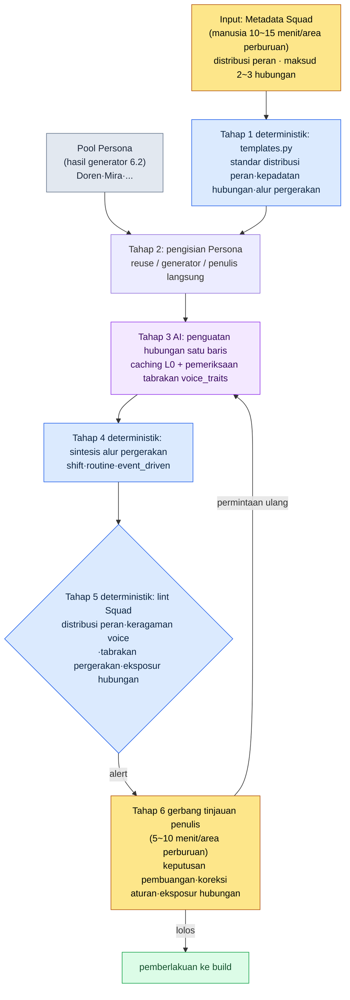

# 6.3 Persona dan Squad NPC — Dari Museum Boneka Menjadi Masyarakat Kecil

> Pembaca utama: Game Designer MMORPG yang bertanggung jawab atas konten NPC dan area perburuan (tim berukuran menengah, 10\~50 orang)
> Versi ringkas untuk pembaca solo/hobi: §6.3.10 "Versi Ringkas Solo"

Saya punya satu kenangan dari hari ketika saya memakai generator dari 6.2 untuk memproduksi lima NPC sekaligus di satu area perburuan, lalu menampilkannya di dalam game. Nama, penampilan, dan latar belakang singkat semuanya terisi, dan saya menempatkannya hanya dengan menandai koordinat. Namun begitu saya berjalan-jalan di area perburuan itu, anehnya area itu terasa mati. Kelima orang berada di ruang yang sama, tetapi tidak satu kali pun mereka saling menyebut. Dua orang berdiri bertumpuk di atas batu yang sama. Seseorang seharusnya berperan sebagai pedagang, tetapi kelimanya adalah cendekiawan. Doren maupun Mira secara individu adalah NPC yang baik-baik saja, tetapi begitu disatukan, mereka hanya menjadi sekumpulan boneka.

Inilah kondisi museum boneka. NPC individu semuanya sudah dibuat, tetapi sebagai kelompok mereka tidak hidup. Bab ini membahas pipeline yang menyatukan kelima orang itu menjadi sebuah masyarakat kecil. Dekomposisi intinya adalah Persona dan Squad. Jika diibaratkan dengan kantor, Persona adalah kartu nama pribadi setiap karyawan, dan Squad adalah bagan organisasi satu tim. Menumpuk 50 kartu nama tanpa bagan organisasi tidak membuat perusahaan berjalan. Dan tulang punggung bab ini adalah tahap terakhir, yaitu titik di mana kita memverifikasi sampai akhir satu siklus bersama AI apakah kelompok yang telah disatukan itu "berbicara dan bergerak seperti orang-orang yang saling mengenal".

> **Catatan Operasional Nyata Penulis**
> Pipeline Squad pada bab ini adalah hasil anonimisasi dari alat NPC Persona/Squad yang penulis operasikan di folder R&D perusahaan. Struktur yaml, item verifikasi, dan ambang voice_lint dipindahkan dengan setia dari alat yang sebenarnya, sedangkan nama kota dan NPC diganti untuk keperluan buku, sama seperti pada 6.2. Isi keluaran adalah rekonstruksi dari sesi yang sebenarnya.

---

## 6.3.1 Persona adalah Kartu Nama, Squad adalah Bagan Organisasi

Persona adalah identitas setiap NPC individu. Ia memuat nama, penampilan, voice_profile, dan peran. Yang dibuat oleh generator dari 6.2 adalah Persona. Doren Vale dan Mira Kost masing-masing adalah satu Persona.

Squad adalah unit yang menyatukan Persona-Persona itu menjadi sebuah kelompok. Ia mendefinisikan bagaimana lima orang di satu area perburuan terdistribusi dalam berbagai peran, hubungan apa yang ada di antara mereka, dan bagaimana mereka bergerak.

| Unit | Isi yang Dimuat | Pembuatnya |
|---|---|---|
| Persona | nama·penampilan·voice_profile·peran | generator (6.2) |
| Squad | distribusi peran·hubungan·alur pergerakan | pipeline Squad (bab ini) |

Jika keduanya tidak dipisahkan, dua hal akan tersumbat sekaligus. Jika hanya Persona yang diproduksi massal, jadilah museum boneka; jika kita mencoba membuat Squad lebih dulu, tidak ada Persona untuk diisi. Dengan memisahkannya, operasi setiap unit menjadi sederhana. Namun pemisahan bukan berarti pemutusan. Intinya adalah memasang jalur reuse dan verifikasi di antara kedua unit itu, dan inilah inti bab ini.

Dekomposisi Persona→Squad ini bukan sekadar penataan, melainkan membuka jalan untuk pergi lebih jauh. Hanya jika kelompok NPC sudah diformalkan ke dalam peran, hubungan, dan angka, kita nantinya bisa sampai pada reaktivitas dinamis di mana keadaan dunia (akumulasi tindakan pemain) menggoyang angka NPC, dan angka itu menjadi syarat kemunculan quest. Bab ini hanya menyentuh pintu masuk penerapan progresif itu; secara langsung, ia hanya membahas sampai "produksi massal konservatif yang ditinjau manusia".

---

## 6.3.2 Input — Metadata Squad Satu Halaman

Kerangka Squad dimulai dari satu halaman metadata per area perburuan. Ini adalah pemikiran yang sama dengan metadata kota dari 6.2. Manusia hanya menetapkan distribusi peran dan maksud hubungan, sedangkan pekerjaan mengisinya dilakukan oleh rulebook (buku aturan) dan AI.

```yaml
# city_021_hg_3.squad.yaml
squad_id: city_021_hg_3_squad
hunting_ground: city_021_silvermark_hg_3
type: hunting_ground_residents
size: 5
roles:
  - role: quest_giver
    count: 1
    voice_traits: [authoritative, scholarly]
  - role: lore_keeper
    count: 1
    voice_traits: [scholarly, withdrawn]
  - role: merchant
    count: 1
    voice_traits: [practical, dry]
  - role: bystander
    count: 2
    voice_traits: [varied]
relationships:
  - between: [quest_giver, lore_keeper]
    type: mentor_and_former_student
  - between: [merchant, bystander_1]
    type: regular_customer
movement_pattern: stationary_with_shifts
```

Slot yang paling penting adalah `relationships`. Jika hubungannya 0, kelima orang akan tetap menjadi orang asing sampai akhir. Jika hubungannya terlalu banyak (5 orang dengan 5 hubungan atau lebih), pengguna jadi punya terlalu banyak yang harus diingat sehingga justru tenggelam. Menurut pengalaman penulis, 2\~3 hubungan inti untuk Squad beranggotakan 5 orang adalah yang paling stabil. `voice_traits` adalah perangkat untuk memastikan kelima orang memiliki suara yang berbeda satu sama lain. Jika kelimanya diisi `scholarly`, ia akan tertangkap oleh perataan voice (voice leveling) pada tahap verifikasi.

---

## 6.3.3 Tahap 1 dan 2 — Kerangka Rulebook dan Pengisian Persona

Rulebook terlebih dahulu menetapkan standar kerangka Squad. Nilai default untuk ukuran, distribusi peran, kepadatan hubungan, dan pola pergerakan per region·type area perburuan sudah dimasukkan ke dalam kode.

```python
# npc_squad/templates.py (cuplikan)
SQUAD_TEMPLATES = {
    ("west", "hunting_ground_residents"): {
        "size_range": (4, 6),
        "role_distribution": {
            "quest_giver": 1,
            "merchant": 1,
            "lore_keeper": (0, 1),
            "bystander": (1, 3),
        },
        "relationship_density": 2,        # jumlah hubungan yang disarankan
        "movement_pattern": "stationary_with_shifts",
    },
    ("east", "outpost_squad"): {
        "size_range": (3, 4),
        "role_distribution": {
            "commander": 1,
            "scout": 1,
            "support": (1, 2),
        },
        "relationship_density": 1,
        "movement_pattern": "patrol_loop",
    },
}
```

Tahap ini bersifat deterministik. Insiden di mana Squad penduduk wilayah barat berisi lima quest_giver saja secara teknis tidak mungkin terjadi pada level kode. Jika distribusi peran keluar dari aturan, ia tersumbat di tempat itu juga.

Berikutnya, kita mengisi Persona ke setiap slot. Ada tiga jalan. Jika ada Persona yang cocok di pool, gunakan kembali (bobot kemunculan +1); jika tidak ada, buat baru dengan generator dari 6.2; dan jika ia tokoh inti quest utama, penulis menuliskannya sendiri. Squad hg_3 silvermark mengisi quest_giver dan lore_keeper dengan Mira dan Doren yang sudah diproduksi massal di 6.2, lalu menarik merchant dan 2 bystander secara baru. Sampai di sini, prosesnya sama dengan siklus generator dari 6.2. Pekerjaan sejati bab ini ada di tahap berikutnya, yaitu titik di mana kita memverifikasi apakah kelompok yang disatukan benar-benar berfungsi seperti sebuah kelompok.

---

## 6.3.4 Satu Siklus Sampai Akhir — Verifikasi Penguatan Hubungan·Alur Pergerakan·Konsistensi

Jika kita hanya menulis secara abstrak "AI memperkuat hubungan", kita tidak akan tahu apa yang dikeluarkan pipeline ini. Mari kita ikuti satu siklus akhir dari satu Squad hg_3 silvermark sampai tuntas — dari pembangkitan teks hubungan hingga pembuangan dan permintaan ulang.

### Tahap 3 — Penguatan Hubungan oleh AI

Tag hubungan (`mentor_and_former_student`) yang dimasukkan ke kerangka Squad bersifat abstrak sehingga tidak terlihat di dalam game. Mengubah ini menjadi deskripsi satu baris lalu menanamkannya ke dalam dialog dan event NPC adalah tahap 3. Prompt-nya berbentuk yang bisa disalin dan dipakai apa adanya.

```
[Konteks L0] world_premise + tone_manifesto  (caching)
[Konteks L1] city_021_silvermark.lore (didominasi guild cendekiawan, scholarly_strict)
[Persona 1] quest_giver — Mira Kost, pustakawan arsip guild, usia 30-an, noda tinta
[Persona 2] lore_keeper — Doren Vale, asisten observasi menara lonceng, usia 50-an, hanya bicara dengan angka
[Tag hubungan] mentor_and_former_student

Deskripsikan hubungan kedua orang ini (mentor–mantan murid) dalam 1~2 baris saja
sebagai latar untuk dipakai pada dialog game. Doren dengan angka, Mira dengan dokumen —
agar kedua gaya bicara tidak bertabrakan. Tonnya gaya cendekiawan yang ketat,
buang misteri atau klise seperti "sahabat lama". Hanya isi pokoknya saja.
```

> **[Keluaran AI Tahap 3 — Hubungan Satu Baris] (rekonstruksi sesi nyata)**
>
> 20 tahun lalu Doren mengajari Mira notasi catatan observasi rajah penyegelan. Kini posisinya terbalik: angka yang diukur Doren disalin oleh Mira ke buku besar arsip. Setiap Selasa, keduanya berdebat singkat soal satu kolom di mana nilai observasi tidak cocok dengan buku besar.

Keluaran ini bagus. `mentor_and_former_student` sudah dikonkretkan, "angka" milik Doren dan "dokumen" milik Mira disatukan tanpa benturan dalam satu adegan (menyalin angka ke buku besar), dan ton scholarly_strict tetap terjaga. Prompt yang sama diulang untuk hubungan `regular_customer` antara merchant–bystander_1.

### Tahap 4 — Sintesis Alur Pergerakan

Jika NPC berdiri di satu tempat sepanjang hari, ia kembali menjadi boneka. Rulebook mengisi pola pergerakan. stationary berarti diam di satu tempat (penjaga·bos), stationary_with_shifts berarti perubahan posisi halus setiap 8 jam (umum), routine_loop berbasis jadwal (penduduk), dan event_driven hanya bergerak saat trigger (NPC quest). Ini bersifat deterministik sehingga tidak memanggil AI.

### Tahap 5 — lint Konsistensi Squad (gerbang pipeline ini)

Sekarang kita memeriksa apakah kelima orang yang telah disatukan benar-benar berfungsi seperti sebuah kelompok. Jika lint dari 6.2 melihat NPC individu, maka lint ini melihat konsistensi kelompok.

> **[Keluaran lint Squad Tahap 5] (format nyata)**
>
> ```
> [PASS] Distribusi peran: quest_giver 1 · lore_keeper 1 · merchant 1 · bystander 2 (aturan terpenuhi)
> [PASS] Kepadatan hubungan: 2 buah (disarankan 2, terpenuhi)
> [WARN] Keragaman voice: kelompok scholarly 3/5 — quest_giver·lore_keeper·bystander_2
>        memiliki cosine similarity voice_profile 0.83 (melebihi ambang 0.80). Risiko perataan.
> [WARN] Tabrakan alur pergerakan: pada rentang 14:00~16:00 koordinat merchant·bystander_1 tumpang tindih dalam radius 1.5m
> [FAIL] Eksposur hubungan: 2 hubungan terdefinisi, tetapi tidak ada satu pun penyebutan anggota lain di dialog 5 orang (0 buah).
>        Hubungan hanya ada di data — visibilitas dalam game 0.
> ```

lint menangkap tiga kasus. Ketiganya tidak dibuang otomatis, melainkan dinaikkan ke gerbang — desain yang sama dengan §6.2.5, yaitu kandidat yang mencurigakan dipilih oleh mesin tetapi keputusan untuk membunuh atau membiarkannya hidup ditentukan oleh manusia.

> **[Tinjauan Penulis Tahap 6 — Putusan dan Pembuangan]**
>
> Penulis menangani ketiga alert ini sebagai berikut.
>
> - **Perataan voice (WARN)** → Buang bystander_2. Bahkan di kota cendekiawan sekalipun, jika kelima orang semuanya bergaya bicara cendekiawan, area perburuan jadi monoton. Minta regenerasi bystander_2 menjadi pekerja serabutan bergaya `practical, dry`. (Fakta bahwa quest_giver·lore_keeper keduanya cendekiawan adalah identitas kota, jadi dipertahankan.)
> - **Tabrakan alur pergerakan (WARN)** → Koreksi aturan. Geser offset awal shift merchant menjadi +2 jam untuk menghilangkan tumpang tindih pukul 14:00. Hanya parameter pergerakan yang disesuaikan, tanpa pemanggilan AI.
> - **Eksposur hubungan 0 (FAIL)** → Yang paling penting. Jika dua hubungan sudah didefinisikan tetapi tidak pernah sekali pun terlihat di dalam game, maka data itu adalah data mati. Penulis memutuskan memilih 1 hubungan inti (Doren–Mira) untuk ditanamkan ke dalam dialog.

Dua dari tiga kasus ditutup dengan aturan dan regenerasi, dan FAIL terakhir adalah inti pipeline ini. Penulis meminta tambahan satu baris cabang dialog Doren.

```
Selipkan satu baris saja pada dialog Doren yang membocorkan hubungannya dengan Mira secara samar.
Jangan bergaya penjelasan, tapi sebagai keterangan sampingan. Ton gaya cendekiawan, satu baris dialog saja.
```

> **[Keluaran Permintaan Ulang]**
>
> *"Cetak biru itu ada di arsip. Tanyakan pada Mira. ...20 tahun lalu akulah yang mengajarinya cara membaca, sekarang malah terbalik."*

Pada saat satu baris ini masuk, hubungan kedua NPC berpindah dari sheet data ke layar game. Satu siklus dari input (metadata Squad) → kerangka → pengisian Persona → penguatan hubungan → alur pergerakan → verifikasi konsistensi → keputusan pembuangan·eksposur ditutup di sini.

Satu putaran ini adalah kriteria Show bab ini. Kalimat "NPC sudah disatukan menjadi masyarakat lewat Squad" akan hampa jika kita belum pernah satu kali pun menyaksikan adegan di mana manusia menutup FAIL eksposur hubungan 0 dengan satu baris dialog.

---

## 6.3.5 Alur Lengkap Persona→Squad

Saya muat siklus di atas dalam satu gambar. Intinya adalah tahap 1·2·4·5 bersifat deterministik (rulebook·lint) dan hanya tahap 3 yang AI, serta tangan manusia hanya menyentuh input paling atas dan gerbang paling bawah.



Tempat yang disentuh tangan manusia hanya dua. Tempat paling atas untuk menetapkan maksud peran·hubungan, dan tempat paling bawah untuk memutuskan ton·narasi yang tidak bisa ditangkap lint. Di antara keduanya, kerangka·alur pergerakan·verifikasi dijalankan oleh rulebook, dan isi pokok hubungan oleh AI.

---

## 6.3.6 Tiga Perangkat untuk Membuat Hubungan Terlihat di Game

Item `eksposur hubungan` pada lint tahap 5 paling sering FAIL. Karena hubungan hanya hidup di data. Ada tiga perangkat untuk menarik hubungan ke dalam game.

Pertama, **kutipan dialog**. Seperti dialog Doren di §6.3.4, NPC menyebut anggota lain dalam satu baris. Paling murah dan paling besar efeknya.

Kedua, **persilangan alur pergerakan**. Adegan Doren dan Mira berada bersama di arsip setiap Selasa diamati di dalam game. Jika pengguna melihatnya secara kebetulan, ia akan sadar "apakah kedua orang itu ada kaitannya". Jika alur pergerakan tahap 4 dan hubungan cocok, ini muncul secara alami.

Ketiga, **syarat percabangan**. Jika permintaan quest_giver ditolak, afinitas lore_keeper ikut turun. Perangkat ketiga inilah pintu masuk penerapan progresif yang disebut di §6.3.1 — titik di mana hubungan mulai memengaruhi keadaan game, melampaui sekadar deskripsi.

Tidak perlu memakai ketiga perangkat. Pada Squad beranggotakan 5 orang, bahkan jika hanya 2\~3 hubungan inti yang diekspos lewat perangkat pertama·kedua, rasa yang dirasakan dari area perburuan sudah berubah besar. Jika berlebihan, pengguna jadi punya banyak yang harus diingat. Penulis memilih hubungan mana yang akan diekspos pada tahap tinjauan dan menyelipkannya, sedangkan sisanya dibiarkan hanya sebagai data.

---

## 6.3.7 Pengukuran — Secara Jujur

Saya membandingkan sebelum dan sesudah pengenalan alat. Saya tidak memakai angka olahan. Waktu dan rasio adalah nilai yang saya hitung dengan meninjau langsung beberapa area perburuan awal termasuk silvermark, dan kolom "sebelum pengenalan" adalah perkiraan penulis dari masa kerja manual.

| Item | Sebelum Pengenalan (manual·perkiraan) | Sesudah Pengenalan (terukur) |
|---|---|---|
| Menyatukan Squad 1 area perburuan | sekitar 3\~4 jam | sekitar 25 menit (metadata 12 menit + AI 5 menit + tinjauan 8 menit) |
| Jumlah eksposur hubungan (dialog·alur pergerakan) | 0\~1 per area perburuan | 1\~2 terekspos dari 2\~3 inti |
| Tabrakan alur pergerakan (2 orang+ di koordinat sama) | 2\~3 per area perburuan | dicegah dini oleh lint, 0\~1 |
| Pembuangan akibat perataan voice | — (tanpa pemeriksaan) | 0\~1 dari 5 orang diregenerasi |

Karena sampelnya kecil, hanya beberapa area perburuan, tepat untuk membacanya sebagai nilai arah, bukan rasio populasi yang presisi. Perubahan terbesar tidak termuat dalam tabel. Karena FAIL `eksposur hubungan` pada lint memaksakan ke penulis "area perburuan ini, satu pun hubungan tidak terlihat", maka produk massal yang dirilis sebagai museum boneka berkurang secara struktural. Bahwa pembuangan 0% dan eksposur 0 bukanlah tujuan (§6.2.6) juga berlaku sama di sini. Squad menyerap sebagian besar pekerjaan menyatukan, tetapi tetap harus ada waktu tersisa bagi penulis untuk mengukir sendiri bagian inti seperti satu baris dialog terakhir Doren.

---

## 6.3.8 Pool Persona — Jika Tokoh yang Sama Muncul di Beberapa Kota

Jika Squad sudah stabil, operasi yang otomatis menyusul adalah pool Persona. Persona yang sama bisa tampil di beberapa kota. NPC anggota guild cendekiawan yang berpapasan di tiga atau empat kota justru terasa alami. Dunia tidak terlihat sempit, melainkan terlihat terhubung.

```yaml
persona_pool:
  - id: persona_doren_vale
    voice_traits: [terse, numeric]
    appearance_count: 3
    appearance_cities: [city_021, city_018, city_023]
    signature: false
  - id: persona_mira_kost
    voice_traits: [scholarly, withdrawn]
    appearance_count: 2
    signature: false
```

Rasio reuse memiliki rentang yang sehat.

| Rasio Reuse | Kondisi |
|---|---|
| Di bawah 20% | Volume NPC meledak, beban identifikasi |
| 30\~50% | Rentang operasi yang sehat |
| 70% ke atas | NPC membosankan, keragaman rusak |

Namun jika satu NPC dimunculkan di terlalu banyak kota, jadilah "orang ini muncul lagi". Maksimal kota tempat satu Persona tampil dibatasi pada 5 tempat. Ruang bos dan tokoh signature dilarang di-reuse (`signature: true`). Mulai dari kemunculan kedua Persona yang sama, variasi visual (pencahayaan·properti) diberlakukan secara wajib. Rentang 30\~50% ini bukan angka presisi melainkan panduan operasional — harus dikoreksi sesuai skala tim·game.

> **[Penanda Arah — Jika Melihat Pool Persona sebagai Distribusi (Masih Terlalu Dini)]** Bagi tim yang pool-nya membesar hingga ratusan NPC, ada satu arah yang lebih maju selangkah — sebuah penanda arah pada posisi yang sama dengan subbab 'vektor dimensi' di §8.2.7 (bukan resep — untuk intuisi konsepnya lihat Lampiran M). voice_lint di §6.3.4 sudah melihat "kedekatan" lewat cosine similarity dua Persona (nilai seperti 0.83). Jika embedding yang sama dinaikkan ke seluruh pool, kebosanan bisa didiagnosis bukan dari kesan penulis melainkan dari kepadatan distribusi — kondisi "gaya bicara cendekiawan berkerumun di satu sudut" terlihat sebagai kepadatan titik di area itu. Maka, alih-alih menandai "satu lagi cendekiawan serupa" di area kepadatan rendah, terbuka jalan untuk mengisi keragaman dengan variasi hasil interpolasi antara dua Persona yang berdekatan. Namun ada dua hal yang perlu diperhatikan dalam tarikan napas yang sama. Persona yang ditarik lewat interpolasi mudah menjadi 'nilai tengah yang mati', yaitu campuran canggung dua NPC, sehingga pada akhirnya manusia harus menghidupkan kembali voice-nya. Dan rasio kebosanan di atas (30\~50%) bukan nilai presisi melainkan panduan operasional, sehingga begitu ia dikonversi menjadi jarak embedding, ada risiko kelonggaran itu menyamar seolah-olah presisi — nilai jarak adalah sinyal yang membantu putusan penulis, bukan putusan itu sendiri.

---

## 6.3.9 Enam Kegagalan yang Umum

| Pola Kegagalan | Mengapa Gagal | Resep |
|---|---|---|
| Hanya memproduksi Persona dan mengabaikan Squad | 50 NPC semua ada tetapi area perburuan mati | Memperkenalkan rulebook kerangka Squad (§6.3.3) |
| Generasi otonom tanpa aturan distribusi peran | Insiden distribusi seperti lima pedagang, 0 cendekiawan | Mewajibkan role_distribution (§6.3.3) |
| Hanya meletakkan tag hubungan dan melewatkan deskripsi satu baris | Hubungan abstrak sehingga tidak terlihat di game | Penguatan hubungan AI tahap 3 (§6.3.4) |
| Tanpa pemeriksaan eksposur hubungan | Hubungan didefinisikan tetapi 0 eksposur di dialog·alur pergerakan | lint `eksposur hubungan` tahap 5 (§6.3.4) |
| Melewatkan pemeriksaan tabrakan alur pergerakan | 2 orang di tempat·waktu yang sama, sering muncul setelah rilis | Pemeriksaan otomatis koordinat·zona waktu (§6.3.4) |
| Rasio reuse 0% atau 70%+ | 0% memicu ledakan produksi, 70%+ memicu kebosanan | Operasi pool + batas kemunculan (§6.3.8) |

Yang keempat paling sering terlewat. Pekerjaan mendefinisikan hubungan dan pekerjaan membuat hubungan terlihat di game adalah pekerjaan yang berbeda, dan tanpa pemeriksaan, hampir selalu yang kedua yang tertinggal. Seandainya di hg_3 silvermark lint tidak memaksakan eksposur hubungan 0 sebagai FAIL, maka Doren dan Mira hanya akan menjadi hubungan guru–murid di sheet data saja.

---

## 6.3.10 Coba Sendiri — Satu Langkah yang Bisa Anda Lakukan Hari Ini

> **Versi Ringkas Solo**: Anda tidak perlu rulebook maupun lint. Pilihlah 3\~5 NPC yang ada di satu tempat dalam game Anda sendiri (atau game favorit Anda), lalu tuliskan dengan tangan peran dan 2 hubungan dalam format §6.3.2. Setelah itu, tempelkan apa adanya prompt penguatan hubungan dari §6.3.4 untuk menerima deskripsi satu baris, dan terakhir tanyakan langsung — "Di mana hubungan ini terlihat dalam dialog game saat ini?" Jika tidak ada satu tempat pun, itulah persis FAIL `eksposur hubungan 0` dari lint. Jika Anda menyelipkan satu baris tentang anggota lain ke dalam dialog satu NPC dan menutup FAIL itu dengan tangan, Anda akan memahami secara langsung pekerjaan apa yang ditangkap verifikasi Squad.

Jika Anda dalam tim, mulailah dengan satu langkah berikut. Buat dulu satu lembar format yaml metadata Squad, dan **satu baris pemeriksaan `eksposur hubungan`** dari lint tahap 5 (grep apakah nama·peran anggota lain muncul pada teks dialog setiap NPC). Pemeriksaan distribusi peran dan pemeriksaan tabrakan alur pergerakan menyusul kemudian. Bahkan dengan hanya satu pemeriksaan eksposur hubungan, Anda lebih dulu mencegah kegagalan paling umum di mana area perburuan hasil produksi massal dirilis sebagai museum boneka.

Jika diringkas menjadi setup → prompt → verify — **setup**: Definisikan peran·hubungan pada yaml metadata Squad dan tetapkan kerangka dengan templates.py. **prompt**: Terima satu baris hubungan dalam format §6.3.4 sambil mewajibkan larangan tabrakan voice_traits dan larangan klise. **verify**: Jalankan lint tahap 5 untuk memeriksa FAIL `eksposur hubungan`, lalu tanamkan 1 hubungan inti ke dialog dan tutup sendiri.

---

### Poin-Poin Penting
- Persona adalah kartu nama, Squad adalah bagan organisasi — hanya dengan memisahkan, museum boneka menjadi masyarakat.
- Anda harus melihat verifikasi penguatan hubungan·alur pergerakan·konsistensi sampai akhir satu kali agar "sudah disatukan menjadi masyarakat" tidak hampa.
- Manusia yang menutup FAIL `eksposur hubungan 0` dengan satu baris dialog adalah jantung pipeline ini.

### Pratinjau Bab Berikutnya
- 6.4 Workflow Produksi Massal Konten — Menyatukan pembuatan Persona·Squad·kota ke dalam siklus 1 minggu
