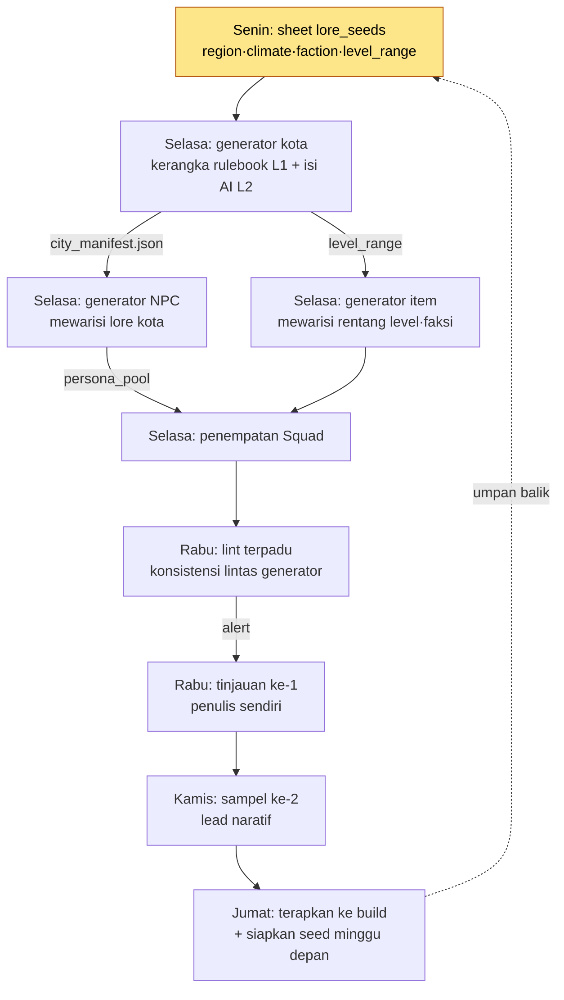

# 6.4 Alur Kerja Produksi Konten — Merangkai Beberapa Generator dalam Satu Lini

Pada minggu yang sama saat saya selesai membuat ketiga alat itu, dalam satu sesi saya menjalankan generator kota, lalu generator NPC, lalu generator item. Ketiganya bekerja dengan baik secara terpisah. Kota menghasilkan 7 tempat, NPC menghasilkan 110 orang, dan senjata menghasilkan 60 buah. Namun beberapa hari kemudian, saat duduk untuk meninjau, saya baru sadar bahwa saya telah menginjak jebakan yang sama sebanyak tiga kali.

Kota `port_harman` dibuat sebagai "desa nelayan yang runtuh", tetapi persona NPC yang ditempatkan di kota itu adalah "pedagang kaya dari pelabuhan dagang yang makmur". Ini terjadi karena generator kota dan generator NPC melihat lore_seeds yang berbeda. Generator senjata menaruh senjata legendaris level 40 di toko, padahal level yang disarankan untuk kota itu adalah 12–18. Ketiga alat itu masing-masing benar; mereka salah karena tidak dirangkai.

Bab ini bukan cerita tentang membuat satu alat. Ini adalah cerita operasional tentang **merangkai generator kota dari 6.2, NPC Squad dari 6.3, dan generator item menjadi satu lini produksi**. Kalau ada tiga alat, jebakannya pun bukan tiga — jebakan baru muncul di celah di antara alat-alat itu.

---

## 6.4.1 Sudut Pandang Lini Produksi

Jika generator kota, NPC, dan item dijalankan terpisah, keluaran tiap alat tidak cocok dengan masukan alat lain. Solusinya bukan membuat alat lebih pintar, melainkan **mengunci metadata bersama satu kali di hulu, lalu menyusun alat-alat itu berbaris di bawahnya**. Kalau generator kota di 6.2 bab 2 adalah contoh teladan untuk satu alat tunggal, bab ini adalah pekerjaan menurunkan alat itu menjadi satu stasiun dalam sebuah lini.

Seluruh lini mengalir seperti ini.



Intinya adalah panah bernama `city_manifest.json`. Saat generator kota membuat sebuah kota, ia menjatuhkan identitas kota itu (apakah desa nelayan yang runtuh atau pelabuhan dagang yang makmur) sebagai manifest, dan generator NPC serta generator item **menerima manifest itu sebagai masukan**. Jebakan yang saya injak waktu itu terjadi karena panah ini tidak ada. Merangkai alat berarti menyisipkan satu baris kontrak ini di antara alat-alat.

---

## 6.4.2 Satu Baris Kontrak yang Merangkai Alat — manifest

Berikut bentuk nyata dari `city_manifest.json` yang dikeluarkan generator kota setiap kali ia membuat satu kota. File inilah yang menjadi masukan bagi generator NPC dan item.

```json
{
  "city_id": "port_harman",
  "display_name": "Pelabuhan Harman",
  "lore_seeds": ["desa nelayan yang runtuh", "gema dagang masa lalu", "kekurangan garam"],
  "region": "pesisir selatan",
  "dominant_faction": "Serikat Nelayan",
  "level_range": [12, 18],
  "tone": "kemunduran·keuletan",
  "forbidden_names": ["Haran", "Harmen"],
  "neighbors": ["salt_marsh", "old_pier"]
}
```

Generator NPC mewarisi `lore_seeds` dan `tone` untuk membuat "orang-orang ulet dari desa nelayan yang runtuh". Generator item mewarisi `level_range` sehingga hanya menaruh senjata level 12–18. `forbidden_names` adalah nama yang sudah dipakai kota tetangga, jadi keduanya menghindarinya. Ketiga alat membaca satu lembar kontrak yang sama.

Saat membuat manifest ini, berikut prompt yang saya berikan kepada Claude. Karena ini adalah satu panggilan terpenting yang merangkai hulu lini produksi, saya kutipkan utuh apa adanya.

> Kamu adalah penulis manifest untuk generator kota MMORPG. Terimalah metadata penulis di bawah ini dan hasilkan city_manifest.json.
>
> Masukan penulis:
> - city_id: port_harman
> - lore_seeds: desa nelayan yang runtuh, gema dagang masa lalu, kekurangan garam
> - region: pesisir selatan
> - level_range: 12-18
>
> Aturan:
> 1. dominant_faction disimpulkan dari lore_seeds, tetapi tidak boleh sama dengan faksi kota tetangga (salt_marsh, old_pier). Faksi kota tetangga adalah [Koperasi Ladang Garam, Sindikat Penyelundup].
> 2. Pada forbidden_names, masukkan NPC/nama tempat yang sudah dipakai kota di sekitarnya. Daftar yang disediakan: [Haran, Harmen].
> 3. tone maksimal dua kata. Jangan bertentangan dengan lore_seeds.
> 4. Tandai dengan jelas mana nilai yang kamu tebak dan mana yang dinyatakan eksplisit oleh penulis.

Berikut keluaran mentah dari Claude. Saya kutipkan apa adanya tanpa meringkas. Ia melanggar aturan di satu tempat.

> ```json
> {
>   "city_id": "port_harman",
>   "display_name": "Pelabuhan Harman",
>   "lore_seeds": ["desa nelayan yang runtuh", "gema dagang masa lalu", "kekurangan garam"],
>   "region": "pesisir selatan",
>   "dominant_faction": "Sindikat Penyelundup",   // ← penyimpulan: kekurangan garam + dagang masa lalu = penyelundupan
>   "level_range": [12, 18],
>   "tone": "kemunduran·ketamakan",
>   "forbidden_names": ["Haran", "Harmen"],
>   "neighbors": ["salt_marsh", "old_pier"]
> }
> ```
> (Nilai yang disimpulkan: dominant_faction, tone, display_name / Dinyatakan penulis: sisanya)
> Perhatian: saya memilih dominant_faction sebagai "Sindikat Penyelundup", tetapi pada Aturan 1 kota tetangga old_pier sudah memakai "Sindikat Penyelundup". Ini melanggar aturan. Sebagai alternatif, saya mengusulkan "Serikat Nelayan".

Yang penting di sini adalah AI melaporkan sendiri pelanggaran aturannya. "Sindikat Penyelundup" memang penyimpulan yang menarik jika dilihat dari lore_seeds (kekurangan garam·dagang masa lalu), tetapi **pada tingkat lini, itu adalah konflik**. Kota tetangga sudah menjadi sindikat penyelundup. Saya menerima usulan AI dan mengubah `dominant_faction` menjadi "Serikat Nelayan" dan `tone` menjadi "kemunduran·keuletan". "Ketamakan" adalah kata yang muncul dari premis penyelundup, jadi tidak cocok dengan serikat nelayan.

Satu putaran verifikasi·penolakan·penugasan ulang ini menjaga hulu lini. Jika manifest salah, maka 110 NPC dan 60 senjata di bawahnya semuanya dibuat di atas premis yang salah. Menghabiskan 5 menit di hulu menghemat 3 jam di hilir.

---

## 6.4.3 Lint Terpadu — Memeriksa Celah di Antara Alat

Lint dari satu generator tunggal hanya melihat keluarannya sendiri. Lint kota memeriksa apakah kota mematuhi rulebook, dan lint NPC memeriksa apakah persona menjaga konsistensi voice. Tetapi jebakan yang saya injak di awal ada **bukan di dalam tiap alat, melainkan di antara alat**. Karena itu, lini membutuhkan satu lapis lagi di atas lint tunggal. Itulah lint terpadu yang membaca kota·NPC·item bersama-sama dan memeriksanya secara silang.

Berikut item-item yang benar-benar ditangkap lint terpadu.

| Pemeriksaan | Apa yang dibandingkan | Apa yang terlewat waktu itu |
|---|---|---|
| Keselarasan lore | city.lore_seeds ↔ npc.persona | Desa nelayan tetapi pedagang kaya |
| Keselarasan rentang level | city.level_range ↔ item.required_level | Senjata level 40 di kota level 12–18 |
| Konflik faksi | city.faction ↔ neighbor.faction | Dua kota bersebelahan sama-sama sindikat penyelundup |
| Duplikasi nama | seluruh pool nama city·npc·item | forbidden_names tidak terkumpul |

Berikut sebagian keluaran nyata saat menjalankan lint terpadu ini. Tidak ada pembuangan otomatis. Ia hanya memunculkan alert agar manusia yang memutuskan.

> ```
> [lint terpadu] pemeriksaan lini port_harman — 3 alert
>
> ALERT-1 (keselarasan lore) port_harman
>   city.lore_seeds = ["desa nelayan yang runtuh", ...]
>   npc[merchant_04].persona = "pedagang kaya dari pelabuhan dagang yang makmur"
>   → Mungkin bertentangan. Perlu konfirmasi apakah ini variasi yang disengaja.
>
> ALERT-2 (keselarasan rentang level) port_harman
>   city.level_range = [12,18]
>   item[blade_legend_07].required_level = 40
>   → Melampaui rentang level yang disarankan sebesar 28. Tinjau ulang penempatan di toko.
>
> ALERT-3 (duplikasi nama) — info
>   npc[fisher_02].name = "Haran"
>   city.forbidden_names = ["Haran", ...]
>   → Bertentangan dengan forbidden_names. Disarankan membuat ulang nama NPC.
> ```

Melihat ALERT-1, saya sempat berpikir sejenak. Tidak mutlak salah jika NPC adalah "pedagang kaya dari pelabuhan dagang yang makmur". Jika kotanya adalah **dulu makmur lalu kini runtuh**, maka "pedagang yang dulu kaya, kini miskin" justru narasi yang bagus. Karena itu saya memutuskan ALERT-1 bukan sebagai pembuangan, melainkan sebagai "variasi yang disengaja", lalu meminta satu baris koreksi persona NPC menjadi "pedagang tua yang berpegang pada jejak pelabuhan dagang yang dulu makmur". ALERT-2 jelas merupakan kecelakaan, jadi saya buang senjatanya. ALERT-3 hanya saya buat ulang namanya.

Bukan lint otomatis yang mencegah kecelakaan. Lint otomatis **menyeret kecelakaan itu ke depan mata manusia**, dan manusialah yang memutuskan. Inilah inti dari L2 (rulebook + bantuan AI) yang saya sebut di 6.1. AI membuat kerangka dan alert, lalu manusia membuat keputusan akhir. Memilah hal "yang tampak salah tetapi merupakan narasi bagus" seperti ALERT-1 adalah sesuatu yang tidak bisa dilakukan rulebook.

---

## 6.4.4 Menjalankan Lini dalam Siklus 1 Minggu

Setelah alat dirangkai, dibutuhkan ritme. Lini paling stabil jika berputar dalam satuan 1 minggu. Seminggu cukup pendek agar tinjauan tidak meledak, dan cukup panjang agar umpan balik tidak terlalu lambat. Ia pas dengan satu kotak di kalender meja saya.

| Hari | Stasiun lini | Waktu penulis |
|---|---|---|
| Senin | Menulis sheet lore_seeds (hulu manifest) | Setengah hari (5–7 kota × 15–20 menit) |
| Selasa | Eksekusi berantai generator kota→NPC→item | Tanpa intervensi penulis |
| Rabu | Lint terpadu + tinjauan ke-1 (sendiri) | 1 jam (5–10 menit/kota) |
| Kamis | Tinjauan sampel ke-2 (lead naratif) | 2–3 menit/kota |
| Jumat | Terapkan ke build + siapkan seed minggu depan | Singkat |

Selasa adalah jantung lini. Saat generator kota menjatuhkan manifest, generator NPC menerimanya, generator item menerimanya, dan Squad bahkan menempatkannya. Rantai ini berputar di latar belakang tanpa intervensi penulis. Selama itu, penulis menulis main quest (L0, sepenuhnya manual). Imbalan sejati dari merangkai alat ada di sini. Jika alat-alat terpisah, penulis harus turun tangan tiga kali pada hari Selasa, tetapi jika dirangkai, ia tidak turun tangan sekali pun.

Satu penulis tunggal memproduksi 5–7 kota dalam seminggu, lengkap dengan NPC·senjata yang menyertainya. Empat minggu berarti 20–28 kota. Target 30 kota tercapai dalam 6 minggu.

---

## 6.4.5 Kesehatan Lini — Empat Indikator yang Dipantau Tiap Minggu

Sehat atau tidaknya lini dilihat dari angka, bukan kesan. Berikut empat indikator yang dikumpulkan otomatis tiap minggu.

| Indikator | Rentang normal | Sinyal saat menyimpang |
|---|---|---|
| Tingkat lolos lint terpadu | 80–95% | Di bawah 60% berarti hulu manifest rusak |
| Konflik lintas generator | 3–5 per kota | 10+ berarti kontrak antar generator pecah |
| Tingkat pembuangan oleh tinjauan manusia | 10–20% | 30%+ berarti parameter produksi salah |
| Waktu siklus satu penulis | 5 hari | 7+ hari berarti beban kognitif berlebih |

Indikator yang paling khas lini adalah yang kedua, **jumlah konflik lintas generator**. Saat hanya memakai satu alat tunggal, angka ini tidak ada. Jika angka ini tiba-tiba melampaui 10, itu bukan berarti satu alat rusak, melainkan **kontrak antar alat (manifest) yang pecah**. Biasanya ini meledak ketika skema manifest generator kota diubah tetapi generator NPC masih membaca skema lama. Tanpa indikator ini, kecelakaan tersebut tidak akan terlihat sampai rilis.

Keempat indikator dikumpulkan tiap minggu dan dibawa ke retrospektif kuartalan. Jika trennya memburuk, jumlah kota yang diproduksi minggu berikutnya dikurangi dari 5–7 menjadi 3–5 dan penyebabnya ditelusuri.

---

## 6.4.6 Tiga Kecelakaan yang Meruntuhkan Lini

Merangkai beberapa alat memunculkan kecelakaan yang tidak ada pada alat tunggal. Saya catat tiga yang sering saya temui.

**Pertama, kecelakaan ketidakcocokan kontrak.** Sebuah field baru ditambahkan ke manifest generator kota, tetapi generator NPC tidak mengenal field itu. Indikator konflik silang melonjak. Saat alat dikembangkan terpisah, mudah sekali hanya satu sisi yang ter-update. Penanggulangannya adalah menaruh field `version` pada skema manifest, dan membuat generator hilir langsung memunculkan alert saat versi tidak cocok. Bukan mendesak manusia, melainkan menegakkan kontrak.

**Kedua, kecelakaan pencemaran hulu.** Jika manifest dibuat dengan premis yang salah (seperti "Sindikat Penyelundup" di §6.4.2), maka semua yang di bawahnya tercemar. Tingkat pembuangan tinjauan manusia melebihi 30%, tetapi saat dilihat, kualitas tiap NPC secara individual baik-baik saja. Individualnya baik, tetapi premisnya yang salah. Penanggulangannya adalah menaruh satu tinjauan lagi pada tahap pembuatan manifest. Daripada meninjau 110 keluaran hilir, tinjaulah 1 keluaran hulu.

**Ketiga, kecelakaan drift model.** LLM ter-update otomatis sehingga karakteristik keluaran berubah. Ketiga generator kota·NPC·item bergoyang serentak. Periksa perubahan dalam 1 minggu terakhir, analisis 5 sampel yang dibuang, lalu sesuaikan prompt atau konteks. Konfirmasi pemulihan setelah memantau selama 1 minggu.

Penanggulangan ketiga kecelakaan ini sama. **Jangan menyalahkan manusia, perkuat kontraknya.** Jika penyebabnya adalah penulis hanya menulis satu baris lore_seeds, alih-alih berkata "tulislah tiga baris", tambahkan pemeriksaan paksa ke lint manifest. Itu bukan berarti tanggung jawab manusia menjadi 0. Terlepas dari penguatan sistem, pola kecelakaan dibagikan dalam retrospektif.

---

## 6.4.7 Ke Mana Waktu Penulis Pergi

Tujuan sejati merangkai lini bukan untuk menghilangkan penulis, melainkan agar penulis bisa fokus pada karya khasnya. Berikut saya gambarkan dalam satu lembar bagaimana waktu penulis tercerai-berai saat alat terpisah, dan bagaimana ia terkumpul setelah dirangkai.

<svg viewBox="0 0 640 250" xmlns="http://www.w3.org/2000/svg" font-family="sans-serif" font-size="13">
  <text x="160" y="20" text-anchor="middle" font-weight="bold">Sebelum (alat terpisah)</text>
  <text x="480" y="20" text-anchor="middle" font-weight="bold">Sesudah (lini terpadu)</text>
  <!-- before bars -->
  <rect x="40" y="40" width="180" height="28" fill="#1d4ed8"/>
  <text x="50" y="59" fill="#fff">Main quest 30%</text>
  <rect x="40" y="72" width="120" height="28" fill="#2563eb"/>
  <text x="50" y="91" fill="#fff">Karya khas 20%</text>
  <rect x="40" y="104" width="180" height="28" fill="#9ca3af"/>
  <text x="50" y="123" fill="#fff">Tinjauan side produksi 30%</text>
  <rect x="40" y="136" width="90" height="28" fill="#9ca3af"/>
  <text x="50" y="155" fill="#fff">Produksi NPC 15%</text>
  <rect x="40" y="168" width="30" height="28" fill="#d1d5db"/>
  <text x="76" y="187" fill="#374151">Operasional 5%</text>
  <!-- after bars -->
  <rect x="360" y="40" width="280" height="28" fill="#1d4ed8"/>
  <text x="370" y="59" fill="#fff">Main quest 50%</text>
  <rect x="360" y="72" width="170" height="28" fill="#2563eb"/>
  <text x="370" y="91" fill="#fff">Karya khas 30%</text>
  <rect x="360" y="104" width="85" height="28" fill="#9ca3af"/>
  <text x="370" y="123" fill="#fff">Tinjauan 15%</text>
  <rect x="360" y="136" width="30" height="28" fill="#9ca3af"/>
  <text x="396" y="155" fill="#374151">NPC 5%</text>
  <text x="360" y="187" fill="#374151" font-size="12">Operasional 0% — diserap lini</text>
  <text x="40" y="225" fill="#b45309" font-size="12">Main+khas 50% →</text>
  <text x="360" y="225" fill="#b45309" font-size="12">Main+khas 80%</text>
</svg>

80% waktu penulis terkumpul pada main quest dan karya khas. Tetapi pembagian ini tidak terjaga dengan sendirinya. Saat lini diterapkan, ada kecenderungan waktu penulis mengalir habis ke tinjauan. Karena itu, saya mengukur pembagian waktu tiap bulan, dan jika main quest jatuh di bawah 50%, saya mengurangi jumlah kota produksi untuk memulihkan waktu main quest. Pembagian waktu harus dijaga sebagai kebijakan.

---

## 6.4.8 Memperluas Lini ke Konten Lain

Setelah lini kota·NPC·item stabil, kerangka yang sama diperluas ke dungeon·ensiklopedia·event live. Intinya adalah **tidak membuat pola baru**. Godaan "dungeon berbeda dari kota, jadi pakai struktur lain" selalu datang. Tetapi kerangka lini (manifest bersama → rantai generator → lint terpadu → tinjauan manusia) tetap sama persis. Yang diganti hanya format metadata masukan dan rulebook domain.

Untuk dungeon, field seperti `boss_pattern`·`encounter_flow` ditambahkan ke `dungeon_manifest.json`, dan aturan domain seperti jalur gerak bos ditambahkan satu baris ke lint terpadu. Kerangkanya sama, hanya aturannya yang berbeda. Jika kerangka yang sama dipertahankan, penulis tidak perlu mempelajari alat baru lagi, dan infrastruktur lint terpadu dipakai ulang apa adanya. Namun ini bukan berarti mengabaikan kekhasan domain. Dungeon jelas membutuhkan aturan jalur gerak yang tidak ada di kota.

---

## 6.4.9 Hasil Pengoperasian 6 Bulan

Berikut hasil mengoperasikan lini terpadu ini selama 6 bulan di proyek saya, dibandingkan dengan periode saat generator kota·NPC·item dijalankan terpisah. Angka absolut di bawah bukan agregasi yang akurat, melainkan **perkiraan penulis (belum terverifikasi)**, sedangkan arah dan rasionya mengikuti kecenderungan hasil pengukuran nyata.

| Indikator | Periode alat terpisah | Setelah lini terpadu |
|---|---|---|
| Kota yang diproduksi (6 minggu) | 18 tempat | 28 tempat |
| Jumlah intervensi penulis pada Selasa | 3 kali per kota | 0 kali |
| Konflik lintas generator (ditemukan setelah rilis) | 8–12 per kuartal | 2–4 per kuartal |
| Main quest per kuartal per satu penulis | 3 buah | 8 buah |
| Waktu tinjauan hulu / waktu tinjauan hilir | 0 / 3 jam | 5 menit / 1 jam |

Perubahan terpenting ada di baris terakhir. Saat alat terpisah, tinjauan hulu 0 dan tinjauan hilir 3 jam. Setelah merangkai lini dan meninjau manifest di hulu, 5 menit di hulu menghapus 2 jam di hilir. Karena kecelakaan tidak lagi bocor di celah antar alat, kecelakaan konsistensi setelah rilis pun turun dari 8–12 menjadi 2–4 per kuartal.

Dan trade-off-nya menjadi eksplisit. Dulu, perdebatan abstrak "produksi massal itu berbahaya" berputar setiap kuartal. Sekarang, keputusan dibuat di atas perbandingan konkret "konflik -8 / main quest +5".

---

## 6.4.10 Tujuh Kegagalan yang Umum

1) Menjalankan alat terpisah tanpa merangkainya. Jebakan muncul bukan di dalam alat, melainkan di antara alat.

2) Menghubungkan generator tanpa manifest. Tanpa kontrak bersama, hilir akan menyimpang dari hulu.

3) Mengganti lint terpadu dengan lint tunggal. Lint tunggal tidak bisa melihat konflik silang.

4) Memampatkan siklus dari 5 hari menjadi 3 hari. 5 hari adalah margin keamanan tinjauan.

5) Meninjau hilir tanpa meninjau hulu (manifest). Lihatlah 1 keluaran hulu, bukan 110 keluaran hilir.

6) Membebankan kecelakaan hanya sebagai tanggung jawab manusia. Penguatan kontrak·otomasi aturan adalah jawabannya.

7) "Tidak memakai" lini setelah memilikinya. Memaksakan siklus 1 minggu sama pentingnya dengan alatnya sendiri.

---

## Coba Sendiri

**setup.** Siapkan generator kota (6.2) dan generator NPC (6.3). Tetapkan satu skema `city_manifest.json` yang akan dibagi keduanya. Field minimalnya adalah `lore_seeds·region·faction·level_range·forbidden_names·tone·version`.

**prompt.** Gunakan persis prompt penulis manifest dari isi bab di atas. Intinya adalah dua aturan terakhir. "Jangan sama dengan faksi kota tetangga" (mencegah konflik silang) dan "tandai dengan jelas nilai yang ditebak dan yang dinyatakan" (kemungkinan untuk ditinjau). Saat membuat kota, jatuhkan manifest, dan hubungkan agar generator NPC·item menerima manifest itu sebagai masukan.

**verify.** Jalankan lint terpadu satu kali. Ia memeriksa silang empat hal: keselarasan lore·keselarasan rentang level·konflik faksi·duplikasi nama. Jika alert muncul, jangan langsung membuang otomatis, biarkan manusia yang memutuskan. Memilah hal "yang tampak salah tetapi merupakan narasi bagus" (pedagang tua dari pelabuhan dagang yang runtuh) adalah bagian manusia.

**Versi Ringkas Solo.** Meskipun alat hanya dua, kota dan NPC, lini tetap terbentuk. Cukup tulis lore_seeds·level_range·forbidden_names tiap kota dalam satu lembar spreadsheet, lalu tempelkan utuh baris itu ke prompt generator NPC — itu sudah berperan sebagai manifest. Lint terpadu pun bisa mencegah jebakan itu meskipun hanya berisi satu baris keselarasan lore kota-NPC. Tanpa infrastruktur megah, satu prinsip "menyisipkan satu baris kontrak di antara alat" sudah cukup untuk memulai sebuah lini.

---

### Poin-Poin Penting
- Jebakan muncul bukan di dalam alat, melainkan di antara alat; rangkailah celah itu dengan manifest
- Lint terpadu bukan alat pembuang, melainkan alat yang menyeret kecelakaan ke depan mata manusia
- Tinjauan hulu 5 menit menghapus tinjauan hilir 2 jam; cegahlah dari atas
