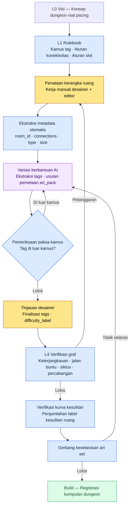

# 7.1 Menguasai Desain Level Prosedural

Pintu keluar ruang nomor 47 di sebuah dungeon tertutup rapat. Build lolos, QA juga lolos. Tangkapan layar seorang pengguna yang berdiri menatap dinding tepat sebelum ruang bos muncul di komunitas pada hari ketiga setelah game live. Ruang itu dibuat dengan menyalin sebuah ruang yang dirancang manual dua patch sebelumnya, dan dalam proses penyalinan itu satu koridor timur hanya menyisakan visualnya tanpa informasi koneksi apa pun. Tidak ada seorang pun yang memverifikasinya. Tidak ada alat untuk memverifikasinya.

Bab ini adalah cerita tentang membangun sebuah struktur yang membuat insiden seperti itu otomatis tercegah pada tahap build. Intinya bukan pada keterampilan tangan menggambar ruang, melainkan pada cara mengoperasikan data yang menempel pada ruang itu sebagai aturan (rule).

---

Ruang kerja desain level lebih mirip ruang gambar teknik (drafting room). Setiap lembar gambar lahir dari tangan manusia, tetapi konsistensi, penggunaan ulang, dan verifikasi antargambar ditentukan oleh aturan pengelolaan lemari arsip gambar itu. Membuat satu dungeon dengan tangan bisa dilakukan siapa saja. Mengoperasikan 100 dungeon dengan kurva kesulitan yang konsisten dan graf tanpa jalan buntu bukanlah soal keterampilan tangan, melainkan soal sistem.

Pada Proyek A tempat saya bekerja sebagai Design Director (MMORPG yang menargetkan pasar domestik + Asia Tenggara, tim berskala menengah (10\~50 orang), mengutamakan mobile), nama sistem ini adalah satu dokumen bernama `Procedural_Level_Design_Master`. Bab ini membahas apa yang diintegrasikan dokumen itu, sampai mana AI ikut campur tangan, dan di mana ia berhenti. Pengalaman saya memimpin desain sebuah RPG roguelite mobile yang dungeon-nya dibangkitkan ulang setiap run, dan mengoperasikan ruang prosedural sebagai aturan, menjadi landasan bab ini.

## 7.1.1 Dua Cabang — Membangun Ruang, atau Mengoperasikan Metadata Ruang?

Otomatisasi level bercabang ke dua arah. Yang satu adalah membangkitkan ruang itu sendiri secara prosedural. Procedural Content Generation (PCG) tradisional seperti pembagian BSP (Binary Space Partitioning, teknik klasik yang membelah ruang secara rekursif menjadi dua untuk menempatkan ruang), wave function collapse, dan drunken walk grid termasuk di sini. Yang satunya lagi adalah mengoperasikan metadata ruang — tag ruang, konektivitas, label kesulitan, slot event.

PCG tradisional kuat di arah pertama. Pada genre yang menjadikan "peta baru setiap permainan" sebagai inti gameplay seperti roguelike atau sandbox, arah pertama adalah jawabannya. Tetapi MMORPG berbeda. Pengguna menjelajahi dungeon yang sama berpuluh-puluh kali. Cukup sering hingga jalurnya hafal di luar kepala. Karena itu dungeon harus berupa ruang tetap yang dipoles dengan tangan, dan tempat masuknya otomatisasi bukanlah ruang itu sendiri, melainkan **metadata yang membuat ruang itu dapat dioperasikan**.

Mengapa metadata adalah tulang punggung operasional menjadi jelas bila dilihat per keluaran kerja.

| Keluaran kerja | Bila tidak ada metadata |
|---|---|
| Puluhan kumpulan dungeon | Tidak bisa mencari ruang mana ada di mana, tidak bisa dipakai ulang |
| Verifikasi kurva kesulitan | Tanpa label kesulitan per ruang, kurva tidak bisa digambar |
| Penempatan otomatis posisi quest·bos | Tanpa meta slot event, koordinat harus dimasukkan manual |
| Sinkronisasi dengan tim seni | Tanpa pemetaan tipe ruang → art set, visual tidak konsisten |
| Pengukuran alur gerak·waktu tinggal pengguna | Telemetri berbasis room ID tidak mungkin |

Dungeon tanpa metadata bisa di-build, tetapi tidak bisa dioperasikan. Sama seperti perpustakaan yang penuh buku tetapi tanpa indeks. Inilah alasan bab ini berfokus pada "pengoperasian metadata ruang".

## 7.1.2 Apa yang Diintegrasikan Dokumen Master

`Procedural_Level_Design_Master` mengikat empat standar dalam satu dokumen: format metadata ruang, kamus tag ruang, aturan konektivitas, dan checklist verifikasi. Mari kita lihat dulu apa yang terjadi ketika keempatnya tercerai-berai. Bila lima desainer masing-masing merujuk format dari file yang berbeda, ada yang menulis field `type` sebagai `combat`, ada yang menulis `Combat`, dan ada yang menulis `battle_room`. Pencarian rusak, statistik rusak, dan akhirnya otomatisasi rusak.

Keempat standar ini, bila ditata berdasarkan Layer, posisinya masing-masing menjadi jelas. Format·kamus·aturan ada di rulebook yang menguasai pembangkitan (L1), bagian utama ruang yang sudah dibangkitkan ada di konten (L2), nilai sheet ada di data (L3), dan verifikasi ada di gerbang build·QA (L4).

<svg viewBox="0 0 720 300" xmlns="http://www.w3.org/2000/svg" font-family="sans-serif" font-size="13">
  <rect x="20" y="20" width="680" height="44" rx="6" fill="#1e3a5f" stroke="#0f1f33"/>
  <text x="36" y="40" fill="#fff" font-weight="bold">L0 Visi</text>
  <text x="120" y="40" fill="#cfe2ff">Konsep level·niat pacing (jangkar tetap, disuntikkan tiap kali ke pembangkitan·verifikasi)</text>
  <text x="120" y="56" fill="#9fc0e8" font-size="11">— tone art_pack, niat kesulitan</text>

  <rect x="20" y="76" width="680" height="44" rx="6" fill="#2a5d3a" stroke="#173a22"/>
  <text x="36" y="96" fill="#fff" font-weight="bold">L1 Sistem</text>
  <text x="120" y="96" fill="#d6f5df">Rulebook — format meta ruang · kamus tag · aturan konektivitas</text>
  <text x="120" y="112" fill="#a8dcb8" font-size="11">— tempat yang diikat dokumen Master</text>

  <rect x="20" y="132" width="680" height="44" rx="6" fill="#5d4a2a" stroke="#3a2e17"/>
  <text x="36" y="152" fill="#fff" font-weight="bold">L2 Konten</text>
  <text x="120" y="152" fill="#f5e6cf">Bagian utama ruang yang sudah dilekati metadata (ruang yang dibangkitkan·dipoles)</text>

  <rect x="20" y="188" width="680" height="44" rx="6" fill="#4a2a5d" stroke="#2e173a"/>
  <text x="36" y="208" fill="#fff" font-weight="bold">L3 Data</text>
  <text x="120" y="208" fill="#ead6f5">Ukuran ruang·sheet koneksi·ID slot event·data musuh</text>

  <rect x="20" y="244" width="680" height="44" rx="6" fill="#5d2a2a" stroke="#3a1717"/>
  <text x="36" y="264" fill="#fff" font-weight="bold">L4 Build·QA</text>
  <text x="120" y="264" fill="#f5d6d6">Verifikasi graf · verifikasi kurva kesulitan · gerbang keselarasan art set</text>
</svg>

Mengatakan bahwa dokumen master mengintegrasikan empat standar bukan berarti "menjejalkan semua isi ke dalam satu file", melainkan "mengumpulkan aturan di posisi L1". Karena itulah otomatisasi yang akan muncul nanti bisa ditumpangkan di atas batas Layer (apa yang terjadi bila pemisahan ini runtuh dibahas di 7.1.11).

## 7.1.3 Format Metadata Ruang — Titik Input tempat Otomatisasi Menempel

Satu ruang mengikuti format berikut. Format inilah antarmuka input bagi otomatisasi.

```yaml
room_id: dungeon_021_room_07
dungeon: dungeon_021_silvermark_library
type: combat_room          # combat / puzzle / lore / safe / boss
size: medium               # small / medium / large
difficulty_label: hard_for_level_28
tags: [scholar_theme, vertical_layout, water_hazard]
connections:
  - target_room: dungeon_021_room_06
    type: door
    direction: south
  - target_room: dungeon_021_room_08
    type: passage
    direction: east
event_slots:
  - slot: enemy_spawn_1
    constraints: [scholar_enemy, level_28]
  - slot: lore_object_1
    constraints: [scholar_lore]
movement_complexity: 4     # 1~5
estimated_clear_time_sec: 90
art_pack: scholar_library_v2
```

Setiap field memiliki satu atau lebih konsumen otomatisasi. `type` dipakai untuk statistik kumpulan dungeon dan perhitungan kesulitan, `tags` untuk pencarian·penggunaan ulang·pemetaan art set, `connections` untuk verifikasi graf (pemeriksaan jalan buntu), dan `event_slots` untuk penempatan otomatis quest·bos. Field yang tidak punya konsumen tidak dimasukkan ke format. Sebab ia hanya menambah biaya input tanpa memberi nilai.

## 7.1.4 Kamus Tag Ruang — Kecil dan Ortogonal

Tag adalah kunci pencarian metadata. Bila berkembang biak tak terbatas, pencarian rusak. Bila ada 200 label tertempel pada laci, mustahil menemukan apa ada di mana. Karena itu dikelola dengan 5 kategori × sekitar 6 enum per kategori, totalnya sekitar 30.

| Kategori | Jumlah enum | Contoh |
|---|---|---|
| theme | 8 | scholar_theme, ruins_theme, forest_theme … |
| layout | 5 | vertical_layout, horizontal_corridor, open_arena … |
| hazard | 6 | water_hazard, fire_hazard, falling_hazard … |
| interaction | 4 | puzzle_required, lever_activation … |
| narrative | 7 | flashback_trigger, dialogue_zone … |

Tag pada satu ruang tidak melebihi 5. Normalnya 3\~4. Untuk menambahkan tag baru, ia harus melewati gerbang empat tahap. Harus menjadi kandidat pakai pada 5 ruang atau lebih per patch, tidak bisa diekspresikan dengan kombinasi tag yang ada, pemanfaatannya untuk pencarian·pemetaan art set harus jelas, dan tetap dipakai pada 5 ruang bahkan setelah 1 bulan beroperasi. Syarat terakhir adalah intinya. Bila tag yang dibuat sementara dipakai sekali lalu dibuang, kamus menjadi tercemar.

## 7.1.5 Pipeline Level Prosedural — Dari Rulebook hingga Verifikasi

Bagaimana standar-standar sejauh ini terhubung menjadi satu alur, garis penghubung itulah kerangka yang ditopang bab ini. Ini adalah pipeline yang dimulai dari rulebook, melewati variasi berbantuan AI, dan berakhir dengan verifikasi guardrail.



Saya tegaskan tiga sifat pipeline ini. Pertama, rulebook (L1) berada di hulu dari seluruh pembangkitan. Kedua, AI hanya bervariasi di dalam kamus yang didefinisikan rulebook — gerbang F mengembalikan keluaran di luar kamus. Ketiga, verifikasi (H·I·J) terpasang sebagai gerbang tepat sebelum build, sehingga pelanggaran dicegah oleh kode, bukan bergantung pada kewaspadaan manusia. Insiden ruang nomor 47 terjadi karena gerbang H tidak ada.

## 7.1.6 Aturan Konektivitas — Guardrail yang Diverifikasi dengan Graf

Field `connections` pada meta ruang menjadikan seluruh dungeon satu graf berarah. Begitu menjadi graf, verifikasi menjadi otomatis.

| Pemeriksaan | Penanganan saat pelanggaran |
|---|---|
| Ruang awal → ruang bos dapat dijangkau | Dicegah dengan kegagalan build |
| Jalan buntu (1 pintu keluar + non-safe_room) | alert — tinjauan desainer |
| Keselarasan koneksi dua arah (ada A→B tetapi tidak ada B→A) | Koreksi otomatis |
| Panjang siklus — loop pendek 2\~3 ruang | alert |
| Lebar percabangan — 4 percabangan atau lebih sekaligus | tinjauan desainer |

Skrip pengukurannya berbentuk seperti berikut. Ini adalah wrapper tipis yang melapisi kosakata dungeon di atas algoritma graf standar (jalur terpanjang·rata-rata derajat keluar·hitungan loop·jalur terpendek).

```python
# level_graph_metrics.py
def measure(dungeon):
    graph = build_graph(dungeon.rooms)
    return {
        "depth":            longest_path_length(graph),
        "branching_factor": avg_out_degree(graph),
        "loop_count":       count_loops(graph),
        "dead_ends":        count_dead_ends(graph),
        "boss_reachability": shortest_path(graph.start, graph.boss),
    }
```

Lima metrik dikeluarkan dalam bentuk yang dapat dibandingkan dengan dungeon lain. Dipakai sebagai metrik keragaman kumpulan dungeon. Namun, metrik yang beragam tidak berarti dungeon itu menyenangkan. Metrik dipakai untuk mencegah insiden, bukan untuk menjamin keseruan. Jalan buntu 0 buah tidak menjamin keseruan. Keseruan lahir dari insight desainer, dan verifikasi graf hanya menjadi alas yang menopang agar insight itu tidak terkubur oleh insiden.

## 7.1.7 Worked Transcript (rekaman sesi nyata) — Menyerahkan Ekstraksi tags ke AI, Menolaknya, dan Memintanya Ulang

Bagian yang paling sering ingin dilepas tangan oleh manusia dalam otomatisasi adalah input `tags`. Memberi tag pada 100 ruang itu membosankan, dan kalau hanya melihat tangkapan layar ruang, manusia pun bingung. Pekerjaan yang berulang dan kriteria penilaiannya jelas seperti inilah justru tempat yang baik bagi AI untuk menopang draf awal. Subbab ini membentangkan tanpa olahan alur kerja yang benar-benar saya jalankan untuk pekerjaan itu — mulai dari prompt, keluaran AI yang ditolak, hingga permintaan ulang dari manusia.

**Prompt pertama:**

```
[Input]
- Tangkapan layar ruang: (terlampir)
- Luas ruang: 18m × 12m, tinggi langit-langit 9m (struktur vertikal 2 lantai)
- Musuh yang ditempatkan: scholar_phantom × 3, water_elemental × 1
- type ruang yang berdekatan: lore_room (barat), combat_room (timur)
- Ada genangan air dangkal di dalam ruang

Pilihkan 3~5 tag yang cocok untuk ruang ini hanya dari kamus di bawah. Jangan membuat tag di luar kamus,
cukup enum tag yang dipisah koma.

[Kamus tag 30 buah]
theme: scholar_theme, ruins_theme, forest_theme, cave_theme,
       crypt_theme, swamp_theme, mechanical_theme, celestial_theme
layout: vertical_layout, horizontal_corridor, open_arena,
        maze_layout, bridge_layout
hazard: water_hazard, fire_hazard, falling_hazard,
        poison_hazard, crush_hazard, dark_hazard
interaction: puzzle_required, lever_activation, key_gate, hidden_passage
narrative: flashback_trigger, dialogue_zone, lore_object_zone,
           ambush_setup, ritual_site, vista_point, rest_anchor
```

**Keluaran pertama Claude (mentah apa adanya):**

```
scholar_theme, vertical_layout, water_hazard, ambush_setup, two_story_layout
```

Di sini dua masalah langsung tampak. Yang satu adalah `two_story_layout` merupakan tag yang tidak ada di kamus. Model terseret oleh input "struktur vertikal 2 lantai" dan mengarang kata di luar kamus. Yang lain adalah tag sudah menyentuh batas atas dengan 5 buah, padahal `vertical_layout` dan `two_story_layout` tumpang tindih secara makna. Artinya, dua slot terpakai pada kategori layout.

**Keputusan penolakan dari manusia.** `two_story_layout` adalah objek penolakan otomatis karena melanggar paksaan kamus (gerbang F pipeline). `ambush_setup` masih bisa dipertimbangkan dua arah — 3 ekor musuh memang ditempatkan, tetapi tidak jelas apakah pada tangkapan layar itu komposisi penyergapan (ambush), atau sekadar ruang tempur biasa. Ada kemungkinan model menafsirkan secara berlebihan. Karena kedua ruang yang berdekatan adalah lore/combat, dasar untuk pemicu penyergapan naratif lemah. Ditolak.

**Permintaan ulang kedua:**

```
two_story_layout tidak ada di kamus dan tumpang tindih dengan vertical_layout. Buang.
ambush_setup juga buang — ada musuh bukan berarti penyergapan.
// (niat: tag narrative hanya saat niat naratif dinyatakan eksplisit, tempur biasa sudah diekspresikan lewat type)
Slot kosong tidak perlu dipaksa diisi. 3~4 buah itu normal. Tolong beri tag ulang.
```

**Keluaran kedua Claude:**

```
scholar_theme, vertical_layout, water_hazard
```

Kali ini berkurang menjadi 3 buah, semuanya ada di dalam kamus, dan tidak ada duplikasi kategori. Manusia menerima hasil ini. `tags: [scholar_theme, vertical_layout, water_hazard]` pada format ruang difinalisasi seperti ini.

Pelajaran dari worked transcript ini ada dua baris. Pertama, AI overfit pada satu detail input ("2 lantai") lalu keluar dari kamus — gerbang paksaan kamus harus menangkap ini pada level kode. Kedua, AI cenderung ingin mengisi slot kosong — bila tidak menyatakan eksplisit "tidak perlu dipaksa diisi", ia berusaha memenuhi kelima slot. Kedua kegagalan itu lumrah, dan kedua resep penanganannya harus dipaksakan bukan dari prompt melainkan dari rulebook (kamus + batas atas) agar stabil.

## 7.1.8 Memproduksi Metadata — Siapa yang Mengisi dan Siapa yang Meninjau

Bila desainer mengisi meta 1 ruang dengan tangan, butuh 5\~10 menit. Untuk 1 dungeon (20\~30 ruang) itu 2\~5 jam, dan untuk 100 dungeon itu 200\~500 jam (perkiraan penulis, belum terverifikasi — batas atas yang dikonversi dari rata-rata waktu input per ruang × jumlah ruang). Bila semuanya diisi dengan tangan, desainer menjadi budak input metadata.

Karena itu subjek pengisian dibagi per area.

| Area | Subjek pengisi |
|---|---|
| room_id · dungeon · connections | Ekstraksi otomatis editor (L3) |
| type · size | Klasifikasi otomatis berdasarkan luas ruang·jumlah koneksi |
| tags | Bantuan AI + tinjauan desainer (7.1.7) |
| event_slots | Rulebook per type ruang |
| difficulty_label | Perhitungan otomatis penjumlahan data musuh dalam ruang |
| art_pack | Pemetaan type ruang · theme dungeon |

Yang difinalisasi desainer dengan tangan kira-kira hanya tinjauan `tags` dan persetujuan akhir `difficulty_label`. Sisanya diisi alat dan ditinjau manusia. Tujuan otomatisasi adalah menarik desainer keluar dari input dan mengembalikannya ke penilaian pacing·ruang signature·kebijakan penggunaan ulang.

## 7.1.9 Penggunaan Ulang Ruang dan Jebakannya

Efek terbesar dari standar master adalah penggunaan ulang ruang. Bila ada 30 ruang yang dapat dicari lewat tag, kita bisa membuat 5\~10 dungeon dengan mengombinasikannya. Tetapi bila rasio penggunaan ulang naik, dungeon menjadi membosankan. Karena itu penggunaan ulang disertai guardrail.

| Guardrail | Definisi |
|---|---|
| Satu ruang tampil maksimal di 5 dungeon | Pelacakan otomatis frekuensi tampil |
| Variasi visual dipaksakan pada tampilan kedua | Perubahan cahaya·properti |
| Penggunaan ulang ruang bos·ruang signature dilarang | Dipaksa lewat flag |
| Pelacakan umpan balik negatif ruang yang dipakai ulang | Telemetri pengguna |

Penggunaan ulang adalah sarana untuk mengurangi biaya, bukan tujuan. Begitu rasio penggunaan ulang itu sendiri dijadikan KPI, pengalaman pengguna menjadi monoton. Pada 0% (semua ruang baru) biaya produksi meledak, dan bila melebihi 70% dungeon-dungeon tidak bisa dibedakan satu sama lain. Dari pengalaman, rentang 30\~40% adalah titik keseimbangan antara biaya dan keragaman (observasi arah, ambang presisinya berbeda-beda per proyek).

## 7.1.10 Kegagalan Umum dan Resepnya

| Pola | Resep |
|---|---|
| Format meta ditafsirkan 5 orang dengan 5 cara | Integrasi L1 dengan dokumen Master |
| Tag berkembang biak menjadi 50\~100 buah | Kamus 30 buah + gerbang 4 tahap |
| Build tanpa pemeriksaan jalan buntu | Jadikan verifikasi graf sebagai gerbang build |
| Desainer mengerjakan semua meta dengan tangan | Ekstraksi editor + bantuan AI |
| AI mengarang tag di luar kamus | Penolakan otomatis lewat gerbang paksaan kamus |
| Penggunaan ulang 0% atau 70%+ | Rentang 30\~40% + guardrail variasi |

## 7.1.11 Penguraian Layer adalah Prasyarat Pembangkitan Level Prosedural

Struktur 7.1.2\~7.1.6 yang sejauh ini saya uraikan dengan rulebook·pembangkitan·verifikasi itu sendiri adalah hasil dari penguraian Layer. Tesis umum bahwa penguraian Layer adalah prasyarat pembangkitan prosedural·otomatisasi (jangkar L0 → rulebook L1 → bagian utama L2 → angka L3 → gerbang L4, bila menjadi satu gumpalan pembangkitan akan runtuh) telah dibahas di §6.6. Di sini saya menerapkannya pada pengoperasian metadata level.

Tanpa pemisahan ini, penataan ruang·BSP·pacing·pemicu naratif tercampur dalam satu file, dan setiap kali memindahkan satu ruang, niat pacing·slot event·graf konektivitas rusak serentak. Ini seperti situasi di mana ruang gambar·gudang material·ruang inspeksi menumpuk di satu meja, sehingga mencabut satu lembar gambar ikut menarik keluar faktur material dan lembar inspeksi. Karena itulah bantuan AI di 7.1.7 bisa berfungsi juga berkat Layer. Room ID·konektivitas diisi dari editor (ekstraksi otomatis L3), tags dari AI (paksaan kamus L1), difficulty_label dari penjumlahan (L3→L4). Otomatisasi ditumpangkan di atas batas Layer; bila ditumpangkan di atas satu gumpalan, dalam patch pertama insiden meledak hingga alat itu sendiri dibuang.

Namun ini bukan berarti sejak awal harus menyiapkan laci lima sekat secara sempurna. Prinsipnya adalah pemisahan bertahap, antarmuka sempit. Pada patch pertama, memisahkan hanya rulebook L1 (kamus tag + aturan konektivitas) dan sheet L3 (sheet meta ruang) saja sudah memberi tempat bagi otomatisasi untuk masuk. Niat pacing L0 dan gerbang verifikasi L4 diisi sambil melewati patch demi patch. Standar harus diseragamkan agar tercipta tempat bagi otomatisasi untuk masuk, dan semakin banyak otomatisasi masuk, semakin desainer berfokus pada penilaian pacing·signature·penggunaan ulang alih-alih kerja manual satu ruang.

---

### Poin-Poin Penting

- Tempat baru otomatisasi level bukan pada ruang itu sendiri, melainkan pada pengoperasian metadata ruang.
- Verifikasi harus dipasang sebagai gerbang build, bukan kewaspadaan manusia, agar insiden tidak bocor ke live.
- Variasi AI hanya diizinkan di dalam kamus yang didefinisikan rulebook, dan keluaran di luar kamus ditolak oleh kode.

---

## Coba Sendiri

**setup.** Pilih satu dungeon, lalu buat sheet YAML yang per ruang hanya memiliki empat field `room_id · type · connections · tags`. Untuk tag, kunci dulu kamus berisi sekitar 30 enum dalam 5 kategori di selembar kertas.

**prompt.** Masukkan tangkapan layar ruang + luas + jenis musuh + type ruang yang berdekatan, lalu minta dengan "pilih hanya 3\~5 tag dari kamus ini, dilarang tag di luar kamus, jangan isi slot kosong" (persis prompt 7.1.7).

**verify.** (1) Bila ada tag di luar kamus pada keluaran AI, tolak dan minta ulang. (2) Buat graf dengan `connections` lalu periksa keterjangkauan awal→bos dan jalan buntu — bila muncul satu saja pelanggaran, tandai ruang itu sebagai tidak dapat di-build.

### Versi Ringkas Solo

Bila Anda developer solo tanpa infrastruktur alat, mulailah dokumen master sebagai satu lembar markdown. 30 baris kamus tag, 5 baris aturan konektivitas, 5 baris checklist verifikasi sudah cukup. Untuk verifikasi graf, bila ruang 10 buah atau kurang, menggambar panah di atas kertas dan memeriksa jalan buntu saja dengan mata sudah menghasilkan 80% dari efeknya. Intinya bukan alat, melainkan kebiasaan itu sendiri yaitu "melekatkan data pada ruang, dan memeriksa data itu dengan aturan". Alat ditambahkan ketika jumlah ruang melewati 50 dan memeriksanya dengan tangan menjadi berat.

### Pratinjau Bab Berikutnya

- 7.2 Editor BehaviorTree — Mengoperasikan pohon perilaku AI, area yang berdekatan dengan level, berbasis rulebook·metadata
