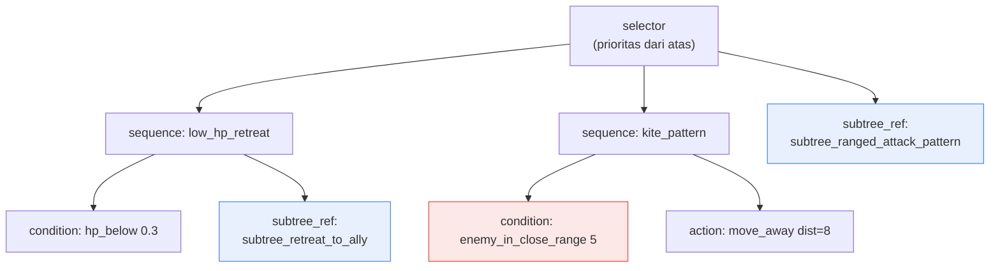
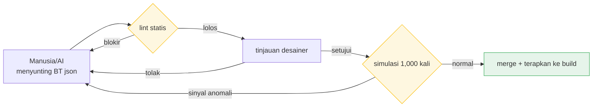

# 7.2 Editor BehaviorTree — Worked Transcript Saat Manusia dan AI Bersama-sama Menyunting dan Memverifikasi BT json

Seekor penyihir magang menempel pada pemain sambil mengayunkan pedang. NPC itu saya rancang sebagai caster sihir jarak jauh. HP-nya setipis kertas dan dalam jarak dekat cukup satu pukulan untuk mati, tetapi makhluk itu sama sekali tidak berniat menjaga jarak. Tidak ada satu pun error di log build. Saat saya buka kembali BehaviorTree-nya di editor pun, simpul-simpulnya terhubung dengan rapi. Setelah satu jam menatapnya, saya menemukan penyebabnya. Kondisi jarak pada cabang mundur (retreat) ternyata terisi `0.5`, bukan `5`. Seharusnya ia kabur saat musuh masuk ke dalam jarak 5 meter, tetapi cabang mundur baru aktif kalau musuh sudah dalam jarak 0.5 meter — artinya nyaris menempel.

Hanya satu angka. Di editor simpul grafis, angka itu baru terlihat kalau panel di dalam simpul dibuka, dan tidak tercatat di riwayat perubahan. Tidak ada cara melacak siapa mengubah nilai itu dan kapan. Sejak hari itu, Proyek A saya mulai menangani BehaviorTree bukan sebagai grafis, melainkan sebagai json. Bab ini adalah catatan satu siklus saat manusia dan AI bersama-sama menyunting json itu, lalu mesin memverifikasinya secara otomatis.

---

## 7.2.1 Titik di Mana BT (BehaviorTree, pohon perilaku) Lepas dari Genggaman

BehaviorTree adalah struktur baku de facto untuk mendefinisikan pertempuran, pergerakan, dan reaksi NPC musuh. Selektor (selector) mencoba cabang sesuai urutan prioritas, sedangkan sekuens (sequence) merangkai kondisi dan aksi secara berurutan. Strukturnya sendiri sederhana. Masalahnya ada pada skala.

Di Proyek A saya, BT satu NPC musuh terdiri atas sekitar 50\~200 simpul, dan NPC yang dioperasikan melampaui 100 ekor. Dikalikan, total simpul BT menjadi puluhan ribu satuan. Pada skala ini, akan tiba saatnya manusia tidak lagi mampu menjawab pertanyaan "Kalau pola mundur ini saya ubah, NPC mana saja yang terpengaruh?" Ini seperti ada seratus buku catatan terbuka di atas meja, dan saat satu baris di buku pertama diperbaiki, Anda harus menelusuri dengan mata bagian mana di sembilan puluh sembilan buku sisanya yang ikut merembet.

Saat beralih dari BT grafis ke json, ada empat hal yang saya tuntut.

<svg viewBox="0 0 720 250" xmlns="http://www.w3.org/2000/svg" font-family="sans-serif">
  <rect x="0" y="0" width="720" height="250" fill="#fafafa" stroke="#ddd"/>
  <rect x="30" y="30" width="300" height="80" rx="8" fill="#e8f0fe" stroke="#4285f4"/>
  <text x="180" y="58" text-anchor="middle" font-size="15" font-weight="bold" fill="#1a73e8">Disimpan sebagai teks (json)</text>
  <text x="180" y="82" text-anchor="middle" font-size="12" fill="#444">Lacak perubahan hingga satu baris lewat git diff</text>
  <text x="180" y="100" text-anchor="middle" font-size="12" fill="#444">Insiden "satu angka" tercatat di riwayat</text>

  <rect x="390" y="30" width="300" height="80" rx="8" fill="#e6f4ea" stroke="#34a853"/>
  <text x="540" y="58" text-anchor="middle" font-size="15" font-weight="bold" fill="#188038">Standardisasi metadata simpul</text>
  <text x="540" y="82" text-anchor="middle" font-size="12" fill="#444">Cari & pakai ulang lewat category·tags</text>
  <text x="540" y="100" text-anchor="middle" font-size="12" fill="#444">"Cari BT serupa" jadi satu baris kueri</text>

  <rect x="30" y="140" width="300" height="80" rx="8" fill="#fef7e0" stroke="#fbbc04"/>
  <text x="180" y="168" text-anchor="middle" font-size="15" font-weight="bold" fill="#b06000">Kutipan subtree (pakai ulang via referensi)</text>
  <text x="180" y="192" text-anchor="middle" font-size="12" fill="#444">Satu pola umum dibagi banyak BT</text>
  <text x="180" y="210" text-anchor="middle" font-size="12" fill="#444">Perbaiki satu tempat → terterap menyeluruh</text>

  <rect x="390" y="140" width="300" height="80" rx="8" fill="#fce8e6" stroke="#ea4335"/>
  <text x="540" y="168" text-anchor="middle" font-size="15" font-weight="bold" fill="#c5221f">Visualisasi dampak perubahan otomatis</text>
  <text x="540" y="192" text-anchor="middle" font-size="12" fill="#444">BT mana yang tersentuh perubahan subtree</text>
  <text x="540" y="210" text-anchor="middle" font-size="12" fill="#444">Skrip yang menghitung, bukan tebakan manusia</text>
</svg>

Editor BT bawaan pada engine game komersial mudah diintegrasikan dan kuat dalam debugging visual. Hanya saja, BT itu cenderung disimpan sebagai aset biner (binary), sehingga diff teks dan pelacakan dampak perubahan menjadi lemah. Karena Proyek A saya mengasumsikan game live dengan lebih dari 100 BT yang dioperasikan, saya memilih untuk mengembangkan sendiri format BT json terpisah beserta editornya. Mari kita perjelas. Ini bukan jawaban yang tepat untuk semua tim. Kalau BT yang dioperasikan di bawah 50 ekor, memakai editor bawaan engine apa adanya hampir selalu lebih murah. Pembenaran pengembangan sendiri akan dibahas lagi di akhir bab ini.

---

## 7.2.2 BT json — Perilaku Satu Musuh dalam Bentuk Teks

Pertama, kita lihat dulu bentuk hasilnya. Di bawah ini adalah sebagian BT NPC tipe pendukung jarak jauh dari guild sarjana. Intinya ada dua. Karena semua perilaku berbentuk teks, git bisa melacaknya per baris; dan pola umum dikutip lewat `subtree_ref`.

```json
{
  "bt_id": "bt_scholar_archer_v3",
  "category": "ranged_combatant",
  "tags": ["scholar_faction", "ranged", "support"],
  "description": "Tipe pendukung jarak jauh guild sarjana. Jaga jarak + utamakan mundur.",
  "root": {
    "type": "selector",
    "children": [
      {
        "type": "sequence",
        "name": "low_hp_retreat",
        "children": [
          {"type": "condition", "fn": "hp_below", "param": 0.3},
          {"type": "subtree_ref", "id": "subtree_retreat_to_ally"}
        ]
      },
      {
        "type": "sequence",
        "name": "kite_pattern",
        "children": [
          {"type": "condition", "fn": "enemy_in_close_range", "param": 5},
          {"type": "action", "fn": "move_away", "param": {"distance": 8}}
        ]
      },
      {"type": "subtree_ref", "id": "subtree_ranged_attack_pattern"}
    ]
  }
}
```

Kalau pohon ini dibentangkan menjadi gambar, strukturnya adalah selektor yang mencoba tiga cabang dari atas. Perhatikan bahwa bug di bagian pembuka — apakah `param` dari `enemy_in_close_range` itu `5` atau `0.5` — di dalam json menjadi satu baris yang langsung terlihat sekilas.



| Elemen | Peran |
|---|---|
| `bt_id` | Kunci git diff·pelacakan perubahan |
| `category`·`tags` | Satuan pencarian·pemakaian ulang |
| `subtree_ref` | Kutipan pola umum (perbaiki satu tempat → banyak BT diperbarui) |
| `description` | Untuk dibagikan ke desainer·penulis skenario |

`enemy_in_close_range 5` yang diwarnai merah itulah simpul yang menyita waktu satu jam di bagian pembuka. Di dalam json, ia terjaring dalam sekali code review.

---

## 7.2.3 Pustaka subtree — Kutipan, Bukan Salin-Tempel

Pada perilaku lebih dari 100 musuh, ada bongkahan yang berulang. Hal-hal seperti "mundur ke belakang sekutu", "mundur ke balik perlindungan", "pola serangan jarak jauh". Kalau ini disalin ke tiap BT, maka untuk memperbaiki satu logika mundur saja, Anda harus mencari dan memperbaikinya secara manual di seratus tempat. Karena itu, pola umum dipisahkan ke berkas subtree tersendiri dan cukup dikutip lewat `subtree_ref`.

```
subtree_library/
├── retreat_patterns/
│   ├── subtree_retreat_to_ally.json
│   ├── subtree_retreat_to_cover.json
│   └── subtree_retreat_random.json
├── attack_patterns/
│   ├── subtree_ranged_attack_pattern.json
│   ├── subtree_melee_combo.json
│   └── subtree_aoe_attack.json
└── reaction_patterns/
    ├── subtree_react_to_ally_death.json
    └── subtree_react_to_player_taunt.json
```

Dengan menatanya seperti ini, pertanyaan "Kalau subtree ini saya perbaiki, siapa yang terpengaruh?" menjadi keluaran skrip, bukan tebakan manusia. Pelacak dampaknya sederhana. Ia membuka semua BT, lalu mengumpulkan `bt_id` dari BT yang mengutip subtree bersangkutan.

```python
# bt_impact_tracker.py
import json, glob

def has_subtree_ref(node, target_id):
    if isinstance(node, dict):
        if node.get("type") == "subtree_ref" and node.get("id") == target_id:
            return True
        for child in node.get("children", []):
            if has_subtree_ref(child, target_id):
                return True
    return False

def find_affected_bts(subtree_id):
    affected = []
    for bt_file in glob.glob("bts/*.json"):
        bt = json.load(open(bt_file, encoding="utf-8"))
        if has_subtree_ref(bt["root"], subtree_id):
            affected.append(bt["bt_id"])
    return affected

# Penggunaan
affected = find_affected_bts("subtree_ranged_attack_pattern")
# → ["bt_scholar_archer_v3", "bt_ranger_v2", "bt_sniper_v1", ...]
```

Di Proyek A saya, fungsi ini saya ikatkan ke tahap permintaan perubahan (Pull Request). Saat seseorang menyentuh berkas subtree, daftar BT yang terpengaruh otomatis terlampir sebagai komentar PR. Sebelum merge, peninjau (reviewer) sudah melihat fakta bahwa "satu baris pola mundur diperbaiki, tetapi 12 musuh jarak jauh semuanya ikut berubah".

---

## 7.2.4 Worked Transcript — Satu Siklus Saat AI Menulis Draf BT Baru

Mulai dari sini adalah bagian yang paling berbobot di bab ini. Saya menyerahkan draf BT NPC musuh baru "penyihir magang" kepada AI, lalu memindahkan apa adanya — tanpa dipoles — satu siklus saat manusia memverifikasi, menolak, dan meminta ulang keluaran itu. Ada alasan mengapa saya tidak meringkasnya agar mulus. Sebab seluruh isi yang ingin disampaikan bab ini terletak pada apa yang salah pada keluaran pertama AI dan bagaimana salahnya — tekstur dari kegagalan itu.

### Step 1 — Prompt yang Diberikan Manusia (lengkap)

```
[Konsep NPC musuh]
Penyihir magang dari guild sarjana. HP rendah dan damage sihir tinggi.
Utamakan menghindari jarak dekat. Mundur ke belakang sekutu lalu serang dengan sihir.

[category] ranged_combatant

[BT acuan] bt_scholar_archer_v3
(Struktur serupa. Hanya saja serangan panah diganti dengan serangan sihir)

[enum fungsi yang terdefinisi]
condition: hp_below, enemy_in_close_range, ally_nearby, mana_below
action: move_away, cast_spell, retreat, wait
subtree_ref id (daftar yang bisa dipakai):
- subtree_retreat_to_ally
- subtree_ranged_attack_pattern   # Berbasis panah. Bukan untuk sihir
- subtree_magic_attack_pattern

Susun saja json simpul root BT dengan konsep ini. Pakai subtree_ref semaksimal mungkin dan simpul langsung seminimal mungkin,
fungsi hanya dari dalam enum di atas. Jangan tambahkan perilaku yang tidak ada di konsep. Hanya json tanpa penjelasan.
```

### Step 2 — Keluaran Pertama Claude (apa adanya tanpa olahan)

```json
{
  "bt_id": "bt_scholar_apprentice_v1",
  "category": "ranged_combatant",
  "tags": ["scholar_faction", "magic", "fragile"],
  "description": "Penyihir magang guild sarjana. Hindari jarak dekat + mundur ke belakang sekutu + serangan sihir.",
  "root": {
    "type": "selector",
    "children": [
      {
        "type": "sequence",
        "name": "low_hp_retreat",
        "children": [
          {"type": "condition", "fn": "hp_below", "param": 0.4},
          {"type": "subtree_ref", "id": "subtree_retreat_to_ally"}
        ]
      },
      {
        "type": "sequence",
        "name": "avoid_melee",
        "children": [
          {"type": "condition", "fn": "enemy_in_close_range", "param": 6},
          {"type": "action", "fn": "move_away", "param": {"distance": 10}}
        ]
      },
      {
        "type": "sequence",
        "name": "mana_recover",
        "children": [
          {"type": "condition", "fn": "mana_below", "param": 0.2},
          {"type": "action", "fn": "wait", "param": {"frames": 120}}
        ]
      },
      {"type": "subtree_ref", "id": "subtree_ranged_attack_pattern"}
    ]
  }
}
```

### Step 3 — Verifikasi·Penolakan oleh Manusia

Setelah keluaran diterima, saya jalankan lewat lint (dibahas di subbab berikutnya) lalu membacanya dengan mata. Ada tiga tempat yang terjaring.

1. **Cabang terakhir salah.** `subtree_ranged_attack_pattern` adalah pola serangan berbasis panah. Meski di komentar enum sudah saya tulis "Bukan untuk sihir", AI tetap mengambil pola panah yang namanya mirip. Penyihir magang seharusnya memakai `subtree_magic_attack_pattern`. — **Ditolak.**

2. **Menambahkan perilaku yang tidak ada di konsep.** Cabang `mana_recover` (`mana_below` → `wait 120frame`) adalah perilaku yang tidak disebut satu baris pun di konsep. Padahal di prompt sudah saya tegaskan "dilarang menambahkan perilaku yang tidak ditentukan", tetapi tampaknya AI menilai "karena ini penyihir, mengelola mana itu wajar" lalu menyisipkannya. Terdengar masuk akal, tetapi melanggar spesifikasi. — **Ditolak.**

3. **Ambang mundur mencurigakan.** `hp_below 0.4` memulai mundur lebih cepat ketimbang BT acuan (`0.3`). Memang benar penyihir magang lebih lemah, jadi bisa jadi ini disengaja. Hanya saja AI tidak pernah memberi alasannya, jadi ini urusan yang harus diputuskan desainer. — **Ditangguhkan, konfirmasi desainer.**

### Step 4 — Permintaan Ulang oleh Manusia

```
Perbaiki tiga tempat saja. subtree_ranged_attack_pattern pada cabang terakhir itu pola panah, jadi
ganti dengan subtree_magic_attack_pattern, lalu cabang mana_recover tidak ada di konsep jadi hapus seutuhnya,
hp_below 0.4 kembalikan ke nilai BT acuan (0.3) — kalau ada alasan memakai 0.4, tulis satu baris di description.
Sisanya biarkan apa adanya, hanya json.
```

### Step 5 — Keluaran Kedua Claude (versi revisi)

```json
{
  "bt_id": "bt_scholar_apprentice_v1",
  "category": "ranged_combatant",
  "tags": ["scholar_faction", "magic", "fragile"],
  "description": "Penyihir magang guild sarjana. Hindari jarak dekat + mundur ke belakang sekutu + serangan sihir. HP rendah sehingga ambang mundur dijaga 0.3 (sama dengan archer).",
  "root": {
    "type": "selector",
    "children": [
      {
        "type": "sequence",
        "name": "low_hp_retreat",
        "children": [
          {"type": "condition", "fn": "hp_below", "param": 0.3},
          {"type": "subtree_ref", "id": "subtree_retreat_to_ally"}
        ]
      },
      {
        "type": "sequence",
        "name": "avoid_melee",
        "children": [
          {"type": "condition", "fn": "enemy_in_close_range", "param": 6},
          {"type": "action", "fn": "move_away", "param": {"distance": 10}}
        ]
      },
      {"type": "subtree_ref", "id": "subtree_magic_attack_pattern"}
    ]
  }
}
```

Keluaran kedua lolos lint, dan dalam tinjauan desainer, jarak `6` pada `avoid_melee` diturunkan satu takik menjadi `5` agar selaras dengan archer, lalu diteruskan ke gerbang simulasi. Pelajaran di sini jelas. AI mengisi kerangka BT dengan cepat, tetapi hampir setiap kali melakukan dua kesalahan: "menarik subtree salah yang namanya mirip" dan "menyisipkan perilaku tambahan yang terdengar masuk akal tanpa spesifikasi". Dua kesalahan ini hanya terjaring oleh mata manusia dan gerbang lint. Karena itu, keluaran AI adalah draf, bukan final.

---

## 7.2.5 Lint Otomatis — Mesin Menangkap Lebih Dulu Apa yang Terlewat Manusia

BT berkaitan langsung dengan pengalaman pengguna. Kalau insiden musuh yang tidak kabur padahal sudah di depan mata ikut terbawa rilis, itu akan kembali sebagai skor ulasan. Karena itu, sebelum merge, mesin memeriksanya lebih dulu.

| Pemeriksaan | Saat dilanggar |
|---|---|
| Simpul tak terjangkau | alert (cabang yang selamanya tak tersentuh di selektor) |
| Risiko infinite loop | blokir (sekuens berulang tanpa kondisi keluar) |
| Target `subtree_ref` tidak ada | blokir |
| Fungsi aksi·kondisi di luar enum | blokir |
| Ledakan jumlah simpul (>500) | alert (sarankan pembagian BT) |
| Deviasi waktu respons antar-BT dalam category yang sama | alert (curiga regresi balance) |

Item terakhir adalah keunikan lint ini. Kalau lima BT yang terkelompok sebagai `ranged_combatant` yang sama memiliki rata-rata waktu respons simulasi yang melebar jauh, itu sinyal bahwa seseorang merusak balance satu ekor tanpa disadari. Ini adalah perkakas yang menangkap "suasana" yang tidak bisa dijaring pemeriksaan statis, melalui statistik.

Setelah lint statis adalah verifikasi simulasi. BT dijalankan 1,000 kali di simulator tanpa build game sungguhan untuk menarik statistiknya.

| Pengukuran | Rentang normal |
|---|---|
| Rata-rata waktu bertahan hidup (lawan pemain standar) | Nilai acuan per category |
| Keragaman pola serangan (entropi) | 0.6 ke atas |
| Rasio perilaku mundur·mendekat | Nilai acuan per category |
| Rata-rata frame per satu aksi | 60 frame ke bawah |

Tanpa membuat build, dalam 5\~10 menit kita bisa melihat "apakah BT ini terlalu cepat mati" atau "apakah ia hanya mengulang satu perilaku saja". Kalau muncul sinyal anomali, json diperbaiki lalu simulasi dijalankan ulang. Berkurangnya siklus ini dari satuan hari menjadi satuan menit adalah keuntungan nyata dari pen-json-an.



---

## 7.2.6 Pengukuran — Apa yang Berkurang

Saya sajikan kondisi sebelum dan sesudah penerapan di Proyek A saya dalam bentuk tabel. Angka absolut berubah tergantung ukuran tim·genre game, jadi ini adalah perkiraan penulis (belum terverifikasi). Hanya saja, arah dan rasionya persis seperti yang saya amati dalam operasi nyata.

| Item | Sebelum penerapan (BT bawaan engine langsung) | Sesudah penerapan (json + editor) |
|---|---|---|
| Menulis BT satu musuh baru | 1\~2 hari | 2\~4 jam |
| Memahami dampak perubahan BT | Bergantung tebakan·pengalaman | Otomatis (daftar dampak subtree) |
| Verifikasi pasca-perubahan | Perlu build sungguhan | Simulasi 5\~10 menit |
| Mengoperasikan 100 NPC musuh | 3 desainer penuh waktu | 1\~2 desainer |
| Insiden BT pasca-rilis (perilaku anomali) | 10\~15 kasus per cabang (perkiraan penulis) | 2\~4 kasus per cabang (perkiraan penulis) |

Yang paling bermakna adalah dua baris terakhir bergerak bersamaan. Biasanya, mengurangi jumlah orang akan menurunkan kualitas. Di sini, seiring jumlah desainer berkurang, insiden pun ikut berkurang. Sebab dampak perubahan dan verifikasi yang dulu dilacak manusia secara manual kini diemban mesin. Nilai otomasi terletak pada "berkurang sekaligus membaik" ini, bukan sekadar "menjadi lebih cepat".

---

## 7.2.7 Mengembangkan Sendiri, atau Meminjam

Kalau setelah membaca bab ini Anda menyimpulkan "ayo kita juga buat editor BT json", itu merepotkan. Proyek A saya memilih mengembangkan sendiri karena kondisi-kondisi tertentu kebetulan cocok semuanya.

| Opsi | Kelebihan / Kekurangan |
|---|---|
| Pakai BT bawaan engine apa adanya | Mudah diintegrasikan / Konversi json·diff lemah |
| Pinjam pustaka BT eksternal | Untung standardisasi / Kurva belajar·batasan kustomisasi |
| Editor BT json sendiri + runtime | Kebebasan·keterlacakan tertinggi / Biaya pengembangan besar |

Alasan Proyek A memilih opsi nomor 3 ada empat.

- Pelacakan diff·git adalah keharusan — BT bawaan adalah aset biner, sehingga insiden "satu angka" di bagian pembuka tidak bisa dilacak.
- Kutipan subtree dan pelacakan dampak otomatis adalah inti operasi — ini fitur yang lemah pada perkakas BT standar.
- Verifikasi simulasi perlu dijalankan di runtime yang terpisah dari build.
- Penulisan berbantuan AI menjadi prasyarat — basis teks (json) jauh lebih bersahabat dengan large language model (LLM, Large Language Model).

Biaya pengembangan 1\~2 bulan. Investasi ini baru kembali kalau BT yang dioperasikan mencapai 100\~300 ekor dan periode operasi game-nya panjang. Pada skala 30\~50 ekor, investasinya tidak balik. Artinya, return on investment (ROI, Return On Investment) dari pengembangan sendiri baru muncul kalau skala dan periode operasi sama-sama terjamin. Kalau tim Anda kecil, lebih tepat mengambil dari bab ini hanya prinsip-prinsipnya saja — "disimpan sebagai json", "dikutip lewat subtree", "keluaran AI dilewatkan ke gerbang lint+tinjauan" — sementara perkakasnya ditumpangkan pada editor bawaan atau pustaka eksternal.

---

## 7.2.8 Kegagalan yang Umum

| Pola | Resep |
|---|---|
| Mengelola BT hanya sebagai aset biner | Simpan sebagai json untuk menghidupkan pelacakan git |
| Salin-tempel pola yang sama di tiap BT tanpa subtree | Pisahkan ke pustaka subtree lalu kutip |
| Melacak dampak BT secara manual | Ikatkan skrip analisis dampak ke PR |
| Memverifikasi hanya di build sungguhan tanpa simulasi | Operasikan simulator yang terpisah dari build |
| Memakai BT keluaran AI tanpa ditinjau | Lewatkan ke gerbang rangkap tiga: lint + desainer + simulasi |
| Tidak menghitung ROI pengembangan sendiri | Kembangkan sendiri hanya saat 100 ekor ke atas·operasi live |

---

### Poin-Poin Penting

- BT harus disimpan sebagai json agar insiden "satu angka" tercatat di git diff dan terlacak.
- Kutipan subtree dan pelacakan dampak otomatis mencegah neraka salin-tempel pada operasi 100 ekor.
- AI mengisi kerangka BT dengan cepat, tetapi kutipan yang salah dan perilaku di luar spesifikasi ditangkap manusia.

---

## Coba Sendiri

Berikut siklus minimum yang bisa dicoba tim kecil hari ini.

**setup** — Tuliskan sendiri BT satu NPC musuh yang sedang dioperasikan ke dalam json (`bt_id`, `category`, `tags`, `root`). Pisahkan satu bongkahan pola mundur·serangan umum ke `subtree_library/` lalu kutip lewat `subtree_ref`.

**prompt** — Serahkan satu musuh baru yang serupa kepada AI. Anda cukup memakai apa adanya kerangka prompt dari worked transcript di atas (konsep + category + BT acuan + enum fungsi yang bisa dipakai + "dilarang menambahkan perilaku yang tidak ditentukan" + "hanya json").

**verify** — Lewatkan keluaran AI ke tiga gerbang ini sebelum merge: (1) lint yang menyaring fungsi di luar enum·subtree yang tidak ada, (2) mata manusia, (3) simulasi atau verifikasi singkat in-game. Pastikan apakah AI menyisipkan "subtree salah yang namanya mirip" dan "perilaku di luar spesifikasi yang terdengar masuk akal".

### Versi Ringkas Solo

Kalau Anda tidak punya kapasitas membuat editor, perkakas yang Anda butuhkan cukup editor teks dan git, plus satu `bt_impact_tracker.py` sepanjang 30 baris. Ekspor sekali BT yang Anda susun di editor bawaan menjadi json lalu unggah ke git, dan pisahkan hanya subtree ke berkas tersendiri lalu kutip. Kalau skrip pelacak dampak Anda ikatkan ke commit hook, bahkan seorang diri pun Anda bisa melihat "kalau pola mundur ini saya perbaiki, musuh mana yang berubah" sebagai keluaran, bukan tebakan. Hanya dengan satu kebiasaan ini, "satu jam demi satu angka" di bagian pembuka menyusut menjadi satu baris code review.

---

### Pratinjau Bab Berikutnya

- 7.3 Pustaka Pola Dungeon·Field — Menggabungkan metadata room dengan pola subtree untuk mengikat level menjadi satuan operasi.
