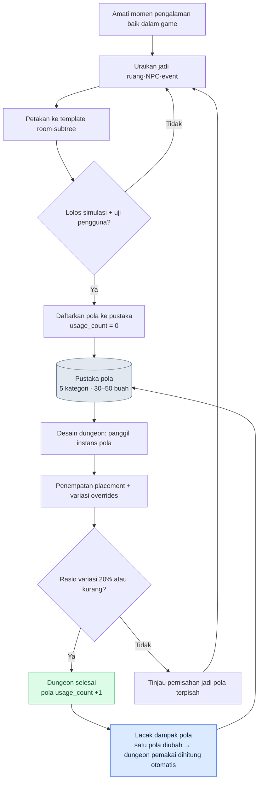

# 7.3 Pustaka Pola Dungeon dan Field

Di sebuah sesi peninjauan dungeon, seorang Level Designer baru menampilkan satu dungeon buatannya di layar. Koridor sempit, musuh cepat yang mengejar dari belakang, keputusan menghindar di titik percabangan. Itu dungeon yang dibuat dengan baik. Masalahnya, dungeon itu sedikit berbeda — secara halus — dari sebelas dungeon lain yang sudah pernah kami buat. Kecepatan kejar musuh, waktu jebakan meledak, momen munculnya percabangan. Tidak ada satu pun yang sama. Sang desainer baru yakin ia telah membuat sebuah pengalaman bernama sama, yaitu "dungeon kejar-kejaran", tetapi sensasi yang diterima pengguna berbeda-beda di setiap dungeon.

Keputusan kami hari itu sederhana. Mari kita definisikan pengalaman "kejar koridor" satu kali secara tepat, lalu kita kunci definisi itu jadi aturan. Lain kali, ketika seseorang membuat dungeon kejar-kejaran, ia tidak menyusunnya dari awal, melainkan memanggil definisi yang sudah dibakukan itu. Inilah awal mula pustaka pola.

Jika room adalah unit ruang dan BehaviorTree adalah unit perilaku, maka pola adalah unit operasional yang mengikat ruang, perilaku, dan peristiwa menjadi satu. Ketika satu pola dipakai ulang di beberapa dungeon, beban produksi massal berkurang, dan yang lebih penting, pengalaman yang diterima pengguna menjadi konsisten antardungeon.

---

## 7.3.1 Pola sebagai Unit Operasional

Bayangkan resep dalam buku masak; perumpamaan itu tepat. Satu lembar resep memuat bahan, urutan memasak, besar api, dan foto hasil jadi, semuanya bersama-sama. Meski restorannya berganti, mengikuti resep yang sama akan menghasilkan rasa yang sama. Namun setiap restoran tetap diizinkan sedikit variasi. Pola pun begitu. Ruang (room), perilaku (BT subtree), peristiwa (event), hasil (aturan hadiah dan tingkat kesulitan), serta penjelasan maksud desainer masuk dalam satu kesatuan.

<svg viewBox="0 0 720 250" xmlns="http://www.w3.org/2000/svg" font-family="sans-serif" font-size="13">
  <rect x="10" y="10" width="700" height="230" fill="#fafafa" stroke="#ccc"/>
  <text x="360" y="35" text-anchor="middle" font-size="15" font-weight="bold">Pola = Kesatuan Lima Elemen</text>
  <rect x="40" y="60" width="120" height="60" rx="6" fill="#e3f0ff" stroke="#5a8fd0"/>
  <text x="100" y="85" text-anchor="middle" font-weight="bold">Ruang</text>
  <text x="100" y="105" text-anchor="middle" font-size="11">1–3 meta room</text>
  <rect x="180" y="60" width="120" height="60" rx="6" fill="#e9f7e9" stroke="#6aa86a"/>
  <text x="240" y="85" text-anchor="middle" font-weight="bold">Perilaku</text>
  <text x="240" y="105" text-anchor="middle" font-size="11">1–2 BT subtree</text>
  <rect x="320" y="60" width="120" height="60" rx="6" fill="#fdf3e0" stroke="#d0a05a"/>
  <text x="380" y="85" text-anchor="middle" font-weight="bold">Peristiwa</text>
  <text x="380" y="105" text-anchor="middle" font-size="11">slot event</text>
  <rect x="460" y="60" width="120" height="60" rx="6" fill="#fde9ec" stroke="#d05a6e"/>
  <text x="520" y="85" text-anchor="middle" font-weight="bold">Hasil</text>
  <text x="520" y="105" text-anchor="middle" font-size="11">aturan hadiah & kesulitan</text>
  <rect x="600" y="60" width="90" height="60" rx="6" fill="#f0e9fd" stroke="#8a5ad0"/>
  <text x="645" y="85" text-anchor="middle" font-weight="bold">Maksud</text>
  <text x="645" y="105" text-anchor="middle" font-size="11">penjelasan</text>
  <text x="360" y="160" text-anchor="middle" font-size="13" font-style="italic">"Pola kejar koridor" = koridor sempit + BT musuh cepat + event jebakan + hadiah menghindar</text>
  <line x1="100" y1="180" x2="620" y2="180" stroke="#999" stroke-width="1"/>
  <text x="360" y="210" text-anchor="middle" font-size="12">→ Sekali terverifikasi, pengalaman yang sama direproduksi di 5–10 dungeon</text>
</svg>

Begitu satu pola didefinisikan, pengalaman yang sama dapat dibuat secara konsisten di setiap dungeon. Sebagaimana satu resep yang sudah terverifikasi menghasilkan rasa yang sama di berbagai restoran. Hanya saja, meski resepnya sama, setiap restoran tetap diberi sedikit variasi. Cara mengelola variasi inilah yang menjadi separuh dari pengelolaan pola. Di situlah letak `overrides` yang akan dibahas nanti.

---

## 7.3.2 Alur Penggabungan Pola

Inti pustaka pola adalah: pola dikunci jadi aturan dalam rulebook (buku aturan), lalu digabungkan untuk menghasilkan dungeon. Desainer tidak menyusun dungeon dari layar kosong, melainkan memilih dan menempatkan pola yang sudah terverifikasi serta hanya memvariasikan sebagiannya.



Separuh kiri alur ini (amati→uraikan→petakan→verifikasi→daftarkan) adalah proses membuat pola, sedangkan separuh kanan (panggil→tempatkan·variasi→selesai→lacak) adalah proses mengonsumsi pola. Pekerjaan membuat jarang terjadi, pekerjaan mengonsumsi sering terjadi. Bila pustaka dikelola dengan baik, ketidaksimetrisan ini berbuah efisiensi produksi massal.

---

## 7.3.3 Lima Kategori Dasar

Proyek A milik penulis berjenis Action RPG, sehingga pola diklasifikasikan ke dalam lima kategori. Klasifikasi ini bergantung pada genre. Jika game-nya horor, bobot penyergapan dan beat naratif akan berbeda; jika game-nya puzzle, pertarungan yang memanfaatkan lingkungan akan menjadi pusatnya. Jangan menganggap klasifikasi itu sendiri sebagai sesuatu yang mutlak; tentukan dulu apa pengalaman inti game Anda, baru susun kategorinya.

| Kategori | Pengalaman Inti | Contoh |
|---|---|---|
| pursuit | Kejar·kabur | Kejar koridor, kabur ngarai |
| ambush | Penyergapan·serangan kejutan | Sergapan saat masuk room, sergapan dari sudut buta pandangan |
| puzzle_combat | Pertarungan memanfaatkan lingkungan | Tuas·jebakan + pertarungan |
| boss_phase | Fase bos | Pola fase bos 1–3 |
| narrative_beat | Beat naratif | Pemicu kilas balik, kemunculan rekan |

Di dalam lima kategori, jumlah pola dipertahankan kira-kira antara tiga puluh hingga lima puluh buah. Angka ini ada alasannya. Bila pola melewati seratus buah, desainer tidak bisa lagi menyimpan seluruh pustaka di kepalanya. Begitu titik itu tercapai, pustaka berubah menjadi gudang yang butuh waktu untuk dicari, dan desainer lebih memilih menyusun yang baru. Begitu pustaka mulai diabaikan, tujuan awalnya — konsistensi — runtuh. Karena itu, mengelola batas atas jumlah pola secara sadar sama pentingnya dengan merancang kategorinya.

---

## 7.3.4 Format untuk Mengunci Pola jadi Aturan

Satu pola dibakukan dalam satu lembar berkas YAML. Berikut adalah bentuk yang benar-benar dipakai di Proyek A, yang telah dianonimkan. Nama aset milik perusahaan dan nomor dungeon ditutupi, tetapi struktur field dan cara pengoperasiannya tetap apa adanya.

```yaml
---
pattern_id: pattern_corridor_pursuit_v2
category: pursuit
description: Musuh cepat mengejar dari belakang di koridor sempit, pemain mengambil keputusan menghindar di titik percabangan
tags: [horizontal_corridor, scholar_theme_compatible]
rooms:
  - room_template: corridor_long
    size: medium
    connections_required: 2
  - room_template: junction_3way
    size: small
    connections_required: 3
npc_behaviors:
  - subtree_ref: subtree_aggressive_chase
    count: 2
  - subtree_ref: subtree_ranged_support
    count: 1
events:
  - type: trap_activation
    trigger: room_1_midpoint
  - type: enemy_spawn
    trigger: room_1_entry
difficulty_modifier: 1.2   # beban 1.2 kali lipat dibanding room biasa
reward_modifier: 1.3
clear_time_estimate_sec: 60
art_pack_compatible: [scholar_library, generic_dungeon]
narrative_slots:
  - slot: dialogue_during_chase
    constraints: [short_dialogue, fear_emotion]
usage_count: 12            # dipakai di 12 dungeon
last_modified: 2026-05-18
deprecated: false
---
```

Berkas ini secara bersamaan mendefinisikan satu bagian dari masing-masing dua belas dungeon. Bobot satu baris `usage_count: 12` berasal dari situ. Artinya, mengubah pola ini berarti dua belas dungeon terkena dampaknya sekaligus, sehingga menyentuh berkas pola punya bobot yang berbeda dari sekadar memperbaiki satu room.

Referensi seperti `subtree_aggressive_chase` atau `subtree_ranged_support` menunjuk langsung ke subtree yang didefinisikan di editor BehaviorTree pada 7.2. Intinya, pola tidak memuat BT secara langsung, melainkan hanya merujuknya. Ketika BT diperbaiki, semua pola yang merujuk BT tersebut otomatis ikut diperbarui. Ruang (template room) dan perilaku (subtree) dikelola di pustaka masing-masing, sementara pola hanya berperan sebagai tabel penggabung yang menjalin keduanya. Nilai seperti `clear_time_estimate_sec` atau `difficulty_modifier` hanyalah nilai operasional di lingkungan penulis, bukan konstanta universal. Anda harus mengisinya dengan mengukur langsung lewat simulasi dan uji pengguna game Anda sendiri.

---

## 7.3.5 Menginstansiasi Pola ke dalam Dungeon

Saat mendesain dungeon, pola tidak disusun dari awal. Pola dipanggil dari pustaka, ditentukan letaknya, lalu bagian yang ingin dibuat berbeda khusus di dungeon ini ditimpa dengan `overrides`.

```yaml
---
dungeon_id: dungeon_021_silvermark_library
pattern_instances:
  - instance: corridor_pursuit_1
    pattern_id: pattern_corridor_pursuit_v2
    placement:
      - room_id: dungeon_021_room_03
        as: corridor_long
      - room_id: dungeon_021_room_04
        as: junction_3way
    overrides:
      - field: npc_behaviors.0.subtree_ref
        value: subtree_scholar_chase   # varian bertema sarjana
      - field: events.0.trigger
        value: room_1_2nd_third         # penyetelan halus posisi pemicu
---
```

Di sini dungeon 021 memakai pola "kejar koridor" apa adanya, tetapi mengganti musuh pengejar dari musuh biasa menjadi varian bertema sarjana, serta memindahkan posisi jebakan meledak dari tengah koridor sedikit ke belakang. 80% pola tetap apa adanya, hanya 20% yang divariasikan.

Rasio ini punya dasar dari pengalaman operasional. Bila variasinya terlalu sedikit (mendekati 0%), dungeon-dungeon terasa membosankan seperti saling menjiplak. Bila variasinya terlalu banyak (melewati 50%), itu sudah bukan lagi pola yang sama. Anda mengira memanggil pola yang sama, padahal pengalaman nyatanya benar-benar berbeda — kembali persis ke situasi dungeon yang dibawa desainer baru itu. Karena itu kami menetapkan aturan operasional. Bila `overrides` satu instans melewati separuh field pola, itu bukan variasi, melainkan sinyal pola baru. Sudah waktunya memisahkannya menjadi pola terpisah.

---

## 7.3.6 Bila Satu Baris Diubah, di Mana Saja yang Goyah

Mengubah `pattern_corridor_pursuit_v2` akan berdampak pada dua belas dungeon. Jika manusia melacaknya dengan tangan, pasti ada satu-dua yang terlewat. Karena itu kami menyiapkan alat kecil yang otomatis menyisir hubungan antara pola dan dungeon.

```python
# pattern_impact.py
import json
from glob import glob

def find_dungeons_using(pattern_id):
    affected = []
    for d in glob("dungeons/*.json"):
        dungeon = json.load(open(d, encoding="utf-8"))
        for inst in dungeon.get("pattern_instances", []):
            if inst["pattern_id"] == pattern_id:
                affected.append({
                    "dungeon": dungeon["dungeon_id"],
                    "instance": inst["instance"],
                    "has_overrides": bool(inst.get("overrides")),
                })
    return affected
```

Inti dari daftar yang dikembalikan fungsi ini adalah flag `has_overrides`. Dungeon tanpa `overrides` memakai pola apa adanya, sehingga aman untuk diperbarui otomatis. Dungeon dengan `overrides` membutuhkan tinjauan manusia tambahan, karena variasi khas dungeon itu bisa berbenturan dengan perubahan pola.

Alih-alih manusia merasakan bobot perubahan satu per satu, alat ini melaporkan dalam 5 menit bahwa "perubahan kali ini berdampak pada 12 dungeon, 4 di antaranya punya variasi sehingga perlu ditinjau langsung". Nilai sebenarnya dari alat ini adalah mengurangi rasa takut untuk mengubah pola. Bila cakupan dampak tidak terlihat, desainer enggan mengubah pola sama sekali, dan pustaka pun menjadi air yang tergenang.

---

## 7.3.7 Bagaimana Pola Lahir, dan di Mana Tempat AI

Di sini saya akan menghadapi langsung pertanyaan yang paling sering saya terima. "Bukankah penulisan pola juga bisa diserahkan ke AI?"

Jawabannya jelas. Tidak bisa. Menulis satu pola bertumpu pada wawasan (insight) desainer sebagai tulang punggungnya. Apa itu pengalaman kejar yang baik, mengapa titik percabangan harus di situ, mengapa jebakan harus meledak di titik 2/3 dan bukan di tengah koridor agar ketegangannya hidup — ini adalah penilaian orang yang langsung menyentuh game dan melihat reaksi pengguna. Jika AI disuruh menyusun pola dari awal, semua pola akan berkonvergensi ke bentuk yang aman dan rata-rata. Pustaka akan penuh dengan "pola yang tidak salah", tetapi "pola yang berkesan" menghilang.

Bukan berarti AI tidak punya peran. Dari lima tahap penulisan pola, di dua tempat AI menjadi pembantu yang andal.

| Tahap | Keluaran | Peran AI |
|---|---|---|
| 1. Amati momen pengalaman baik dalam game | catatan | Desainer sendiri |
| 2. Uraikan momen itu jadi ruang·NPC·event | draf yaml | Desainer sendiri |
| 3. Petakan ke template room·subtree yang ada | kandidat pemetaan | Dibantu AI (rekomendasi kandidat) |
| 4. Simulasi + uji pengguna | verifikasi | Dibantu AI (menjalankan simulasi) |
| 5. Daftarkan ke pustaka | usage_count = 0 | Desainer sendiri |

Tahap 3 adalah inti bantuan AI. Ketika desainer menulis draf "musuh cepat mengejar dari belakang di koridor sempit", menyuruh manusia menyisir sendiri puluhan template room dan pustaka subtree yang sudah menumpuk untuk menemukan mana yang cocok dengan maksud itu sangatlah tidak efisien. Di sinilah AI disuruh merekomendasikan kandidat pemetaan. Berikut adalah prompt yang benar-benar dipakai, dalam bentuk yang telah dianonimkan.

```
[Masukan]
- draf yaml pola dari desainer (terlampir di bawah)
- pustaka template room (daftar nama + tag + ukuran)
- pustaka subtree (daftar nama + ringkasan perilaku)

Pilihkan dan rekomendasikan template room serta subtree dari pustaka untuk mewujudkan pola ini.
Masing-masing 2–3 buah, sertakan skor kecocokan 1–5 dan satu baris alasan berdasarkan tag·ukuran.
Jangan mengarang yang tidak ada di pustaka, hanya rekomendasikan; jika semuanya 3 ke bawah, nyatakan bahwa perlu penulisan baru.
```

Keluaran yang benar-benar dikembalikan Claude untuk prompt ini adalah sebagai berikut. Agar terlihat apa adanya di mana ia ragu dan di mana ia menegaskan, saya menyalinnya tanpa menyunting satu huruf pun.

```
Kandidat template room:
1. corridor_long  (kecocokan 5)
   Alasan: tag horizontal_corridor cocok, size medium sesuai maksud "koridor sempit".
2. corridor_narrow_short  (kecocokan 3)
   Alasan: memang sempit, tetapi panjangnya pendek sehingga sulit mengamankan jarak kejar. Ruang untuk menempatkan percabangan kurang.
3. hall_wide  (kecocokan 1)
   Alasan: aula lebar justru berlawanan dengan maksud "koridor sempit". Tekanan kejar tidak terasa.

Kandidat subtree:
1. subtree_aggressive_chase  (kecocokan 5)
   Alasan: perilaku kejar dari belakang terdefinisi, ada bobot kecepatan gerak.
2. subtree_ranged_support  (kecocokan 3)
   Alasan: bukan kejar itu sendiri, tetapi bisa ditempatkan 1 unit sebagai bantuan tekanan.
3. subtree_patrol_basic  (kecocokan 2)
   Alasan: perilaku patroli tidak sesuai dengan maksud kejar. Tidak ada node peralihan ke kejar setelah pemicu.

Template room titik percabangan (junction):
Saya tidak menemukan item di pustaka yang sekaligus memenuhi syarat percabangan 3way + ukuran small.
junction_3way paling mendekati, tetapi tag size-nya kosong sehingga
kecocokan tidak dapat dipastikan. Diperlukan konfirmasi desainer.
```

Paragraf terakhir adalah bagian paling berharga dari keluaran ini. AI berkata "tidak yakin" mengenai template room titik percabangan, dan tidak mengarang jawaban yang tidak ada. Setelah menerima laporan ini, desainer menemukan fakta bahwa tag size `junction_3way` memang kosong, lalu ia mengisi metadata itu terlebih dahulu. Seandainya AI mengabaikan tag kosong dan memberi kecocokan 5, desainer akan menerimanya begitu saja dengan kepercayaan yang keliru.

Inilah bentuk yang benar dari bantuan AI. AI membentangkan kandidat dan menandai ketidakpastian, sementara pilihan dan tanggung jawab tetap di tangan desainer. Bila hasil pemetaan menunjukkan kecocokan yang semuanya rendah, barulah muncul pekerjaan terpisah untuk menulis template baru, dan penulisan itu kembali menjadi pekerjaan manusia.

> **[Penanda Arah — Bila pola dipadatkan jadi 'vektor pengalaman' (masih terlalu dini)]** Mohon dibaca bukan sebagai resep, melainkan sebagai tren riset. §7.3.1 sudah menyebut pola sebagai 'resep'. Satu pola mendekati nilai koordinat yang merupakan satu kesatuan dari meta room·subtree perilaku·event·difficulty/reward_modifier·clear_time. Bila kesatuan ini dipadatkan menjadi 'vektor pengalaman', maka ketika kecocokannya semuanya rendah, alih-alih menyisir alur penulisan baru di atas satu per satu, kita bisa menemukan area kosong di ruang padat itu, dan penilaian deprecated di §7.3.8 pun dapat diperkuat dengan jarak koordinat untuk duplikasi yang berdekatan. Namun ada tiga catatan yang menyertainya. Sebagaimana disebut di §7.3.4, difficulty/reward_modifier adalah nilai operasional penulis sehingga skala sumbunya berbeda di tiap game dan ruang padat itu tidak bisa dipindahkan apa adanya; interpolasi hanya sampai pada 'penanda' kotak kosong, bukan 'pembangkitan' pola; dan menyusun pola yang sebenarnya di atas penanda itu tetap tidak melampaui prinsip subbab ini, bahwa wawasan desainer adalah tulang punggungnya. Gagasan ini berada di tempat yang sama dengan pemadatan vektor dimensi di §8.2.7, dan intuisi konsepnya ada di Lampiran M — saya tinggalkan sebagai area yang akan ditengok tim dengan fondasi yang cukup beberapa tahun kemudian.

---

## 7.3.8 Memangkas Pola yang Tidak Dipakai

Pustaka lebih sulit dikosongkan daripada diisi. Setelah beroperasi sekitar satu tahun, menumpuk pola yang dibuat tetapi nyaris tidak terpakai. Bila dibiarkan, biaya pencarian di pustaka meningkat, dan desainer harus menyisir hingga ke pilihan-pilihan mati saat memilih pola. Karena itu, secara berkala dipangkas.

| Kondisi | Penanganan |
|---|---|
| Kenaikan usage_count 0 selama 6 bulan | Diklasifikasikan sebagai kandidat deprecated |
| Keputusan pembuangan di rapat peninjauan | Ditandai `deprecated: true` |
| Dungeon yang sudah memakai | Dipertahankan apa adanya (preservasi historis) |
| Dungeon baru | Dilarang memakai pola tersebut |

Intinya, pembuangan bukanlah penghapusan. Dungeon-dungeon yang sudah memakai pola itu dibiarkan apa adanya. Sebab menyentuh dungeon yang sedang berjalan di layanan live lebih berisiko daripada menghalangi pola baru. `deprecated: true` hanyalah penanda yang berarti "jangan dipakai lagi mulai sekarang", bukan perintah untuk menghapus masa lalu.

Sebagaimana kita mengeluarkan dan merapikan alat yang tak terpakai di laci meja satu kali setiap kuartal, pustaka pun dijadwalkan untuk dipangkas satu kali per kuartal. Tanpa jadwal ini, pustaka hanya membengkak ke satu arah, dan pada suatu titik menjadi gudang yang diabaikan desainer.

---

## 7.3.9 Mengukur Efek secara Jujur

Berikut adalah perubahan yang diamati selama satu tahun mengoperasikan pustaka pola di Proyek A milik penulis. Nilai waktu pada tabel di bawah adalah perkiraan penulis (belum terverifikasi); yang benar-benar teramati hanyalah arah dan rasio relatifnya.

| Item | Sebelum diterapkan | Sesudah diterapkan | Keterangan |
|---|---|---|---|
| Waktu desain 1 dungeon | sekitar 2 minggu | sekitar 1 minggu | Perkiraan penulis, arahnya jelas |
| Konsistensi pengalaman antardungeon | sebaran besar | stabil | Berdasar penilaian pengguna, kualitatif |
| Rata-rata dungeon pemakai per 1 pola | — | sekitar 8 | Indikator inti efisiensi produksi massal |
| Onboarding desainer baru | sekitar 2 bulan | sekitar 3 minggu | Perkiraan penulis, efek paling terasa |
| Pemahaman dampak perubahan pola | 1–2 hari manual | laporan otomatis 5 menit | Efek penerapan pattern_impact.py |

Perubahan yang paling berkesan adalah baris kedua dari bawah, yaitu onboarding desainer baru. Pustaka pola tanpa sengaja berperan sebagai buku ajar desain. Karena desainer baru kini bisa membaca dan memahami "begini cara membuat pengalaman kejar di game ini" dari satu lembar berkas pola, waktu senior duduk di sebelahnya untuk menjelaskan berkurang drastis. Masalah dungeon yang berbeda-beda yang dibawa desainer baru pada awalnya, ternyata teratasi oleh pustaka itu sendiri.

Angka "rata-rata dungeon pemakai per 1 pola sekitar 8" berarti pola yang sama dipakai ulang delapan kali, dan inilah ukuran jujur efisiensi produksi massal. Hanya saja, nilai 8 ini bergantung pada skala dungeon dan rancangan pola game penulis. Pada game dengan jumlah dungeon sedikit atau yang menuntut konsep berbeda setiap kali, nilai ini akan jauh lebih kecil.

---

## 7.3.10 Keputusan untuk Tidak Membangun Pustaka

Terakhir, agar jujur, saya harus menyampaikan cerita yang membalik seluruh bab ini. Pustaka pola bukanlah obat segala penyakit. Jelas ada lingkungan di mana biaya membangun dan mengoperasikan pustaka tidak terbayar kembali.

| Kondisi | Rekomendasi |
|---|---|
| Kurang dari 5 dungeon | Cukup manual, pustaka tidak diperlukan |
| Desainer 1 orang | Kepalanya adalah pustaka itu sendiri |
| Sekali rilis, tanpa Live Ops | Peluang pakai ulang itu sendiri sedikit |
| Konsep yang sepenuhnya berbeda setiap kali | Rasio pakai ulang rendah, ROI tidak terbayar |

ROI (Return on Investment, efek dibanding investasi) pustaka terbayar kembali ketika tiga kondisi terpenuhi bersama-sama: ada Live Ops, desainernya tiga orang atau lebih, dan jumlah dungeon melewati dua puluh. Di sinilah alasan mengapa MMORPG dengan Live Ops menjadi sasaran penerapan yang khas. Bila proyek Anda tersangkut di salah satu baris tabel di atas, berhentilah dan pikirkan ulang sebelum membangun pustaka. Alat hanya bernilai ketika ada masalah, dan bagi proyek berisi lima dungeon, pustaka pola lebih besar biayanya daripada masalahnya.

---

## 7.3.11 Kegagalan Umum dan Resepnya

| Gejala | Resep |
|---|---|
| Pola melewati 100 buah hingga desainer tak hafal | Rapikan jadi 30–50 buah, pangkas deprecated tiap kuartal |
| Pelacakan dampak pola dilakukan manual (muncul kelolosan) | Alat pelacak otomatis seperti pattern_impact.py |
| overrides 80% ke atas (pakai ulang tidak nyata) | Variasi terlalu besar → pisahkan jadi pola terpisah |
| Penulisan pola didelegasikan sepenuhnya ke AI | Penulisan adalah wawasan desainer, AI hanya bantu tahap 3·4 |
| usage_count tidak diukur | Hitung otomatis + tinjau di retrospektif kuartal |
| Tidak ada penjelasan pustaka untuk desainer baru | Sertakan tur pustaka dalam materi onboarding |

Baris kedua dan baris keempat tabel ini yang paling sering menjegal. Jika pelacakan dampak tidak diotomatiskan, desainer takut mengubah pola sehingga pustaka mengeras; jika penulisan didelegasikan ke AI, pustaka berkonvergensi ke rata-rata. Kedua kegagalan ini sama-sama membunuh nyawa pustaka, yaitu "pakai ulang pengalaman yang terverifikasi".

---

## 7.3.12 Menutup Bagian 7

Bagian 7 menumpuk bidang level dalam tiga lapisan. Di 7.1 ditegakkan standar metadata room, tag, dan konektivitas (ruang); di 7.2 dibahas editor BehaviorTree berbasis JSON, subtree, dan simulasi (perilaku); dan di bab ini kita sampai pada pustaka pola yang mengikat keduanya bersama event untuk dipakai ulang (unit operasional). Dari pengelolaan yang menangani ruang dan perilaku secara terpisah, masalah di mana keputusan pada posisi yang sama goyah dalam bentuk berbeda setiap minggu, lalu diselesaikan dengan mengunci jadi aturan sebuah kesatuan bernama pola — itulah benang merah seluruh Bagian 7.

Alur ini terjalin tepat dengan desain integrasi Layer. Visi berupa tone ruang seluruh game berada di atas, di bawahnya ada sistem berupa aturan pembangkitan level dan aturan BT, room·BT·pustaka pola membentuk lapisan konten, instans dungeon dan statistik penggunaan pola menumpuk sebagai data, serta lint·simulasi·telemetri pengguna memverifikasinya pada tahap build·QA. Pustaka pola adalah tulang punggung lapisan konten di antara lima lapisan ini, sekaligus mata rantai yang ke atas mengikuti aturan sistem dan ke bawah menghasilkan statistik data.

---

### Poin-Poin Penting
- Pola adalah unit operasional yang mengikat ruang·perilaku·event; bila ketiganya ditangani terpisah, pengalaman yang sama goyah berbeda setiap minggu
- 80% pakai ulang + 20% variasi adalah rasio yang dianjurkan; bila variasi melewati separuh, itu sinyal pola baru
- Penulisan pola adalah tempat wawasan desainer, dan AI hanya sampai pada rekomendasi kandidat pemetaan dan bantuan simulasi

### Pratinjau Bab Berikutnya
- 8.1 Operasional CombatBalance · CombatFormula — pemisahan dua dokumen dalam desain balancing

---

## Coba Sendiri — Mengunci Satu Pola Kejar jadi Aturan

### setup
1. Buatlah dua direktori, `patterns/` dan `dungeons/`, di folder kerja Anda.
2. Siapkan daftar nama template room dan daftar nama subtree, masing-masing dalam berkas berisi satu nama per baris. (Jika belum punya pustaka, Anda boleh mulai dengan 5 nama fiktif untuk masing-masing.)
3. Simpan `pattern_impact.py` dari isi di atas apa adanya.

### prompt
Desainer menulis sendiri draf yaml pola (bagian ini adalah jatah manusia). Setelah itu, serahkan hanya pemetaan kepada AI. Pakai prompt pemetaan dari isi bab apa adanya, tetapi lampirkan draf Anda sendiri dan kedua daftar pustaka pada masukan. Jangan sampai melewatkan dua baris batasan inti.

```
- Jangan mengarang template baru yang tidak ada di pustaka. Hanya rekomendasikan.
- Jika skor kecocokan semuanya 3 ke bawah, nyatakan secara eksplisit bahwa perlu penulisan baru.
```

### verify
1. Periksa baris per baris apakah AI tidak mengarang nama template yang tidak ada di pustaka.
2. Lihat apakah skor kecocokan disertai alasan berdasarkan tag·ukuran. Jangan percayai skor tanpa alasan.
3. Setelah menginstansiasi pola ke 2 dungeon atau lebih, jalankan `find_dungeons_using("pattern_...")` untuk memastikan kedua dungeon itu terjaring dengan tepat.

### Versi Ringkas Solo
Jika Anda membuat game kecil sendirian, sistem pustaka itu berlebihan. Sebagai gantinya, cukup pilih satu segmen dungeon yang paling Anda sukai dan tuliskan pengalamannya dalam satu lembar yaml. Saat membuat dungeon berikutnya, buka satu lembar itu, salin, lalu ubah hanya 20%-nya. Esensi pustaka pola — pakai ulang pengalaman yang terverifikasi — bekerja bahkan dari satu lembar berkas. Bila skalanya membesar, barulah Anda menambahkan kategori dan alat pelacakan saat itu.
