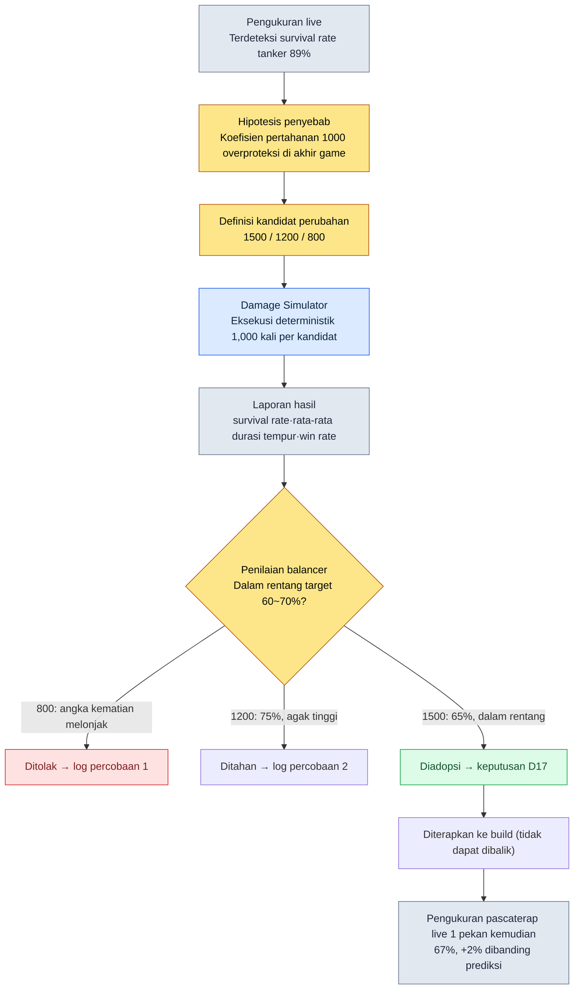

# 8.1 Formula Balans Tempur — Tempat Rulebook bernama Determinisme

> **Tujuan pembelajaran bab ini** (tingkat kesulitan 🟡 praktis · prasyarat: aritmetika dasar·perhitungan tabel): Anda akan mampu memisahkan balans tempur menjadi tempat untuk formula dan tempat untuk angka, lalu—dengan berpijak pada dua sifat yaitu determinisme dan keterlacakan—membedakan sampai sejauh mana sesuatu boleh diserahkan kepada AI dan dari titik mana manusia harus menguncinya sebagai rulebook.

Pukul dua dini hari, muncul notifikasi bahwa tingkat bertahan hidup (survival rate) job tanker di server live menyentuh 89%. Tidak ada tanker yang gagal menghabisi bos sampai akhir, dan terlalu banyak tanker yang tidak mati. Untuk mencari jejak tangan seseorang yang pernah mengutak-atik ini, saya membuka sheet data. Tampak satu baris koefisien pertahanan. `DEF / (DEF + 1000)`. Di mana pun pada sheet itu tidak tertulis kapan, oleh tangan siapa, dan atas dasar apa angka 1000 ini turun dari 1200 menjadi 1000. Mulailah pelacakan yang baru selesai setelah saya menyisir log chat, menyisir riwayat build, dan akhirnya harus sampai pada ingatan seorang balancer yang sudah resign tiga tahun lalu.

Adegan ini dialami siapa pun yang pernah mengoperasikan balans tempur, setidaknya sekali. Dan penyebab sebenarnya dari adegan ini bukanlah bahwa angka 1000 itu salah. Penyebabnya adalah bahwa angka itu hidup di tempat **formula**, sedangkan **riwayat** perubahan formula itu tidak ada di mana pun. Formula balans tempur adalah area yang paling harus deterministik di dalam game, dan area yang paling harus dapat dilacak. Mengapa kedua sifat inilah yang menjadi alasan AI tidak boleh dimasukkan ke tempat ini—itulah tulang punggung bab ini.

> **Satu baris untuk pembaca non-teknis.** Tak masalah jika z-score, simulasi, dan kurva di bagian ini terasa asing. Satu hal yang perlu Anda bawa pulang adalah ini — **"Aturan (formula) yang harus selalu menghasilkan keluaran sama untuk masukan sama tidak boleh diserahkan kepada AI."** Penilaian yang memisahkan tempat yang membutuhkan determinisme dari tempat yang membutuhkan eksplorasi ini dapat dipindahkan apa adanya ke semua pekerjaan yang menangani 'aturan yang tidak boleh salah'—seperti regulasi akuntansi, logika penyelesaian (settlement), atau klausul kontrak. Rumus matematikanya sendiri boleh Anda baca pelan-pelan mulai dari 8.1.2.

---

## 8.1.1 Formula Adalah Rulebook

Setelah cukup lama menggeluti desain game, ada dua jenis dokumen yang terasa di tangan. Dokumen yang sering berubah, dan dokumen yang nyaris tak pernah berubah. Dalam balans tempur, sisi yang nyaris tak pernah berubah adalah formula. "Bagaimana damage dihitung" disentuh satu-dua kali per kuartal, sedangkan "berapa attack power karakter ini" disentuh lima-enam kali per pekan. Jika dua aliran dengan frekuensi berbeda ini diikat dalam satu berkas, lembar kertas yang jarang dibuka-tutup akan robek oleh tangan yang sering membuka-tutup.

Pada Proyek A yang saya kelola, balans tempur dipisahkan ke dua tempat. Tempat untuk formula (di sini saya menyebutnya `CombatFormula`) dan tempat untuk angka (`CombatBalance`). Saya kutip apa adanya satu baris yang hidup di tempat formula.

```
final_damage = base_damage × dmg_multiplier × (1 − defense_factor) × variation

  base_damage    = skill_base × ATK × skill_coeff
  defense_factor = DEF / (DEF + 1000)
  variation      = uniform(0.95, 1.05)
```

Formula ini adalah rulebook. Bayangkan saja buku aturan sebuah board game. Buku aturan menulis "bergerak sebanyak mata dadu yang muncul setelah dilempar", bukan "kalau ronde ini sedang beruntung, boleh maju sedikit lebih jauh". Masukan sama selalu menghasilkan keluaran sama. Inilah determinisme. Jika Anda memasukkan attack power 180, defense 80, skill coefficient 2.1, maka kapan pun, di mana pun, dan berapa kali pun dihitung, damage yang keluar harus sama. Andai masukan sama menghasilkan keluaran berbeda, itu bukan alat balans, melainkan mesin judi.

Satu sifat bernama determinisme inilah alasan pertama mengapa AI tidak boleh dimasukkan ke tempat ini. Akan saya bahas lagi sebentar lagi. Mari lebih dulu kita lihat bagaimana seharusnya sebuah formula berwujud agar layak disebut rulebook.

Area inti formula tempur tidak berhenti pada satu baris damage. Setidaknya tiga baris hidup sebagai satu kesatuan.

```
# Damage
final_damage = base_damage × dmg_multiplier × (1 − defense_factor) × variation

# Critical
crit_damage  = final_damage × crit_multiplier
crit_chance  = base_crit + (LUK × 0.1)            # batas atas 50%

# Pemulihan
heal         = base_heal × healing_power × (1 − sickness_factor)
```

Ada alasan mengapa ketiga baris ini ditulis sebagai blok kode, bukan sebagai bahasa alami. Bahasa alami menyisakan ruang interpretasi. Kalimat "semakin tinggi defense, semakin berkurang damage" tidak menyebutkan apakah pengurangannya linear, apakah berkurva, atau di mana berhenti. `DEF / (DEF + 1000)` hanya terbaca satu cara. Tugas rulebook adalah menjadikan ruang interpretasi nol.

---

## 8.1.2 Kurva Menentukan Determinisme

Seluruh filosofi balans game ini tertanam dalam satu baris koefisien pertahanan `DEF / (DEF + 1000)`. Jika baris ini digambar sebagai grafik, akan terlihat mengapa demikian. Sumbu horizontal adalah defense, sumbu vertikal adalah rasio pengurangan damage yang diterima.

<svg viewBox="0 0 640 320" xmlns="http://www.w3.org/2000/svg" font-family="sans-serif">
  <rect x="0" y="0" width="640" height="320" fill="#ffffff"/>
  <!-- axes -->
  <line x1="70" y1="270" x2="610" y2="270" stroke="#333" stroke-width="1.5"/>
  <line x1="70" y1="270" x2="70" y2="30" stroke="#333" stroke-width="1.5"/>
  <!-- y gridlines -->
  <line x1="70" y1="150" x2="610" y2="150" stroke="#e0e0e0" stroke-width="1"/>
  <text x="40" y="275" font-size="12" fill="#666">0%</text>
  <text x="34" y="155" font-size="12" fill="#666">50%</text>
  <text x="34" y="55" font-size="12" fill="#666" >~91%</text>
  <text x="300" y="300" font-size="13" fill="#333">Defense DEF →</text>
  <!-- x ticks -->
  <text x="60" y="288" font-size="11" fill="#666">0</text>
  <text x="190" y="288" font-size="11" fill="#666">1000</text>
  <text x="320" y="288" font-size="11" fill="#666">2500</text>
  <text x="470" y="288" font-size="11" fill="#666">5000</text>
  <text x="585" y="288" font-size="11" fill="#666">10000</text>
  <!-- DEF/(DEF+1000) curve: x in [0,10000] mapped to [70,610]; y reduction in [0, ~0.909] mapped to [270, 50] -->
  <path d="M70,270 C 110,180 160,140 200,135 C 280,124 360,98 470,78 C 540,66 580,58 610,52"
        fill="none" stroke="#c0392b" stroke-width="2.5"/>
  <!-- diminishing-return marker at DEF=1000 (50%) -->
  <circle cx="200" cy="135" r="4" fill="#c0392b"/>
  <line x1="200" y1="135" x2="200" y2="270" stroke="#c0392b" stroke-width="1" stroke-dasharray="4 3"/>
  <text x="208" y="128" font-size="11" fill="#c0392b">Saat DEF=1000, damage berkurang 50%</text>
  <!-- linear ghost for contrast -->
  <line x1="70" y1="270" x2="430" y2="50" stroke="#95a5a6" stroke-width="1.5" stroke-dasharray="5 4"/>
  <text x="430" y="48" font-size="11" fill="#95a5a6">(seandainya linear — tidak diadopsi)</text>
  <text x="120" y="240" font-size="11" fill="#c0392b">Curam di awal</text>
  <text x="470" y="100" font-size="11" fill="#c0392b">Landai di akhir (diminishing returns)</text>
</svg>

Kurva ini menempel perlahan pada asimtot (asymptote). Pada defense 1000 ia memangkas damage tepat menjadi setengah, dan setelah itu, sekeras apa pun dinaikkan, ia tak pernah menyentuh 100%. Bahwa kekebalan total mustahil—itu tertanam dalam satu baris ini. Andai kurva ini linear seperti garis putus-putus abu-abu, maka pada defense 1000 damage akan tertahan seluruhnya, dan di atasnya akan melewati ke area yang tidak masuk akal yaitu damage negatif (makin dipukul makin pulih HP-nya). Itulah sebabnya bentuk linear tidak diadopsi.

Mari kita kembali ke insiden pukul dua dini hari di sini. Misalkan seseorang menaikkan angka 1000 ini menjadi 1200. Seluruh kurva tergeser ke kanan. Karena dengan defense yang sama damage yang tertahan menjadi lebih sedikit, tanker di seluruh game melemah dan damage per jam dari dealer meningkat. **Satu konstanta dalam formula mengguncang seluruh game.** Skala dampaknya berbeda dengan mengubah satu angka (attack power suatu karakter). Perbedaan inilah alasan formula dan angka harus diletakkan di tempat berbeda, dan alasan perubahan formula wajib selalu disertai riwayat.

---

## 8.1.3 Perubahan Formula Selalu Disertai Riwayat

Alasan pelacakan pukul dua dini hari menjadi neraka hanya satu: karena tidak ada riwayat perubahan. Pada Proyek A, perubahan formula bukanlah pekerjaan memperbaiki satu baris kode, melainkan **pekerjaan mencatat satu keputusan**. Di samping formula selalu mengikuti sebuah dokumen terpisah bernama `CombatFormula_Decisions`, dan di sana ditulis seperti ini.

```markdown
## Keputusan D17 (2026-04-22)
- Perubahan: defense_factor dari DEF/(DEF+1000) → DEF/(DEF+1500)
- Alasan: pada segmen level tinggi (LV40+), survival rate tanker 89% (pengukuran live). Penyebab pertarungan bos jadi berlarut-larut.
- Percobaan 1: simulasi dengan 800 → angka kematian tanker melonjak, banyak yang wipe dalam 1 menit setelah masuk bos → rollback
- Percobaan 2: simulasi dengan 1200 → survival rate 75% → cukup baik tapi lebih tinggi dari target (60~70%)
- Percobaan 3: 1500 diadopsi → survival rate simulasi 65% (dalam rentang target)
- atom terdampak: combat_defense_formula, combat_tank_class_balance
- Pengukuran pascaterap (1 pekan): survival rate live 67% (dibanding prediksi simulasi 65%, +2%, dalam rentang)
```

Satu catatan ini menjawab "mengapa jadi begini" enam bulan kemudian. Yang lebih penting adalah tertinggalnya percobaan 1 dan percobaan 2. Jika tercatat mengapa 800 tidak berhasil dan mengapa 1200 tidak diadopsi, orang berikutnya tidak akan mengulangi kesalahan yang sama. Saat seorang balancer baru bergabung, satu kesatuan log keputusan ini menjadi materi onboarding terbaik.

Ada satu hal yang perlu saya tunjukkan dengan jujur di sini. Angka simulasi percobaan 1·2·3 di atas (angka kematian, survival rate 75%, 65%) adalah **perkiraan penulis (belum terverifikasi)** yang dipakai untuk memperlihatkan alur operasional. Setiap game nyata punya kurva maupun rentang target yang berbeda. Namun **struktur** bahwa "perubahan disertai percobaan, percobaan disertai dasar simulasi, dan setelah adopsi disertai pengukuran pascaterap" adalah apa adanya dari operasional nyata. Dalam struktur ini, jika satu kolom saja kosong, kolom yang kosong itu akan kembali sebagai pelacakan pukul dua dini hari.

Jika tiga tempat—formula, angka, dan riwayat—dilihat sekaligus, bentuknya seperti ini.

<svg viewBox="0 0 660 280" xmlns="http://www.w3.org/2000/svg" font-family="sans-serif">
  <rect x="0" y="0" width="660" height="280" fill="#ffffff"/>
  <!-- CombatFormula -->
  <rect x="30" y="40" width="180" height="120" rx="8" fill="#fdecea" stroke="#c0392b" stroke-width="1.5"/>
  <text x="120" y="66" font-size="14" text-anchor="middle" fill="#c0392b" font-weight="bold">CombatFormula</text>
  <text x="120" y="88" font-size="11" text-anchor="middle" fill="#333">Formula (rulebook)</text>
  <text x="120" y="110" font-size="11" text-anchor="middle" fill="#666">Berubah 1~2 kali/kuartal</text>
  <text x="120" y="130" font-size="11" text-anchor="middle" fill="#666">Deterministik · AI dilarang</text>
  <text x="120" y="150" font-size="11" text-anchor="middle" fill="#666">Dampak: seluruh game</text>
  <!-- CombatBalance -->
  <rect x="240" y="40" width="180" height="120" rx="8" fill="#eaf2fb" stroke="#2c6fbb" stroke-width="1.5"/>
  <text x="330" y="66" font-size="14" text-anchor="middle" fill="#2c6fbb" font-weight="bold">CombatBalance</text>
  <text x="330" y="88" font-size="11" text-anchor="middle" fill="#333">Angka (sheet)</text>
  <text x="330" y="110" font-size="11" text-anchor="middle" fill="#666">Berubah 5~10 kali/pekan</text>
  <text x="330" y="130" font-size="11" text-anchor="middle" fill="#666">Lolos gerbang simulasi</text>
  <text x="330" y="150" font-size="11" text-anchor="middle" fill="#666">Dampak: karakter terkait</text>
  <!-- Decisions -->
  <rect x="450" y="40" width="180" height="120" rx="8" fill="#eafaf1" stroke="#27865a" stroke-width="1.5"/>
  <text x="540" y="66" font-size="14" text-anchor="middle" fill="#27865a" font-weight="bold">_Decisions</text>
  <text x="540" y="88" font-size="11" text-anchor="middle" fill="#333">Riwayat keputusan (log)</text>
  <text x="540" y="110" font-size="11" text-anchor="middle" fill="#666">1 catatan per perubahan</text>
  <text x="540" y="130" font-size="11" text-anchor="middle" fill="#666">Alasan·percobaan·pascaterap</text>
  <text x="540" y="150" font-size="11" text-anchor="middle" fill="#666">Materi inti onboarding</text>
  <!-- arrows -->
  <line x1="210" y1="100" x2="240" y2="100" stroke="#888" stroke-width="1.5" marker-end="url(#ah)"/>
  <line x1="120" y1="160" x2="120" y2="200" stroke="#27865a" stroke-width="1.5" marker-end="url(#ah)"/>
  <line x1="540" y1="160" x2="540" y2="200" stroke="#27865a" stroke-width="1.5" stroke-dasharray="4 3"/>
  <path d="M120,205 L540,205" stroke="#27865a" stroke-width="1.5" fill="none"/>
  <path d="M540,205 L540,162" stroke="#27865a" stroke-width="1.5" fill="none" marker-end="url(#ah)"/>
  <text x="225" y="225" font-size="11" text-anchor="middle" fill="#27865a">Satu perubahan formula → satu log keputusan (lampiran alasan·percobaan·pascaterap)</text>
  <defs>
    <marker id="ah" markerWidth="8" markerHeight="8" refX="6" refY="3" orient="auto">
      <path d="M0,0 L6,3 L0,6 Z" fill="#888"/>
    </marker>
  </defs>
</svg>

---

## 8.1.4 Alur Nyata Saat Sebuah Formula Berubah

Sekarang mari kita telusuri dari awal bagaimana D17 diputuskan. Inilah cara sebuah rulebook deterministik bergerak dalam praktik.



Dalam alur ini Anda harus melihat dengan tepat peran simulator. `Damage Simulator` menjalankan ketiga kandidat masing-masing 1,000 kali. Di sini, 1,000 kali bukanlah mengulang masukan yang sama sebanyak 1,000 kali. Karena adanya bilangan acak ±5% bernama `variation = uniform(0.95, 1.05)` di dalam formula, ditambah bilangan acak lain yaitu peluang critical, maka hasil tiap pertandingan berbeda-beda. Dengan menjalankan 1,000 pertandingan, kita melihat **distribusinya**. Kita melihat rata-rata survival rate, kasus terburuk, dan sebaran durasi tempur.

Penting bahwa simulator itu sendiri harus deterministik. Jika diberi seed acak yang sama, 1,000 pertandingan harus dapat direproduksi tanpa meleset satu titik pun. Hanya dengan begitu, satu baris D17 yang menyebut "dengan 1500 keluar 65%" dapat direproduksi persis dan diverifikasi enam bulan kemudian. Jika simulator menghasilkan hasil berbeda tiap kali, log keputusan menjadi sebuah kebohongan.

Pertama kali saya membuat damage simulator ini adalah tahun 2008. Saat itu ia berupa makro Excel, dan kini di Proyek A ia dienkapsulasi sebagai skill `balance-sim`. Selama 18 tahun cangkang alatnya berubah, tetapi rulebook yang ada di dalamnya tak pernah sekali pun bersifat probabilistik. Inilah intinya.

---

## 8.1.5 Mengapa AI Mutlak Dilarang pada Kurva Reward dan Formula

Sekarang kita sampai pada hal yang paling ingin disampaikan bab ini. Di saat AI masuk ke hampir semua tempat dalam desain game, ada satu tempat yang mutlak tidak boleh dimasuki. Itulah inti determinisme bernama formula tempur dan kurva reward.

LLM pada hakikatnya bersifat probabilistik. Untuk pertanyaan yang sama, ia menjawab sedikit berbeda setiap kali. Itulah sumber kekuatannya menghasilkan tulisan dan ide yang baik, tetapi fatal bagi tempat rulebook. Jika "berapa damage yang diterima karakter dengan defense 80?" dibuat dijawab oleh LLM, hari ini ia bisa menjawab 92, besok 94. Sama saja seperti buku aturan board game yang maknanya berubah setiap kali halaman dibalik.

Kurva reward lebih berbahaya lagi. "Experience yang dibutuhkan saat naik dari level 30 ke 31" sekali ditetapkan langsung mengatur kecepatan progres ratusan ribu orang secara serempak. Cukup masuk gelombang ±2% saja di sini, sebagian pengguna akan naik lebih lambat dari orang di sebelahnya meskipun berburu hal yang sama. Keadilan runtuh. Determinisme adalah sinonim dari keadilan. Itulah sebabnya kurva reward ditetapkan manusia dengan tangan, dimasukkan ke sheet, dan tak pernah lagi diserahkan kepada peluang.

Bukan berarti AI harus diusir dari seluruh area balans. Batasnya yang menjadi inti.

| Area | AI | Alasan |
|---|---|---|
| Perhitungan formula damage·pemulihan | Mutlak dilarang | Inti determinisme. Jika masukan sama = keluaran sama runtuh, jadilah mesin judi |
| Kurva reward·experience | Mutlak dilarang | Mengatur progres ratusan ribu orang serempak. Jika berguncang, keadilan runtuh |
| Operasi internal simulator | Mutlak dilarang | Jika tidak dapat direproduksi, log keputusan jadi dusta |
| Deteksi pola anomali pada hasil simulasi | Boleh | Mendeteksi z-score "karakter ini di luar normal" dari 1,000 hasil |
| Eksplorasi kandidat perubahan | Boleh | Eksplorasi terbatas seperti "ajukan 5 kandidat pada base_atk ±10%" |
| Penyusunan draf log keputusan | Boleh | Isi rapat → draf entri Decisions (ditinjau manusia) |
| Ringkasan laporan pengukuran pascaterap | Boleh | Ringkasan bahasa alami atas data live |

Garisnya jelas. **AI hanya hidup di luar inti determinisme.** Sisi dalam yang menghitung dan menyimulasi adalah rulebook, sedangkan sisi luar yang menganalisis, mengusulkan, dan menuangkannya ke tulisan adalah tempat AI. Sekali garis ini dilewati, masukan sama mulai menghasilkan hasil berbeda, dan sejak saat itu alat balans kehilangan kepercayaan.

Batas ini berstruktur sama persis dengan sistem ekonomi yang akan kita lihat di 8.2. Pada ekonomi pun, formula produksi·konsumsi sumber daya adalah determinisme, dan deteksi pola inflasi adalah tempat AI. Seluruh bidang balans bergerak dengan kerangka yang sama.

---

## 8.1.6 Selangkah Lebih Jauh — Penerapan Progresif Mengajukan Kandidat lewat z-score

Sampai sekarang ini adalah penerapan konservatif di mana manusia membuat kandidat dan simulasi memverifikasinya. Jika melangkah satu langkah lebih jauh, pekerjaan membuat kandidat pun dapat digantikan oleh alat. Hanya saja, rulebook tetap milik manusia dan determinisme.

Titik berangkatnya adalah deteksi pola anomali. Dari hasil simulasi 1,000 pertandingan, kita lihat distribusi win rate·survival rate per karakter, lalu mengukur dengan z-score seberapa banyak ia menyimpang dari rata-rata sebesar berapa kali standar deviasi. Karakter dengan z melampaui 2 ditandai otomatis sebagai "di luar rentang normal". Tanker pukul dua dini hari pun pasti tertangkap oleh deteksi ini.

Agar deteksi berlanjut menjadi pengajuan kandidat, dibutuhkan dua hal lagi. Pertama adalah **definisi ruang perubahan**. Sediakan kolom seperti `tunable_range` pada sheet CombatBalance untuk menyatakan "angka ini boleh diutak-atik dalam rentang mana". Kedua adalah **paralelisasi simulasi**. Untuk menjalankan 10 kandidat × 1,000 pertandingan = 10,000 pertandingan dalam waktu gerbang build, dibutuhkan infrastruktur paralel.

Jika ketiga hal ini (deteksi z-score · definisi ruang perubahan · paralelisasi simulasi) terpenuhi, keputusan yang tersisa di tangan balancer menyempit menjadi satu hal saja: "kandidat mana yang akan diadopsi". Membuat kandidat dari nol dan memilih satu dari lima punya beban yang berbeda. Di sini pun, yang disentuh AI hanyalah pengajuan kandidat dan interpretasi laporan; operasi di sisi dalam simulasi dan keputusan adopsi adalah tempat determinisme dan manusia.

Terakhir mari kita tunjuk reversibilitas. Baik mengubah sheet maupun menjalankan simulasi sama-sama dapat dibalik sehingga bisa diurungkan sepuasnya. Satu-satunya tempat yang tidak dapat dibalik adalah penerapan ke build. Angka yang sudah keluar ke live, begitu dilihat pengguna, tertinggal sebagai reaksi komunitas, sehingga jejaknya tidak terhapus meski di-rollback. Itulah sebabnya semua tinjauan diselesaikan tepat sebelum penerapan ke build, pada tahap yang masih dapat dibalik.

---

## Coba Sendiri — Menangani Satu Perubahan Formula dengan Aman

**setup.** Buatlah dokumen `CombatFormula` yang memisahkan formula tempur dari penjelasan bahasa alami dan menuliskannya hanya sebagai blok kode, serta di sampingnya dokumen log `CombatFormula_Decisions` yang kosong. Angka dipisahkan ke sheet terpisah (`CombatBalance`).

**prompt.** Gunakan AI hanya untuk **analisis·draf**, bukan untuk perubahan formula. Misalnya, berikan CSV hasil simulasi lalu minta seperti ini.

```
Dari hasil simulasi 1,000 kali yang terlampir, hitung z-score win rate per karakter,
dan rangkum karakter dengan z>2 dalam bentuk tabel. Untuk tiap karakter,
perkirakan angka mana (attack power/defense/skill coefficient) yang paling mungkin
menjadi penyebab anomali, beserta dasarnya. Jangan memperbaiki angkanya sendiri —
cukup ajukan kandidat saja.
```

**verify.** Jangan percaya begitu saja kandidat yang dikeluarkan AI. Masukkan angka kandidat langsung ke sheet `CombatBalance`, lalu dengan `Damage Simulator` (atau `balance-sim`) berikan seed yang sama dan jalankan ulang 1,000 kali. Pastikan dua hal. (1) Apakah hasil simulasi masuk ke rentang target. (2) Apakah dengan menjalankan sekali lagi dengan seed yang sama, ia tereproduksi tanpa meleset satu titik pun. Jika keduanya lolos, adopsi, dan segera setelah diadopsi tuliskan alasan·percobaan (termasuk kandidat yang ditolak)·nilai prediksi ke `_Decisions`. Satu pekan setelah penerapan ke build, lampirkan nilai pengukuran live ke log itu.

### Versi Ringkas Solo

Bahkan bagi pengembang solo yang tak punya tim maupun simulator, kerangkanya bekerja persis sama. Catat formula sebagai blok kode di komentar kode atau pada satu lembar `.md` terpisah, lalu di paling bawah berkas itu letakkan `## Riwayat Perubahan`. Setiap kali Anda mengubah satu saja konstanta formula, tulis satu baris berisi tanggal·alasan·nilai sebelum diubah. Simulator cukup berupa loop Python 30 baris. Dengan mengunci seed acak, memasukkan angka karakter ke formula, menjalankan 1,000 kali, dan sekadar mencetak rata-rata win rate saja, Anda sudah beranjak dari "diubah berdasarkan firasat" menjadi "diubah berdasarkan dasar". Gunakan AI hanya untuk membaca CSV keluaran itu dan meringkas "karakter mana yang janggal". Hanya pekerjaan menyuruh LLM menghitung satu baris formula sajalah yang, terlepas dari skalanya, jangan Anda lakukan.

---

### Poin-Poin Penting

- Formula tempur adalah rulebook yang menghasilkan keluaran sama untuk masukan sama, dan begitu determinisme itu runtuh, alat balans berubah menjadi mesin judi.
- Perubahan formula wajib selalu disertai riwayat keputusan yang memuat alasan·percobaan·pengukuran pascaterap, agar dapat menjawab "mengapa jadi begini" enam bulan kemudian.
- AI hanya hidup di luar inti determinisme (deteksi anomali·pengajuan kandidat·laporan), dan tak pernah masuk ke perhitungan formula maupun kurva reward.
