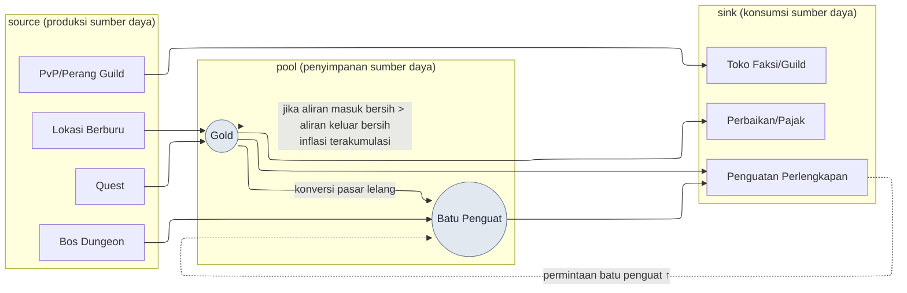

# 8.2 Memodelkan Ekonomi dengan Machinations — Menangkap Inflasi lewat Simulasi, Bukan Rapat

> Pembaca utama: System Designer / balance designer yang bertanggung jawab atas ekonomi live di MMORPG (tim skala menengah, 10\~50 orang)
> Versi ringkas untuk pembaca solo/hobi: §8.2.10 "Versi Ringkas Solo"

Yang pertama kali memberi tahu saya bahwa gold mulai bocor bukanlah tagihan, melainkan pasar lelang (Auction House). Pada bulan kedua setelah rilis, harga batu penguat (enhancement stone) diam-diam naik, dan sebulan kemudian sudah berlipat dua. Saya menjadwalkan rapat untuk mencari penyebabnya, tetapi yang keluar dari ruang rapat semuanya hanyalah "perasaan". Ada yang bilang imbalan dungeon baru terlalu besar, ada yang bilang itu karena efisiensi lokasi berburu meningkat, ada yang bilang sekadar karena jumlah pemain level tinggi bertambah. Semuanya terdengar masuk akal, dan justru karena itu tidak ada satu pun keputusan yang diambil. Kami menghabiskan satu jam membakar dugaan, lalu berakhir dengan "ya sudah, minggu depan kita lihat datanya lagi".

Masalahnya terletak pada kenyataan bahwa sumber daya bukan hanya satu jenis. Gold, batu penguat, reputasi, kehormatan, dan batu jiwa masing-masing punya source (jalan masuk) dan sink (jalan keluar), dan jalan-jalan itu saling memberi makan. Bos yang menjatuhkan batu penguat juga menjatuhkan gold. Perlengkapan yang dibeli dengan gold membakar batu penguat. Ketika 5 jenis sumber daya terjalin dalam puluhan aliran, kalkulator di kepala bahkan tidak bisa menghitung saldo satu minggu dari satu sumber daya saja secara jujur. Bab ini membahas cara memindahkan jalinan itu ke dalam **model node Machinations**, lalu meloloskan keputusan perubahan ekonomi bukan lewat tebakan rapat, melainkan lewat **gerbang simulasi**. Teori umum desain ekonomi sudah cukup dibahas di buku lain, jadi bab ini hanya berfokus pada *tempat di mana teori itu dijalankan dengan alur kerja AI*.

> **Catatan Operasional Nyata dari Penulis**
> Kasus dalam bab ini adalah versi yang dianonimkan dari dokumen pilot ekonomi (`Economy_Machinations_Pilot`) yang penulis operasikan di folder R&D perusahaan, beserta ruang kerja riset ekonominya. Jenis sumber daya, struktur source/sink, dan 4 tahap Pilot dipindahkan dengan setia dari operasi nyata, sementara nama internal perusahaan dan angka aktual diganti untuk keperluan buku atau ditulis hanya sebagai rasio atau arah. Isi keluaran AI adalah rekonstruksi dari sesi nyata.

---

## 8.2.1 Ekonomi Bukan '5 Jenis Sumber Daya', Melainkan 'Puluhan Aliran'

Jika ditulis dalam tabel, sumber daya ekonomi hanya lima baris sehingga terlihat sederhana. Jebakannya bukan pada sumber dayanya, melainkan pada jumlah **aliran** yang menghubungkan sumber daya itu.

| Sumber Daya | source (masuk) | sink (keluar) |
|---|---|---|
| Gold | berburu, imbalan quest, penjualan di pasar lelang | beli perlengkapan, penguatan, perbaikan, pajak |
| Batu Penguat | bos dungeon, event | penguatan perlengkapan, peleburan |
| Reputasi | side quest | toko faksi, perubahan job |
| Kehormatan | PvP, perang guild | toko PvP, fasilitas guild |
| Batu Jiwa | membunuh bos | kebangkitan karakter, pembelajaran skill |

Sumber dayanya 5 jenis, tetapi source dan sink jika digabung berjumlah dua puluh sekian, dan lebih dari itu, antar sumber daya saling dikonversi (pasar lelang yang membeli batu penguat dengan gold adalah sink gold sekaligus source batu penguat). Begitu aliran saling memberi makan, pertanyaan seperti "kalau gold dilepas 5% lebih banyak, harga batu penguat akan jadi bagaimana" tidak bisa terjawab hanya dengan melihat satu sumber daya saja. Inilah titik yang membedakan balance karakter (8.1) dengan balance ekonomi secara menentukan. Balance karakter ditutup dengan satu baris rumus, tetapi ekonomi adalah **sistem dinamis yang terakumulasi seiring waktu**, sehingga meskipun saldo satu minggu mendekati 0, jika diakumulasi selama 26 minggu, pasar lelang bisa runtuh.

Maka esensi pekerjaan ekonomi bukan "memilih angka dengan baik", melainkan **"melihat lewat simulasi bagaimana aliran terakumulasi seiring waktu"**. Dan pekerjaan menyusun serta merevisi model simulasi itu dengan tangan terasa membosankan, dan setiap kali dikerjakan selalu ada yang terlewat. Pekerjaan draf yang berulang dan mudah terlewat, tetapi peninjauannya harus dipegang erat oleh manusia — pekerjaan dengan tekstur seperti inilah tempat di mana garis pembagian kerja antara AI dan manusia tergambar paling rapi.

Pertama, saya muat di sini kerangka siklus ekonomi yang dibahas bab ini dalam satu gambar.



Garis putus-putus itulah inti bab ini. Sink penguatan menarik naik permintaan batu penguat sehingga mendorong harganya (`UP -.-> S`), dan ketika aliran masuk bersih gold melampaui aliran keluar bersih, kelebihan itu menumpuk di pool setiap minggu dan terakumulasi sebagai inflasi. Karena melacak dua garis putus-putus ini dengan hitungan tangan mustahil, dibutuhkan model.

---

## 8.2.2 Machinations — Alat untuk Memindahkan Ekonomi ke Graf Node

Machinations adalah alat untuk menggambar aliran ekonomi sebagai graf node dan menjalankan simulasi di atasnya. Inilah tempat memindahkan mermaid dari §8.2.1 menjadi model yang benar-benar bisa dijalankan.

| Node | Peran | Pada gambar di atas |
|---|---|---|
| Pool | Penyimpanan sumber daya | gold, batu penguat |
| Source | Produksi sumber daya | berburu, quest, bos |
| Drain | Konsumsi sumber daya | penguatan, perbaikan, toko |
| Converter | Konversi sumber daya | pasar lelang (gold→batu penguat) |
| Trigger | Pemicuan bersyarat | event, imbalan kenaikan tingkat |

Jika memodelkan ekonomi dengan node-node ini lalu menjalankan simulasi 1,000 kali, yang keluar bukan hasil tunggal, melainkan sebuah distribusi. Bentuknya seperti "setelah 26 minggu, median harga gold +X%, untuk pemain 10% teratas +Y%". Namun Machinations bukanlah alat serbaguna, dan pengadopsiannya sendiri adalah sebuah biaya.

| Batasan | Penanganan |
|---|---|
| Berjalan terpisah dari kode game sehingga sinkronisasi melenceng | Koreksi tiap bulan/kuartal dengan telemetry nyata (§8.2.6) |
| Keterbacaan runtuh saat graf node membesar | Pecah jadi subgraf per sumber daya, mulai dari satu sumber daya (§8.2.4) |
| Simulasi adalah model pemain yang disederhanakan | Koreksi dengan distribusi perilaku nyata, tetapkan ambang galat |
| Penafsiran hasil bergantung pada pengetahuan domain | Standarkan gerbang yang menyambung angka simulasi → keputusan (§8.2.5) |

Maka Machinations bukan alat yang diadopsi tanpa syarat. Ia sepadan dengan biayanya ketika tiga kondisi bertumpuk: **5 jenis sumber daya atau lebih + aliran konversi sumber daya + Live Ops (operasional game)**. Ekonomi sederhana dengan 2\~3 jenis sumber daya cukup ditangani Excel, dan dalam kasus itu, mengadopsi Machinations membuat beban operasional tiba lebih dulu daripada manfaatnya.

---

## 8.2.3 [Worked Transcript] Membuat Draf Model Sumber Daya Tunggal Gold dengan AI

Dengan penjelasan alat saja, kita tidak tahu apa yang sebenarnya dikeluarkannya. Saya akan mengikuti satu siklus pemindahan satu gold menjadi model Machinations sampai tuntas, dari prompt masukan hingga penolakan oleh manusia. Prompt masukan bisa langsung disalin dan dipakai, dan keluarannya adalah rekonstruksi dari sesi nyata.

### Langkah 1 — Masukan: Aliran Gold dalam Tabel yang Bisa Dibaca Mesin

Pertama, ekstrak source dan sink gold dari sheet data lalu jadikan tabel. Ini bukan menulis baru, melainkan mengekstrak.

```yaml
# gold_flows.yaml — aliran sumber daya tunggal gold (kutipan dari sheet data saat ini)
resource: gold
sources:
  - id: hunting        # drop di lokasi berburu
    trigger: per_kill
    note: kurva drop per rentang level mengikuti aturan reward_curve
  - id: quest_reward   # imbalan quest
    trigger: per_complete
  - id: market_sell    # penjualan di pasar lelang
    trigger: per_trade
sinks:
  - id: gear_buy       # beli perlengkapan
  - id: enhance        # biaya penguatan
  - id: repair         # perbaikan
  - id: tax            # pajak pasar lelang (sink sekaligus inti penarikan kembali gold)
# distribusi perilaku pemain (jumlah berburu per jam, tingkat penyelesaian quest) masih kosong → buat agar AI menandai jika berasumsi
```

### Langkah 2 — Prompt: Suruh Membuat Model, tetapi Paksa Asumsi dan Format

```
gold_flows.yaml terlampir berisi 3 source dan 4 sink dari sumber daya tunggal gold.
Buatlah draf spesifikasi node untuk memindahkan ini ke model Machinations.

Aturan:
1) Klasifikasikan tiap aliran berdasarkan jenis node (Source/Drain/Pool/Converter).
2) Usulkan rumus 'laju aliran ekspektasi per 1 pemain dengan basis 1 minggu' untuk
   tiap node, tetapi jika diperlukan asumsi perilaku pemain (jumlah berburu per jam,
   tingkat penyelesaian quest, dll.), nyatakan asumsi itu pada baris terpisah sebagai
   '★asumsi'. Jangan sembunyikan asumsi di dalam isi.
3) Pisahkan total aliran masuk source dan total aliran keluar sink, lalu hitung saldo
   bersih (net) 1 minggu.
4) Cerminkan bahwa pajak pasar lelang (tax) adalah satu-satunya sink yang menghapus gold
   secara permanen dari ekonomi, dan bedakan bahwa sink lain (penguatan, perbaikan) hanya
   memindahkan gold ke NPC, bukan penarikan kembali.
5) Asumsi yang 'tidak kamu yakini' tandai secara terpisah dengan ★ dan serahkan pada
   keputusan manusia.

Format keluaran: tabel (node | jenis | rumus laju 1 minggu | asumsi | tingkat keyakinan).
Dilarang menambah penjelasan lain.
```

Dalam prompt ini, yang justru ditulis panjang bukanlah instruksi untuk membuat model, melainkan aturan tentang di mana dan bagaimana asumsi harus ditulis. Dalam pemodelan ekonomi, jika AI dibiarkan bebas, ia akan memuntahkan angka yang terdengar masuk akal sambil menyembunyikan asumsinya. Akibatnya, meski modelnya salah, kita tidak bisa menunjuk *di mana letak salahnya*. **Menarik asumsi perilaku pemain keluar dari isi dan mendudukkannya pada baris terpisah** — di situlah seluruh bobot permintaan ini bertumpu. Asumsi harus terlihat agar bisa diverifikasi.

### Langkah 3 — Keluaran Claude (rekonstruksi, kutipan)

```
| node          | jenis     | rumus laju 1 minggu                                      | asumsi                       | keyakinan |
|---------------|-----------|---------------------------------------------------------|------------------------------|-----------|
| hunting       | Source    | bunuh/jam × drop rata-rata × jam main mingguan           | ★15h/minggu, 80 bunuh/jam    | sedang    |
| quest_reward  | Source    | jumlah quest harian × imbalan × 7 × tingkat penyelesaian | ★tingkat penyelesaian 0.7    | sedang    |
| market_sell   | Source    | (perpindahan antarpemain — bukan kenaikan bersih)        | kontribusi 0 ke ekonomi bersih | tinggi  |
| gear_buy      | Drain     | frekuensi beli × harga rata-rata                         | ★1.2 kali/minggu             | rendah    |
| enhance       | Drain     | percobaan penguatan × biaya per kali                     | ★8 kali/minggu               | sedang    |
| repair        | Drain     | waktu berburu × tingkat perbaikan                        |                              | tinggi    |
| tax           | Drain     | nilai transaksi × tarif (★satu-satunya sink penarikan permanen) | ★tarif 5%             | tinggi    |
| ── net        | net       | Σsource − Σsink ≈ +(positif dengan basis aktivitas menengah) | jika asumsi di atas dijumlah | ★rendah |

★Peringatan asumsi: market_sell adalah perpindahan gold antarpemain (pemain↔pemain) sehingga
berkontribusi 0 pada total ekonomi. Menambahkannya sebagai source akan menghitung inflasi
secara ganda. Perlu penanganan terpisah dalam model.
★Hal yang tidak diyakini: frekuensi gear_buy (1.2 kali/minggu) adalah tebakan. Tanpa telemetry
pembelian nyata, sink bisa diestimasi terlalu rendah/tinggi → perlu keputusan manusia.
```

Yang paling berharga dari keluaran ini bukanlah tabelnya, melainkan **dua baris paling bawah, "★Peringatan asumsi" dan "★Hal yang tidak diyakini"**. AI melaporkan sendiri kelemahan modelnya di dua tempat. Prompt yang baik membuat AI mengatakan "asumsi ini tidak bisa saya percaya".

### Langkah 4 — Verifikasi dan Penolakan (Tempat Manusia)

Keluaran ini tidak boleh langsung dimasukkan ke model. Salah satu dari dua ★ yang dilaporkan AI ternyata cacat yang benar-benar merusak model.

`market_sell` (penjualan di pasar lelang) awalnya diklasifikasikan AI sebagai Source. Padahal penjualan di pasar lelang adalah **perpindahan gold pemain A ke pemain B**, bukan gold yang baru tercipta di dalam ekonomi. Menambahkan ini ke aliran masuk source akan menghitung inflasi secara ganda. AI memang menandainya sendiri lewat ★Peringatan asumsi, tetapi di isi tabel ia tetap membiarkannya di kolom Source — sebuah keluaran yang hanya separuh benar: dilaporkan, tetapi tidak dikeluarkan dari model. Ini juga sekaligus cacat data dari pihak manusia, karena di yaml masukan sifat `market_sell` (perpindahan antarpemain vs penciptaan baru) tidak dinyatakan.

Maka saya meminta ulang.

```
market_sell adalah perpindahan gold antarpemain (pemain↔pemain) sehingga bukan source bagi
total ekonomi (perbaikan kelalaian masukan). Keluarkan node ini dari penjumlahan source, dan
sebagai gantinya cerminkan dalam model hanya sebagai 'pajak pasar lelang (tax) yang menarik
kembali sebagian dari nilai perpindahan secara permanen sebagai sink'. Hitung ulang saldo
bersih, dan tunjukkan dalam satu baris dampak pengeluaran market_sell terhadap net.
```

AI menjawab ulang dengan model yang mengeluarkan `market_sell` dari source dan menyisakan hanya pajak sebagai sink. Hasilnya, saldo bersih (net) menjadi lebih rendah dari estimasi awal — terungkap bahwa ketika penjualan di pasar lelang salah dimasukkan sebagai source, kita sedang menaksir inflasi secara berlebihan. **Satu kali putaran bolak-balik inilah intinya.** Jika manusia menyusunnya sendiri dengan tangan dari awal, butuh setengah hari dan sulit menangkap sendiri kesalahan klasifikasi node, tetapi dengan draf AI + paksaan "nyatakan asumsi" + satu kali penolakan, prosesnya selesai dalam waktu kurang dari satu jam, dan berkat struktur di mana manusia memutuskan ★ yang dilaporkan AI, cacat seperti penghitungan ganda tertangkap sebelum masuk ke model (perkiraan penulis — waktu yang dihemat berbeda-beda menurut tim dan jumlah sumber daya, jadi lebih tepat dibaca sebagai perbedaan struktur antara "dari awal dengan tangan" dan "draf + tinjauan" ketimbang sebagai nilai absolut).

---

## 8.2.4 Satu Sumber Daya pada Satu Waktu — Diperkenalkan lewat 4 Tahap Pilot

Selesainya satu model gold tidak berarti kita boleh memodelkan seluruh sumber daya sekaligus. Operasi penulis pun tidak memasukkan keseluruhan sekaligus. Saya menempuh 4 tahap yang dimulai dari sumber daya tunggal, melewati verifikasi dan koreksi, lalu memperluas.

| Tahap | Cakupan | Gerbang inti |
|---|---|---|
| 1. Pemodelan sumber daya tunggal (gold) | source 3·sink 4, sesi §8.2.3 | klasifikasi node·penyataan asumsi |
| 2. Bandingkan simulasi vs nyata | net 1 minggu simulasi vs telemetry 1 minggu | lolos ambang galat atau tidak |
| 3. Koreksi presisi model | cerminkan distribusi perilaku pemain (aktivitas rendah/menengah/tinggi) | ukur ulang galat per segmen |
| 4. Perluasan sumber daya (5 jenis) | tambahkan tahap batu penguat·reputasi·kehormatan·batu jiwa | verifikasi aliran konversi (pasar lelang) |

Verifikasi perbandingan di tahap 2 adalah jantung dari 4 tahap ini. Jika simulasi dan kenyataan melenceng, yang salah bukan game-nya, melainkan model-nya. Membuat keputusan dengan model yang melenceng akan mengembalikan keputusan itu sebagai insiden di live. Maka perluasan (tahap 4) selalu dilakukan hanya setelah lolos verifikasi tahap 2 dan 3. Jika urutan ini rusak, yakni melewati verifikasi sumber daya tunggal dan memasukkan 5 jenis sekaligus, kita bahkan tidak bisa memisahkan dan menunjuk model sumber daya mana yang salah.

---

## 8.2.5 Gerbang Simulasi — Memasang Penghalang pada Keputusan Perubahan Ekonomi

Begitu model lolos verifikasi, kini di depan setiap keputusan perubahan yang berdampak pada ekonomi kita pasang **gerbang simulasi**. Inilah tempat mengubah keputusan yang dulu diloloskan lewat "perasaan" di rapat menjadi keputusan yang lolos lewat simulasi.

| Jenis Keputusan | Kewajiban Simulasi |
|---|---|
| Penambahan source·sink baru | Wajib |
| Perubahan rasio konversi sumber daya (kurs pasar lelang dll.) | Wajib |
| Desain imbalan dungeon·event baru | Wajib |
| Perubahan harga (±10% atau lebih) | Wajib |
| Verifikasi efisiensi job baru | Wajib |
| Perubahan UI dll. yang tak terkait ekonomi | Dikecualikan |

Untuk melihat bagaimana gerbang ini benar-benar bekerja, saya akan meloloskan satu keputusan di atas model gold yang sudah diverifikasi di §8.2.3.

> **[Gerbang Simulasi — Keputusan Imbalan Event] (rekonstruksi format nyata)**
>
> ```
> [Usulan Perubahan]   Event akhir pekan: imbalan login harian +500 gold
> [Gerbang]            penambahan source baru → simulasi wajib
> [Hasil Simulasi 1000 kali]
>   - Saldo bersih gold 1 minggu: +6,900 → +10,400 (+50%)
>   - Setelah akumulasi 26 minggu, median harga gold ~+28% (peringatan inflasi: melampaui ±10%)
>   - Pemain aktif 10% teratas: ~+41% (deviasi segmen besar)
> [Putusan]            FAIL — melampaui rentang stabil (±10%/jangka panjang)
> [Usulan Koreksi]     Pasangkan sink bersamaan pada source event: toko khusus event (penarikan kembali gold)
>                      simulasi ulang → akumulasi 26 minggu +9% (PASS)
> ```

Nilai gerbang ini ada pada dua baris terakhir. Seandainya keputusan "ayo kita lepas imbalan +500" adalah tebakan rapat, keputusan itu akan lolos dengan "sepertinya tidak apa-apa". Gerbang simulasi mengonversi keputusan itu menjadi inflasi +28% pada 26 minggu lalu menunjukkannya, dan bahkan memaksa koreksi berupa **kalau mau menambah source, pasang sink bersamanya**. Memutuskan perubahan ekonomi bukan lewat tebakan, melainkan lewat lolos/gagal simulasi — inilah keseluruhan dari gerbang ini.

Di sini saya tunjuk satu jebakan yang sering terjadi. Deviasi segmen. Meskipun +28% dengan basis pemain aktivitas menengah, untuk 10% teratas angkanya +41%. Karena lapisan pemain yang paling banyak menghasilkan gold-lah yang paling cepat mengakumulasi inflasi, simulasi tidak boleh hanya melihat rata-rata, melainkan harus dijalankan per segmen. Jika hanya melihat rata-rata, kita melewatkan keruntuhan harga yang dipicu pemain aktivitas tinggi.

---

## 8.2.6 Model Berevolusi Setiap Bulan lewat Telemetry Setelah Rilis

Agar gerbang simulasi dipercaya, model tidak boleh melenceng dari game yang sebenarnya. Karena game berubah setiap minggu, model pun harus dikoreksi mengikutinya. Setelah rilis, model diperiksa dengan telemetry nyata setiap bulan (pada periode dengan sedikit perubahan, setiap kuartal).

```
Siklus koreksi model (bulanan)
─────────────────────────────────
1. Ekstrak telemetry pemain nyata sebanyak 1 bulan (agregasi aliran per sumber daya)
2. Hitung laju aliran source·sink terukur per segmen (aktivitas rendah/menengah/tinggi)
3. Bandingkan dengan simulasi Machinations per item
4. Item dengan galat >15% = sesuaikan parameter model (★asumsi item itu ternyata salah)
5. Setelah penyesuaian, simulasi ulang → gunakan sebagai model acuan gerbang bulan berikutnya
```

Intinya nomor 4. Item dengan galat besar adalah sinyal bahwa "asumsi yang tidak diyakini" yang dilaporkan AI dengan ★ di §8.2.3 ternyata melenceng dari kenyataan. Misalnya, jika frekuensi `gear_buy` yang ditebak AI (1.2 kali/minggu) ternyata terukur 2 kali/minggu, asumsi itu diganti dengan nilai telemetry. Jika koreksi ini dihentikan, model perlahan menjauh dari game, dan suatu kuartal gerbang simulasi akan menyebabkan insiden "diloloskan, tetapi nyatanya inflasi datang". Pada saat itu, kepercayaan terhadap simulasi itu sendiri runtuh belakangan. Koreksi bukanlah pekerjaan sampingan operasional, melainkan siklus reguler yang membuat gerbang tetap hidup.

---

## 8.2.7 Penerapan Progresif — Deteksi Pola Anomali·Ruang Perubahan·Paralelisasi Simulasi

Sampai di sini adalah 'penerapan konservatif' dari pemodelan ekonomi. Manusia mengusulkan perubahan, memverifikasinya dengan model, dan memutuskan berdasarkan hasil. Jika maju satu langkah, tiga sumbu penerapan progresif yang kita lihat di 8.1.6 — deteksi z-score · pendefinisian ruang perubahan · paralelisasi simulasi — terbuka secara sama persis di atas infrastruktur ekonomi ini juga.

**Pertama, deteksi pola anomali.** Alih-alih manusia melakukan perbandingan galat dari siklus koreksi bulanan (§8.2.6) dengan mata, kode lebih dulu memilih dan mengangkat item yang deviasi model-terukurnya melampaui ambang. Kita tahu harga batu penguat berlipat dua bukan dengan melihat pasar lelang, melainkan sebuah alert "laju aliran source batu penguat menyimpang +30% dari model" tiba sebelum rapat.

**Kedua, pendefinisian ruang perubahan.** Bukan dikotomi "lepas/jangan lepas imbalan +500", melainkan jika kita mendefinisikan rentang imbalan (0\~+1000) dan rentang sink bersamaan sebagai ruang perubahan, kita bisa menjelajahi kombinasi yang memenuhi inflasi ±10% di dalam ruang itu. Manusia menentukan "dari mana sampai mana", dan penjelajahan kombinasi optimal di dalamnya diotomatiskan.

**Ketiga, paralelisasi simulasi.** Alih-alih menjalankan satu usulan perubahan 1,000 kali, jalankan puluhan kandidat di dalam ruang perubahan secara paralel masing-masing 1,000 kali, lalu bandingkan distribusinya sekaligus. Tempat yang dulu memperdebatkan satu usulan demi satu di ruang rapat berubah menjadi perbandingan hasil simulasi dari matriks kandidat.

Gagasan bersamanya adalah memindahkan tempat di mana manusia dulu *mengusulkan* perubahan menjadi tempat di mana kode *menjelajahi* ruang perubahan. Namun, ini adalah cerita setelah penerapan konservatif (§8.2.3\~8.2.6) berjalan stabil dan model terverifikasi dengan telemetry. Jika menjelajahi ruang perubahan secara otomatis dengan model yang belum diverifikasi, model yang salah akan menyodorkan nilai optimal yang salah dengan penuh percaya diri.

> **[Penerapan Radikal — Mengompresi Ekonomi Menjadi 'Vektor Dimensi' untuk Dijelajahi] (masih terlalu dini)**
>
> Ini adalah wilayah yang melangkah satu kaki lebih jauh dari penerapan progresif. Mohon dibaca sebagai tren riset, bukan sebagai pernyataan pasti (jika vektor dimensi·embedding baru pertama kali Anda dengar, akan lebih mudah membaca bagian di bawah ini setelah melihat lebih dulu satu 'peta' di Lampiran M — kelima 'rambu arah' buku ini semuanya berputar di atas gambar itu). Model ekonomi yang sudah sampai di sini adalah sistem berkompleksitas tinggi dengan 5 jenis sumber daya yang terjalin dalam puluhan aliran, dan penjelajahan ruang perubahan di §8.2.7 pun pada akhirnya adalah cara menangkap puluhan aliran itu satu per satu sebagai parameter lalu menjalankannya. Gagasan radikalnya adalah **mengompresi kompleksitas itu sendiri menjadi vektor dimensi**, lalu mencari solusi di atas ruang terkompresi itu.
>
> Satu analogi yang tampak jauh menjadi petunjuk. Resep masakan, yang lazim dianggap wilayah kualitatif dan sulit dipegang, dalam sebuah riset (Epicure — Radzikowski·Chen, 2026, arXiv:2605.22391 · demo epicure.kaikaku.ai) disaring dari 4,14 juta resep dari 11 sumber menjadi 1,790 jenis bahan standar, lalu hubungan antarbahan dikompresi menjadi vektor ratusan dimensi. Intinya, objek kualitatif bernama "rasa" pun, jika hubungan antarbahan dikonversi menjadi koordinat, membuat resep yang serupa berkumpul berdekatan di ruang vektor, dan di antaranya bisa diinterpolasi untuk menjelajahi kombinasi baru — Epicure pun menunjukkan penjelajahan interpolasi yang memutar satu bahan ke arah suatu wilayah masakan tertentu di ruang terkompresi ini untuk mencari bahan padanannya.
>
> Prinsip ekonomi pun sama. Jika kita merepresentasikan keadaan ekonomi sebagai vektor yang menempatkan source·sink·aliran konversi masing-masing sebagai satu dimensi, maka "ekonomi yang stabil dalam inflasi ±10%" tertangkap sebagai satu wilayah di ruang itu. Lalu, alih-alih meloloskan usulan perubahan ke simulasi satu per satu, terbuka jalan untuk menjelajahi solusi secara langsung di dalam/dekat wilayah stabil itu. Inilah kemungkinan bahwa simulasi paralel §8.2.7 yang dulu menjalankan kandidat satu per satu untuk dibandingkan dapat dipersempit menjadi satu kali penjelajahan di atas ruang terkompresi.
>
> Mengapa "masih terlalu dini"? Pertama, pekerjaan menentukan apa yang dijadikan dimensi (aliran mana yang independen dan mana yang dependen) itu sendiri adalah teka-teki domain yang sulit. Kedua, kompresi pada hakikatnya adalah membuang informasi, sehingga insiden live bisa meledak pada dimensi yang dibuang. Ketiga, semua ini hanya bermakna ketika verifikasi telemetry penerapan konservatif (§8.2.6) sudah kokoh — jika model sebelum kompresi sudah melenceng dari game, kompresi hanya akan mengompresi galat itu dengan rapi pula. Maka bagian ini bukanlah resep, melainkan **rambu arah**. Yang harus dilakukan sekarang adalah menjalankan penerapan konservatif secara jujur, sementara vektor dimensi dibiarkan sebagai wilayah riset yang baru akan ditengok beberapa tahun lagi oleh tim yang sudah cukup menumpuk fondasinya.

---

## 8.2.8 Pengukuran — Tempat di Mana Rapat Berubah Menjadi Simulasi

Saya membandingkan kondisi sebelum dan sesudah pengadopsian alat. Waktu dan frekuensi di bawah memuat arah yang dirasakan dari operasi tahap awal pengadopsian, jadi alih-alih dibaca sebagai nilai absolut yang presisi, lebih tepat dibaca dari ke arah mana ia bergerak.

| Item | Sebelum (rapat·hitung tangan) | Sesudah (gerbang simulasi) |
|---|---|---|
| Keputusan perubahan ekonomi → penerapan | 2\~4 minggu (tebakan·perdebatan ulang berulang) | 1\~3 hari (1 kali verifikasi simulasi) |
| Insiden inflasi | 1\~2 kasus per kuartal (ketahuan belakangan) | 0\~1 kasus per kuartal (dicegah gerbang lebih awal) |
| Frekuensi penambahan source·sink | 1\~2 kali per kuartal (konservatif karena takut) | 1\~2 kali per bulan (simulasi menjamin keamanan) |
| Frekuensi rapat ekonomi | 3\~4 kali per minggu | 1\~2 kali per minggu |

Makna baris terakhir lebih besar daripada angka-angka di tabel. Berkurangnya frekuensi rapat terjadi karena simulasi menggantikan perdebatan. Ketika "menurut saya sepertinya inflasi akan datang pada batu penguat" berubah menjadi "hasil simulasi +28% pada 26 minggu", tempat yang dulu memperdebatkan tebakan selama satu jam berakhir sebagai berbagi hasil selama 5 menit. Ini persis di tempat yang sama dengan konsep yang dikunci jadi aturan dalam retrospektif sistem penulis (atom `automation_signal_value_over_time_savings` — nilai otomasi bukanlah penghematan waktu, melainkan pemaparan sinyal). Hasil sejati dari gerbang simulasi bukanlah waktu yang dihemat, melainkan membuat angka menempati tempat yang dulu ditempati tebakan di rapat.

Namun satu hal saya letakkan dengan jujur. "1\~2 kasus → 0\~1 kasus per kuartal" di tabel bukanlah nilai pengukuran presisi, melainkan arah yang dirasakan dari operasi. Karena hitungan insiden inflasi berubah-ubah tergantung definisi (harga ±berapa % dianggap insiden), lebih tepat dibaca sebagai perubahan struktur "bergeser dari ketahuan belakangan menjadi dicegah lebih awal" ketimbang sebagai jumlah absolut.

---

## 8.2.9 Kegagalan yang Umum

| Pola | Mengapa gagal | Penanganan |
|---|---|---|
| Memodelkan seluruh sumber daya sekaligus | Tak bisa memisahkan model sumber daya mana yang salah | Mulai dari Pilot sumber daya tunggal (§8.2.4) |
| Menerima asumsi model AI tanpa tinjauan | Cacat seperti penghitungan ganda pasar lelang masuk apa adanya | Paksa penyataan asumsi + penolakan manusia (§8.2.3) |
| Perubahan ekonomi tanpa gerbang simulasi | Biaya pemulihan inflasi belakangan sangat besar | Definisikan item simulasi wajib (§8.2.5) |
| Hanya simulasi rata-rata, abaikan segmen | Melewatkan keruntuhan harga yang dipicu pemain aktivitas tinggi | Simulasi per segmen (§8.2.5) |
| Tak melakukan koreksi telemetry setelah rilis | Model menjauh dari game sehingga kepercayaan gerbang runtuh | Siklus koreksi bulan/kuartal (§8.2.6) |
| Penjelajahan otomatis ruang perubahan dengan model yang belum diverifikasi | Model yang salah menyodorkan nilai optimal yang salah dengan percaya diri | Maju ke progresif setelah penerapan konservatif stabil (§8.2.7) |

Yang kedua paling sering terlewat. Seperti penghitungan ganda pasar lelang yang kita lihat di §8.2.3, AI memuntahkan model yang terdengar masuk akal dengan percaya diri, tetapi kelemahan asumsinya sendiri hanya ia laporkan dengan ★ sementara cacatnya ia tinggalkan di dalam isi. Jika manusia tidak memutuskan ★ itu, model yang salah akan lolos dan semua keputusan simulasi di atasnya ikut salah.

---

## 8.2.10 Coba Sendiri — Satu Langkah yang Bisa Dilakukan Hari Ini

> **Versi Ringkas Solo**: Tidak perlu Machinations maupun telemetry. Pilihlah satu sumber daya dari game Anda sendiri (atau game yang Anda sukai), tulis source·sink-nya di kertas, lalu tempelkan apa adanya prompt dari §8.2.3 untuk menerima draf model saldo bersih 1 minggu. Jika Anda memilih satu asumsi yang dinyatakan AI dengan ★ lalu membantahnya dengan "asumsi ini tidak bisa saya percaya, ajukan dasarnya lagi", Anda akan merasakan secara langsung bahwa model ekonomi itu adalah seikat asumsi-asumsi — dan bagaimana kesimpulannya bisa terbalik kalau satu asumsi itu salah.

Jika Anda dalam tim, mulailah dengan satu langkah berikut. Bukan seluruh sumber daya, melainkan pilih **satu sumber daya yang paling bermasalah** (biasanya gold atau batu penguat), susun lebih dulu hanya model sumber daya tunggal dari §8.2.3, lalu lewatkan satu jenis keputusan perubahan ekonomi (misalnya imbalan event) melalui gerbang simulasi dari §8.2.5. Hanya dengan satu sumber daya + satu jenis keputusan pun, Anda bisa mengubah tempat yang dulu memperdebatkan tebakan di rapat menjadi satu baris angka.

Jika diringkas menjadi setup → prompt → verify — **setup**: ekstrak source·sink dari satu sumber daya bermasalah ke dalam yaml. **prompt**: terima draf model node dalam format §8.2.3, tetapi paksa agar asumsi perilaku pemain dinyatakan dengan ★. **verify**: manusia secara langsung menolak·meminta ulang asumsi ★ yang dilaporkan AI dan klasifikasi node (terutama perpindahan antarpemain vs penciptaan baru).

---

### Poin-Poin Penting
- Ekonomi bukan 5 jenis sumber daya, melainkan puluhan aliran yang terakumulasi seiring waktu, sehingga simulasi diperlukan.
- Draf model AI dipaksa untuk menyatakan asumsi, lalu asumsi itu ditolak oleh manusia.
- Perubahan ekonomi diputuskan bukan lewat tebakan rapat, melainkan lewat lolos/gagal gerbang simulasi.

### Pratinjau Bab Berikutnya
- 8.3 Damage Simulator (2008\~) — bagaimana alat simulasi berusia 18 tahun didaur ulang di era AI
