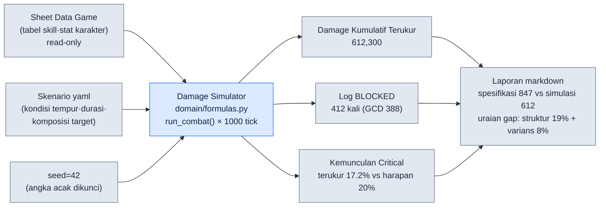

# 8.3 Damage Simulator — Hari Ketika DPS Spesifikasi dan Hasil Simulasi Berpisah

Suatu dini hari di tahun 2008, saya berkali-kali memeriksa ulang angka yang sama sebanyak tiga kali di depan satu lembar Excel. Dalam dokumen desain tertulis bahwa damage per detik dari sebuah karakter pedang adalah **847**. Namun simulator yang saya jalankan pertama kali hari itu memuntahkan **612** untuk karakter yang sama dengan spesifikasi yang sama. Selisih 27%. Salah satu dari keduanya berbohong, dan saat itu saya belum tahu yang mana yang berbohong.

DPS dalam spesifikasi adalah janji di atas kertas. Hasil aritmetika dari damage satu kali skill dikalikan frekuensi pemicunya. DPS dalam simulator adalah hasil dari benar-benar mengayunkan janji itu sebanyak 1,000 kali. Cooldown saling bertumpang tindih, gerakan cast memakan waktu, dan critical hit tidak meledak sebanyak nilai harapannya — gesekan yang tidak diketahui kertas pun menyusup. Celah 27% inilah justru tempat seorang perancang balance mencari nafkah. Kalau Anda memercayai kertas, Anda akan menangis setelah peluncuran.

Bab ini adalah kisah tentang satu alat itu. Damage Simulator yang saya buat pada 2008 dan tidak pernah saya lepas dari tangan sampai sekarang. Saya akan menelusuri, lewat satu worked transcript (rekaman sesi nyata), bagaimana titik persis di mana spesifikasi dan hasil berpisah itu dilacak, lalu bagaimana 18 tahun kemudian AI saya tempelkan ke pelacakan tersebut.

---

## 8.3.1 Mengapa DPS Spesifikasi Selalu Berbohong

Pertama, mari kita bedah jati diri 612 versus 847 itu. Perancang junior yang menulis spesifikasi (selanjutnya disebut anggota tim A) tidak melakukan kesalahan. Ia mengalikan persis seperti yang tertulis di tabel skill.

Perhitungan DPS dalam spesifikasi terlihat seperti ini. Anggaplah sebuah karakter memiliki tiga skill.

| Skill | Damage Tunggal | Cooldown | Cast Time |
|---|---|---|---|
| Tebasan Horizontal | 320 | 3.0s | 0.6s |
| Tusukan | 540 | 6.0s | 0.9s |
| Basic Attack | 180 | 1.2s | 0.4s |

Perhitungan spesifikasi anggota tim A berdiri di atas asumsi ideal bahwa "setiap skill digunakan tanpa terlewat begitu cooldown selesai". Tebasan Horizontal memberi 320 setiap 3 detik, Tusukan 540 setiap 6 detik, dan Basic Attack mengisi waktu yang kosong. Secara aritmetika, hasilnya keluar bersih 847. Di atas kertas, karakter itu seolah punya banyak tangan sehingga gerakan cast tidak saling menghalangi.

Alasan simulator menghasilkan 612 hanya satu: karena tangannya cuma satu. Selama mengeluarkan Tusukan yang berdurasi 0.9 detik, walaupun cooldown Tebasan Horizontal sudah pulih, ia tetap tak bisa dipakai. **Tabrakan global cooldown** ketika gerakan cast saling memakan ini tidak ada dalam spesifikasi. Kertas adalah ruang hampa tanpa gesekan, sedangkan simulasi adalah medan tempur yang penuh gesekan. Kebenaran pertama yang saya pelajari selama 24 tahun mengerjakan pekerjaan ini adalah ini — DPS spesifikasi itu batas atas, bukan nilai terukur. Dan pengguna memainkan game bukan dengan batas atas, melainkan dengan nilai terukur.

---

## 8.3.2 Worked Transcript — Mendesak AI Soal Asal-Usul 612

Saya yang di tahun 2008 menambal celah 27% ini secara manual. Saya membaca log simulasi baris demi baris dengan mata, menghitung pada frame mana skill terhalang. Butuh setengah hari. Sekarang, 18 tahun berlalu, saya melempar log yang sama kepada Claude. Berikut adalah transkrip lengkap dari satu sesi yang benar-benar saya jalankan. Tanpa diringkas, dan saya muat apa adanya termasuk percobaan pertama yang melenceng — sebab melencengnya itu adalah separuh dari cara menggunakan alat ini.

Prompt yang saya lempar berbunyi begini.

> Yang terlampir adalah sebagian log pertarungan 1,000 tick untuk satu karakter dari Damage Simulator kami (`damage_sim/`, Python). Menurut spesifikasi, DPS karakter ini adalah 847, tetapi hasil simulasi keluar 612. Cari penyebab gap 27% itu di dalam log. Format log adalah `[tick] event skill=SKILL state=STATE`. Jangan menebak, sebutkan hanya bukti yang ada di log. Kalau buktinya kurang, katakan bahwa buktinya kurang.
>
> ```
> [0.0] cast skill=Tusukan state=START
> [0.9] cast skill=Tusukan state=HIT dmg=540
> [0.9] cast skill=Tebasan Horizontal state=BLOCKED reason=GCD
> [1.5] cast skill=Basic Attack state=HIT dmg=180
> [1.9] cast skill=Basic Attack state=BLOCKED reason=GCD
> [3.0] cast skill=Tebasan Horizontal state=HIT dmg=320
> [3.6] cast skill=Basic Attack state=HIT dmg=180
> ... (994 lines omitted)
> [997.2] cast skill=Tusukan state=HIT dmg=540
> ```

Keluaran mentah (raw output) dari Claude berbunyi begini (tidak dipoles).

> Fakta yang terkonfirmasi dari log:
>
> 1. Event `state=BLOCKED reason=GCD` muncul berulang kali. Pada `[0.9]` Tebasan Horizontal, dan pada `[1.9]` Basic Attack, terhalang oleh GCD (global cooldown).
> 2. Sebelum cast Tusukan (0.0→0.9, 0.9 detik) selesai, skill lain tidak bisa terpicu. Tampaknya strukturnya membuat cast time menduduki GCD.
> 3. Karena itu, asumsi dalam spesifikasi yaitu "memicu setiap skill setiap cooldown" menjadi runtuh. Pada praktiknya, gerakan cast saling bertabrakan sehingga sebagian pemicuan terlewat.
>
> Hanya saja, log yang diberikan baru 7 baris dari 1,000 baris. **Apakah gap tepat 27% itu bisa dijelaskan hanya dengan tabrakan GCD tidak dapat dipastikan dengan 7 baris ini.** Untuk memverifikasi 27%, perlu dihitung total kemunculan event BLOCKED dan total damage yang terlewat akibatnya. Jika Anda memberikan agregat BLOCKED dari seluruh log, saya akan memverifikasinya secara kuantitatif.

Berhentinya di sini itu penting. AI **menunjuk** penyebabnya, tetapi tidak **membuktikan** angka 27%, dan ia sendiri menyebutkan batas itu. Di tempat yang seorang perancang-di-atas-kertas akan menutup rapat dengan "Oh, gara-gara GCD ya", alat ini bertahan dengan "dengan 7 baris saya tidak tahu". Saya menilai tuntutan itu wajar — inilah verifikasi manusia. Maka saya menarik agregat BLOCKED dari seluruh log dan melemparkannya lagi.

> Ini agregat seluruh 1,000 tick. BLOCKED total 412 kali, di antaranya 388 karena alasan GCD, 24 karena cooldown belum terisi. Estimasi damage yang terlewat akibat BLOCKED, dikonversi ke Tebasan Horizontal, sekitar 19,800. Selama total 1,000 tick pertarungan (= detik), damage harapan menurut spesifikasi adalah 847,000, sedangkan damage kumulatif terukur dari simulasi adalah 612,300. Tinjau ulang gap 27% dengan angka-angka ini.

Keluaran kedua dari Claude.

> Saya verifikasi dengan agregat.
>
> - Harapan kumulatif spesifikasi: 847,000
> - Terukur kumulatif simulasi: 612,300
> - Gap: 234,700 (27.7%)
>
> Komposisi gap ini:
> - Terlewat langsung akibat tabrakan GCD (388 kali): estimasi sekitar 19,800 itu adalah konversi ke Tebasan Horizontal, tetapi perlu juga ditambahkan biaya peluang dari skill berdamage lebih tinggi yang seharusnya bisa masuk ke slot yang terlewat. Jika slot yang terlewat dikonversi ke damage rata-rata, bagian yang terlewat menjadi lebih besar dari 19,800.
> - Namun seluruh 234,700 tidak dapat dijelaskan hanya dengan BLOCKED. **Interpretasi sisa gap akan berbeda tergantung apakah spesifikasi 847 itu nilai yang "sudah memasukkan nilai harapan critical sebagai rata-rata" atau "nilai dasar tanpa critical".** Jika Anda memberi tahu asumsi critical dari spesifikasi 847, saya akan menguraikan sisa gap-nya.

Ia berhenti lagi. Dan lagi-lagi berhenti tepat di tempat yang benar. Bagaimana spesifikasi 847 memperhitungkan critical — ini informasi yang tidak ada di log, dan hanya ada di kepala anggota tim A. AI mengetahui batas data yang dimilikinya. Ketika saya periksa, ternyata spesifikasi 847 adalah nilai yang sudah diratakan dengan memasukkan harapan critical pada peluang 20% dan 1.5x, sedangkan simulasi adalah satu kali ronde di mana jumlah kemunculan critical sesungguhnya keluar lebih rendah dari nilai harapan setelah seed dikunci. Artinya, gap 27% adalah nilai campuran dari **tabrakan GCD (struktural, tereproduksi)** dan **varians critical (statistik, keberuntungan ronde ini saja)**.

Penguraian inilah kesimpulannya. Bagian tabrakan GCD adalah masalah nyata yang harus diperbaiki lewat desain, sedangkan bagian varians critical adalah noise yang akan lenyap jika seed diganti dan diambil rata-rata 1,000 ronde. Kalau keduanya dicampur lalu diberi buff dengan dalih "karakternya lemah", maka karakter yang sebenarnya baik-baik saja pada rata-rata 1,000 ronde justru jadi terlalu kuat. Yang membuat pembedaan ini — yang tidak diketahui kertas, tidak diketahui satu ronde simulasi, dan **tidak diketahui AI sendirian pun** — adalah verifikasi manusia yang menyodorkan agregat log dan asumsi tersembunyi dari spesifikasi.

---

## 8.3.3 Satu Set Input Menjadi Satu Set Output — Membedah Simulasi

Mari kita bentangkan input dan output alat yang baru saja diintip sesi tadi dalam satu set. Pada akhirnya, simulator adalah fungsi yang jujur. Input yang sama menghasilkan output yang sama. Input berkumpul dari tiga jalur.



Inti gambar ini adalah bahwa panahnya searah. Sheet data game **hanya dibaca** oleh simulator. Simulasi tidak pernah mengubah datanya. Aturan yang paling banyak mencegah kecelakaan selama 18 tahun adalah arah satu panah ini. Begitu simulasi mulai menyalin data ke dalam dirinya sendiri, maka pada hari setelah data game berubah, simulasi akan menyimulasikan dunia kemarin. Kalau rapat digelar berdasarkan laporan yang keluar dari situ, seluruh rapat akan berdebat soal dunia kemarin.

Satu set input yang konkret (skenario yaml) terlihat seperti ini.

```yaml
# scenarios/single_dps_check.yaml
scenario: single_target_dps
duration_ticks: 1000      # asumsi 1 tick = 0.1s, pertarungan 100 detik
seed: 42                  # deterministik — input sama output sama
actor:
  char_id: K_004          # dibaca dari sheet data game
  skill_rotation: optimal # saat tabrakan GCD, prioritaskan damage harapan tertinggi
target:
  defense: 1200
  hp: infinite            # dummy HP tak terbatas untuk mengukur DPS
report:
  compare_to_spec: 847    # masukkan DPS spesifikasi untuk uraian gap otomatis
```

Dan satu set output (kutipan laporan) seperti ini.

```markdown
# Damage Simulator Report — K_004 single DPS
input: scenarios/single_dps_check.yaml | seed=42 | data rev. 2026-06-05

## Terhadap Spesifikasi
- DPS spesifikasi:    847   (sudah meratakan harapan critical 20%·1.5x)
- DPS terukur simulasi: 612 (1 ronde seed ini)
- Gap:                -27.7%

## Uraian Gap
- Struktural (tabrakan GCD, tereproduksi):  -19.2%  ← objek tinjauan desain
- Statistik (varians critical, ronde ini):  -8.5%   ← diperkirakan hilang saat rata-rata 1000 ronde

## Verifikasi Reproduksi
- seed=42 dijalankan ulang 3 kali → 612,300 / 612,300 / 612,300 (cocok)
- rata-rata DPS 1000 ronde seed 0~999 → 731 (setelah varians critical dihilangkan)
```

Lihat baris terakhir. Rata-rata dari menjalankan 1,000 ronde dengan seed 0\~999 adalah 731. Gap 116 (13.7%) antara spesifikasi 847 dan rata-rata 1,000 ronde 731 itulah ukuran dari **masalah struktur sungguhan** bernama tabrakan GCD. Bukan 612 dari satu ronde, melainkan 731 inilah yang seharusnya menjadi input rapat desain. Bukan 847 di atas kertas, bukan pula 612 dari satu ronde yang sial, tapi 731 yang disepakati 1,000 ronde. Menggenggam angka ini di tangan adalah pekerjaan seorang perancang balance.

---

## 8.3.4 Tangan Tahun 2008 dan Tangan Tahun 2026

Alat ini telah hidup 18 tahun, tetapi bukan hidup dengan kode yang sama. Gantungan bajunya saya biarkan tetap, hanya bajunya yang saya ganti lima kali. Gantungan baju itu adalah logika laporan di atas — prosedur melihat spesifikasi dan hasil terukur secara terpisah, menguraikan gap menjadi struktur dan varians, lalu memverifikasi dengan reproduksi. Prosedur ini sama persis kata demi kata, baik di Excel VBA (bahasa makro Excel) tahun 2008 maupun di Python tahun 2026.

| Periode | Baju (teknologi) | Gantungan Baju (prosedur yang tak berubah) |
|---|---|---|
| 2008\~2011 | Excel VBA, 1:1 | uraian gap terhadap spesifikasi |
| 2012\~2016 | C# console, N:N | 〃 |
| 2017\~2020 | Python + Web | 〃 |
| 2021\~2024 | Python + ML | 〃 (+ refleksi distribusi pengguna) |
| 2025\~ | Python + bantuan LLM | 〃 (+ kueri log·pembangkitan hipotesis) |

Rahasia bertahan melewati lima kali ganti baju terukir dalam struktur folder.

```
damage_sim/
├── domain/          # gantungan baju — tetap selama 18 tahun
│   ├── formulas.py      # rumus damage·penentuan tabrakan GCD
│   └── metrics.py       # logika uraian gap
├── adapters/        # data game read-only
│   └── excel_reader.py
├── runners/         # baju — diganti setiap kali teknologi berubah
│   └── cli_runner.py
└── reporters/       # baju — format keluaran laporan
    └── markdown_report.py
```

Kalau teknologinya berubah, hanya `runners/` dan `reporters/` yang ditulis ulang. Logika uraian gap di `domain/` tetap bertahan sebagai aset 18 tahun apa adanya. Rumus penentuan tabrakan GCD yang dulu saya tulis dengan sel Excel pada 2008 kini berjalan di `formulas.py` dengan hanya signature fungsinya yang berubah. Bahwa memaku sebuah alat ke satu teknologi berarti alat itu menua dan mati bersama teknologi tersebut — itu saya pelajari sambil mengantarkan beberapa alat yang mati.

LLM yang saya tempelkan pada 2025 bukanlah gantungan baju baru, melainkan tangan baru. Seperti yang terlihat di sesi sebelumnya, AI adalah tangan yang **membaca log dan menyusun hipotesis**, dan pelacakan log yang dulu butuh setengah hari menyusut menjadi beberapa menit. Tetapi gantungan bajunya tidak disentuh — yang **memutuskan** apakah gap-nya 27% atau berapa persen critical yang meledak tetaplah inti deterministik dengan seed yang dikunci. Pada saat LLM masuk ke posisi itu, pengujian regresi menjadi mustahil dan alatnya pun mati.

---

## 8.3.5 Inti Deterministik dan Luarnya — Di Mana Garis Ditarik

Kalau di sebuah alat balance harus ditarik satu garis saja, saya menariknya di batas inti deterministik. Sisi dalam harus menjamin input sama menghasilkan output sama sekuat baja, sedangkan sisi luar boleh saja diisi manusia atau AI yang melontarkan hipotesis dengan bebas.

Sisi dalam (deterministik — AI dilarang):
- Rumus damage, penentuan tabrakan GCD, kemunculan critical, agregasi kumulatif.
- Dijalankan tiga kali dengan `seed=42`, harus menghasilkan 612,300 yang sama persis tiga kali. Kalau ini rusak, laporan kemarin dan laporan hari ini tak bisa dibandingkan.

Sisi luar (hipotesis·interpretasi — AI dipersilakan):
- Kueri sebab seperti "kenapa win rate kombinasi karakter ini abnormal".
- Mencari pola BLOCKED di log, draf laporan bahasa alami, draf skenario yaml.

Worked transcript di depan bergerak persis di atas garis ini. Dari sisi luar, AI dengan cepat menyusun hipotesis "tabrakan GCD adalah penyebabnya". Tetapi angka 27%, angka 612, sampai akhir tetaplah nilai yang dihitung oleh inti deterministik, dan AI menerima nilai itu lalu hanya menafsirkannya. Lalu dua kali ia berhenti dengan "dengan data ini tidak bisa dipastikan" — sambil meminta informasi yang tak bisa diberikan inti deterministik (asumsi critical dari spesifikasi). Berhenti inilah penanda alat yang baik. Yakni tidak mengira hipotesis sebagai diagnosis.

Ada satu hal yang saya akui secara jujur soal angka. Angka-angka konkret di bab ini seperti 847·612·731·412 kali adalah nilai contoh yang saya susun untuk keperluan penjelasan. Namun **arah** bahwa DPS spesifikasi selalu keluar lebih tinggi dari hasil terukur simulasi, **struktur** bahwa gap itu terurai menjadi tabrakan struktural dan varians statistik, serta **prinsip** bahwa pengunci seed adalah prasyarat pengujian regresi — itu semua telah berulang kali saya konfirmasi sambil benar-benar menjalankannya selama 18 tahun sejak 2008. Besaran rasionya berbeda-beda tergantung proyek, tetapi arah dan strukturnya tidak berubah.

---

## Coba Sendiri — Satu Kali Uraian Gap terhadap Spesifikasi

**setup.** Dari data game, pilih satu karakter dan amankan tabel skill-nya (damage·cooldown·cast time) beserta DPS spesifikasinya. Kalau tidak punya simulator, tulislah skrip minimal yang menjalankan pertarungan target tunggal 1,000 tick. Intinya hanya satu: skrip itu harus bisa menerima `seed` sebagai argumen dan menguncinya.

**prompt.** Lemparkan log simulasi (termasuk event BLOCKED) bersama DPS spesifikasinya.

> Yang terlampir adalah log pertarungan 1,000 tick dari 1 karakter beserta agregat BLOCKED. DPS spesifikasi adalah [N], tetapi hasil simulasi adalah [M]. Uraikan penyebab gap hanya dengan bukti dari log. Bedakan penyebab struktural (tabrakan yang tereproduksi) dan penyebab statistik (varians ronde ini). Kalau buktinya kurang, katakan bahwa buktinya kurang dan tunjukkan apa lagi yang dibutuhkan.

**verify.** Verifikasi penyebab struktural yang ditunjuk AI dengan mengganti seed dan mengambil rata-rata 1,000 ronde. Kalau gap masih tersisa pada rata-rata pun, itu masalah struktur sungguhan; kalau lenyap, itu noise varians. Kalau AI berhenti dengan "tidak bisa dipastikan", itu bukan kegagalan melainkan hal yang normal — di tempat ia berhenti, manusia masuk dan mengisi asumsi tersembunyi dari spesifikasi.

### Versi Ringkas Solo

Kalau Anda developer solo tanpa simulator maupun ML, Anda bisa menjalankan prosedur yang sama hanya dengan satu lembar Excel dan AI. Tuliskan tabel skill ke sheet, dan buat simulasi 1,000 baris dalam satu kolom yang melempar critical dengan `RAND()`. Karena seed tidak bisa dikunci, hitung ulang 100 kali dengan `F9` dan lihat rata-ratanya secara manual. Lemparkan gap antara rata-rata itu dan DPS spesifikasi ke AI dengan permintaan "tolong pisahkan menjadi penyebab struktur dan penyebab varians". Alatnya boleh kecil, tetapi gantungan baju — uraian gap terhadap spesifikasi, pemisahan struktur dan varians, verifikasi reproduksi — tetap berdiri sama.

---

### Poin-Poin Penting
- DPS spesifikasi adalah batas atas tanpa gesekan, sedangkan nilai terukur yang dialami pengguna dicari oleh simulasi lewat rata-rata 1,000 ronde.
- Gap antara spesifikasi dan simulasi harus dipisahkan menjadi tabrakan struktural dan varians statistik agar masalah desain sungguhan terlihat.
- Sisi dalam inti deterministik melarang AI, sedangkan sisi luar untuk hipotesis·interpretasi menyambut AI sebagai tangan baru.

### Pratinjau Bab Berikutnya
- 8.4 Simulasi Balance Berbantuan AI — posisi-posisi yang mengotomatiskan area sekeliling sambil menjaga inti deterministik
