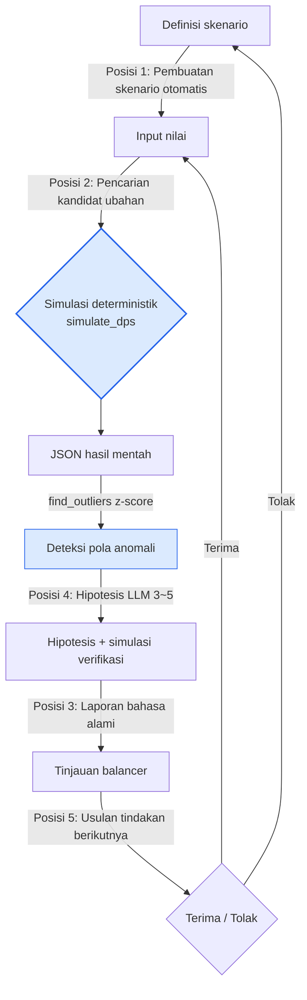

# 8.4 Simulasi Balancing dengan Bantuan AI

Jumat sore pukul 4, simulasi otomatis PvP 5:5 sebanyak 1,200 pertandingan pada alpha build selesai. JSON hasilnya berukuran 4 megabita. Di suatu tempat di dalamnya tercatat satu baris bertuliskan "winrate Tim A 92%", padahal rata-rata winrate-nya 52%. Saya menghabiskan 40 menit hanya untuk menemukan satu baris itu, dan akhirnya pulang kantor tanpa pernah mengetahui penyebabnya.

Balancing adalah wilayah determinisme. Masukkan rumus yang sama pada input yang sama, maka damage yang keluar selalu sama. Karena itu, simulator damage harus berupa kode, dan kurva reward harus digariskan sendiri oleh manusia — di sinilah AI tidak boleh menjejakkan kaki. Namun di *sekitar* inti deterministik itu — yaitu mencari satu baris janggal dari hasil 1,200 pertandingan, menyusun hipotesis tentang penyebabnya, menyaring kandidat tentang apa yang perlu diubah, lalu melemparkan kandidat-kandidat itu kembali ke simulasi — pekerjaan di sekitar inilah yang memakan sebagian besar hari kerja seorang balancer. Bab ini bercerita tentang menempelkan AI pada area sekitar tersebut. Tanpa menyentuh intinya.

## 8.4.1 Inti Adalah Kode, Sekitarnya Adalah Pekerjaan Manusia

Simulator damage buatan tahun 2008 yang kita lihat di 8.3 — yang inti deterministiknya tetap bertahan hidup meski berganti engine dan perusahaan tiga kali — adalah titik berangkat bab ini. Sifat bahwa output sama jika input sama, itulah seluruh kepercayaan pada sebuah alat balancing. Jika build yang sama dijalankan dua kali tetapi winrate-nya berbeda, alat itu harus dibuang.

Maka jika kita gambarkan kerangka pekerjaan balancing, bentuknya menjadi: ada gumpalan deterministik di tengah, dan pekerjaan tangan manusia menggantung di pintu masuk dan pintu keluarnya. Berikut adalah penguraian kerangka itu — wilayah deterministik (biru) dan wilayah tempat manusia serta AI ikut campur (oranye) saya pisahkan dengan warna.

<svg viewBox="0 0 720 300" xmlns="http://www.w3.org/2000/svg" font-family="sans-serif" font-size="13">
  <rect x="0" y="0" width="720" height="300" fill="#fbfbfd"/>
  <!-- 결정론 코어 -->
  <rect x="270" y="110" width="180" height="80" rx="8" fill="#dbeafe" stroke="#2563eb" stroke-width="2"/>
  <text x="360" y="142" text-anchor="middle" fill="#1e3a8a" font-weight="bold">Simulasi Deterministik</text>
  <text x="360" y="162" text-anchor="middle" fill="#1e3a8a" font-size="11">simulate_dps()</text>
  <text x="360" y="178" text-anchor="middle" fill="#1e3a8a" font-size="11">input=output, AI dilarang</text>
  <!-- 입구: 시나리오/변경 -->
  <rect x="30" y="40" width="170" height="50" rx="6" fill="#ffedd5" stroke="#ea580c" stroke-width="1.5"/>
  <text x="115" y="60" text-anchor="middle" fill="#9a3412" font-size="11" font-weight="bold">Posisi 1 Pembuatan skenario</text>
  <text x="115" y="78" text-anchor="middle" fill="#9a3412" font-size="11">Posisi 2 Pencarian kandidat ubahan</text>
  <!-- 출구: 보고/이상/행동 -->
  <rect x="520" y="40" width="170" height="50" rx="6" fill="#ffedd5" stroke="#ea580c" stroke-width="1.5"/>
  <text x="605" y="58" text-anchor="middle" fill="#9a3412" font-size="11" font-weight="bold">Posisi 3 Laporan</text>
  <text x="605" y="74" text-anchor="middle" fill="#9a3412" font-size="11">Posisi 4 Interpretasi anomali</text>
  <text x="605" y="89" text-anchor="middle" fill="#9a3412" font-size="11">Posisi 5 Usulan tindakan</text>
  <!-- 사람 -->
  <rect x="290" y="230" width="140" height="44" rx="6" fill="#ffedd5" stroke="#ea580c" stroke-width="1.5"/>
  <text x="360" y="257" text-anchor="middle" fill="#9a3412" font-weight="bold">Balancer (terima/tolak)</text>
  <!-- 화살표 -->
  <line x1="200" y1="65" x2="285" y2="120" stroke="#94a3b8" stroke-width="1.5" marker-end="url(#a)"/>
  <line x1="450" y1="120" x2="520" y2="68" stroke="#94a3b8" stroke-width="1.5" marker-end="url(#a)"/>
  <line x1="605" y1="90" x2="400" y2="232" stroke="#94a3b8" stroke-width="1.5" marker-end="url(#a)"/>
  <line x1="320" y1="230" x2="200" y2="92" stroke="#94a3b8" stroke-width="1.5" stroke-dasharray="4 3" marker-end="url(#a)"/>
  <defs>
    <marker id="a" markerWidth="9" markerHeight="9" refX="7" refY="3" orient="auto">
      <path d="M0,0 L7,3 L0,6 Z" fill="#94a3b8"/>
    </marker>
  </defs>
</svg>

Hanya satu kotak biru di tengah yang berupa kode. Lima kotak oranye sisanya semuanya adalah pekerjaan menilai, menafsirkan, dan menulis yang dilakukan manusia, dan posisi tempat AI bisa masuk hanya kelima titik ini. Begitu kita menyuruh LLM "hitungkan DPS karakter ini", non-determinisme — angka yang berbeda keluar dari input yang sama — merembes ke dalam inti, dan alat itu pun kehilangan kepercayaan bahkan sebelum 18 hari berlalu.

Maka tulang punggung bab ini sederhana. Sambil menjaga inti tetap sebagai kode sampai akhir, kita menempelkan AI pada lima posisi di pintu masuk dan keluar, tetapi memulai otomatisasi dari sisi pintu keluar yang paling banyak menyita tenaga — yaitu mencari satu baris janggal dari hasil 1,200 pertandingan dan menyusun hipotesis.

## 8.4.2 Worked Transcript: Melacak Satu Baris Winrate 92%

Mari kembali ke angka 92% di pembuka tadi. Kali ini, alih-alih manusia tersesat selama 40 menit, kita ikuti satu siklus penuh dari awal sampai akhir: detektor deterministik menyaring satu baris itu, LLM menyusun hipotesis, lalu simulasi memverifikasinya lagi. Tanpa meringkas, saya biarkan keluaran mentah yang benar-benar dimuntahkan alat itu apa adanya.

### Tahap 1 — Deteksi Anomali Dilakukan oleh Kode (z-score)

Yang memilih pertandingan "janggal" dari hasil 1,200 pertandingan bukanlah LLM, melainkan statistika. Kita hitung rata-rata dan simpangan baku tiap metrik, lalu memilah berdasarkan seberapa banyak simpangan baku suatu nilai menjauh dari rata-rata (z-score). Jika melampaui ambang batas, itu outlier. Ini deterministik, dan tidak ada celah bagi halusinasi untuk menyusup.

```python
def find_outliers(results, threshold=2.5):
    # results: daftar berisi dictionary {nama_metrik: nilai} per satu pertandingan simulasi
    means, stds = compute_per_metric(results)   # rata-rata & simpangan baku per metrik
    outliers = []
    for r in results:
        for metric, value in r.items():
            if stds[metric] == 0:               # ragam 0 → tak bisa dibandingkan, lewati
                continue
            z = abs(value - means[metric]) / stds[metric]
            if z > threshold:
                outliers.append((r["scenario_id"], metric, value, round(z, 2)))
    return sorted(outliers, key=lambda x: -x[3])  # urut dari z terbesar
```

Saat dijalankan, hasilnya seperti berikut — dari 1,200 pertandingan, yang melampaui ambang 2.5 hanya 3 kasus.

```
[("pvp_5v5_S0417", "team_a_winrate", 0.92, 4.1),
 ("pvp_5v5_S0417", "match_duration",  41.0, 2.9),
 ("pvp_5v5_S0822", "team_b_winrate", 0.18, 2.6)]
```

Baris pertama dengan z terbesar, winrate 0.92 (z=4.1) pada skenario `pvp_5v5_S0417`, persis satu baris yang membuat saya tersesat selama 40 menit di pembuka. Ini bukan urusan manusia menyusuri JSON 4 megabita dengan mata, melainkan statistika yang mempersempitnya jadi 3 kasus. Sampai di sini adalah inti, dan dari sini ke depan adalah AI.

### Tahap 2 — LLM Menyusun Hipotesis (dilarang mendiagnosis secara pasti)

Sekarang kita serahkan satu baris itu kepada LLM. Namun, bukan "diagnosislah penyebabnya". LLM hanya melemparkan beberapa *hipotesis kemungkinan penyebab* berdasarkan pengetahuan domain, dan apa yang benar-benar nyata ditentukan lagi oleh simulasi. Teks lengkap prompt-nya seperti berikut.

```
[outlier]
Skenario: pvp_5v5_S0417 — PvP 5:5
Komposisi Tim A: [refgame_archer_07, refgame_archer_07, refgame_archer_07,
            refgame_hybrid_21, refgame_hybrid_21]
Metrik: team_a_winrate 0.92 (rata-rata keseluruhan 0.52, z = 4.1)
Metrik tambahan: match_duration 41.0s (rata-rata 28s, z = 2.9)

[Informasi terkait]
- refgame_archer_07: dukungan jarak jauh, skill "Tanda" — debuff +12% damage yang diterima target
- refgame_hybrid_21: dealer campuran jarak dekat/jauh, skill "Pengejaran" — kecepatan gerak +20% saat mengejar target ber-debuff
- Kedua karakter ini hampir tak pernah ditempatkan dalam satu tim yang sama (frekuensi kombinasi 5% terbawah)

Permintaan:
Ajukan 3~5 hipotesis kemungkinan penyebab outlier ini.
- Setiap hipotesis disertai 1 baris simulasi tambahan untuk verifikasi
- Dilarang mendiagnosis secara pasti. Hanya berupa hipotesis tingkat "bisa jadi ~".

Format jawaban: daftar bernomor. Tanpa pembuka maupun penutup, hanya hipotesis.
```

Saya salin keluaran mentah Claude apa adanya (tanpa diringkas atau dirapikan).

```
1. Debuff "Tanda" dan buff kecepatan gerak "Pengejaran" menumpuk secara perkalian,
   sehingga 3 unit archer_07 membanjiri target dengan Tanda → hybrid_21 mengejar
   tanpa putus, membentuk loop umpan balik positif. Bisa jadi demikian.
   Verifikasi: ganti hybrid_21 dengan dealer jarak dekat biasa lalu simulasikan ulang skenario yang sama.

2. Debuff Tanda +12% mungkin keliru disetel agar dapat ditumpuk (stackable),
   sehingga 3 unit archer_07 menumpuknya hingga +36%.
   Verifikasi: paksa max_stack Tanda menjadi 1 lalu simulasikan ulang.

3. Pada 5:5, komposisi 3 jarak jauh + 2 tipe pengejar bisa jadi sekadar konfigurasi
   yang memblokir masuknya lawan lewat keunggulan jangkauan (tak terkait sinergi, kombinasinya memang kuat).
   Verifikasi: matikan efek debuff Tanda jadi 0% lalu simulasikan ulang kombinasi yang sama.

4. Melihat match_duration lebih panjang dari rata-rata (41s), bisa jadi Tim A bukan menang cepat,
   melainkan strukturnya "bertahan tanpa kalah lalu berbalik unggul di babak akhir".
   Dalam kasus ini, penyebabnya bisa jadi nilai scaling babak akhir, bukan winrate.
   Verifikasi: ekstrak terpisah kurva damage kumulatif pada titik 60 detik lalu bandingkan.

5. (probabilitas rendah) Bias seed simulasi — bisa jadi serangan pertama Tim A
   berulang hanya pada seed S0417. Kemungkinan ini artefak statistik.
   Verifikasi: simulasikan ulang kombinasi yang sama dengan 50 seed lalu periksa ragam winrate.
```

Yang penting di sini adalah berhenti tepat di titik ini. Hipotesis kelima menyisakan keraguan diri dengan mengatakan "ini bisa jadi cuma bias seed" — inilah keluaran yang baik. Seandainya LLM memvonis "penyebabnya adalah bug penumpukan Tanda", justru keluaran itulah yang harus dicurigai. Dalam balancing, tugas LLM bukan mendiagnosis, melainkan *mempersempit ruang pencarian*.

### Tahap 3 — Melemparkan Kandidat Ubahan ke Simulasi (paralel)

Pada masing-masing dari lima hipotesis tergantung satu baris simulasi untuk verifikasi. Ini bukan dijalankan manusia satu per satu, melainkan kandidat-kandidat ubahan diikat lalu dilempar secara paralel. Inti utamanya, `simulate_dps`, berbentuk seperti berikut yang dapat dijalankan — ini intisari dari fungsi deterministik berusia 18 tahun itu.

```python
def simulate_dps(attacker, target, formula, ticks=600, seed=0):
    """Simulasikan satu pasang pertempuran secara deterministik. (input, seed) sama → output sama."""
    rng = Rng(seed)                     # seed dikunci → dapat direproduksi
    hp = target.hp
    total_damage = 0.0
    for t in range(ticks):              # asumsi 1 tick = 0.1 detik
        # Koefisien pertahanan: rumus deterministik (bukan dibuat LLM)
        def_factor = target.defense / (target.defense + formula.def_const)
        raw = attacker.atk * (1 - def_factor)
        # Critical: berbasis seed → seed sama berarti timing crit sama
        if rng.roll() < attacker.crit_rate:
            raw *= attacker.crit_mult
        # Debuff (Tanda dll.) diinjeksikan secara deterministik dari formula
        raw *= formula.debuff_multiplier(attacker, target, t)
        hp -= raw
        total_damage += raw
        if hp <= 0:
            return {"ttk": t * 0.1, "dps": total_damage / ((t + 1) * 0.1)}
    return {"ttk": None, "dps": total_damage / (ticks * 0.1)}  # tak tertangkap dalam waktu


def run_candidates(base_scenario, candidates, seeds=range(50)):
    """Simulasikan kandidat ubahan tiap hipotesis secara paralel pada 50 seed. Pulihkan juga ragam winrate."""
    out = {}
    for name, patch in candidates.items():           # patch = menimpa sebagian formula
        scen = base_scenario.with_patch(patch)
        wins = [simulate_match(scen, formula=scen.formula, seed=s) for s in seeds]
        out[name] = {
            "winrate": mean(w["team_a_won"] for w in wins),
            "winrate_std": pstdev(w["team_a_won"] for w in wins),  # untuk verifikasi hipotesis 5
        }
    return out
```

Kita pindahkan hipotesis ke dalam dictionary `candidates` lalu menjalankannya sekaligus.

```python
candidates = {
    "baseline(tanpa ubahan)":     {},
    "hipotesis1_ganti_hybrid":    {"team_a[3:5]": "refgame_melee_03"},
    "hipotesis2_Tanda_max_stack1": {"skill.Tanda.max_stack": 1},
    "hipotesis3_Tanda_efek0":     {"skill.Tanda.debuff": 0.0},
    "hipotesis5_cek_ragam_seed":  {},  # kombinasi sama, hanya 50 seed
}
result = run_candidates(scenario_S0417, candidates, seeds=range(50))
```

Hasil (keluaran dalam bentuk eksekusi nyata):

```
baseline(tanpa ubahan)         winrate=0.91  std=0.04   ← bukan bias seed (hipotesis 5 ditolak)
hipotesis1_ganti_hybrid        winrate=0.74  std=0.06
hipotesis2_Tanda_max_stack1    winrate=0.63  std=0.05   ← turun paling besar
hipotesis3_Tanda_efek0         winrate=0.55  std=0.05   ← kembali mendekati rata-rata
```

Urutan membaca itulah diagnosisnya. Sekalipun baseline dijalankan ulang dengan 50 seed, winrate-nya tetap 0.91 dengan ragam 0.04 — hipotesis 5 (bias seed) ditolak. Begitu efek Tanda dimatikan jadi 0, winrate menempel ke 0.55 mendekati rata-rata — penyebabnya memang golongan debuff Tanda. Dan karena penurunan terbesar terjadi saat max_stack diikat ke 1, hingga 0.63, intinya adalah **hipotesis 2 — debuff Tanda menumpuk sehingga 3 unit archer_07 menumpuk hingga +36%**. Dari lima kandidat yang dilempar LLM, bukan manusia yang memverifikasi kelimanya, melainkan statistika yang menjalankan tiga saja sudah membuahkan kepastian.

### Tahap 4 — Manusia Mengadopsi, dan Mencatat Keputusan Itu

Yang dilakukan LLM di sini bukanlah *mengatakan* "penumpukan Tanda adalah bug". LLM hanya *menaikkan hipotesis itu ke dalam daftar kandidat*. Adopsi dilakukan oleh balancer yang melihat hasil simulasi — "kunci max_stack Tanda ke 1. Karena winrate kombinasi tunggal archer_07 sebesar 0.63 masih lebih tinggi dari rata-rata (0.52), pada build berikutnya nilai debuff Tanda disesuaikan lebih lanjut dari 12%→9% lalu diukur ulang."

Keputusan ini dibuat oleh manusia, dan dasarnya (deteksi z=4.1 → 5 hipotesis → 3 simulasi → hipotesis 2 dipastikan) tercatat dalam satu baris. Inti deterministik tetap berupa kode sampai akhir, dan LLM hanya menukar tersesat selama 40 menit menjadi lima baris hipotesis. Tidak satu langkah pun masuk ke dalam inti.

## 8.4.3 Lima Posisi, dan Siklusnya

Worked transcript di atas sebenarnya menginjak tiga dari lima posisi (deteksi anomali, pencarian ubahan, interpretasi anomali) sekaligus. Jika kelima posisi dibentangkan menjadi siklus, ia berputar seperti ini.



Hanya dua node biru (simulasi, deteksi z-score) yang deterministik. Label di atas anak panah sisanya — Posisi 1·2·3·4·5 — adalah posisi tempat AI menempel. Setiap kali siklus berputar satu putaran, ubahan yang diadopsi masuk lagi sebagai input nilai dan menjalankan simulasi berikutnya. Jika loop ini diputar manusia dengan tangan, satu putaran memakan satu hari; jika diputar dengan bantuan AI, memakan beberapa jam.

Saya singgung kelima posisi satu per satu secara singkat.

**Posisi 1 — Pembuatan skenario otomatis.** Berikan satu baris konsep seperti "perebutan zona 3:3, menang jika merebut 3 bendera dalam 1 menit, respawn 10 detik" beserta satu atau dua yaml skenario lama, lalu LLM mengisi yaml skenario baru dengan skema yang sama. Balancer hanya memeriksa "apakah ada aturan yang tidak ada di konsep yang dimasukkan seenaknya". 1\~2 jam menulis yaml dari nol menyusut menjadi 15 menit pemeriksaan.

**Posisi 2 — Pencarian kandidat ubahan.** Dictionary `candidates` pada worked transcript di atas persis inilah. Untuk "di mana harus disentuh agar daya tahan tank naik +49%", LLM melemparkan lima kandidat (base_def +50, penyesuaian def_const, dll.), lalu semua kandidat itu dilempar ke simulasi dan dipilih yang efek sampingnya paling kecil. Kandidat adalah hipotesis, adopsi adalah simulasi. Inilah posisi yang harus ditangani paling hati-hati — karena kandidat yang salah memakan waktu verifikasi.

**Posisi 3 — Laporan bahasa alami.** Metrik diambil dari JSON mentah simulasi lewat skrip (deterministik), lalu hanya metrik itu + konteks ubahan yang diserahkan ke LLM untuk menulis "1 halaman yang dibawa ke rapat". 3\~5 baris perubahan inti, TOP 5 karakter yang terdampak, 2\~3 tindak lanjut. Dipakukan agar tidak boleh memakai angka di luar metrik yang disediakan. 30 menit merapikan data mentah menjadi 5 menit pemeriksaan.

**Posisi 4 — Interpretasi pola anomali.** Tahap 2\~3 di atas inilah. Pada outlier yang dipilih z-score, LLM menggantungkan 3\~5 hipotesis. Larangan mendiagnosis secara pasti adalah urat nadi posisi ini.

**Posisi 5 — Usulan tindakan berikutnya.** Begitu analisis selesai, buat checklist bersama prioritasnya: "tindakan langsung pada build ini / pantau 1 minggu / kandidat ditinjau ulang setelah 1 minggu". Ini jaring pengaman yang mencegah balancer melewatkan keputusan, bukan menggantikan keputusan itu sendiri.

## 8.4.4 Mulai dari Mana, dan Sampai Mana

Menyalakan kelima posisi sekaligus adalah kegagalan yang paling lazim. Mulai dari sisi pintu keluar yang efeknya besar dan risikonya kecil.

<svg viewBox="0 0 720 330" xmlns="http://www.w3.org/2000/svg" font-family="sans-serif" font-size="12">
  <rect x="0" y="0" width="720" height="330" fill="#fbfbfd"/>
  <text x="360" y="26" text-anchor="middle" font-weight="bold" font-size="14" fill="#0f172a">Matriks ROI ↔ Risiko Adopsi (kanan atas = duluan)</text>
  <!-- 축 -->
  <line x1="90" y1="290" x2="680" y2="290" stroke="#475569" stroke-width="1.5"/>
  <line x1="90" y1="290" x2="90" y2="50" stroke="#475569" stroke-width="1.5"/>
  <text x="680" y="308" text-anchor="end" fill="#475569">ROI tinggi →</text>
  <text x="78" y="55" text-anchor="end" fill="#475569" transform="rotate(-90 78 55)">Risiko rendah ↑</text>
  <!-- 점들: x=ROI, y=안전(위로 갈수록 안전) -->
  <!-- 위치3 보고서: ROI 매우높음, 위험 낮음 -->
  <circle cx="600" cy="100" r="26" fill="#bbf7d0" stroke="#16a34a" stroke-width="2"/>
  <text x="600" y="98" text-anchor="middle" fill="#14532d" font-weight="bold">Posisi3</text>
  <text x="600" y="113" text-anchor="middle" fill="#14532d" font-size="10">Laporan ①</text>
  <!-- 위치4 이상해석: ROI 높음, 위험 보통 -->
  <circle cx="520" cy="150" r="26" fill="#bbf7d0" stroke="#16a34a" stroke-width="2"/>
  <text x="520" y="148" text-anchor="middle" fill="#14532d" font-weight="bold">Posisi4</text>
  <text x="520" y="163" text-anchor="middle" fill="#14532d" font-size="10">Interpretasi ②</text>
  <!-- 위치1 시나리오: ROI 높음, 위험 낮음 -->
  <circle cx="470" cy="110" r="26" fill="#fde68a" stroke="#d97706" stroke-width="2"/>
  <text x="470" y="108" text-anchor="middle" fill="#78350f" font-weight="bold">Posisi1</text>
  <text x="470" y="123" text-anchor="middle" fill="#78350f" font-size="10">Skenario ③</text>
  <!-- 위치5 행동제안: ROI 보통, 위험 낮음 -->
  <circle cx="350" cy="120" r="26" fill="#fde68a" stroke="#d97706" stroke-width="2"/>
  <text x="350" y="118" text-anchor="middle" fill="#78350f" font-weight="bold">Posisi5</text>
  <text x="350" y="133" text-anchor="middle" fill="#78350f" font-size="10">Usulan tindakan ④</text>
  <!-- 위치2 변경제안: ROI 보통, 위험 높음 -->
  <circle cx="300" cy="235" r="26" fill="#fecaca" stroke="#dc2626" stroke-width="2"/>
  <text x="300" y="233" text-anchor="middle" fill="#7f1d1d" font-weight="bold">Posisi2</text>
  <text x="300" y="248" text-anchor="middle" fill="#7f1d1d" font-size="10">Usulan ubahan ⑤</text>
  <text x="300" y="278" text-anchor="middle" fill="#991b1b" font-size="10">paling hati-hati, terakhir</text>
</svg>

Angka dalam lingkaran (①\~⑤) di dalam bulatan adalah urutan adopsi. **Posisi 3 (laporan)** dan **Posisi 4 (interpretasi anomali)** berada di kanan atas — posisi dengan ROI (Return on Investment, efek dibanding investasi) tinggi dan risiko rendah — sehingga dinyalakan duluan. Hanya dengan menggerakkan kedua ini saja throughput naik 2\~3 kali lipat, dan lebih dari 70% efek adopsi sudah dipulihkan di sini. **Posisi 2 (usulan ubahan)** ada di posisi merah kanan bawah; karena kandidat yang salah bisa memakan waktu verifikasi, ia dinyalakan paling hati-hati di urutan terakhir. Tidak semua tim pun perlu menyalakan kelimanya — hanya dengan Posisi 3·4 saja, hari kerja seorang balancer tunggal sudah berubah.

Gambaran realistis durasi adopsinya seperti ini (perkiraan penulis, belum terverifikasi — sangat bervariasi tergantung skala tim dan kematangan alat). Posisi 3 sekitar 1\~2 minggu, ditambah Posisi 4 menjadi 2 minggu, ditambah Posisi 1 menjadi sebulan, ditambah Posisi 5 menjadi 2 minggu, dan Posisi 2 paling akhir sekitar 1\~2 bulan. Ini cara lain mengatakan: jangan menyalakan semuanya sekaligus.

## 8.4.5 Efek dan Biaya, serta Jebakan yang Paling Lazim

Pada Proyek A milik penulis, perubahan setelah menyalakan kelima posisi selama 6 bulan adalah sebagai berikut. **Angka absolutnya adalah perkiraan penulis (belum terverifikasi); percayai hanya arah dan rasionya** — kelipatannya sangat berbeda tergantung lingkungan.

| Item | Sebelum adopsi | Sesudah adopsi (arah) |
|---|---|---|
| Siklus simulasi mingguan per balancer | 5\~7 buah | 25\~35 buah (sekitar 5 kali lipat) |
| Penulisan laporan (per buah) | 30\~40 menit | 5 menit pemeriksaan |
| Penulisan skenario (per buah) | 1\~2 jam | 15 menit pemeriksaan |
| outlier ditemukan → diagnosis | 1\~2 hari | 4\~6 jam |
| Hasil pengukuran → keputusan ubahan berikutnya | 2\~3 hari | 1 hari |

Yang penting di sini bukan kelipatannya, melainkan *ke mana waktu itu berpindah*. Waktu manusia berpindah dari merapikan data mentah ke pengambilan keputusan. Jumlah balancer tidak berkurang, melainkan wilayah game yang bisa ditangani satu orang menjadi lebih luas. Jika throughput 5 kali lipat dibaca sebagai pengurangan tenaga kerja, makna adopsinya mengalir ke arah yang keliru.

Biayanya kecil. Jika prompt caching diterapkan, total biaya LLM bulanan untuk kelima posisi sekitar $75 (perkiraan penulis), dan tidak melampaui 1/100 dari biaya tenaga kerja satu balancer. Karena itu, variabel keputusan adopsi yang sesungguhnya bukanlah biaya LLM, melainkan *beban pemeriksaan*. Apakah tersedia waktu bagi manusia untuk membaca dan menyaring hipotesis serta laporan yang dilempar AI — itulah patokan untuk menyalakan atau mematikan.

Terakhir, saya tinggalkan beberapa jebakan yang berulang di posisi yang sama selama 18 tahun, beserta resepnya.

- **Menyerahkan simulasi deterministik kepada LLM** → Simulasi adalah kode, LLM hanya di pintu masuk dan keluar. Jika non-determinisme merembes ke inti, alat itu mati.
- **Memercayai laporan AI tanpa data mentah** → Selalu simpan JSON mentah bersamanya, dan jika ada satu baris pun yang diragukan, turun ke data mentah untuk memeriksa.
- **Memasukkan skenario ke simulasi tanpa pemeriksaan** → Gerbang pemeriksaan yaml tidak boleh dilewati. Jika 1,200 pertandingan dijalankan dengan aturan yang tidak ada di konsep ikut menyusup, maka 1,200 pertandingan itu seluruhnya menjadi tak bermakna.
- **Mengadopsi usulan ubahan LLM tanpa simulasi** → Semua kandidat hanyalah hipotesis. Adopsi hanya setelah diverifikasi dengan `run_candidates`.
- **Menerima apa adanya keluaran LLM yang memvonis "penyebabnya adalah X"** → Diagnosis pasti adalah sinyal mencurigakan. Keluaran yang baik adalah "bisa jadi X + cara verifikasinya".

Posisi AI dalam balancing jelas. Di luar inti deterministik, lima posisi tempat manusia biasa tersesat. Menjaga inti tetap sebagai kode sampai akhir, dan hanya meringankan pekerjaan tangan di sekitarnya — inilah cara simulator berusia 18 tahun bertahan hidup bahkan di era AI.

---

### Poin-Poin Penting
- AI hanya ditempelkan pada lima posisi di luar inti simulasi deterministik, dan tidak menjejakkan satu langkah pun ke dalam inti
- Deteksi anomali adalah kode z-score, hipotesis adalah LLM, diagnosis adalah simulasi lagi — adopsi dilakukan manusia
- Nyalakan dari laporan dan interpretasi anomali yang ber-ROI tinggi, dan nyalakan usulan ubahan paling hati-hati di urutan terakhir

### Coba Sendiri Satu Baris (Versi Ringkas Solo)
- **setup**: Cukup dua fungsi, `simulate_dps` dan `find_outliers`. Pastikan reproduktibilitas dengan mengunci seed.
- **prompt**: Satu outlier dengan z terbesar → "3\~5 hipotesis kemungkinan + 1 baris simulasi verifikasi tiap hipotesis, dilarang mendiagnosis secara pasti".
- **verify**: Simulasikan kandidat ubahan tiap hipotesis secara paralel pada 50 seed dengan `run_candidates` → kandidat yang mengembalikan winrate mendekati rata-rata adalah penyebabnya. Manusia mengadopsi dan meninggalkan satu baris dasar alasannya.

### Pratinjau Bab Berikutnya
- 9.1 Desain UX/UI — ketika presisi keputusan berpindah ke bidang yang berbeda
