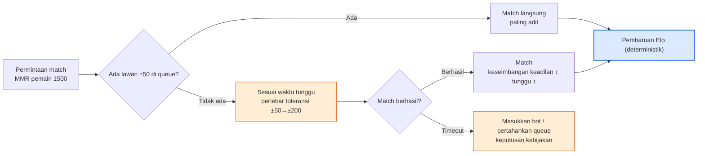
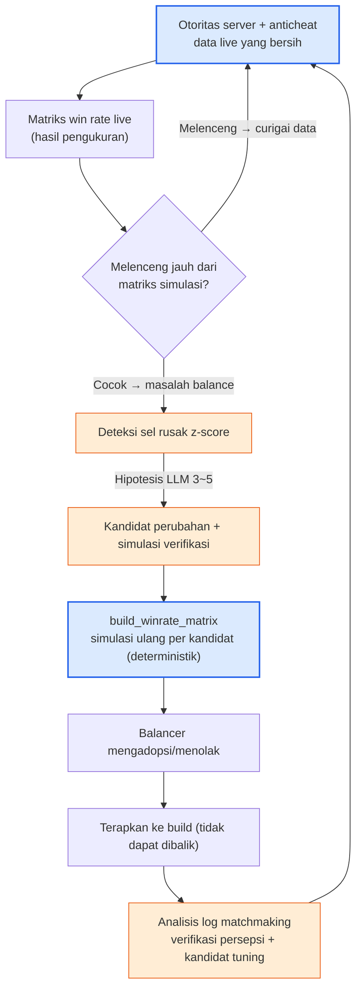

# 8.5 Balance PvP dan Kompetitif — Matriks Win Rate, Matchmaking, dan Otoritas Server

Sampai sejauh ini, empat bab dalam bagian ini bertarung melawan satu musuh. Berapa detik untuk menjatuhkan satu bos, apakah tank bertahan hidup 89%, apakah gold bocor. Semuanya adalah kisah tentang damage, daya tahan, dan keseimbangan ekonomi yang mengarah ke **satu target tunggal**. Namun di PvP, musuhnya adalah manusia. Manusia tidak bergerak dengan pola tetap seperti bos, dan sekalipun job-nya sama, tangan setiap pemain berbeda; yang terpenting, mereka *saling mengincar kelemahan*. Inilah alasan mengapa sering terjadi balance PvE yang dalam, tetapi PvP-nya kosong total. Kurva DPS terhadap satu target sudah dibahas tuntas di 8.1–8.4, tetapi jaring counter "gunting mengalahkan kertas" belum pernah sekali pun digambar.

Bab ini mengisi celah tersebut. Ada tiga hal yang akan dibahas — **matriks win rate** yang memuat counter antarkelas dan antarkomposisi, **matchmaking/MMR** yang menentukan siapa melawan siapa, dan **otoritas server serta anticheat** yang bisa membuat seluruh angka itu menjadi palsu. Dan batas yang membentang sepanjang bagian ini tetap berlaku di sini juga. Rumus tempur bersifat deterministik, sedangkan matchmaking dan deteksi counter dibantu AI. Tidak melenceng satu langkah pun.

---

## 8.5.1 Satu-Satunya Hal yang Membuat PvP Berbeda dari PvE

Di PvE, kekuatan sebuah karakter adalah **nilai absolut**. Kalau DPS swordsman 800, maka 800-lah angkanya, dan bos hanya menerima 800 itu apa adanya. Namun di PvP, kekuatan bersifat **relatif**. Nilai 800 milik swordsman cukup untuk melawan archer, tetapi terhadap shield warrior yang mengurangi damage yang diterimanya sebesar 30%, nilai itu terpangkas menjadi 560 dan bisa jadi tidak memadai. Kekuatan karakter yang sama berubah *tergantung siapa lawannya*. Satu hal inilah yang membuat balance PvP menjadi persoalan yang secara mendasar berbeda dari PvE.

Karena itu, satuan balance PvP bukanlah angka satu karakter, melainkan **hubungan satu pasangan**. Win rate "swordsman vs archer" dan win rate "swordsman vs shield warrior" masing-masing ada secara terpisah, dan jika seluruh hubungan ini dikumpulkan, jadilah satu tabel. Sumbu horizontal maupun vertikal berisi daftar kelas yang sama, dan setiap sel mencatat "probabilitas baris mengalahkan kolom". Inilah **matriks win rate**. Kalau PvE punya kurva DPS, PvP punya matriks ini.

<svg viewBox="0 0 660 300" xmlns="http://www.w3.org/2000/svg" font-family="sans-serif" font-size="13">
  <rect x="0" y="0" width="660" height="300" fill="#ffffff"/>
  <text x="330" y="28" text-anchor="middle" font-weight="bold" font-size="14" fill="#0f172a">PvE itu nilai absolut, PvP itu hubungan</text>
  <!-- PvE side -->
  <rect x="30" y="60" width="120" height="60" rx="8" fill="#eaf2fb" stroke="#2c6fbb" stroke-width="1.5"/>
  <text x="90" y="86" text-anchor="middle" fill="#2c6fbb" font-weight="bold">Swordsman</text>
  <text x="90" y="106" text-anchor="middle" fill="#333" font-size="11">DPS 800</text>
  <line x1="150" y1="90" x2="210" y2="90" stroke="#888" stroke-width="1.5" marker-end="url(#ph)"/>
  <rect x="210" y="60" width="120" height="60" rx="8" fill="#f3f4f6" stroke="#6b7280" stroke-width="1.5"/>
  <text x="270" y="86" text-anchor="middle" fill="#374151" font-weight="bold">Bos</text>
  <text x="270" y="106" text-anchor="middle" fill="#333" font-size="11">menerima 800 apa adanya</text>
  <text x="180" y="150" text-anchor="middle" fill="#2c6fbb" font-size="11">PvE: kekuatan = nilai absolut</text>
  <!-- PvP side -->
  <rect x="30" y="190" width="120" height="50" rx="8" fill="#fdecea" stroke="#c0392b" stroke-width="1.5"/>
  <text x="90" y="220" text-anchor="middle" fill="#c0392b" font-weight="bold">Swordsman 800</text>
  <line x1="150" y1="200" x2="210" y2="200" stroke="#16a34a" stroke-width="1.5" marker-end="url(#ph)"/>
  <rect x="210" y="180" width="120" height="34" rx="6" fill="#dcfce7" stroke="#16a34a" stroke-width="1.2"/>
  <text x="270" y="202" text-anchor="middle" fill="#14532d" font-size="11">Archer → 800 (efektif)</text>
  <line x1="150" y1="215" x2="210" y2="232" stroke="#dc2626" stroke-width="1.5" marker-end="url(#ph)"/>
  <rect x="210" y="222" width="120" height="34" rx="6" fill="#fee2e2" stroke="#dc2626" stroke-width="1.2"/>
  <text x="270" y="244" text-anchor="middle" fill="#7f1d1d" font-size="11">Shield warrior → 560 (kurang)</text>
  <text x="200" y="284" text-anchor="middle" fill="#c0392b" font-size="11">PvP: kekuatan = berubah tergantung lawan</text>
  <!-- matrix hint -->
  <rect x="400" y="60" width="230" height="196" rx="8" fill="#fbfbfd" stroke="#94a3b8" stroke-width="1.2"/>
  <text x="515" y="84" text-anchor="middle" fill="#0f172a" font-size="12" font-weight="bold">→ Matriks win rate</text>
  <text x="515" y="106" text-anchor="middle" fill="#475569" font-size="11">probabilitas baris mengalahkan kolom</text>
  <text x="430" y="140" fill="#475569" font-size="11" font-family="monospace">       Archer Shield Mage</text>
  <text x="430" y="162" fill="#16a34a" font-size="11" font-family="monospace">Sword  .58  .42  .50</text>
  <text x="430" y="184" fill="#475569" font-size="11" font-family="monospace">Archer --   .55  .47</text>
  <text x="430" y="206" fill="#475569" font-size="11" font-family="monospace">Shield --   --   .61</text>
  <text x="515" y="238" text-anchor="middle" fill="#94a3b8" font-size="10">(angka hanya contoh — bukan hasil pengukuran)</text>
  <defs>
    <marker id="ph" markerWidth="8" markerHeight="8" refX="6" refY="3" orient="auto">
      <path d="M0,0 L6,3 L0,6 Z" fill="#888"/>
    </marker>
  </defs>
</svg>

Cara membaca tabel di sebelah kanan sederhana. Kalau sel "swordsman vs shield warrior" bernilai 0.42, berarti probabilitas swordsman mengalahkan shield warrior adalah 42%, yang artinya shield warrior unggul dalam counter ini. Kalau semua sel mendekati 0.50, itu keseimbangan sempurna, tetapi game seperti itu tidak seru. Harus ada **counter yang berputar** seperti gunting-batu-kertas agar pemilihan job menjadi bermakna. Masalahnya muncul ketika putaran itu putus di suatu titik dan terbentuk sel di mana satu kelas mengalahkan semua kelas lain. Kalau tank pada pukul dua dini hari adalah insiden PvE, maka "shield warrior dengan win rate di atas 60% melawan semua job" adalah insiden PvP.

Ada satu hal yang perlu saya tegaskan lebih dahulu di sini. Angka-angka yang mengisi sel-sel ini (0.58, 0.42, dan seterusnya) semuanya **hanya contoh dan bukan hasil pengukuran.** Setiap game berbeda jumlah job, skill, maupun garis keseimbangan yang ditargetkan. Yang patut dipercaya di bab ini bukanlah angkanya, melainkan strukturnya — *bagaimana mengisi matriks, bagaimana memeriksanya, dan di bagian mana dari pemeriksaan itu AI ditempelkan*.

---

## 8.5.2 Yang Mengisi Matriks Adalah Simulasi, yang Membacanya Adalah AI

Pekerjaan mengisi satu sel matriks win rate menggunakan alat yang persis sama dengan simulasi deterministik yang kita lihat di 8.4. Kalau "swordsman vs archer" disimulasikan otomatis 1,000 kali lalu dihitung berapa kali swordsman menang, itulah win rate sel tersebut. Kalau ada N job, selnya berjumlah N×N, dan jika setiap sel dijalankan 1,000 kali, satu tabel pun terisi. Simulasi ini kode sampai ujung — kalau diberi seed yang sama, matriks yang sama harus dapat direproduksi tanpa meleset satu huruf pun. Hanya dengan begitu kalimat "di build ini shield warrior jadi lebih kuat" bukan kebohongan.

Di sini ada satu jebakan yang khas PvP. Pada simulasi PvE, musuh (bos) berpola tetap, tetapi pada simulasi PvP **lawan juga harus memilih aksi.** Bot (bot policy) yang menentukan bagaimana swordsman bertarung dibutuhkan di kedua sisi. Dan kalau bot ini bodoh, seluruh matriks menjadi palsu — kalau dua bot dengan kontrol yang buruk diadu, akan keluar matriks di mana "job yang menggunakan skill kapan saja secara asal" yang menang, padahal di tangan pemain mahir yang sesungguhnya hasilnya bisa sebaliknya. Karena itu, matriks PvP harus selalu disertai keterangan tentang "bot ini meniru level permainan setinggi apa". Bot umumnya dibuat dengan heuristik (gunakan skill begitu cooldown selesai, mundur kalau HP di bawah 30%, dan sebagainya), dan heuristik ini sendiri bersifat deterministik.

Kalau inti dari bot policy dipindahkan ke bentuk yang bisa dijalankan, hasilnya seperti ini — sebuah fungsi yang, untuk input yang sama, memilih aksi yang sama, dan tidak menyisakan ruang bagi halusinasi.

```python
def bot_decide(me, enemy, cooldowns, t):
    """Bot policy deterministik. (Status) sama → aksi sama. LLM tidak membuatnya."""
    # 1) Bertahan hidup lebih dulu: mundur/menghindar kalau HP di bawah 30%
    if me.hp_ratio < 0.30 and cooldowns["escape"] <= 0:
        return Action("escape")
    # 2) Skill counter: kalau musuh tidak kebal debuff, utamakan tanda
    if cooldowns["mark"] <= 0 and not enemy.has("debuff_immune"):
        return Action("mark", target=enemy)
    # 3) Atur jarak: kalau musuh jarak dekat merapat, ambil jarak (job ranged)
    if me.is_ranged and dist(me, enemy) < me.kite_range:
        return Action("reposition")
    # 4) Selain itu: skill damage tertinggi yang cooldown-nya sudah siap
    return best_ready_damage_skill(me, cooldowns)


def simulate_pvp_match(class_a, class_b, formula, seed=0):
    """Simulasikan satu pertandingan 1:1 secara deterministik. Damage memakai rumus 8.1 apa adanya."""
    rng = Rng(seed)
    a, b = spawn(class_a), spawn(class_b)
    for t in range(MAX_TICKS):
        for me, foe in ((a, b), (b, a)):
            act = bot_decide(me, foe, me.cooldowns, t)
            apply_action(act, me, foe, formula, rng)   # formula = rumus damage deterministik
        if a.hp <= 0 or b.hp <= 0:
            break
    return {"winner": "a" if b.hp <= 0 else "b" if a.hp <= 0 else "draw",
            "duration": t * TICK}
```

Yang mengisi satu lembar matriks secara penuh adalah loop luar yang menjalankan fungsi ini 1,000 kali per sel.

```python
def build_winrate_matrix(classes, formula, n=1000):
    matrix = {}
    for ca in classes:
        for cb in classes:
            if ca == cb:
                continue
            wins = sum(
                simulate_pvp_match(ca, cb, formula, seed=s)["winner"] == "a"
                for s in range(n)
            )
            matrix[(ca, cb)] = wins / n          # rasio ca mengalahkan cb
    return matrix
```

Sampai di sini adalah inti, kode sampai ujung. AI ditempelkan bukan pada bagian *membuat* tabel ini, melainkan pada bagian *membacanya*. Kalau N bernilai 8, selnya berjumlah 56, dan manusia yang menelusuri 56 win rate dengan mata untuk mencari "di mana yang rusak" adalah kerja kasar yang sama dengan menghadapi JSON 4 MB pukul dua dini hari. Yang memilih sel mencurigakan dilakukan persis oleh deteksi z-score dari 8.4.

```python
def find_broken_cells(matrix, low=0.40, high=0.60):
    """Saring secara deterministik sel-sel yang menyimpang jauh dari garis keseimbangan (0.5)."""
    broken = []
    for (ca, cb), wr in matrix.items():
        if wr > high or wr < low:
            broken.append((ca, cb, round(wr, 2)))
    return sorted(broken, key=lambda x: abs(x[2] - 0.5), reverse=True)
```

Setelah deteksi mempersempit sel, sel itu diserahkan ke LLM. Namun, disiplinnya sama seperti di 8.4 — **dilarang memberi diagnosis pasti, hanya hipotesis dan simulasi verifikasi.** Misalnya, kita berikan satu baris "shield warrior vs mage 0.68 (z terbesar)" lalu meminta seperti ini.

```
[Sel rusak]
Shield warrior → mage win rate 0.68 (garis keseimbangan 0.50, z terbesar dalam matriks)
Tambahan: durasi rata-rata match ini 38s (rata-rata keseluruhan 22s)

[Informasi terkait]
- Shield warrior: pasif "Tembok Baja" damage diterima -30%, skill silence "Bash Perisai" (2 detik)
- Mage: 70% dari seluruh damage terpusat pada skill dengan cast time 1.5 detik
- Frekuensi match kedua job ini tergolong tinggi di queue hasil pengukuran (kombinasi populer)

Permintaan: 3~5 hipotesis kemungkinan penyebab keruntuhan counter ini + 1 baris simulasi verifikasi untuk masing-masing.
Dilarang memberi diagnosis pasti. Hanya pada level "bisa jadi ~".
```

LLM hanya melempar hipotesis yang mempersempit ruang pencarian, seperti "tumpang tindih antara Tembok Baja -30% dan silence 2 detik bisa jadi menciptakan umpan balik positif di mana mage mati tanpa sempat sekali pun memasukkan skill cast inti / Verifikasi: kurangi durasi silence menjadi 1 detik lalu simulasikan ulang sel yang sama". Apa yang sebenarnya benar ditentukan dengan menjalankan kembali `build_winrate_matrix` per kandidat. Petunjuk bahwa durasi match adalah 1.7 kali rata-rata pun dirangkai LLM ke dalam hipotesis — koneksi yang mudah terlewat manusia saat menelusuri 56 sel itulah waktu yang dihemat AI di tempat ini.

---

## 8.5.3 Matchmaking: Balance Lain yang Menutupi Counter

Sekalipun matriks win rate disesuaikan dengan sempurna, penyebab sesungguhnya pemain merasa "kalah" ada di tempat lain. Yaitu **dengan siapa ia diadu.** Kalau pemain dengan skill 1500 bertemu pemain 2200, sekalipun counter job-nya 5:5, hasilnya sudah ditentukan. Karena itu matchmaking bukan sekadar fitur server, melainkan **bagian dari balance**. Kalau matriks bertanggung jawab atas keadilan antarjob, matchmaking bertanggung jawab atas keadilan antarskill.

Sebagian besar game kompetitif menerapkan MMR (Matchmaking Rating, skor matchmaking). MMR adalah skor tersembunyi yang naik saat menang dan turun saat kalah, dan pemain dengan skor mirip diadu satu sama lain. Pembaruan skor adalah rumus deterministik — Elo paling luas dipakai, dan karena merupakan standar terbuka, ia salah satu dari sedikit rumus yang boleh saya kutip di buku ini.

```
# Elo: rumus pembaruan standar terbuka (bukan nilai buatan)
expected_a = 1 / (1 + 10 ** ((rating_b - rating_a) / 400))
new_rating_a = rating_a + K * (score_a - expected_a)
#   score_a: 1 kalau menang, 0 kalau kalah
#   K: konstanta intensitas pembaruan (nilai yang ditentukan game. Biasanya dipilih dalam rentang 16~40)
#   400, 10: konstanta yang baku dalam definisi Elo
```

Rumus ini sendiri deterministik, dan bukan tempat masuknya AI. Namun, dalam matchmaking ada satu *ketegangan* yang tidak terselesaikan hanya dengan rumus deterministik. Yaitu trade-off antara **keadilan ↔ waktu tunggu**. Kalau hanya mengadu lawan dengan skor persis sama, match-nya adil, tetapi kalau lawan seperti itu tidak ada di queue, pemain menunggu 10 menit. Kalau selisih skor diizinkan dengan longgar, match cepat didapat tetapi menjadi tidak adil. Ketegangan ini makin parah pada jam dini hari, pada job yang kurang populer, dan pada rentang skor tinggi.



Hanya node biru (pembaruan Elo) yang deterministik. Node oranye — kapan dan seberapa lebar toleransi diperlebar, apa yang dilakukan saat timeout — itulah tempat yang dijangkau bantuan AI. Namun, di sini pun AI bukan yang membuat *keputusan match secara real-time*. Itu adalah logika server yang harus cepat dan dapat direproduksi, sehingga tempatnya adalah kode berbasis aturan. Yang ditempeli AI adalah **analisis untuk men-tuning** aturan tersebut. Pekerjaan merangkum "dari log matchmaking minggu lalu, di rentang skor, jam, atau job mana kualitas match (deviasi win rate, waktu tunggu) buruk", dan mengusulkan kandidat "kalau kurva toleransi diubah bagaimana, waktu tunggu rentang mana yang berkurang". Inilah posisi 3 (laporan), posisi 4 (interpretasi anomali), dan posisi 2 (pencarian kandidat perubahan) dari 8.4 yang sekadar berpindah panggung ke log matchmaking.

Saya juga menandai titik di mana matchmaking berkelindan dengan matriks win rate. Kalau algoritma matchmaking hanya menyamakan skor tanpa mempertimbangkan job, sel counter yang rusak terpapar apa adanya. Kalau sel di mana shield warrior mengalahkan mage 68% masih hidup, sementara matchmaking sering mengadu keduanya, rasa kalah yang dialami pemain mage menumpuk lebih besar daripada angka di matriks. Karena itu pemeriksaan matriks dan analisis log matchmaking bukan berputar terpisah, melainkan *pintu masuk dan pintu keluar dari siklus yang sama* — kita perbaiki sel yang rusak di matriks, lalu kita pastikan di log matchmaking seberapa sering sel itu benar-benar diadu.

---

## 8.5.4 Otoritas Server: Prasyarat Balance

Semua kisah sampai sejauh ini — matriks, MMR, simulasi — secara implisit berpijak pada satu hal. **Bahwa hasil yang dilaporkan pemain itu benar.** Di PvE, ini nyaris bukan masalah. Saat menjatuhkan bos sendirian, siapa yang mau ditipu. Namun di PvP ada lawan, menang membuat skor naik, sehingga **muncul motif untuk curang.** Begitu muncul client yang memanipulasi damage, memanipulasi posisi, dan mengabaikan cooldown, rumus deterministik 8.1 hanya deterministik di atas kertas. Di server yang sebenarnya, swordsman milik seseorang sedang memasukkan damage dua kali lebih kuat daripada rumus.

Karena itu aturan balance pertama dalam game kompetitif mendahului matriks. **Jangan biarkan client yang menentukan hasil.** Perhitungan damage, penentuan cooldown, penentuan hit — semua komputasi yang menyentuh balance dipegang otoritasnya oleh server. Client hanya mengirim input (bergerak ke mana, skill apa), dan apakah input itu sesuai rumus, apakah cooldown sudah selesai, apakah berada dalam jangkauan — semuanya diverifikasi ulang oleh server. "Damage 999" yang dikirim client diabaikan server, dan hanya nilai yang dihitung server dengan rumus yang diterapkan.

<svg viewBox="0 0 680 270" xmlns="http://www.w3.org/2000/svg" font-family="sans-serif" font-size="12">
  <rect x="0" y="0" width="680" height="270" fill="#ffffff"/>
  <text x="340" y="26" text-anchor="middle" font-weight="bold" font-size="14" fill="#0f172a">Otoritas server = satu-satunya penegak rumus balance</text>
  <!-- client -->
  <rect x="40" y="80" width="160" height="110" rx="8" fill="#fdecea" stroke="#c0392b" stroke-width="1.5"/>
  <text x="120" y="106" text-anchor="middle" fill="#c0392b" font-weight="bold">Client</text>
  <text x="120" y="128" text-anchor="middle" fill="#333">hanya mengirim input</text>
  <text x="120" y="148" text-anchor="middle" fill="#666" font-size="11">"pakai skill1, koordinat(x,y)"</text>
  <text x="120" y="170" text-anchor="middle" fill="#991b1b" font-size="11">tak bisa menentukan hasil</text>
  <!-- arrow -->
  <line x1="200" y1="120" x2="290" y2="120" stroke="#888" stroke-width="1.5" marker-end="url(#sh)"/>
  <text x="245" y="112" text-anchor="middle" fill="#666" font-size="10">input</text>
  <line x1="290" y1="155" x2="200" y2="155" stroke="#16a34a" stroke-width="1.5" marker-end="url(#sh)"/>
  <text x="245" y="172" text-anchor="middle" fill="#16a34a" font-size="10">hasil terverifikasi</text>
  <!-- server -->
  <rect x="290" y="70" width="200" height="130" rx="8" fill="#dbeafe" stroke="#2563eb" stroke-width="2"/>
  <text x="390" y="96" text-anchor="middle" fill="#1e3a8a" font-weight="bold">Server (otoritas)</text>
  <text x="390" y="118" text-anchor="middle" fill="#1e3a8a" font-size="11">verifikasi cooldown/jangkauan</text>
  <text x="390" y="138" text-anchor="middle" fill="#1e3a8a" font-size="11">damage = rumus (8.1)</text>
  <text x="390" y="158" text-anchor="middle" fill="#1e3a8a" font-size="11">deterministik · penegakan</text>
  <text x="390" y="184" text-anchor="middle" fill="#1e40af" font-size="11">"damage 999" diabaikan</text>
  <!-- anticheat / logs -->
  <rect x="540" y="80" width="110" height="110" rx="8" fill="#ffedd5" stroke="#ea580c" stroke-width="1.5"/>
  <text x="595" y="106" text-anchor="middle" fill="#9a3412" font-weight="bold" font-size="12">Log anomali</text>
  <text x="595" y="128" text-anchor="middle" fill="#9a3412" font-size="11">input mustahil</text>
  <text x="595" y="146" text-anchor="middle" fill="#9a3412" font-size="11">deteksi pola</text>
  <text x="595" y="170" text-anchor="middle" fill="#9a3412" font-size="11">bisa dibantu AI</text>
  <line x1="490" y1="135" x2="540" y2="135" stroke="#888" stroke-width="1.5" marker-end="url(#sh)"/>
  <defs>
    <marker id="sh" markerWidth="8" markerHeight="8" refX="6" refY="3" orient="auto">
      <path d="M0,0 L6,3 L0,6 Z" fill="#888"/>
    </marker>
  </defs>
</svg>

Kalau otoritas server runtuh, seluruh pekerjaan balance menjadi palsu. Sehebat apa pun matriks win rate disesuaikan, kalau di live ada satu job yang memanipulasi damage, matriks itu hanyalah janji di atas kertas. Karena itu anticheat bukanlah pekerjaan keamanan yang terpisah, melainkan **persoalan keandalan data balance**. Ketika win rate live melenceng jauh dari matriks simulasi, hal pertama yang patut dicurigai bukanlah "apakah rumusnya salah", melainkan "apakah data ini bersih".

Di sini posisi AI kembali menjadi jelas. Penentuan curang itu sendiri — "input ini dibatalkan" — adalah pekerjaan aturan deterministik. Input yang bergerak 30 meter dalam 0.1 detik secara fisik mustahil, sehingga dihalau dengan aturan. Karena input yang sama harus menghasilkan penentuan yang sama, dan tidak boleh menciptakan suspensi yang tidak adil, LLM probabilistik tidak boleh ditaruh di sini. Sebaliknya, **pekerjaan menyaring pola anomali sebagai *kandidat*** dijangkau bantuan AI. Dari log server, ia mengumpulkan kandidat seperti "distribusi akurasi akun ini menyimpang sejauh z sekian dari distribusi manusia", "kelompok akun ini berbagi pola tidak normal yang sama", lalu mengangkatnya ke tinjauan manusia. Kalau tabel 8.1 dipindahkan ke PvP, batasnya seperti ini.

| Area | AI | Alasan |
|---|---|---|
| Penentuan damage/hit/cooldown server | Dilarang mutlak | Inti deterministik. Kalau "input sama = penentuan sama" rusak, keadilan runtuh |
| Pembaruan skor Elo/MMR | Dilarang mutlak | Rumus deterministik standar terbuka. Kalau goyah, peringkat jadi palsu |
| Penentuan blokir cheat (ban) itu sendiri | Dilarang mutlak | Suspensi tidak adil tak boleh terjadi. Bukti sama = penentuan sama |
| Simulasi matriks win rate | Dilarang mutlak | Kalau tak dapat direproduksi, "job jadi lebih kuat" jadi palsu |
| Deteksi/interpretasi sel counter yang rusak | Boleh | Saring sel dengan z-score, LLM membuat hipotesis (dilarang diagnosis pasti) |
| Analisis kualitas log matchmaking·kandidat tuning | Boleh | Usulkan kandidat perubahan trade-off tunggu/adil (diverifikasi simulasi) |
| Ekstraksi kandidat pola yang dicurigai cheat | Boleh | Hanya kandidat untuk diangkat ke tinjauan manusia. Keputusan ban oleh manusia·aturan |

Garisnya tidak berbeda satu huruf pun dari 8.1. **AI hidup hanya di luar inti deterministik.** Sisi dalam yang menegakkan — damage, skor, ban — adalah rulebook, dan sisi luar yang mendeteksi, menafsirkan, serta mendorong kandidat adalah tempat AI.

---

## 8.5.5 Mengikat dalam Satu Siklus

Ketiga topik — matriks, matchmaking, otoritas server — bukanlah tiga pekerjaan yang berputar terpisah. Mereka adalah tiga segmen dari satu siklus balance kompetitif. Otoritas server menjamin data yang bersih, matriks diperiksa dengan data itu, log matchmaking memastikan bagaimana hasil pemeriksaan terasa di queue sungguhan, lalu kandidat diverifikasi lagi dengan simulasi dan diterapkan ke build.



Node biru (otoritas server, perhitungan ulang simulasi) deterministik, node oranye (deteksi·hipotesis·analisis matchmaking) dibantu AI. Kegagalan paling umum dalam siklus ini adalah melewati percabangan C. Kalau saat matriks live melenceng dari simulasi kita langsung membenahi rumus, padahal sebenarnya kita mengejar data yang tercemar cheat dan akhirnya melakukan nerf pada job yang baik-baik saja. Satu percabangan yang lebih dahulu mencurigai kebersihan data inilah yang menjalankan peran sama dengan "riwayat perubahan" dari 8.1 di PvP — kalau dilewatkan, pukul dua dini hari pun kembali.

Terakhir, saya tinggalkan beberapa jebakan balance PvP selama 18 tahun beserta resepnya.

- **Bot policy bodoh tetapi matriks dipercaya** → selalu cantumkan level bot, dan kalau bisa, koreksi dengan win rate hasil pengukuran live. Matriks bot hanya untuk *arah*, nilai absolutnya dari pengukuran nyata.
- **Matchmaking hanya menyamakan skor dan mengabaikan counter job** → kalau sel rusak masih hidup, matchmaking memaparkan sel itu. Ikat pemeriksaan matriks dan analisis matchmaking dalam satu siklus.
- **Melencengnya win rate live langsung dianggap salah rumus** → curigai lebih dahulu kebersihan data (cheat·bug). Kalau melakukan nerf dengan data tercemar, job yang baik-baik saja jadi rusak.
- **Mendelegasikan deteksi cheat ke LLM** → penentuan ban adalah aturan deterministik. LLM hanya sampai *ekstraksi kandidat*. Suspensi yang tidak adil tak bisa ditarik kembali.
- **Meratakan semua sel dengan target win rate 0.50** → keseimbangan total membunuh makna pemilihan job. Targetnya adalah *counter yang berputar*, bukan semua sel 0.50.

Posisi AI di PvP sama dengan di PvE. Di luar inti deterministik — damage, skor, ban, simulasi — adalah deteksi·interpretasi·kandidat. Inti dijaga dengan kode dan otoritas server, dan hanya kerja tangan manusia yang dulu menelusuri 56 sel dan tersesat di log matchmaking yang dipangkas — bahwa seluruh bagian ini bergerak dengan satu kerangka, bukti terakhirnya adalah bab ini.

---

## Coba Sendiri — Memeriksa Satu Lembar Matriks Win Rate

**setup.** Buatlah `simulate_pvp_match` yang merupakan perluasan 1:1 dari `simulate_dps` di 8.4, dan `bot_decide` (heuristik deterministik) yang menjalankan bot di kedua sisi. Mulailah dengan memastikan matriks yang sama dapat direproduksi dengan mengunci seed. Damage harus diambil apa adanya dari rumus 8.1, dan catatlah dalam satu baris level permainan yang ditiru bot.

**prompt.** Setelah menyaring sel di luar garis keseimbangan (0.40\~0.60) dengan `find_broken_cells`, serahkan hanya satu sel dengan z terbesar ke LLM.

```
Untuk sel rusak yang dilampirkan (shield warrior vs mage 0.68, durasi match 38s/rata-rata 22s),
ajukan 3~5 hipotesis kemungkinan penyebab dan 1 baris simulasi ulang verifikasi untuk masing-masing.
Informasi skill·pasif terkait dilampirkan di bawah. Dilarang diagnosis pasti — hanya "bisa jadi ~".
Jangan langsung mengubah angka, hanya usulkan kandidat.
```

**verify.** Jangan percaya begitu saja pada hipotesis AI. Masukkan kandidat perubahan dari setiap hipotesis ke `build_winrate_matrix`, simulasikan ulang dengan seed yang sama, lalu pastikan sekaligus bahwa sel itu kembali mendekati 0.50 sambil *tidak merusak sel lain* (perubahan PvP mudah merusak sel sebelah saat memperbaiki satu sel). Adopsi hanya kandidat yang memenuhi kedua syarat, dan seperti di 8.1, tinggalkan alasan·kandidat yang ditolak·nilai prediksi pada log keputusan. Satu minggu setelah diterapkan ke build, lampirkan win rate hasil pengukuran live ke log itu.

### Versi Ringkas Solo

Sekalipun prototipe solo dengan hanya dua job dan tanpa server, kerangkanya sama. Matriks cukup 2×2, dan simulasi cukup menambahkan satu baris bot policy (skill damage tertinggi begitu cooldown selesai) ke loop 30 baris dari 8.1. Otoritas server cukup dijaga dalam struktur kode dengan prinsip "jangan biarkan client menentukan hasil", dan anticheat formal tidak diperlukan sebelum ada pemain. MMR pun awalnya dilewati saja, dan cukup jalankan 1,000 kali untuk memastikan apakah matriks miring lebih dari 60% ke satu sisi. AI hanya dipakai untuk membaca hasil itu dan merangkum "match mana yang rusak dan kenapa bisa begitu". Tanpa peduli skalanya, satu garis yang harus dijaga — damage dan menang-kalah ditentukan oleh kode dan server, dan sama sekali tidak diserahkan ke LLM.

---

### Poin-Poin Penting

- Di PvP, kekuatan bukan nilai absolut melainkan hubungan. Satuannya bukan angka satu karakter, melainkan satu sel dari matriks win rate, dan targetnya bukan semua sel 0.50 melainkan counter yang berputar.
- Yang mengisi matriks adalah simulasi deterministik, yang menyaring sel rusak dan menyusun hipotesis adalah z-score dan AI. Trade-off keadilan↔tunggu pada matchmaking dan pola cheat juga mengikuti batas yang sama — penegakan oleh kode·server, deteksi·kandidat oleh AI.
- Otoritas server adalah prasyarat balance. Kalau win rate live melenceng dari simulasi, curigai kebersihan data lebih dahulu daripada rumus.

### Pratinjau Bab Berikutnya
- 9.1 Desain UX/UI — ketika presisi keputusan berpindah ke bidang yang berbeda
