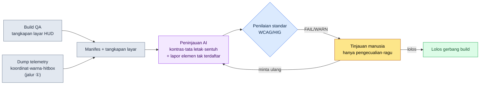

# 9.1 Memasukkan Tangkapan Layar HUD ke dalam lint — Tempat AI Menangkap Pengalihan Pandangan dan Kontras yang Kurang

> Pembaca utama: Game Designer UX yang bertanggung jawab atas HUD/UI (tim berukuran menengah, 10\~50 orang)
> Versi ringkas untuk pembaca solo/hobi: §9.1.8 "Versi Ringkas Solo"

Pada hari saya menambahkan notifikasi debuff (debuff, pengurangan status sementara) baru ke HUD di build QA, desainer berkata "kelihatan jelas", dan keesokan harinya di papan diskusi pengguna muncul keluhan "saya mati karena tidak melihat debuff-nya". Notifikasi itu muncul di tengah layar, dengan tulisan kuning pucat di atas latar belakang abu-abu. Di monitor desainer terlihat, tetapi di ponsel 6 inci yang layarnya tertutup efek ledakan saat bertempur, tidak terlihat. Masalahnya, ini bukan kali pertama. Setiap build, setiap layar, jenis kecelakaan yang sama terus berulang dengan dalih "kali ini pasti tidak apa-apa".

Bab ini berfokus pada satu pekerjaan yang memutus pengulangan itu. **Sebuah gerbang lint yang menerima satu tangkapan layar HUD jadi sebagai input, lalu secara otomatis mendeteksi apakah elemen P0 keluar dari area yang dijangkau pandangan (status bar atas, dan sudut aksi kiri-kanan bawah), serta apakah kontras teks melampaui ambang keterbacaan.** Prinsip umum desain HUD seperti tabel prioritas, alur pandangan, dan percabangan platform sudah cukup banyak dibahas di buku lain, jadi bab ini hanya mencurahkan ruang pada *loop peninjauan yang memberlakukan prinsip itu secara otomatis di setiap build*. Intinya adalah membuat AI melihat layar dan berbicara dengan koordinat dan angka seperti "tulisan ini kontrasnya 2.0:1, jadi kurang dari WCAG 4.5:1". Perdebatan mulut "kok kelihatan jelas kan?" digantikan oleh kode dan standar.

---

## 9.1.1 Kriteria Peninjauan Bukan 'Perasaan', Melainkan Standar Publik

Alasan peninjauan HUD selalu menghasilkan kesimpulan berbeda dari orang ke orang adalah karena kriterianya bersifat subjektif: "kelihatan jelas / tidak kelihatan". Untungnya, sebagian besar urusan keterbacaan dan aksesibilitas sudah dipatok dengan angka oleh badan standar. Tidak perlu dibuat-buat.

| Item peninjauan | Kriteria standar (sumber) | Penilaian otomatis |
|---|---|---|
| Kontras teks biasa | 4.5:1 ke atas (WCAG 2.1 SC 1.4.3) | Bisa — dihitung dari nilai warna latar depan/belakang |
| Kontras teks besar (18pt+) | 3:1 ke atas (WCAG 2.1 SC 1.4.3) | Bisa |
| Kontras non-teks (ikon·gauge) | 3:1 ke atas (WCAG 2.1 SC 1.4.11) | Bisa |
| Ukuran minimum target sentuh | 44×44 pt (Apple HIG) / 48×48 dp (Material) | Bisa — dari ukuran elemen |
| Area jangkauan jempol | Saat **dipegang lanskap dengan dua tangan**, sudut kiri·kanan bawah tergolong 'mudah' (jempol kiri=gerak, jempol kanan=skill). Model thumb-zone yang lazim di industri | Sebagian — lewat aturan area |

Hanya baris terakhir (area jangkauan jempol) yang bukan batas lulus kuantitatif melainkan model yang lazim di industri, sedangkan empat baris di atas adalah batas lulus yang dipublikasikan W3C·Apple·Google. Kontras khususnya sangat jelas. WCAG bahkan mempublikasikan rumus untuk menghitung luminans relatif dua warna sebagai `(L1+0.05)/(L2+0.05)`. Kontras tulisan kuning pucat (#D4C84A) di atas latar abu-abu (#888), jika dimasukkan ke rumus ini, menghasilkan sekitar 2.0:1 — kurang dari 4.5:1, artinya secara standar jelas tidak lulus. Inilah tempat di mana bantahan "di monitor desainer kelihatan kok" tidak berlaku.

Di sini saya tegaskan satu hal. Layar mobile MMORPG·RPG **berstandar lanskap (landscape)**. Alasannya adalah volume informasi dan kontrol. Pada inci yang sama, jika dipegang lanskap, informasi tetap yang muat dalam satu layar lebih banyak daripada portrait, dan jempol kedua tangan bisa mengoperasikan kiri (gerak)·kanan (skill) secara bersamaan. Pegangan satu tangan portrait cocok untuk puzzle kasual·game idle, tetapi tidak cocok untuk MMORPG yang informasi simultannya banyak dan butuh kontrol dua tangan. Karena itu, semua penilaian pandangan·tata letak di bab ini berasumsi pegangan lanskap dua tangan. Layar terbagi menjadi status bar lanskap di atas, dua sudut aksi kiri-kanan bawah, area game tengah di antaranya, lalu slot bar tengah bawah di bawah area game (item konsumsi·otomatis·quick slot).

Lima baris ini adalah **rulebook (buku aturan) peninjauan** yang akan saya berikan kepada AI di bab ini. Agar penilaian yang sama keluar baik ditinjau manusia maupun AI, kita harus bisa berkata bukan "sepertinya debuff-nya agak tidak kelihatan", melainkan "teks debuff melanggar SC 1.4.3 dengan kontras 2.0:1".

Menempatkan kriteria platform sejajar dengan PC membuat titik awal peninjauan menjadi jelas. Proyek A mengutamakan mobile + PC sebagai pendukung, jadi kedua kriteria sama-sama dimasukkan ke rulebook.

| Kriteria | PC (platform pendukung) | Mobile (platform utama, lanskap) |
|---|---|---|
| Layar·input | 27 inci+ / presisi mouse 1px·hover·shortcut | 6.x inci lanskap / jempol dua tangan, tanpa hover |
| Informasi tetap simultan | Sanggup 30\~50 jenis | 12\~16 jenis adalah batasnya (perkiraan penulis, belum terverifikasi) |
| Jangkauan pandangan·kontrol | Seluruh layar (kursor menjangkau ke mana saja) | Hanya status bar atas + sudut kiri·kanan bawah + slot bar tengah bawah yang 'mudah' |
| Presisi | Klik 1px | Target sentuh minimum 44pt (HIG) |
| Risiko peninjauan utama | Beban kognitif akibat informasi terlalu padat | Layar sempit + tertutup jari + tenggelam di tengah |

PC, berkat presisi mouse·tooltip hover·layar besar, tetap terjangkau pandangan dan kontrol meski banyak informasi ditampilkan. Mobile, karena lanskap, lebih baik daripada portrait tetapi tidak sebanyak PC, elemen yang ditekan terikat pada sudut jempol kedua tangan, dan karena tanpa hover, informasi P0 harus selalu tampil. Karena itu, esensi peninjauan HUD mobile bukan "apakah cantik" melainkan **"apakah P0 berada di tempat yang dijangkau pandangan (atas·kedua sudut), dan apakah tulisan melampaui kontras standar"**. Tugas bab ini adalah memaku penilaian itu dengan standar agar tidak goyah dari orang ke orang.

---

## 9.1.2 [Worked Transcript] Memasukkan Satu Tangkapan Layar HUD ke dalam lint

Saya tunjukkan satu siklus penuh dari awal hingga akhir tentang cara menjalankannya secara nyata. Berikut adalah rekonstruksi yang setia dari sesi peninjauan HUD tempur proyek penulis (MMORPG yang mengutamakan mobile, selanjutnya "Proyek A"). Prompt input dapat langsung disalin dan dipakai, dan keluarannya merupakan rekonstruksi dari sesi nyata.

### Langkah 1 — Input: Lemparkan tangkapan layar + manifes elemen bersamaan

Jika hanya melempar tangkapan layar, AI akan "menebak" layar. Karena itu, koordinat·warna·klasifikasi elemen yang sudah diketahui build dimasukkan sekalian sebagai manifes. Ini bukan ditulis dari nol, melainkan tinggal diekstrak dari hasil build (realitas cara ekstraksi dibandingkan secara jujur di §9.1.4).

```yaml
# hud_capture_manifest.yaml — disertakan pada tangkapan layar build QA
screen: { w_pt: 844, h_pt: 390 }   # lanskap 6.x inci, satuan pt (pegangan lanskap)
elements:
  - id: hp_bar        # bilah HP
    class: P0
    rect_pt: [12, 18, 150, 16]      # x, y, w, h — kiri atas
    fg: "#FF5A5A"  ; bg: "#1A1A1A"
  - id: skill_slot_1  # slot skill (jempol kanan)
    class: P0
    rect_pt: [760, 300, 40, 40]     # ← sudut kanan bawah, perhatikan ukurannya
    fg: "#FFFFFF"  ; bg: "#202830"
  - id: debuff_alert  # notifikasi debuff (ditambahkan kemarin)
    class: P0
    rect_pt: [400, 180, 70, 24]     # ← tengah layar, perhatikan posisinya
    fg: "#D4C84A"  ; bg: "#888888"   # ← perhatikan kontrasnya
  - id: minimap
    class: P1
    rect_pt: [744, 20, 80, 80]       # kanan atas
    fg: "#A0C0FF"  ; bg: "#101820"
```

### Langkah 2 — Prompt: Suruh tinjau, tetapi paksakan standar dan format

```
Tangkapan layar terlampir adalah HUD tempur Proyek A (pegangan lanskap dua tangan), dan yaml-nya adalah koordinat·warna·klasifikasi tiap elemen di layar itu. Tolong tinjau dengan membandingkan keduanya.
Untuk kontras, hitung dengan WCAG dari fg/bg dan tuliskan sampai angkanya — teks kurang dari 4.5:1, ikon·tulisan besar kurang dari 3:1 berarti FAIL.
Kalau P0 keluar dari status bar atas atau sudut kiri·kanan bawah dan mengambang di tengah layar, beri WARN (tengah tenggelam oleh efek tempur).
Kalau elemen kontrol kurang dari 44pt, atau keluar dari sudut jempol·slot bar tengah bawah, FAIL.
Kalau ada yang tidak ada di manifes tapi terlihat di layar, laporkan terpisah, dan yang tidak yakin pisahkan sebagai 'ragu' lalu serahkan ke saya.
Berikan dalam bentuk tabel saja (elemen|pemeriksaan|nilai ukur|penilaian|catatan), tanpa penjelasan.
// (maksud: P0=informasi yang harus ditemukan dalam 0.5 detik / item konsumsi·otomatis·quick slot di tengah bawah itu normal)
```

Yang penting di sini adalah bahwa lebih banyak baris dicurahkan pada cara mengeluarkan output aturan itu ketimbang aturan peninjauannya sendiri. Jika AI diberi kebebasan, ia akan memuntahkan pujian seperti "secara keseluruhan rapi kok". Karena itu, kita paku di muka: **rumus perhitungan (kontras WCAG), batas lulus (4.5:1·44pt), format output (tabel), kewajiban mencantumkan nilai ukur, dan jalan keluar "kalau tidak yakin, serahkan ke manusia"**. Lima paku ini mengubah pujian menjadi nilai ukur.

### Langkah 3 — Keluaran Claude (rekonstruksi, mentah)

```
| Elemen       | Periksa | Nilai Ukur               | Nilai | Catatan                           |
|-------------|---------|--------------------------|-------|-----------------------------------|
| hp_bar      | kontras | #FF5A5A/#1A1A1A = 5.7:1   | PASS  | gauge non-teks, memenuhi 3:1      |
| hp_bar      | tata letak | kiri atas (12,18)      | PASS  | P0 di status bar atas             |
| skill_slot_1| sentuh  | 40×40 pt, sudut kanan bawah | FAIL | kurang dari 44pt HIG, kurang 4pt (sudut OK)|
| skill_slot_1| tata letak | kanan bawah (760,300) | PASS  | sudut jangkauan jempol kanan      |
| debuff_alert| kontras | #D4C84A/#888888 = 2.0:1   | FAIL  | teks biasa kurang dari 4.5:1 (SC 1.4.3) |
| debuff_alert| tata letak | tengah layar (400,180) | WARN | P0 tapi di tengah — tenggelam oleh efek tempur |
| minimap     | kontras | #A0C0FF/#101820 = 9.8:1   | PASS  |                                   |
| minimap     | tata letak | kanan atas (744,20)   | PASS  | P1, diizinkan di kanan status bar atas |

Laporan tambahan:
- Di manifes ada 4 jenis, tetapi di kiri bawah tangkapan layar terlihat satu
  ikon kuning berkedip lagi (perkiraan koordinat ~70,330). Diduga manifes
  terlewat. (ragu — dari layar saja tak bisa memastikan ini elemen apa)

Ringkasan: FAIL 2 (skill_slot_1 sentuh, debuff_alert kontras), WARN 1 (debuff_alert
tata letak), ragu 1 (ikon tak terdaftar).
```

Bagian paling berharga dari output bukanlah tabel lulus/tidak lulus, melainkan **"laporan tambahan" dan "ragu" di paling bawah**. Tempat di mana AI menangkap ikon berkedip yang tidak ada di manifes dari layar, dan menyerahkan kepada manusia dengan mengaku tidak bisa memastikan itu apa. Prompt yang baik membuat AI mampu berkata "yang ini saya tidak tahu".

### Langkah 4 — Verifikasi dan Penolakan (tempat manusia)

Output ini tidak boleh diterima begitu saja. Peninjauan AI itu sendiri ditinjau sekali lagi oleh manusia. Nyatanya di sesi ini ada satu hal yang dibalik oleh tangan manusia.

FAIL kontras dan WARN tata letak `debuff_alert` itu benar. Kuning pucat di atas latar abu-abu adalah pelanggaran standar persis seperti yang dilihat di §9.1.1, dan menempatkan notifikasi P0 di tengah layar lanskap juga merupakan kesalahan khas yang tenggelam oleh efek tempur. Sampai sini AI benar.

Masalahnya adalah FAIL sentuh `skill_slot_1`. AI mempercayai begitu saja `40×40 pt` di manifes dan menilai "kurang dari 44pt", padahal di build sebenarnya slot ini secara visual 40pt tetapi **hitbox (deteksi tabrakan) sentuhnya diperluas 6pt ke segala arah** sehingga area tap aktualnya 52pt. `rect_pt` di manifes hanya memuat *persegi yang digambar* dan tidak memuat *hitbox* — yakni ini cacat data input, bukan salah nilai AI. AI menilai dengan tepat dalam batas data yang diberikan (penilaian posisi sudutnya benar), dan manusia mengetahui kondisi build yang tidak diketahui kode (perluasan hitbox). FAIL ini ditolak oleh manusia.

Karena itu, dua hal dilakukan sekaligus. Skrip ekstraksi manifes diperbaiki agar ikut menarik hitbox (perbaikan cacat data), dan AI dimintai ulang.

```
skill_slot_1 ukuran visualnya 40pt tapi hitbox-nya diperluas 6pt ke segala arah sehingga area tap aktualnya 52pt (hit_rect sudah ditambahkan ke manifes). Tolong cek ulang sentuhnya dengan kriteria ini.
FAIL/WARN debuff_alert biarkan apa adanya, dan usulkan 3 kombinasi warna yang melewati kontras 4.5:1 (pertahankan nuansa kuning, latar dibuat gelap). Berikan juga satu koordinat untuk memindahkannya dari tengah ke kanan status bar atas.
```

AI mengoreksi `skill_slot_1` menjadi PASS dengan kriteria hitbox 52pt, dan untuk kontras debuff mengembalikan 3 usulan kombinasi warna yang membuat latar belakang gelap menjadi #2A2A00 sehingga menghasilkan 7.8:1, beserta koordinat untuk memindahkan notifikasi ke kanan status bar atas (sekitar 600,18). Selesai dalam satu kali bolak-balik. **Jika setiap build hanya menyapu layar dengan mata, kecelakaan yang sama berulang, tetapi jika tangkapan layar+manifes dimasukkan ke lint, pelanggaran kontras·tata letak·sentuh jatuh menjadi angka dan manusia hanya menilai pengecualian yang tidak diketahui kode (hitbox) dan keraguan (ikon tak terdaftar)** (meninjau 1 layar dengan tangan butuh belasan menit, dengan loop ini beberapa menit — perkiraan penulis, hipotesis belum terverifikasi. Lebih tepat dibaca dari perbedaan struktur antara "menyapu dengan mata" dan "mengukur dengan standar" ketimbang dari waktu absolutnya).

---

## 9.1.3 Pandangan·Tata Letak HUD Lanskap — Mengapa Tengah Itu Berbahaya

Jika alasan `debuff_alert` mendapat WARN di sesi di atas, dan di mana informasi P0 harus diletakkan, ditinggalkan dalam satu gambar, maka semua penilaian tata letak selanjutnya menjadi lebih cepat. Pada ponsel yang dipegang lanskap, layar terbagi menjadi empat tempat. **Status bar lanskap di atas** (read-only, yang pertama dijangkau pandangan dan tidak disentuh jari), **dua sudut kiri·kanan bawah** (tempat kontrol yang dijangkau jempol kedua tangan — jempol kiri=gerak, jempol kanan=skill), **area game tengah** di antaranya (tempat pertempuran terjadi), dan di bawah area game **slot bar tengah bawah** (tempat item konsumsi·otomatis dan quick slot·slot skill diletakkan). Di bawah, hijau·amber adalah area aman untuk P0 dan slot, merah adalah tengah game tempat notifikasi P0 tenggelam.

<svg viewBox="0 0 660 340" xmlns="http://www.w3.org/2000/svg" role="img" aria-label="Peta area pandangan dan tata letak P0/P1 pada HUD lanskap mobile">
  <!-- 폰 외곽 (가로) -->
  <rect x="20" y="30" width="620" height="280" rx="30" ry="30" fill="#0f1117" stroke="#3a3f4b" stroke-width="3"/>
  <rect x="34" y="44" width="592" height="252" rx="14" ry="14" fill="#11151d"/>
  <!-- 상단 상태 band (초록 — 시선 1순위, 읽기 전용) -->
  <rect x="34" y="44" width="592" height="56" fill="#14532d" opacity="0.55"/>
  <path d="M44 52 H616" fill="none" stroke="#22c55e" stroke-width="2.5" stroke-dasharray="6 4"/>
  <text x="330" y="92" fill="#bbf7d0" font-family="sans-serif" font-size="12" text-anchor="middle" font-weight="bold">Status bar lanskap atas — prioritas pandangan 1 (HP · MP · target, baca saja)</text>
  <!-- 중앙 위험대(빨강): 게임 영역, P0 두면 이펙트에 묻힘 -->
  <rect x="180" y="100" width="300" height="138" fill="#7f1d1d" opacity="0.4"/>
  <text x="330" y="158" fill="#fecaca" font-family="sans-serif" font-size="13" text-anchor="middle">Tengah — area game (efek meledak-ledak)</text>
  <text x="330" y="178" fill="#fecaca" font-family="sans-serif" font-size="11" text-anchor="middle">Taruh notifikasi P0 di sini → tenggelam — tempat debuff_alert tersangkut</text>
  <!-- 중앙 하단 슬롯대 (앰버 — 소비·퀵슬롯·자동, 게임 영역 아래) -->
  <text x="330" y="240" fill="#b45309" font-family="sans-serif" font-size="11" text-anchor="middle" font-weight="bold">Tengah bawah — konsumsi·quick slot·otomatis</text>
  <rect x="248" y="248" width="164" height="42" rx="8" fill="#f59e0b" opacity="0.5" stroke="#f59e0b" stroke-width="2" stroke-dasharray="5 4"/>
  <circle cx="298" cy="270" r="11" fill="#fbbf24"/><text x="298" y="274" fill="#000" font-size="8" text-anchor="middle">Ramuan</text>
  <circle cx="330" cy="270" r="11" fill="#fbbf24"/><text x="330" y="274" fill="#000" font-size="8" text-anchor="middle">Otomatis</text>
  <circle cx="362" cy="270" r="11" fill="#fbbf24"/><text x="362" y="274" fill="#000" font-size="8" text-anchor="middle">Slot</text>
  <!-- 좌하단 엄지 코너 (초록) -->
  <path d="M34 296 L34 146 A150 150 0 0 1 184 296 Z" fill="#14532d" opacity="0.7"/>
  <path d="M34 146 A150 150 0 0 1 184 296" fill="none" stroke="#22c55e" stroke-width="2.5" stroke-dasharray="5 4"/>
  <text x="92" y="254" fill="#bbf7d0" font-family="sans-serif" font-size="13" text-anchor="middle" font-weight="bold">Jempol kiri</text>
  <text x="92" y="274" fill="#bbf7d0" font-family="sans-serif" font-size="12" text-anchor="middle">Gerak</text>
  <!-- 우하단 엄지 코너 (초록) -->
  <path d="M626 296 L626 146 A150 150 0 0 0 476 296 Z" fill="#14532d" opacity="0.7"/>
  <path d="M626 146 A150 150 0 0 0 476 296" fill="none" stroke="#22c55e" stroke-width="2.5" stroke-dasharray="5 4"/>
  <text x="568" y="254" fill="#bbf7d0" font-family="sans-serif" font-size="13" text-anchor="middle" font-weight="bold">Jempol kanan</text>
  <text x="568" y="274" fill="#bbf7d0" font-family="sans-serif" font-size="12" text-anchor="middle">Skill</text>
  <!-- 실제 요소 점 -->
  <rect x="60" y="60" width="60" height="10" rx="3" fill="#ef4444"/><text x="90" y="68" fill="#fff" font-size="8" text-anchor="middle">HP</text>
  <rect x="60" y="78" width="60" height="10" rx="3" fill="#3b82f6"/><text x="90" y="86" fill="#fff" font-size="8" text-anchor="middle">MP</text>
  <rect x="300" y="56" width="44" height="20" rx="4" fill="#0ea5e9" opacity="0.8"/><text x="322" y="70" fill="#fff" font-size="8" text-anchor="middle">Target</text>
  <rect x="560" y="54" width="48" height="40" rx="6" fill="#0ea5e9" opacity="0.7"/><text x="584" y="78" fill="#fff" font-size="8" text-anchor="middle">Peta P1</text>
  <circle cx="330" cy="204" r="13" fill="#facc15" opacity="0.5"/><text x="330" y="208" fill="#000" font-size="6" text-anchor="middle">Debuff?</text>
  <circle cx="92" cy="220" r="17" fill="#22c55e"/><text x="92" y="224" fill="#000" font-size="9" text-anchor="middle">Gerak</text>
  <circle cx="556" cy="222" r="14" fill="#22c55e"/><text x="556" y="226" fill="#000" font-size="9" text-anchor="middle">Skill</text>
  <circle cx="592" cy="210" r="13" fill="#22c55e"/><text x="592" y="214" fill="#000" font-size="9" text-anchor="middle">Skill</text>
  <circle cx="600" cy="272" r="12" fill="#22c55e"/><text x="600" y="276" fill="#000" font-size="8" text-anchor="middle">Skill</text>
</svg>

Aturannya sederhana. **Informasi P0 (HP·MP·notifikasi inti) diletakkan di dalam hijau (status bar lanskap atas atau kedua sudut bawah).** Sebab itulah jalur yang pertama dijangkau pandangan atau yang selalu disinggahi jempol. Sebaliknya, **tengah game (merah) adalah tempat pertempuran itu sendiri terjadi**, jadi jika notifikasi P0 diletakkan di sini, informasi akan tenggelam saat efek menutupi layar. Satu hal yang perlu diperhatikan — tengah game dan **tengah bawah** itu berbeda. Tengah game berbahaya, tetapi **slot bar tengah bawah (amber) di bawahnya adalah tempat item konsumsi·otomatis dan quick slot·slot skill bermukim**. Diletakkan di antara kedua jempol agar yang saya pakai atau yang dikonsumsi otomatis terlihat sekilas. Lalu **informasi yang hanya dibaca (HP/MP/HP target) di atas**, **elemen yang ditekan (gerak·skill) di kedua sudut bawah**, **konsumsi·slot di tengah bawah** — ketiganya adalah area jari·pandangan. Alasan notifikasi debuff mendapat WARN di §9.1.2 terjelaskan oleh satu gambar ini — karena P0 yang harus dilihat dalam 0.5 detik justru diletakkan di tengah game yang paling tidak kelihatan. Memindahkannya ke kanan status bar atas dalam usulan koreksi sama persis dengan mengembalikannya ke hijau pada gambar ini.

---

## 9.1.4 Bagaimana Menarik Koordinat — Kejujuran Implementasi

lint di bab ini berdiri di atas premis bahwa "koordinat·warna tiap elemen" masuk dengan bersih. Padahal, *dari mana dan bagaimana* koordinat itu ditarik justru adalah persimpangan paling realistis dalam praktiknya. Karena ini tempat yang kerap diburamkan buku, saya bandingkan tiga jalur secara jujur. Jawabannya tidak tunggal, dan bercabang menurut situasi tim.

| Jalur | Apa yang dilakukan | Kekuatan | Kelemahan / realitas |
|---|---|---|---|
| ① Log telemetry dalam game | Build langsung men-dump koordinat·ukuran·warna widget yang digambar framework UI | Koordinat **akurat** (bukan perkiraan), bahkan hitbox·anchor pun keluar | Harus menanam hook dump di kode UI. Butuh kolaborasi programmer. Sekali dipasang, paling bisa dipercaya |
| ② Vision API jadi | Masukkan tangkapan layar ke API OCR·deteksi objek untuk menarik koordinat teks·kotak | Tidak perlu modifikasi build, tangkapan layar eksternal pun bisa | Koordinat **nilai hampiran**, klasifikasi non-teks seperti gauge·ikon lemah. Pengiriman ke luar = risiko bocornya build yang belum dirilis |
| ③ Implementasi sendiri (analisis piksel) | Membaca langsung tangkapan layar untuk menarik batas warna·kotak secara heuristik | Dependensi minimal, cukup untuk perhitungan kontras warna | Tidak tahu *makna* elemen (apakah ini P0). Berguna hanya jika dibandingkan dengan manifes. Beban pemeliharaan |

Hubungan ketiga jalur ini menjelaskan persis worked transcript di bab ini. Di §9.1.2, **pemeriksaan kontras akurat karena nilai warna (fg/bg) masuk dengan tepat lewat ①·③**, dan **FAIL sentuh dibalik oleh tangan manusia karena hitbox terlewat dari manifes** (②·③ tidak melihat hitbox, hanya ① yang melihatnya). Yakni *kontras* tertangkap dengan piksel saja, tetapi *hitbox sentuh* tidak bisa tertangkap tanpa ① telemetry. Garis sampai sejauh mana kita mempercayai hasil peninjauan AI baru bisa ditarik jika kita memulai dengan mengetahui keterbatasan ini.

Pilihan proyek penulis adalah struktur **① telemetry sebagai sumber resmi, AI sebagai peninjau yang membandingkan tangkapan layar+manifes telemetry**. AI menangkap apa yang hanya terlihat di layar tetapi tidak ada di manifes (ikon berkedip tak terdaftar di §9.1.2), dan manusia menangkap apa yang ada di manifes tetapi menyimpang di layar. Dengan salah satunya saja, kedua sisi buta tetap tersisa.



Tempat yang disinggahi tangan manusia hanya dua. Tempat memasukkan dump telemetry dengan bersih (paling depan), dan tempat menilai pengecualian (hitbox)·keraguan (elemen tak terdaftar) yang tidak tertangkap kode·standar (paling belakang). Perhitungan kontras yang membosankan dan pencocokan tata letak di antaranya dijalankan oleh AI dan standar.

---

## 9.1.5 Rulebook menjadi Kode — Gerbang Otomatis Kontras·Sentuh·Sudut

Jika peninjauan AI mengulang perhitungan dari awal setiap kali, itu memakan token dan waktu. **Item yang jatuh secara deterministik seperti kontras·sentuh·jangkauan sudut, kode yang menangani lebih dulu.** AI hanya masuk pada hal yang tidak bisa ditangkap kode (interpretasi makna layar, elemen tak terdaftar). Keduanya bukan persaingan melainkan pembagian tugas.

```python
# hud_lint.py — verifikasi standar manifes HUD (kerangka)
# input: manifes telemetry (rect/hit_rect/fg/bg/class/interactive per elemen)
# output: daftar pelanggaran WCAG/HIG + jangkauan dua tangan

def _luminance(hex_color):           # luminans relatif WCAG
    r, g, b = (int(hex_color[i:i+2], 16) / 255 for i in (1, 3, 5))
    f = lambda c: c/12.92 if c <= 0.03928 else ((c+0.055)/1.055) ** 2.4
    R, G, B = f(r), f(g), f(b)
    return 0.2126*R + 0.7152*G + 0.0722*B

def contrast_ratio(fg, bg):          # kontras WCAG
    L1, L2 = sorted((_luminance(fg), _luminance(bg)), reverse=True)
    return (L1 + 0.05) / (L2 + 0.05)

def in_thumb_corner(e, w, h):
    """Apakah berada di sudut kiri·kanan bawah yang dijangkau jempol dua tangan pada pegangan lanskap."""
    x, y = e["hit_rect"][0] / w, e["hit_rect"][1] / h
    bottom = y > 0.55
    left_corner  = bottom and x < 0.30   # jempol kiri = gerak
    right_corner = bottom and x > 0.70   # jempol kanan = skill
    return left_corner or right_corner

def lint(elements, screen_w, screen_h):
    issues = []
    for e in elements:
        # Aturan A: kontras (teks 4.5:1 / non-teks·tulisan besar 3:1)
        need = 4.5 if e["kind"] == "text" else 3.0
        cr = contrast_ratio(e["fg"], e["bg"])
        if cr < need:
            issues.append(f"[A] {e['id']}: kontras {cr:.1f}:1 < {need}:1 (WCAG SC 1.4.3)")
        # Aturan B: target sentuh — kriteria hitbox (bukan ukuran visual)
        if e.get("interactive"):
            tap = min(e["hit_rect"][2], e["hit_rect"][3])   # ← hit_rect, bukan rect
            if tap < 44:
                issues.append(f"[B] {e['id']}: tap {tap}pt < 44pt (HIG)")
            # Aturan C: elemen kontrol harus ada di sudut jempol dua tangan (kiri·kanan bawah)
            if not in_thumb_corner(e, screen_w, screen_h):
                issues.append(f"[C] {e['id']}: elemen kontrol ditempatkan di luar sudut jempol dua tangan "
                              f"(x={e['hit_rect'][0]}, y={e['hit_rect'][1]})")
    return issues
```

Kode ini mengakhiri adu mulut "tulisan ini agak tidak kelihatan ya?" di rapat. Jika kode mengeluarkan `[A] debuff_alert: kontras 2.0:1 < 4.5:1 (WCAG SC 1.4.3)`, tidak ada yang perlu didebatkan. Tinggal diperbaiki. Dua baris yang patut diperhatikan adalah bahwa Aturan B melihat `hit_rect` bukan `rect`, dan Aturan C hanya meloloskan elemen kontrol melalui dua sudut kiri·kanan bawah — pelajaran (hitbox) tempat manusia membalik AI di §9.1.2, dan batas jangkauan pegangan lanskap dua tangan, sama-sama masuk ke kode. Yang menjadi inti penilaian lanskap adalah bahwa ia tidak melihat satu ambang 'busur jempol' tunggal, melainkan melihat dua sudut jempol kiri (gerak)·jempol kanan (skill) secara terpisah. Pengecualian yang sekali ditangkap manusia, mulai berikutnya ditangkap kode. Karena itu, untuk AI hanya disisakan peran sempit "laporkan keanehan yang hanya terlihat di layar (elemen tak terdaftar·tumpang tindih visual·terpotong), selain yang sudah di-PASS oleh kode". Yang jatuh deterministik oleh kode, yang butuh interpretasi makna layar oleh AI, yang pengecualiannya diketahui kondisi build oleh manusia — pembagian ini adalah intinya.

---

## 9.1.6 Sumber Angka di Bab Ini

Angka yang muncul di bab ini sumbernya hanya tiga. Kontras 4.5:1·sentuh 44pt·48dp adalah nilai resmi WCAG SC 1.4.3·HIG·Material, dan bahwa tulisan #D4C84A di atas latar #888 sekitar 2.0:1 juga merupakan nilai hitung dari memasukkan nilai warna ke rumus itu (§9.1.1·§9.1.5). "Meninjau satu layar dengan tangan butuh belasan menit, dengan loop beberapa menit"·"informasi tetap lanskap 12\~16 jenis" adalah perkiraan penulis yang belum terverifikasi, jadi dinyatakan demikian di teks. Sisanya (jumlah FAIL kontras per build, jumlah hitbox sentuh yang kurang, jumlah penyimpangan sudut jempol, rasio salah tap telemetry) adalah nilai yang bisa langsung dihitung dari log build. Indikator hasil yang tidak bisa dipastikan kausalitasnya dengan satu HUD saja, seperti jumlah keluhan pengguna, tidak diangkat menjadi KPI.

---

## 9.1.7 Kegagalan yang Sering Terjadi

| Pola | Mengapa gagal | Resep |
|---|---|---|
| Meninjau dengan mata di monitor desainer | Kondisi 6 inci·efek tempur terlewat, kecelakaan kontras berulang | Jadikan lint tangkapan layar sebagai gerbang build (§9.1.2) |
| Melempar tangkapan layar saja ke AI lalu "tolong tinjau" | Menebak koordinat lalu menilai secara hampiran, tak bisa dipercaya | Sertakan manifes telemetry (§9.1.4) |
| Menilai target sentuh dengan ukuran visual | Melewatkan perluasan hitbox, mem-FAIL tombol yang baik-baik saja | Periksa dengan kriteria `hit_rect` (§9.1.5) |
| Menempatkan notifikasi P0 di tengah layar | Tenggelam oleh efek tempur, "mati karena tidak kelihatan" | Ke status bar atas·kedua sudut (§9.1.3) |
| Menempatkan tombol kontrol di tengah kiri·atas layar | Jempol tak menjangkau pada pegangan lanskap dua tangan | Ke sudut kiri·kanan bawah (§9.1.5 Aturan C) |
| Mendesain dengan asumsi pegangan satu tangan portrait | MMORPG berstandar lanskap dua tangan, informasi·kontrol tak cocok | Beralih ke lanskap dua tangan (§9.1.1) |
| Mendebat kontras dengan "kelihatan/tidak kelihatan" | Kesimpulan berbeda dari orang ke orang | Dengan nilai hitung WCAG 4.5:1 (§9.1.1) |

Yang keempat paling sering berulang. Saat buru-buru menambahkan notifikasi baru, ruang kosong hanya ada di tengah layar sehingga ditaruh di sana — dan tengah itu persis tempat game berlangsung.

---

## 9.1.8 Coba Sendiri — Satu Langkah yang Bisa Dilakukan Hari Ini

> **Versi Ringkas Solo**: Anda tidak perlu telemetry maupun manifes. Ambil satu tangkapan layar HUD lanskap dari game Anda sendiri (atau game yang Anda sukai), tarik warna latar depan/belakang dua-tiga tulisan·ikon terkecil dengan pipet warna lalu catat dengan tangan, tempelkan prompt §9.1.2, dan jalankan sekali. Jika Anda memilih satu nilai kontras yang dihitung AI lalu memeriksanya sendiri dengan kalkulator kontras WCAG daring, Anda akan merasakan langsung bagaimana "kelihatan/tidak kelihatan" berubah menjadi angka. Jika ada P0 yang ditaruh AI di tengah layar, coba bantah "lihat lagi kenapa tengah itu berbahaya".

Jika Anda di dalam tim, mulailah dengan satu langkah berikut. Sepakati dulu dengan programmer hook telemetry (jalur ①) yang men-dump koordinat·warna·hitbox widget dari framework UI, lalu masukkan satu fungsi `contrast_ratio` saja dari §9.1.5 ke dalam build. Perhitungan kontras adalah rumus standar sehingga tidak ada perbedaan pendapat, dan dengan satu fungsi saja pun FAIL kontras setiap build jatuh menjadi angka. Setelah itu, jika `in_thumb_corner` ditambahkan, kode bahkan menangkap penyimpangan sudut elemen kontrol lanskap dua tangan. Interpretasi seperti tata letak·elemen tak terdaftar tinggal ditambahkan dengan AI di atasnya.

---

### Poin-Poin Penting
- Kriteria peninjauan HUD bukan perasaan melainkan standar publik (WCAG 4.5:1·HIG 44pt).
- Masukkan tangkapan layar+manifes telemetry ke AI untuk mendeteksi kontras·tata letak·elemen tak terdaftar.
- Pada pegangan lanskap dua tangan, elemen yang ditekan di kedua sudut bawah, informasi yang dibaca di status bar atas — tengah tenggelam.

### Pratinjau Bab Berikutnya
- 9.2 Slot skill 4 kolom atau 8 kolom — kasus menyelesaikan dengan pengukuran bagaimana satu keputusan secara serentak memengaruhi kognisi·tempur·platform·luas area.
