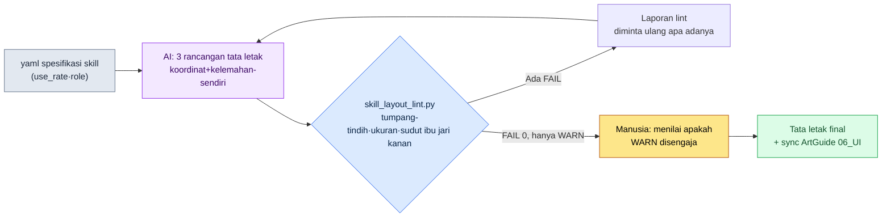

# 9.2 Penataan Tombol Skill — AI Menyusun 3 Rancangan Tata Letak, lint Menggugurkannya

> Pembaca utama: Game Designer UX·tempur untuk action·MMORPG mobile-first (tim skala menengah)
> Versi ringkas untuk pembaca solo/hobi: §9.2.7 "Versi Ringkas Solo"

Enam skill dari sebuah job baru — di mana dan bagaimana harus ditata pada layar mobile. Setiap kali pertanyaan ini muncul dalam rapat, 30 menit pertama selalu berjalan dengan pola yang sama. Seseorang menggambar enam lingkaran di papan tulis, orang lain berkata "ibu jari tidak sampai ke situ", lalu orang ketiga menimpali "kalau dinaikkan, minimap-nya tertutup". Ketiganya benar, tetapi tidak ada kesimpulan. Pada rapat berikutnya, papan tulis yang sama digambar ulang.

Masalahnya adalah bahwa pekerjaan menggambar rancangan tata letak dan pekerjaan memeriksa apakah rancangan itu mematuhi aturan bercampur aduk di dalam satu kepala. Orang yang menggambar sulit menggugurkan apa yang ia gambar sendiri. Bab ini memisahkan keduanya. **Pekerjaan membosankan menyusun banyak rancangan tata letak diserahkan kepada AI, dan apakah rancangan itu melanggar aturan tumpang-tindih·sudut ibu jari·ukuran sentuh, kodelah yang menggugurkannya.** Manusia hanya berdiri di tempat memilih satu rancangan dengan "rasa game" dari antara rancangan yang sudah diloloskan kode. Jika 9.1 menegakkan rulebook (buku aturan) untuk seluruh HUD, bab ini adalah satu siklus yang menerapkan rulebook itu sampai tuntas pada satu bagian yang paling sering disentuh tangan, yaitu tombol skill.

---

## 9.2.1 Mengapa Tombol Skill Sulit — Ini 'Informasi yang Ditekan', Bukan 'Informasi yang Dibaca'

Sebagian besar elemen di atas HUD hanya dibaca. Tidak ada yang menekan bar HP. Karena itu, pada gambar sudut ibu jari di §9.1, HP·MP·HP target boleh diletakkan di area baca atas yang tidak terjangkau tangan. Tombol skill justru kebalikannya. Harus ditekan dengan tepat dalam satuan 0.1 detik, dan saat bertempur, mata tertuju pada musuh sehingga jari mencari posisinya dari *ingatan*. Sedikit saja posisinya melenceng, mistap langsung terjadi di tempat itu.

Pada mobile MMORPG, grip dua tangan dalam mode landscape adalah standar, elemen yang ditekan diletakkan di kedua sudut bawah, sedangkan consumable/slot diletakkan di tengah bawah (mengapa landscape menjadi standar dan apa tiga area itu dibahas di §9.1). Dalam standar itu, hampir seluruh skill ditata pada **klaster sudut kanan bawah yang terjangkau ibu jari tangan kanan** (ibu jari tangan kiri terikat pada pergerakan di kiri bawah). Ada satu pembedaan — skill aktif yang ditekan dalam satuan 0.1 detik menempati klaster kanan bawah ini, sedangkan consumable·item otomatis·quick slot diletakkan terpisah pada deretan slot tengah bawah di antara kedua ibu jari. Bab ini hanya membahas tombol skill aktif, dan seluruh penilaian koordinat mengasumsikan grip dua tangan landscape.

Karena itu, penataan tombol skill terikat secara bersamaan pada tiga aturan deterministik — ukuran target sentuh minimum (HIG 44pt), jarak antartombol berdekatan (Material 8dp), dan jangkauan ibu jari (skill di sudut kanan bawah ibu jari kanan). Ketiganya adalah butir yang sudah ada di dalam rulebook yang ditegakkan di §9.1.1 dan dapat dinilai dengan koordinat serta ukuran, sehingga angka standar publiknya mengikuti rulebook itu (44pt sentuh·8dp jarak adalah angka resmi yang diakui, hanya sudut ibu jari kanan yang merupakan model konvensi industri). Ketiga hal inilah yang menjadi **input pertama bagi lint** yang akan menggugurkan rancangan AI di bab ini. Alih-alih "tombol ini agak kecil ya?", ketika kode berkata "skill_3 adalah 40pt sehingga kurang dari HIG 44pt", 30 menit di depan papan tulis itu lenyap.

Jika standar platform diletakkan berdampingan dengan PC, titik awal penataan menjadi jelas. PC bersifat presisi·massal, sedangkan mobile landscape terbatas pada sudut dua tangan (tabel perbandingan lengkap lihat rulebook §9.1). Jika hanya input skill yang dipisahkan, perbedaannya jelas — pada PC, skill dapat diletakkan di mana saja pada layar lewat hotkey karena jari tetap berada di keyboard sehingga jangkauan bukan masalah dan jumlah slot pun bisa banyak. Pada mobile landscape tidak ada hover maupun hotkey, jadi skill harus ditata urut frekuensi pada **sudut kanan bawah yang terjangkau ibu jari kanan** (dengan batas 6\~8 yang muncul bersamaan), dan skill yang paling sering dipakai harus diletakkan di bagian dalam sudut (tempat yang paling mudah dijangkau). Karena itu, inti penataan skill mobile bukanlah "penataan yang cantik", melainkan **"penataan prioritas urut frekuensi di dalam sudut ibu jari kanan + tinjauan rulebook"**. Dan pekerjaan menggambar banyak rancangan, jika dilakukan manusia dengan tangan, membosankan dan standarnya goyah setiap kali. Pekerjaan berulang yang membosankan dan tidak konsisten — itulah tempat AI mengerjakannya tanpa lelah dibanding manusia.

---

## 9.2.2 [Worked Transcript] Penataan 6 Skill Job Baru — Menyuruh AI Menyusun 3 Rancangan

Saya tunjukkan satu siklus penataan 6 skill aktif job baru 'Dukun' (Shaman) pada mobile, dari input hingga pembuangan, sampai tuntas. Berikut ini adalah reproduksi setia dari sesi kerja UI skill baru pada proyek penulis (MMORPG mobile-first, selanjutnya disebut "Proyek A"). Input dan prompt dapat langsung disalin dan dipakai, sedangkan keluarannya adalah rekonstruksi dari sesi nyata.

### Tahap 1 — Input: Spesifikasi Skill ke Tabel yang Dibaca Mesin

Frekuensi penggunaan dan karakter dasar 6 skill dibuat dalam yaml. Frekuensi penggunaan adalah nilai yang diambil dari log tempur di sheet data, jadi bukan angka yang dibuat-buat baru.

```yaml
# skill_set_shaman.yaml — 6 skill aktif job baru 'Dukun'
screen: { w: 2400, h: 1080, dpr: 3 }   # acuan landscape 6.x inci, pt = px / dpr
skills:
  - id: s1_quickbolt    # serangan dasar, paling sering
    use_rate: 0.41      # rasio penggunaan saat tempur (ekstraksi log)
    role: spam          # ditekan beruntun
  - id: s2_hex          # debuff, sering
    use_rate: 0.22
    role: core
  - id: s3_totem        # tipe pasang, biasa
    use_rate: 0.14
    role: core
  - id: s4_heal         # pemulihan, jarang tetapi darurat
    use_rate: 0.11
    role: panic         # langsung saat genting
  - id: s5_curse        # debuff area, jarang
    use_rate: 0.08
    role: situational
  - id: s6_ultimate     # ultimate, langka
    use_rate: 0.04
    role: burst
```

Slot intinya adalah `use_rate` dan `role`. `s1_quickbolt` (41%) yang paling sering ditekan dan `s4_heal` (panic) yang harus ditemukan dalam 0.2 detik saat genting harus berada di tempat yang paling mudah dijangkau ibu jari kanan (bagian dalam sudut kanan bawah). `s6_ultimate` (4%) yang jarang dipakai boleh agak jauh di pinggir sudut. Prioritas inilah seluruh input bagi penataan AI pada tahap berikutnya.

### Tahap 2 — Prompt: Memaksa 3 Rancangan dan Menerima Koordinat sebagai Angka

```
yaml terlampir adalah 6 skill aktif job baru. Buatkan 3 rancangan tata letak tombol skill pada layar dua tangan grip landscape. Tata skill di sudut kanan bawah yang terjangkau ibu jari tangan kanan (tangan kiri terikat pada pergerakan di kiri bawah).
Ketiga rancangan dengan filosofi berbeda — misalnya kipas sudut, grid 2 baris, atau gaya berbobot frekuensi. Beri x,y,w,h dalam px untuk tiap tombol (layar 2400x1080, dpr 3, pt=px/3).
Skill yang sering dipakai atau role=panic letakkan di bagian dalam sudut yang mudah dijangkau ibu jari kanan, target sentuh 132px (44pt) ke atas, jarak antar tombol 24px (8dp) ke atas.
Untuk tiap rancangan, tuliskan juga satu baris maksud desain dan satu kelemahan yang kamu lihat — rancangan tanpa kelemahan tidak diterima. Per rancangan cukup (filosofi penataan|tabel koordinat|maksud desain|kelemahan-sendiri) saja, tanpa penjelasan.
```

Dalam prompt ini, bagian yang lebih digarap ketimbang instruksi penataan adalah bagian yang memaksa format keluaran dan pelaporan kelemahan. Jika koordinat tidak diterima sebagai angka, lint tidak bisa dijalankan, jadi keluaran px dipatok mati, dan dengan menyuruhnya menyertakan "1 kelemahan rancangan ini", AI dibuat menyebutkan batasannya sendiri lebih dulu. Jika diminta bebas "buatkan UI yang cantik", yang keluar adalah tata letak rata-rata RPG mobile umum, tanpa gambar, hanya dengan kata-kata.

### Tahap 3 — Keluaran Claude (rekonstruksi sesi nyata, kutipan)

```
== Rancangan A: Kipas Sudut Kanan Bawah ==
Filosofi penataan: 6 tombol disusun berbentuk kipas berpusat pada poros putar ibu jari kanan. Urut frekuensi dari dalam→luar.
| id          | x    | y   | w   | h   | pt   |
|-------------|------|-----|-----|-----|------|
| s1_quickbolt| 2160 | 912 | 168 | 168 | 56pt |
| s2_hex      | 2016 | 852 | 132 | 132 | 44pt |
| s3_totem    | 2052 | 996 | 132 | 132 | 44pt |
| s4_heal     | 1884 | 924 | 132 | 132 | 44pt |
| s5_curse    | 1920 | 780 | 120 | 120 | 40pt |
| s6_ultimate | 1788 | 840 | 120 | 120 | 40pt |
Maksud desain: s1 yang sering dipakai diletakkan paling besar di bagian dalam sudut kanan bawah yang mudah dijangkau.
Kelemahan-sendiri: s5,s6 dengan 40pt mungkin kurang dari HIG. Bagian luar kipas ambigu bagi jangkauan ibu jari kanan.

== Rancangan B: Grid 2 Baris (2x3) ==
Filosofi penataan: kisi 2 barisx3 kolom di kanan bawah. Mengutamakan keselarasan visual.
| id          | x    | y   | w   | h   |
|-------------|------|-----|-----|-----|
| s1_quickbolt| 2208 | 912 | 132 | 132 |
| s2_hex      | 2052 | 912 | 132 | 132 |
| s3_totem    | 1896 | 912 | 132 | 132 |
| s4_heal     | 2208 | 756 | 132 | 132 |
| s5_curse    | 2052 | 756 | 132 | 132 |
| s6_ultimate | 1896 | 756 | 132 | 132 |
Maksud desain: semua tombol berukuran sama, penyelarasan rapi.
Kelemahan-sendiri: baris atas (s4,s5,s6, y=756) berada di batas atas sudut ibu jari kanan sehingga jangkauannya ambigu.
         s4 pemulihan darurat di baris atas, mungkin lambat ditemukan saat genting.

== Rancangan C: Kipas Berbobot Frekuensi ==
Filosofi penataan: s1 sebagai lingkaran besar di pusat, sisanya dililitkan urut frekuensi pada poros putar ibu jari kanan.
| id          | x    | y   | w   | h   |
|-------------|------|-----|-----|-----|
| s1_quickbolt| 2184 | 900 | 180 | 180 |
| s2_hex      | 2028 | 852 | 144 | 144 |
| s3_totem    | 2052 | 996 | 132 | 132 |
| s4_heal     | 1908 | 912 | 144 | 144 |
| s5_curse    | 1932 | 792 | 120 | 120 |
| s6_ultimate | 1812 | 972 | 120 | 120 |
Maksud desain: tangan secara alami menuju s1, dan s4 darurat diperbesar di bagian dalam sudut.
Kelemahan-sendiri: karena berbentuk kipas, jarak antartombol tidak merata. Ada kekhawatiran tabrakan berdekatan s2-s5, s4-s6.
```

Inti dari keluaran ini adalah bahwa ketiga rancangan melaporkan kelemahan-sendiri. A "khawatir kurang dari 40pt", B "pemulihan darurat di baris atas", C "khawatir tabrakan berdekatan". AI lebih dulu menunjuk titik lemah dari gambar yang ia buat sendiri. Tetapi ini hanya pelaporan-sendiri; penilaian sebenarnya dilakukan kode.

### Tahap 4 — lint: Kode Menggugurkan Ketiga Rancangan

Jika ketiga rancangan dibandingkan dengan mata, lagi-lagi mulai perdebatan selera "B kelihatan rapi, ya". Karena itu, ketiga rancangan langsung dimasukkan ke `skill_layout_lint.py` di §9.2.3. Hasilnya seperti ini.

```
[Rancangan A] Kipas Sudut Kanan Bawah
  [FAIL] B-size  : s5_curse 40pt < 44pt (kurang dari HIG)
  [FAIL] B-size  : s6_ultimate 40pt < 44pt (kurang dari HIG)
  [WARN] C-corner: s6_ultimate x=1788 — batas kiri sudut, jangkauan ibu jari kanan 'biasa'
  → lolos 4/6, pelanggaran fatal 2

[Rancangan B] Grid 2 Baris (2x3)
  [FAIL] C-corner: s4_heal     y=756 (0.70h) < 0.55h bukan di bawah → atas sudut ibu jari kanan
  [FAIL] C-corner: s5_curse    y=756 (0.70h) < 0.55h bukan di bawah → atas sudut ibu jari kanan
  [WARN] role    : s4_heal(panic) y=756 — skill darurat di baris atas
  → lolos 4/6, pelanggaran fatal 2

[Rancangan C] Kipas Berbobot Frekuensi
  [FAIL] A-overlap: s2_hex ∩ s5_curse jarak 18px < 24px (kurang dari 8dp)
  [FAIL] A-overlap: s4_heal ∩ s6_ultimate jarak 12px < 24px (kurang dari 8dp)
  → lolos 4/6, pelanggaran fatal 2
```

Ketiga rancangan sama-sama gugur. Menariknya, pelaporan-sendiri dan penilaian lint hampir bertumpang tindih. Pelanggaran benar-benar terjadi di tempat yang AI sebut sebagai "kelemahan". Tetapi pelaporan-sendiri adalah "kekhawatiran", sedangkan lint adalah angka "jarak s2_hex dan s5_curse 18px". Tidak ada yang perlu diperdebatkan dalam rapat.

Ada satu keputusan penting pada tahap ini. Meski ketiga rancangan gugur, kita tidak kembali ke awal. **Laporan lint langsung ditempelkan ke prompt berikutnya untuk diminta ulang.**

### Tahap 5 — Permintaan Ulang: Memasukkan Laporan lint Apa Adanya

```
Tempelkan hasil lint ketiga rancangan apa adanya (laporan di atas). Dari ketiganya, pilih satu rancangan yang pelanggarannya paling mudah diperbaiki, lalu beri satu rancangan revisi yang membuat semua FAIL menjadi 0.
Semua tombol 132px (44pt) ke atas, jarak 24px (8dp) ke atas, dan s4_heal(panic) di tempat yang paling mudah dijangkau setelah s1 di dalam sudut ibu jari kanan.
Beri hanya tabel koordinat, dan tuliskan satu baris demi satu baris FAIL mana yang diselesaikan dengan cara apa.
// (maksud: dalam sudut = x>70% lebar (1680), y>55% tinggi (594))
```

AI memilih rancangan A (kipas sudut). Karena pelanggarannya hanya "dua tombol kurang ukuran", jadi paling sedikit yang perlu disentuh. Ia memperbesar s5·s6 yang gugur karena kecil menjadi 132px, lalu sedikit mendorong kurva kipas ke bagian dalam sudut sebesar penambahan itu untuk mengamankan jarak, dan menghasilkan rancangan revisi.

```
== Rancangan A' (revisi) ==
| id          | x    | y   | w   | h   | pt   |
|-------------|------|-----|-----|-----|------|
| s1_quickbolt| 2160 | 900 | 168 | 168 | 56pt |
| s2_hex      | 2010 | 846 | 132 | 132 | 44pt |
| s3_totem    | 2046 | 990 | 132 | 132 | 44pt |
| s4_heal     | 1872 | 918 | 144 | 144 | 48pt |
| s5_curse    | 1908 | 774 | 132 | 132 | 44pt |
| s6_ultimate | 1740 | 858 | 132 | 132 | 44pt |
Terselesaikan: B-size s5 40→44pt / B-size s6 40→44pt /
     C-corner s6 x=1740(0.725w)·y=858(0.79h) tetap di dalam sudut →
     role: s4_heal diperbesar ke 144px untuk memperkuat identifikasi darurat.
```

Rancangan A' dimasukkan lagi ke `skill_layout_lint.py`.

```
[Rancangan A'] Kipas Sudut Kanan Bawah (revisi)
  [PASS] B-size  : semua tombol ≥ 44pt
  [PASS] A-overlap: jarak minimum 30px ≥ 24px
  [PASS] C-corner : semua tombol kontrol di dalam sudut ibu jari kanan (x≥1680, y≥594)
  [WARN] C-corner : s6_ultimate x=1740 — ujung kiri sudut, jangkauan 'biasa'
  → lolos 6/6, pelanggaran fatal 0, WARN 1
```

FAIL menjadi 0. Sisa 1 WARN (`s6_ultimate` di ujung kiri sudut sehingga jangkauan ibu jari kanan bukan 'mudah' melainkan 'biasa') tidak dimatikan kode secara otomatis. Itu diserahkan ke manusia. Dan WARN ini sebenarnya **desain yang disengaja**. s6 adalah ultimate yang paling langka dipakai dengan frekuensi penggunaan 4%, jadi memang tepat bila tempat paling dalam di sudut diserahkan kepada s1 yang sering dipakai dan s6 diletakkan di pinggir. Manusia menilai "WARN ini disengaja" lalu meloloskannya. Satu siklus input → menghasilkan 3 rancangan → lint → gugur total → permintaan ulang → lolos ditutup di sini.

Satu putaran ini adalah standar Show bab ini. Jika tidak menyaksikan sampai tuntas apa yang AI gambar, apa yang lint gugurkan, dan WARN mana yang manusia selamatkan, kalimat "saya menarik rancangan UI dengan AI" menjadi kosong.

---

## 9.2.3 lint sebagai Kode — Tumpang-Tindih·Sudut Ibu Jari·Ukuran HIG

Jantung siklus di atas adalah sekitar 30 baris kode yang menggugurkan tiga aturan. Tiga butir di tabel §9.2.1 langsung menjadi tiga fungsi.

```python
# skill_layout_lint.py — verifikasi penataan tombol skill (kerangka)
# Input: daftar koordinat tombol yang dihasilkan AI [{id, x, y, w, h, role, use_rate}]
# Output: daftar pelanggaran A-overlap / B-size / C-corner
# Asumsi: grip dua tangan landscape. Skill ditata di sudut kanan bawah yang terjangkau ibu jari tangan kanan.

MIN_TAP_PX    = 132    # HIG 44pt * dpr 3 = 132px
MIN_GAP_PX    = 24     # Material 8dp * dpr 3 = 24px
RIGHT_CORNER_X = 0.70  # kanan dari 0.70 lebar layar = sudut ibu jari kanan
BOTTOM_Y       = 0.55  # bawah dari 0.55 tinggi layar = sudut bawah

def in_right_thumb_corner(b, w, h):
    """Apakah ini sudut kanan bawah yang terjangkau ibu jari tangan kanan pada grip landscape.
    (ibu jari kiri=pergerakan kiri bawah, ibu jari kanan=skill kanan bawah)"""
    rx, ry = b["x"] / w, b["y"] / h
    return rx > RIGHT_CORNER_X and ry > BOTTOM_Y

def lint(buttons, screen_w, screen_h):
    issues = []
    # Aturan B: ukuran minimum target sentuh (HIG 44pt)
    for b in buttons:
        side = min(b["w"], b["h"])
        if side < MIN_TAP_PX:
            issues.append(f"[FAIL] B-size : {b['id']} {side//3}pt "
                          f"< 44pt (kurang dari HIG)")
    # Aturan A: tumpang-tindih/jarak tombol berdekatan (jarak dua tepi terdekat)
    for i, a in enumerate(buttons):
        for c in buttons[i+1:]:
            gap = edge_gap(a, c)          # jarak terpendek dua persegi (px)
            if gap < MIN_GAP_PX:
                issues.append(f"[FAIL] A-overlap: {a['id']} ∩ {c['id']} "
                              f"jarak {gap}px < {MIN_GAP_PX}px (kurang dari 8dp)")
    # Aturan C: elemen kontrol di dalam sudut ibu jari kanan. panic makin di dalam sudut makin baik.
    for b in buttons:
        rx, ry = b["x"] / screen_w, b["y"] / screen_h
        if not in_right_thumb_corner(b, screen_w, screen_h):
            issues.append(f"[FAIL] C-corner: {b['id']} "
                          f"x={b['x']}({rx:.2f}w) y={b['y']}({ry:.2f}h) "
                          f"→ di luar sudut ibu jari kanan")
        elif b.get("role") == "panic" and rx < 0.78:
            issues.append(f"[WARN] role   : {b['id']}(panic) "
                          f"skill darurat dekat batas dalam sudut")
    return issues
```

Kode ini melumpuhkan ucapan selera "rancangan B lebih cantik, lho" dalam rapat. Kecantikan adalah hal yang dibahas setelah lolos lint. Rancangan yang membuat lint memuntahkan `[FAIL]` tidak masuk build, cantik atau tidak. Inilah penerapan gerbang lint HUD yang ditegakkan di §9.1.1 sampai tuntas pada satu bagian paling rumit, yaitu tombol skill — pembagian tugas bahwa apa yang dapat dinilai dengan koordinat·ukuran dikerjakan kode, sedangkan penilaian 'apakah WARN ini disengaja' diserahkan ke manusia, juga berlaku sama di sini.

Jika seluruh siklus dilihat sekilas, jadinya seperti ini.



Tempat yang disentuh tangan manusia hanya dua. Bagian paling depan yang memasukkan spesifikasi input dengan bersih, dan bagian paling belakang yang menilai WARN yang tak bisa dimatikan lint. Penghasilan 3 rancangan yang membosankan dan pemeriksaan koordinat di antara keduanya dijalankan oleh AI dan lint.

---

## 9.2.4 Mencatat Tingkat Kelulusan — Melihat Performa Alat dalam Angka

Jika hanya menarik rancangan tata letak sekali lalu selesai, tidak bisa diketahui apakah alat ini bekerja baik. Karena itu, hasil lint dicatat ke log setiap kali. Nilai yang dicatat sederhana — **berapa banyak rancangan AI lolos lint pertama (tingkat kelulusan pertama), dan dalam berapa kali permintaan ulang mencapai FAIL 0 (jumlah bolak-balik).**

Angka di bawah ini adalah nilai terukur yang penulis hitung sendiri saat menyusun UI skill untuk 3 job baru (Dukun ditambah 2 job lain) dengan siklus ini. Karena sampelnya kecil dengan 3 job (9 kali sesi penataan), bacalah sebagai nilai arah, bukan parameter populasi yang presisi. Tidak ada angka yang diolah.

| Butir | Terukur | Catatan |
|---|---|---|
| Rancangan pertama AI yang lolos lint pertama | 1 dari 9 kali | 8 kali sisanya 1 FAIL atau lebih |
| Rata-rata jumlah FAIL saat lolos pertama | 1.8 per rancangan | sebagian besar kurang ukuran atau di luar sudut ibu jari kanan |
| Rata-rata bolak-balik hingga FAIL 0 | 1.4 kali | metode memasukkan ulang laporan lint |
| Tipe FAIL paling umum | B-size (kurang ukuran) | berikutnya C-corner (sudut ibu jari kanan) |

Baris terpenting adalah yang pertama. **Rancangan pertama yang AI hasilkan gagal lolos lint 8 dari 9 kali.** Ini bukan kegagalan alat, melainkan tanda kerja normal. Jika AI dibiarkan menghasilkan koordinat bebas, ia sering melanggar HIG 44pt. lint menangkapnya setiap kali, dan jika laporannya dimasukkan ulang, dalam 1\~2 bolak-balik menjadi 0. Seandainya tingkat kelulusan pertama 100%, itu berarti lint terlalu longgar, bukan berarti AI sempurna.

Log tingkat kelulusan ini juga menjadi dasar memutuskan apakah aturan lint perlu diperketat atau dilonggarkan. Jika suatu tipe FAIL selalu dilepaskan ke tangan manusia dengan dalih "sebenarnya disengaja", aturan itu terlalu ketat. Sebaliknya, jika setelah rilis muncul keluhan mistap tetapi lint meloloskannya, aturannya longgar.

---

## 9.2.5 Menggambar Rancangan Final — SVG Penataan Tombol

Jika rancangan A' yang lolos lint di §9.2.2 digambar sesuai koordinatnya, hasilnya seperti di bawah. Bagaimana wujud angka di tabel pada layar nyata baru terasa di tangan setelah dilihat sebagai gambar. Pada postur menggenggam ponsel landscape dengan dua tangan, ibu jari tangan kiri menyentuh kiri bawah (pergerakan), ibu jari tangan kanan menyentuh kanan bawah (klaster skill). Ukuran lingkaran sebanding dengan target sentuh (pt), dan warnanya menunjukkan tingkat kesulitan jangkauan ibu jari (hijau mudah / kuning biasa).

<svg viewBox="0 0 660 340" xmlns="http://www.w3.org/2000/svg" role="img" aria-label="SVG rancangan final klaster sudut kanan bawah 6 tombol skill Dukun (layar landscape)">
  <!-- garis luar ponsel (landscape) -->
  <rect x="20" y="30" width="620" height="280" rx="30" ry="30" fill="#0f1117" stroke="#3a3f4b" stroke-width="3"/>
  <rect x="34" y="44" width="592" height="252" rx="14" ry="14" fill="#11151d"/>
  <!-- band status atas (merah — hanya baca) -->
  <rect x="34" y="44" width="592" height="56" fill="#7f1d1d" opacity="0.42"/>
  <text x="330" y="92" fill="#fecaca" font-family="sans-serif" font-size="12" text-anchor="middle">Atas — khusus tampilan status (HP · MP · Target, hanya baca)</text>
  <!-- layar game tengah -->
  <text x="300" y="190" fill="#5b6675" font-family="sans-serif" font-size="13" text-anchor="middle">Layar game (tempat pertempuran terjadi)</text>
  <!-- sudut ibu jari kiri bawah (hijau, pergerakan) -->
  <path d="M34 296 L34 156 A140 140 0 0 1 174 296 Z" fill="#14532d" opacity="0.55"/>
  <path d="M34 156 A140 140 0 0 1 174 296" fill="none" stroke="#22c55e" stroke-width="2" stroke-dasharray="5 4" opacity="0.7"/>
  <circle cx="90" cy="240" r="18" fill="#166534" stroke="#22c55e" stroke-width="2"/>
  <text x="90" y="238" fill="#bbf7d0" font-size="9" text-anchor="middle" font-weight="bold">Gerak</text>
  <text x="90" y="249" fill="#86efac" font-size="6" text-anchor="middle">jempol kiri</text>
  <!-- sudut ibu jari kanan bawah (batas garis putus hijau, klaster skill) -->
  <path d="M626 296 L626 156 A140 140 0 0 0 486 296 Z" fill="#14532d" opacity="0.30"/>
  <path d="M626 156 A140 140 0 0 0 486 296" fill="none" stroke="#22c55e" stroke-width="1.5" stroke-dasharray="5 4" opacity="0.7"/>
  <text x="556" y="138" fill="#86efac" font-family="sans-serif" font-size="10" text-anchor="middle">sudut 'mudah' jempol kanan ↘</text>
  <!-- titik info baca atas (referensi) -->
  <circle cx="70" cy="72" r="8" fill="#7f1d1d"/><text x="70" y="76" fill="#fecaca" font-size="8" text-anchor="middle">HP</text>
  <circle cx="120" cy="72" r="8" fill="#7f1d1d"/><text x="120" y="76" fill="#fecaca" font-size="8" text-anchor="middle">MP</text>
  <circle cx="330" cy="68" r="8" fill="#7f1d1d"/><text x="330" y="72" fill="#fecaca" font-size="7" text-anchor="middle">Target</text>
  <circle cx="588" cy="72" r="8" fill="#7f1d1d"/><text x="588" y="76" fill="#fecaca" font-size="8" text-anchor="middle">Peta</text>
  <!-- 6 tombol skill: klaster sudut kanan bawah. ukuran=sebanding pt, s1 maksimum di dalam sudut -->
  <!-- s1 56pt maksimum hijau, paling dalam di sudut (mudah dijangkau jempol kanan) -->
  <circle cx="590" cy="248" r="22" fill="#14532d" stroke="#22c55e" stroke-width="2.5"/>
  <text x="590" y="246" fill="#bbf7d0" font-size="10" text-anchor="middle" font-weight="bold">s1</text>
  <text x="590" y="257" fill="#86efac" font-size="7" text-anchor="middle">56pt</text>
  <!-- s2 44pt -->
  <circle cx="552" cy="234" r="17" fill="#166534" stroke="#22c55e" stroke-width="2"/>
  <text x="552" y="232" fill="#bbf7d0" font-size="9" text-anchor="middle">s2</text>
  <text x="552" y="242" fill="#86efac" font-size="6" text-anchor="middle">44</text>
  <!-- s3 44pt -->
  <circle cx="562" cy="276" r="17" fill="#166534" stroke="#22c55e" stroke-width="2"/>
  <text x="562" y="274" fill="#bbf7d0" font-size="9" text-anchor="middle">s3</text>
  <text x="562" y="284" fill="#86efac" font-size="6" text-anchor="middle">44</text>
  <!-- s4 heal 48pt, panic ditonjolkan -->
  <circle cx="516" cy="256" r="19" fill="#166534" stroke="#facc15" stroke-width="3"/>
  <text x="516" y="254" fill="#fef08a" font-size="9" text-anchor="middle" font-weight="bold">s4</text>
  <text x="516" y="264" fill="#fde68a" font-size="6" text-anchor="middle">darurat</text>
  <!-- s5 44pt -->
  <circle cx="524" cy="218" r="17" fill="#166534" stroke="#22c55e" stroke-width="2"/>
  <text x="524" y="216" fill="#bbf7d0" font-size="9" text-anchor="middle">s5</text>
  <text x="524" y="226" fill="#86efac" font-size="6" text-anchor="middle">44</text>
  <!-- s6 44pt, WARN kuning(biasa), ujung kiri sudut -->
  <circle cx="486" cy="240" r="17" fill="#3f3f1a" stroke="#f59e0b" stroke-width="2.5"/>
  <text x="486" y="238" fill="#fde68a" font-size="9" text-anchor="middle">s6</text>
  <text x="486" y="248" fill="#fbbf24" font-size="6" text-anchor="middle">biasa</text>
  <!-- legenda -->
  <circle cx="70" cy="285" r="5" fill="#166534" stroke="#22c55e"/><text x="80" y="288" fill="#86efac" font-size="8" text-anchor="start">mudah</text>
  <circle cx="150" cy="285" r="5" fill="#3f3f1a" stroke="#f59e0b"/><text x="160" y="288" fill="#fbbf24" font-size="8" text-anchor="start">biasa (s6=ultimate langka, disengaja)</text>
</svg>

Dilihat sebagai gambar, WARN terakhir di laporan lint langsung dipahami. Hanya `s6_ultimate` (kuning) yang berada di ujung kiri sudut kanan bawah, tempat jangkauan ibu jari kanan 'biasa'. Tetapi s6 adalah ultimate dengan frekuensi penggunaan 4%, jadi memang tepat diletakkan di pinggir sudut. s1 yang paling sering dipakai (hijau, maksimum 56pt) diletakkan di kanan bawah bagian dalam sudut yang paling mudah dijangkau ibu jari kanan, dan s4 pemulihan darurat (garis tepi kuning) diperbesar agar tangan cepat menemukannya saat genting. Ibu jari tangan kiri terikat pada 'pergerakan' kiri bawah, jadi seluruh skill berkumpul di sudut kanan. Bahwa satu tabel koordinat tepat sama dengan satu gambar — itulah alasan koordinat diterima sebagai angka.

---

## 9.2.6 Kegagalan yang Umum

| Pola | Mengapa gagal | Resep |
|---|---|---|
| Menggambar lingkaran saja di papan tulis lalu rapat | Tanpa koordinat lint mustahil, perdebatan selera berulang | Terima koordinat dalam px lalu masukkan ke lint (§9.2.2) |
| Menyerahkan bulat-bulat "AI, buatkan UI skill yang cantik" | Tanpa rulebook hasilnya tata letak rata-rata RPG umum | Prompt yang memaksa 3 rancangan+koordinat+kelemahan-sendiri |
| Menata dengan asumsi grip satu tangan portrait | MMORPG standarnya dua tangan landscape, skill di sudut ibu jari kanan | lint dengan acuan landscape 2400x1080, sudut kanan bawah |
| Membandingkan rancangan hanya dengan mata | Kurang HIG·tumpang-tindih luput setiap kali | Penilaian otomatis dengan `skill_layout_lint.py` |
| Rancangan pertama lolos lint → tenang menganggap alat sudah baik | Bisa jadi tanda lint longgar | Periksa pengetatan aturan lewat log tingkat kelulusan (§9.2.4) |
| Kode memblokir otomatis sampai WARN | Membunuh sampai tata letak yang disengaja (ultimate langka) | WARN diserahkan ke penilaian manusia (§9.2.3) |

Yang kelima paling sering luput. Jika rancangan pertama AI selalu lolos, memang menyenangkan, tetapi itu biasanya berarti aturan lint longgar. Gugur 8 dari 9 kali adalah keadaan yang sehat.

---

## 9.2.7 Coba Sendiri — Satu Langkah yang Bisa Dilakukan Hari Ini

> **Versi Ringkas Solo**: Kode lint pun tidak perlu. Pilihlah 4\~6 skill dari game Anda sendiri (atau game favorit Anda), tulis tangan spesifikasi berformat §9.2.1 (use_rate cukup peringkat frekuensi kasar), lalu tempelkan apa adanya prompt §9.2.2 untuk menerima 3 rancangan. Setelah itu, alih-alih meteran, cukup masukkan "44pt = 132px" ke kepala, lalu cari tangan tombol di bawah 132px pada tabel koordinat yang AI hasilkan dan lingkari. Lalu, anggaplah layar landscape, dan tunjuk juga apakah ada skill yang jatuh di luar sudut kanan bawah (kanan dari 70% lebar + bawah dari 55% tinggi). Satu kali itu mengajarkan secara badani apa yang dikerjakan lint.

Jika Anda dalam tim, mulailah dengan satu langkah berikut. Tetapkan dulu sebagai kode tiga fungsi `skill_layout_lint.py` di §9.2.3 (ukuran·jarak·sudut ibu jari kanan). Tiga fungsi sudah cukup. Dengan adanya rulebook, baik rancangan AI maupun rancangan desainer dapat diukur dengan garis yang sama, dan hanya rancangan yang lolos lint yang berlanjut ke `96_ArtGuide/06_UI/` tim seni lalu di-sync otomatis lewat jalur `_convert_md_to_html.py` → `_SyncToArtRepo.bat`. Sebelum koordinat final sampai ke tim seni, tugas terakhir manusia hanyalah menilai satu WARN sebagai "disengaja".

---

### Poin-Poin Penting
- Tombol skill adalah 'informasi yang ditekan', jadi melenceng satu posisi koordinat saja pun menimbulkan mistap.
- MMORPG mobile adalah grip dua tangan landscape — skill ditata di klaster sudut kanan bawah ibu jari kanan.
- AI menyusun 3 rancangan, dan lint menggugurkan tumpang-tindih·ukuran·sudut ibu jari kanan (HIG 44pt).
- Rancangan pertama AI gugur 8 dari 9 kali adalah tanda lint yang sehat.

### Pratinjau Bab Berikutnya
- 9.3 Kolaborasi ArtGuide/06_UI — standar kolaborasi yang menyerahkan keputusan UI final ke tim seni non-Game Designer lewat sync otomatis md→html.
