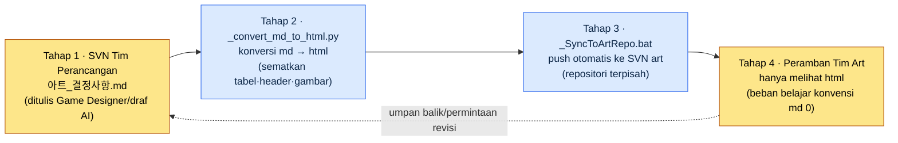

# 9.3 ArtGuide/06_UI Kolaborasi — Game Designer Menulis dengan md, Tim Art Hanya Melihat html

> Pembaca utama: Game Designer UX/UI yang setiap hari berkolaborasi dengan rumpun non-perancang (art) (tim berukuran menengah)
> Versi ringkas untuk pembaca solo/hobi: §9.3.8 "Versi Ringkas Solo"

Pekerjaan menjadi rapi ketika Game Designer merangkum keputusan UI dalam Markdown. Versinya terkelola, diff-nya terlihat, dan bisa langsung dilemparkan ke AI. Masalahnya, tim art tidak membaca Markdown. Lebih tepatnya, mereka tidak punya alasan untuk membacanya. Jika Anda berkata kepada seorang art designer, "Tolong ambil `아트_결정사항.md` dari SVN dan baca," separuhnya belum memasang klien SVN, dan separuh lainnya membuka berkas itu di Notepad dengan header `##` dan sintaksis tabel yang berantakan, lalu bertanya, "Ini bagaimana cara melihatnya?"

Resep yang salah di sini adalah "mari ajari tim art Markdown". Waktu seorang art designer harus dipakai untuk menggeser piksel. Setiap waktu yang dipakai untuk mempelajari konvensi Markdown, checkout SVN, dan cara membaca diff adalah kerugian total. Resep yang benar adalah **mengotomatiskan konversi dan penyampaian dari sisi Game Designer, sehingga beban belajar tim art menjadi 0**. Game Designer menulis dengan md, sebuah skrip mengubahnya menjadi html, skrip lain mendorongnya ke repositori art, dan tim art hanya melihat html di peramban. Bab ini benar-benar menjalankan pipeline itu satu kali sampai tuntas — dari tempat draf keputusan ditarik dengan AI, otomatisasi konversi dan penyampaian, hingga apa yang ditolak oleh manusia.

---

## 9.3.1 Titik Sebenarnya di Mana Kolaborasi Patah adalah 'Format'

Banyak buku merangkum alasan patahnya kolaborasi antara perancangan dan art sebagai "wewenang keputusan yang kabur". Siapa yang menentukan warna dan siapa yang menentukan fungsi. Pembagian itu memang penting, tetapi sebaik apa pun Anda menggambar tabel pembagian, **kalau tim art tidak bisa membaca tabel pembagian itu**, tidak akan terjadi apa-apa. Di lapangan, titik yang lebih sering memicu insiden bukan wewenang keputusan, melainkan format penyampaian.

Pada proyek penulis (MMORPG dengan prioritas seluler, selanjutnya "Proyek A"), insiden yang benar-benar berulang adalah seperti berikut.

| Insiden | Penyebab di permukaan | Penyebab sebenarnya |
|---|---|---|
| Art bekerja dengan keputusan versi lama | "Saya belum menerima yang terbaru" | Penyampaian manual (lampiran email), jadi terlewat |
| Tabel keputusan tampak berantakan | "Kok jadi begini ya" | Karena membuka md di Notepad |
| "Keputusan itu tertulis di mana?" | Penyampaian lisan | Sumber kanonik (canonical) tercerai-berai di obrolan |

Ketiga insiden bukan soal wewenang keputusan. Semuanya muncul karena **dokumen kanonik tidak tersampaikan dalam format yang dibaca tim art, secara otomatis, dan selalu dalam keadaan terbaru**. Karena itu, alat dalam bab ini bukan tabel pembagian, melainkan pipeline penyampaian. Pembagian selesai begitu disepakati sekali, tetapi penyampaian terjadi setiap kali keputusan berubah.

Mari kita lihat dulu struktur folder sebenarnya. Panduan art Proyek A terbagi menjadi 7 domain di bawah `workspace/96_ArtGuide/`.

```
96_ArtGuide/
├── 00_Common/      # Umum (gaya·palet warna·standar pencahayaan)
├── 01_Character/
├── 02_Animation/
├── 03_Monster/
├── 04_NPC/
├── 05_VFX/
├── 06_UI/          # ← area yang dibahas bab ini
└── 07_Env/
```

Dan di dalam folder ini ada dua berkas operasional yang hidup berdampingan: `_convert_md_to_html.py` dan `_SyncToArtRepo.bat`. Kedua berkas inilah tulang punggung bab ini.

---

## 9.3.2 Pipeline Sync 4 Tahap — dari md Game Designer hingga Peramban Tim Art

Alur keseluruhannya empat tahap. Intinya adalah **manusia (Game Designer) hanya menyentuh md di tahap 1, sedangkan 3 tahap sisanya seluruhnya dijalankan oleh skrip**. Tim art hanya melihat html di tahap 4. Mereka bahkan tidak perlu tahu bahwa md itu ada.



Mari kita tegaskan apa persisnya yang dilakukan setiap tahap.

**Tahap 1 (Game Designer, manusia)** — Menulis keputusan dalam Markdown di `06_UI/아트_결정사항.md`. Cara menyisipkan AI di titik ini adalah tulang punggung §9.3.4. Keputusannya berupa item seperti "warna primary tombol #3A7BD5", "target sentuh minimum 44pt".

**Tahap 2 (`_convert_md_to_html.py`, otomatis)** — Mengonversi md menjadi html. Bukan konversi biasa, melainkan merender tabel agar enak dilihat tim art, menyematkan referensi gambar `` secara inline, dan menambahkan daftar isi. Hasilnya adalah html yang mandiri (self-contained), yang bisa dibuka seorang art designer dengan sekali klik ganda di peramban.

**Tahap 3 (`_SyncToArtRepo.bat`, otomatis)** — Mendorong (push) html hasil konversi ke **repositori SVN terpisah milik tim art**. Yang menjadi kunci adalah terpisahnya repositori perancangan dan repositori art. Tim art cukup melihat repositori mereka sendiri, dan tidak perlu mengetahui wewenang maupun struktur repositori perancangan.

**Tahap 4 (Tim art, manusia)** — Art designer membuka html yang tersinkron di repositori mereka sendiri lewat peramban. Mereka tidak perlu mempelajari sintaksis Markdown, perintah SVN, maupun cara membaca diff. **Beban belajar konvensi md sebesar 0** adalah tujuan rancangan sekaligus kriteria keberhasilan pipeline ini.

Umpan balik kembali dari tahap 4 ke tahap 1. Ketika art berkata "keputusan ini aneh", Game Designer memperbaiki md, lalu tahap 2–3 berjalan otomatis lagi. Art cukup membuka kembali html yang sudah diperbarui.

---

## 9.3.3 Mengapa Mengotomatiskan Konversi dan Penyampaian — Asimetri Beban Belajar

Di sini kita berhenti sejenak dan menegaskan maksud rancangannya. Pekerjaan mengubah md menjadi html, dalam dirinya sendiri, sepele. Rancangan yang sebenarnya terletak pada keputusan tentang **siapa memikul beban belajar siapa**.

Pilihannya bercabang dua.

<svg viewBox="0 0 640 300" xmlns="http://www.w3.org/2000/svg" role="img" aria-label="Perbandingan dua cara membagi beban belajar — opsi tim art belajar md vs opsi Game Designer memikul otomatisasi">
  <!-- 왼쪽: 잘못된 안 -->
  <rect x="20" y="20" width="280" height="260" rx="10" fill="#1a1014" stroke="#7f1d1d" stroke-width="2"/>
  <text x="160" y="48" fill="#fecaca" font-family="sans-serif" font-size="15" text-anchor="middle" font-weight="bold">Opsi A — Tim art belajar md</text>
  <rect x="50" y="70" width="100" height="44" rx="6" fill="#3a1518" stroke="#b91c1c"/>
  <text x="100" y="97" fill="#fca5a5" font-family="sans-serif" font-size="12" text-anchor="middle">Game Designer</text>
  <text x="100" y="135" fill="#fca5a5" font-family="sans-serif" font-size="11" text-anchor="middle">hanya menulis md</text>
  <line x1="150" y1="92" x2="190" y2="92" stroke="#b91c1c" stroke-width="2" marker-end="url(#arrowR)"/>
  <rect x="190" y="70" width="100" height="44" rx="6" fill="#3a1518" stroke="#b91c1c"/>
  <text x="240" y="91" fill="#fca5a5" font-family="sans-serif" font-size="12" text-anchor="middle">5 orang art</text>
  <text x="240" y="107" fill="#fca5a5" font-family="sans-serif" font-size="10" text-anchor="middle">×belajar SVN·md</text>
  <text x="160" y="170" fill="#fda4af" font-family="sans-serif" font-size="11" text-anchor="middle">Biaya belajar = 1× menulis ×</text>
  <text x="160" y="188" fill="#fda4af" font-family="sans-serif" font-size="11" text-anchor="middle">dikali sejumlah orang art</text>
  <text x="160" y="222" fill="#f87171" font-family="sans-serif" font-size="12" text-anchor="middle" font-weight="bold">Beban menggerogoti waktu</text>
  <text x="160" y="240" fill="#f87171" font-family="sans-serif" font-size="12" text-anchor="middle" font-weight="bold">kerja piksel → ditolak</text>
  <!-- 오른쪽: 채택안 -->
  <rect x="340" y="20" width="280" height="260" rx="10" fill="#0d1512" stroke="#15803d" stroke-width="2"/>
  <text x="480" y="48" fill="#bbf7d0" font-family="sans-serif" font-size="15" text-anchor="middle" font-weight="bold">Opsi B — Game Designer mengotomatiskan</text>
  <rect x="370" y="70" width="100" height="44" rx="6" fill="#0f2417" stroke="#16a34a"/>
  <text x="420" y="91" fill="#86efac" font-family="sans-serif" font-size="12" text-anchor="middle">Game Designer</text>
  <text x="420" y="107" fill="#86efac" font-family="sans-serif" font-size="10" text-anchor="middle">md+skrip 1×</text>
  <line x1="470" y1="92" x2="510" y2="92" stroke="#16a34a" stroke-width="2" marker-end="url(#arrowG)"/>
  <rect x="510" y="70" width="100" height="44" rx="6" fill="#0f2417" stroke="#16a34a"/>
  <text x="560" y="91" fill="#86efac" font-family="sans-serif" font-size="12" text-anchor="middle">5 orang art</text>
  <text x="560" y="107" fill="#86efac" font-family="sans-serif" font-size="10" text-anchor="middle">klik ganda html</text>
  <text x="480" y="170" fill="#86efac" font-family="sans-serif" font-size="11" text-anchor="middle">Biaya belajar = Game Designer 1×</text>
  <text x="480" y="188" fill="#86efac" font-family="sans-serif" font-size="11" text-anchor="middle">(beban art 0)</text>
  <text x="480" y="222" fill="#4ade80" font-family="sans-serif" font-size="12" text-anchor="middle" font-weight="bold">Art fokus hanya pada piksel</text>
  <text x="480" y="240" fill="#4ade80" font-family="sans-serif" font-size="12" text-anchor="middle" font-weight="bold">→ berkelanjutan</text>
  <defs>
    <marker id="arrowR" markerWidth="8" markerHeight="8" refX="6" refY="3" orient="auto"><path d="M0,0 L6,3 L0,6 Z" fill="#b91c1c"/></marker>
    <marker id="arrowG" markerWidth="8" markerHeight="8" refX="6" refY="3" orient="auto"><path d="M0,0 L6,3 L0,6 Z" fill="#16a34a"/></marker>
  </defs>
</svg>

Intinya adalah asimetri. Pada Opsi A, biaya belajar dikalikan sejumlah orang art, dan biaya itu kambuh lagi setiap kali ada karyawan baru. Pada Opsi B, Game Designer cukup menulis skrip satu kali dan selesai, dan biaya marginal di sisi art adalah 0. **Menumpukkan beban bukan ke pihak yang jumlah orangnya banyak, melainkan ke pihak yang bisa diotomatiskan** — inilah asas pertama alat kolaborasi dengan rumpun non-perancang. Begitu asas ini patah, yaitu ketika alat kolaborasi memaksa rumpun mitra mempelajari hal baru, alat itu akan "tidak terpakai lagi" dalam satu atau dua kuartal.

---

## 9.3.4 [Worked Transcript] Menarik Draf md Keputusan UI dengan AI

Tadi disebut bahwa di tahap 1 Game Designer menulis md. Sekarang saya tunjukkan satu siklus penuh tentang tempat di mana draf md itu ditarik dengan AI. Setelah rapat keputusan selesai, yang tersisa adalah catatan yang berserak (obrolan·foto papan tulis·kesepakatan lisan). Pekerjaan merapikan ini menjadi md keputusan kanonik membosankan, dan formatnya selalu goyah setiap kali. Ini pekerjaan yang pas untuk AI. Namun, batasnya yang menjadi kunci: **keputusan itu sendiri dibuat manusia, dan AI hanya merapikan keputusan ke dalam format yang sudah ditentukan**.

### Langkah 1 — Masukan: catatan rapat mentah

```
[Catatan rapat keputusan UI — terkait slot skill 06_UI, mentah]
- Ukuran tombol slot skill katanya mau diperbesar. Karena kekecilan di seluler.
- Warna diputuskan art. Tapi tone primary tetap pertahankan rumpun biru.
- Tampilan status slot nonaktif (cooldown) disepakati abu-abu + overlay angka
- Multibahasa... gimana kalau nama skill jadi panjang? Tunda dulu
- Oh dan long press untuk munculkan deskripsi skill (ini fungsi, fix perancangan)
```

### Langkah 2 — Prompt: paksa pemisahan keputusan/tunda/penanggung jawab

```
Lampirannya catatan rapat keputusan UI yang mentah. Tolong rapikan jadi Markdown keputusan untuk diserahkan ke tim art.
Klasifikasikan tiap item sebagai [FIX]/[TUNDA]/[KEPUTUSAN ART] (FIX = perancangan menentukan, art mengikuti; TUNDA = belum selesai + alasan; KEPUTUSAN ART = ekspresi visual jadi art yang menentukan · perancangan hanya memberi batasan), lalu lampirkan satu baris dasar/batasan tiap item — kalau catatan tidak ada dasarnya, tulis jujur 'dasar tidak dicatat' dan jangan isi dengan tebakan.
Untuk hal yang bisa diverifikasi lewat standar publik seperti ukuran sentuh, sebutkan standarnya, dan untuk item yang tidak ada di catatan jangan sekali-kali mengarang yang baru.
Tabelnya |item|klasifikasi|keputusan/batasan|dasar|dapat diverifikasi|, beri teks lengkap termasuk frontmatter (title, layer: L1).
```

Titik berat prompt ini tidak terletak pada pekerjaan merapikan, melainkan pada pemaksaan klasifikasi dan larangan mengarang. Jika Anda menyuruh AI merapikan keputusan, ia akan dengan ramah menambahkan "praktik terbaik" yang tidak ada di catatan. Tambahan itu terbaca oleh tim art sebagai "keputusan yang difinalkan perancangan". Karena itu kita memaku tiga hal: **klasifikasi [FIX]/[TUNDA]/[KEPUTUSAN ART], kewajiban dasar, dan "jangan mengarang kalau tidak ada di catatan"**.

### Langkah 3 — Keluaran mentah Claude (rekonstruksi sesi nyata)

```markdown
---
title: Keputusan 06_UI — Slot Skill
layer: L1
---

# Keputusan 06_UI — Slot Skill

| Item | Klasifikasi | Keputusan/Batasan | Dasar | Dapat diverifikasi |
|---|---|---|---|---|
| Ukuran tombol slot skill | [FIX] | Minimum 44×44 pt ke atas | Target sentuh seluler, Apple HIG menyarankan 44pt | ✅ koordinat·ukuran |
| Tone primary | [KEPUTUSAN ART] | Pertahankan rumpun biru (batasan), nilai persisnya art | Catatan: "tone primary tetap pertahankan rumpun biru" | △ nilai warna |
| Tampilan status cooldown | [FIX] | Overlay abu-abu + angka sisa | Kesepakatan rapat | ◯ tinjauan visual |
| Panjang multibahasa nama skill | [TUNDA] | Rapat berikutnya | Catatan: "tunda dulu" — bahasa panjang (Jerman·Rusia) belum diverifikasi | — |
| Deskripsi skill long press | [FIX] | Long press → tampilkan tooltip | Fungsi difinalkan (area perancangan) | ◯ tinjauan perilaku |
| Jarak antarslot | [FIX] | Minimum 8 dp disarankan | Dasar tidak dicatat — tidak ada di catatan, merujuk nilai saran Material | ✅ |
```

### Langkah 4 — Verifikasi dan penolakan (tempat manusia)

Keluaran ini tidak boleh langsung diunggah sebagai kanonik. Ada satu baris yang mengganjal.

Itu baris terakhir, `Jarak antarslot | Minimum 8 dp`. Kalau Anda melihat catatan lagi, soal jarak **tidak pernah muncul** dalam rapat. AI menilai "karena ini UI seluler, mestinya ada standar jarak juga", lalu dengan ramah menambahkan nilai saran Material Design. Ini pelanggaran aturan 5 ("dilarang mengarang item yang tidak ada di catatan"). AI memang menulis jujur `dasar tidak dicatat`, tetapi seharusnya ia tidak membuat itemnya sama sekali. Begitu baris ini sampai ke tim art, ia terbaca sebagai "perancangan memfinalkan jarak 8dp".

Karena itu saya minta ulang.

```
'Jarak antarslot' tidak ada di catatan rapat dan itu yang kamu tambahkan. Tolong hapus dari tabel.
Hal yang tidak ada di catatan tapi sepertinya perlu diputuskan, jangan di tabel, tapi taruh sebagai kandidat saja di '## Belum Selesai — Agenda Rapat Berikutnya' paling bawah, dan di tabel keputusan sisakan hanya item yang benar-benar ada di catatan.
```

AI mengeluarkan item jarak dari tabel, lalu memisahkan "Agenda rapat berikutnya: standar jarak antarslot (saat ini belum ditetapkan), penanganan panjang nama skill multibahasa" sebagai kandidat di paling bawah. Kini di tabel keputusan hanya tersisa yang benar-benar diputuskan dalam rapat, dan kandidat masuk akal yang muncul di benak AI diturunkan pangkatnya dari "fix" menjadi "agenda". Pemisahan ini penting karena, kalau di dokumen yang diterima tim art **apa yang sudah final dan apa yang masih dalam pembahasan tercampur, art akan mengira hal yang belum ditetapkan sebagai final lalu mulai bekerja**.

Dengan satu kali bolak-balik ini, tahap 1 (md) pun rampung. Kini ia lepas dari tangan manusia dan berpindah ke otomatisasi tahap 2–3.

---

## 9.3.5 Otomatisasi Tahap 2–3 — Manusia Tidak Menyentuh Konversi dan Penyampaian

md yang sudah jadi kini diproses oleh skrip. Kerangka skrip konversi sederhana.

```python
# _convert_md_to_html.py (kerangka)
# Masukan: 06_UI/*.md (keputusan yang ditulis Game Designer)
# Keluaran: .html dengan nama sama (berkas mandiri yang dibuka tim art di peramban)

def convert(md_path):
    md_text = read(md_path)
    front, body = split_frontmatter(md_text)          # ekstrak title·layer
    html_body = markdown_to_html(body, extensions=[
        "tables",        # render tabel (atasi tabel rusak yang dilihat art di Notepad)
        "fenced_code",
    ])
    html_body = embed_images_inline(html_body, base_dir=md_path.parent)
    # ↑ ubah referensi seperti  menjadi sematan inline →
    #   art tidak perlu menerima berkas gambar secara terpisah
    toc = build_toc(html_body)                         # bangun daftar isi otomatis
    return render_template(title=front["title"], toc=toc, body=html_body)
```

Yang menjadi kunci di sini adalah konversinya bukan sekadar md→html. Ada tiga hal tambahan. **Merender tabel dengan benar** (`|---|` rusak yang dilihat art di Notepad lenyap), **menyematkan gambar secara inline** (art tidak perlu menerima berkas gambar secara terpisah), dan **menambahkan daftar isi otomatis** (sepanjang apa pun keputusannya, art bisa melompat ke item yang diinginkan). Ketiga hal inilah yang membuat "cukup melihat html" benar-benar terwujud.

Skrip penyampaian dirangkai seperti ini.

```bat
REM _SyncToArtRepo.bat (kerangka)
REM 1) Konversi semua md di 06_UI menjadi html
python _convert_md_to_html.py 06_UI\*.md

REM 2) Salin html hasil konversi ke salinan kerja SVN art
xcopy 06_UI\*.html %ART_REPO%\UI\ /Y

REM 3) Commit·push otomatis ke SVN art (repositori terpisah)
svn add %ART_REPO%\UI\*.html --force
svn commit %ART_REPO%\UI -m "[auto] perbarui keputusan 06_UI"
```

Pekerjaan yang dilakukan Game Designer hanyalah sekali klik ganda `_SyncToArtRepo.bat` (atau memasang hook agar berjalan otomatis saat keputusan di-commit). Maka konversi·penyalinan·push repositori art berjalan sekaligus. Tim art tinggal memperbarui repositori mereka, dan html terbaru sudah tiba.

> **Sampai mana AI masuk** — Kode otomatisasi tahap 2–3 ini boleh saja disuruh ditulis oleh AI. "Tulis skrip yang menerima folder md, mengonversi menjadi html termasuk tabel·gambar, lalu push ke SVN terpisah" adalah area yang dikuasai AI dengan baik. Namun **keputusan mana yang dijadikan fix, apa yang dilimpahkan sebagai keputusan art** (§9.3.4) tidak didelegasikan ke AI. Kode oleh AI, keputusan oleh manusia — pembagian yang berulang di sepanjang buku ini berlaku apa adanya di sini juga.

---

## 9.3.6 Prompt Gambar pun Menuliskan 'Maksud Rancangan' Lebih Dulu

Contoh khas AI dipakai keliru dalam kolaborasi art adalah prompt gambar. Game Designer memakai AI pembangkit gambar saat memberi referensi ke tim art, atau saat ingin memvisualkan konsep dengan cepat. Kesalahan yang lazim di sini adalah menuliskan deskripsi hasil ("tombol biru bundar, efek glow, 4K") lebih dulu.

Salah satu asas kolaborasi penulis adalah `image_prompt_design_intent_first` — **prompt gambar pun menuliskan maksud rancangan lebih dulu, bukan deskripsi hasil**.

| Cara | Prompt | Masalah/Efek |
|---|---|---|
| Hasil lebih dulu (buruk) | "tombol biru bundar, glow, 4K, UI game" | Art tak bisa menanyakan "kenapa biru?". Maksudnya menguap |
| Maksud lebih dulu (baik) | "Tombol skill yang secara intuitif menandai status bisa cooldown. Aktif = daya tarik visual yang membuat ingin segera menekan, cooldown = penahanan. Tone-nya rumpun biru primary" | Art bisa balik mengusulkan opsi visual yang lebih baik dengan melihat maksudnya |

Bedanya terletak pada apa yang bisa dilakukan tim art ketika menerima prompt. Kalau hanya menerima deskripsi hasil, art entah menggambar persis seperti itu atau mengabaikannya, salah satu dari keduanya. **Kalau menerima maksud rancangan, art bisa mengusulkan opsi visualnya sendiri yang menjawab maksud itu lebih baik.** Inilah cara Game Designer memberi arah tanpa melanggar area keputusan art ([KEPUTUSAN ART] di §9.3.4). Game Designer memberi "untuk apa", dan art menentukan "tampak bagaimana".

Karena itu, saat menyisipkan referensi gambar ke md keputusan §9.3.4 pun, kapsi ditulis bukan sebagai "tombol biru" melainkan "slot yang bertujuan membedakan status cooldown — ekspresi persisnya keputusan art". Karena skrip konversi menyematkan kapsi ini apa adanya ke dalam html, art menerima gambar dan maksudnya sekaligus.

---

## 9.3.7 Pengukuran — Apa yang Bisa Dihitung dengan Jujur

Ada godaan untuk menulis efek pipeline ini dengan angka seperti "insiden kolaborasi turun 70%". Angka semacam itu, kalau tak terverifikasi, mengikis kepercayaan terhadap buku. Mari kita bedakan dengan jujur.

**Yang bisa diverifikasi lewat standar publik** — Standar publik yang termuat di keputusan seperti sentuh 44pt·jarak 8dp·kontras 4.5:1 mengikuti rulebook §9.1. Itu bukan angka yang dikarang, melainkan nilai yang bisa dikutip apa adanya dan diverifikasi otomatis dengan lint.

**Indikator operasional yang dapat diukur** — Yang benar-benar bisa dihitung pipeline ini adalah hal-hal berikut. Jumlah insiden art bekerja dengan versi lama (kalau penyampaian otomatis, menuju 0), waktu yang dibutuhkan karyawan baru tim art untuk pertama kali membuka keputusan (kalau klik ganda html, hitungan menit), jeda hingga perubahan keputusan terefleksi ke repositori art (waktu eksekusi skrip). Ketiganya bisa dihitung lewat log·observasi, bukan lewat "perasaan".

**Perkiraan penulis (hipotesis belum terverifikasi)** — Arah bahwa "keterlewatan berkurang dibanding saat penyampaian email manual" memang jelas, tetapi laju penurunan persisnya tidak saya pastikan karena sampelnya tidak dicatat terpisah. Bacalah sebagai **arah**, bukan nilai absolut: kalau penyampaian bergantung pada tangan manusia, di minggu sibuk pasti ada yang terlewat, dan kalau penyampaian lewat skrip, keterlewatan lenyap secara struktural.

---

## 9.3.8 Coba Sendiri — Satu Langkah yang Bisa Anda Lakukan Hari Ini

> **Versi Ringkas Solo**: Anda tidak perlu punya tim art ataupun SVN. Bayangkan Anda menyampaikan keputusan UI ke art lepas (outsourcing) yang Anda pesan, atau ke teman yang berkolaborasi dengan Anda. Pakai persis prompt §9.3.4, lalu tarik dengan AI satu lembar md yang mengklasifikasikan keputusan UI yang berserak di kepala Anda menjadi [FIX]/[TUNDA]/[KEPUTUSAN ART]. Di antaranya, cari satu item yang "ditambahkan AI dengan ramah" (yang tidak ada di catatan), lalu bantah "ini tidak pernah saya putuskan, hapus" — maka batas antara manusia dan AI dalam perapian keputusan akan masuk ke tubuh Anda secara langsung. Untuk konversi, cukup satu baris `python -m markdown decision.md > decision.html` dengan paket `markdown`.

Kalau Anda tim, mulailah dengan satu langkah berikut. Jangan langsung menyusun sinkronisasi dua arah yang megah, **masukkan dulu satu baris konversi + satu baris penyampaian**. Skrip konversi yang mengubah md keputusan menjadi html (hanya render tabel·sematan gambar dari §9.3.5), dan satu baris yang menyalin html itu ke lokasi yang dilihat art (entah shared drive entah repositori terpisah). Cukup dengan dua baris ini saja, insiden paling lazim yaitu "art melihat md di Notepad lalu bertemu tabel rusak" pun lenyap. Tabel pembagian·perapian wewenang keputusan urusan berikutnya.

Diringkas menjadi setup → prompt → verify, jadinya begini.

| Langkah | Yang dilakukan |
|---|---|
| setup | Masukkan dulu `_convert_md_to_html.py` (konversi) + satu baris penyampaian (salin/push) |
| prompt | Rapikan catatan rapat menjadi md [FIX]/[TUNDA]/[KEPUTUSAN ART] dengan prompt §9.3.4 |
| verify | Tolak item yang dikarang AI (yang tidak ada di catatan) → jalankan konversi·penyampaian otomatis → art cukup memeriksa html |

---

### Poin-Poin Penting
- Titik sebenarnya di mana kolaborasi patah bukan wewenang keputusan, melainkan format penyampaian.
- Game Designer menulis dengan md dan skrip menyampaikannya sebagai html — beban belajar art 0.
- Perapian keputusan adalah draf AI, penolakan item yang dikarang adalah manusia — kode oleh AI, keputusan oleh manusia.

### Pratinjau Bab Berikutnya
- 10.1 Rangkuman atom integrity_check — memperluas verifikasi UI menjadi verifikasi seluruh data game.
