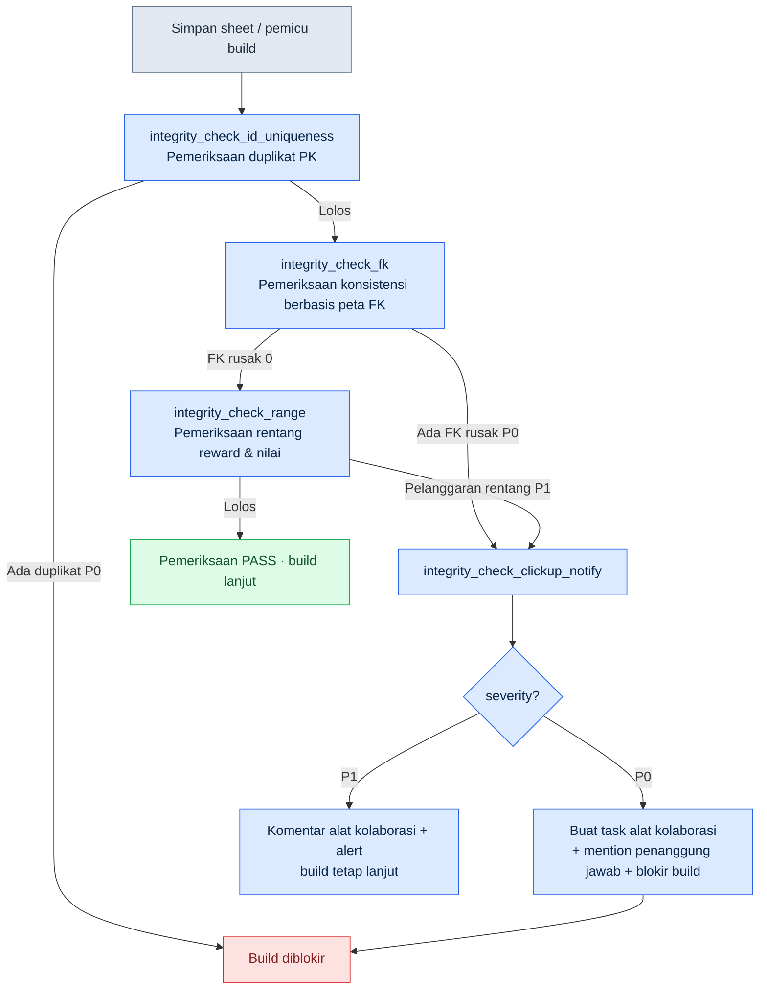

# 10.1 Atom Verifikasi Konsistensi — Cascade yang Menjaga FK pada 30 Sheet

Jumat malam pukul 18.40. Hari itu kami memutuskan untuk memasukkan 12 jenis quest baru ke build internal pada Senin minggu berikutnya. Saya menambahkan baris baru di `quest_table`, mengisi baris yang sesuai di sheet reward, lalu menautkan dialog NPC di sheet dialog. Tiga sheet, sekitar 50 baris. Saya memeriksanya dengan mata dua kali dan tampaknya tidak ada masalah.

Senin pagi build rusak. Salah satu quest baru merujuk pada `reward_id` yang tidak ada di sheet reward. Pada Jumat malam, saat menghapus satu baris reward lalu menambahkannya kembali, saya salah mengetik satu huruf pada id. `rwd_q318` menjadi `rwd_q381`. Itu jenis salah ketik yang mustahil tertangkap oleh mata manusia. Kedua sheet itu berada di folder berbeda, disentuh oleh orang berbeda, pada waktu berbeda. Ketika jumlah barisnya 50, mata masih bisa menangkapnya. Begitu lebih dari 30 sheet mulai saling merujuk lewat kunci asing (FK), mata manusia bukan lagi alat pemeriksa.

Bab ini menunjukkan satu jenis atom pemeriksa yang menangkap salah ketik itu sebelum build rusak — `integrity_check_fk` — yang memeriksa konsistensi FK pada lebih dari 30 sheet, dan ketika ada yang rusak, memberi tahu penanggung jawab melalui alat kolaborasi (collaboration tool — SaaS yang mengelola tugas dan jadwal; proyek ini memakai ClickUp, dan JIRA maupun Redmine menempati posisi yang sama). Saya memaparkannya dengan menelusuri satu sesi yang benar-benar saya jalankan sendiri.

Saya masuk ke industri ini lewat pekerjaan mencari satu baris yang menyimpang dalam karya orang lain. Pekerjaan pertama saya adalah QA dan tinjauan untuk game single-player, dan saat itu tangan dan mata adalah satu-satunya alat pemeriksa. Lebih dari 20 tahun berlalu, kini pekerjaan yang sama saya serahkan kepada kode — ke tempat di mana mata manusia berhenti menjadi alat pemeriksa.

---

## 10.1.1 Apa yang Harus Ditangkap Pemeriksa — Struktur FK yang Rusak

Pertama-tama kita lihat secara visual apa yang diperiksa. Sheet data game itu seperti basis data relasional. Sebuah kolom di satu sheet menunjuk ke kunci primer (primary key) sheet lain. Jika panah ini terputus, game bisa mati saat runtime, atau yang lebih buruk, diam-diam menampilkan nilai kosong.

<svg viewBox="0 0 640 260" xmlns="http://www.w3.org/2000/svg" font-family="sans-serif" font-size="13">
  <rect x="20" y="30" width="150" height="90" rx="6" fill="#eef4ff" stroke="#3b6fb6" stroke-width="1.5"/>
  <text x="95" y="50" text-anchor="middle" font-weight="bold">quest_table</text>
  <line x1="20" y1="60" x2="170" y2="60" stroke="#3b6fb6"/>
  <text x="32" y="78">quest_id (PK)</text>
  <text x="32" y="98" fill="#c0392b">reward_id (FK)</text>
  <text x="32" y="116" fill="#c0392b">npc_id (FK)</text>

  <rect x="250" y="20" width="150" height="60" rx="6" fill="#eafbe7" stroke="#3a9d3a" stroke-width="1.5"/>
  <text x="325" y="40" text-anchor="middle" font-weight="bold">reward_table</text>
  <line x1="250" y1="50" x2="400" y2="50" stroke="#3a9d3a"/>
  <text x="262" y="68">reward_id (PK)</text>

  <rect x="250" y="150" width="150" height="60" rx="6" fill="#eafbe7" stroke="#3a9d3a" stroke-width="1.5"/>
  <text x="325" y="170" text-anchor="middle" font-weight="bold">npc_table</text>
  <line x1="250" y1="180" x2="400" y2="180" stroke="#3a9d3a"/>
  <text x="262" y="198">npc_id (PK)</text>

  <line x1="170" y1="93" x2="250" y2="55" stroke="#3a9d3a" stroke-width="2" marker-end="url(#ok)"/>
  <line x1="170" y1="111" x2="250" y2="175" stroke="#c0392b" stroke-width="2" stroke-dasharray="6 4" marker-end="url(#bad)"/>
  <text x="430" y="120" fill="#c0392b" font-weight="bold">npc_id 'npc_307' →</text>
  <text x="430" y="140" fill="#c0392b">tidak ada di npc_table (FK rusak)</text>

  <defs>
    <marker id="ok" markerWidth="8" markerHeight="8" refX="6" refY="4" orient="auto"><path d="M0,0 L8,4 L0,8 Z" fill="#3a9d3a"/></marker>
    <marker id="bad" markerWidth="8" markerHeight="8" refX="6" refY="4" orient="auto"><path d="M0,0 L8,4 L0,8 Z" fill="#c0392b"/></marker>
  </defs>
</svg>

Garis hijau penuh adalah referensi yang hidup. Nilai yang ditunjuk `quest_table.reward_id` benar-benar ada di `reward_table.reward_id`. Garis merah putus-putus adalah referensi yang mati — `npc_id` sebuah quest menunjuk ke id yang tidak ada di `npc_table`. Garis merah putus-putus inilah yang ditangkap `integrity_check_fk`.

Sheet data Proyek A memiliki referensi semacam ini bukan satu atau dua. Lebih dari 30 sheet saling menunjuk, dan jika semua panah FK digambar, tidak akan muat dalam satu halaman. Mustahil bagi manusia menelusurinya satu per satu setiap kali.

---

## 10.1.2 Satu Sesi — Seluruh Proses Pemeriksa Menangkap FK yang Rusak

Mulai dari sini adalah sesi yang benar-benar saya jalankan. Tanpa meringkas, saya menuliskan apa adanya: prompt selengkapnya, keluaran mentah, hingga bagian yang saya tolak lalu minta ulang.

### Langkah 1 — Membaca Sheet untuk Mengekstraksi Kandidat FK

Pertama, saya membuat pemeriksa menyusun peta FK terlebih dahulu: "kolom mana menunjuk sheet mana". Mendaftarkan FK dari 30 sheet satu per satu secara manual itu tidak realistis, jadi saya membuatnya menyimpulkan kandidat secara otomatis dari aturan penamaan kolom sheet spesifikasi (`*_id` menunjuk ke sheet bernama sama). Prompt selengkapnya yang saya masukkan adalah sebagai berikut.

> Baca sheet spesifikasi yang dilampirkan (tab `$스키마`), lalu simpulkan kolom yang tampak sebagai kunci asing (FK) di semua sheet data. Aturan: (1) jika nama kolom berbentuk `xxx_id`, dan (2) terdapat kolom PK (Primary Key, kunci primer) bernama sama di sheet `xxx_table` atau `xxx_list`, maka anggap sebagai kandidat FK. Keluarkan hasil inferensi sebagai daftar JSON `{source_sheet, source_column, target_sheet, target_column, confidence}`. Untuk yang tidak bisa dipastikan oleh aturan, tandai confidence sebagai low dan tuliskan alasannya.

Sebagian keluaran mentah Claude (saya salin apa adanya, termasuk butir yang ambigu):

```json
[
  {"source_sheet":"quest_table","source_column":"reward_id",
   "target_sheet":"reward_table","target_column":"reward_id","confidence":"high"},
  {"source_sheet":"quest_table","source_column":"npc_id",
   "target_sheet":"npc_table","target_column":"npc_id","confidence":"high"},
  {"source_sheet":"quest_table","source_column":"prev_quest_id",
   "target_sheet":"quest_table","target_column":"quest_id","confidence":"medium",
   "note":"Namanya prev_quest_id, bukan quest_id, sehingga tidak tertangkap aturan. Diduga referensi-diri di sheet yang sama. Perlu konfirmasi manusia"},
  {"source_sheet":"reward_table","source_column":"item_id",
   "target_sheet":"item_table","target_column":"item_id","confidence":"high"},
  {"source_sheet":"dialogue_table","source_column":"speaker_id",
   "target_sheet":"npc_table","target_column":"npc_id","confidence":"low",
   "note":"Tidak jelas apakah speaker_id menunjuk npc_id atau player. Tampaknya ada juga baris dengan speaker 'player'. Tidak bisa dipastikan"}
]
```

Di sini ada dua butir yang tidak saya loloskan begitu saja. `prev_quest_id` (referensi-diri) saya jadikan target pemeriksaan, tetapi saya tambahkan sendiri pengecualian: "nilai kosong (quest pertama) bukanlah pelanggaran". `dialogue_table.speaker_id` saya tolak — karena memang ada baris yang `speaker`-nya `'player'`, sehingga jika ini diperiksa sebagai FK, semua dialog pemain akan tertangkap sebagai pelanggaran palsu.

Penolakan ini penting. Jika peta FK hasil inferensi otomatis dipakai langsung tanpa tinjauan, pada eksekusi pertama akan membanjir ratusan pelanggaran palsu. Pemeriksa baru mendapat kepercayaan setelah manusia menyaringnya sekali.

### Langkah 2 — Mendefinisikan Atom Pemeriksa dengan Peta FK yang Sudah Ditinjau

Peta FK yang sudah disaring saya kunci sebagai input atom `integrity_check_fk`. Format atomnya adalah sebagai berikut. Ini adalah versi lengkap satu atom pemeriksa yang benar-benar dipakai di Proyek A.

```yaml
---
name: integrity_check_fk
description: Memverifikasi bahwa setiap nilai kolom source ada pada PK sheet target sesuai peta FK yang terdaftar
type: integrity_check
category: data
priority: P0          # FK yang rusak memblokir build
execution_time:
  - on_save           # Saat sheet disimpan, hanya sheet tersebut
  - on_build          # Saat build, seluruh FK
  - nightly           # Setiap tengah malam, seluruhnya + laporan
input:
  fk_map: fk_map.reviewed.json   # Peta yang ditinjau manusia pada langkah 1~2
output_format: violation_list
on_violation:
  - notify: clickup           # Saat gagal, beri tahu ke ClickUp
related_atoms:
  - integrity_check_clickup_notify
  - integrity_check_id_uniqueness
---
```

Logika pemeriksaannya sendiri tidak panjang. Ini adalah pemeriksaan keanggotaan himpunan (set membership) yang mengonfirmasi apakah setiap nilai di sheet source ada dalam himpunan PK sheet target.

```python
def check_fk(fk_map, sheets):
    violations = []
    for fk in fk_map:
        pk_set = {r[fk["target_column"]] for r in sheets[fk["target_sheet"]]}
        for i, row in enumerate(sheets[fk["source_sheet"]]):
            val = row[fk["source_column"]]
            if val in ("", None):          # FK kosong adalah pengecualian (aturan yang ditetapkan di langkah 1)
                continue
            if val not in pk_set:
                violations.append({
                    "fk": f'{fk["source_sheet"]}.{fk["source_column"]}',
                    "row": i + 2,          # Baris header 1 + indeks-1
                    "value": val,
                    "target": fk["target_sheet"],
                    "severity": fk.get("severity", "P0"),
                })
    return violations
```

### Langkah 3 — Menjalankan Pemeriksaan dan Menangkap FK yang Benar-Benar Rusak

Dengan peta yang sudah ditinjau, saya menjalankan pemeriksaan pada seluruh 30 sheet. Keluarannya adalah `violation_list` standar. Berikut adalah hasil yang benar-benar muncul hari itu (id dan nama sheet dianonimkan, jumlah pelanggaran dan strukturnya nyata).

```json
{
  "check": "integrity_check_fk",
  "executed_at": "2026-05-18 09:14:02",
  "input_files": 31,
  "violations": [
    {"fk": "quest_table.reward_id", "row": 318, "value": "rwd_q381",
     "target": "reward_table", "severity": "P0",
     "message": "reward_id 'rwd_q381' tidak ada di reward_table. Diduga salah ketik dari 'rwd_q318'"},
    {"fk": "quest_table.prev_quest_id", "row": 502, "value": "q_0500",
     "target": "quest_table", "severity": "P0",
     "message": "prev_quest_id 'q_0500' tidak ada di quest_table. Diduga ketidakcocokan penulisan (padding 0) dari 'q_500'"}
  ],
  "summary": {"fk_checked": 23, "rows_scanned": 4117, "violations": 2, "passed": 4115}
}
```

Salah ketik dari Jumat malam itu (`rwd_q381`) tertangkap di baris pertama. Yang kedua adalah masalah lain yang tidak saya ketahui. `prev_quest_id` sebuah quest tertulis `q_0500`, padahal id quest sebenarnya adalah `q_500`. Ketidakcocokan penulisan akibat padding 0. Di mata manusia keduanya tampak sama, tetapi sebagai string itu nilai yang berbeda, dan game tidak menemukan quest pendahulu sehingga membiarkan quest itu dalam keadaan terkunci. Jika sudah dirilis, itu jenis cacat yang akan memicu pertanyaan dari pemain.

Bagian "diduga salah ketik" dan "diduga padding 0" pada field `message` adalah bagian di mana saya membuat pemeriksa, melampaui sekadar kegagalan keanggotaan, sekaligus menyajikan nilai PK terdekat (berdasarkan jarak edit). Ini mengurangi waktu manusia menelusuri "mengapa ini rusak". Namun perkiraan ini sekadar petunjuk, dan nilai perbaikan sebenarnya ditentukan oleh manusia.

---

## 10.1.3 Saat Rusak — Cascade hingga Pemberitahuan ke Alat Kolaborasi

Sampai di sini adalah cara kerja satu pemeriksaan. Tetapi sekalipun pemeriksa menangkap pelanggaran, jika tidak ada yang melihatnya, itu tak bermakna. Intinya adalah alur agar pelanggaran langsung sampai ke penanggung jawab. Di Proyek A, alur ini ditangani oleh atom terpisah bernama `integrity_check_clickup_notify` (pada metadata JIT, skor dampaknya 294.93, salah satu atom yang dinilai paling tinggi dalam kelompok atom verifikasi — artinya membuat kegagalan konsistensi sampai ke manusia itu sama pentingnya dengan pemeriksaan itu sendiri).

Seluruh cascade-nya adalah sebagai berikut. Atom-atom pemeriksa dijalankan berurutan, dan jika pada tahap mana pun muncul pelanggaran P0, alurnya mengalir ke atom pemberitahuan.



Cascade ini memuat dua keputusan desain.

Pertama, **pemeriksaan duplikat PK didahulukan sebelum pemeriksaan FK.** Pemeriksaan FK berasumsi bahwa PK sheet target itu unik. Jika PK terduplikasi, pertanyaan "apakah nilai ini ada dalam himpunan PK" itu sendiri menjadi tak bermakna. Karena itu, pada atom `integrity_check_fk` saya menyatakan `related_atoms: integrity_check_id_uniqueness`, dan mengunci urutannya di cascade. Jika pemeriksaan dependen gagal, pemeriksaan FK dilewati — karena dijalankan pun hanya akan menghasilkan hasil palsu.

Kedua, **intensitas pemberitahuan dibedakan berdasarkan severity.** P0 (FK rusak) membuat task di alat kolaborasi, men-mention penanggung jawab yang terdaftar di peta FK (jika `reward_table`, maka penanggung jawab reward), dan memblokir build. P1 (nilai reward keluar dari rentang yang disarankan — bukan salah, melainkan kasus yang perlu ditinjau) hanya meninggalkan komentar dan alert, dan membiarkan build lolos. Jika semua pelanggaran dijadikan pemblokir build, orang-orang akan segera belajar mengabaikan pemblokiran build. Pemblokiran hanya dipakai untuk hal yang benar-benar harus dihentikan.

Isi task yang benar-benar dibuat di alat kolaborasi adalah satu butir `violation_list` yang diubah apa adanya menjadi bentuk berikut.

```
[P0] Pelanggaran integrity_check_fk — build diblokir
Sheet: quest_table  |  Kolom: reward_id  |  Baris: 318
Nilai 'rwd_q381' tidak ada di reward_table.
Kandidat terdekat: 'rwd_q318' (jarak edit 1)
Penanggung jawab: @penanggung_jawab_reward  |  Terdeteksi: 2026-05-18 09:14  |  Build: nightly-0042
```

Hingga hasil pemeriksaan sampai ke kotak masuk seseorang, tangan tidak ikut campur satu kali pun. Pemeriksaan → klasifikasi → pembuatan task → mention adalah satu pipeline. Alasan ini bisa terjadi adalah karena `violation_list` merupakan format keluaran standar. Atom pemeriksa mana pun yang menangkapnya, struktur keluarannya sama, sehingga satu atom pemberitahuan menerima dan memproses hasil dari semua pemeriksaan.

---

## 10.1.4 Operasi untuk Mengurangi Pelanggaran Palsu — Meninggalkan Bukti Tinjauan

Ketika pemeriksaan pertama kali dinyalakan, pelanggaran palsu pasti muncul. `speaker_id` di langkah 1 adalah contohnya. Jika ini dibiarkan, orang-orang akan belajar bahwa laporan pelanggaran itu "toh sebagian besar palsu, jadi tak perlu dilihat" — inilah jalur paling umum runtuhnya kepercayaan terhadap pemeriksa.

Di Proyek A, hal ini dicegah dengan prinsip bernama `human_review_attestation_evidence_mandatory`. Saat memutuskan sesuatu sebagai pelanggaran palsu lalu memberinya pengecualian, **harus ditinggalkan bukti tentang siapa, kapan, dan mengapa** penilaian itu diambil. Setiap butir pengecualian di file peta FK (`fk_map.reviewed.json`) dilengkapi dengan ini.

```json
{
  "source_sheet": "dialogue_table", "source_column": "speaker_id",
  "excluded": true,
  "review": {
    "by": "이민수", "at": "2026-05-18",
    "reason": "speaker_id berisi npc_id atau literal 'player'. Tidak cocok untuk pemeriksaan FK tunggal.",
    "follow_up": "Pertimbangkan pengenalan ulang dengan pemeriksaan bercabang setelah menambahkan kolom speaker_type"
  }
}
```

Tanpa bukti ini, ketika kelak muncul lagi pertanyaan "kenapa kolom ini tidak diperiksa?", tidak ada dasar untuk menjawabnya. Lalu kolom itu dimasukkan lagi ke pemeriksaan, dan kembali melihat ratusan pelanggaran palsu. Bukti tinjauan mencegah perdebatan yang sama terulang.

---

## Coba Sendiri — Membangun Pemeriksaan Konsistensi FK untuk Pertama Kali

Prosedur minimal untuk pembaca yang ingin menerapkan pemeriksaan FK pada sheet datanya sendiri.

**setup.** Kumpulkan folder sheet data dan spesifikasi kolom (kolom mana yang PK dan mana yang FK) di satu tempat. Jika tidak ada spesifikasi, Anda bisa memulai hanya dengan aturan penamaan kolom (`*_id`).

**prompt.** Masukkan ini ke pemeriksa.

> Simpulkan kandidat FK dari sheet data ini. Jika kolom `xxx_id` menunjuk PK bernama sama di `xxx_table`, anggap sebagai FK. Keluarkan hasilnya sebagai JSON `{source_sheet, source_column, target_sheet, target_column, confidence}`, dan untuk yang tidak bisa dipastikan oleh aturan, tandai confidence sebagai low dan tuliskan alasannya.

**verify.** **Pastikan manusia meninjau peta FK yang dikeluarkan baris demi baris.** Referensi-diri (`prev_*`), campuran literal (seperti `'player'`), dan referensi polimorfik (kolom yang menunjuk sheet berbeda tergantung situasi) sering kali salah ditebak oleh inferensi otomatis. Jalankan pemeriksaan dengan peta yang sudah disaring, lalu klasifikasikan satu per satu pelanggaran yang muncul pada eksekusi pertama sebagai "benar-benar rusak / pelanggaran palsu". Beri pengecualian pada pelanggaran palsu, tetapi tinggalkan alasannya di file.

Setelah melewati ketiga langkah ini, salah ketik satu huruf di Jumat malam tidak lagi merusak build hari Senin. Pemeriksaan menangkap salah ketik itu pada nightly Sabtu dini hari, dan sebelum jam masuk kerja Senin, sebuah task alat kolaborasi sudah menunggu penanggung jawabnya.

**Versi Ringkas Solo.** Sekalipun Anda bekerja sendiri dan tidak punya alat kolaborasi, pemeriksaan ini tetap bermakna. Cukup tulis peta FK secara manual sekitar 10 baris dan jalankan satu fungsi Python di atas, maka referensi yang rusak akan tertangkap. Untuk pemberitahuan, keluaran konsol atau file teks sudah cukup. Intinya bukan pada kanal pemberitahuan, melainkan pada alur itu sendiri: "mesin menangkap kesalahan referensi yang tak tertangkap mata manusia, lalu membuatnya sampai ke manusia".

---

### Poin-Poin Penting
- Konsistensi FK tidak bisa ditangkap mata manusia begitu sheet melebihi 30, dan satu pemeriksaan keanggotaan himpunan menggantikan pekerjaan itu.
- Peta FK hasil inferensi otomatis harus ditinjau manusia, dan menyaring pelanggaran palsu serta meninggalkan alasannya sebagai bukti adalah inti kepercayaan terhadap pemeriksa.
- Nilai sebuah pemeriksaan tidak berakhir pada menangkap pelanggaran, melainkan tuntas ketika sampai ke penanggung jawab melalui cascade pemberitahuan ke alat kolaborasi.

### Pratinjau Bab Berikutnya
- 10.2 Sensor Konsistensi Keputusan 3-layer — melampaui integritas data, beralih ke verifikasi yang lebih kompleks yang menangkap ketidaksesuaian antara keputusan dengan keputusan, keputusan dengan data, dan keputusan dengan pengguna.
