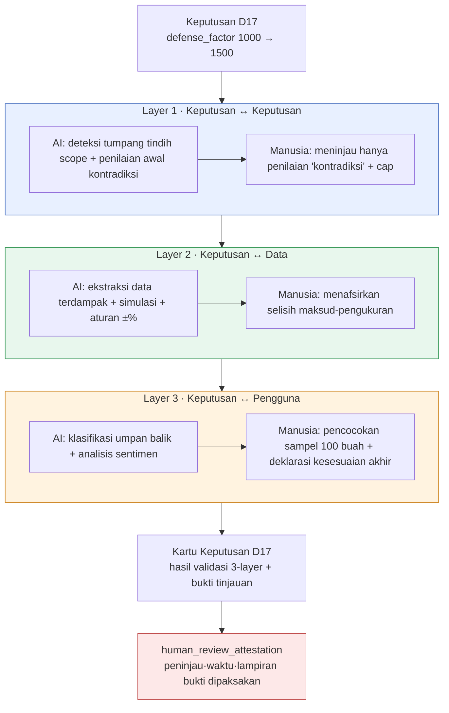

# 10.2 Sensor 3-Layer Validasi Keputusan — Tempat Bukti Tinjauan Manusia

Pukul 11 malam, job nightly menancapkan satu kartu di alat kolaborasi. Judulnya `[integrity] D17 pengukuran kesesuaian belum dilakukan, 7 hari berlalu`. Itu adalah notifikasi bahwa satu keputusan yang diterapkan seminggu lalu masih tertinggal di build tanpa seorang pun memastikan "apakah ia benar-benar bekerja sesuai maksud". Data baik-baik saja. Format sheet, FK, maupun enum semuanya lolos. Namun keputusannya belum tervalidasi.

Celah inilah titik awal bab ini. Sekalipun data utuh, keputusan masih bisa salah, dan tempat untuk menangkap kesalahan itu berada di lokasi yang berbeda dari pemeriksaan data. Membagi tempat itu menjadi tiga lapisan, lalu menegaskan sampai mana AI membantu dan di mana manusia membubuhkan capnya pada tiap lapisan — itulah sensor 3-layer validasi keputusan.

---

## 10.2.1 Data Lolos, Tapi Keputusan Tetap Bisa Salah

`check` cascade menjalankan empat jenis pemeriksaan sekaligus — doc-audit (konsistensi dokumen), data-qa (kualitas data), integrity (integritas), link (referensi silang yang putus). Bila keempatnya lolos, artinya "data baik-baik saja". Tetapi di atas data yang baik-baik saja itu masih bisa bertumpuk keputusan yang salah.

Sekalipun sheet hadiah sempurna secara format, jika nilainya memicu inflasi; sekalipun FK unik, jika dua quest menduduki NPC yang sama pada saat yang sama; sekalipun voice konsisten, jika setelan relasi dua karakter saling bertentangan — pemeriksaan data lolos semua, dan keputusan salah semua. Pemeriksaan data melihat "apakah selnya terisi", sedangkan pemeriksaan keputusan melihat "apakah nilai itu cocok dengan keputusan lain, data lain, dan pengguna nyata". Dalam istilah akuntansi, yang pertama adalah pemeriksaan format voucher, yang kedua adalah audit konsistensi laporan keuangan.

Karena itu validasi keputusan diberi **sensor terpisah** dari validasi data. Jika digabung dalam satu pemeriksaan, hasilnya tergumpal menjadi satu baris "lolos/gagal", sehingga ketika gagal, tafsirnya menjadi kabur — apakah masalah data atau masalah keputusan. Dengan dipisah, tanggung jawab menjadi jelas.

---

## 10.2.2 Tiga Lapisan, Tiga Titik Waktu, Tiga Jenis Peninjau

Inti sensor 3-layer adalah memecah **dimensi** validasi menjadi tiga. Tiap lapisan berbeda dalam objek yang dilihat, titik waktu kerjanya, dan pembagian peran antara AI dan manusia.



Pada ketiga lapisan, cap terakhir dibubuhkan manusia — cap itulah bukti yang dipaksakan oleh atom `human_review_attestation_evidence_mandatory`. Apa yang dilihat tiap lapisan dan siapa membubuhkan cap di mana akan kita lihat satu per satu di bawah.

---

## 10.2.3 Layer 1 — AI Menyaring, Manusia Meninjau Hanya 'Kontradiksi'

Ini lapisan yang memeriksa apakah keputusan baru berbenturan dengan keputusan yang sudah ada. Jumlah pasangan keputusan bertambah sebanding dengan kuadrat jumlah keputusan, sehingga 200 keputusan berarti sekitar 20,000 pasangan. Manusia tidak mungkin memeriksa semuanya dengan tangan. Karena itu AI menjalankan filter tahap pertama.

```python
# decision_conflict_check.py — sensor Layer 1
def check_new_decision(new_decision, existing_decisions):
    conflicts = []
    for existing in existing_decisions:
        if has_overlap(new_decision.scope, existing.scope):   # tahap mekanis pertama: irisan scope
            verdict = llm_judge(new_decision, existing)        # tahap AI kedua: kontradiksi/komplementer/tak relevan
            if verdict.label == "kontradiksi":
                conflicts.append({
                    "with": existing.id,
                    "label": verdict.label,
                    "reason": verdict.reason,
                    "needs_human_review": True,                # flag tinjauan manusia
                })
    return conflicts
```

`has_overlap` adalah filter mekanis tahap pertama. Karena scope adalah area atom (`combat`·`narrative`·`economy` dsb.), perhitungan irisannya akurat. Pasangan yang tidak beririsan langsung dibuang. 20,000 pasangan biasanya menyusut menjadi beberapa puluh pasangan. Hanya beberapa puluh pasangan itu yang dilihat AI.

### Worked Transcript Lengkap — Penilaian Kontradiksi Layer 1

Di sini saya tunjukkan sampai tuntas apa yang sebenarnya dipertukarkan. Tidak saya ringkas, dan keluaran yang ambigu pun saya biarkan apa adanya.

**① Prompt yang dikirim manusia (lengkap)**

```
Tentukan apakah dua keputusan berikut saling bertentangan.

[Keputusan A] (2026-03-XX) Cooldown global pertarungan diseragamkan 0.5 detik untuk semua skill
[Keputusan B] (2026-04-XX) Skill jenis pemulihan dikecualikan dari penerapan cooldown global

Format penilaian (hanya format ini, dilarang kata lain):
- label: kontradiksi | komplementer | tak relevan
- reason: satu baris
- confidence: 0.0~1.0

Jangan menebak. Bila dasarnya lemah, turunkan confidence.
```

**② Keluaran mentah Claude (tanpa olahan)**

```
- label: komplementer
- reason: Keputusan B menambahkan pengecualian eksplisit berupa jenis pemulihan pada aturan penyeragaman 0.5 detik yang ditetapkan Keputusan A, sehingga mempersempit aturan tanpa membaliknya.
- confidence: 0.74
```

**③ Validasi / penolakan oleh manusia**

Penilaiannya "komplementer", confidence 0.74. Menurut aturan, 'komplementer·tak relevan' lolos otomatis, tetapi jika confidence di bawah 0.8, manusia wajib memeriksa walau satu baris. Peninjau anggota tim A membaca ulang teks asli Keputusan B dan menemukan satu hal — pada Keputusan B terlampir syarat tambahan: "namun, skill pemulihan tetap memiliki cooldown sendiri sebesar 1.2 detik". AI hanya menerima satu baris ringkasan sehingga tidak mendapat syarat ini sebagai input. Anggota tim A **menerima namun memperkuat** penilaian AI, dan mencatat bahwa "input yang dilihat AI tidak lengkap".

**④ Permintaan ulang (setelah input diperkuat)**

```
[Syarat tambahan] Pada Keputusan B terlampir kondisi: "skill pemulihan dikecualikan dari cooldown global, namun
memiliki cooldown sendiri sebesar 1.2 detik". Nilai ulang dengan menyertakan syarat ini.
```

```
- label: komplementer
- reason: Cooldown sendiri 1.2 detik lebih panjang daripada global 0.5 detik, sehingga skill pemulihan, meski dikecualikan,
  justru memiliki jeda yang lebih panjang. Karena tidak berbenturan dengan maksud A (mencegah spam), sifat komplementernya menguat.
- confidence: 0.91
```

Penilaiannya tetap "komplementer", tetapi dasarnya menjadi kokoh dan confidence naik dari 0.74→0.91. Di sinilah anggota tim A membubuhkan cap. Intinya bukan hasil, melainkan **pencatatan proses** — penilaian awal AI, input yang luput yang ditemukan manusia, permintaan ulang yang diperkuat, dan tinjauan akhir. Keempat tahap ini dimasukkan apa adanya ke kolom bukti Layer 1 pada kartu keputusan.

Prinsip transcript ini hanya satu. **Penilaian 'komplementer·tak relevan' dari AI pun tidak diloloskan tanpa syarat.** Bukan AI yang salah, melainkan informasi yang diterima AI tidak lengkap, dan yang menemukan hal itu adalah manusia yang mengetahui teks asli keputusan.

Titik pemeriksaannya ada tiga tempat: segera saat keputusan baru ditambahkan + alert, pemeriksaan saat atom pending dipromosikan lalu dipromosikan, dan pemeriksaan ulang seluruh pasangan pada nightly.

---

## 10.2.4 Layer 2 — AI Mengerjakan Hampir Semua, Manusia Menafsirkan Selisihnya

Ini lapisan yang mengukur bagaimana keputusan tercermin pada data dan apakah sesuai dengan maksud. Lapisan ini paling mudah diotomatisasi dan paling akurat. Jika simulator dan sheet data sudah ada, cukup ditambahkan aturan validasi.

Mengambil contoh keputusan `D17` (defense_factor 1000→1500), sensor secara otomatis menarik sheet `CombatBalance`, hasil simulasi otomatis, dan data karakter terdampak, lalu membandingkan maksud (kesintasan tanker +49%) dengan pengukuran (simulasi +52%). Aturan penilaian kesesuaiannya bersifat kuantitatif.

| Selisih pengukuran terhadap maksud | Penanganan | Siapa |
|---|---|---|
| Dalam ±10% | sesuai (lolos otomatis) | AI |
| ±10\~25% | alert · tinjau ulang | manusia menafsirkan |
| Lebih dari ±25% | pelanggaran · wajib tinjau ulang keputusan | manusia memutuskan |

Di sini peran manusia bukan "lolos karena AI bilang sesuai". **Menafsirkan rentang alert dan rentang pelanggaran**-lah tugas manusia. Simulasi D17 sebesar +52% masuk dalam ±10% sehingga otomatis dinyatakan sesuai, tetapi simulasi yang sama memuntahkan satu efek samping — karakter hibrida `K_021` menjadi +28% lebih kuat di luar maksud. Karena bukan maksud langsung D17, hal ini tidak tertangkap aturan kesesuaian. Menangkap rentang yang menurut aturan lolos tetapi di mata manusia adalah insiden inilah alasan kehadiran manusia di Layer 2.

Tingkat otomatisasi lapisan ini paling tinggi, sekitar 95%. Tetap tersisa 5% justru karena penafsiran ini. Bahwa sebuah angka lolos aturan dan bahwa angka itu benar bagi game adalah dua pertanyaan yang berbeda.

---

## 10.2.5 Layer 3 — AI Mengklasifikasi, Manusia Mendeklarasikan Kesesuaian Akhir

Inilah yang paling sulit di antara ketiga lapisan. Lapisan ini melihat apakah keputusan bekerja pada pengguna nyata sesuai maksud. Inputnya adalah metrik nyata 1\~2 minggu setelah build rilis (rata-rata waktu kesintasan tanker, win rate PvP 5:5 yang menyertakan tanker) dan umpan balik bahasa alami (forum·media sosial).

Bahwa umpan balik bahasa alami menjadi input validasi adalah ciri khas lapisan ini. Sekitar 200 buah dari forum dan sekitar 1,500 buah dari media sosial diklasifikasikan AI ke dalam kategori dan diberi label sentimen.

```
[Klasifikasi umpan balik AI — terkait tanker, kumpulan 1 minggu]
   Positif 62%   Negatif 23% (mayoritas "tanker jadi terlalu kuat")   Tak relevan 15%
```

Berhenti di sini adalah jebakan. Klasifikasi sentimen AI menurun akurasinya ketika bahasa Korea dan Inggris bercampur (penilaian apakah "tanker jadi kuat ㅋㅋ" itu positif atau sarkasme menjadi goyah). Karena itu, sebagai aturan operasional, **setiap kuartal manusia mengklasifikasikan sendiri 100 sampel dan mencocokkannya dengan hasil AI.** Bila galat pada pencocokan melampaui ambang, klasifikasi kuartal itu tidak dipercaya dan manusia mengklasifikasi ulang seluruhnya.

Deklarasi kesesuaian akhir dilakukan manusia. Untuk D17, hasil nyatanya +44% (prediksi simulasi +52%, galat 8% — dalam rentang normal), dengan umpan balik yang didominasi positif. AI menyusun dan menyerahkan input berupa "dominan positif + dalam rentang maksud", dan **yang membubuhkan cap sesuai adalah manusia**. Tingkat otomatisasi sekitar 70%, manusia 30%. Khusus lapisan ini, otomatisasi penuh mustahil secara fundamental. Sebab makna pengguna tidak dapat dinilai mesin sampai tuntas.

---

## 10.2.6 Bukti Tinjauan Manusia Bukan Pilihan, Melainkan Paksaan

Bila cap terakhir ketiga lapisan adalah manusia, maka tanpa **bukti bahwa cap itu benar-benar dibubuhkan**, seluruh sistem runtuh. Bagaimana mencegah kasus seseorang berkata sudah meninjau padahal tidak? Pada Proyek A, atom `human_review_attestation_evidence_mandatory` memaksakan hal ini.

Aturan atom ini sederhana dan tanpa kompromi. **Pada lapisan mana pun di kartu keputusan, jika terjadi 'penilaian AI → tinjauan manusia', maka identitas peninjau, waktu tinjauan, dan bukti tinjauan (minimal salah satu dari memo penguatan, alasan penolakan, atau hasil pencocokan sampel) harus dilampirkan ke kartu. Bila buktinya kosong, kartu itu tidak dapat dipromosikan menjadi "validasi selesai".**

Bila buktinya kosong, atom `integrity_check_clickup_notify` bekerja. Begitu mendeteksi kegagalan konsistensi — di sini "ada cap tinjauan tetapi tidak ada bukti" — ia langsung membuat kartu di alat kolaborasi. Kartu pukul 11 malam di adegan pembuka bab ini persis adalah mekanisme ini.

Kedua atom ini berpasangan membentuk "validasi atas validasi". Sensor 3-layer memvalidasi keputusan, atom attestation memvalidasi apakah manusia benar-benar melakukan validasi itu, dan atom notify menangkap serta memberi tahu bukti yang luput. Sekalipun bantuan AI luas, **satu sel terakhir tanggung jawab** diisi dengan **nama manusia yang meninggalkan bukti**.

---

## 10.2.7 Kartu Keputusan — Tempat Validasi dan Bukti Berkumpul dalam Satu Lembar

Unit tempat hasil ketiga lapisan dan bukti tinjauan berkumpul adalah kartu keputusan. Satu kartu adalah unit lengkap dari satu keputusan, dan mengalir menjadi input retrospektif kuartalan. Berikut adalah struktur kartu D17.

<svg viewBox="0 0 720 430" xmlns="http://www.w3.org/2000/svg" font-family="sans-serif" font-size="13">
  <rect x="10" y="10" width="700" height="410" rx="10" fill="#fafbfc" stroke="#888"/>
  <text x="30" y="40" font-size="16" font-weight="bold">Kartu Keputusan D17</text>
  <text x="30" y="62" fill="#555">Perubahan: defense_factor 1000 → 1500   ·   Diterapkan 2026-03-XX</text>
  <line x1="30" y1="74" x2="690" y2="74" stroke="#ccc"/>

  <rect x="30" y="86" width="660" height="86" rx="6" fill="#e8f0ff" stroke="#4a72c0"/>
  <text x="42" y="106" font-weight="bold" fill="#2a4a90">Layer 1 · Konsistensi Keputusan</text>
  <text x="42" y="126">✓ Tidak ada keputusan yang bertentangan   ·   Relasi komplementer dengan 7 keputusan bertetangga</text>
  <text x="42" y="146" fill="#b03a3a">Bukti: anggota tim A, 2026-03-XX 14:20, 1 memo penguatan input yang luput</text>
  <text x="42" y="164" fill="#777" font-size="11">Penilaian awal AI → tinjauan manusia (confidence 0.74 → 0.91 setelah diperkuat)</text>

  <rect x="30" y="180" width="660" height="78" rx="6" fill="#e8f7ed" stroke="#3a9a5a"/>
  <text x="42" y="200" font-weight="bold" fill="#1f6a3a">Layer 2 · Kesesuaian Data</text>
  <text x="42" y="220">✓ Simulasi +52% vs maksud +49% (sesuai, dalam ±10%)</text>
  <text x="42" y="240" fill="#c07a1a">⚠ Hibrida K_021 +28% di luar maksud — penafsiran manusia: perlu keputusan lanjutan</text>

  <rect x="30" y="266" width="660" height="78" rx="6" fill="#fff3e0" stroke="#d08a2a"/>
  <text x="42" y="286" font-weight="bold" fill="#9a5a10">Layer 3 · Kesesuaian Pengguna</text>
  <text x="42" y="306">✓ Nyata +44% vs simulasi +52% (galat 8%, normal)   ·   Umpan balik dominan positif</text>
  <text x="42" y="326" fill="#b03a3a">Bukti: pencocokan manusia 100 sampel kuartal selesai, tingkat kecocokan klasifikasi AI 88%</text>

  <rect x="30" y="352" width="660" height="52" rx="6" fill="#fde8e8" stroke="#c04a4a"/>
  <text x="42" y="374" font-weight="bold" fill="#a02020">Keseluruhan: ✓ Sesuai (keputusan lanjutan efek samping K_021 didaftarkan di alat kolaborasi)</text>
  <text x="42" y="394" fill="#777" font-size="11">Validasi attestation: bukti tinjauan ketiga lapisan dipastikan terlampir → promosi kartu diizinkan</text>
</svg>

Baris merah itulah intinya. Bila baris "Bukti:" tiap lapisan kosong, atom attestation menghalangi promosi kartu dan atom notify memberi tahu di alat kolaborasi. Enam bulan kemudian, ketika seseorang bertanya "kenapa defense_factor dibuat 1500?", satu kartu ini menjawab semuanya — maksud, pengukuran, hasil nyata, hingga peninjau. Kartu keputusan bekerja di atas aliran metadata yang sama dengan atom pelacakan pengambilan keputusan pada Bagian 18.

---

## 10.2.8 Tingkat Otomatisasi dan Urutan Penerapan

Tiga lapisan ini berbeda tingkat otomatisasinya (masing-masing sekitar 80%·95%·70%, seperti yang dilihat pada subbab sebelumnya). Ketiganya semi-otomatis dan cap terakhirnya sama-sama manusia, tetapi beban kerja manusia secara keseluruhan berkurang lebih dari 80%.

Penerapan dimulai dari Layer 2. Jika simulasi dan sheet data sudah ada, cukup menambahkan aturan validasi sehingga efeknya muncul dalam 1\~2 bulan. Berikutnya Layer 1 (infrastrukturnya sedikit tetapi efeknya besar, tambahan 1 bulan), dan terakhir Layer 3 (infrastrukturnya paling besar dan efeknya juga besar, tambahan 2\~3 bulan). Mencoba memasang Layer 3 sejak awal lalu kandas adalah kegagalan yang lazim.

> **Tentang penulisan angka**: Tingkat otomatisasi di atas dan rasio efek di bawah adalah **perkiraan penulis (belum terverifikasi)** berdasarkan pengamatan operasional proyek penulis. Itu bukan nilai pengukuran presisi, melainkan harus dibaca sebagai arah dan rasio kasar. Ambang ±10%/±25% pada aturan kesesuaian adalah aturan operasional nyata, dan nama atom (`integrity_check_clickup_notify`, `human_review_attestation_evidence_mandatory`) adalah atom yang benar-benar ada.

Perubahan sebelum dan sesudah penerapan bila dirangkum sebagai arah adalah sebagai berikut. Insiden kontradiksi keputusan per kuartal turun dari beberapa kasus menjadi hampir 0 kasus, tingkat pelaksanaan pengukuran kesesuaian 1 minggu setelah keputusan naik dari sebagian menjadi sebagian besar, dan tingkat penemuan efek samping sebelum insiden terjadi naik dari kurang dari separuh menjadi sebagian besar. Perubahan yang paling bermakna adalah ketertelusuran — rasio kemampuan menelusuri kembali latar belakang keputusan jauh setelahnya berubah dari sedikit menjadi hampir seluruhnya. Sebabnya kartu keputusan menyimpan sejarah keputusan game.

---

## 10.2.9 Kegagalan yang Lazim

| Pola | Resep |
|---|---|
| Hanya mengoperasikan Layer 1 (hanya pemeriksaan kontradiksi) | Menambah Layer 2·3 untuk mengisi dimensinya |
| Menerapkan Layer 3 sejak awal | Mulai dari Layer 2, urut dari infrastruktur terkecil |
| Menerima tanpa kritik penilaian 'komplementer·tak relevan' AI | Ambang confidence + tinjauan sampel manusia |
| Hanya membubuhkan cap tinjauan tanpa melampirkan bukti | Atom attestation menghalangi promosi |
| Mengabaikan notifikasi bukti yang luput | Memperlakukan kartu alat kolaborasi dari atom notify sebagai belum selesai |
| Memercayai membabi buta klasifikasi AI atas umpan balik pengguna | Pencocokan manusia 100 sampel kuartal |

---

### Poin-Poin Penting

- Integritas data dan konsistensi keputusan adalah sensor yang berbeda. Jika digabung dalam satu pemeriksaan, tafsir kegagalan menjadi kabur.
- Pada ketiga lapisan, AI membantu tetapi cap terakhir dibubuhkan manusia. Hanya dimensinya yang berbeda, prinsipnya sama.
- Bila bukti tinjauan kosong, kartu tidak dapat dipromosikan. Atom attestation melakukan validasi atas validasi.

---

### Coba Sendiri — Versi Ringkas Solo

**setup.** Kumpulkan log keputusan dalam satu berkas (id keputusan·scope·maksud·tanggal penerapan). Kunci scope sebagai enum seperti `combat`·`narrative`·`economy`. Bila tidak ada simulasi, Layer 2 boleh dimulai dengan "perbandingan manual sheet data terkait".

**prompt.** Setiap kali muncul keputusan baru, tanyakan ke AI sepasang demi sepasang dengan keputusan yang sudah ada. Kunci formatnya.
```
Tentukan apakah dua keputusan berikut saling bertentangan.
[Keputusan A] ...
[Keputusan B] ...
Keluarkan hanya format: label (kontradiksi|komplementer|tak relevan) / reason satu baris / confidence 0.0~1.0
Dilarang menebak. Bila dasar lemah, turunkan confidence.
```

**verify.** Untuk penilaian 'kontradiksi' dan penilaian dengan confidence di bawah 0.8, baca ulang teks asli keputusan dan pastikan. Setelah dipastikan, wajib tinggalkan **nama peninjau·waktu·memo (salah satu dari penguatan/penolakan/pencocokan)** pada kartu keputusan. Bila kolom bukti kosong, jangan naikkan kartu itu menjadi "validasi selesai" — satu baris inilah versi solo dari atom attestation. Sekalipun operasi seorang diri, tinggalkan bukti demi diri Anda enam bulan kemudian.
