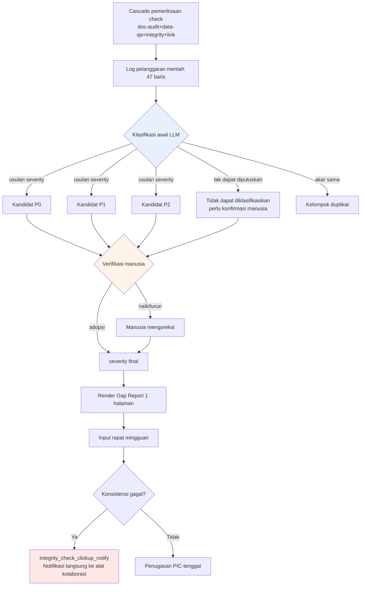

# 10.3 Alpha Gap Report — Mengklasifikasikan Celah dengan Bahasa Alami dan Manusia Menetapkan Prioritas

Senin pagi pukul 9.12. Cascade pemeriksaan pertama pada minggu di mana build alpha baru saja diunggah telah selesai. Ketika `check` menjalankan empat jenis pemeriksaan (doc-audit·data-qa·integrity·link, 10.2) sekaligus lalu berhenti, angka yang tercetak di konsol seperti ini. **Kandidat pelanggaran 47 butir.** Berapa di antaranya yang P0, apa yang harus dilihat lebih dulu, dan siapa yang harus menanganinya — tak satu pun dari 47 baris itu yang menuliskannya.

Pemeriksa hanya tahu fakta bahwa sesuatu "salah". Ia tidak bisa menilai "apakah ini menghalangi rilis, atau apakah masih boleh dilihat minggu depan". Hambatan sesungguhnya pada penghujung alpha bukanlah karena pemeriksanya kurang, melainkan karena pagi habis dipakai manusia untuk mengklasifikasikan 47 baris yang dimuntahkan pemeriksa. Bab ini memindahkan secara utuh satu siklus kerja nyata (worked cycle) di mana 47 baris itu diklasifikasikan oleh LLM dengan bahasa alami, lalu manusia menerima klasifikasi tersebut dan menetapkan prioritas.

---

## 10.3.1 Hasil Pemeriksaan Bukanlah Keputusan

Pada 10.1 saya membuat sekitar 30 jenis atom verifikasi, dan pada 10.2 saya menyusun struktur untuk menyaring keputusan melalui sensor 3-layer. Yang dihasilkan oleh kedua bab itu adalah **log**. Log bukanlah keputusan. Di antara log dan keputusan ada celah yang dulu ditambal manusia dengan tangan.

<svg viewBox="0 0 720 230" xmlns="http://www.w3.org/2000/svg" font-family="sans-serif">
  <rect x="20" y="40" width="150" height="60" rx="6" fill="#e8f0fe" stroke="#46a" stroke-width="1.5"/>
  <text x="95" y="65" text-anchor="middle" font-size="13" font-weight="bold">Cascade pemeriksaan</text>
  <text x="95" y="84" text-anchor="middle" font-size="11" fill="#555">Otomatis · log 47 baris</text>

  <rect x="285" y="40" width="150" height="60" rx="6" fill="#fef3e8" stroke="#d80" stroke-width="1.5"/>
  <text x="360" y="60" text-anchor="middle" font-size="13" font-weight="bold">Celah</text>
  <text x="360" y="78" text-anchor="middle" font-size="11" fill="#a00">Manusia secara manual</text>
  <text x="360" y="93" text-anchor="middle" font-size="11" fill="#a00">klasifikasi·prioritas</text>

  <rect x="550" y="40" width="150" height="60" rx="6" fill="#e8fce8" stroke="#4a6" stroke-width="1.5"/>
  <text x="625" y="65" text-anchor="middle" font-size="13" font-weight="bold">Keputusan mingguan</text>
  <text x="625" y="84" text-anchor="middle" font-size="11" fill="#555">PIC·tenggat·gerbang</text>

  <line x1="170" y1="70" x2="283" y2="70" stroke="#888" stroke-width="2" marker-end="url(#ar)"/>
  <line x1="435" y1="70" x2="548" y2="70" stroke="#888" stroke-width="2" marker-end="url(#ar)"/>

  <text x="360" y="150" text-anchor="middle" font-size="12" fill="#a00" font-weight="bold">← di celah inilah pagi menghilang</text>
  <text x="360" y="180" text-anchor="middle" font-size="12" fill="#2a6">Gap Report = LLM mengklasifikasikan, manusia menetapkan prioritas</text>

  <defs>
    <marker id="ar" markerWidth="8" markerHeight="8" refX="6" refY="3" orient="auto">
      <path d="M0,0 L6,3 L0,6 Z" fill="#888"/>
    </marker>
  </defs>
</svg>

Alasan celah ini mahal pada penghujung alpha sederhana saja. Pemeriksa berjalan puluhan kali dalam satu jam, tetapi pekerjaan manusia membaca 47 baris lalu mengklasifikasikan "q_142 adalah jalan buntu jadi blokir rilis, voice_lint 412 menunggu putusan penulis naskah" harus dilakukan dari awal setiap kali. Memindahkan kerja klasifikasi itu ke model bahasa alami adalah titik tolak Gap Report.

---

## 10.3.2 Worked Transcript — Menyerahkan 47 Baris kepada LLM

Berikut adalah sesi nyata pada Senin pagi itu, ketika saya menempelkan log mentah cascade pemeriksaan apa adanya ke Claude dan meminta klasifikasi. Saya pindahkan tanpa meringkasnya. Saya biarkan apa adanya bagian di mana model salah menebak maupun bagian yang ditolak manusia. Inilah tulang punggung bab ini.

### ① Prompt (lengkap)

````text
Berikut adalah kandidat pelanggaran yang dimuntahkan secara gabungan oleh cascade pemeriksaan mingguan build alpha (doc-audit/data-qa/integrity/link). Klasifikasikan untuk dipakai di rapat mingguan.
Klasifikasikan tiap butir menjadi P0 (blokir rilis)/P1 (tinjau)/P2 (amati) dan beri satu baris alasan masing-masing — jika itu dugaan, tulis "perkiraan". Untuk severity jangan kamu pastikan, hanya beri 'usulan', yang menetapkan adalah saya.
Kelompokkan yang berasal dari akar yang sama, dan rekomendasikan juga bidang penanggung jawab (level/naratif/balance/UI/data). Yang tidak bisa kamu putuskan, jujur saja keluarkan sebagai "tidak dapat diklasifikasikan, perlu konfirmasi manusia".

[Log mentah]
INTEGRITY  q_142    quest_graph: node 'end_021' has no outgoing edge (dead-end), zone=dungeon_021
INTEGRITY  q_158    quest_graph: reward node references item_id 'it_9920' not in item table
DATA-QA    reward_curve  dungeon_017 reward_exp delta +35.2% vs sibling median (threshold 25%)
DATA-QA    reward_curve  dungeon_017 reward_gold delta +31.0% vs sibling median
DOC-AUDIT  voice_lint    dialogue_id_412 contains banned term (refgame slang leak)
DOC-AUDIT  voice_lint    dialogue_id_511 tone drift: formality score 0.31 (npc 'elder' expects >0.7)
DOC-AUDIT  voice_lint    dialogue_id_512 tone drift: formality score 0.29
DOC-AUDIT  voice_lint    dialogue_id_513 tone drift: formality score 0.33
DATA-QA    loc_overflow  ui_btn_enhance EN string 24 chars > slot 18 (overflow 6)
DATA-QA    loc_overflow  ui_btn_enhance TH string overflow 11
LINK       doc_link      gdd_dungeon_021.md -> [reward_table] target moved (404)
INTEGRITY  k_skill       skill 'k_017_charge' cooldown 0.0 (suspicious, min expected 0.5)
... (총 47줄, 이하 동형 패턴 — 생략 없이 첨부됨)
````

Pada baris keterangan log mentah di atas, kalimat Korea `... (총 47줄, 이하 동형 패턴 — 생략 없이 첨부됨)` berarti "(total 47 baris, sisanya berpola serupa — dilampirkan tanpa pemotongan)".

### ② Keluaran Mentah Claude (tanpa diringkas·dirapikan)

````text
Saya telah mengklasifikasikan log mentah. severity adalah "usulan" saya, dan penetapan final harus dilakukan manusia.

## Kandidat P0 (mungkin memblokir rilis — perlu penetapan manusia)

1. [q_142] quest_graph dead-end (dungeon_021)
   Alasan: node terminal tanpa edge keluar → pemain terjebak di tengah progres kues.
   Jalan buntu berarti tidak bisa lanjut, jadi kandidat P0. (dasar penetapan jelas)
   Rekomendasi PIC: level/naratif

2. [q_158] reward node mereferensikan item_id 'it_9920' yang tidak ada
   Alasan: referensi NULL saat memberi reward → mungkin crash atau reward tak terbayarkan.
   Kandidat P0. Namun, bisa jadi item_id masih belum diisi (sedang dikerjakan),
   sehingga apakah ini "data belum lengkap" atau "salah ketik" perlu konfirmasi manusia.
   Rekomendasi PIC: data

3. [voice_lint dialogue_id_412] kosakata terlarang (kebocoran istilah refgame)
   Alasan: jika istilah khas game lain tersisa di dialog, ada risiko hukum·merek.
   Kandidat P0. (kosakata terlarang biasanya selalu diblokir tanpa kecuali)
   Rekomendasi PIC: naratif

## Kandidat P1 (putuskan setelah ditinjau)

4. [reward_curve dungeon_017] exp +35.2% / gold +31.0% (keduanya melampaui median saudara)
   ※ Dua baris digabung jadi 1 butir — anomali kurva reward pada dungeon yang sama.
   Alasan: melampaui ambang (25%) tetapi bisa jadi "bonus dungeon tingkat tinggi yang disengaja".
   Apakah ini niat balance atau kesalahan tidak bisa diputuskan dari data saja → P1.
   Rekomendasi PIC: balance

5. [voice_lint 511·512·513] tone drift 3 butir (formality 0.29~0.33, NPC elder mengharapkan >0.7)
   ※ Tiga baris digabung jadi 1 butir — penyimpangan tone dialog beruntun dari NPC 'elder' yang sama.
   Alasan: pola di mana NPC yang sama berturut-turut jatuh ke gaya banmal → kemungkinan
   hasil kerja satu sesi dari satu penulis naskah. Disarankan ditinjau secara dikelompokkan, bukan per butir.
   Perkiraan: bisa jadi perubahan karakter yang disengaja (adegan amarah, dsb.), jadi menunggu putusan penulis naskah. P1.
   Rekomendasi PIC: naratif

6. [loc_overflow ui_btn_enhance] EN 6 karakter / TH 11 karakter melebihi
   ※ 2 baris 1 butir. Overflow multibahasa pada tombol yang sama.
   Alasan: terpotong merusak UX tetapi bukan crash. Perlu perluasan slot atau pemendekan terjemahan. P1.
   Rekomendasi PIC: UI

## Kandidat P2 (amati)

7. [doc_link gdd_dungeon_021.md -> reward_table 404]
   Alasan: tautan internal dokumen rusak. Tidak berpengaruh ke build game, ini masalah konsistensi dokumen. P2.
   Rekomendasi PIC: data (pemilik dokumen)

## Tidak dapat diklasifikasikan — perlu konfirmasi manusia

8. [k_017_charge cooldown 0.0]
   Alasan: apakah cooldown 0.0 itu "skill bersifat pasif yang disengaja" atau "input yang
   terlewat" tidak bisa diputuskan tanpa mengetahui niat desain skill. Pemeriksa integrity
   mencurigai nilai di bawah 0.5, tetapi saya tidak tahu niat desain skill ini.
   → PIC balance harus mengonfirmasi langsung.

(Sisa 39 baris juga diklasifikasikan ke salah satu dari 7 pola di atas — dalam jawaban ini hanya yang representatif yang diuraikan)
````

### ③ Verifikasi dan Penolakan oleh Manusia (dipindahkan apa adanya)

Mulai dari sini inti pentingnya. Saya tidak mengadopsi klasifikasi LLM apa adanya. Inilah bagian yang saya tandai dengan pena merah saat meninjau sendiri sebelum rapat.

- **Butir 2 q_158 saya naikkan dari kandidat P0 → P0 final.** Model ragu sambil bilang "mungkin data belum lengkap", tetapi setelah dicek ternyata `it_9920` adalah item yang dihapus dua minggu lalu. Bukan belum lengkap, melainkan referensi yang putus. Blokir rilis ditetapkan.
- **Butir 3 voice_lint 412 saya turunkan dari P0 ke P1.** Model memastikan "kosakata terlarang selalu diblokir tanpa kecuali", tetapi dialog tersebut adalah adegan di mana NPC dengan sengaja mengutip ungkapan lama. Ditangani dengan menambahkan kasus pengecualian ke kamus kata terlarang. **Kesalahan khas model yang menerapkan aturan saja tanpa mengetahui konteks.**
- **Pengelompokan tone drift butir 5 saya terima.** Hipotesis pengelompokan "hasil kerja satu sesi dari penulis naskah yang sama" tepat. Memang benar menyerahkan 3 butir sekaligus kepada satu penulis naskah.
- **cooldown 0.0 butir 8, saya akui apa adanya putusan model "tidak dapat diklasifikasikan".** Bagus bahwa model tidak ngotot bahwa ia tahu hal yang tidak diketahuinya. Ping ke PIC balance.

Bahwa model memadatkannya menjadi 7 kelompok itu sendiri besar dampaknya. Kalau manusia mengklasifikasikan 47 baris dari awal, pagi akan habis. Namun, **dari 3 kandidat P0, 1 butir (412) diturunkan manusia, dan 1 kandidat P1 (158) dinaikkan manusia.** 60% klasifikasi benar, dan 30% yang mahal diperbaiki manusia. Rasio inilah persis garis batas "LLM memproses, keputusan oleh manusia".

### ④ Permintaan Ulang — Mengembalikan Hasil yang Diperbaiki Manusia ke Model

````text
Bagus. Aku mengubah dua hal dari klasifikasimu.
- q_158: P0 final (it_9920 adalah item yang dihapus, referensi putus)
- voice_lint_412: diturunkan ke P1 (kutipan ungkapan lama yang disengaja, ditambahkan pengecualian ke kamus terlarang)
Cerminkan keduanya lalu render Gap Report 1 halaman untuk rapat mingguan dalam Markdown. Urut ringkasan→P0→P1→P2→tren.
Angka tren aku yang beri — minggu lalu P0 5 butir, P1 22 butir, false positive 12%.
````

Model menerima input ini lalu mengeluarkan apa adanya format 1 halaman §laporan di bawah. Dua baris yang diperbaiki manusia tercermin dengan tepat, dan angka tren memakai apa adanya nilai yang diberikan manusia (tidak dibuat-buat). Bolak-balik inilah seluruh proses terbentuknya satu lembar Gap Report.

---

## 10.3.3 Alur Klasifikasi Gap — Batas antara Otomatis dan Manusia

Jika transkrip di atas disarikan menjadi alur, jadinya seperti ini. Intinya, semua titik percabangan tebal ada pada manusia.



Kotak yang disentuh LLM hanya satu yang berwarna biru. Di kotak oranye (verifikasi manusia) semua severity ditetapkan, dan di kotak merah kegagalan konsistensi langsung melompat ke alat kolaborasi. Pemeriksaan·putusan·penetapan seluruhnya menjadi tanggung jawab manusia dan atom, sedangkan model hanya menangani klasifikasi pertama satu kali saja.

---

## 10.3.4 Bila Konsistensi Pecah, Tidak Menunggu Rapat

Di ujung alur klasifikasi melekat atom `integrity_check_clickup_notify` (10.1). Atom ini, terpisah dari tahap pembuatan laporan, **melemparkan kartu ke alat kolaborasi tanpa menunggu rapat begitu pemeriksaan konsistensi gagal.** Jika Gap Report adalah ritme mingguan, atom ini adalah interupsi yang memecah masuk ke dalam ritme tersebut.

Pelanggaran yang bisa merusak build itu sendiri, seperti q_158 (referensi item yang dihapus), tidak bisa menunggu sampai rapat Senin. Begitu cascade menangkapnya, "Curiga P0: q_158 referensi putus" otomatis dibuat di alat kolaborasi dan ditugaskan ke PIC data. Gap Report adalah panel belakang yang mengumpulkan kembali interupsi-interupsi itu per satuan minggu dan menampilkannya sebagai tren. Kedua lapisan harus berjalan bersama agar dua ketukan "yang mendesak segera, gambaran keseluruhan mingguan" pas.

---

## 10.3.5 Meninggalkan Bukti Tinjauan Manusia

Fakta bahwa manusia memverifikasi klasifikasi LLM **akan menguap kalau hanya tinggal sebagai ucapan.** Karena itu pada tahap tinjauan terpasang atom `human_review_attestation_evidence_mandatory` (10.2) — tinjauan manusia wajib disertai bukti.

Tahap ③ transkrip di atas — putusan menurunkan 412 dan menaikkan 158 itu — dimasukkan ke footer laporan sebagai ID peninjau·timestamp dan daftar "butir yang diubah". Pada kuartal berikutnya, ketika seseorang bertanya "kenapa 412 lolos ke rilis?", yang menjawab adalah catatan "pada tinjauan 2026-W21 diputuskan sebagai kutipan ungkapan lama yang disengaja, ditambahkan pengecualian ke kamus terlarang". Tanpa ini, klasifikasi LLM tidak bisa dibedakan dari keluaran otomatis yang belum pernah diverifikasi.

---

## 10.3.6 Format Laporan — Tidak Melebihi 1 Halaman

Hasil dari permintaan ulang ④, 1 halaman yang dirender model berbentuk seperti ini. Klasifikasi transkrip di atas mengalir masuk apa adanya.

```markdown
# Alpha Gap Report — 2026-W21

## Ringkasan
- Cascade pemeriksaan 47 kandidat pelanggaran → diklasifikasikan ke 7 kelompok
- P0 final 3 butir / P1 4 butir / P2 1 butir / tidak dapat diklasifikasikan 1 butir
- Blokir rilis: q_142 (jalan buntu), q_158 (referensi putus)
- Perubahan tinjauan manusia: voice_412 diturunkan (P0→P1), q_158 dinaikkan (P1→P0)

## P0 — Tindakan Segera (penetapan manusia)
| ID | Pelanggaran | Bidang | Catatan |
|---|---|---|---|
| q_142 | jalan buntu dungeon_021 | level/naratif | LLM·manusia sepakat |
| q_158 | referensi it_9920 yang dihapus | data | dinaikkan manusia |

## P1 — Putuskan Setelah Ditinjau
- reward_curve dungeon_017: exp+35%/gold+31% (balance, menunggu konfirmasi niat)
- voice 511·512·513: penyimpangan tone elder 3 butir dikelompokkan (naratif, putusan penulis naskah)
- voice_412: kutipan ungkapan lama (naratif, ditangani sebagai pengecualian terlarang)
- loc_overflow ui_btn_enhance: terpotong EN/TH (UI)

## P2 — Amati
- doc_link 404 (konsistensi dokumen, tidak berpengaruh ke build)

## Tidak Dapat Diklasifikasikan — Perlu Konfirmasi Manusia
- k_017_charge cooldown 0.0 (balance, niat desain tidak diketahui)

## Tren (dibanding minggu lalu)
- P0: 3 butir (minggu lalu 5 butir)
- P1: 4 kelompok (minggu lalu 22 butir — cara penghitungan berubah karena klasifikasi kelompok)
- False positive: koreksi manusia 2/8 = 25% (minggu lalu 12%, ↑ — sampel mengecil setelah dikelompokkan)

---
Tinjauan: Minsoo Lee / 2026-W21 / 2 perubahan (bukti: §log tinjauan)
```

Perhatikan bahwa rasio false positive pada tren **naik** menjadi 25% tidak disembunyikan. Sampelnya mengecil jadi 8 dan manusia mengoreksi 2, jadi secara aritmetika 25%. Laporan tidak membuat-buat angka demi terlihat bagus. Jika dibandingkan secara mentah dengan 12% minggu lalu tampak memburuk, tetapi konteks bahwa sampel berubah karena cara klasifikasi beralih ke pengelompokan terpasang dalam satu baris. Prinsip untuk tidak menyimpulkan hanya dari rasio satu minggu bekerja di sini.

---

## 10.3.7 Pengukuran — Ke Mana Perginya Kerja Klasifikasi

Saya membandingkan sebelum dan sesudah penerapan klasifikasi worked Gap Report di Proyek A milik saya. Di antara angka-angka berikut, rasio pemrosesan·waktu adalah hasil ukur nyata yang diambil dari notula rapat dan timestamp alat kolaborasi, sedangkan tingkat false positive pemeriksa **hanya arahnya** yang dicatat karena sampelnya bergoyang dari minggu ke minggu.

| Item | Sebelum penerapan | Sesudah penerapan | Dasar |
|---|---|---|---|
| Waktu klasifikasi awal 47 baris | manusia \~40 menit | LLM 1 kali + tinjauan manusia \~12 menit | log kerja pra-rapat (ukur nyata) |
| Hasil pemeriksaan → tercermin ke keputusan | hanya sebagian | sebagian besar | pembandingan notula rapat (ukur nyata, % persisnya tidak dihitung) |
| Waktu rata-rata penyelesaian P0 | 3\~5 hari | 1\~2 hari | timestamp pembuatan kartu alat kolaborasi→selesai (ukur nyata) |
| Tingkat koreksi manusia atas klasifikasi LLM | — | 2/8 per W21 | perkiraan penulis (belum terverifikasi, berubah tiap minggu) |
| Jeda menyadari kegagalan konsistensi | menunggu sampai rapat | seketika (notifikasi atom) | efek penerapan clickup_notify (arah) |

Ada alasan mengapa tingkat koreksi 2/8 tidak saya tulis seolah sebagai kebanggaan. Itu hanyalah sampel satu minggu, dan ada minggu di mana model salah menebak lima butir. **Keuntungan yang pasti adalah kerja klasifikasi berkurang dari 40 menit menjadi 12 menit, sedangkan akurasi klasifikasi model itu sendiri bergoyang tiap minggu** — menjadi cepat bukan karena saya memercayai model, melainkan karena model memprosesnya menjadi bentuk yang bisa diverifikasi manusia dalam 12 menit.

---

## 10.3.8 Kegagalan yang Umum

| Pola | Resep |
|---|---|
| Manusia mengklasifikasikan 47 baris secara manual tiap kali | Klasifikasi awal LLM → pembagian kerja dengan verifikasi manusia |
| Menetapkan severity LLM apa adanya | severity adalah "usulan", penetapan oleh manusia (tahap ③) |
| Menghitung pelanggaran berakar sama secara terpisah | Cantumkan permintaan pengelompokan secara eksplisit di prompt |
| Fakta tinjauan hanya tinggal sebagai ucapan | Paksa bukti dengan atom human_review_attestation |
| Kegagalan konsistensi mendesak menunggu sampai rapat | Notifikasi seketika dengan atom clickup_notify |
| Model membuat-buat angka tren | Tren diinput manusia, model hanya merender (tahap ④) |
| Laporan jadi panjang sehingga tak dibaca di rapat | Paksa 1 halaman, log asli disimpan terpisah |

---

## Poin-Poin Penting

- **Pemeriksa tahu apa yang salah tetapi tidak tahu mana yang lebih dulu — serahkan klasifikasi itu ke LLM dan manusia menetapkan prioritas.**
- **severity LLM hanyalah usulan; penetapan yang menurunkan·menaikkan P0 hanya tinggal sebagai bukti tinjauan manusia.**
- **Kegagalan konsistensi yang mendesak dinotifikasikan seketika oleh atom, dan gambaran keseluruhan dipantulkan sebagai tren oleh Gap Report mingguan.**

---

## Coba Sendiri

**setup**
1. Kumpulkan keluaran cascade pemeriksaan (atau kumpulan pemeriksa lint·konsistensi yang Anda miliki) ke dalam satu file.
2. Sepakati 3 tingkat kriteria severity (P0 blokir / P1 tinjau / P2 amati) sebagai tim, satu baris masing-masing.
3. Buat templat yang memasukkan ID peninjau·timestamp ke footer laporan.

**prompt**
````text
Berikut adalah keluaran pemeriksaan mingguan. Klasifikasikan untuk rapat mingguan. Untuk severity (P0/P1/P2) cukup beri 'usulan' dengan satu baris alasan (jika dugaan, tulis "perkiraan"), penetapan akan kulakukan. Kelompokkan pelanggaran berakar sama, dan rekomendasikan juga bidang penanggung jawab (bukan nama orang). Yang tidak bisa diputuskan, jujur saja keluarkan sebagai "tidak dapat diklasifikasikan".
[tempel log mentah]
````

**verify**
1. Verifikasi semua kandidat P0 satu per satu secara manusia dan catat penurunan/penaikan (tahap ③).
2. Telusuri balik satu saja butir yang dikelompokkan model untuk memastikan benar berasal dari akar yang sama.
3. Pastikan di footer bahwa angka tren adalah nilai yang lahir dari tangan manusia (model tidak mengisinya sembarangan).

### Versi Ringkas Solo

Jika Anda bekerja sendiri, atom·alat kolaborasi·rapat mingguan boleh tidak ada. Tempelkan keluaran pemeriksa sebagai teks lalu cukup minta klasifikasi dengan prompt di atas, verifikasi sendiri secara langsung hanya 3 kandidat P0, lalu tangani di tempat itu juga. Menyerahkan klasifikasi ke model dan **mempersempit butir yang perlu diverifikasi hanya ke P0** — satu hal itulah yang paling besar menghemat waktu pada skala solo. Laporan 1 halaman boleh diganti dengan satu lembar memo Notion.
