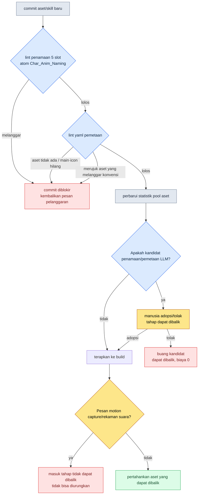

# 11.1 Konvensi Penamaan dan Pemetaan Skill-Aset Seni

Dua hari sebelum tenggat sprint, artist combat melempar satu klip video pendek lewat messenger tim. Combo tiga pukulan dari kelas Musa (prajurit pedang) yang baru. Pukulan pertama dan kedua diiringi suara pedang membelah angin, tetapi pukulan ketiga sama sekali tidak bersuara. Hening. Si artist bilang sudah memasang semua suaranya, dan penanggung jawab suara bilang sudah menyerahkan semua filenya. Keduanya tidak berbohong. File suaranya jelas-jelas ada di repository. Dengan nama `combo3_swing_final_real.wav`. Nama yang dicari oleh kode game adalah `sfx_K012_combo3_swing.wav`. Tidak satu huruf pun cocok.

Menelusuri insiden hening ini menyita sepanjang sore hari itu. Ini bukan soal satu klip, satu suara. Selama nama masih bisa ditentukan orang secara bebas, insiden seperti ini akan lahir kembali puluhan kali setiap kuartal. Bab ini adalah kisah tentang mengubah kebebasan itu menjadi aturan.

> **Pertanyaan yang dijawab bab ini**
> - Pada skala 10,000 aset, mengapa nama bukan kebebasan melainkan aturan
> - Apa yang tertutup ketika konvensi penamaan dipaksakan lewat atom dan diverifikasi otomatis lewat lint
> - Worked transcript saat AI membuat draf dan manusia memutuskan adopsi untuk pemetaan animasi, VFX, suara, dan ikon yang menempel pada satu skill

> **Satu baris untuk pembaca non-teknis.** Skala 10,000 aset atau format nama file fbx terlihat seperti urusan khusus game. Namun satu hal yang dapat Anda bawa pulang tidak memandang domain — **"Begitu nama ditentukan secara bebas, pencarian, otomatisasi, dan keterhubungan ikut terkunci."** Saat skala membesar, penamaan harus menjadi aturan, bukan selera, dan prinsip bahwa hanya nama yang sudah menjadi aturan-lah yang bisa ditemukan dan dipakai kode secara otomatis berlaku untuk pekerjaan apa pun yang menangani dokumen, aset, atau catatan pelanggan.

---

## 11.1.1 Skala 10,000 Aset

Proyek A yang saya arahkan adalah MMORPG dengan prioritas mobile. Skala kasar aset animasi karakternya kira-kira seperti di bawah ini. Jumlah kelas pemain dan jenis NPC musuh adalah angka operasional nyata, sedangkan jumlah klip dan total perkiraannya adalah perkiraan penulis (belum terverifikasi).

| Aset | Jumlah |
|---|---|
| Kelas karakter pemain | 6 |
| Jenis NPC musuh | 80\~100 |
| Rata-rata klip per karakter | 100\~150 (perkiraan penulis) |
| Perkiraan total klip | sekitar 10,000\~15,000 (perkiraan penulis) |

Sepuluh ribu. Ini sama dengan 10,000 laci. Berdiri di depan 10,000 laci tanpa label sambil mencari "di mana ya gerakan serangannya" adalah berjudi dengan daya ingat manusia. Dan perjudian itu pasti kalah. Kalau tidak ketemu, hasilnya salah satu dari dua hal. Waktu kerja membengkak dua kali lipat, atau—karena tidak ketemu—gerakan yang sama dibuat ulang. Yang kedua lebih buruk. Aset membengkak, dan kemudian dua gerakan yang sama berkeliaran dengan perbedaan yang halus.

Kalau nama berada di wilayah bebas, yang terkunci bukan hanya pencarian. Auto-routing—di mana "kode otomatis menemukan file animasi berdasarkan skill ID"—ikut terkunci. Kalau aturan tidak bisa dibaca dari nama, kode harus memegang tabel pemetaan yang ditulis tangan tentang file mana yang dipakai untuk setiap skill satu per satu. Tabel itu bertambah panjang secara manual setiap kali karakter baru masuk.

---

## 11.1.2 Format Penamaan Lima Slot — Membakukannya sebagai atom

Nama file animasi Proyek A dikunci menjadi lima kolom.

```
<role>_<id>_<category>_<action>_<variant>.fbx

char_K001_idle_default_v1.fbx
char_K001_locomotion_walk_forward.fbx
char_K001_combat_attack_combo1_v2.fbx
char_K001_react_hit_heavy.fbx
enemy_E021_combat_skill_aoe_v1.fbx
```

Kelima kolom mengikuti enum yang sudah ditetapkan. Kolom yang membolehkan input bebas hanya satu, yaitu `id`, dan kolom itu pun diikat ke format `[A-Z]\d{3}`.

| Slot | Jumlah enum | Contoh |
|---|---|---|
| role | 4 | char, enemy, pet, mount |
| id | format dikunci | K001, E021, P003, M005 |
| category | 8 | idle, locomotion, combat, react, death, social, cinematic, system |
| action | 10\~30 per kategori | walk, run, attack, skill_aoe, hit_heavy |
| variant | format dikunci | default, v1, v2, _short, _long |

Yang menjadi inti di sini bukan formatnya sendiri, melainkan ke mana format itu Anda masukkan. Kalau konvensi penamaan hanya ditulis di satu halaman dokumen wiki, itu cuma label yang tidak dibaca siapa pun. Saya menjadikan konvensi ini sebuah atom sumber kebenaran tunggal bernama `Char_Anim_Naming_Convention`, dan membuat manusia, lint, maupun LLM semuanya hanya memandang ke satu atom ini. Begitu format dibakukan sebagai atom alih-alih dokumen, penamaan berubah sifat dari "anjuran" menjadi "gerbang yang harus dilewati".

Kelemahannya, enum di kolom `action` bisa membengkak tanpa batas. Karena itu, action standar per kategori dikelola sebagai kamus.

```yaml
combat:
  - attack_basic
  - attack_combo1
  - attack_combo2
  - skill_<skill_id>
  - parry
  - dodge_forward
  - dodge_back
react:
  - hit_light
  - hit_heavy
  - knockback
  - stagger
  - stun
locomotion:
  - idle
  - walk_forward
  - run_forward
  - sprint
  - jump_start
  - jump_loop
  - jump_land
```

Apakah sebuah action baru boleh dimasukkan ke kamus diputuskan lewat prosedur. Apakah bisa dipakai tiga karakter atau lebih per kuartal, apakah benar-benar tidak bisa diekspresikan dengan action yang sudah ada, apakah kategorinya jelas, dan yang paling penting—apakah tidak bisa diserap menjadi variant. Kalau bisa ditangani sebagai variant, action tidak ditambah. Kalau kamus action terjaga di bawah 100 entri, itu pertanda operasional yang sehat. Namun ini tidak dijadikan batas atas mutlak. Kalau genre baru atau kelas baru masuk, bisa saja sekaligus bertambah 30\~40 entri. Yang harus dicegah bukan angkanya, melainkan pembiakan tanpa kendali.

---

## 11.1.3 Lint Memblokir commit

Setelah format dimasukkan sebagai atom, dibutuhkan pemeriksa yang memaksakan atom itu secara otomatis. Manusia tidak mungkin memeriksa lima kolom dengan mata setiap kali. Berikut adalah tulang punggung lint tersebut.

```python
# anim_naming_lint.py
import re, yaml

NAMING_PATTERN = re.compile(
    r"^(?P<role>char|enemy|pet|mount)_"
    r"(?P<id>[A-Z]\d{3})_"
    r"(?P<category>idle|locomotion|combat|react|death|social|cinematic|system)_"
    r"(?P<action>[a-z_]+?)"
    r"(?:_(?P<variant>v\d+|short|long|light|heavy|left|right|forward|back))?"
    r"\.fbx$"
)

ACTION_DICT = yaml.safe_load(open("char_anim_naming_convention.yaml"))

def check(filename):
    m = NAMING_PATTERN.match(filename)
    if not m:
        return f"Pelanggaran konvensi penamaan (format 5 slot tidak cocok): {filename}"

    category, action = m.group("category"), m.group("action")
    # Bentuk skill_<id> adalah action dinamis, jadi hanya prefix yang diperiksa
    base = "skill" if action.startswith("skill_") else action
    if base not in ACTION_DICT.get(category, []):
        return f"Di luar enum action ({category}): {action}"

    return None
```

Begitu fbx baru masuk ke repository, pemeriksaan ini berjalan. Kalau melanggar, commit diblokir. Yang penting di sini adalah bahwa pelanggaran tidak dibebankan sebagai tanggung jawab manusia. Alih-alih menyalahkan artist yang menyebabkan insiden hening, tanggung jawab dialihkan ke alat dengan logika "nama itu seharusnya memang tidak bisa di-commit sejak awal". Manusia berbuat salah, dan alat mencegah kesalahan itu. Inilah sikap dasar sebuah sistem penamaan.

Begitu penamaan dipaksakan, sebagai imbalannya auto-routing terbuka.

```python
def play_skill_animation(character, skill_id):
    anim_path = f"char_{character.id}_combat_skill_{skill_id}.fbx"
    if not exists(anim_path):
        anim_path = f"char_{character.id}_combat_skill_default.fbx"  # fallback
    play(anim_path)
```

Tabel pemetaan yang ditulis tangan lenyap. Sekalipun karakter baru dan skill baru masuk, asalkan file animasinya ditambahkan sesuai konvensi, kode tidak berubah satu baris pun. Kembali ke insiden hening: seandainya file suara itu hanya bisa masuk dengan nama konvensi `sfx_K012_combo3_swing.wav`—maka `combo3_swing_final_real.wav` sejak awal akan terpental di tahap commit, dan sore hari itu akan tetap utuh.

Slot variant adalah katup pengaman yang menjaga enum action. Versi dari gerakan yang sama (v1, v2), panjang (_short, _long), intensitas (_light, _heavy), arah (_forward, _back) semuanya diserap sebagai variant, sehingga action ditampung alih-alih dipecah-pecah secara halus. Dan kode game dapat memilih variant itu berdasarkan konteks.

```python
def select_variant(base_action, context):
    if context.distance < 3:
        return f"{base_action}_short"
    if context.distance > 10:
        return f"{base_action}_long"
    return base_action
```

Dengan begitu, konvensi penamaan menjadi titik percabangan kode.

---

## 11.1.4 Sepuluh Aset untuk Satu Skill — Pemetaan yaml

Kalau penamaan adalah L1, pemetaan yang menghubungkan skill dengan aset adalah L2. Satu skill biasanya menyeret 2\~3 animasi, 1\~3 VFX, 2\~5 suara, dan 1 ikon UI. Rata-rata sekitar 10 aset. Kalau ada 200 skill, target pemetaannya sekitar 2,000. Mengelola skala ini dengan kepala manusia itu mustahil. Karena itu, satu lembar yaml disediakan untuk setiap skill, dan aset skill itu diikat agar hanya bisa dibaca dari satu lembar tersebut.

```yaml
---
skill_id: skill_K001_combo1
description: Combo 1 K001 (3 pukulan berturut-turut)
type: melee_combo
animations:
  - clip: char_K001_combat_attack_combo1_v2.fbx
    role: main
    bone_alignment: spine_03
vfx:
  - asset: vfx_K001_combo1_slash.vfx
    socket: weapon_tip
    timing_ms: [0, 150, 300]
  - asset: vfx_hit_blood_light.vfx
    socket: target
    timing_ms: [150]
sound:
  - asset: sfx_K001_combo1_swing.wav
    volume: 0.8
    timing_ms: 0
  - asset: sfx_hit_metal_light.wav
    volume: 0.6
    timing_ms: 150
ui_icon: icon_skill_K001_combo1.png
ui_tooltip_key: skill_K001_combo1_tooltip
verified: true
---
```

Satu lembar ini adalah seluruh aset dari satu skill. Dan semua path aset di dalam yaml ini mengikuti konvensi lima slot dari 11.1. Kalau lint penamaan runtuh, pemetaan ini ikut runtuh. Kedua lapisan bekerja sebagai satu pasangan.

Kalau pemetaan terkumpul di satu tempat, penelusuran dampak terbuka secara otomatis. Ketika hendak merombak suatu VFX, kita tidak perlu mengubek-ubek dengan tangan untuk tahu skill mana yang terpengaruh.

```python
def find_skills_using(asset):
    affected = []
    for path in glob("skills/*.yaml"):
        skill = yaml.safe_load(open(path))
        for cat in ("vfx", "sound", "animations"):
            for entry in skill.get(cat, []):
                if entry.get("asset") == asset or entry.get("clip") == asset:
                    affected.append(skill["skill_id"])
    return affected

# find_skills_using("vfx_hit_blood_light.vfx")
# → ["skill_K001_combo1", "skill_K005_combo2", "skill_E021_attack_basic", ...]
```

Daftar skill yang terpengaruh secara otomatis terlampir di rapat penggantian aset. Sebelum pertanyaan "kalau ini diganti, ke mana saja dampaknya?" sempat keluar, jawabannya sudah tergeletak di samping notulen rapat.

Pemetaan pun dipasangi lint. Apakah semua file aset benar-benar ada, apakah animations.main dan ui_icon masing-masing ada satu, apakah timing_ms berada dalam rentang panjang animasi, dan—apakah semua path aset lolos konvensi penamaan 11.1. Butir terakhir adalah paku yang mengikat dua lapisan. Berjalan otomatis saat build.

---

## 11.1.5 Alur Verifikasi Penamaan dan Pemetaan

Saya rangkum dalam bentuk alur bagaimana lint penamaan dan lint pemetaan sejauh ini tersambung menjadi satu gerbang.



Perhatikan bahwa di ujung alur ini ada batas antara yang dapat dibalik dan yang tidak dapat dibalik. Penyuntingan yaml, kandidat LLM, hingga keyframe semuanya dapat dibalik. Kalau tidak suka, cukup dibuang, dan biayanya hampir 0. Namun begitu beralih ke pengambilan gambar motion capture, perekaman suara pengisi suara, dan casting signature voice, statusnya berubah menjadi tidak dapat dibalik. Ada pemesanan aktor dan studio, bilik rekaman, kontrak, dan persepsi pasar yang dipertaruhkan. Karena itu, semua keputusan penamaan, pemetaan, dan persona harus dituntaskan tepat sebelum tahap yang tidak dapat dibalik—yaitu di dalam wilayah yang dapat dibalik berupa yaml, kandidat LLM, dan keyframe.

---

## 11.1.6 Worked Transcript — Menyerahkan Draf Pemetaan Skill Baru ke AI

Sampai di sini bagian sistemnya, dan sekarang saya tunjukkan apa adanya dari sesi nyata di mana AI masuk. Ini adegan saat saya meminta LLM membuat draf pemetaan aset untuk skill api baru `skill_K012_flame_burst`.

**Prompt (lengkap):**

```
Berikut ini konvensi penamaan animasi karakter (atom) proyek kita, statistik pool aset yang ada,
serta satu yaml skill serupa.

[Konvensi penamaan]
<role>_<id>_<category>_<action>_<variant>.fbx
role: char|enemy|pet|mount / category: idle|locomotion|combat|react|death|social|cinematic|system

[Aset paling banyak dipakai di pool]
sfx_hit_metal_light.wav (47 skill), vfx_dust_kickup.vfx (38 skill),
vfx_fire_burst_med.vfx (22 skill), sfx_fire_whoosh.wav (19 skill)

[yaml skill serupa]
skill_id: skill_K005_fire_slash / type: melee_fire
animations: [char_K005_combat_attack_fire_v1.fbx]
vfx: [vfx_K005_fire_slash.vfx, vfx_fire_burst_med.vfx]
sound: [sfx_K005_fire_swing.wav, sfx_fire_whoosh.wav]

Skill baru: skill_K012_flame_burst (Musa K012, ledakan api area, 1 pukulan)
Susun draf yaml pemetaan untuk skill ini. Pakai ulang pool aset yang ada semaksimal mungkin,
dan tandai aset yang perlu diproduksi baru dengan tag [NEW].
```

**Keluaran mentah Claude (tanpa ringkasan/penyuntingan):**

```yaml
skill_id: skill_K012_flame_burst
description: Ledakan api area Musa K012 (1 pukulan)
type: aoe_fire
animations:
  - clip: char_K012_combat_skill_flame_burst_v1.fbx   # [NEW] perlu motion baru
    role: main
    bone_alignment: spine_03
vfx:
  - asset: vfx_fire_burst_med.vfx     # dipakai ulang (pool 22 skill)
    socket: ground
    timing_ms: [200]
  - asset: vfx_K012_flame_ring.vfx    # [NEW] baru untuk ekspresi area
    socket: ground
    timing_ms: [200, 350]
sound:
  - asset: sfx_fire_whoosh.wav        # dipakai ulang (pool 19 skill)
    volume: 0.8
    timing_ms: 0
  - asset: sfx_explosion_low.wav      # [NEW] perkiraan suara ledakan baru
    volume: 0.9
    timing_ms: 200
ui_icon: icon_skill_K012_flame_burst.png   # [NEW]
ui_tooltip_key: skill_K012_flame_burst_tooltip
verified: false
```

> Catatan: pada `char_K012_combat_skill_flame_burst_v1.fbx`, action-nya adalah
> `skill_flame_burst`, tetapi perlu dipastikan apakah menurut konvensi penamaan,
> action skill berformat `skill_<skill_id>`. Karena konvensi tidak menyatakan
> secara eksplisit apakah memakai `skill_K012` atau `skill_flame_burst`,
> saya membuat asumsi.

**Verifikasi/penolakan manusia:**

Catatan terakhir tepat menunjuk titik lemahnya. Bukan LLM yang tidak tahu, melainkan format kolom itu tertulis ambigu di atom konvensi. Sebenarnya, konvensi Proyek A memakai format `skill_<skill_id>`. Jadi nama file yang benar adalah `char_K012_combat_skill_K012_v1.fbx`. `skill_flame_burst` yang dibuat LLM ditolak. Dan `sfx_explosion_low.wav` ditandai sebagai [NEW], tetapi setelah memeriksa ulang pool aset, ternyata `sfx_impact_heavy.wav` sudah dipakai sebagai suara ledakan di 47 skill. Statistik pool yang saya berikan ke LLM hanya sampai TOP 4, jadi itu terlewat. Diubah dari produksi baru menjadi pakai ulang.

**Permintaan ulang:**

```
Perbaiki dua hal dan susun ulang.
1. Format skill action adalah skill_<skill_id>. Untuk skill K012, action-nya skill_K012.
2. Di pool aset ada sfx_impact_heavy.wav (47 skill, suara ledakan/benturan).
   Alih-alih memproduksi sfx_explosion_low.wav baru, pakai ulang yang ini.
Statistik pool lengkap adalah sebagai berikut. [38 jenis lengkap terlampir]
```

Dalam satu siklus ini, yang dikerjakan LLM adalah "draf yang masuk akal", dan yang dikerjakan manusia adalah "menemukan titik ambigu konvensi, menemukan kelalaian pool, dan memutuskan pakai ulang". LLM cenderung terlalu mudah menandai kandidat aset baru dengan [NEW], sehingga keputusan pakai ulang tetap dipegang manusia sampai akhir. Meski begitu, menyusun yaml dari nol di layar kosong dan menerima draf untuk diadopsi/ditolak lalu diperbaiki adalah beban kerja yang berbeda.

---

## 11.1.7 Dari Konservatif ke Progresif — Tahap saat Manusia Hanya Mengadopsi

Transcript di atas justru adalah salah satu adegan penerapan progresif. Operasional penamaan dan pemetaan terbagi menjadi dua tahap.

Pada tahap konservatif, manusia memberi nama dan menyusun pemetaan, sementara otomatisasi hanya menangani verifikasi (lint) dan penelusuran (`find_skills_using`). Saat ini sebagian besar operasional karakter dan aset MMORPG berada di sini. Pada tahap progresif, LLM mengajukan kandidat untuk draf penamaan, draf pemetaan, hingga pembangkitan persona NPC, dan keputusan yang tersisa di tangan manusia menyempit menjadi satu: "kandidat mana yang akan diadopsi".

Agar tahap progresif mapan, tiga hal harus tersedia. Pertama adalah mesin lint konvensi penamaan. Kandidat penamaan yang dibuat LLM pun hanya diadopsi kalau lolos lint lima slot yang sama persis dengan buatan manusia. Pada transcript di atas, ditolaknya `skill_flame_burst` dari LLM adalah gerbang ini. Kedua adalah pembangkit persona NPC otomatis. Kalau yaml karakter diuraikan ke tiga sumbu voice_profile, anim_set, dan skill_set, LLM dapat menerima deskripsi seperti "Musa usia 50-an, hati-hati, nada rendah" lalu mengusulkan kandidat untuk masing-masing ketiga sumbu secara terpisah. Menyusun tiga sumbu untuk 100 NPC dari nol dan memilih dari beberapa kandidat per persona adalah beban yang berbeda. Ketiga adalah pembangkit kandidat pemetaan. Kebalikan dari `find_skills_using`—pencarian "aset yang ada yang cocok untuk skill baru ini"—digabung dengan statistik pool aset untuk mengusulkan kandidat pakai ulang per slot. Ini efek dua arah yang menurunkan biaya produksi baru sekaligus menaikkan tingkat pemakaian ulang.

Ketiga elemen ini berjalan di atas infrastruktur yang sama (yaml, lint, statistik pool aset). Ketiganya hanya aktif kalau konvensi penamaan dan yaml pemetaan tersusun rapi sebagai sumber kebenaran tunggal, dan kalau penyusunan itu runtuh, tidak ada input yang bisa diberikan ke LLM sama sekali.

Patut dicatat bahwa ketiga elemen ini secara teori sebenarnya sudah mungkin pada dekade 2010-an. Yang tersumbat ada di tiga tempat. Komputer tidak memahami apa itu sebuah gerakan dalam bahasa alami sehingga tidak bisa membuat kandidat lima slot, memisahkan lalu mengikat voice, anim, dan skill adalah wilayah intuisi manusia, dan mencari "VFX dengan nuansa serupa" lewat deskripsi teks itu sulit. Sejak 2023, dengan kemajuan LLM, ketiga tempat itu masuk ke wilayah yang dapat dibantu. Sebagian besar visi progresif tentang menjadikan karakter sebagai aset yang dulu hanya ada di atas kertas kini telah berpindah ke tahap penerapan praktis.

---

## 11.1.8 Pengukuran — Sebelum dan Sesudah Penerapan

Berikut perbandingan sebelum dan sesudah penerapan penamaan dan pemetaan di Proyek A. Waktu pencarian dan durasi onboarding adalah arah yang benar-benar saya rasakan dan catat, sedangkan butir berupa rasio adalah hasil pengukuran nyata yang dihimpun dari retrospektif kuartalan. Saya nyatakan bahwa sebagian angka absolut adalah perkiraan penulis (belum terverifikasi).

| Item | Sebelum | Sesudah |
|---|---|---|
| Waktu mencari gerakan (animator) | 5\~10 menit | 30 detik |
| Rasio produksi duplikat | 12\~15% | 1\~2% |
| Perubahan kode routing karakter baru | 50\~100 baris | 0 baris |
| Insiden aset skill baru hilang | 5\~8 per kuartal | 0\~1 |
| Akumulasi aset tak terpakai (proporsi library) | sekitar 30% | sekitar 8% |
| Onboarding animator baru | 2 minggu | 3 hari |

Butir terakhir adalah efek yang paling senyap tetapi paling besar. Satu atom konvensi penamaan sekaligus menjadi panduan onboarding. Untuk animator baru, satu kalimat "beri nama dengan lima kolom ini, dan kalau lint memblokir, dengarkan lint" sudah cukup membuat pekerjaan hari pertama bisa dilakukan.

---

## 11.1.9 Kegagalan yang Umum

| Pola | Resep |
|---|---|
| Konvensi penamaan hanya ditaruh sebagai dokumen wiki | Bakukan sebagai atom tunggal + paksakan lewat lint |
| Pembiakan enum action tanpa batas | Kamus + prosedur penambahan baru |
| commit tanpa verifikasi penamaan | Blokir commit lewat lint otomatis |
| Tabel pemetaan di-hardcode dalam kode | Auto-routing berbasis penamaan |
| Action dipecah halus tanpa variant | Serap lewat slot variant |
| Pemetaan aset tersebar di kode, sheet, dan dokumen | Satukan ke satu file yaml |
| Mengadopsi kandidat pemetaan LLM tanpa verifikasi | Lint penamaan + keputusan pakai ulang oleh manusia |
| Membebankan pelanggaran penamaan ke manusia | Perkuat lint, alihkan tanggung jawab ke alat |

---

### Poin-Poin Penting
- Pada skala 10,000 aset, nama bukan kebebasan kreatif, melainkan gerbang yang harus dilewati
- Kalau konvensi penamaan dimasukkan sebagai atom dan dipaksakan lewat lint, auto-routing dan pemetaan terbuka
- LLM membuat draf penamaan dan pemetaan, manusia hanya memutuskan adopsi dan pakai ulang

### Coba Sendiri

**setup** — Definisikan nama file animasi sebagai lima slot `<role>_<id>_<category>_<action>_<variant>.fbx`, lalu kumpulkan kamus action per kategori ke dalam satu file yaml. Deklarasikan yaml ini sebagai sumber kebenaran tunggal tim.

**prompt** — Berikan ke LLM "[yaml konvensi penamaan] + [statistik pool aset] + [1 yaml skill serupa]", lalu minta draf yaml pemetaan untuk skill baru. Nyatakan secara eksplisit agar membedakan aset yang dipakai ulang dan aset yang diproduksi baru (tag [NEW]).

**verify** — Lewatkan semua path aset dari keluaran LLM ke lint penamaan (lihat `anim_naming_lint.py` di atas). Kalau tidak lolos, tolak. Di antara kandidat yang lolos, untuk tag [NEW], periksa kembali pool aset dan manusia memutuskan apakah bisa dipakai ulang.

### Versi Ringkas Solo
- Alih-alih atom, tulis konvensi lima slot dan kamus action di satu halaman README.
- Pasang lint sebagai satu file `anim_naming_lint.py` di git pre-commit hook.
- Kalau jumlah skill sedikit, mulailah dengan satu spreadsheet (baris skill × kolom aset) alih-alih yaml pemetaan, lalu pindah ke yaml saat melampaui 200.
- Untuk draf pemetaan LLM, model gratis/murah pun sudah cukup. Intinya, manusia yang memegang lint dan keputusan pakai ulang.

### Pratinjau Bab Berikutnya
- 11.2 Sistem Pet dan Mount — variasi di mana, pada wilayah yang menjadi berlebihan kalau pola karakter dibawa apa adanya, AI memproduksi instans massal dan lint memverifikasi dengan struktur template+instans yang berbagi 90%
