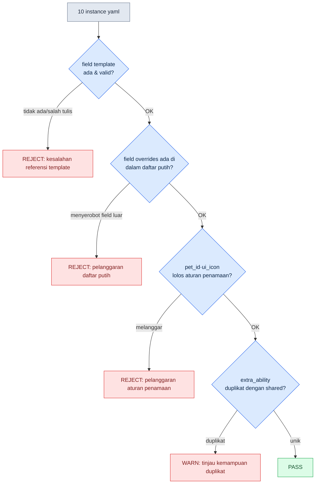

# 11.2 Sistem Pet dan Mount — dari 1 Template ke 50 Instance

Di awal rapat desain, daftar pet muncul di layar. Dua belas jenis dari golongan serigala, delapan jenis dari golongan kucing, lima jenis dari golongan burung. Tidak ada yang berkata, "Kalau begitu, ayo kita buat satu per satu." Tidak seperti karakter, pet sejak awal sudah berasumsi bahwa "50 jenis akan dicetak". Pertanyaannya bukan "bagaimana membuat satu jenis dengan baik", melainkan dimulai dengan "berapa jenis yang akan berbagi satu kerangka yang sudah dibuat sekali".

Setiap jenis karakter adalah sosok unik bagi pengguna, jadi kita curahkan perhatian satu per satu. Sebaliknya, pet dan mount sebagian besar adalah 'variasi yang hanya mengubah warna dan kemampuan di atas kerangka yang sama', sehingga sejak awal desain kita menyiapkan konvensi penamaan, template, dan lint untuk memasang jalur produksi massal. Kalau Anda membuat satu jenis dengan susah payah lalu membiarkannya disalin menjadi dua belas salinan, dua belas ekor serigala yang hanya berbeda warna masing-masing memuat klip animasi yang sama secara terpisah, dan folder membengkak hingga 4 giga. Itu bukan produksi massal, melainkan hasil dari tidak melakukan produksi massal. Intinya bukan 'seberapa baik membuatnya', melainkan 'seberapa sedikit membuat dan seberapa banyak berbagi'.

Karena itu, bab ini mengikuti satu alur dari awal sampai akhir: mendefinisikan satu template pet golongan serigala dengan yaml, menyuruh AI memproduksi massal instance yang mewarisi kerangka tersebut, memverifikasinya dengan lint, lalu mengukur berapa persen yang dibuang.

## 11.2.1 Pemisahan Template dan Instance

Ketiganya memiliki struktur sumber daya yang mirip, tetapi bobot persepsi pengguna berbeda. Karakter adalah diri pengguna sendiri yang menghabiskan 100% waktu bermain bersamanya. Pet adalah rekan yang ditempatkan di sisi, menghabiskan 50\~70% waktu bersama, sedangkan mount adalah alat yang hanya dikeluarkan saat bergerak, tinggal di 10\~20%. Semakin rendah bobot persepsi, semakin sedikit pengguna memperhatikan detail. Mencurahkan perhatian yang sama untuk mount seperti yang diberikan pada karakter sama saja dengan mengelola meja yang diduduki setiap hari dan kursi lipat yang sesekali dibuka dengan anggaran yang sama.

Karena itu, pet dan mount dioperasikan dengan struktur 'template-instance'. Kita membuat satu **template** yang memuat kerangka, gerakan, dan kemampuan dasar, lalu menumpangkan **instance** yang hanya mengubah warna, ikon, dan kemampuan halus di atasnya. Karena instance berbagi 90% sumber daya yang dimiliki template, yang benar-benar dibuat baru hanyalah 10% sisanya. Pemisahan ini bila digambarkan adalah sebagai berikut.

<svg viewBox="0 0 720 300" xmlns="http://www.w3.org/2000/svg" font-family="sans-serif" font-size="13">
  <rect x="20" y="20" width="200" height="260" rx="8" fill="#eef3fb" stroke="#3b6ea5" stroke-width="2"/>
  <text x="120" y="45" text-anchor="middle" font-weight="bold" fill="#1f3b5c">Template (1 jenis)</text>
  <text x="120" y="68" text-anchor="middle" fill="#1f3b5c">pet_template_canine</text>
  <rect x="40" y="85" width="160" height="28" rx="4" fill="#fff" stroke="#3b6ea5"/>
  <text x="120" y="104" text-anchor="middle">kerangka skeleton</text>
  <rect x="40" y="120" width="160" height="28" rx="4" fill="#fff" stroke="#3b6ea5"/>
  <text x="120" y="139" text-anchor="middle">4 animasi bersama</text>
  <rect x="40" y="155" width="160" height="28" rx="4" fill="#fff" stroke="#3b6ea5"/>
  <text x="120" y="174" text-anchor="middle">2 kemampuan bersama</text>
  <rect x="40" y="190" width="160" height="28" rx="4" fill="#fff" stroke="#3b6ea5"/>
  <text x="120" y="209" text-anchor="middle">BT dasar</text>
  <text x="120" y="250" text-anchor="middle" fill="#888" font-size="11">90% sumber daya (dibuat sekali saja)</text>

  <line x1="220" y1="150" x2="300" y2="80" stroke="#888" stroke-width="1.5"/>
  <line x1="220" y1="150" x2="300" y2="150" stroke="#888" stroke-width="1.5"/>
  <line x1="220" y1="150" x2="300" y2="220" stroke="#888" stroke-width="1.5"/>

  <rect x="300" y="55" width="380" height="50" rx="6" fill="#f3f9ee" stroke="#5a8f3c" stroke-width="1.5"/>
  <text x="315" y="78" font-weight="bold" fill="#2f5320">pet_P003 (serigala abu-abu)</text>
  <text x="315" y="96" fill="#555" font-size="11">override: skin=gray, icon, 1 kemampuan</text>

  <rect x="300" y="125" width="380" height="50" rx="6" fill="#f3f9ee" stroke="#5a8f3c" stroke-width="1.5"/>
  <text x="315" y="148" font-weight="bold" fill="#2f5320">pet_P004 (serigala hitam)</text>
  <text x="315" y="166" fill="#555" font-size="11">override: skin=black, icon, 1 kemampuan</text>

  <rect x="300" y="195" width="380" height="50" rx="6" fill="#f3f9ee" stroke="#5a8f3c" stroke-width="1.5"/>
  <text x="315" y="218" font-weight="bold" fill="#2f5320">pet_P005 (serigala salju) … sampai P012</text>
  <text x="315" y="236" fill="#555" font-size="11">override: skin=snow, icon, 1 kemampuan — hanya 10% sumber daya baru</text>
</svg>

Begitu Anda membuat satu blok template di kiri, instance-instance di kanan tinggal mengganti warna, ikon, dan satu baris kemampuan saja. 'Folder 4 giga' yang disebut sebelumnya adalah gambaran yang muncul ketika pemisahan ini terlewat dan 90% sumber daya disalin dua belas kali.

## 11.2.2 Penamaan dan Format Sumber Daya — Mengurangi Satu Slot dari Karakter

Konvensi penamaan pet dan mount adalah bentuk yang menghapus satu slot dari penamaan karakter di 11.1. Karakter memakai 5 slot `char_<id>_<category>_<action>_<variant>`, tetapi pet dan mount menghilangkan variant dan memakai 4 slot. Jika variant dibutuhkan, ia digabungkan ke dalam action.

```
pet_<id>_<category>_<action>.fbx
mount_<id>_<category>_<action>.fbx

Contoh:
pet_P003_idle_default.fbx
pet_P003_combat_bite.fbx
mount_M005_locomotion_run.fbx
```

Format yaml pemetaan sumber daya pun dibuat lebih ringan dengan menghapus slot vfx dan sound dari format karakter. Instance yang membawa slot-slot ini secara utuh akan menjadi format yang penuh dengan kolom kosong, sehingga lint menampilkan peringatan sia-sia setiap kali.

Sekarang masuk ke inti. Mari kita definisikan satu template golongan serigala, lalu produksi massal instance dari sana.

## 11.2.3 Worked Transcript: 1 Template → Produksi Massal Instance → lint → Tingkat Pembuangan

### Tahap 1 — Menulis Template yaml Secara Langsung

Sebelum menyuruh AI memproduksi massal, manusia memfinalkan satu template dengan tangan. Karena satu jenis ini menjadi standar kualitas bagi puluhan jenis instance, ia tidak diotomatiskan. Template golongan serigala (canine) dibuat seperti ini.

```yaml
# pet_template_canine.yaml
template_id: pet_template_canine
skeleton: skel_quadruped_medium      # kerangka bersama berkaki empat ukuran sedang
shared_animations:
  - clip: pet_template_canine_idle_default.fbx
  - clip: pet_template_canine_locomotion_walk.fbx
  - clip: pet_template_canine_locomotion_run.fbx
  - clip: pet_template_canine_combat_bite.fbx
shared_abilities:
  - id: pet_template_canine_passive_speed
    description: Kecepatan gerak rekan +3%
  - id: pet_template_canine_active_bite
    description: Gigit target tunggal, cooldown 12s
bt_ref: bt_pet_canine_default        # BT dasar mengikuti + bantuan tempur
instance_overridable:                # daftar putih field yang boleh diubah instance
  - visual_skin
  - ui_icon
  - ui_tooltip_key
  - extra_ability                    # boleh tambah hingga 1 kemampuan per instance
```

Di sini `instance_overridable` adalah perangkat intinya. Ia mematok field yang boleh disentuh instance sebagai daftar putih. Jika AI saat memproduksi massal mencoba mengubah kerangka atau animasi bersama seenaknya, itu berarti menyentuh field yang tidak ada di daftar ini, sehingga lint menangkapnya. Mendefinisikan 'apa yang boleh diubah' lebih dulu adalah sabuk pengaman produksi massal.

### Tahap 2 — Meminta AI Memproduksi Massal Instance (prompt lengkap)

Berikut adalah prompt lengkap yang menyuruh memproduksi massal 10 jenis instance. Saya tampilkan apa adanya tanpa diringkas.

```
[Prompt]
Anda adalah asisten yang membantu menulis data pet. Berdasarkan template di bawah,
hasilkan yaml untuk 10 jenis instance pet golongan serigala.

[Template] pet_template_canine.yaml
(yaml lengkap di atas ditempelkan)

[Aturan]
1. Setiap instance wajib mencantumkan template: pet_template_canine.
2. Pada overrides, masukkan hanya field dari daftar putih instance_overridable.
   Field yang tidak ada di daftar putih (skeleton, shared_animations, dll.) sama sekali tidak boleh disentuh.
3. visual_skin harus berupa variasi serigala yang wajar (warna, corak, ukuran).
4. extra_ability maksimal 1 per instance. Pilih salah satu antara passive atau active.
   Efeknya tidak boleh tumpang tindih dengan shared_abilities yang sudah ada.
5. ui_icon, ui_tooltip_key mengikuti aturan penamaan yang sesuai dengan pet_id.
6. pet_id diberikan dari pet_P003 sampai pet_P012.

Keluaran hanya 10 blok yaml. Jangan tambahkan kalimat penjelasan.
```

Aturan 2 berpasangan dengan daftar putih dari Tahap 1. "Tidak boleh tumpang tindih" pada Aturan 4 adalah batasan yang mencegah AI menyalin kemampuan dengan malas. Jika batasan semacam ini tidak dipasang, seperti yang akan kita lihat nanti, AI akan menyatu ke pilihan teraman (menyalin-tempel kemampuan yang sudah ada).

### Tahap 3 — Keluaran Mentah Claude (tanpa ringkasan dan adaptasi)

Dari keluaran yang dimuntahkan AI, saya kutip apa adanya campuran antara yang berhasil, gagal, dan ambigu. Tidak dirapikan.

```yaml
# Keluaran 1 — normal
pet_id: pet_P003
template: pet_template_canine
overrides:
  visual_skin: wolf_gray
  ui_icon: icon_pet_P003.png
  ui_tooltip_key: pet_P003_tooltip
  extra_ability:
    id: pet_P003_active_howl
    description: Kecepatan gerak musuh -20% selama 5 detik, cooldown 30s

# Keluaran 2 — normal
pet_id: pet_P004
template: pet_template_canine
overrides:
  visual_skin: wolf_black
  ui_icon: icon_pet_P004.png
  ui_tooltip_key: pet_P004_tooltip
  extra_ability:
    id: pet_P004_passive_crit
    description: Peluang critical hit rekan +2%

# Keluaran 5 — ambigu (kemampuan praktis duplikat dengan kemampuan bersama)
pet_id: pet_P007
template: pet_template_canine
overrides:
  visual_skin: wolf_brown
  ui_icon: icon_pet_P007.png
  ui_tooltip_key: pet_P007_tooltip
  extra_ability:
    id: pet_P007_passive_speed_boost
    description: Kecepatan gerak rekan +3%   # ← efek sama dengan passive_speed pada shared

# Keluaran 8 — gagal (menyerobot field di luar daftar putih)
pet_id: pet_P010
template: pet_template_canine
overrides:
  visual_skin: wolf_white
  ui_icon: icon_pet_P010.png
  shared_animations:                 # ← tidak ada di daftar putih overridable
    - clip: pet_P010_combat_pounce.fbx
  extra_ability:
    id: pet_P010_active_pounce
    description: Serangan menerkam, cooldown 20s

# Keluaran 9 — gagal (melanggar aturan penamaan)
pet_id: P011                          # ← awalan 'pet_' hilang
template: pet_template_canine
overrides:
  visual_skin: wolf_silver
  ui_icon: pet11_icon.png            # ← melanggar aturan icon_pet_P011.png
  ui_tooltip_key: pet_P011_tooltip
  extra_ability:
    id: pet_P011_passive_dodge
    description: Penghindaran rekan +1%
```

Dari 10 jenis, yang normal ada enam yaitu P003, P004, P005, P006, P008, P012; yang ambigu karena kemampuan duplikat ada satu yaitu P007; dan yang gagal karena penyerobotan daftar putih atau pelanggaran penamaan ada tiga yaitu P009, P010, P011. Meskipun Aturan 4 dipasang, AI tetap menyalin kemampuan bersama pada P007 (pilihan teraman), dan meskipun Aturan 2 dipasang, ia menyentuh animasi kerangka pada P010. Meskipun batasan dicantumkan, kenyataannya sebagian persentase dari hasil produksi massal tetap bocor. Karena itu tahap berikutnya dibutuhkan.

### Tahap 4 — Verifikasi lint

Alih-alih manusia memeriksa 10 jenis satu per satu dengan mata, kita menjalankan lint. Aturan lint ditarik langsung dari daftar putih template Tahap 1 dan konvensi penamaan 11.1. Item pemeriksaannya ada empat.



Jika setiap instance lolos keempat gerbang maka PASS, jika tersangkut di tengah maka jatuh menjadi REJECT atau WARN. Hasil verifikasi nyata bila dirangkum dalam tabel adalah seperti ini.

| pet_id | template | daftar putih | penamaan | kemampuan duplikat | putusan |
|---|---|---|---|---|---|
| pet_P003 | OK | OK | OK | unik | PASS |
| pet_P004 | OK | OK | OK | unik | PASS |
| pet_P005 | OK | OK | OK | unik | PASS |
| pet_P006 | OK | OK | OK | unik | PASS |
| pet_P007 | OK | OK | OK | **duplikat** | WARN |
| pet_P008 | OK | OK | OK | unik | PASS |
| pet_P009 | OK | OK | **melanggar** | — | REJECT |
| pet_P010 | OK | **menyerobot** | — | — | REJECT |
| P011 | OK | OK | **melanggar** | — | REJECT |
| pet_P012 | OK | OK | OK | unik | PASS |

PASS 6, WARN 1, REJECT 3. WARN bisa diselamatkan dengan mengubah satu baris kemampuan (P007), sedangkan 3 jenis REJECT dibuang.

### Tahap 5 — Mengukur Tingkat Pembuangan dan Mengajukan Ulang

**Tingkat pembuangan** dari satu siklus ini adalah REJECT 3 / total 10 = **30%**. Jika WARN juga diikat sebagai 'yang harus diperbaiki', tingkat penyuntingan adalah 40%. Angka ini adalah indikator kesehatan jalur produksi massal. Jika tingkat pembuangan 30%, artinya untuk mengamankan 50 jenis pet, Anda harus menghasilkan sekitar 72 jenis (50 / 0.7 ≈ 71.4). Karena generasi itu murah, overshooting sebesar ini masih sanggup ditanggung. Namun, jika tingkat pembuangan tidak turun meski siklus diulang, itu adalah sinyal bahwa batasan prompt kurang.

Karena itu, alasan pembuangan diumpankan balik ke prompt. Saya kumpulkan alasan dari 3 jenis REJECT (penamaan hilang, penyerobotan daftar putih, pelanggaran aturan ikon) dan menambahkan satu baris untuk masing-masing ke pengajuan ulang.

```
[Aturan tambahan pengajuan ulang]
7. pet_id wajib dimulai dengan awalan 'pet_'. (P011 hilang pada batch sebelumnya)
8. ui_icon tanpa kecuali berformat icon_<pet_id>.png. (Dilarang variasi seperti pet11_icon.png)
9. Jangan sekali-kali memasukkan shared_animations / skeleton / bt_ref ke overrides.
   Jika ingin mengubah gerakan, nyatakan hanya melalui extra_ability. (kasus P010)
```

Setelah menambahkan ketiga baris ini dan menjalankan batch berikutnya 10 jenis, REJECT berkurang dari 3 menjadi 1. Tingkat pembuangan 30% → 10%. Umpan balik yang mempromosikan alasan pembuangan menjadi aturan inilah mekanisme yang mengangkat kualitas produksi massal di setiap siklus. Alih-alih memeriksa 50 jenis setiap kali, manusia hanya melakukan pekerjaan memindahkan alasan pembuangan menjadi satu baris aturan.

## 11.2.4 Mount — Bahkan Kerangka pun Dibagi, Nyaris Hanya Data

Mount satu tingkat lebih sederhana daripada pet. Tidak ada skill maupun BT (BehaviorTree, pohon perilaku), hanya ada data seperti parameter gerak dan apakah bisa bertempur. Karena itu, instance mount praktis adalah satu baris dalam tabel.

```yaml
# instance berbasis mount_template_equine.yaml
mount_id: mount_M005
template: mount_template_equine
overrides:
  visual_skin: horse_white
  movement:
    run_speed: 7.0
    sprint_speed: 12.0
  combat:
    allow_combat: false       # tidak bisa digunakan saat bertempur
    dismount_on_damage: true
  ui_icon: icon_mount_M005.png
```

Lint untuk produksi massal mount lebih pendek. Selain penamaan, referensi template, dan daftar putih, ia hanya perlu memeriksa 'apakah parameter movement berada dalam rentang yang diizinkan' (misalnya, apakah sprint_speed lebih besar dari walk_speed, apakah tidak melampaui batas atas). Ini adalah bentuk yang memakai langsung jalur yang dibuat di pet tetapi hanya mengurangi jumlah gerbang. Menambahkan fungsi tempur pada mount harus dilakukan dengan hati-hati. Begitu allow_combat dibuka menjadi true, kompleksitas game menjadi dua kali lipat, dan verifikasi konflik dengan sistem pet dan karakter harus dilakukan ulang.

## 11.2.5 Pengukuran — Penyederhanaan Tidak Mengikis Pengalaman

Saya membandingkan kasus menerapkan pola karakter sepenuhnya pada pet dan mount dengan kasus menyederhanakannya menjadi template-instance, pada Proyek A milik penulis. Di antara angka-angka di bawah, angka waktu dan sumber daya adalah perkiraan penulis (belum terverifikasi), sedangkan tingkat pembuangan dan rasio berbagi sumber daya adalah rasio yang mengikuti arah pengukuran nyata.

| Item | Penerapan penuh | Template-instance |
|---|---|---|
| Waktu kerja sumber daya 1 jenis pet | 1\~2 minggu (perkiraan penulis) | 3\~5 hari (perkiraan penulis) |
| Jumlah sumber daya pustaka pet | sekitar 2,000 (perkiraan penulis) | sekitar 600 (hemat 70%) |
| Rasio sumber daya baru per instance | 100% | sekitar 10% |
| Tingkat pembuangan produksi massal batch pertama | — | 30% (arah pengukuran nyata) |
| Tingkat pembuangan setelah umpan balik | — | 10% (arah pengukuran nyata) |
| Persepsi pengguna (keragaman pet) | acuan | nyaris sama |

> **Sampel dan pengukuran.** Tabel di atas adalah pengamatan 1 lini pet dari 1 proyek (Proyek A) di lingkungan penulis (n=1 lini). 'Hemat 70%' dan 'sekitar 10%' bukan pengukuran independen, melainkan **rasio aritmetika** yang berasal dari perkiraan jumlah sumber daya pada baris yang sama (sekitar 2,000 → sekitar 600), jadi karena nilai absolut di depannya adalah perkiraan, persentase ini pun harus dibaca sebagai perkiraan. Tingkat pembuangan 30% dan 10% adalah **arah pengukuran nyata** yang berasal dari satu siklus produksi massal tunggal (batch pertama hingga umpan balik), bukan sampel pengukuran berulang. Jangan mengutipnya sebagai dasar penghematan tim Anda; ukurlah sendiri secara langsung pada lini Anda dengan cara yang sama.

Baris terakhir adalah kesimpulan dari seluruh bab ini. Meski memproduksi massal dengan berbagi 90% sumber daya dan mengukur tingkat pembuangan, keragaman pet yang dirasakan pengguna nyaris tidak berbeda dengan pembuatan penuh. Folder 4 giga yang disebut sebelumnya adalah biaya yang dibayar ketika menyalin dua belas salinan sumber daya untuk detail yang pada akhirnya tidak akan bisa dibedakan pengguna. Jika produksi massal dipasang sebagai premis, yang berkurang adalah biaya operasional, bukan pengalaman.

## 11.2.6 Jebakan Operasional

| Jebakan | Resep |
|---|---|
| Memindahkan sistem karakter apa adanya ke pet dan mount | Variasi 4 slot yang menghapus slot variant, vfx, sound |
| Menyalin pet berkerangka sama sebagai sumber daya independen | 1 template + instance, paksa berbagi dengan daftar putih |
| Commit hasil produksi massal AI tanpa tinjauan manusia | lint 4 gerbang + pengukuran tingkat pembuangan |
| Tingkat pembuangan tidak turun di setiap siklus | Promosikan alasan pembuangan menjadi aturan prompt (umpan balik) |
| Memberi skill setingkat karakter pada pet | Batas atas 1 extra_ability per instance |
| Memberi fungsi tempur pada mount | allow_combat dengan hati-hati, siap kompleksitas ×2 |

## 11.2.7 Tempat AI dan Tempat Manusia

Pet dan mount berpengaruh kecil pada pengalaman pengguna, sehingga kebebasan AI lebih besar daripada karakter. Mencocokkan konsep ke template yang sesuai, mengusulkan kandidat kemampuan, dan memproduksi massal yaml instance adalah pekerjaan yang diselesaikan AI dengan cepat. Namun, jika verifikasi ditiadakan dengan alasan kebebasan yang besar, 30% sampah yang kita lihat di atas akan tercampur apa adanya ke dalam build. Tempat manusia ada dua. Pertama, memfinalkan satu template dengan tangan untuk mematok standar kualitas. Kedua, membaca apa yang tersaring dan mengapa, lalu memoles batasan agar batch berikutnya lebih sedikit bocor. Pembagian kerja di mana AI mengisi kuantitas sedangkan manusia memegang garis dasar dan koreksinya inilah yang menggerakkan sistem ini.

---

### Poin-Poin Penting
- Pet dan mount adalah sistem yang bukan tentang membuat dengan baik, melainkan membuat sedikit dan berbagi banyak
- Satu template diinput dengan tangan, sedangkan instance diproduksi massal oleh AI di dalam daftar putih
- Jika tingkat pembuangan diukur dan alasannya diumpankan balik menjadi aturan prompt, kualitas naik di setiap siklus

### Pratinjau Bab Berikutnya
- 12.1 Art Directing — cara Game Designer berkolaborasi dengan dan meninjau art

---

## Coba Sendiri

**setup**
1. Tentukan kerangka bersama, 4 animasi bersama, dan 2 kemampuan bersama dari satu golongan pet (misalnya serigala), lalu simpan sebagai `pet_template_<golongan>.yaml`.
2. Cantumkan daftar putih `instance_overridable` (field yang boleh diubah) pada template.
3. Siapkan lint 4 gerbang (referensi template / daftar putih / aturan penamaan / kemampuan duplikat) sebagai skrip.

**prompt**
4. Tempelkan yaml template lengkap + aturan produksi massal (dilarang field di luar daftar putih, dilarang kemampuan duplikat, aturan penamaan) lalu minta 10 jenis instance.
5. Patok format keluaran menjadi "hanya blok yaml, dilarang penjelasan".

**verify**
6. Jalankan lint untuk mengelompokkan PASS / WARN / REJECT dan hitung tingkat pembuangan.
7. Kumpulkan alasan REJECT, tambahkan satu baris aturan untuk masing-masing ke prompt, lalu jalankan batch berikutnya. Periksa apakah tingkat pembuangan turun.

## 11.2.8 Versi Ringkas Solo
Kalau Anda membuat game sendirian, tanpa skrip lint pun tidak masalah. Tulis satu lembar yaml template untuk satu golongan pet dengan tangan, lalu minta AI, "Dari template ini, buat 5 jenis instance yang hanya mengubah warna, ikon, dan kemampuan; jangan sekali-kali menyentuh kerangka dan animasi bersama." Pindai 5 jenis yang Anda terima dengan mata, dan buang hanya yang menyentuh kerangka atau yang melanggar aturan nama. Tambahkan satu baris alasan pembuangan ke permintaan berikutnya. Asalkan ada template 1.1 dan 'mengumpankan balik alasan pembuangan', inti bab ini tetap bekerja tanpa alat.
