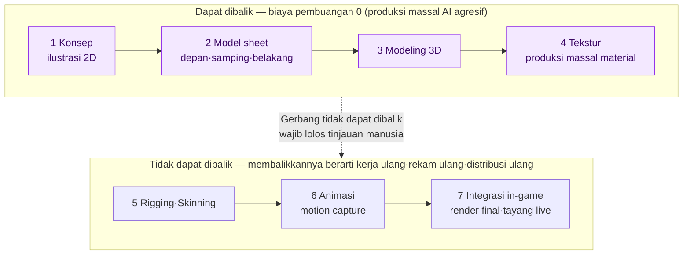
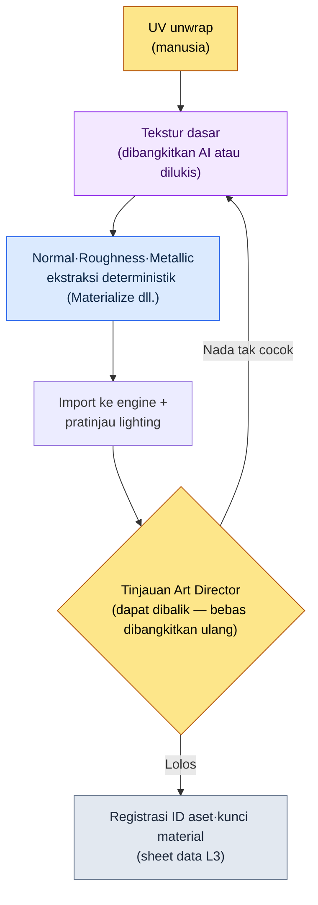

# 12.1 Pipeline Aset Seni AI — Produksi Massal di Tahap yang Dapat Dibalik, Berhenti di Depan Gerbang yang Tidak Dapat Dibalik

> Pembaca utama: Game Designer dan Art Director yang berkolaborasi dengan tim seni (tim berukuran menengah, 10–50 orang)
> Versi ringkas untuk pembaca solo/hobi: §12.1.8 "Kalau Anda Sendirian, Cukup Sebanyak Ini"

Saya punya kenangan tentang hari ketika saya menempelkan 100 lembar concept art hasil AI ke dinding ruang rapat. Dari 100 lembar yang tercetak dalam 30 detik, yang dipilih Art Director hanya 3 lembar, dan 97 lembar sisanya dibuang di tempat. Ada yang menyebutnya "pemborosan 97%". Padahal, kalau digambar dengan tangan, seorang seniman akan menghabiskan dua minggu untuk sampai pada 3 lembar itu. Apa yang sebenarnya pemborosan justru terbalik.

Yang dibahas bab ini adalah cara mengubah pembalikan itu menjadi operasional. Intinya satu kalimat. **Seni AI boleh diproduksi massal sepuasnya di tahap yang dapat dibalik (eksplorasi konsep dan tekstur), tetapi di depan tahap yang tidak dapat dibalik (render final, motion capture, integrasi ke build) ditempatkan gerbang yang dijaga manusia.** Di tempat yang boleh dibuang, kita buang 99 lembar; di tempat yang tidak bisa dikembalikan, kita tidak meloloskan satu lembar pun begitu saja. Cara memakai alat seni sudah cukup banyak dibahas di buku lain, jadi bab ini hanya berfokus pada *posisi tempat alat itu disisipkan dengan aman ke dalam pipeline seorang Game Designer*.

---

## 12.1.1 Pada Pipeline Seni Ada Garis yang Bisa Dikembalikan

Jalan aset seni dari konsep hingga ke dalam game terdiri dari 7 tahap. Kalau saya pindahkan apa adanya lini aset karakter dari proyek penulis (selanjutnya disebut "Proyek A"), bentuknya seperti ini. Yang penting bukan jumlah tahapnya, melainkan **garis batas dapat-dibalik/tidak-dapat-dibalik** yang melintas tepat di tengahnya.



Empat tahap di kiri (konsep–tekstur) bersifat **dapat dibalik**. Kalau kita hasilkan 100 lembar konsep lalu membuang 97 lembar, yang hilang hanya biaya token, dan kalau tekstur dibangkitkan ulang lima kali pun, cukup menimpa file dan selesai. Karena itu, segmen ini adalah tempat produksi massal AI menghasilkan ROI (Return on Investment, efektivitas terhadap investasi) terbesar. Alat produksi massalnya bertumpu pada Stable Diffusion (SDXL)/ComfyUI yang di-host sendiri. Alasannya adalah perlindungan IP — aset tidak diunggah ke layanan tertutup eksternal melainkan dijalankan secara lokal, dan dengan LoRA yang telah di-fine-tuning untuk karakter beserta ControlNet, konsistensi sosok yang sama dapat dikendalikan pada setiap pembangkitan berulang. Alat tertutup (seperti Midjourney) hanya dipakai secara terbatas saat ingin cepat menggelar moodboard awal, sedangkan produksi massal utama yang membutuhkan kendali konsistensi·pengulangan dibawa ke SD/ComfyUI.

Tiga tahap di kanan (setelah rigging) bersifat **tidak dapat dibalik**. Motion capture mengikat jadwal studio dan aktor, dan begitu render final naik ke build lalu tayang live, ingatan pengguna dan reaksi komunitas akan menyertainya. Sekali terlewat, biaya untuk mengembalikannya lebih besar daripada biaya membuatnya. Karena itu, di atas garis batas berdiri **gerbang yang dijaga manusia**. Sebanyak apa pun AI memproduksi massal di segmen yang dapat dibalik, aset yang menyeberang ke wilayah yang tidak dapat dibalik hanyalah aset yang telah lolos tinjauan manusia.

Satu gambar ini adalah kerangka bab ini. Pertanyaan "seberapa banyak AI dipakai untuk seni" sebenarnya adalah pertanyaan "pekerjaan ini berada di sisi mana dari garis batas".

---

## 12.1.2 [Worked Transcript] Satu Lini Konsep dari Produksi Massal hingga Pembuangan·Permintaan Ulang

Saya tunjukkan satu siklus penuh dari produksi massal konsep, tahap pertama segmen yang dapat dibalik. Kalau hanya ditulis secara abstrak "AI menghasilkan konsep", kita tidak tahu apa yang sebenarnya keluar dan apa yang dibuang. Berikut adalah reproduksi setia dari sesi memproduksi massal konsep NPC senior guild ilmuwan di Proyek A. Prompt-nya bisa langsung disalin dan dipakai, dan keluarannya merupakan rekonstruksi dari sesi nyata.

### Langkah 1 — Masukan: Nyatakan Dulu Maksud Desain

Di sinilah ada posisi yang paling sering salah. Yaitu memulai prompt dengan "deskripsi visual". Prinsip yang dipaku oleh atom umpan balik perusahaan `image_prompt_design_intent_first` justru sebaliknya — **prompt gambar pun harus maksud desain lebih dulu**. Bukan menderet kata sifat penampilan, melainkan menaruh di depan: fungsi·narasi apa yang dipikul karakter ini di dalam game.

```yaml
# concept_brief_scholar_senior.yaml — masukan produksi massal konsep
asset_id: npc_scholar_senior_01
role: Senior guild ilmuwan — sosok pertama yang mengamati melemahnya segel
function: NPC pemberi quest utama (sumber informasi yang harus dipercaya pemain)
narrative_seed:
  - Orang yang selama 30 tahun mencatat denyut segel dari menara lonceng
  - Menyembunyikan emosi di balik angka (nada scholarly_strict)
style_anchor: semi-realistic, painted, fantasi Asia Timur   # dipatok di visi L0
forbidden: gaya anime · pakaian modern · jubah penyihir fantasi generik
```

`function` dan `narrative_seed` ada lebih dulu daripada penampilan. Hanya jika masukan memegang "mengapa karakter ini harus terlihat seperti ini", kita bisa menilai "mengapa yang ini lebih baik" pada hasil produksi massal.

### Langkah 2 — Prompt: Produksi Massal, tetapi Paksakan Format dan Pantangan

```
Berdasarkan concept_brief yang dilampirkan, hasilkan 6 usulan arah konsep karakter.
Ini produksi massal untuk eksplorasi — bukan versi final, melainkan kandidat yang akan dipilih Art Director.

Aturan:
1) Terjemahkan function dan narrative_seed ke dalam visual. Dilarang sekadar memperindah.
   (contoh: "menyembunyikan emosi di balik angka" → bagaimana itu tampak lewat ekspresi·properti·pose)
2) Jangan keluar dari style_anchor. Item forbidden mutlak dilarang.
3) Keenam usulan harus cukup berbeda satu sama lain. 6 lembar variasi mikro tidak punya nilai eksplorasi.
4) Lampirkan satu baris alasan maksud pada tiap usulan (mengapa arah ini cocok dengan function).
5) Usulan yang kamu curigai 'bisa berbenturan dengan style_anchor', tandai secara terpisah.

Format keluaran: (nomor usulan | visual inti | alasan maksud | kecurigaan benturan). Dilarang penjelasan lain.
```

Dalam prompt ini, porsi yang dipakai untuk deskripsi visual hampir tidak ada. Sebagian besar dipakai untuk mengunci format keluaran dan memaku pantangan. Sebab, kalau AI diberi kebebasan, ia akan kembali ke rata-rata data latih — penyihir fantasi generik. **Kewajiban menerjemahkan maksud, pematokan style_anchor, pemaksaan keberagaman 6 usulan, dan jalan keluar "lapor kalau berbenturan"** adalah empat palang yang mencegah kemunduran itu.

### Langkah 3 — Keluaran Claude (rekonstruksi, kutipan)

```
| Usulan | Visual inti                                | Alasan maksud                               | Benturan |
|--------|--------------------------------------------|---------------------------------------------|----------|
| 1      | Kaca pembesar kuningan terpasang permanen, jari bernoda tinta | Pengamatan adalah identitas — alat menubuh | |
| 2      | Ilmuwan tua tanpa ekspresi, gulungan instrumen di tangan | Menyembunyikan emosi di balik angka = tanpa ekspresi+catatan | |
| 3      | Latar menara lonceng, cahaya denyut segel mendingin di belakang | Ruang kerja menjelaskan sosoknya | |
| 4      | Jubah bersulam bintang mewah, bola mana di tangan | Menonjolkan kewibawaan | ★ |
| 5      | Mata palsu di satu sisi, jejak pengamatan seumur hidup | Harga jasmani dari 30 tahun bertugas | |
| 6      | Ilmuwan muda nan rapi, menonjolkan keindahan paras | Mengutamakan daya tarik | ★ |
```

Yang paling berharga dalam keluaran bukan tabelnya, melainkan **dua baris bertanda ★**. Pada usulan 4 (jubah penyihir mewah, bola mana) dan usulan 6 (utamakan paras indah), AI sendiri melapor bahwa "bisa berbenturan dengan style_anchor·forbidden". Andai tidak ada jalan keluar pada aturan nomor 5, kedua usulan ini akan menyusup ke dalam tabel dengan wajah yang sama persis seperti empat usulan lainnya. Membuat AI mengangkat tangan sendiri dan menandai posisi yang mencurigakan — itulah yang memisahkan produksi massal yang bebas dari produksi massal yang terkendali.

### Langkah 4 — Verifikasi dan Penolakan (porsi manusia)

Keluaran ini tidak diterima begitu saja. Art Director memeriksa keenam usulan sekali dengan brief. Pada sesi ini, penilaiannya benar-benar terbelah seperti ini.

- **Usulan 4 dibuang.** Persis seperti yang dilaporkan AI. "Jubah bersulam bintang dengan bola mana" adalah pelanggaran frontal terhadap `forbidden: jubah penyihir fantasi generik`. Karakter ini bukan orang yang memakai sihir, melainkan orang yang *mengamati·mencatat* mana. Salah terjemah function.
- **Usulan 6 dibuang.** Mengutamakan paras indah bertentangan dengan `narrative_seed: harga jasmani dari 30 tahun bertugas`. Daya yakin NPC ini lahir dari keausan "orang yang sudah lama bertugas". Wajah muda dan bersih justru memangkas narasinya.
- **Usulan 1·5 diterima, usulan 2·3 ditahan.** Usulan 1 (kaca pembesar menubuh) dan usulan 5 (mata palsu) menempel tepat pada maksud "alat·jabatan membentuk sosoknya".

Di sini, 2 pembuangan bukanlah kerugian. Andai digambar dengan tangan, mengetahui bahwa dua arah ini salah akan memakan beberapa hari, tetapi produksi massal membentangkan 6 usulan secara bersamaan dan menyaringnya dalam satu jam.

### Langkah 5 — Permintaan Ulang

```
Gabungkan arah usulan 1 (kaca pembesar menubuh) dan usulan 5 (mata palsu).
- Padukan kaca pembesar kuningan + satu mata palsu pada satu sosok
- Penekanan emosi (scholarly_strict): ekspresi nihil, jabatan hanya disampaikan lewat properti
- Tegaskan ulang forbidden: jubah penyihir·bola mana·penonjolan paras indah semua dilarang
Ini tahap membuat 'satu kandidat final' yang akan diserahkan Art Director untuk dirapikan secara manual.
```

AI kembali menjawab satu arah tunggal yang memadukan kaca pembesar dan mata palsu pada satu ilmuwan tua, dan satu lembar itu berpindah ke meja artis konsep lalu dirampungkan secara manual. Satu siklus **produksi massal (6 usulan) → pembuangan (2 usulan) → konvergensi (1 usulan) → perampungan manusia** ditutup di sini. Yang dibuat AI bukanlah aset final, melainkan rentang kandidat yang akan dipilih Art Director.

Satu putaran ini adalah standar Show seluruh buku ini. Kalau tidak pernah sekali pun menyaksikan sampai habis apa yang dimuntahkan AI, apa yang dibuang, dan apa yang dirampungkan manusia, kalimat "saya memproduksi massal konsep dengan AI" hanyalah kalimat kosong.

---

## 12.1.3 Tingkat Pembuangan yang Tinggi adalah Sinyal Eksplorasi yang Dalam

Pada sesi di atas, 2 dari 6 usulan dibuang. Dilihat dari keseluruhan lini konsep, pembuangan menumpuk jauh lebih banyak. Dari 100 lembar yang ditempel di dinding ruang rapat, yang diadopsi 3 lembar.

Saya tangani rasio ini secara jujur. Ini adalah angka berarah yang saya hitung langsung dari beberapa sesi konsep di masa awal adopsi, bukan rasio populasi yang presisi (perkiraan penulis, belum terverifikasi — sangat berfluktuasi tergantung sifat karakter·kualitas brief). Karena itu, membacanya yang tepat bukan sebagai "berapa persen tepatnya", melainkan ke **arah "saya jadi jauh lebih leluasa membuang dibanding masa kerja tangan"**.

Yang penting, tingkat pembuangan 0% bukanlah tujuan. Kalau selembar kertas mahal, kita haluskan satu lembar itu sampai tuntas. Kalau 100 lembar kertas tercetak dalam 30 detik, membuang 99 lembar pun tidak membebani, dan sebesar itu pula rentang eksplorasi melebar. **Naiknya tingkat pembuangan adalah sinyal bahwa kedalaman eksplorasi semakin dalam**. Operasional yang berusaha menekan tingkat pembuangan itu sendiri — misalnya tekanan "kalau hasil AI lumayan, ya pakai saja" — turut memangkas nilai eksplorasi. Bisa membuang usulan 4·6 tanpa ragu di §12.1.2 adalah karena biaya membuangnya 0.

---

## 12.1.4 Produksi Massal Tekstur — Posisi Kedua Segmen yang Dapat Dibalik

Bersama konsep, satu posisi lain dengan ROI besar di segmen yang dapat dibalik adalah tekstur. Ini tahap membangkitkan material yang akan dilekatkan ke model 3D, dan di sini pun kolom yang dimasuki AI dan kolom yang dipegang determinisme terbelah jelas.



Yang dimasuki AI hanya satu kolom **tekstur dasar**. Map PBR seperti Normal·Roughness·Metallic tidak dibiarkan dibangkitkan AI berbeda-beda setiap kali, melainkan dipegang oleh alat ekstraksi deterministik. Sebab, dari dasar yang sama harus keluar map yang sama agar materialnya konsisten. Ini sama dengan pembagian tugas pada generator kota di §6.2 yang tidak menyerahkan kurva imbalan ke AI melainkan dipegang rulebook — **yang bisa dijamin secara deterministik oleh kode, yang butuh eksplorasi oleh AI.**

Bahkan untuk tekstur dasar pun, AI tidak cocok untuk semua aset. Pada posisi tempat detail halus seperti wajah karakter menentukan identitas game, tangan manusia tetap diutamakan. Karena itu, ketika gerbang tinjauan menangkap "nada tak cocok", bukan pembuangan otomatis melainkan dikembalikan ke pembangkitan ulang. Sampai sini semuanya adalah sisi kiri garis batas — segmen yang dapat dibalik, di mana berapa kali pun diputar ulang tidak ada yang hilang.

---

## 12.1.5 Gerbang yang Tidak Dapat Dibalik — Verifikasi Konsistensi dan Regresi Visual

Tepat sebelum menyeberangi garis batas, kita periksa apakah aset yang diproduksi massal di segmen yang dapat dibalik tidak melenceng dari keseluruhan hasil game. Ini posisi yang bocor kalau hanya dengan mata manusia, jadi kode memeriksanya lebih dulu.

```python
# visual_regression.py — deteksi perubahan tak disengaja saat penggantian aset (kerangka)
# masukan: ID aset + tangkapan render kondisi sama sebelum/sesudah penggantian
# keluaran: tingkat perubahan (alert ke gerbang tinjauan manusia)

def compare_renders(asset_id, before_png, after_png, threshold=(1.0, 5.0)):
    diff = pixel_diff(before_png, after_png)   # dinormalisasi 0~100
    if diff > threshold[1]:
        return ("BLOCK", f"{asset_id}: perubahan besar {diff:.1f}% — dilarang masuk wilayah tidak dapat dibalik sebelum ditinjau")
    elif diff > threshold[0]:
        return ("WARN",  f"{asset_id}: perubahan ringan {diff:.1f}% — perlu konfirmasi maksud")
    else:
        return ("PASS",  f"{asset_id}: tidak ada perubahan")
```

30 baris ini menangkap insiden "satu lembar tekstur diganti, ternyata bayangan karakter lain rusak" *sebelum* masuk ke wilayah tidak dapat dibalik. Desain pentingnya adalah `BLOCK` bukan pembuangan otomatis, melainkan **hanya mengirim alert ke gerbang tinjauan** — kalau kode sampai membunuh perubahan yang disengaja (redesain) pun, dalam satu-dua kuartal para artis akan bilang "matikan saja". Kandidat yang dicurigai dipilih oleh mesin, tetapi apakah akan diteruskan ke wilayah tidak dapat dibalik ditentukan manusia.

Hal lain yang ditangkap tinjauan adalah **konsistensi gaya**. Karena keluaran AI sedikit berbeda setiap kali, manusia melihat untuk terakhir kali apakah konsep·tekstur yang diproduksi massal mempertahankan tekstur game. Hanya yang lolos gerbang ini yang menyeberang ke tahap tidak dapat dibalik berupa rigging·motion capture·render final. Sebab, sekali gerakan ditangkap (motion capture) dan dinaikkan ke build, insiden konsistensi hanya bisa diperbaiki lewat kerja ulang·rekam ulang·distribusi ulang.

---

## 12.1.6 Ke Tim Seni Hanya Keputusan yang Diteruskan — md→html→sync

Meski Game Designer memproduksi massal konsep·tekstur dengan AI, tim seni yang sebenarnya menggambar adalah organisasi terpisah. Inti kolaborasi di sini adalah membuat **tim seni tidak perlu mempelajari alat·konvensi tim desain**. Panduan seni Proyek A (`96_ArtGuide/`) memecahkan ini dengan otomatisasi.

Keputusan seni ditulis tim desain dalam md, lalu `_convert_md_to_html.py` mengonversinya menjadi html, dan `_SyncToArtRepo.bat` melakukan push ke repositori seni terpisah. Tim seni hanya melihat html di repo itu — tidak perlu tahu konvensi md maupun SVN tim desain (diagram pipeline ada di §12.2.4).

Dan dokumen keputusan ini terbagi ke dalam 7 domain (`00_Common`·`01_Character`\~`07_Env`), masing-masing memegang aturan gayanya sendiri dan digabungkan di gerbang integrasi. Inilah 7 area ArtGuide yang akan dibahas di bab berikutnya (12.2), tetapi kalau intinya saja disampaikan lebih dulu, begini — **kalau rulebook gaya dipecah bukan ke satu kolom melainkan ke laci 7 kolom, prompt produksi massal AI tidak dirakit ulang dari nol di kepala artis setiap kali, melainkan ditarik dari laci.** `style_anchor`·`forbidden` di §12.1.2 justru adalah masukan yang keluar dari laci itu. Rulebook harus terpisah agar hasil produksi massal tidak kembali ke rata-rata fantasi generik.

Itu bukan berarti setiap game harus memiliki ketujuh area. Untuk genre kasual, dua kolom karakter·lingkungan saja sudah cukup. Pemisahan secara bertahap, antarmuka secara sempit.

---

## 12.1.7 Cara Menangani Angka dan Risiko Secara Jujur

Angka di bab ini hanya tiga jenis. (1) **Arah·rasio** — "adopsi 3 lembar dari produksi massal 100 lembar" adalah angka berarah berbasis pengalaman penulis (belum terverifikasi), jadi dibaca bukan sebagai nilai absolut melainkan ke arah "di segmen yang dapat dibalik, biaya pembuangan konvergen ke 0". (2) **Nilai terukur** — laju perubahan regresi visual (`diff %`), jumlah insiden konsistensi, jumlah pemrosesan BLOCK dimuntahkan `visual_regression.py` sebagai angka, jadi di rapat kita bisa berbicara dengan angka, bukan "perasaan". Sebaliknya, "retensi naik" tidak ditentukan oleh satu aset saja, jadi kausalitasnya tidak dipastikan.

(3) **Risiko ditaruh di dalam biaya operasional**. Tiga risiko seni AI — hak cipta data latih, kerusakan konsistensi gaya, lapangan kerja artis — bukan di luar perhitungan ROI melainkan di dalam. Kebijakan penulis adalah AI agresif di segmen yang dapat dibalik, aset final yang diteruskan ke wilayah tidak dapat dibalik dirapikan secara manual, dan rasio keluaran AI pada aset yang langsung masuk ke build ditetapkan berprinsip 0. Tetapi ini hanya satu kebijakan — ada juga tim yang hanya memakai model berlisensi eksplisit dan memanfaatkan AI hingga aset final. Kebijakan hukum berbeda di tiap perusahaan, dan buku ini bukan menyajikan jawaban benar melainkan cara menarik garis batas.

Dari ketiga risiko, yang paling sering terlewat adalah yang ketiga. Kalau AI tidak diposisikan sebagai "pembantu yang memperlebar rentang eksplorasi dan membesarkan hak putus artis", melainkan sebagai "mesin produksi massal yang menggantikan artis", alat itu pun ditolak organisasi meski sukses secara KPI. Ini juga posisi yang dipaku oleh atom feedback `design_intent_vs_automation_boundary` (maksud desain vs batas otomatisasi).

---

## 12.1.8 Kegagalan yang Umum

| Pola | Mengapa gagal | Resep |
|---|---|---|
| Memasukkan konsep AI langsung ke build sebagai aset final | Melewati tahap tidak dapat dibalik tanpa tinjauan manusia | Gerbang di depan garis batas (§12.1.1) |
| Memulai prompt dengan deskripsi penampilan | Salah terjemah function — kembali ke penyihir berparas indah | Maksud desain lebih dulu (§12.1.2, `image_prompt_design_intent_first`) |
| 6 usulan produksi massal berupa variasi mikro | Tak ada nilai eksplorasi, tak ada yang bisa dibuang | Paksakan keberagaman (§12.1.2) |
| Berusaha menekan tingkat pembuangan | Turut memangkas kedalaman eksplorasi | Pembuangan di segmen yang dapat dibalik dipandang sebagai sinyal (§12.1.3) |
| Membangkitkan map PBR tekstur dengan AI sekalian | Konsistensi material berfluktuasi tiap panggilan | Pisahkan ekstraksi deterministik (§12.1.4) |
| Mengganti aset tanpa regresi visual | Perubahan tak disengaja bocor ke wilayah tidak dapat dibalik | Gerbang `visual_regression.py` (§12.1.5) |

---

## 12.1.9 Coba Sendiri — Satu Langkah yang Bisa Dilakukan Hari Ini

> **Kalau Anda sendirian, cukup sebanyak ini**: Tidak perlu tim seni maupun sheet data. Pilih satu NPC dari game Anda sendiri (atau game yang Anda sukai), tuliskan `function` dan `narrative_seed` *lebih dulu daripada penampilan* dalam format `concept_brief` §12.1.2, lalu tempelkan apa adanya prompt produksi massal 6 usulan dan jalankan sekali. Dari 6 usulan yang keluar, pilih satu usulan yang melenceng dari maksud, lalu bantah dengan "ini salah terjemah function, buang dan ulang", maka Anda akan benar-benar merasakan bahwa pembuangan di segmen yang dapat dibalik bukan kerugian melainkan eksplorasi.

Kalau Anda tim, mulailah dengan satu langkah berikut. **Tarik secara eksplisit satu garis batas dapat-dibalik/tidak-dapat-dibalik pada pipeline** (§12.1.1). Sepakati sampai tahap mana yang "dibuang pun 0" dan dari mana yang "mahal kalau dibalik", lalu tempatkan gerbang tinjauan manusia di atas batas itu. Begitu batas tertarik, pertikaian "sampai mana AI dipakai" yang selalu dimulai dari nol setiap kali berubah menjadi satu kali penilaian "pekerjaan ini di sisi mana dari batas".

Kalau diringkas menjadi setup → prompt → verify — **setup**: definisikan garis batas dapat-dibalik/tidak-dapat-dibalik dan gerbang tinjauan pada pipeline. **prompt**: masukkan maksud desain lebih dulu dalam format §12.1.2 dan produksi massal 6 usulan, sambil memaksakan pantangan·keberagaman·pelaporan. **verify**: pilih sendiri 1 kasus salah-terjemah maksud di segmen yang dapat dibalik untuk menutup satu siklus lewat pembuangan·permintaan ulang, dan sebelum masuk wilayah tidak dapat dibalik, periksa perubahan tak disengaja dengan `visual_regression.py`.

---

### Poin-Poin Penting
- Di segmen yang dapat dibalik (konsep·tekstur) produksi massal, di depan gerbang yang tidak dapat dibalik tinjauan manusia.
- Naiknya tingkat pembuangan adalah sinyal bahwa eksplorasi semakin dalam, bukan kegagalan alat.
- Prompt gambar pun memasukkan maksud desain lebih dulu, bukan penampilan.

### Pratinjau Bab Berikutnya
- 12.2 7 Area ArtGuide — membagi rulebook gaya ke laci 7 kolom untuk menjaga konsistensi produksi massal

---
