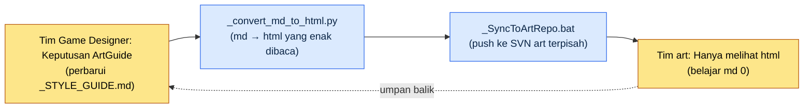

# 12.2 Tujuh Area ArtGuide (Karakter, Animasi, Monster, NPC, VFX, UI, Lingkungan)

Tinjauan terpadu hari Kamis. Saat kami menempelkan tujuh aset baru di layar yang sama dan menatapnya, kami tertawa serempak. Karakter cendekiawan itu bersiluet tenang dengan nuansa abu-abu, tetapi tepat di sebelahnya, VFX skill yang meledak berwarna merah muda neon. Keduanya merupakan keputusan yang sempurna di area masing-masing. Director karakter mematuhi `_STYLE_GUIDE.md` miliknya persis seperti adanya, dan artist VFX pun setia mengikuti spesifikasi saya, "buat agar mudah terlihat." Tidak ada yang salah, tetapi begitu diletakkan di layar yang sama, dua game seolah sedang berkelahi.

Adegan inilah yang menjadi alasan ArtGuide dipecah menjadi tujuh area, sekaligus alasan tujuh area itu harus disatukan kembali. ArtGuide adalah konstitusi visual sebuah game. Membaginya menurut area memberi setiap director bidang otonomi sehingga keputusan menjadi lebih cepat; tanpa disatukan kembali lewat tinjauan terpadu, insiden seperti merah muda neon di atas akan menumpuk setiap kuartal. Pada titik mana dari keseimbangan ini seorang Game Designer menaruh tangannya — itulah seluruh isi bab ini.

---

## 12.2.1 Satu Lembar Aset: Struktur Nyata Tujuh Area

Pada repositori desain Proyek A (MMORPG yang mengutamakan mobile dengan nuansa fantasi oriental), tempat saya bekerja sebagai director, ada folder bernama `96_ArtGuide/`. Nomor `96` disematkan agar art guide berada hampir di urutan terakhir sesuai aturan pengurutan repositori, dan di bawahnya terbagi menjadi tujuh domain. Ini bukan "folder art proyek" yang abstrak, melainkan struktur subfolder nyata dari folder tersebut, seperti tampak di bawah.

<svg viewBox="0 0 760 360" xmlns="http://www.w3.org/2000/svg" font-family="sans-serif" font-size="13">
  <rect x="300" y="10" width="160" height="40" rx="6" fill="#2c3e50"/>
  <text x="380" y="35" fill="#fff" text-anchor="middle" font-size="14">96_ArtGuide/</text>
  <line x1="380" y1="50" x2="380" y2="70" stroke="#888" stroke-width="1.5"/>
  <line x1="70" y1="70" x2="690" y2="70" stroke="#888" stroke-width="1.5"/>
  <!-- 7 domain boxes -->
  <g>
    <rect x="20" y="70" width="100" height="70" rx="5" fill="#e8f0fe" stroke="#4285f4"/>
    <text x="70" y="92" text-anchor="middle" font-weight="bold">00_Common</text>
    <text x="70" y="112" text-anchor="middle" font-size="11">Konvensi bersama</text>
    <text x="70" y="128" text-anchor="middle" font-size="11">Palet, aturan</text>
  </g>
  <g>
    <rect x="130" y="70" width="100" height="70" rx="5" fill="#fce8e6" stroke="#ea4335"/>
    <text x="180" y="92" text-anchor="middle" font-weight="bold">01_Character</text>
    <text x="180" y="112" text-anchor="middle" font-size="11">Karakter</text>
    <text x="180" y="128" text-anchor="middle" font-size="11">pemain</text>
  </g>
  <g>
    <rect x="240" y="70" width="100" height="70" rx="5" fill="#e6f4ea" stroke="#34a853"/>
    <text x="290" y="92" text-anchor="middle" font-weight="bold">02_Animation</text>
    <text x="290" y="112" text-anchor="middle" font-size="11">Semua</text>
    <text x="290" y="128" text-anchor="middle" font-size="11">animasi</text>
  </g>
  <g>
    <rect x="350" y="70" width="100" height="70" rx="5" fill="#fef7e0" stroke="#fbbc04"/>
    <text x="400" y="92" text-anchor="middle" font-weight="bold">03_Monster</text>
    <text x="400" y="112" text-anchor="middle" font-size="11">Visual</text>
    <text x="400" y="128" text-anchor="middle" font-size="11">NPC musuh</text>
  </g>
  <g>
    <rect x="460" y="70" width="100" height="70" rx="5" fill="#e8f0fe" stroke="#4285f4"/>
    <text x="510" y="92" text-anchor="middle" font-weight="bold">04_NPC</text>
    <text x="510" y="112" text-anchor="middle" font-size="11">NPC ramah</text>
    <text x="510" y="128" text-anchor="middle" font-size="11">Relasi, voice</text>
  </g>
  <g>
    <rect x="570" y="70" width="100" height="70" rx="5" fill="#fce8e6" stroke="#ea4335"/>
    <text x="620" y="92" text-anchor="middle" font-weight="bold">05_VFX</text>
    <text x="620" y="112" text-anchor="middle" font-size="11">Efek visual</text>
    <text x="620" y="128" text-anchor="middle" font-size="11">Skill, presentasi</text>
  </g>
  <g>
    <rect x="680" y="70" width="70" height="70" rx="5" fill="#e6f4ea" stroke="#34a853"/>
    <text x="715" y="92" text-anchor="middle" font-weight="bold" font-size="11">06_UI</text>
    <text x="715" y="112" text-anchor="middle" font-size="10">Layar, HUD</text>
    <text x="715" y="128" text-anchor="middle" font-size="10">(9.3)</text>
  </g>
  <!-- 07 on second row -->
  <line x1="380" y1="140" x2="380" y2="170" stroke="#888" stroke-width="1"/>
  <g>
    <rect x="300" y="170" width="160" height="60" rx="5" fill="#fef7e0" stroke="#fbbc04"/>
    <text x="380" y="195" text-anchor="middle" font-weight="bold">07_Environment</text>
    <text x="380" y="216" text-anchor="middle" font-size="11">Latar, properti, landmark</text>
  </g>
  <!-- footer note -->
  <text x="380" y="280" text-anchor="middle" font-size="12" fill="#555">Setiap domain = otonomi 1 director/senior + _STYLE_GUIDE.md per domain (konstitusi)</text>
  <text x="380" y="305" text-anchor="middle" font-size="12" fill="#555">00_Common = konvensi tingkat atas yang berlaku di atas tujuh domain (warna, material, nuansa zaman)</text>
</svg>

Inti dari diagram ini ada dua. Pertama, tujuh domain berdiri sejajar dan memegang otonomi secara setara. Bayangkan sebuah kantor dengan tujuh studio kerja berjajar di satu lantai. Penanggung jawab tiap ruangan memegang hak keputusan ruangan itu, tetapi saat berpapasan di koridor, mereka tidak boleh kehilangan rasa bahwa ini game yang sama. Kedua, di atasnya bertumpu `00_Common`. Konvensi bersama yang harus dipatuhi ketujuh ruangan — yakni palet warna keseluruhan, standar material, dan nuansa zaman — bermukim di sini. `06_UI` merupakan domain yang sama dengan standar kolaborasi UI yang dibahas di 9.1.3, sehingga di bab ini saya hanya menarik garis batasnya lalu melanjutkan.

## 12.2.2 Kedalaman Sentuhan Game Designer Berbeda di Tiap Area

Game Designer tidak ikut campur dengan intensitas yang sama di ketujuh domain. Prinsip bahwa Game Designer menentukan intensi dan narasi sementara art menentukan visual berlaku sama di semua domain, tetapi sejauh mana intensi menyeret visual itu berbeda di tiap domain.

| Area | Keterlibatan Game Designer | Garis yang tidak boleh dilewati Game Designer |
|---|---|---|
| 01_Character | Kuat | Sampai konsep, kepribadian, faksi, peran. Proporsi wajah dan goresan kuas bukan |
| 02_Animation | Sedang | Sampai "jenis, reaksi" motion skill. Timing per frame bukan |
| 03_Monster | Kuat | Sampai konsep musuh, faksi, ekologi. Detail pola sisik bukan |
| 04_NPC | Kuat | Sampai peran, relasi, voice_profile. Bordir kostum bukan |
| 05_VFX | Lemah | Sampai "tembakan lambat, ledakan besar, ungu". Jumlah partikel bukan |
| 06_UI | Kuat | Sampai struktur informasi, prioritas (9.3). Margin piksel bukan |
| 07_Environment | Sedang | Sampai intensi suasana, landmark. Poligon pohon bukan |

Kolom kanan adalah isi sejati dari tabel ini. Bahkan di domain yang tertulis keterlibatannya "kuat" pun, ada garis yang tidak boleh dilewati Game Designer. Konsep karakter boleh diseret dengan kuat, tetapi begitu menyentuh sampai ke proporsi wajah, saat itu juga otonomi director karakter runtuh. Lagi pula, batas antara kuat dan lemah itu sendiri bergeser tergantung genre. Pada game horor, VFX menjadi inti rasa takut sehingga keterlibatan Game Designer menguat; pada puzzle kasual, keterlibatan terhadap karakter justru melemah. Tabel di atas adalah standar genre Proyek A, bukan hukum universal.

## 12.2.3 Konstitusi Domain: _STYLE_GUIDE.md

Setiap domain dijalankan dengan satu paket dokumen standar. Mari lihat susunan file nyata dari domain `01_Character/`.

```
01_Character/
├── _STYLE_GUIDE.md          — Gaya keseluruhan karakter (konstitusi)
├── _COLOR_PALETTE.md        — Panduan warna, material
├── _PROPORTION_REFERENCE.md — Aturan proporsi, siluet
├── _DO_AND_DONT.md          — Yang boleh, yang dilarang
├── individual/              — Sheet per karakter
│   ├── K_001_director.md
│   ├── K_007_scholar.md
│   └── ...
└── _REVIEW_LOG.md           — Riwayat tinjauan
```

`_STYLE_GUIDE.md` adalah konstitusi domain. Setiap sheet karakter individual (`individual/`) merupakan variasi di atas konstitusi ini. Jika konstitusi goyah, seluruh karakter di bawahnya ikut goyah, sehingga satu lembar file inilah dokumen yang paling sering ditinjau di dalam domain. Kerangkanya seperti berikut.

```markdown
---
title: 01_Character Style Guide
layer: L1
---

## 1. Nuansa
- Sebelum Revolusi Industri abad ke-19, suasana fantasi Korea
- Proporsi realistis (kepala-tubuh 7~7.5, deformasi dilarang)

## 2. Warna
- Saturasi: sedang (setara 60~70% realistis)
- Palet utama: diwarisi dari 00_Common
- Warna aksen per karakter (1~2 buah)

## 3. Aturan kostum
- Pembedaan kostum per faksi (cendekiawan → abu-abu + aksen ungu)
- Detail kostum sesuai profesi dan kelas

## 4. DO
- Bisa dikenali siapa orangnya hanya dari siluet pada jarak 5m
- Mengekspresikan identitas faksi secara visual

## 5. DON'T
- Gaya anime Jepang
- Elemen non-historis (kostum, properti modern)
- Saturasi berlebihan
```

Di sini ada satu baris yang penting. Pada `## 2. 색상`, baris "Palet utama: diwarisi dari 00_Common". Ini penegasan bahwa domain karakter tidak menentukan warna secara mandiri, melainkan mewarisi konvensi bersama dari tingkat atas. Satu baris inilah perangkat yang secara struktural mencegah insiden merah muda neon pada bagian pembuka. Jika `_STYLE_GUIDE.md` semua domain mewarisi `00_Common` setidaknya untuk urusan warna, maka benturan warna paling tidak sudah ditangkal di tahap konstitusi.

## 12.2.4 Bagaimana Menarik Non-Game-Designer ke dalam Kolaborasi

Di sinilah muncul persoalan paling nyata yang benar-benar dihadapi Proyek A. Tim art tidak membaca Markdown. Lebih tepatnya, mereka tidak boleh dipaksa membacanya. Biaya untuk melatih artist soal git diff, frontmatter, dan hierarki header Markdown hampir selalu lebih besar daripada efisiensi kolaborasi yang diperoleh dari pelatihan itu. Begitu alat milik tim Game Designer disodorkan apa adanya ke tim art, kolaborasi justru melambat.

Karena itu, pipeline Proyek A dirangkum dalam satu kalimat: "tim Game Designer memutuskan dengan md, tim art hanya melihat html."



Intinya ada dua aset otomatisasi. `_convert_md_to_html.py` mengubah panduan Markdown domain menjadi html yang bisa dibaca artist dengan nyaman lewat peramban. Palet warna dirender sebagai chip warna nyata, dan DO/DON'T sebagai kontras visual. `_SyncToArtRepo.bat` mendorong html itu bukan ke repositori desain, melainkan ke **repositori khusus art yang terpisah**. Alasan memisahkan repositori sederhana saja. Jika artist hanya menerima repositori miliknya, ia tidak terpapar pada riwayat md internal tim Game Designer, draf yang sedang dikerjakan, maupun proses pengambilan keputusan domain lain. Yang dilihat artist hanyalah hasil yang enak dibaca dari keputusan yang sudah final. Biaya belajar Markdown turun menjadi 0.

Dalam struktur ini, ada satu tanggung jawab tambahan yang dipikul Game Designer. Setiap kali memperbarui md, ia wajib menjalankan tahap konversi dan sinkronisasi. Jika hanya memperbarui tetapi lupa menyinkronkan, tim art akan menggambar hari ini berdasarkan keputusan kemarin. Bila satu kolom antara keputusan dan penyampaian ini kosong, otonomi maupun integrasi sama-sama kehilangan makna.

## 12.2.5 Prompt Gambar pun Sebuah Keputusan: Intensi Desain Lebih Dulu

Sebagai kelanjutan kolaborasi dengan non-Game-Designer, ada satu prinsip yang harus dipegang Game Designer saat memakai AI generatif pada tahap konsep. Dalam nama konvensi internal Proyek A, prinsip ini disebut `image_prompt_design_intent_first`; bila diuraikan, artinya "prompt gambar pun menuliskan intensi desain lebih dulu."

Kegagalan yang umum saat menjelajahi konsep dengan gambar generatif adalah prompt yang hanya terisi deskripsi penampilan hasil akhir. Seperti "pria Asia berusia 50-an mengenakan jubah abu-abu, ekspresi tenang, gaya realistis." Prompt ini menghasilkan gambar, tetapi tidak memuat **mengapa harus begitu**, sehingga saat art director memvariasikan gambar itu, ia kehilangan arah. Prinsip intensi-desain-lebih-dulu memaksa adanya blok intensi sebelum prompt.

```
[Intensi Desain]
- Peran: tulang punggung spiritual faksi cendekiawan, mentor pertama pemain
- Yang harus terbaca: siluet "intelektual, non-tempur" bahkan pada jarak 5m
- Sinyal faksi: cendekiawan = abu-abu + aksen ungu (diwarisi dari 00_Common)
- Larangan: membawa senjata, zirah mewah (terbaca salah sebagai kelas tempur)

[Prompt]
pria Asia cendekiawan berusia 50-an dengan jubah abu-abu, aksen pita baju ungu,
tanpa senjata, ekspresi tenang dan terpelajar, fantasi Korea sebelum abad ke-19,
proporsi realistis kepala-tubuh 7.5, saturasi sedang, ...
```

Bila blok intensi berada di atas prompt, gambar itu menjadi bagian dari keputusan. Saat orang berikutnya menghasilkan pose lain dari karakter yang sama, ia tidak menjiplak penampilan, melainkan kembali memenuhi intensi. Bahkan ketika gambar tidak disukai dan dibuang, diskusi bisa dilakukan berdasarkan "intensi mana yang tidak terbaca." Prompt yang hanya menuliskan penampilan berakhir pada "menurut selera saya yang ini lebih bagus" dan tidak meninggalkan dasar untuk diverifikasi, sedangkan prompt yang didahului intensi meninggalkan catatan untuk menelaah apa yang terpenuhi dan apa yang terlewat.

Di sini pemilihan alat berkelindan dengan prinsip intensi-lebih-dulu. Untuk menghasilkan "pose lain dari karakter yang sama" secara berulang sesuai intensi, prompt saja tidak cukup. Pembagian alat di Proyek A sama dengan §12.1.1 — untuk produksi massal utama, kami memasang character LoRA (mengunci wajah dan kostum) serta ControlNet (pose dan siluet) pada SD (SDXL)/ComfyUI yang di-host sendiri, sehingga "keterkenalan pada jarak 5m" yang dituntut blok intensi tetap terjaga meski pose berubah, dan IP pun ikut terlindungi. Alat tertutup (seperti Midjourney) hanya dipakai sebatas moodboard awal.

## 12.2.6 Worked Transcript: Satu Siklus Spesifikasi Konsep Karakter

Untuk melihat bagaimana otonomi domain dan keterlibatan Game Designer benar-benar berjalan, mari telusuri satu siklus `01_Character` dari awal hingga akhir. Berikut ini adalah rekonstruksi dari pekerjaan nyata ketika saya menyerahkan penyusunan draf spesifikasi konsep karakter cendekiawan (`K_007_scholar`) kepada AI. Tanpa diringkas, keluaran yang janggal dan penolakan saya pun saya muat apa adanya.

*Catatan penerjemah: Edisi Bahasa Indonesia ini diterjemahkan dengan AI sebagai draf awal, lalu ditinjau dan disunting oleh manusia. Seluruh worked transcript dalam edisi ini adalah terjemahan dari sesi asli berbahasa Korea — bukan dijalankan ulang dalam Bahasa Indonesia. Prompt dan keluaran di dalam blok kode juga diterjemahkan agar mudah dibaca. Teks asli Korea — materi yang dijanjikan buku ini untuk tidak diubah — tetap dipertahankan apa adanya di edisi Korea (pada repository sumber di GitHub). Sintaksis kode, pengidentifikasi, angka, dan nilai verifikasi tidak diubah sama sekali. Konversi mata uang bersifat perkiraan, dengan kurs sekitar 1.500 won per dolar AS pada pertengahan 2026.*

**① Prompt yang saya lemparkan ke AI (lengkap)**

```
Kamu adalah penulis pendamping konsep karakter untuk proyek kami. Tulislah draf
dokumen spesifikasi konsep K_007_scholar dalam markdown dengan mematuhi konvensi di bawah.

Konvensi:
- Patuhi 01_Character/_STYLE_GUIDE.md: fantasi Korea sebelum abad ke-19, kepala-tubuh 7~7.5,
  saturasi sedang, gaya anime Jepang dilarang.
- Warna mewarisi palet 00_Common, dan aksen faksi cendekiawan adalah ungu.
- voice_profile 5 butir (nada bicara/kebiasaan ucap/kata terlarang/emosi default/sapaan relasi) wajib disertakan.
- Putuskan hanya sampai konsep, kepribadian, faksi, peran; detail visual seperti proporsi wajah
  atau goresan kuas biarkan kosong (area otonomi director karakter).
- Keluaran dalam format sheet karakter individual/.
```

**② Keluaran mentah Claude (termasuk yang gagal, tanpa disentuh)**

```markdown
# K_007 Cendekiawan (Scholar)

## Peran
Tulang punggung spiritual faksi cendekiawan sekaligus mentor pertama pemain.

## Penampilan
- Tinggi 180cm, kepala-tubuh 7.5, perawakan kurus
- Janggut putih, kerutan dalam, tatapan berkilat
- Jubah abu-abu dengan pita baju ungu
- ★ Rekomendasi: pupil keemasan yang sedikit bercahaya untuk menegaskan kesan misterius

## Kepribadian
Sangat terpelajar tetapi tidak angkuh, tegas kepada murid namun hangat.

## voice_profile
- Nada bicara: lambat dan tenang
- Kebiasaan ucap: "...begitulah adanya", memanjangkan akhir kalimat
- Emosi default: tenang
- Sapaan relasi: memanggil pemain "sahabat muda"
```

**③ Verifikasi dan penolakan saya (di mana letak salahnya dan mengapa)**

Pada keluaran itu ada dua titik cacat. Pertama, "★ Rekomendasi: pupil keemasan" pada `## 외형`. Ini jelas-jelas pelampauan wewenang. Warna pupil dan detail visual semacam itu adalah area otonomi director karakter, tetapi AI mematoknya di tahap konsep. Jika dibiarkan, director akan melipat penilaiannya sendiri sambil berkata "ini sudah ditetapkan di desain", atau mengabaikannya dan berbenturan — salah satu dari dua itu. Kedua, `voice_profile` berisi 4 butir, bukan 5. "Kata terlarang" hilang seluruhnya. Kata apa yang sama sekali tidak boleh diucapkan seorang karakter mentor sama pentingnya dengan kepribadian, tetapi AI melewatkannya.

**④ Permintaan ulang (perbaiki tepat dua titik saja)**

```
Perbaiki dua hal ini saja.
1. Pada ## 외형, hapus baris rekomendasi "pupil keemasan". Warna pupil adalah
   area keputusan director karakter. Untuk butir penampilan, tulis hanya sampai
   siluet, perawakan, warna faksi; warna dan material detail biarkan kosong dengan "(keputusan director)".
2. Tambahkan butir "kata terlarang" yang hilang pada voice_profile. Sebutkan
   secara eksplisit kata yang tidak akan diucapkan sebagai mentor cendekiawan
   (umpatan, lelucon vulgar, kata modern).
```

Pelajaran dari siklus ini bukan soal alat, melainkan soal batas. AI dengan cepat memberi draf yang tampak meyakinkan, tetapi ia melampaui garis yang tidak boleh dilewati Game Designer (detail visual) dan melewatkan hal yang wajib dimasukkan (kata terlarang). Kriteria verifikasinya bukan "apakah ditulis dengan baik", melainkan "apakah batas otonomi domain dijaga". Selama AI dipakai untuk konsep karakter, tinjauan batas ini harus tetap dipegang manusia sampai akhir.

## 12.2.7 Bagaimana Menyatukan Kembali Konsistensi Antar-area

Bila tujuh domain memegang otonomi, akan muncul ketidakcocokan antar-domain seperti merah muda neon pada pembuka. Jenis yang sering muncul sudah bisa ditebak.

| Jenis ketidakcocokan | Contoh nyata |
|---|---|
| Perbedaan nuansa karakter-lingkungan | Karakternya tenang tetapi latarnya mewah sehingga terkesan terpisah |
| Benturan warna karakter-VFX | Nuansa karakter abu-abu, VFX skill merah muda neon |
| Batas NPC-Monster kabur | NPC ramah tetapi terbaca mengancam seperti monster |
| Ketidakcocokan warna UI-karakter | UI bernuansa dingin, karakter bernuansa hangat |

Perangkat untuk menangkap ketidakcocokan ini adalah tinjauan terpadu sepekan sekali. Prosedurnya sederhana.

```
Tinjauan Terpadu ArtGuide Sepekan Sekali (Kamis)
─────────────────────────────────
1. Ambil acak 5~10 aset baru pekan itu
2. Tata bersama di layar yang sama (simulasi in-game)
3. Tujuh director domain + game director meninjau serempak
4. Temukan ketidakcocokan → perkuat _STYLE_GUIDE domain terkait
   atau perkuat konvensi tingkat atas 00_Common
```

Intinya ada di nomor 3 dan 4. Bahwa tinjauan dilakukan oleh para director domain secara **serempak**, dan bahwa ketidakcocokan yang ditemukan tidak diselesaikan dengan memperbaiki aset per aset, melainkan dikembalikan ke dokumen panduan. Insiden merah muda neon pada pembuka, jika hanya diselesaikan dengan mengubah satu aset itu menjadi abu-abu, akan kambuh lagi persis sama pekan depan. Sebagai gantinya, jika ke `00_Common` ditambahkan konvensi "saturasi VFX skill dalam +20% saturasi palet karakter", insiden yang sama tertutup secara struktural. Siklus yang terakumulasi 4 kali sebulan inilah satu-satunya pagar pengaman yang mencegah otonomi mengeras menjadi silo.

## 12.2.8 Otonomi Bukan Pemencaran Tanggung Jawab, melainkan Realokasi Waktu Keputusan

Perubahan yang dibawa oleh pemisahan tujuh area, bila dirangkum dari pengalaman operasional Proyek A, adalah sebagai berikut. Di antara angka di bawah, jumlah hari siklus dan waktu merupakan **perkiraan penulis (belum terverifikasi)** berdasarkan pengalaman operasional saya, bukan nilai pengukuran yang akurat, dan harus dibaca hanya sebagai arah serta rasio kasar sebelum dan sesudah pemisahan.

| Butir | Sebelum dipisah | Setelah dipisah | Sifat |
|---|---|---|---|
| Siklus keputusan art | 1\~2 minggu | 3\~5 hari | Perkiraan penulis (belum terverifikasi) |
| Insiden konsistensi antar-area | Beberapa per kuartal | Berkurang signifikan | Hanya arah |
| Waktu tinjauan art oleh game director | Banyak jam per minggu | Berkurang besar | Hanya arah |
| Onboarding director area baru | Beberapa bulan | Sekitar 1 bulan | Perkiraan penulis (belum terverifikasi) |
| Rasio pembuangan aset art | Tinggi | Berkurang | Hanya arah |

Bila tabel dibaca dengan jujur, yang bisa ditegaskan hanyalah fakta bahwa semua butir bergerak ke arah yang sama. Efek yang paling jelas adalah waktu game director yang terselamatkan. Pada struktur tanpa otonomi, semua keputusan art harus melewati satu meja milik game director. Itu struktur di mana kertas menumpuk di satu meja. Begitu dibagi menjadi tujuh area, kertas terpencar ke tujuh meja. Total kertasnya sama, tetapi tidak ada satu meja pun yang ambruk.

Di sini ada satu salah paham paling umum yang harus diputus. Otonomi bukan pemencaran tanggung jawab. Ia adalah realokasi waktu. Director domain memutuskan areanya sendiri bukan berarti tanggung jawab visual seluruh game tercerai menjadi tujuh keping. Pada tinjauan terpadu, ketujuhnya berkumpul lagi di satu tempat, dan tanggung jawab visual akhir tetap mengerucut pada satu orang. Begitu otonomi dijadikan dalih untuk menghindar tanggung jawab — begitu "itu di luar domain saya" menjadi ucapan kebiasaan — merah muda neon pada pembuka akan masuk ke build tanpa menjadi masalah siapa pun.

Dan satu syarat. Otonomi tujuh area adalah fungsi dari skala. Pada tim kecil (\~10 orang), justru menjadi over-engineering. Bila masih pada tahap satu director memakai lima topi sekaligus, yang cukup bukan tujuh lembar panduan domain, melainkan satu lembar panduan terpadu. Otonomi baru berharga ketika meja mulai tidak mencukupi.

## 12.2.9 Kegagalan Umum dan Resepnya

| Pola | Resep |
|---|---|
| Memusatkan semua keputusan pada game director tanpa pemisahan area | Terapkan otonomi tujuh area (namun mulai dari skala menengah (10\~50 orang)) |
| Tiadanya _STYLE_GUIDE domain | Paksakan penulisan konstitusi tiap domain sebagai gate |
| Tiadanya verifikasi terpadu antar-area | Tinjauan terpadu sepekan sekali + pengembalian ke panduan |
| Game Designer memutuskan sampai detail visual | Hanya sampai spesifikasi intensi, narasi; detail untuk director |
| Otonomi mengeras menjadi silo | Kembalikan ke 00_Common pada tinjauan terpadu |
| Lupa sinkronisasi setelah memperbarui md | Biasakan `_convert_md_to_html.py` → `_SyncToArtRepo.bat` |
| Prompt gambar hanya berisi deskripsi penampilan | Dahulukan blok intensi desain (`image_prompt_design_intent_first`) |

---

### Poin-Poin Penting
- Keseimbangan antara otonomi tujuh area dan tinjauan terpadu sepekan sekali adalah inti ArtGuide.
- Game Designer sampai intensi dan narasi; detail visual adalah area otonomi director domain.
- Otonomi bukan pemencaran tanggung jawab, melainkan realokasi waktu keputusan.

### Pratinjau Bab Berikutnya
- 12.3 Alur dokumen desain (GDD) → konsep → aset in-game

---

## Coba Sendiri

**setup** — Mulailah dari satu domain yang paling banyak menyita tenaga (biasanya `01_Character`). Pada folder domain, buatlah `_STYLE_GUIDE.md` (konstitusi), `_COLOR_PALETTE.md`, `_DO_AND_DONT.md`, dan `individual/`. Pada butir warna, pastikan memasukkan satu baris "Palet utama: diwarisi dari 00_Common".

**prompt** — Saat menyusun draf sheet aset individual dengan AI, sebutkan secara eksplisit dalam prompt: (1) konvensi `_STYLE_GUIDE.md` domain terkait, (2) "putuskan hanya sampai konsep dan narasi, dan biarkan detail visual kosong dengan '(keputusan director)'", (3) butir wajib yang tidak boleh terlewat (misalnya voice_profile 5 butir). Jika berupa prompt gambar, tulislah blok `[Intensi Desain]` lebih dulu di atas deskripsi penampilan.

**verify** — Begitu menerima keluaran, tinjau bukan dengan "apakah ditulis dengan baik", melainkan dengan "apakah batas otonomi domain dijaga". Lihat dua hal saja: ① apakah AI memutuskan menggantikan Anda detail visual yang tidak boleh dilewati Game Designer, ② apakah ada butir wajib yang terlewat. Mintalah ulang dengan menunjuk persis tempat yang melenceng. Setiap Kamis, kumpulkan 5\~10 aset baru ke dalam satu layar dan lihat serempak bersama para director domain. Kembalikan ketidakcocokan bukan ke aset, melainkan ke dokumen panduan (`00_Common` atau `_STYLE_GUIDE` domain).

**Versi Ringkas Solo** — Jika Anda membuat game seorang diri, jangan membuat tujuh domain. Kumpulkan palet warna, nuansa zaman, dan DO/DON'T dalam satu lembar `00_Common`, lalu bagi bagian karakter, lingkungan, dan VFX di dalamnya hanya sebagai header. Saat menyerahkan aset ke AI, tempelkan satu lembar itu seutuhnya ke dalam prompt, dan sekaligus mintalah "tandai bila ada bagian yang melanggar panduan ini". Tinjauan terpadu cukup sebagai ritual 5 menit seminggu sekali seorang diri, meletakkan hal-hal yang Anda buat pekan itu pada satu layar dan menatapnya. Hanya saja tidak ada orang untuk membagi otonomi; kerangka berupa satu lembar konstitusi dan penyelarasan sepekan sekali tetap berharga sama, bahkan pada tim satu orang.
