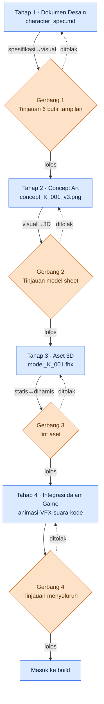
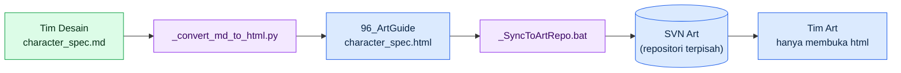

# 12.3 Alur dari Dokumen Desain ke Konsep ke Aset dalam Game

Menjelang akhir sebuah sprint, seorang concept artist melempar satu sketsa karakter lewat messenger tim. "Ini senior Guild Sarjana, kan?" Sosok di layar itu pria berusia tiga puluhan, mengenakan zirah kulit. Padahal di dokumen desain tertulis perempuan berusia empat puluhan, dengan jubah sarjana berwarna abu-abu. Saya menelusuri di mana letak ketidakcocokannya, dan ternyata materi yang diterima concept artist itu adalah dokumen desain versi dua bulan sebelumnya, sementara dalam rentang itu panduan tampilannya sudah berubah dua kali. Satu-satunya orang yang tahu perubahan itu hanyalah Game Designer-nya sendiri.

Kecelakaan ini bukan masalah teknis. Ini masalah alur. Dari satu halaman dokumen desain sampai menjadi aset di dalam game butuh rata-rata 4\~8 minggu, dan dalam rentang itu informasi tentang satu karakter berpindah dari tangan ke tangan: dari kepala Game Designer ke concept artist, ke modeler, ke animator. Setiap kali berpindah, formatnya bisa tidak cocok, dan kalau yang menerima tetap menerimanya dalam kondisi tidak cocok, ia mengisi bagian yang kosong dengan dugaan. Dugaan itu kembali dua bulan kemudian dalam bentuk satu baris pesan di messenger tim.

Bab ini membahas cara menempatkan alur dari-tangan-ke-tangan itu di atas sebuah sistem, bukan di atas ingatan satu orang.

---

## 12.3.1 Dari Tangan ke Tangan — Empat Tahap dan Titik Transisinya

Di Proyek A, jalan yang dilalui aset karakter terdiri dari empat tahap. Yang penting bukan tahapnya itu sendiri, melainkan titik transisi di antara satu tahap dan tahap berikutnya. Kecelakaan meledak bukan di dalam sebuah tahap, melainkan tepat pada saat aset diserahkan dari satu tahap ke tahap berikutnya.

Alih-alih menjelaskan alur ini dengan kata-kata, saya perlu menggambarnya sebagai diagram, dan sepanjang 24 bagian buku ini, ketimbang menggambar kotak dengan tangan, saya selalu meminta kode mermaid ke Claude lalu merendernya. Bab ini memuat di dalam teksnya hasil yang digambar persis dengan teknik itu. Dengan kata lain, saya membuktikan teknik saya sendiri di dalam teks saya sendiri. Berikut adalah keluaran yang saya terima ketika meminta Claude "gambarkan alur empat tahap spec→asset dengan mermaid sehingga gerbang titik transisinya terlihat", dirender apa adanya.



Pada setiap dari tiga titik transisi (spesifikasi→visual, visual→3D, statis→dinamis) berdiri sebuah gerbang. Gerbang adalah loket yang memeriksa format dokumen persetujuan sebelum diserahkan ke departemen berikutnya. Kalau formatnya tidak cocok, dokumen ditolak (garis putus-putus) dan dikembalikan ke tahap sebelumnya. Kalau dokumen yang formatnya tidak cocok tetap diterima, departemen berikutnya akan mengisi bagian kosong dengan dugaan. Kecelakaan messenger terjadi ketika Gerbang 1 tidak ada.

Keunggulan mermaid terlihat dalam gambar ini. Ketika perlu menambah satu gerbang lagi atau menukar urutan tahap, kita tidak menggambar ulang kotak, cukup mengubah satu baris teks. Karena diagramnya berupa teks, ia menjadi objek version control dan di-commit bersama-sama di samping dokumen desain.

---

## 12.3.2 Tahap 1 — Dokumen Desain adalah Akar dari Semua Input

Titik berangkat alur ini adalah satu lembar spesifikasi Markdown. Dokumen inilah input bagi seluruh tiga tahap yang menyusulnya. Kalau di sini ada bagian yang kosong, bagian kosong itu tidak lenyap, melainkan dilemparkan ke tahap berikutnya dan menjadi dugaan.

Berikut adalah format `character_spec` yang benar-benar saya susun. Field `related_atoms` menghubungkan spesifikasi ini ke sistem atom JIT (lihat Bagian 11).

```markdown
---
title: Spesifikasi Karakter Senior Guild Sarjana K_001
type: character_spec
layer: L2
related_atoms: [character_K_001, voice_profile_K_001]
status: draft
---

## 1. Identitas
- Nama: (TBD)
- Peran: Senior Guild Sarjana, NPC utama, bisa menjadi rekan
- Faksi: scholar_guild
- Watak: sarjana_tegas, otoritatif tetapi adil

## 2. Panduan Tampilan
- Usia: empat puluhan
- Jenis kelamin: perempuan
- Postur: sedikit lebih besar dari rata-rata (setara 170cm)
- Busana: abu-abu + aksen ungu, jubah sarjana, kacamata

## 3. Ekspresi·Sikap
- Biasa: tenang, sudut bibir turun
- Saat marah: diam + memutus tatapan
- Sedih: mengalihkan topik, perubahan ekspresi sangat halus

## 4. Peran dalam Game
- Muncul di main quest chapter 1·5·12
- Memberikan 8 side quest
- Bergabung sebagai rekan di chapter 7

## 5. Suara·Dialog
- voice_profile: scholar_K_001
- 3 dialog representatif:
  - "Apakah itu cerita yang tidak ada catatannya?"
  - "Jangan memutuskan dengan emosi. Data dulu."
  - "...Jadi itu pilihan Anda. Baiklah."

## 6. Materi Referensi
- Gambar 5 sarjana nyata (tinjauan legal selesai)
- Referensi nuansa karakter dari refgame
```

Enam butir tampilan (usia·jenis kelamin·postur·busana di seksi 2, serta ekspresi·sikap di seksi 3) menjadi checklist untuk Gerbang 1. Dua baris "perempuan empat puluhan / jubah abu-abu" yang menjadi penyebab kecelakaan messenger persis ada di seksi ini. Seandainya Gerbang 1 bekerja, sebelum materi diserahkan akan diperiksa apakah enam butir tampilan pada materi yang diterima concept artist sudah cocok dengan dokumen desain terkini.

### Worked Transcript — Satu Putaran Bolak-Balik untuk Mengisi Bagian Kosong Dokumen Desain

Alih-alih mengisi sendiri seluruh spesifikasi dari nol dengan tangan, saya hanya menetapkan identitas dan peran, lalu menerima draf tampilan·ekspresi dari Claude. Berikut adalah satu putaran bolak-balik yang sebenarnya, secara penuh. Saya tidak meringkasnya.

**Prompt (penuh):**

> Identitas·peran karakter berikut sudah final. Berdasarkan ini, isilah draf "2. Panduan Tampilan" dan "3. Ekspresi·Sikap" dari character_spec.
> - Peran: Senior Guild Sarjana, NPC utama, bisa menjadi rekan
> - Watak: sarjana_tegas, otoritatif tetapi adil
> - Faksi: scholar_guild
> Batasan: nuansa refgame (fantasi Timur, saturasi rendah). Tampilannya harus bisa dibedakan dari NPC utama lain hanya dari siluetnya. Ekspresinya bertipe menahan diri, tidak menunjukkan marah·sedih secara langsung.

**Keluaran mentah Claude (apa adanya, tanpa dipoles):**

> ## 2. Panduan Tampilan
> - Usia: akhir empat puluhan
> - Jenis kelamin: perempuan
> - Postur: cenderung kurus, sekitar 165cm (※ perlu dipastikan apakah "otoritatif" diekspresikan lewat tinggi badan atau lewat sikap — saya menyarankan lewat sikap)
> - Busana: pakaian sarjana biru tua pekat, sulaman benang perak (※ saya tidak tahu palet warna faksi. Apakah scholar_guild punya warna representatif tersendiri?)
>
> ## 3. Ekspresi·Sikap
> - Biasa: postur tegak dengan dagu sedikit terangkat, pandangan sedikit di atas lawan bicara
> - Saat marah: bicara berkurang dan hanya nadanya yang mendingin
> - Sedih: digantikan dengan gerakan menatap ke luar jendela, wajah hampir tanpa perubahan
>
> Satu hal lagi: kalau "bisa menjadi rekan", tentu juga diperlukan ekspresi saat bertempur, tetapi apakah itu di luar cakupan spesifikasi ini?

**Verifikasi·penolakan manusia:**

Keluaran ini hanya saya terima separuhnya. Seksi ekspresi·sikap hampir saya terima apa adanya — ia menangkap dengan tepat batasan tipe menahan diri, dan "menggantikan kesedihan dengan gerakan menatap ke luar jendela" adalah detail bagus yang tidak ada di dokumen desain. Tampilan saya tolak. Ada dua alasan. Pertama, postur ia tetapkan sebagai "cenderung kurus, 165cm", padahal dokumen desain final menyebut "sedikit lebih besar dari rata-rata, 170cm". Claude hanya menerima identitas·peran, sehingga tidak bisa mengetahui postur, lalu menduganya — persis dugaan yang harus dihalangi gerbang. Kedua, busana biru tua memang cocok dengan nuansa refgame, tetapi berbenturan dengan warna representatif scholar_guild di game kami (abu-abu+ungu). Pertanyaan yang dilemparkan Claude ("apakah ada warna representatif faksi tersendiri?") justru sudah menunjuk lebih dulu benturan ini.

**Permintaan ulang:**

> Bagus. Ekspresi·sikap diterima. Tampilan kunci sebagai berikut, lalu rapikan ulang: postur = sedikit lebih besar dari rata-rata 170cm, busana = jubah sarjana abu-abu + aksen ungu (warna representatif scholar_guild), mengenakan kacamata. Ekspresi bertempur di luar cakupan spesifikasi ini, jadi hapus saja.

Yang bisa dipelajari dari satu putaran bolak-balik ini adalah, tempat di mana Claude mengisi bagian kosong dengan dugaan justru adalah bagian kosong dalam dokumen desain. Ketika menemui nilai yang tidak diketahui, Claude terbelah menjadi dua. Warna faksi dan ekspresi bertempur ia angkat sebagai pertanyaan dengan berkata "ini tidak saya ketahui", dan pertanyaan itu menunjuk kekosongan lebih dulu daripada checklist gerbang. Sebaliknya, postur ia isi dengan angka yang masuk akal tanpa tanda bahwa ia tidak tahu. Selama yang terakhir itu ada, verifikasi di mana manusia membandingkan baris demi baris dengan dokumen desain final tidak bisa dihilangkan.

---

## 12.3.3 Tahap 2 — Concept Art, dan Gerbang 1

Dokumen desain yang sudah final diserahkan ke concept artist. Alurnya sama dengan workflow konsep di §12.1.2. Dengan AI kita memproduksi puluhan hingga ratusan lembar, mengurasinya menjadi segenggam, lalu setelah merapikan 1\~3 opsi secara manual, kita membuat model sheet (depan·samping·belakang).

Intinya ada pada Gerbang 1 yang berdiri di ujung tahap ini. Sebelum model sheet diteruskan ke Tahap 3 (3D), lima butir berikut diperiksa.

| Butir | Kriteria pemeriksaan |
|---|---|
| Kecocokan 6 butir tampilan dokumen desain | Busana·postur·usia·jenis kelamin·ekspresi·sikap cocok dengan dokumen desain terkini |
| Pembeda siluet antar NPC utama | Bisa dikenali dari karakter lain hanya dari silhouette |
| Kepatuhan pada ArtGuide `01_Character/_STYLE_GUIDE` | Tidak ada pelanggaran style guide domain |
| Tidak bertentangan dengan voice_profile | Kesan visual tidak berbenturan dengan kesan suara |
| Keterbacaan saat diperkecil | Tetap dikenali siapa orangnya meski diperkecil ke ukuran UI·minimap |

Di sini atom `image_prompt_design_intent_first` bekerja. Ketika concept artist menulis prompt pun, ia tidak mulai dengan menderetkan kata-kata tampilan seperti "sarjana perempuan jubah abu-abu", melainkan memasukkan lebih dulu maksud desain dari dokumen desain ("otoritatif tetapi adil", "sarjana yang menahan emosi"). Kalau kita hanya menggenggam kata kunci tampilan lalu memproduksi ratusan lembar, akan keluar bertumpuk gambar yang warna pakaiannya cocok tetapi tatapan matanya bukan sarjana — menempatkan maksud di paling depan adalah upaya mengurangi lebih dulu tumpukan "tampilan cocok tetapi kesan tidak cocok" itu. Alat produksinya sama dengan §12.1.1·§12.2.5 — pada SD (SDXL)/ComfyUI yang di-host sendiri, kita memasang sekaligus character LoRA (mengunci wajah·busana) dan ControlNet (mengunci pose·siluet), supaya meski kita menarik ratusan lembar sosok yang sama dengan pose berbeda, wajahnya tidak runtuh.

Butir pertama Gerbang 1, "kecocokan 6 butir tampilan dokumen desain", adalah palang langsung yang menghalangi kecelakaan messenger. Karena sebelum sketsa konsep mengeras menjadi model sheet ia dibandingkan dengan dokumen desain terkini, ketidakcocokan akibat mengerjakan versi dua bulan lalu akan tersangkut di titik ini.

---

## 12.3.4 Kolaborasi dengan Non-Game-Designer — md Hanya untuk Tim Desain, Tim Art Hanya html

Di sini perlu ditunjuk satu asimetri operasional. Seluruh spesifikasi yang sejauh ini kita lihat berupa Markdown, padahal concept artist dan modeler 3D bukan orang yang datang ke perusahaan game untuk membaca Markdown. Karena itu Proyek A memakai juga pipeline konversi satu arah yang kita lihat di §12.2.4 ("tim desain memutuskan dengan md, tim art hanya melihat html") pada alur spec→asset. Keputusan md yang diambil tim desain dikonversi menjadi html lalu didorong ke SVN art terpisah, dan tim art hanya melihat html — biaya belajar md-nya 0.



`_convert_md_to_html.py` mengubah md menjadi html yang enak dibaca, dan `_SyncToArtRepo.bat` mem-push hasilnya bukan ke SVN desain melainkan ke SVN art. Alasan memisahkan kedua repositori sama dengan prinsip pemisahan PC — melindungi agar alur kerja satu sisi tidak menimpa sisi yang lain. Konversi selalu satu arah dari desain → art, dan meski tim art menyentuh html, ia tidak mengalir balik menjadi md desain.

`96_ArtGuide` yang menjadi tujuan akhir konversi itu terbagi menjadi 7 domain (`00_Common`·`01_Character`\~`07_Env`). Tiap domain berotonomi dengan `_STYLE_GUIDE`-nya sendiri, tetapi `00_Common` mengikat konvensi bersama seluruh domain (rentang saturasi·penamaan·resolusi) (diagram strukturnya di §12.2.1). Butir cek ketiga Gerbang 1 persis adalah kepatuhan pada `01_Character/_STYLE_GUIDE` ini.

---

## 12.3.5 Tahap 3 — Aset 3D dan lint Otomatis

Ketika model sheet diteruskan ke tahap 3D, ia melewati 8 proses: high-poly modeling → retopologi (low-poly untuk game) → UV unwrap → texture → rigging·skinning → test pose → tinjauan. Tahap ini adalah segmen di mana AI paling lemah. Karena model generatif 3D belum bisa memberikan retopologi·UV berkualitas game, manusia dan alat tradisionallah yang menjadi pemeran utama.

Sebagai gantinya, pada tahap ini terpasang Gerbang 3, yaitu lint aset otomatis. Bukan manusia yang menghitung jumlah poligon setiap kali, melainkan diperiksa otomatis pada saat aset di-commit.

| Butir pemeriksaan | Syarat lolos |
|---|---|
| Jumlah poligon | Rentang standar per karakter (kriteria operasional penulis 40,000\~80,000) |
| Resolusi texture | Standar 2048×2048 |
| Efisiensi UV unwrap | Pemanfaatan area 80% ke atas |
| Jumlah bone | Patuh pada set bone standar |
| Aturan penamaan aset | Patuh pada konvensi penamaan Bagian 11 |

Kalau pelanggaran tertangkap, notifikasi dikirim ke 3D artist yang bersangkutan. Pemeriksaan yang dulu bergantung pada ketajaman mata manusia dipindahkan ke ranah deterministik. Butir seperti jumlah poligon·resolusi punya benar-salah yang jelas, sehingga bukan tugas AI maupun manusia, melainkan tugas skrip lint.

Di sini muncul satu tahap yang tidak dapat dibalik. Yaitu proses render yang membaking texture. Texture yang sudah di-bake sekali tidak bisa dikembalikan, sehingga tepat sebelum render Gerbang 3 bekerja sekali lagi. Motion capture di Tahap 4 juga sama-sama tidak dapat dibalik — sesi capture tidak bisa dikembalikan sebelum memanggil ulang aktor dan peralatannya. Gerbang di depan tahap yang tidak dapat dibalik dioperasikan lebih ketat daripada gerbang lain.

---

## 12.3.6 Tahap 4 — Integrasi dalam Game dan Tinjauan Menyeluruh

Animasi·VFX·suara·kode digabungkan ke aset 3D, dan karakter muncul untuk pertama kali di dalam game. Ini tahap di mana semua bidang berkumpul di satu tempat, dan Gerbang 4 (tinjauan menyeluruh) adalah palang terakhir.

| Butir tinjauan | Penanggung jawab |
|---|---|
| Kecocokan maksud dokumen desain | Game Designer |
| Nuansa·konsistensi visual | Art Director |
| Kewajaran animasi | Animation Director |
| Keterbacaan dalam game | Game Director |
| Performa (beban frame) | Tech Art |

Per satu karakter, 5 orang melihatnya selama 30 menit\~1 jam. lint pada tahap ini dijalankan otomatis oleh pemetaan aset-resource (`Skill_Art_Resource_Mapping`), memeriksa apakah resource yang benar-benar terkait di dalam game cocok dengan resource yang ditunjuk dokumen desain. Pada tahap integrasi, peran AI terbatas pada pengujian regresi visual dan otomatisasi lint — bukan memutuskan apa yang ditampilkan, melainkan pekerjaan deterministik membandingkan piksel apakah frame kemarin dan hari ini berubah secara tidak disengaja.

---

## 12.3.7 Ketika Perubahan Menyentuh Satu Tahap, Seluruh Hilir Tergoncang

Kecelakaan messenger di awal bab ini sebenarnya adalah dua kecelakaan yang menumpuk. Yang satu adalah ketiadaan Gerbang 1 (materi yang tidak cocok lolos), yang lain adalah ketiadaan pelacakan perubahan (fakta bahwa panduan tampilan berubah dua kali tidak menyebar ke hilir). Yang menghalangi kecelakaan kedua adalah pelacakan dampak perubahan.

Kalau materi satu karakter pada tahap mana pun berubah, seluruh materi di hilirnya terdampak. Kalau ini dihitung manusia dengan tangan setiap kali, pasti ada yang terlewat. Karena itu kita menempatkan alat yang melihat posisi rantai lalu otomatis mengeruk materi hilir.

```python
# spec_change_impact.py
# Kalau satu titik dalam rantai berubah, kumpulkan seluruh aset hilirnya (downstream).

CHAIN = ["spec", "concept", "model", "texture", "rig", "anim", "vfx", "ingame"]

def find_downstream_artifacts(spec_id, changed_field):
    artifacts = []
    chain_position = get_chain_position(changed_field)   # contoh: "tampilan.busana" → "spec"(0)
    for stage in CHAIN[chain_position + 1:]:              # seluruh hilir spec
        artifacts.extend(get_artifacts(spec_id, stage))
    return artifacts

# Penggunaan: kalau busana K_001 berubah?
changed = find_downstream_artifacts("K_001", "tampilan.busana")
# → ["concept_K_001_v3.png", "model_K_001.fbx",
#     "texture_K_001_diffuse.png", "rig_K_001.fbx", ...]
```

Kalau `changed_field` adalah `"tampilan.busana"`, posisi rantainya nomor 0 (spec), dan seluruh hilirnya — concept·model·texture·rig — tertangkap dalam daftar dampak. Daftar ini dikirim sebagai notifikasi otomatis ke para penanggung jawab. Dilihat dengan analogi papan persetujuan di atas meja, pada saat papan persetujuan nomor 1 disunting, otomatis tertancap bendera merah pada papan persetujuan nomor 2\~8, dan papan yang berbendera kembali masuk ke antrean tinjauan. Kecelakaan messenger terjadi persis karena bendera ini tidak ada — nomor 1 (tampilan dokumen desain) berubah dua kali, tetapi bendera tidak tertancap pada nomor 2 (konsep).

---

## 12.3.8 Pengukuran — Efek Standardisasi Empat Tahap

Berikut adalah perbandingan sebelum-sesudah standardisasi di Proyek A yang saya operasikan. Waktu·jumlah absolutnya adalah perkiraan penulis (belum terverifikasi); yang dapat diandalkan adalah arah dan rasio kasarnya.

| Butir | Sebelum standardisasi | Sesudah standardisasi | Arah |
|---|---|---|---|
| 1 karakter (dokumen desain→dalam game) | 8\~12 minggu | 4\~6 minggu | sekitar separuh |
| Kecelakaan dugaan antar tahap | 10\~15 kasus per kuartal | 2\~3 kasus per kuartal | turun besar |
| Kecelakaan perubahan terlewat | 8\~10 kasus per kuartal | 1\~2 kasus per kuartal | turun besar |
| Waktu tinjauan menyeluruh (per karakter) | tersebar·berulang (total 4\~6 jam) | terfokus 30 menit\~1 jam | terkonsentrasi |
| Onboarding character designer baru | sekitar 2 bulan | sekitar 1 bulan | sekitar separuh |

Siklus karakter berkurang kira-kira menjadi separuh. Hanya saja angka ini jangan disalahpahami. Standardisasi bukan konveyor yang mencetak semua karakter dengan kecepatan yang sama. Untuk karakter utama tetap saya curahkan hampir 8 minggu, dan figuran selesai dalam 4 minggu. Yang dilakukan standardisasi bukan menyeragamkan kecepatan, melainkan membuat perbedaan waktu per tahap terjaga tanpa goyah. Kalau standar mengalir menjadi kontrol, ia kembali sebagai kecelakaan yang memangkas waktu kreatif para kreator — tujuan standardisasi adalah menghilangkan dugaan dan kelalaian, bukan memampatkan waktu.

---

## 12.3.9 Posisi AI di Tiap Tahap

| Tahap | Peran AI | Intensitas |
|---|---|---|
| 1. Dokumen desain | Bantuan menyusun draf, pertanyaan kelalaian (Game Designer meninjau) | kuat |
| 2. Konsep | Produksi Stable Diffusion(SDXL)·ComfyUI (LoRA·ControlNet), prompt LLM | kuat |
| 3. 3D | Model generatif belum matang, manusia·alat tradisional jadi pemeran utama | lemah |
| 4. Integrasi | Otomatisasi regresi visual·lint | deterministik |

Pada Tahap 1·2 AI kuat, Tahap 3 dipegang manusia, dan Tahap 4 dipegang alat deterministik. Begitu pemisahan ini mapan, tanggung jawab tiap tahap menjadi jelas — sampai di mana batas draf AI dan dari mana keputusan manusia, kita tidak bingung di depan gerbang.

---

## 12.3.10 Kegagalan Umum dan Resepnya

| Pola | Resep |
|---|---|
| Dokumen desain melewatkan 6 butir tampilan·ekspresi | Cek wajib di Tahap 1, terima pertanyaan kelalaian dari AI |
| Melewati gerbang tahap konsep | Wajibkan pembandingan 6 butir tampilan sebelum model sheet mengeras |
| Menghitung dampak perubahan dengan tangan | Pelacakan otomatis spec_change_impact |
| Tinjauan menyeluruh diborong di akhir | Sebarkan gerbang di tiap tahap |
| Build tanpa lint aset | Blokir otomatis Gerbang 3 |
| Memaksa memampatkan semua karakter dalam 4 minggu | Jaga perbedaan waktu per tahap |

Baris paling pertama dan baris ketiga adalah resep langsung untuk kecelakaan messenger di awal bab ini.

---

### Poin-Poin Penting
- Kecelakaan meledak bukan di dalam tahap, melainkan di titik transisi antar tahap — gerbanglah yang menjaga tempat itu.
- Bagian kosong dokumen desain tidak lenyap, melainkan dilemparkan ke hilir dan menjadi dugaan.
- Pelacakan otomatis dampak perubahan adalah guardrail terbesar yang menghalangi kecelakaan kelalaian.

### Pratinjau Bab Berikutnya
- 13.1 FAQ·analisis meta-game — awal dari data·KPI

---

## Coba Sendiri — Membangun Alur spec→asset secara Minimal

**setup**
1. Buatlah satu format `character_spec.md` (6 seksi: identitas·6 butir tampilan·ekspresi·peran·suara·referensi, termasuk field `related_atoms`).
2. Tempatkan skrip konversi md→html (semacam `_convert_md_to_html.py`), dan kepada tim art bagikan hanya html.
3. Tempelkan checklist gerbang pada 4 titik transisi (6 butir tampilan / model sheet / lint aset / tinjauan menyeluruh).

**prompt**
> Identitas·peran character_spec berikut sudah final. Isilah draf "Panduan Tampilan" dan "Ekspresi·Sikap", tetapi nilai yang tidak diketahui jangan ditebak, tandai sebagai pertanyaan. Batasan: nuansa refgame, bisa dibedakan hanya dari siluet, ekspresi bertipe menahan diri.

**verify**
1. Bandingkan nilai yang ditebak AI (terutama postur·warna) baris demi baris dengan dokumen desain final — kalau tidak cocok, tolak lalu minta ulang dengan nilai yang dikunci.
2. Loloskan 5 butir checklist Gerbang 1 sebelum diteruskan ke model sheet.
3. Coba ubah sengaja satu baris tampilan, lalu pastikan `spec_change_impact` memuntahkan daftar aset hilir secara tepat.

### Versi Ringkas Solo
Kalau bekerja sendiri, pipeline konversi·SVN art·tinjauan 5 orang itu berlebihan. Sisakan hanya dua hal minimal. (1) Satu format `character_spec.md` — 6 butir tampilan wajib, dilarang kosong. (2) Kebiasaan menuliskan sendiri dengan tangan satu baris "berkas hilir yang tersentuh perubahan ini" di paling bawah spesifikasi setiap kali mengubah tampilan. Meski tanpa alat, satu baris itu menghalangi kecelakaan perubahan terlewat.
