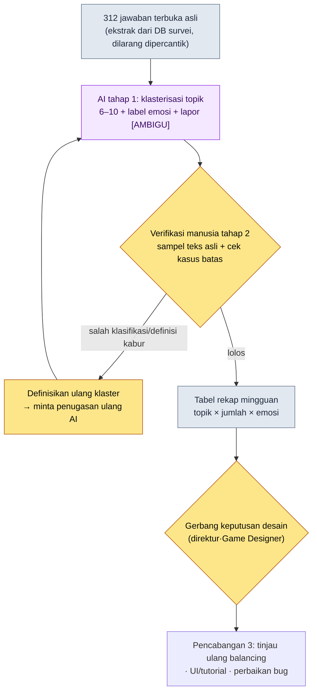
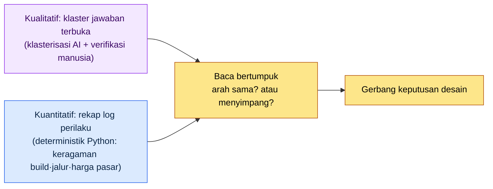

# 13.1 Ratusan Jawaban Terbuka Menjadi Topik — Klasterisasi oleh AI, Diagnosis oleh Manusia

> Pembaca utama: Game Designer MMORPG yang harus membaca umpan balik pemain dan meta game (tim skala menengah, 10–50 orang)
> Versi ringkas untuk pembaca solo/penghobi: §13.1.8 "Kalau Sendirian, Cukup Sebatas Ini"

Saya ingat layar di pagi hari setelah merilis sebuah pembaruan: kolom jawaban terbuka pada survei in-game sudah menumpuk hingga 312 entri. Isinya bercampur, mulai dari kalimat pendek satu baris sampai kemarahan sepanjang lima baris. Tidak seorang pun di tim desain membaca seluruh 312 entri itu. Lebih tepatnya, tidak sanggup membaca. Kalaupun membaca, mereka masuk ke rapat hanya dengan kesan seperti "banyak yang bilang enhancement-nya berat", dan kesan itu sebenarnya ilusi yang dibentuk oleh 5 entri yang paling lantang. Apa yang sebenarnya dikatakan oleh 312 entri itu, tidak ada yang tahu.

Bab ini membahas cara membuat kita bisa mengatakan "apa, sebanyak berapa entri" tanpa manusia harus membaca seluruh 312 entri tersebut. Intinya ada dua. Pertama, serahkan kepada AI pekerjaan klasifikasi yang membosankan, yaitu **mengelompokkan ratusan jawaban terbuka ke dalam topik dan memberi label emosinya**. Kedua, jangan langsung mempercayai klaster yang dibuat AI; manusia **menangkap satu kasus salah klasifikasi, menolaknya, lalu meminta ulang**. Teori umum tentang analisis FAQ dan meta game sudah ada di buku-buku lain, jadi bab ini hanya berfokus pada *titik di mana analisis itu dijalankan dengan alur kerja AI*.

---

## 13.1.1 Jawaban Terbuka Bukan "Materi untuk Dibaca", Melainkan "Materi untuk Diklasifikasi"

FAQ dan jawaban terbuka adalah cermin yang menunjukkan selisih antara game yang dimaksudkan oleh Game Designer dan game yang benar-benar dialami pengguna. Jika pertanyaan yang sama masuk ke meja informasi 30 kali sehari, yang harus dilakukan bukan menambah staf layanan, melainkan merancang ulang papan petunjuknya. Masalahnya adalah pekerjaan menghitung "30 kali" itu. Jawaban terbuka bukan log terstruktur, sehingga `GROUP BY` tidak bisa diterapkan padanya. "Enhancement-nya terlalu mahal" dan "kekurangan resource jadi tidak bisa naikin karakter" adalah topik yang sama, tetapi string-nya berbeda. Kalau manusia mengelompokkannya dengan mata, 312 entri butuh dua-tiga jam, dan kriteria pengelompokannya goyah dari orang ke orang.

Di sinilah tempat AI masuk. Klasifikasi jawaban terbuka adalah pekerjaan yang (1) volumenya banyak, (2) membosankan, dan (3) memerlukan penilaian makna bahasa alami — artinya tidak bisa dilakukan dengan kode deterministik dan mahal kalau dikerjakan manusia. Namun ada satu hal yang harus dipancang sebelum dirilis. **Yang dibuat AI adalah klaster topik (hipotesis), bukan diagnosis final.** "Keluhan enhancement 38%" hanyalah hasil pelabelan oleh AI; itu tidak boleh langsung menjadi keputusan "nerf enhancement". Prinsip yang menjadi benang merah seluruh Bagian 13 tetap berlaku di sini juga — definisi KPI dan diagnosis akhir oleh manusia, pengelompokan bahasa alami dan pelabelan awal oleh AI.

Nilai sejati otomatisasi juga ada pada titik ini. Ketika klasifikasi diotomatiskan, hal yang lebih penting daripada analisisnya sendiri menjadi lebih cepat adalah bahwa **sinyal berupa 312 entri tiba di meja kerja dalam bentuk yang sudah terklasifikasi setiap pagi**. Nilai otomatisasi bukanlah penghematan waktu, melainkan pemaparan sinyal (konsep operasional tim `automation_signal_value_over_time_savings`). Ibarat perbedaan antara surat yang hanya menumpuk di kotak pos dengan surat yang setiap hari disortir dan diantar ke departemen yang bersangkutan.

---

## 13.1.2 [Worked Transcript] 312 Jawaban Terbuka → Klaster Topik

Saya tunjukkan satu siklus secara utuh, bagaimana ini benar-benar dijalankan. Berikut ini adalah reproduksi setia dari sesi pengklasteran topik atas jawaban terbuka survei in-game pada proyek penulis (MMORPG dengan prioritas mobile, selanjutnya disebut "Proyek A"). Prompt masukan bisa langsung disalin dan dipakai, dan keluarannya merupakan rekonstruksi dari sesi nyata.

### Langkah 1 — Masukan: Lempar Jawaban Terbuka Apa Adanya (tanpa pengolahan)

Pertama, ekstrak jawaban terbuka asli ke dalam bentuk yang bisa dibaca mesin. Ini cukup ditarik dari DB survei, jadi bukan sesuatu yang ditulis baru. Yang penting adalah memasukkan **apa adanya secara mentah — tanpa dipercantik atau diringkas, termasuk salah ketik, umpatan, dan jawaban satu kata**. Akurasi klasifikasi justru naik semakin mentah teks aslinya.

```jsonl
# survey_freetext_2026-W21.jsonl (kutipan, 6 dari 312 entri)
{"id": 0041, "text": "biaya enhancement gila ㅡㅡ mau ke +10 tapi resource nggak ngumpul"}
{"id": 0088, "text": "pola bos seru sih tapi rewardnya pelit banget"}
{"id": 0102, "text": "matchmaking guild war kelamaan nunggu lebih dari 5 menit"}
{"id": 0156, "text": "kalau nggak top up nggak bisa enhancement ini game apaan"}
{"id": 0203, "text": "suasana dungeon baru bagus musiknya juga enak"}
{"id": 0274, "text": "kenapa reward di mail nggak masuk? kayaknya bug"}
```

### Langkah 2 — Prompt: Suruh Klasterkan, tetapi Paksakan Kategori, Alasan, dan Pelaporan Ambigu

```
Lampiran survey_freetext_2026-W21.jsonl (312 jawaban terbuka survei) tolong kelompokkan
ke dalam 6–10 topik dan beri label negatif/netral/positif pada tiap jawaban. Jangan dipecah
terlalu halus, dan satu jawaban hanya ke satu klaster saja. Kalau tidak cocok, masukkan ke
lain-lain. Per klaster, buat tabel berisi jumlah entri, persentase, emosi utama, dan 1 contoh
teks asli yang representatif, dan untuk yang kamu tidak yakin penugasannya jangan dipaksakan
masuk — keluarkan ke daftar [AMBIGU] dengan satu baris alasan masing-masing. Tanpa penjelasan,
cukup (a) definisi klaster (b) tabel rekapitulasi (c) daftar [AMBIGU] saja.
```

Di prompt ini, kalimat yang menyuruh melakukan klasifikasi hanya dua baris pertama, dan sisanya seluruhnya adalah batasan yang mengurung bentuk keluaran. Kalau AI diberi kebebasan, ia akan memecah klaster menjadi 20 buah, atau memaksa setiap jawaban masuk ke suatu tempat. Yang mencegah hal itu adalah empat baris: **batas atas jumlah klaster (6–10), penugasan tunggal, tiga kategori emosi, dan jalan keluar "kalau tidak yakin, keluarkan ke [AMBIGU]"**. Akurasi klasifikasi lahir dari pagar pembatas ini.

### Langkah 3 — Keluaran Claude (rekonstruksi, kutipan)

```
(a) Definisi Klaster
C1 Biaya Enhancement/Progres — keluhan bahwa enhancement & perolehan resource berlebihan
C2 Tekanan Top Up            — persepsi bahwa pemain non/sedikit top up tersingkir dari progres
C3 Reward Konten Kurang      — pendapat bahwa reward pelit dibanding effort di bos, dungeon, dll.
C4 Matchmaking/Waktu Tunggu  — keluhan bahwa guild war & matchmaking lama
C5 Pujian Konten             — respons positif atas dungeon baru, presentasi, musik, dll.
C6 Bug/Reward Tidak Masuk    — laporan reward tidak diberikan atau eror
Lain-lain                    — entri sporadis yang tidak cocok ke 6 klaster di atas

(b) Tabel Rekapitulasi
| Klaster | Jumlah | Persentase | Emosi Utama | Teks Asli Representatif                     |
|---------|--------|------------|-------------|--------------------------------------------|
| C1 Biaya Enhancement | 71 | 23%  | Negatif | "biaya enhancement gila ㅡㅡ mau ke +10 tapi resource nggak ngumpul" |
| C2 Tekanan Top Up    | 58 | 19%  | Negatif | "kalau nggak top up nggak bisa enhancement ini game apaan"          |
| C3 Reward Kurang     | 49 | 16%  | Negatif | "pola bos seru sih tapi rewardnya pelit banget"                     |
| C4 Tunggu Matching   | 34 | 11%  | Negatif | "matchmaking guild war kelamaan nunggu lebih dari 5 menit"          |
| C5 Pujian Konten     | 41 | 13%  | Positif | "suasana dungeon baru bagus musiknya juga enak"                     |
| C6 Bug/Reward        | 28 | 9%   | Negatif | "kenapa reward di mail nggak masuk? kayaknya bug"                   |
| Lain-lain            | 31 | 10%  | Campuran| (banyak entri sporadis)                                            |

(c) Daftar [AMBIGU] (4 entri)
- id 0088 "pola bos seru sih tapi rewardnya pelit banget"
  → ditugaskan ke C3 (Reward Kurang), tapi bagian awalnya juga tumpang tindih dengan C5 (Pujian). Respons kompleks.
- id 0156 "kalau nggak top up nggak bisa enhancement" → batas antara C1 dan C2. Dikirim ke C2.
- (2 entri lainnya)
```

Bagian paling berharga dari keluaran ini bukanlah tabel rekapitulasi, melainkan **daftar [AMBIGU] di paling bawah**. Itulah titik di mana AI melaporkan ketidakpastian penugasannya sendiri dan menyerahkannya kepada manusia. Prompt yang baik membuat AI bisa mengatakan "yang ini saya tidak yakin".

### Langkah 4 — Verifikasi dan Penolakan (tempat manusia)

Keluaran ini tidak boleh langsung diajukan ke laporan. Manusia mengetik sendiri sampel teks aslinya. Pada sesi ini, satu kasus benar-benar tertangkap.

Saat membentangkan 58 entri C2 (Tekanan Top Up) dan menelusuri teks aslinya, `id 0156 "kalau nggak top up nggak bisa enhancement ini game apaan"` mengganjal di mata. AI mengirim ini ke C2 (Tekanan Top Up). Padahal rasa sakit utama dari kalimat ini bukan "top up", melainkan **"nggak bisa enhancement"** — yakni C1 (Biaya Enhancement). Pengguna terhambat oleh tembok enhancement, dan ia menunjuk top up sebagai penyebab tembok itu; bukan top up itu sendiri yang menjadi inti keluhan. Memang benar C1 dan C2 berdekatan sehingga membingungkan, tetapi kalau ini dihitung sebagai C2, sinyal "biaya enhancement" akan tampak lebih kecil dari 23%, dan kurva enhancement yang justru perlu diperbaiki akan terdesak dari urutan prioritas. Ini kasus batas di mana satu salah klasifikasi bisa mengubah arah keputusan.

Karena itu, saya menolaknya dan meminta ulang.

```
Batas antara C1 (Biaya Enhancement) dan C2 (Tekanan Top Up) membingungkan. Tolong tugaskan
ulang: kalau rasa sakit utamanya adalah 'tembok progres itu sendiri', masuk C1; kalau 'keadilan
bahwa tanpa top up kau tersingkir', masuk C2. id 0156 intinya adalah "nggak bisa enhancement",
jadi itu C1. Dengan kriteria ini, tugaskan ulang yang ada di batas, dan beri tahu saja berapa
jumlah entri yang berubah.
```

AI menggambar ulang batasnya dan memindahkan 9 entri yang ada di C2 ke C1. Hasilnya, C1 berubah dari 71→80 entri (26%), dan C2 dari 58→49 entri (16%). **Gambaran bahwa biaya enhancement adalah topik terbesar tunggal tetap sama, tetapi ukurannya menjadi lebih jelas, dari 23% ke 26%.** Dengan satu kali bolak-balik, garis besar sinyalnya menjadi tajam. Jumlah penugasan ulang (9 entri) dan perubahan persentase ini adalah nilai yang benar-benar dihitung pada sesi ini (sampel 312 entri, satu minggu tunggal).

Di sini saya tegaskan satu hal. Yang ditolak manusia bukanlah karena "AI salah". Penugasan ke C2 juga mungkin sebagai sebuah interpretasi. Yang dilakukan manusia adalah **membuat definisi klaster (= definisi KPI) menjadi lebih tajam lalu mengumpankannya kembali ke AI**. Definisi oleh manusia, dan kerja menelusuri ulang 312 entri dengan definisi itu dilakukan oleh AI.

---

## 13.1.3 Pipeline — dari Jawaban Terbuka hingga Gerbang Keputusan

Kalau sesi di atas dijalankan otomatis setiap minggu, ia menjadi pipeline. Tempat yang disentuh tangan manusia hanya dua titik. Titik menetapkan definisi klaster dengan tajam (di depan), dan gerbang yang menghubungkan hasil klasifikasi ke keputusan (di belakang). Pengelompokan dan pelabelan 312 entri di antara keduanya dijalankan oleh AI.



Desain yang menentukan adalah bahwa tahap 2 (verifikasi manusia) tidak meloloskan keluaran AI secara otomatis. Kalau dibuat tipe lolos-otomatis, batas yang sekali salah digambar AI akan menyimpangkan sinyal ke arah yang sama setiap minggu. Kandidat yang meragukan (daftar ambigu) dipilih oleh AI, tetapi keputusan apakah definisi klaster akan diperbaiki atau tidak ditentukan manusia. Dan tabel rekapitulasi pun bukanlah keputusan dengan sendirinya, melainkan hanya **masukan bagi gerbang keputusan**. "C1 Biaya Enhancement 26%" adalah sinyal yang membuat direktur memeriksa kurva enhancement, bukan pemicu nerf otomatis.

---

## 13.1.4 Meta Game — Menumpangtindihkan Jawaban Terbuka dengan Log Perilaku

Kalau jawaban terbuka adalah "apa yang dikatakan pengguna", maka meta game adalah "apa yang benar-benar dilakukan pengguna". Setelah rilis, cara bermain yang tidak diniatkan Game Designer akan mapan, dan itulah meta game. Contohnya meta build (pemusatan pada kombinasi skill tertentu), meta jalur (rute berburu favorit), meta perdagangan (kesepakatan antarpemain yang berbeda dari harga resmi), dan sebagainya. Berbeda dengan jawaban terbuka, ini **diukur secara kuantitatif lewat log perilaku** dan direkapitulasi oleh kode deterministik (Python). Ini bukan tempat AI ikut campur.

Intinya adalah **menumpangtindihkan** keduanya. Pada sesi di atas, keluhan C1 (Biaya Enhancement) adalah yang terbesar di 26%. Jika pada saat itu indeks keragaman build dalam log perilaku (konsentrasi pada kombinasi skill teratas) turun pada minggu yang sama, maka dua sinyal — "secara ucapan maupun perilaku sedang konvergen ke satu build, satu jalur progres" — menunjuk arah yang sama. Saat kuantitatif dan kualitatif sejalan, keyakinan atas keputusan pun terbentuk. Sebaliknya, kalau jawaban terbuka diam saja tetapi log perilaku justru memusat ke satu build, itu bisa jadi sinyal bahaya bahwa pengguna merasa tidak nyaman tetapi tidak mengatakannya (= ambang churn diam-diam).



Di sini pun pembagian kerjanya jelas. Rekapitulasi log perilaku dilakukan oleh **kode, bukan AI**. Sebab pangsa build atau harga pasar perdagangan adalah angka deterministik yang jawabannya tidak boleh berbeda setiap kali dipanggil. AI hanya dipakai untuk mengelompokkan teks tak terstruktur berupa jawaban terbuka, sedangkan KPI kuantitatif dipancang oleh kode.

---

## 13.1.5 Sumber Angka dalam Bab Ini

Persentase dalam bab ini mengikuti prinsip "Satu Janji" dari Kata Pengantar. "C1 23%→26%, penugasan ulang 9 entri" pada §13.1.2 adalah nilai yang benar-benar dihitung dari sampel 312 entri (satu minggu tunggal), jadi dibaca bukan sebagai nilai absolut, melainkan sebagai *arah* bahwa "biaya enhancement adalah topik terbesar tunggal". Kausalitas tidak ditegaskan — tidak ada tabel semacam "setelah menganalisis FAQ, retention naik". Sebagai gantinya, yang benar-benar bisa diukur oleh alur kerja ini ada tiga: jumlah salah klasifikasi yang dibalik manusia dalam verifikasi klaster (kalau 0, itu sinyal bahwa verifikasinya sekadar formalitas), waktu yang dibutuhkan hingga rekapitulasi mingguan dihasilkan, dan kesesuaian antara sinyal kuantitatif dan kualitatif.

---

## 13.1.6 Pembuangan dan Permintaan Ulang Bukan Kegagalan Alat, Melainkan Sinyal Gerbang

Pada §13.1.2, manusia membalik 9 entri penugasan C2. Kalau verifikasi dijalankan setiap minggu, pembalikan semacam ini muncul 0 sampai beberapa entri setiap kali. Yang penting adalah bahwa **pembalikan 0 entri bukanlah tujuannya**. Kalau dalam verifikasi tidak ada satu pun yang terbalik, berarti salah satu dari dua hal — AI sempurna (langka), atau verifikatornya cuma membubuhkan cap tanpa melihat teks asli. Yang kedua jauh lebih sering terjadi.

Gerbang verifikasi benar-benar bekerja ketika satu-dua kasus batas tertangkap setiap minggu, dan lewat momen itu definisi klaster menjadi sedikit lebih tajam. Ini adalah bentuk konkret dari prinsip umum bahwa akurasi klasifikasi AI harus diperiksa-sampel secara berkala oleh manusia. Salah klasifikasi yang membuat tipe pengguna yang sama tersebar ke topik yang berbeda akan menumpuk setiap minggu kalau hanya memercayai klasifikasi otomatis tanpa peninjauan.

---

## 13.1.7 Kegagalan yang Lazim

| Pola | Mengapa Gagal | Resep |
|---|---|---|
| Jawaban terbuka hanya ditelusuri mata oleh manusia | Ilusi bahwa 5 entri lantang mewakili 312 entri | Klasifikasi menyeluruh dengan klasterisasi AI (§13.1.2) |
| "AI, tolong analisis umpan balik pemain" diserahkan utuh | Klaster terpecah jadi 20 atau dipaksa ditugaskan | Batas atas jumlah klaster·penugasan tunggal·[AMBIGU] dipaksakan |
| Tabel rekap AI dilaporkan tanpa verifikasi | Salah klasifikasi di batas mengubah arah keputusan | Cek langsung sampel teks asli + kasus batas |
| Persentase rekap langsung menjadi keputusan | "Keluhan 26%, maka nerf" jadi pemicu otomatis | Tabel rekap hanyalah masukan bagi gerbang keputusan |
| Hanya melihat kualitatif, mengabaikan log perilaku | Melewatkan churn diam-diam tanpa suara | Baca kuantitatif (kode)·kualitatif (AI) secara bertumpuk (§13.1.4) |
| Menyuruh AI merekapitulasi KPI kuantitatif | Angka berbeda tiap panggilan, balancing jadi goyah | Rekap build·harga pasar oleh kode deterministik |

Yang ketiga paling sering terlewat. Tabel rekapitulasi tampak rapi sehingga membuat kita ingin langsung memercayainya. Namun seperti satu kasus id 0156, satu salah klasifikasi di batas bisa mengubah seluruh urutan prioritas. Verifikasi bukanlah membaca ulang 312 entri, melainkan memeriksa **hanya kasus batas dari dua-tiga klaster terbesar** dengan teks aslinya.

---

## 13.1.8 Coba Sendiri — Satu Langkah yang Bisa Anda Lakukan Hari Ini

> **Kalau Sendirian, Cukup Sebatas Ini**: Anda tidak perlu DB survei. Kumpulkan saja 30–50 ulasan store atau tulisan komunitas dari game Anda sendiri (atau game favorit Anda) sebagai teks, lalu tempelkan prompt §13.1.2 apa adanya dan jalankan sekali. Dari klaster yang muncul, pilih satu penugasan yang terasa "kok ini agak aneh", lalu sanggah dengan "rasa sakit utama jawaban ini ada di topik lain, tetapkan ulang definisinya dan tugaskan ulang"; dengan begitu Anda akan benar-benar merasakan bahwa klasterisasi adalah kumpulan dari penilaian-penilaian seperti apa.

Kalau Anda di dalam tim, mulailah dengan satu langkah berikut. Ekstrak jawaban terbuka satu minggu sebagai `survey_freetext_YYYY-Www.jsonl` tanpa dipercantik, lalu jalankan sekali dengan prompt §13.1.2. Setelah itu periksa hanya kasus batas dari dua klaster terbesar dengan teks aslinya. Kalau Anda menetapkan definisi klaster dengan tajam sekali saja, setelah itu rekapitulasi mingguan yang dapat direproduksi dengan prompt yang sama akan menumpuk otomatis setiap minggu.

---

### Poin-Poin Penting
- Jawaban terbuka bukan materi untuk dibaca, melainkan materi untuk diklasifikasi menyeluruh dengan AI.
- Definisi klaster (= definisi KPI) oleh manusia, pengelompokan 312 entri oleh AI.
- Pembalikan 0 entri dalam verifikasi adalah sinyal bahwa cap dibubuhkan tanpa melihat.

### Pratinjau Bab Berikutnya
- 13.2 Definisi·pelacakan KPI — tabel diagnosis yang diringkas jadi 5–7 butir dan jebakan pengukuran
