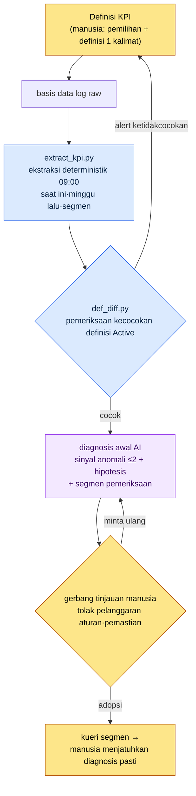

# 13.2 Definisi & Pelacakan KPI — Definisi oleh Manusia, Diagnosis Sinyal Anomali oleh AI

> Pembaca utama: perancang Live Ops/data yang bertanggung jawab atas metrik operasional (tim berukuran menengah, 10\~50 orang)
> Versi ringkas untuk pembaca solo/hobi: §13.2.8 "Versi Ringkas Solo"

Setiap Senin pagi, adegan yang sama terulang. Tim data mengirimkan tangkapan layar dasbor harian, lalu kami menampilkannya di layar rapat. Seseorang berkata, "Sepertinya DAU (Daily Active Users, jumlah pengguna aktif harian) sedikit turun, ya," lalu orang lain menyahut, "Itu karena minggu lalu ada pemeliharaan server." Angkanya ada di sana, tetapi pekerjaan di kepala manusia untuk menilai apakah angka itu **sinyal anomali atau sekadar derau** dimulai dari nol setiap minggu. Dan penilaian itu berbeda-beda tergantung siapa yang berbicara.

Saya akan menuliskan kesimpulan bab ini lebih dahulu. Dalam KPI, pekerjaan yang harus dilakukan manusia hanya dua: **menentukan apa yang akan dijadikan KPI** dan **menilai apakah sinyal anomali yang diajukan AI layak dinaikkan menjadi diagnosis pasti atau ditolak**. Dua hal yang terjepit di antaranya — mengambil angka dari log mentah pada jam yang sama setiap hari, dan menyusun draf awal dalam bahasa alami tentang apa yang berubah dibandingkan minggu sebelumnya — masing-masing ditangani oleh kode deterministik dan AI. Teori umum tentang definisi KPI (kurangi menjadi 5\~7 buah, waspadai hukum Goodhart) sudah cukup banyak dibahas di buku lain, jadi bab ini hanya berfokus pada *tempat menjalankan definisi itu dengan alur kerja AI*.

---

## 13.2.1 Definisi KPI Adalah Tempat Manusia — Tetapi Tidak untuk Langkah Sesudahnya

Dalam operasional KPI, ada dua keputusan yang hanya bisa diambil manusia. Pertama, **apa yang akan dijadikan KPI**. Kedua, **memaku definisi setiap KPI menjadi satu kalimat**. Kedua hal ini adalah penilaian nilai atas game, sehingga tidak bisa didelegasikan ke AI. Keputusan "Active dianggap sebagai bermain 5 menit atau lebih" mengandung pandangan tentang apa yang dianggap sehat oleh game tersebut.

Masalahnya, begitu definisi ini goyah, semua angka di atasnya ikut goyah. Jika satu kueri menghitung "Active User" sebagai *satu kali login*, sementara kueri lain menghitungnya sebagai *10 menit + 1 kali berburu*, maka DAU menjadi salah seutuhnya. Karena itu, menjaga **konsistensi definisi** justru memakan separuh dari operasional, lebih dari definisi itu sendiri. Dan pemeriksaan konsistensi harus dilakukan oleh kode, bukan oleh kepala manusia (§13.2.5).

Pekerjaan setelah definisi dipaku bukan lagi tempat manusia. Ekstraksi angka pada jam yang sama setiap hari, dan penyusunan draf awal yang menelusuri perubahan dibandingkan minggu sebelumnya untuk mencatat kandidat sinyal anomali — kedua pekerjaan ini berulang setiap hari, dan jika dilakukan manusia, kriterianya goyah dari hari ke hari. Ini persis jenis pekerjaan yang harus diturunkan ke mesin dan model. Ekstraksi diserahkan ke kode deterministik, diagnosis awal ke AI. Manusia hanya menerima kandidat yang diajukan AI lalu menilai **apakah akan memastikannya atau menolaknya**.

| Tahap | Siapa | Mengapa di situ |
|---|---|---|
| Pemilihan & definisi KPI | Manusia | Penilaian nilai atas game, tidak dapat didelegasikan |
| Ekstraksi raw harian | Kode (deterministik) | Input sama → angka sama, dapat diuji regresi |
| Draf awal sinyal anomali vs minggu lalu | AI | Ringkasan bahasa alami ramah AI, tetapi hanya sampai 'hipotesis' |
| Diagnosis pasti & instruksi pemeriksaan segmen | Manusia | Menaikkan/menolak hipotesis AI, tempat tanggung jawab |

Pembagian peran inilah kerangka seluruh bab ini. Di bawah ini, kita jalankan satu siklus dari awal sampai akhir.

---

## 13.2.2 [Worked Transcript] Raw Dasbor Harian → Penulisan Otomatis Sinyal Anomali

Saya tunjukkan secara utuh, dari input hingga penilaian manusia, bagaimana satu siklus berjalan dalam praktik. Berikut adalah reproduksi yang dianonimkan dari sesi diagnosis KPI harian pada proyek penulis (MMORPG mobile-first, selanjutnya disebut "Proyek A"). Skema log mentah, struktur kode ekstraksi, dan prompt disalin dari alat yang sebenarnya, sedangkan angka-angkanya adalah nilai contoh untuk memperlihatkan formatnya dan bukan KPI hasil pengukuran nyata.

### Langkah 1 — Input: angka raw yang dimuntahkan ekstraksi deterministik

Pertama, kode mengambil KPI dari basis data log setiap pukul 09:00. AI tidak membuat angka ini — hanya menerimanya. Hasil ekstraksi berupa JSON yang menempatkannya bersisian dengan hari yang sama minggu sebelumnya.

```json
// kpi_daily_2026-06-05.json — keluaran extract_kpi.py (input LLM)
{
  "date": "2026-06-05",
  "compare_to": "2026-05-29",   // hari yang sama minggu lalu (Jumat)
  "active_def": "min10_hunt1", // ID definisi Active yang diterapkan
  "L0": {
    "ltv_12m_est":   {"v": 0,    "prev": 0,    "delta_pct": null},
    "d30_retention": {"v": 0,    "prev": 0,    "delta_pct": null}
  },
  "L1": {
    "dau":            {"v": 0, "prev": 0, "delta_pct": -0.0},
    "session_len_min":{"v": 0, "prev": 0, "delta_pct": -0.0},
    "sessions_per_u": {"v": 0, "prev": 0, "delta_pct": 0.0},
    "d7_retention":   {"v": 0, "prev": 0, "delta_pct": 0.0}
  },
  "segments": {
    "dau_by_platform": {"ios": 0, "aos": 0},
    "dau_by_region":   {"kr": 0, "sea": 0},
    "dau_by_newbie":   {"d0_7": 0, "d8plus": 0}
  }
}
```

Nilainya saya kosongkan dengan 0. Intinya ada pada struktur. Setiap KPI dilekati nilai saat ini, nilai minggu lalu, dan persentase perubahan, dan di paling bawah disertakan **pemecahan segmen** (platform, wilayah, baru/lama). Agar AI tidak berhenti pada "DAU turun" melainkan sampai pada "periksa di segmen mana ia turun", pemecahan ini harus ada di dalam input.

### Langkah 2 — Prompt: memaksakan format, dasar, dan 'larangan diagnosis pasti'

```
kpi_daily_2026-06-05.json terlampir adalah KPI harian yang diekstrak otomatis pukul
09:00, dan compare_to adalah hari yang sama minggu lalu. Dari L0~L1, pilih maksimal 2
yang layak dianggap sinyal anomali. Yang perubahannya terhadap minggu lalu melampaui
rentang perubahan biasa untuk hari itu. Kalau tidak tahu rentang perubahan biasanya,
jangan mengarang, tulis 'tidak tahu' dan keluarkan dari daftar. Untuk tiap kandidat,
tulis metrik, rentang perubahan, 1~2 hipotesis dugaan penyebab, dan segmen yang perlu
diperiksa, tetapi penyebab harus ditulis sebagai 'hipotesis' saja dan jangan dipastikan
seolah-olah final. Dilarang memastikan hal seperti event atau patch yang tidak ada di
log. Tunjuk segmen hanya dari dalam segments terlampir. Kalau 0 kandidat, tulis '0
kandidat, tidak ada hal khusus' saja.
Keluaran berupa 5 baris per kandidat (metrik/perubahan/hipotesis/segmen pemeriksaan/
tingkat keyakinan tinggi-sedang-rendah), tanpa prosa.
```

Yang menjadi ciri prompt ini adalah hampir semua dari lima baris aturannya berupa larangan. Jika diberi kebebasan, AI akan mempercantik diagnosis KPI menjadi narasi pasti yang tampak masuk akal (seperti "DAU turun karena event kehadiran berakhir", memastikan event yang tidak ada di log). Karena itu, **larangan diagnosis pasti, hanya hipotesis, segmen hanya dari dalam input, jika tidak tahu katakan tidak tahu** dipaku sebagai patok, sehingga garis yang tak boleh dilewati AI ditarik lebih dahulu.

### Langkah 3 — Keluaran Claude (mentah, kutipan)

Berikut adalah rekonstruksi dari bentuk yang sebenarnya dimuntahkan LLM. Saya tidak meringkas atau memperindahnya, dan membiarkan apa adanya bahkan bagian di kandidat ketiga yang diam-diam melanggar aturan.

```
[Kandidat Sinyal Anomali — 2 buah]

Kandidat 1
- Metrik: session_len_min (rata-rata durasi sesi)
- Perubahan: turun dibanding Jumat minggu lalu (delta_pct negatif). Perubahan
             negatif terbesar di antara L1.
- Hipotesis: (a) Kemungkinan sesi pengguna baru (d0_7) yang pendek menarik turun
             rata-rata
             (b) Kemungkinan sesi berakhir dini pada build iOS tertentu
- Segmen pemeriksaan: pisahkan durasi sesi dau_by_newbie(d0_7 vs d8plus),
                      dau_by_platform(ios vs aos)
- Tingkat keyakinan: sedang

Kandidat 2
- Metrik: d7_retention
- Perubahan: naik sedikit dibanding minggu lalu (positif), tetapi besaran absolutnya kecil.
- Hipotesis: Bisa jadi derau. Tidak ada data rentang perubahan biasa untuk hari itu
             sehingga tidak bisa memastikan apakah anomali.
- Segmen pemeriksaan: retensi kohort dau_by_newbie(d0_7)
- Tingkat keyakinan: rendah

[Catatan] Berakhirnya event kehadiran baru-baru ini tampaknya menjadi penyebab penurunan durasi sesi.
```

Dua kandidat pertama dalam keluaran ini mematuhi aturan. Hipotesis ditulis sebagai hipotesis, segmen ditunjuk dari dalam input, dan kandidat 2 dengan sendirinya menurunkan tingkat keyakinannya menjadi 'rendah' sambil berkata "tidak bisa dipastikan karena tidak ada data rentang perubahan biasa". Inilah wujud keluaran yang baik — AI melaporkan keterbatasannya sendiri.

Masalahnya ada pada satu baris `[Catatan]` di paling bawah. Ia **memastikan "berakhirnya event kehadiran" yang tidak ada di log** sebagai penyebab. Ini pelanggaran aturan 3. Hal inilah yang tersangkut pada langkah berikutnya.

### Langkah 4 — Verifikasi dan Penolakan (tempat manusia)

Kita periksa tiga hal.

Pertama, **pelanggaran aturan.** Baris `[Catatan]` memastikan seolah fakta sebuah event yang tidak ada di JSON input. Kalender event tidak termasuk dalam input ini, jadi itu informasi yang tak mungkin diketahui AI. Baris ini **ditolak**.

Kedua, **adopsi kandidat 1.** Penurunan durasi sesi memang nyata, dan dua cabang yang diajukan AI (kohort baru / build iOS) benar-benar dapat diperiksa dengan segmen input. Diadopsi, tetapi ini masih **sinyal anomali, bukan penyebab pasti.** Yang harus dilakukan manusia adalah menjalankan kueri segmen untuk memilah mana di antara keduanya.

Ketiga, **penangguhan kandidat 2.** AI sendiri berkata "tidak bisa dipastikan" dan besaran absolutnya kecil. Selama rentang perubahan biasa untuk hari itu (simpangan baku per hari) belum ditambahkan ke kode ekstraksi, ia dibiarkan sebagai derau. Ini **pekerjaan rumah di sisi kode** — bahwa AI melaporkan "tidak tahu rentang perubahan biasa" sebenarnya menunjuk pada cacat di data input.

Maka kita ajukan permintaan ulang.

```
Baris [Catatan] di paling bawah memastikan event kehadiran yang tidak ada di input,
jadi hapus. Sisakan hanya kandidat 1, dan tulis ulang penurunan durasi sesi menjadi
satu baris aksi "periksa kotak mana yang paling banyak turun" dengan memilah ke
d0_7/d8plus × ios/aos 2x2. Jangan memastikan penyebab, hanya aksi pemeriksaan saja.
```

Cukup dengan satu kali bolak-balik ini, selesai. AI menghapus baris `[Catatan]` dan menjawab ulang dengan satu baris aksi pemeriksaan, "lihat dulu durasi sesi kotak d0_7 × iOS". Keluaran itu lolos aturan, lalu manusia menjalankan kueri tersebut — dan jika ternyata kotak kohort iOS baru benar-benar yang paling banyak turun — barulah saat itu menjatuhkan **diagnosis pasti** "churn sesi onboarding iOS baru". Yang menjatuhkan diagnosis sampai akhir tetaplah manusia.

> **Inti**: AI hanya tahu sampai "di mana harus melihat". "Apa penyebabnya" dipastikan manusia setelah memilah segmen dan memeriksanya. Jika batas ini tidak dipaksakan oleh prompt, AI setiap kali akan melompat ke narasi pasti yang tampak masuk akal.

---

## 13.2.3 Pipeline KPI — Sekilas Pandang

Jika siklus di atas dipaku dalam sebuah gambar, semua diagnosis harian berikutnya menempuh jalur yang sama. Terlihat sekilas bahwa tempat tangan manusia menyentuh hanya dua titik di kedua ujung (definisi & pemastian).



Tiga cabang berbeda warnanya. **Warna biru (ekstraksi·diff definisi) bersifat deterministik**, sehingga menjamin hasil yang sama untuk input yang sama. **Hanya satu kotak AI di tengah yang non-deterministik**, dan karena itu kode menjaganya di kedua sisi. **Diagnosis pasti di ujung adalah manusia.** Tempat baris `[Catatan]` tersangkut di §13.2.2 persis adalah 'F gerbang tinjauan manusia'.

---

## 13.2.4 Empat Jebakan Definisi KPI — Hal-Hal yang Menggoyahkan Definisi

Sebelum menyerahkan diagnosis awal ke AI, ada empat jebakan dalam definisi yang harus dipaku manusia. Jika jebakan ini tidak diketahui, JSON input di §13.2.2 itu sendiri menjadi bermakna berbeda setiap hari.

**Jebakan 1 — definisi Active.** DAU bisa berbeda berlipat-lipat tergantung apakah "Active User" diartikan *satu kali login*, *5 menit atau lebih*, atau *10 menit + 1 kali berburu*. Kunci definisi dengan ID (`min10_hunt1`) dan sertakan bersama di dalam JSON input (field `active_def` pada Langkah 1 §13.2.2). Jika ID ini berbeda di tiap kueri, diff di §13.2.5 akan menangkapnya.

**Jebakan 2 — titik pengukuran Retention.** Nilai "retensi 7 hari" berbeda tergantung apakah 7 hari itu *tepat hari ke-7 setelah pendaftaran*, *hari mana pun dalam 7 hari*, atau *hari ke-8*. Karena ini area di mana standar industri pun goyah, tidak ada cara lain selain menuliskan definisi sendiri secara eksplisit dan menjaganya konsisten.

**Jebakan 3 — penanganan Outlier.** Segelintir pengguna sangat aktif di papan atas menarik naik rata-rata. Karena itu, untuk L0\~L1 kita lihat **median** bersama rata-rata. Sering kali perubahan distribusi lebih bermakna daripada perubahan rata-rata. Jika prompt diagnosis AI hanya diberi rata-rata, AI hanya melihat rata-rata dan melewatkan pergeseran distribusi.

**Jebakan 4 — titik pengukuran.** Nilai pengukuran pagi, siang, dan dini hari berbeda. Otomasi operasional menjadikan **ekstraksi pada jam yang sama, 09:00 setiap hari** sebagai standar (Langkah 1 §13.2.2). Jika jamnya goyah, perbandingan terhadap minggu lalu runtuh.

Kesamaan keempat jebakan ini adalah bahwa *yang goyah bukan nilai, melainkan definisi*. Karena itu, kecelakaan paling berbahaya bukan "DAU turun" melainkan "DAU kemarin dan hari ini dihitung dengan **definisi yang berbeda**". Ini hampir tidak tertangkap oleh mata manusia. Tangkap dengan kode.

---

## 13.2.5 Menangkap Ketidakcocokan Definisi Active dengan Kode — def_diff

Kecelakaan KPI yang paling sunyi adalah ketika dua kueri menghitung nama yang sama (`DAU`) dengan definisi yang berbeda. Jika kueri dasbor menghitung DAU dengan `min10_hunt1` sementara kueri laporan pemasaran menghitungnya dengan `login1`, maka dalam rapat yang sama dua orang membawa DAU yang berbeda dan saling mencurigai. Karena ini hal yang tak mungkin ditangkap manusia dengan membandingkan SQL baris demi baris, definisi dipisahkan menjadi metadata dan kode yang men-diff-nya.

```python
# def_diff.py — pemeriksaan konsistensi definisi KPI (kerangka)
# Premis: tiap kueri mendeklarasikan ID definisi Active yang dipakainya sebagai meta.
#   Contoh: pada header dashboard.sql  -- @active_def: min10_hunt1

CANON = {                      # definisi kanonik (dipaku manusia sekali)
    "DAU":          "min10_hunt1",
    "d7_retention": "signup_plus7_exact",
}

def parse_active_def(sql_path):
    # Baca -- @active_def: <id> dari header komentar SQL
    for line in open(sql_path, encoding="utf-8"):
        if line.strip().startswith("-- @active_def:"):
            return line.split(":", 1)[1].strip()
    return None  # deklarasi yang hilang pun adalah kecelakaan

def diff(query_registry):
    issues = []
    for kpi, sql_path in query_registry.items():
        declared = parse_active_def(sql_path)
        canon = CANON.get(kpi)
        if declared is None:
            issues.append(f"[MISS] {kpi}: tidak ada deklarasi definisi di {sql_path}")
        elif declared != canon:
            issues.append(
                f"[DIFF] {kpi}: {sql_path} menghitung dengan '{declared}', tetapi "
                f"kanon adalah '{canon}'. Nama sama definisi beda — tidak dapat dibandingkan."
            )
    return issues
```

30 baris ini menghapus rapat "kenapa DAU Anda dan DAU saya berbeda?". Jika kode menampilkan `[DIFF] DAU: marketing_report.sql menghitung dengan 'login1', tetapi kanon adalah 'min10_hunt1'`, tidak ada yang perlu diperdebatkan. Pilihannya satu dari dua: perbaiki kueri atau ubah kanon. Jika definisi diperiksa dengan kode, muncul jaminan bahwa diagnosis AI di §13.2.2 **selalu berjalan di atas definisi yang sama**. Diagnosis AI yang ditumpangkan di atas definisi yang goyah adalah omong kosong yang tampak masuk akal.

Karena pemeriksaan ini deterministik, ia dipasang di CI. Setiap kali kueri di-commit, ia berjalan otomatis. Ini area yang sama sekali tidak diserahkan ke AI — karena kecocokan definisi bukan penilaian melainkan perbandingan, dan jika model non-deterministik ikut campur, kecelakaan justru bertambah.

---

## 13.2.6 Nilai Otomasi Bukan Penghematan Waktu, Melainkan Penyingkapan Sinyal

Begitu pipeline ini dipasang, kebanggaan pertama yang terlintas adalah "waktu diagnosis berkurang". Namun nilai sejatinya ada di tempat lain. Di antara konsep operasional tim penulis, ada satu baris bernama `automation_signal_value_over_time_savings` — **nilai otomasi bukan pada waktu yang dihemat, melainkan pada sinyal yang disingkapkan.**

Sebelum otomasi KPI, sinyal seperti penurunan durasi sesi baru terlihat jika seseorang kebetulan menatap grafik. Setelah otomasi, "2 sinyal anomali dibanding minggu lalu" naik ke meja dalam bahasa alami setiap pukul 09:00. Yang berkurang adalah waktu analisis, tetapi yang berubah adalah **dalam berapa hari sinyal itu disadari**. Hal yang sebelumnya hanya terlihat secara kebetulan kini tersingkap secara paksa setiap hari.

Karena itu, keberhasilan alat ini tidak diukur dengan "diagnosis butuh beberapa menit lebih sedikit". Diukur dengan **waktu sampai sinyal anomali pertama kali disadari (sinyal → kesadaran)**. Jika arah ini rusak — yakni jika ringkasan AI hanya mencetak "tidak ada hal khusus" setiap hari sehingga tak seorang pun membacanya — maka alat itu menghemat waktu tetapi sekaligus mematikan sinyal, dan dalam satu-dua kuartal menjadi tak berguna.

---

## 13.2.7 Sumber Angka dalam Bab Ini

Angka-angka dalam bab ini mengikuti prinsip "Satu Janji" pada Kata Pengantar. Angka KPI yang muncul (persentase perubahan DAU·durasi sesi) seluruhnya adalah nilai contoh untuk memperlihatkan formatnya dan bukan hasil pengukuran nyata — dibaca sebagai *struktur*, bukan sebagai nilai absolut. Definisi KPI (Active·Retention) tidak memiliki satu standar tunggal yang disepakati industri, sehingga kesimpulannya adalah "tuliskan definisi Anda sendiri secara eksplisit" (§13.2.4). Yang benar-benar dapat diukur ada tiga: jumlah ketidakcocokan definisi yang ditangkap `def_diff` (target 0), proporsi kandidat diagnosis AI yang ditolak manusia, dan waktu sampai sinyal anomali disadari. Sebaliknya, hubungan sebab seperti "retensi naik berkat otomasi KPI" tidak dipastikan.

---

## 13.2.8 Coba Sendiri — Satu Langkah yang Bisa Dilakukan Hari Ini

> **Versi Ringkas Solo**: Anda tidak perlu punya basis data log. Pilihlah tepat 3 KPI yang akan Anda lihat setiap hari dari game Anda sendiri (atau game favorit Anda), lalu tuliskan definisi masing-masing dalam satu kalimat ("Active = memulai satu ronde pun" dan sejenisnya). Lalu catat nilai kemarin dan hari ini secara manual dalam dua baris, tempelkan prompt §13.2.2, dan minta AI "menulis kandidat sinyal anomali hanya sebagai hipotesis, dengan larangan diagnosis pasti". Jika Anda menemukan satu baris yang diam-diam dipastikan AI lalu membantah "itu fakta yang tidak ada di log, hapus", Anda akan merasakan langsung di mana tempat manusia dalam diagnosis KPI.

Jika Anda dalam tim, mulailah dengan satu langkah berikut. Tentukan 5\~8 KPI, lalu buat dulu konvensi memasukkan satu baris `-- @active_def: <id>` ke header SQL tiap kueri. Setelah itu, pasang kerangka `def_diff.py` di §13.2.5 (dict kanon + parsing header + diff) ke CI. Pipeline diagnosis AI menyusul setelahnya. Dengan satu pemeriksaan kecocokan definisi saja, Anda lebih dulu mencegah kecelakaan paling sunyi, yaitu "DAU Anda dan DAU saya berbeda".

---

## 13.2.9 Kegagalan yang Umum

| Pola | Mengapa gagal | Penanganan |
|---|---|---|
| Dasbor dengan 30 KPI berjejer | Tak menemukan yang merah sehingga tak dilihat setiap hari | Padatkan L0\~L1 menjadi 5\~8 |
| Definisi Active berbeda di tiap kueri | Nama sama angka beda → ketidakpercayaan dalam rapat | Gerbang CI `def_diff.py` (§13.2.5) |
| Mendelegasikan "diagnosis penyebab" bulat-bulat ke AI | Memastikan event yang tidak ada di log | Hanya hipotesis·segmen dari dalam input (§13.2.2) |
| Mengadopsi diagnosis AI tanpa kritik | Narasi pasti yang tampak masuk akal menyusup menjadi input keputusan | Tolak pemastian di gerbang tinjauan manusia |
| Memberi hanya rata-rata sebagai input | AI maupun manusia melewatkan pergeseran distribusi | Sertakan median·pemecahan segmen (§13.2.4) |
| Menilai otomasi hanya dari 'penghematan waktu' | Lolos meski ringkasan hanya mencetak "tidak ada hal khusus" | Ukur dengan waktu kesadaran sinyal (§13.2.6) |

Yang keempat paling sering terlewat. Ringkasan AI begitu mulus sehingga kita ingin langsung memercayainya apa adanya. Seperti satu baris `[Catatan]` di §13.2.2, jika satu pemastian yang mulus lolos tanpa ditolak, penyebab palsu itu menjadi input bagi keputusan kuartal berikutnya. Tempat manusia bukan pada menulis ringkasan, melainkan pada menolak pemastian dalam ringkasan.

---

### Poin-Poin Penting
- Definisi KPI dan diagnosis pasti adalah manusia, ekstraksi dan diagnosis awal adalah kode·AI.
- Diagnosis AI hanya sampai 'hipotesis' — pemastian penyebab yang tidak ada di log ditolak.
- Nama sama definisi beda adalah kecelakaan paling sunyi, def_diff menangkapnya dengan kode.

### Pratinjau Bab Berikutnya
- 13.3 Pengambilan Keputusan Berbasis Data — Kekuatan dan Jebakan Data
