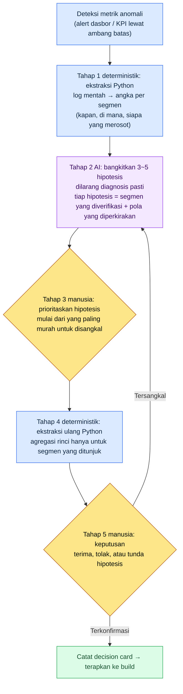

# 13.3 Dari Metrik Anomali hingga Keputusan — AI Membuat Hipotesis, Manusia Membuat Keputusan

> Pembaca utama: penanggung jawab data dan direktur yang membuat keputusan kuartalan berdasarkan KPI (tim berukuran menengah, 10\~50 orang)
> Versi ringkas untuk pembaca solo/hobi: §13.3.9 "Versi Ringkas Solo"

Saya pernah melihat satu garis merah di dasbor pada suatu Senin pagi. Retensi 30 hari (Retention) jelas merosot dibanding pekan sebelumnya. Orang-orang yang berkumpul di ruang rapat masing-masing mengajukan satu penyebab. Ada yang menyebut wilayah berburu baru yang baru saja di-patch pekan lalu, ada yang menyebut musim baru dari produk pesaing, dan ada juga yang sekadar berkata "faktor musiman". Semuanya terdengar masuk akal. Masalahnya, hingga sore itu berlalu pun, kami bahkan belum sepakat tentang apa yang harus kami verifikasi. Ada lima hipotesis, tetapi tidak satu pun segmen yang ditetapkan untuk diverifikasi.

Bab ini membahas cara mengakhiri pagi seperti itu. Intinya satu kalimat. **Ketika Anda melihat metrik anomali, jangan minta AI memberi diagnosis pasti, melainkan minta 3\~5 hipotesis yang dapat diverifikasi.** AI tidak memvonis "alasan retensi turun adalah X". Ia menyodorkan rancangan verifikasi berbentuk "jika X, maka pada segmen ini akan terlihat seperti ini", dan keputusan tetap dibuat oleh manusia. Teori umum tentang data-driven sudah cukup banyak di buku lain, jadi bab ini hanya berfokus pada *tempat menjalankan teori umum itu dengan alur kerja AI*.

---

## 13.3.1 Definisi KPI oleh Manusia, Bantuan Interpretasi oleh AI

Pertama-tama, kita tancapkan batasnya. Seluruh bab ini berdiri di atas satu kalimat. **Apa yang dijadikan definisi sebuah KPI ditetapkan oleh manusia, dan AI hanya membantu pekerjaan menggelar hipotesis dengan cepat tentang mengapa KPI itu goyah ketika ia memang goyah.**

Jika batas ini runtuh, data-driven itu sendiri runtuh. Jika definisi KPI diserahkan kepada AI, maka "yang mudah diukur" menjadi KPI; dan jika diagnosis pun diserahkan kepada AI, maka satu kalimat pasti yang terdengar meyakinkan akan melompati verifikasi manusia dan langsung menjadi keputusan. Karena itu, hanya satu ruas yang dibuka untuk AI — ruas di antara setelah anomali terdeteksi dan sebelum manusia membuat keputusan, yaitu ruas untuk menggelar "apa yang harus dicurigai dan apa yang harus dipastikan".

Pembagian peran ini berbagi tulang punggung yang sama dengan bab-bab awal Bagian 13. Python mengekstraksi log mentah (raw) secara deterministik (13.1), manusia memfiksasi definisi dan hierarki KPI (13.2), dan di bab ini, di atas keduanya, AI hanya menangani *bantuan interpretasi* saat anomali terdeteksi. Ekstraksi itu deterministik, definisi itu manusia, bantuan interpretasi itu AI. Menjaga ketiganya tidak tercampur adalah pengaman seluruh bagian ini.

Pada proyek penulis (MMORPG yang mengutamakan mobile, selanjutnya "Proyek A") tergelar log nyata yang menopang bantuan ini. Di bawah folder memori tim, ada `_economy_log/` (log ekonomi token dan waktu), `_scores_latest.json` (cache skor metrik), dan `_roi_report.md` (laporan ROI/Return on Investment, efek terhadap investasi). Worked transcript (rekaman sesi nyata) di bab ini menerima sinyal anomali yang diekstraksi dari log-log ini sebagai input.

---

## 13.3.2 Loop Keputusan — Tempat AI Masuk Hanya Satu Kotak

Saya tetapkan dulu dalam sebuah gambar seluruh loop ketika satu metrik anomali berlanjut hingga menjadi keputusan. Dalam gambar ini, kotak tempat AI masuk hanya satu, yaitu "pembangkitan hipotesis". Baik yang di depannya (ekstraksi) maupun yang di belakangnya (verifikasi dan keputusan) adalah tempat manusia dan kode.



Tangan manusia menjamah tiga tempat. Tempat mendefinisikan apa yang dianggap anomali (paling depan, sudah selesai di 13.2), tempat memilih hipotesis mana yang diverifikasi lebih dulu (tahap 3), dan tempat membuat keputusan akhir (tahap 5). Agregasi log yang membosankan di antaranya dilakukan oleh Python, sedangkan pekerjaan menggelar hipotesis dengan cepat dilakukan oleh AI. **Tidak ada kotak dalam loop ini tempat AI memberi diagnosis pasti.** Hipotesis ada untuk disangkal, dan jika tersangkal, alurnya kembali ke tahap 2.

---

## 13.3.3 [Worked Transcript] Penurunan Retensi — Menerima 3\~5 Hipotesis

Saya tunjukkan satu siklus dari awal sampai tuntas bagaimana ini sebenarnya dijalankan. Berikut adalah sesi yang merekonstruksi penurunan retensi pada Senin pagi di atas. Prompt input dapat langsung disalin dan dipakai, dan keluarannya merekonstruksi sesi nyata dengan setia.

### Langkah 1 — Input: lemparkan apa adanya sinyal anomali yang ditarik Python

Pertama, manusia tidak melemparkan kesan "retensi turun". Yang dilemparkan adalah tabel angka per segmen yang ditarik Python secara deterministik. Ini bukan ditulis baru, melainkan hanya diekstraksi dari `_economy_log`/log peristiwa.

```python
# retention_break_extract.py (kerangka) — uraikan rentang anomali per segmen
# Input: log retensi kohort per hari
# Output: pada segmen mana, seberapa merosot (tabel untuk input LLM)
def extract_break(rows, kpi="d30_retention", baseline_weeks=4):
    base = mean([r[kpi] for r in rows if r.week < target_week][-baseline_weeks:])
    cur  = [r for r in rows if r.week == target_week]
    return [
        {"segment": s.name,
         "baseline": round(base_by_seg[s.name], 3),
         "current":  round(s.value, 3),
         "delta_pct": round((s.value/base_by_seg[s.name]-1)*100, 1),
         "n": s.sample_size}          # Jumlah sampel — jika kecil, kepercayaan rendah; ikut diteruskan
        for s in cur
    ]
```

Tabel yang dimuntahkan skrip ini adalah input pertama untuk AI. Intinya adalah jumlah sampel (`n`) ikut diteruskan. Agar AI tidak salah mengira fluktuasi segmen bersampel kecil sebagai penyebab, peringatan itu harus dipegang oleh data, bukan oleh manusia.

```
# retention_break_2026Q2W3.txt (hasil ekstraksi, kutipan)
segment                baseline  current  delta_pct      n
Baru (dalam 7 hari daftar)  0.41     0.31      -24.4%     8,200
Kembali (setelah 30+ hari nonaktif)  0.28     0.27       -3.6%     1,100
Berbayar (paying)         0.62     0.60       -3.2%     2,400
Non-bayar                0.34     0.25      -26.5%    14,900
Wilayah_berburu_baru_main  0.39     0.22      -43.6%     3,050
Wilayah_berburu_baru_tidak_main  0.40     0.38       -5.0%    11,200
```

### Langkah 2 — Prompt: larang diagnosis, paksa hipotesis dan rancangan verifikasi

```
File retention_break_2026Q2W3.txt yang terlampir adalah perubahan retensi d30 per segmen yang
ditarik Python (baseline=rata-rata 4 minggu sebelumnya, current=minggu ini, n=jumlah sampel).
Pada Non-bayar dan Wilayah_berburu_baru_main turun cukup tajam. Jangan diagnosis penyebabnya,
cukup susun 3~5 hipotesis yang dapat diverifikasi. Untuk tiap hipotesis, tulis empat baris ini:
satu kalimat hipotesis / segmen yang diverifikasi (cara memecah lebih lanjut) / pola yang akan
terlihat jika benar / kondisi penyangkalan yang menunjukkan ia salah. Segmen bersampel kecil
(n<2000) jangan dijadikan dasar inti; jika tetap dipakai, sebutkan batasannya. Urutkan hipotesis
dari yang paling murah untuk disangkal, dan apa yang tidak bisa dibedakan oleh data tandai
terpisah sebagai 'perlu penilaian manusia'. Keluaran cukup daftar kartu hipotesis saja, tanpa narasi.
```

Dalam prompt ini tidak ada satu baris pun yang berbunyi "carilah penyebabnya". Yang tertulis hanyalah kerangka yang harus dipenuhi hipotesis dan garis yang tak boleh dilewati. Jika AI diberi kebebasan, ia akan memuntahkan kalimat pasti yang terdengar meyakinkan seperti "mungkin karena tingkat kesulitan wilayah berburu baru", dan begitu kalimat itu tercatat di notulen, ia menjadi keputusan tanpa verifikasi. Yang mencegahnya adalah keempat hal ini: **larangan memvonis, kewajiban menyertakan segmen verifikasi, pola yang diperkirakan, dan kondisi penyangkalan untuk tiap hipotesis, pengurutan berdasarkan biaya penyangkalan, dan "yang tak bisa dibedakan diserahkan ke manusia".** Inilah alat yang mengubah keluaran dari diagnosis menjadi rancangan verifikasi.

### Langkah 3 — Keluaran Claude (mentah, direkonstruksi)

```
[Hipotesis 1] (biaya penyangkalan terendah)
Hipotesis: Tingkat kesulitan wilayah berburu baru menjadi penghalang masuk bagi pengguna baru non-bayar, sehingga memperbesar churn dalam 7 hari.
Segmen verifikasi: Pecah ulang segmen Wilayah_berburu_baru_main berdasarkan rentang 'jumlah kematian pertama' (0~2 / 3~5 / 6+).
Pola yang diperkirakan: Jika hipotesis benar, rasio churn d7→d30 harus melonjak pada rentang kematian pertama 6+.
Kondisi penyangkalan: Tolak jika tidak ada hubungan monoton antara jumlah kematian dan rasio churn.

[Hipotesis 2]
Hipotesis: Penyebabnya bukan wilayah berburu baru itu sendiri, melainkan perubahan lain (kurva reward·UI) yang terikat pada patch yang sama.
Segmen verifikasi: Retensi pengguna yang masuk Wilayah_berburu_baru_tidak_main tetapi mengakses game setelah patch.
Pola yang diperkirakan: Jika segmen tidak-main juga ikut turun, maka wilayah berburu bukan pelakunya.
Kondisi penyangkalan: Jika segmen tidak-main mempertahankan baseline (di kisaran -5%), tolak hipotesis ini dan condong ke Hipotesis 1.

[Hipotesis 3]
Hipotesis: Karena faktor eksternal (musim baru produk pesaing), non-bayar secara umum churn, dan wilayah berburu tidak terkait.
Segmen verifikasi: Tabel silang 2×2 antara Berbayar/Non-bayar × main-tidaknya Wilayah_berburu_baru.
Pola yang diperkirakan: Jika faktor eksternal, non-bayar secara umum turun merata tanpa peduli main-tidaknya wilayah berburu.
Kondisi penyangkalan: Jika penurunan terkonsentrasi pada Wilayah_berburu_baru_main, dugaan faktor eksternal melemah.

[Hipotesis 4] (perlu penilaian manusia)
Hipotesis: Masalah pengukuran itu sendiri — ada perubahan pada definisi kohort/pengumpulan log minggu ini.
Segmen verifikasi: (tidak bisa dibedakan oleh data) Perlu konfirmasi manusia apakah ada perubahan skema telemetry bersama patch.
Pola yang diperkirakan: Jika ada perubahan skema, penurunan mungkin bukan nyata melainkan artefak pengukuran.
Kondisi penyangkalan: Jika dipastikan pipeline log tidak berubah, tolak.

Catatan: Segmen 'Kembali' (n=1,100) bersampelnya kecil sehingga -3.6% tidak dianggap sebagai sinyal.
```

Bagian paling berharga dalam keluaran ini adalah Hipotesis 4. Itulah tempat AI melaporkan batasnya sendiri: "ini tidak bisa dibedakan oleh data, manusia harus mengonfirmasi apakah skema telemetry berubah". Prompt yang baik membuat AI mampu berkata "tidak tahu". Dan baris terakhir — bahwa ia sendiri mengeluarkan segmen bersampel 1,100 dari sinyal — adalah jejak bekerjanya aturan 3.

### Langkah 4 — Verifikasi dan keputusan (tempat manusia dan Python)

Kartu hipotesis ini tidak boleh langsung dipindahkan menjadi keputusan. Manusia menetapkan prioritas, dan Python mengagregasi ulang.

Hipotesis 2 memiliki biaya penyangkalan paling murah. Segmen Wilayah_berburu_baru_tidak_main sudah ada di tabel Langkah 1 — `-5.0%`. Ia mempertahankan baseline. Artinya, pengguna yang tidak memainkan wilayah berburu baik-baik saja. **Hipotesis 2 ditolak di tempat itu juga, dan sekaligus Hipotesis 3 (penurunan umum akibat faktor eksternal) pun melemah.** Sebab jika faktor eksternal, segmen tidak-main pun seharusnya ikut turun. Penurunan terkonsentrasi pada pengguna yang *memainkan* wilayah berburu baru.

Karena itu, saya persempit ke Hipotesis 1 dan menjalankan Python lagi. Hasil dari memecah ulang Wilayah_berburu_baru_main berdasarkan jumlah kematian pertama menunjukkan bahwa churn d30 menonjol pada rentang 6 kematian atau lebih (arah: hubungan monoton di mana makin banyak kematian, makin tajam churn — nilai persis diukur dengan telemetry build, di sini hanya arahnya). Ini cocok dengan pola yang diperkirakan Hipotesis 1.

Yang tersisa adalah Hipotesis 4. Manusia memeriksa patch notes — skema telemetry tidak berubah. Kemungkinan artefak pengukuran ditolak. Kini bahan untuk keputusan sudah lengkap.

> **[Keputusan manusia tahap 5 — Decision Card]**
>
> - **Terima**: Tingkat kesulitan awal wilayah berburu baru (frekuensi kematian pertama) adalah pemicu utama churn pengguna baru non-bayar. Pada build berikutnya, lakukan A/B untuk menurunkan kepadatan musuh·HP pada rentang level 1\~5.
> - **Tolak**: Dugaan faktor eksternal (Hipotesis 3), dugaan artefak pengukuran (Hipotesis 4).
> - **Tunda**: Kurva reward (sisa dari Hipotesis 2) — jika penurunan masih tersisa setelah penyesuaian kesulitan wilayah berburu, nyalakan ulang.
> - **Catatan peran AI**: Diagnosis 0 buah, 4 hipotesis + penyediaan rancangan verifikasi. Keputusan oleh manusia.

Satu siklus input (sinyal anomali) → ekstraksi → hipotesis → verifikasi → keputusan tertutup di sini. AI tidak sekali pun berkata "penyebabnya adalah ini". Ia hanya membuka jalan untuk diverifikasi. Inilah standar Show bab ini — kalimat "AI menganalisis data" menjadi hampa jika kita tidak sekali pun menelusuri sampai tuntas apa yang dihipotesiskan, apa yang tersangkal, dan apa yang diputuskan manusia.

---

## 13.3.4 Mengapa 'Diagnosis Pasti' Dilarang

Perbedaan antara pembangkitan hipotesis dan diagnosis pasti tampak sepele, tetapi ia memisahkan keamanan keputusan. Jika keduanya disandingkan, perbedaannya menjadi jelas.

| | Diagnosis pasti (dilarang) | Pembangkitan hipotesis (cara bab ini) |
|---|---|---|
| Keluaran AI | "Penyebab penurunan retensi adalah tingkat kesulitan wilayah berburu baru" | "Hipotesis kesulitan — lihat rentang kematian pertama 6+, begini berarti benar, begitu berarti salah" |
| Tindakan manusia berikutnya | Mencatat apa adanya lalu memutuskan | Mencoba menyangkal mulai dari hipotesis termurah |
| Saat salah | Keputusan keliru langsung masuk ke build | Ditolak di tahap verifikasi, biaya 0 |
| Letak tanggung jawab | "AI yang bilang begitu" (tanggung jawab menguap) | Manusia memilih hipotesis dan memutuskan (tanggung jawab jelas) |

Bahaya sejati diagnosis pasti bukanlah akurasi, melainkan **bahwa ia membuat orang melompati verifikasi**. Satu kalimat yang terdengar meyakinkan akan meredam kecurigaan di ruang rapat. Sebaliknya, kartu hipotesis itu sendiri adalah pekerjaan rumah berbunyi "pastikan ini", sehingga strukturnya membuat keputusan tak bisa diambil tanpa verifikasi. Di sinilah alasan menempatkan AI sebagai pembangkit hipotesis, bukan sebagai alat diagnosis.

---

## 13.3.5 Peringatan Dini Goodhart — AI Menunjuk Distorsi KPI Lebih Dulu

Jebakan terdalam dari data-driven adalah hukum Goodhart. *"Begitu metrik pengukuran menjadi target, metrik itu tidak lagi menjadi metrik yang baik."* Jika DAU dijadikan target, DAU saja yang menggembung lewat notifikasi artifisial, sementara retensi jangka panjang terkikis. Masalahnya, distorsi ini biasanya baru terungkap sebagai efek samping **jauh setelah keputusan dibuat**.

Karena itu, AI dimasukkan satu langkah lebih awal. Sebelum rancangan keputusan dimasukkan ke build, AI lebih dulu diminta menjawab "jika KPI ini dijadikan target, bagaimana ia bisa di-game". Ini bukan diagnosis, melainkan *red team* — menyuruh AI dengan sengaja mencari celah dari keputusan kita.

> **[Prompt Peringatan Dini Goodhart]**
>
> Target KPI kuartal ini adalah retensi d7 +5%p, dan draf cara mencapainya adalah memperkuat
> reward kehadiran 7 hari berturut-turut secara besar-besaran. Jadilah red team untuk keputusan
> ini, lalu tarik dalam bentuk tabel: 3 skenario distorsi Goodhart yang bisa muncul jika KPI ini
> dijadikan target, metrik penjaga (guard) yang akan ikut rusak pada tiap skenario, dan segmen
> pemantauan untuk menangkap distorsi sejak dini. Jangan memvonis, gunakan bentuk 'ini bisa terjadi'.

Yang disodorkan AI bukanlah ramalan pasti, melainkan daftar titik yang harus dicurigai. Jika dipindahkan intinya saja, beginilah.

| Skenario distorsi Goodhart (hipotesis) | Metrik penjaga yang ikut rusak | Pemantauan dini |
|---|---|---|
| Hanya menandai kehadiran, konten inti tidak dimainkan | Jumlah pertarungan per sesi·tingkat masuk wilayah berburu | Peringatan saat retensi d7 ↑ + jumlah pertarungan ↓ terjadi bersamaan |
| Inflasi reward meruntuhkan ekonomi | Rasio sink/source mata uang, harga pasar item | Lacak pelebaran selisih sink-source di `_economy_log` |
| Churn tebing tepat setelah kehadiran berakhir | Retensi d8\~d14 (tepat setelah reward habis) | Jangan hanya melihat d7, pasangkan dengan d14 |

Nilai tabel ini bukanlah jawaban benar, melainkan **bahwa metrik penjaga sudah dipasangkan berpasangan sebelum keputusan**. Jika retensi d7 hendak dijadikan target, "jumlah pertarungan" dan "retensi d14" yang ditunjuk AI ditayangkan di layar yang sama dan diamati. Dengan begitu, pada saat d7 naik tetapi jumlah pertarungan ikut turun — saat distorsi Goodhart mulai — efek samping tertangkap sebelum menumpuk hingga akhir kuartal. Kebiasaan mengikat KPI tunggal dengan metrik penjaga alih-alih menjadikannya target inilah cara membuat "keseimbangan 5\~7 KPI" yang ditetapkan di 13.2 benar-benar bekerja pada tahap keputusan.

Ada satu hal yang perlu ditegaskan di sini. Nilai yang dihasilkan AI dalam red team ini bukanlah "penghematan waktu". Waktu yang dibutuhkan manusia untuk memikirkan tiga skenario ini tidaklah lama. Nilai sebenarnya adalah **bahwa ia menyingkapkan sinyal distorsi tepat di tempat keputusan dibuat** — efek sinyal berupa mengangkat metrik penjaga yang biasanya tak dilihat ke atas meja keputusan. Nilai otomatisasi bukan terletak pada penghematan waktu, melainkan pada membuat terlihat sinyal yang biasanya tak terlihat (konsep memori tim Proyek A: `automation_signal_value_over_time_savings`).

---

## 13.3.6 Bobot Hipotesis AI Berbeda untuk Tiap Keputusan

Pembangkitan hipotesis tidak sama bergunanya untuk semua keputusan. Seberapa jauh hipotesis AI dipercaya berubah sesuai horizon waktu keputusan dan kepadatan data.

| Jenis keputusan | Kepadatan data | Posisi hipotesis AI |
|---|---|---|
| Perubahan angka balancing skill | Tinggi (simulasi·log berlimpah) | Loop hipotesis→verifikasi→keputusan apa adanya, bantuan AI kuat |
| Perubahan komponen UI | Tinggi (A/B memungkinkan) | Sama, hipotesis AI valid |
| Keputusan rilis konten baru | Sedang (hanya rujukan konten serupa) | Hipotesis sebagai acuan, bobot keputusan condong ke manusia |
| Visi jangka panjang·bidang baru | Rendah (tanpa preseden) | Loop itu sendiri tidak berputar — keputusan manusia, AI hanya menyebut risiko |

Aturannya sederhana. **Makin tebal data sebuah keputusan, jalankan apa adanya loop §13.3.2; makin tipis data sebuah keputusan, peran AI turun dari pembangkit hipotesis menjadi penyusun checklist risiko.** Alasan mengapa upaya menyelesaikan visi jangka panjang dengan data itu berbahaya adalah karena, di tempat tanpa data masa depan, jika AI mengarang hipotesis yang terdengar meyakinkan dari data masa lalu, hipotesis itu akan menarik visi kembali ke masa lalu. Keputusan di ranah tanpa data bukanlah untuk dihindari atau dilimpahkan ke AI, melainkan dibiarkan sebagai tempat yang diputuskan manusia dengan penuh tanggung jawab.

> **[Penanda Arah — Jika memetakan topik·kohort sebagai koordinat dengan embedding (untuk saat ini masih terlalu dini)]**
>
> Mohon dibaca bukan sebagai resep, melainkan sebagai tren riset. Gagasan embedding yang sama terbuka di dua tempat pada Bagian 13. Pertama adalah respons bebas di §13.1 — jika bahasa alami tak terstruktur diklasterkan dengan embedding kalimat, kasus batas [ambigu] di §13.1.2 dapat dipetakan sebagai 'jarak antara dua pusat topik', dan respons yang jauh dari pusat mana pun dapat ditandai sebagai 'kemunculan topik baru'. Yang lain adalah log perilaku di §13.1.4 — jika log permainan di-embedding, 'kohort emergen' yang tak didefinisikan siapa pun sebelumnya dapat tersingkap sebagai klaster pada ruang vektor ('peta' Lampiran M), membuka jalan untuk diumpankan sebagai kandidat 'segmen yang diverifikasi' dalam loop hipotesis §13.3 (ini adalah tempat yang menembus satu langkah keterbatasan 'segmen yang didefinisikan manusia sebelumnya' yang diandaikan §13.3.3). Hanya saja, klaster bukanlah penyebab melainkan sekadar hipotesis, klaster kecil bukanlah sinyal (tempat yang sama dengan peringatan sampel di §13.3.3), dan pelabelan untuk memberi nama klaster tetaplah bagian manusia (§13.1.1). Yang terutama, kecelakaan live bisa meledak pada dimensi yang dibuang oleh kompresi. Karena itu, gagasan ini ditempatkan persis di tempat yang sama dengan petunjuk 'vektor dimensi' pada bagian ekonomi §8.2.7 (intuisi konsepnya di Lampiran M) — di atas tanah telemetry yang sama, dengan penahanan yang sama. Ini hanyalah penanda arah yang akan ditengok beberapa tahun kemudian oleh tim yang telemetry-nya tergelar kokoh; yang harus dilakukan sekarang adalah menjalankan loop §13.3.2 secara jujur.

---

## 13.3.7 Sumber Angka Bab Ini

Angka di bab ini mengikuti prinsip "Satu Janji" pada kata pengantar. Hukum Goodhart adalah proposisi publik yang diformalkan Charles Goodhart pada tahun 1975, `_economy_log`·`_roi_report.md`·`_scores_latest.json` Proyek A adalah keluaran memori tim yang nyata, dan aturan `integrity_check_clickup_notify` yang memberi tahu lewat ClickUp ketika pemeriksaan konsistensi gagal adalah atom operasional nyata dengan skor 294.93 (Lampiran A.3.6·A.3.1). Di §13.3.3, hanya *arah* "churn tajam pada rentang kematian pertama 6+" yang dipastikan lewat verifikasi hipotesis, sedangkan nilai absolutnya diserahkan ke telemetry build. Tabel segmen (baseline 0.41 dsb.) adalah *susunan contoh* untuk menunjukkan bentuk alur kerja, bukan nilai aktual yang dipublikasikan untuk kuartal tertentu — yang perlu diingat bukanlah angkanya, melainkan strukturnya.

---

## 13.3.8 Kegagalan yang Umum

| Pola | Mengapa gagal | Resep |
|---|---|---|
| Bertanya "apa penyebabnya" ke AI | Kalimat pasti yang terdengar meyakinkan diputuskan tanpa verifikasi | Larang diagnosis, paksa 3\~5 hipotesis + kondisi penyangkalan (§13.3.3) |
| Menganggap fluktuasi segmen bersampel kecil sebagai sinyal | Salah mengira noise sebagai penyebab | Teruskan `n` bersamaan di tahap ekstraksi dan sebutkan ambang batas |
| Langsung menjadikan KPI tunggal sebagai target | Distorsi Goodhart meledak di akhir kuartal | Red team AI sebelum keputusan + pasangan metrik penjaga (§13.3.5) |
| Menyelesaikan keputusan jangka panjang tanpa data dengan data | Hipotesis masa lalu menarik turun visi masa depan | Bedakan peran AI menurut kepadatan data (§13.3.6) |
| Menerima hipotesis tanpa verifikasi | Hipotesis menyamar menjadi kesimpulan | Sangkal mulai dari hipotesis termurah, manfaatkan segmen tidak-main |

Yang ketiga paling lambat meledak. Retensi d7 naik sehingga keputusan tampak seperti sukses, tetapi dua bulan kemudian tebing d14 dan penurunan jumlah pertarungan datang bersamaan. 30 menit menjalankan red team AI sekali *sebelum* keputusan, menyelamatkan dua bulan itu.

---

## 13.3.9 Coba Sendiri — Satu Langkah yang Bisa Dilakukan Hari Ini

> **Versi Ringkas Solo**: Anda tidak perlu memiliki pipeline log. Pada game Anda sendiri (atau metrik publik dari game yang gemar Anda amati), pilihlah satu angka yang baru saja merosot belakangan ini. Lemparkan angka itu ke AI, tetapi bukan dengan "beri tahu penyebabnya", melainkan dengan "dilarang diagnosis pasti, beri 3 hipotesis yang dapat diverifikasi beserta kondisi penyangkalannya". Pilihlah satu di antaranya yang paling murah untuk dipastikan, lalu pecah datanya sendiri sekali; Anda akan merasakan langsung betapa berbedanya 'menerima diagnosis' dan 'memverifikasi hipotesis' dalam hal keamanan keputusan.

Jika Anda dalam tim, mulailah dengan satu langkah berikut. Tambahkan satu baris agar skrip ekstraksi metrik anomali **selalu menampilkan jumlah sampel (`n`) bersamaan** ketika menarik angka per segmen (lihat `retention_break_extract.py` di §13.3.3). Lalu, saat menetapkan target KPI berikutnya, jalankan sekali prompt red team Goodhart §13.3.5, dan masukkan satu pasang metrik penjaga ke dalam decision card. Dengan kedua hal ini saja, "AI mendiagnosis penyebab" berubah menjadi "AI menggelar hipotesis dan manusia memverifikasi lalu memutuskan".

---

### Poin-Poin Penting
- Mintalah AI bukan diagnosis pasti, melainkan 3\~5 hipotesis yang dapat diverifikasi.
- Wajibkan segmen verifikasi·pola yang diperkirakan·kondisi penyangkalan untuk tiap hipotesis.
- Sebelum keputusan, ikat metrik penjaga berpasangan lebih dulu lewat red team Goodhart.

### Pratinjau Bab Berikutnya
- 14.1 Dari 30 jenis HUD PC menjadi 10 jenis di mobile — awal dari keputusan per platform
