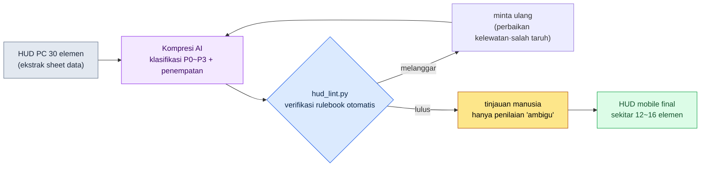

# 14.1 Dari 30 Elemen HUD PC Menjadi 10 Elemen Mobile — Batasan Jadi Rulebook, Kompresi Jadi Tugas AI

> Pembaca utama: Game Designer UX dan System Designer pada proyek mobile-first (tim skala menengah, 10\~50 orang)
> Versi ringkas untuk pembaca solo/hobi: §14.1.7 「Kalau Sendirian, Cukup Sampai Sini」

Saya masih ingat hari ketika untuk pertama kalinya menampilkan HUD pertarungan — yang berjalan mulus di build PC — pada resolusi mobile. Separuh layar tertutup oleh gauge, ikon, minimap, dan quest tracker, sementara karakternya sendiri justru tidak terlihat. Setiap elemen tampak sama-sama dibutuhkan. Masalahnya, pertanyaan "apa yang harus dibuang" selalu menjadi pertengkaran yang dimulai dari nol setiap kali rapat. Ada yang ingin mempertahankan minimap, ada yang ingin mempertahankan chat. Karena landasannya hanya "perasaan", kesimpulannya berbeda-beda tiap kali.

Bab ini membahas cara mengakhiri pertengkaran itu. Intinya ada dua. Pertama, mengubah batasan mobile dari "perasaan" menjadi **rulebook (buku aturan) yang dapat diverifikasi**. Kedua, menyerahkan pekerjaan kompresi yang membosankan dan berulang — "mengurangi 30 elemen PC menjadi 10 elemen mobile" — kepada AI, sementara manusia hanya melakukan **tinjauan untuk menangkap pelanggaran rulebook**. Pengetahuan umum tentang UX mobile sudah tersedia cukup banyak di buku-buku lain, jadi bab ini fokus hanya pada *tempat menjalankan pengetahuan itu lewat alur kerja AI*.

---

## 14.1.1 Batasan Mobile Bukan 'Catatan Perhatian', Melainkan 'Rulebook'

Banyak buku yang menderetkan batasan mobile dalam bentuk tabel. Ceritanya: layar kecil, jari tebal, sesi pendek, baterai cepat habis. Semuanya benar, tetapi sekadar menghafalkannya dari tabel tidak menjawab pertanyaan "lalu, tombol ini boleh atau tidak?" saat rapat. Batasan harus berubah menjadi **kriteria lulus/gagal berbentuk angka** supaya AI maupun manusia menarik garis yang sama.

Untungnya, sebagian besar batasan input mobile sudah ditetapkan secara tegas oleh perusahaan platform dalam bentuk pedoman publik. Standar publik seperti touch 44pt (HIG), 48dp (Material), kontras 4.5:1 (WCAG), dan jarak 8dp mengikuti rulebook di §9.1; di sini saya hanya menaruh secara inline yang langsung dipakai lint bab ini, yaitu **target sentuh minimum 44pt (HIG)**. Ini angka-angka yang tidak perlu dibuat-buat. Bukan "sepertinya tombolnya agak kecil", melainkan "tombol ini 38pt, jadi di bawah 44pt HIG" — barulah, entah manusia atau AI yang mengerjakannya, hasil penilaiannya sama.

Di sini saya tambahkan satu baris — MMORPG mobile menjadikan grip dua tangan dalam orientasi lanskap sebagai standar, dan elemen yang ditekan ditaruh di kedua sudut bawah, sedangkan item consumable/slot di tengah bawah (kenapa lanskap menjadi standar, dan apa itu model tiga area, dibahas di §9.1). Semua penilaian penempatan dalam bab ini mengasumsikan grip dua tangan lanskap tersebut.

Standar platform, jika diletakkan berdampingan dengan PC, membuat titik awal kompresi menjadi jelas. PC bersifat presisi dan masif (sanggup menampung 30\~50 elemen), sedangkan mobile lanskap terbatas pada sudut yang dijangkau kedua tangan sehingga 12\~16 elemen adalah batasnya (tabel perbandingan lengkap lihat rulebook §9.1 — perkiraan penulis, belum terverifikasi). Karena itu, esensi pekerjaan mobile bukanlah "desain", melainkan **"kompresi prioritas dari 30\~50 elemen PC menjadi 12\~16 elemen mobile lanskap"**. Dan kompresi ini, jika dikerjakan dengan tangan, membosankan dan garis acuannya goyah setiap kali dikerjakan — karena ini adalah pekerjaan menerapkan aturan yang sama secara berulang tanpa lelah, ia pas sekali dengan pembagian tugas di mana AI menyusun draf dan manusia meninjau.

---

## 14.1.2 [Worked Transcript] HUD PC 30 Elemen → Kompresi Prioritas Mobile

Saya tunjukkan satu siklus penuh, bagaimana ini benar-benar dijalankan. Berikut adalah reproduksi setia dari sesi kompresi HUD pertarungan pada proyek penulis (MMORPG mobile-first, selanjutnya disebut "Proyek A"). Prompt input bisa langsung disalin dan dipakai, sedangkan keluarannya direkonstruksi dari sesi yang sebenarnya.

### Langkah 1 — Input: Lemparkan Spesifikasi HUD PC Apa Adanya

Pertama, buat daftar elemen HUD PC menjadi tabel yang dapat dibaca mesin. Ini sudah ada di sheet data, jadi bukan ditulis baru, melainkan cukup diekstrak.

```yaml
# hud_pc_inventory.yaml — HUD build PC saat ini (kutipan, 12 dari 30 elemen)
- id: hp_bar          # bilah HP
  posisi_saat_ini: kiri-atas
  selalu_tampil: true
  bisa_dioperasikan: false
- id: mp_bar          # bilah MP
  posisi_saat_ini: kiri-atas
  selalu_tampil: true
  bisa_dioperasikan: false
- id: skill_slots     # 12 slot skill
  posisi_saat_ini: tengah-bawah
  selalu_tampil: true
  bisa_dioperasikan: true
- id: minimap         # minimap
  posisi_saat_ini: kanan-atas
  selalu_tampil: true
  bisa_dioperasikan: true
- id: quest_tracker   # pelacak quest
  posisi_saat_ini: kanan
  selalu_tampil: true
  bisa_dioperasikan: false
- id: chat            # jendela chat
  posisi_saat_ini: kiri-bawah
  selalu_tampil: true
  bisa_dioperasikan: true
# ... buff_bar, party_frame, target_frame, exp_bar, currency, mail_alert ...
```

### Langkah 2 — Prompt: Tetapkan Secara Tegas Format Klasifikasi dan Satu Baris Alasan

```
Lakukan kompresi prioritas atas hud_pc_inventory.yaml terlampir (30 elemen HUD build PC saat ini)
dengan basis operasi dua tangan grip lanskap mobile. Klasifikasikan setiap elemen menjadi
P0 (mutlak selalu perlu saat bertarung) ~ P3 (dihapus atau tampil situasional), dan total yang
selalu tampil (P0~P1) jangan melebihi 16 elemen. Untuk elemen yang bisa dioperasikan
(bisa_dioperasikan: true), usulkan penempatan di sudut yang dijangkau jempol kedua tangan
(kiri-bawah = gerak, kanan-bawah = skill). Untuk setiap klasifikasi wajib lampirkan satu baris
alasan, dan yang ambigu jangan dipaksakan untuk diputuskan — tandai terpisah dan serahkan ke manusia.
Keluaran hanya berupa tabel (Elemen | Klasifikasi | Area Penempatan | Alasan | Status Ambigu),
tanpa penjelasan.
```

Perhatikan bahwa dalam prompt ini, instruksi untuk "lakukan kompresi" itu sendiri hanya satu baris, sedangkan sisa volumenya seluruhnya adalah pagar yang mengurung keluaran. Jika kita memberi AI kebebasan, ia akan memuntahkan rata-rata RPG umum. Karena itu kita memasukkan terlebih dahulu **kriteria klasifikasi (P0\~P1 ≤ 16 elemen), format keluaran (tabel), kewajiban alasan, dan jalan keluar "kalau ambigu, serahkan ke manusia"**. Kualitas kompresi ditentukan oleh keempat pagar ini.

### Langkah 3 — Keluaran Claude (rekonstruksi, kutipan)

```
| Elemen      | Klas | Area Penempatan     | Alasan                                       | Ambigu |
|-------------|------|---------------------|----------------------------------------------|--------|
| hp_bar      | P0   | atas, tetap         | langsung terkait kematian, perlu dicek tiap 0.5 detik |        |
| skill_slots | P0   | kanan-bawah(jempol kanan) | inti operasi, wajib di sudut jangkauan jempol kanan |        |
| mp_bar      | P0   | atas, tetap         | menilai bisa/tidaknya pakai skill, selalu perlu |        |
| target_frame| P0   | tengah-atas         | cek HP target, inti penilaian pertarungan    |        |
| minimap     | P1   | kanan-atas, kecil   | untuk cek arah, saat bertarung bisa dikecilkan/dibuat semitransparan |        |
| buff_bar    | P1   | bawah hp_bar        | cek kedaluwarsa buff, ikon bisa dikecilkan   |        |
| quest_tracker| P2  | toggle menu         | tak perlu saat bertarung, tampil via toggle di waktu biasa |        |
| chat        | P2   | tab kiri-bawah      | otomatis sembunyi saat bertarung, dibuka via tab | ★     |
| party_frame | P1   | kiri, kecil         | naik ke P0 saat party play (bersyarat)       | ★     |
| mail_alert  | P3   | kontekstual         | tampil sebentar hanya saat ada pesan masuk   |        |
| exp_bar     | P3   | paling bawah layar 1px | nilai informasi rendah, cukup garis tipis  |        |
| currency    | P2   | dalam menu          | tak perlu saat bertarung                      |        |

Total selalu tampil (P0+P1): 7 elemen (lulus aturan 2: ≤16)
2 item ambigu (chat, party_frame) perlu keputusan manusia:
- chat: jika game-nya berbobot sosial tinggi, pertimbangkan promosi ke P1
- party_frame: klasifikasi terbelah tergantung konteks solo/party
```

Bagian paling berharga dari keluaran ini bukan tabelnya, melainkan **dua baris paling bawah, "2 item ambigu"**. Itulah tempat AI melaporkan keterbatasannya sendiri dan menyerahkan penilaian ke manusia. Jika kita membuka jalan keluar di prompt, AI tidak akan memaksakan diri mengarang jawaban, melainkan menancapkan bendera di tempat yang tidak ia ketahui.

### Langkah 4 — Verifikasi dan Penolakan (Tempat Manusia)

Keluaran ini tidak boleh diterima begitu saja. Hantam sekali dengan rulebook. Faktanya, dalam sesi ini ada satu kasus yang tertangkap.

`party_frame` ditempatkan AI di "kiri, kecil", padahal pada grip lanskap, bagian tengah-kiri layar adalah area yang tidak terjangkau jempol manapun dari kedua tangan (tangan kiri terikat pada gerak di kiri-bawah, tangan kanan pada skill di kanan-bawah). Namun party frame adalah **elemen operasional** yang perlu klik (menargetkan anggota party). Ini adalah pelanggaran aturan 3 ("elemen yang bisa dioperasikan harus di sudut yang mudah dijangkau jempol kedua tangan"). AI melewatkan flag `bisa_dioperasikan` pada party_frame. Ini terjadi karena di yaml input, `bisa_dioperasikan` untuk party_frame dibiarkan kosong — artinya cacat data dari sisi manusia.

Maka saya minta ulang.

```
party_frame adalah elemen operasional yang perlu klik untuk menargetkan anggota party
(tadi terlewat dari input). Susun ulang penempatannya dengan aturan bahwa elemen operasional
harus ditaruh di sudut yang terjangkau jempol. Usulkan secara terpisah untuk kondisi solo
dan kondisi party.
```

Cukup satu kali bolak-balik ini saja. AI menjawab ulang dengan "sembunyi" saat solo dan "promosi ke kanan-bawah (mudah)" saat party, dan keputusan itu lulus rulebook. **Kalau manusia mengerjakan kompresi 30 elemen dari awal, perlu setengah hari; dengan draf AI + tinjauan rulebook + satu kali bolak-balik, selesai dalam waktu kurang dari satu jam** (perkiraan penulis — waktu penghematan yang persis berbeda-beda tergantung tim dan jumlah elemen, jadi lebih tepat dibaca sebagai perbedaan struktur antara "dari awal pakai tangan" dan "draf + tinjauan" ketimbang sebagai nilai absolutnya).

---

## 14.1.3 Area Jari — Kedua Sudut dan Tengah Bawah

Jika "area jari" yang berulang muncul di sesi di atas kita kunci sekali dengan gambar, maka semua penilaian penempatan berikutnya akan menjadi lebih cepat. Pada ponsel yang dipegang lanskap, bagian bawah — tempat jari menjangkau dan pandangan sering tertuju — terbagi menjadi tiga tempat. Jempol tangan kiri menjangkau sudut kiri-bawah (gerak), jempol tangan kanan menjangkau sudut kanan-bawah (skill), dan **bagian tengah-bawah di antara kedua jempol** adalah tempat untuk item consumable, item otomatis, dan slot skill. Ini bukan operasi twitch, tetapi merupakan area glance penting tempat kita melihat sekilas apa yang kita pakai atau yang dikonsumsi otomatis, dan sesekali menekannya. Operasi/slot P0 berwarna hijau, sedangkan bagian atas dan tengah-atas yang hanya dibaca tanpa terjangkau jari berwarna merah.

<svg viewBox="0 0 660 340" xmlns="http://www.w3.org/2000/svg" role="img" aria-label="Diagram area jangkauan jempol dua tangan pada layar mobile lanskap">
  <!-- 폰 외곽 (가로) -->
  <rect x="20" y="30" width="620" height="280" rx="30" ry="30" fill="#0f1117" stroke="#3a3f4b" stroke-width="3"/>
  <rect x="34" y="44" width="592" height="252" rx="14" ry="14" fill="#11151d"/>
  <!-- 상단 상태 band (빨강 — 어려움) -->
  <rect x="34" y="44" width="592" height="62" fill="#7f1d1d" opacity="0.42"/>
  <text x="330" y="80" fill="#fecaca" font-family="sans-serif" font-size="13" text-anchor="middle">Sulit — atas·tengah (khusus tampilan status: HP · MP · target, hanya dibaca)</text>
  <!-- 중앙 게임 화면 -->
  <text x="330" y="205" fill="#5b6675" font-family="sans-serif" font-size="14" text-anchor="middle">Layar game (tempat pertarungan berlangsung)</text>
  <!-- 좌하단 엄지 코너 (초록) -->
  <path d="M34 296 L34 146 A150 150 0 0 1 184 296 Z" fill="#14532d" opacity="0.7"/>
  <path d="M34 146 A150 150 0 0 1 184 296" fill="none" stroke="#22c55e" stroke-width="2.5" stroke-dasharray="5 4"/>
  <text x="92" y="250" fill="#bbf7d0" font-family="sans-serif" font-size="13" text-anchor="middle" font-weight="bold">Jempol kiri</text>
  <text x="92" y="270" fill="#bbf7d0" font-family="sans-serif" font-size="12" text-anchor="middle">Gerak</text>
  <!-- 우하단 엄지 코너 (초록) -->
  <path d="M626 296 L626 146 A150 150 0 0 0 476 296 Z" fill="#14532d" opacity="0.7"/>
  <path d="M626 146 A150 150 0 0 0 476 296" fill="none" stroke="#22c55e" stroke-width="2.5" stroke-dasharray="5 4"/>
  <text x="568" y="250" fill="#bbf7d0" font-family="sans-serif" font-size="13" text-anchor="middle" font-weight="bold">Jempol kanan</text>
  <text x="568" y="270" fill="#bbf7d0" font-family="sans-serif" font-size="12" text-anchor="middle">Skill</text>
  <!-- 중앙 하단 슬롯대 (앰버 — 소비·퀵슬롯·자동 아이템) -->
  <text x="330" y="238" fill="#b45309" font-family="sans-serif" font-size="12" text-anchor="middle" font-weight="bold">Tengah bawah — consumable·quickslot·otomatis</text>
  <rect x="256" y="248" width="148" height="44" rx="8" fill="#f59e0b" opacity="0.45" stroke="#f59e0b" stroke-width="2" stroke-dasharray="5 4"/>
  <circle cx="295" cy="270" r="12" fill="#fbbf24"/><text x="295" y="274" fill="#000" font-size="8" text-anchor="middle">Potion</text>
  <circle cx="330" cy="270" r="12" fill="#fbbf24"/><text x="330" y="274" fill="#000" font-size="8" text-anchor="middle">Otomatis</text>
  <circle cx="365" cy="270" r="12" fill="#fbbf24"/><text x="365" y="274" fill="#000" font-size="8" text-anchor="middle">Slot</text>
  <!-- HUD 점 예시 -->
  <circle cx="70" cy="72" r="9" fill="#ef4444"/><text x="70" y="76" fill="#fff" font-size="9" text-anchor="middle">HP</text>
  <circle cx="125" cy="72" r="9" fill="#ef4444"/><text x="125" y="76" fill="#fff" font-size="9" text-anchor="middle">MP</text>
  <circle cx="330" cy="60" r="9" fill="#ef4444"/><text x="330" y="64" fill="#fff" font-size="8" text-anchor="middle">Target</text>
  <circle cx="588" cy="72" r="10" fill="#ef4444"/><text x="588" y="76" fill="#fff" font-size="8" text-anchor="middle">Peta</text>
  <circle cx="92" cy="232" r="17" fill="#22c55e"/><text x="92" y="236" fill="#000" font-size="9" text-anchor="middle">Gerak</text>
  <circle cx="556" cy="240" r="14" fill="#22c55e"/><text x="556" y="244" fill="#000" font-size="9" text-anchor="middle">Skill</text>
  <circle cx="592" cy="210" r="13" fill="#22c55e"/><text x="592" y="214" fill="#000" font-size="9" text-anchor="middle">Skill</text>
  <circle cx="582" cy="272" r="12" fill="#22c55e"/><text x="582" y="276" fill="#000" font-size="8" text-anchor="middle">Skill</text>
</svg>

Aturannya sederhana. **Informasi yang hanya dibaca (HP/MP/HP target) boleh ditaruh di merah (atas·tengah-atas). Karena jari tidak akan pernah menjangkaunya.** Sebaliknya, **elemen yang ditekan harus berada di dalam area jari (hijau·amber)** — gerak dan skill di kedua sudut bawah, sedangkan item consumable/otomatis serta quickslot/slot skill di tengah bawah. Ketiganya adalah tempat yang dijangkau jari dan sering tertuju pandangan. Alasan mengapa party_frame tertangkap di §14.1.2 terjelaskan oleh satu gambar ini — karena elemen yang ditekan ditaruh bukan di area jari, melainkan di tengah-kiri (area baca).

---

## 14.1.4 Rulebook Jadi Kode — Lint Otomatis untuk Rancangan Penempatan

Jika rancangan kompresi diperiksa dengan mata setiap kali apakah ia mematuhi rulebook, kita akan kembali kelewatan. Dari kelima aturan di §14.1.1, yang dapat dinilai berdasarkan koordinat dan ukuran kita buat agar diperiksa oleh kode. Manusia hanya mencurahkan waktu pada penilaian "ambigu" yang tak bisa ditangkap kode.

```python
# hud_lint.py — verifikasi rancangan penempatan HUD mobile (kerangka)
# Input: rancangan penempatan yang diusulkan AI (koordinat·ukuran·bisa dioperasikan·klasifikasi per elemen)
# Output: daftar pelanggaran rulebook

MIN_TAP_PT = 44       # target sentuh minimum Apple HIG (pt)

def in_action_zone(e, w, h):
    """Area yang dijangkau jari pada grip lanskap: sudut kiri·kanan bawah + barisan slot tengah bawah."""
    x, y = e["x"] / w, e["y"] / h
    bottom = y > 0.55
    left_corner  = bottom and x < 0.30                 # jempol kiri = gerak
    right_corner = bottom and x > 0.70                 # jempol kanan = skill
    center_slot  = (y > 0.72) and (0.35 <= x <= 0.65)  # tengah bawah = consumable·quickslot
    return left_corner or right_corner or center_slot

def lint(elements, screen_w, screen_h):
    issues = []
    for e in elements:
        # Aturan A: elemen operasi/slot harus berada di area jari (kedua sudut + tengah bawah)
        if e["bisa_dioperasikan"] and not in_action_zone(e, screen_w, screen_h):
            issues.append(f"[A] {e['id']}: elemen operasi·slot ditempatkan di luar area jari "
                          f"(x={e['x']}, y={e['y']})")
        # Aturan B: ukuran minimum target sentuh (HIG 44pt)
        if e["bisa_dioperasikan"] and min(e["w"], e["h"]) < MIN_TAP_PT:
            issues.append(f"[B] {e['id']}: target sentuh {min(e['w'], e['h'])}pt "
                          f"< {MIN_TAP_PT}pt (di bawah HIG)")
    # Aturan C: total elemen P0/P1 yang selalu tampil
    onscreen = [e for e in elements if e["klasifikasi"] in ("P0", "P1")]
    if len(onscreen) > 16:
        issues.append(f"[C] selalu tampil {len(onscreen)} elemen > 16 elemen (terlalu padat)")
    return issues
```

Dengan adanya 30 baris ini, "tombol ini tidak kekecilan ya?" di rapat bukan lagi bahan perdebatan, melainkan objek penilaian. Jika kode mengeluarkan `[B] skill_slots: target sentuh 40pt < 44pt (di bawah HIG)`, kita tidak perlu mengumpulkan opini. Tinggal diperbaiki. Ini adalah pemindahan gerbang lint yang dibahas di 9.1 (HUD) ke dimensi mobile — pembagian tugas di mana yang dapat ditangkap secara deterministik diserahkan ke kode, dan yang non-deterministik serta perlu penilaian diserahkan ke manusia, tetap berlaku apa adanya di mobile pula.

Jika seluruh siklus dilihat sekilas, beginilah bentuknya.



Tempat yang disentuh tangan manusia hanya dua. Tempat memasukkan data input dengan bersih (paling depan), dan tempat menjatuhkan penilaian ambigu yang tak bisa ditangkap rulebook (paling belakang). Kompresi 30 elemen yang membosankan di antara keduanya dijalankan oleh AI dan lint.

---

## 14.1.5 Sumber Angka di Bab Ini

Saya mencatat secara singkat hanya sumber dari angka-angka yang muncul di bab ini (prinsip angka untuk keseluruhan buku lihat kata pengantar 「Satu Janji」). Touch 44pt (HIG), 48dp (Material), dan kontras 4.5:1 (WCAG) adalah standar resmi platform, sedangkan "8\~12 informasi yang selalu tampil" dan "kompresi setengah hari → satu jam" adalah perkiraan penulis berbasis pengalaman (belum terverifikasi), jadi dibaca sebagai *arah* ketimbang nilai absolut. Indikator yang benar-benar dapat diukur pada HUD mobile adalah jumlah pelanggaran rulebook (lint 0), jumlah elemen yang selalu tampil (target ≤12), dan tingkat salah tap (telemetry); sementara indikator hasil seperti retention tidak ditentukan oleh HUD seorang diri, jadi saya tidak memvonis hubungan sebab-akibatnya.

---

## 14.1.6 Kegagalan yang Lazim

| Pola | Kenapa gagal | Resep |
|---|---|---|
| Memindahkan HUD PC apa adanya secara diperkecil | 30 elemen menutupi layar 6 inci sehingga game tak terlihat | sesi kompresi §14.1.2 |
| "AI, tolong buatkan UI mobile" diserahkan utuh | tanpa rulebook hasilnya rata-rata RPG umum | masukkan dulu rulebook (§14.1.1) ke dalam prompt |
| Meninjau rancangan kompresi hanya dengan mata | ukuran sentuh·pelanggaran zona jempol kelewatan tiap kali | verifikasi otomatis dengan `hud_lint.py` |
| Rapat "ini saja dibuang" tanpa landasan | kesimpulan berubah tiap kali | wajibkan P0\~P3 + satu baris alasan |

---

## 14.1.7 Coba Sendiri — Satu Langkah yang Bisa Dikerjakan Hari Ini

> **Kalau Sendirian, Cukup Sampai Sini**: Tidak punya sheet data pun tak apa. Tuliskan dengan tangan saja 10\~15 elemen HUD PC dari game Anda sendiri (atau game favorit Anda), jadikan yaml, lalu tempelkan prompt §14.1.2 apa adanya dan jalankan sekali. Kalau Anda mencari satu item yang Anda tak setuju dengan klasifikasi AI lalu membantah "kemukakan ulang alasannya", Anda akan merasakan secara langsung bahwa kompresi adalah kumpulan dari penilaian-penilaian seperti apa.

Kalau dalam tim, mulailah dengan satu langkah berikut. Ekstrak daftar elemen HUD saat ini menjadi `hud_pc_inventory.yaml` (ini sudah ada di sheet data), lalu kunci dulu sebagai kode tiga baris rulebook `hud_lint.py` di §14.1.4 (ukuran sentuh·zona jempol·total). Jika ada rulebook, baik rancangan kompresi AI maupun rancangan buatan manusia bisa diukur dengan garis yang sama.

---

### Poin-Poin Penting
- Batasan mobile diubah bukan menjadi tabel hafalan, melainkan menjadi rulebook yang dapat di-lint (HIG 44pt·WCAG 4.5:1).
- Kompresi 30 elemen→10 elemen ke AI, tinjauan pelanggaran rulebook ke kode, dan hanya penilaian ambigu ke manusia.
- Elemen yang ditekan di dalam kedua sudut bawah, informasi yang dibaca di atas — satu baris inilah yang menentukan penempatan.

### Pratinjau Bab Berikutnya
- 14.2 Mengelola percabangan perbedaan antar-platform (iOS/Android/PC) dengan AI
