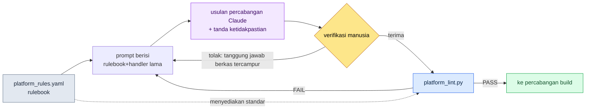

# 14.2 Perbedaan Antarplatform (iOS / Android / PC)

Pada hari pertama saya menaikkan build alpha ke PC, sebuah tangkapan layar muncul di kanal messenger tim internal perancangan. Joystick virtual yang memenuhi penuh bagian bawah layar di perangkat seluler kini melayang di tengah monitor 27 inci, hanya sebesar telapak tangan. Seseorang menambahkan satu baris komentar: "Ini cara menggerakkannya dengan mouse bagaimana?" Logika inti tidak bermasalah sama sekali. Pertarungan, inventaris, maupun quest tetap berjalan apa adanya. Yang runtuh hanya satu hal: bagian yang mengunci input dan layar pada asumsi perangkat seluler.

Mengeluarkan game yang sama ke tiga tempat — iOS, Android, dan PC — tampaknya akan membuat beban operasional menjadi ×3, tetapi kenyataannya tidak demikian. Logika intinya hanya 1, dan di atasnya menempel lapisan adaptasi platform sebanyak ×3. Masalahnya, "sampai mana yang inti dan dari mana lapisan adaptasi" sulit dinilai satu per satu oleh manusia. Percabangan yang berfungsi di iOS tetapi rusak hanya di Android, pemetaan tombol yang baru bermakna di PC — perbedaan semacam ini tidak bisa seluruhnya disimpan di kepala. Karena itu, inti bab ini adalah alur kerja yang **menuangkan batasan platform menjadi rulebook (buku aturan)**, lalu membuat AI menghasilkan usulan percabangan berdasarkan rulebook tersebut, dan akhirnya **lint menangkap pelanggaran aturan**.

---

## 14.2.1 Apa yang Membedakan Ketiga Platform

Pertama, kita lihat dulu peta perbedaannya. Di bawah ini adalah tabel batasan platform yang saya susun ketika meninjau peluncuran tambahan untuk PC di Proyek A (MMORPG yang mengutamakan seluler, tempat saya terlibat sebagai Design Director). Untuk nilai-nilai yang berdasar standar publik, sumbernya saya cantumkan sekaligus; selebihnya adalah nilai kesepakatan internal proyek.

| Area | iOS | Android | PC |
|---|---|---|---|
| Input | Sentuh | Sentuh (+sebagian keyboard) | Keyboard·mouse·gamepad |
| Target sentuh minimum | 44pt (Apple HIG) | 48dp (Material) | Klik — tidak berlaku |
| Layar | 4.7\~6.7 inci | 4.5\~7 inci (variasi besar) | 21\~32 inci |
| Pembayaran | App Store | Google Play | kanal sendiri·Steam |
| Notifikasi | APNs | FCM | OS·kanal sendiri |
| Penyimpanan | iCloud | Google Drive·server sendiri | Steam Cloud·server sendiri |
| Siklus penggantian OS | 1\~2 tahun | 1 tahun (fragmentasi besar) | 5\~10 tahun |

iOS dan Android berbeda pada *API* pembayaran, penyimpanan, dan notifikasi, tetapi layar serta cara mengoperasikan yang dilihat pengguna hampir sama. PC berbeda secara menyeluruh pada input, layar, dan efek visualnya. Karena itu, berlawanan dengan intuisi, beban operasional bukanlah ×3 melainkan lebih mendekati ×2 — sebab jarak antara iOS dan Android pendek.

Yang penting di sini bukan tabel itu sendiri, melainkan mengubah tabel ini **dari dokumen yang dibaca manusia menjadi rulebook yang dibaca mesin**. Dengan begitu AI bisa menjadikannya dasar saat membuat usulan percabangan, dan lint bisa menangkap pelanggaran.

---

## 14.2.2 Garis Pemisah antara Inti dan Lapisan Platform

Struktur folder Proyek A berbentuk satu inti dengan tiga lapisan adaptasi platform yang ditempelkan.

```
game/
├── core/                  — logika game (tak bergantung platform)
│   ├── combat/  inventory/  narrative/  ...
├── platform/              — lapisan adaptasi platform
│   ├── ios/      → input/  payment/  notification/
│   ├── android/  → input/  payment/  notification/
│   └── pc/       → input/  payment/  ui/
└── shared/                — dipakai kedua sisi (util·rendering)
```

Aturannya hanya satu. **core tidak memanggil platform dengan menyebut namanya.** Begitu core memiliki pernyataan seperti `if platform == "ios"`, pemisahan lapisan langsung runtuh. Ambil contoh input: core hanya mengetahui niat "menggunakan skill1" (`InputIntent.SKILL_1`), sedangkan apakah niat itu diambil dari koordinat sentuhan atau dari tombol keyboard `1` menjadi tanggung jawab masing-masing lapisan platform.

Begitu garis ini ditarik, langkah berikutnya menjadi mungkin. Saat menambahkan platform baru, kita cukup mengisi satu folder di bawah `platform/` tanpa menyentuh core. Di bawah ini adalah gambar satu lembar yang memperlihatkan bagaimana garis ini benar-benar terbelah.

<svg viewBox="0 0 720 360" xmlns="http://www.w3.org/2000/svg" font-family="sans-serif" font-size="13">
  <rect x="0" y="0" width="720" height="360" fill="#fbfbfd"/>
  <!-- core -->
  <rect x="270" y="20" width="180" height="70" rx="8" fill="#1d3557" />
  <text x="360" y="50" fill="#fff" text-anchor="middle" font-weight="bold">core/</text>
  <text x="360" y="70" fill="#cdd9e8" text-anchor="middle" font-size="11">logika game · tak bergantung platform</text>
  <text x="360" y="84" fill="#cdd9e8" text-anchor="middle" font-size="11">InputIntent · PaymentInterface</text>
  <!-- arrows down -->
  <line x1="360" y1="90" x2="130" y2="150" stroke="#888" stroke-width="1.5" marker-end="url(#a)"/>
  <line x1="360" y1="90" x2="360" y2="150" stroke="#888" stroke-width="1.5" marker-end="url(#a)"/>
  <line x1="360" y1="90" x2="590" y2="150" stroke="#888" stroke-width="1.5" marker-end="url(#a)"/>
  <defs>
    <marker id="a" markerWidth="8" markerHeight="8" refX="6" refY="3" orient="auto">
      <path d="M0,0 L6,3 L0,6 Z" fill="#888"/>
    </marker>
  </defs>
  <!-- platform boxes -->
  <g>
    <rect x="40" y="150" width="180" height="120" rx="8" fill="#e8f0f8" stroke="#1d3557"/>
    <text x="130" y="173" text-anchor="middle" font-weight="bold" fill="#1d3557">platform/ios</text>
    <text x="130" y="196" text-anchor="middle" font-size="11">touch → intent</text>
    <text x="130" y="214" text-anchor="middle" font-size="11">StoreKit · APNs</text>
    <text x="130" y="232" text-anchor="middle" font-size="11">target ≥ 44pt</text>
    <text x="130" y="256" text-anchor="middle" font-size="10" fill="#777">penyimpanan iCloud</text>
  </g>
  <g>
    <rect x="270" y="150" width="180" height="120" rx="8" fill="#e8f0f8" stroke="#1d3557"/>
    <text x="360" y="173" text-anchor="middle" font-weight="bold" fill="#1d3557">platform/android</text>
    <text x="360" y="196" text-anchor="middle" font-size="11">touch → intent</text>
    <text x="360" y="214" text-anchor="middle" font-size="11">Play Billing · FCM</text>
    <text x="360" y="232" text-anchor="middle" font-size="11">target ≥ 48dp</text>
    <text x="360" y="256" text-anchor="middle" font-size="10" fill="#777">tangani fragmentasi</text>
  </g>
  <g>
    <rect x="500" y="150" width="180" height="120" rx="8" fill="#f8efe8" stroke="#9a4f1d"/>
    <text x="590" y="173" text-anchor="middle" font-weight="bold" fill="#9a4f1d">platform/pc</text>
    <text x="590" y="196" text-anchor="middle" font-size="11">key/mouse → intent</text>
    <text x="590" y="214" text-anchor="middle" font-size="11">Steam · notifikasi OS</text>
    <text x="590" y="232" text-anchor="middle" font-size="11">gamepad · UI pemetaan tombol</text>
    <text x="590" y="256" text-anchor="middle" font-size="10" fill="#777">resolusi beragam</text>
  </g>
  <!-- shared -->
  <rect x="270" y="300" width="180" height="44" rx="8" fill="#ddd" />
  <text x="360" y="327" text-anchor="middle" fill="#333">shared/ — util·rendering</text>
  <text x="360" y="290" text-anchor="middle" font-size="10" fill="#9a4f1d">PC berbeda menyeluruh pada input·layar·visual (oranye)</text>
</svg>

Kotak iOS dan Android sama-sama bernuansa biru, hanya PC yang oranye — besarnya perbedaan ditandai dengan warna. Asimetri beban operasional terlihat sekilas di sini.

---

## 14.2.3 Rulebook: Membuat Perbedaan Dapat Dibaca Mesin

Titik balik intinya ada di sini. Jika batasan platform ditulis di dokumen prosa, manusia akan melupakannya. Sebagai gantinya, semuanya **dikumpulkan dalam satu berkas rulebook deklaratif**. Berikut kutipan dari `platform_rules.yaml` yang dipakai di Proyek A (dari berkas asli, saya pilih hanya aturan inti untuk bab ini).

```yaml
# platform/platform_rules.yaml
targets:
  ios:
    min_touch_pt: 44          # Apple HIG
    contrast_ratio: 4.5       # WCAG SC1.4.3
    gamepad: optional         # standar iOS 17+
    forbidden_in_core: ["import platform.ios", "StoreKit", "APNs"]
  android:
    min_touch_dp: 48          # Material
    contrast_ratio: 4.5
    forbidden_in_core: ["import platform.android", "BillingClient", "FCM"]
  pc:
    min_target_px: 24         # WCAG SC2.5.8 (pointer)
    input: ["keyboard", "mouse", "gamepad"]
    forbidden_in_core: ["import platform.pc", "SteamAPI"]
required_intents: ["MOVE_FORWARD", "ATTACK", "SKILL_1", "SKILL_2"]
```

Berkas ini melakukan tiga hal sekaligus. (1) **Spesifikasi** yang dibaca AI saat membuat usulan percabangan, (2) **standar** yang diverifikasi lint, (3) **sumber tunggal** tempat manusia mencatat kesepakatan. `forbidden_in_core` sangat penting — karena ini adalah daftar token yang sama sekali tidak boleh muncul di dalam folder core, ia menjadi dasar untuk menangkap pelanggaran lapisan secara mekanis.

---

## 14.2.4 Worked Transcript (rekaman sesi nyata): Rulebook → Usulan Percabangan AI → Verifikasi

Sekarang kita ikuti pekerjaan nyata dari awal sampai akhir. Situasinya seperti ini. Sambil menyiapkan peluncuran tambahan untuk PC, handler input yang semula hanya ada di seluler harus dicabangkan untuk versi PC. Berdasarkan rulebook, saya meminta Claude membuat draf adapter input PC, memverifikasinya dengan lint, lalu menjalankan satu siklus penuh hingga penolakan dan permintaan ulang.

### 1) Prompt (lengkap)

> Di bawah ini adalah kutipan rulebook platform proyek kami dan handler input iOS yang sudah ada.
>
> [tempelkan kutipan platform_rules.yaml di atas]
>
> ```python
> # platform/ios/input/touch_handler.py
> from core.input.input_intent import InputIntent
>
> def map_touch_to_intent(touch_event):
>     if touch_event.location in skill_button_1_area:
>         return InputIntent.SKILL_1
>     if touch_event.is_drag_up:
>         return InputIntent.MOVE_FORWARD
>     return None
> ```
>
> Dengan merujuk ini, buatkan draf `platform/pc/input/keyboard_handler.py`. Batasan: (1) impor core, tetapi jangan pernah mengimpor platform.ios/android, (2) petakan keempat `required_intents` semuanya, (3) pisahkan pemetaan tombol ke dalam dict agar bisa diubah pengguna. Tandai bagian yang tidak kamu yakini.

### 2) Keluaran Mentah Claude (tanpa ringkasan·penyuntingan)

> Berikut drafnya. Saya keluarkan pemetaan tombol ke dict di bagian atas modul agar pengguna bisa menyesuaikannya.
>
> ```python
> # platform/pc/input/keyboard_handler.py
> from core.input.input_intent import InputIntent
>
> DEFAULT_KEYMAP = {
>     "w": InputIntent.MOVE_FORWARD,
>     "1": InputIntent.SKILL_1,
>     "2": InputIntent.SKILL_2,
>     # ATTACK diasumsikan klik kiri mouse — tidak ditetapkan default di keyboard
> }
>
> def map_keyboard_to_intent(key_event, keymap=DEFAULT_KEYMAP):
>     return keymap.get(key_event.key.lower())
>
> def map_mouse_to_intent(mouse_event):
>     if mouse_event.button == "left":
>         return InputIntent.ATTACK
>     return None
> ```
>
> ⚠️ Bagian yang tidak saya yakini: ATTACK ada di dalam `required_intents`, tetapi saya memetakannya ke **mouse**, bukan keyboard. Karena tidak ada spesifikasi apakah `required_intents` di rulebook berarti "OK selama dipetakan, terlepas dari perangkat input" atau "harus ditangani semua dalam satu handler", saya berasumsi yang pertama. Jika ternyata yang kedua, lint bisa menangkapnya sebagai ATTACK yang hilang.

### 3) Verifikasi Manusia / Penolakan

Di sinilah titik ⚠️ yang ditunjuk Claude tepat menjadi jebakan. Lint kami (`platform_lint.py`) memeriksa pemenuhan `required_intents` bukan per **berkas** handler, melainkan per **platform**. Meski ATTACK tidak ada di `keyboard_handler.py`, selama ia ada di sisi `mouse_handler`, itu lolos. Namun, keluaran yang dibuat Claude menaruh pemetaan mouse di dalam berkas `keyboard_handler.py` sekaligus — tanggung jawab berkas menjadi tercampur. Strukturnya akan lolos, tetapi melanggar aturan folder kami (pemisahan berkas per perangkat input). **Ditolak.**

Alasan penolakan jelas dalam dua baris. (1) Pisahkan pemetaan mouse ke `mouse_handler.py` tersendiri. (2) Tempatkan `Space` sebagai fallback agar ATTACK juga bisa dipakai dari keyboard.

### 4) Permintaan Ulang → Lolos Lint

Setelah permintaan ulang, versi terpisah yang saya terima saya jalankan melalui `platform_lint.py`. Lint membaca rulebook lalu memeriksa hal-hal berikut.

```
$ python platform_lint.py platform/pc/
[core-leak]    PASS  — 0 token terlarang di dalam core/
[intent-cover] PASS  — pc: MOVE_FORWARD, ATTACK, SKILL_1, SKILL_2 (4/4)
[touch-target] SKIP  — pc min_target_px=24 (diperiksa terpisah di lapisan UI)
[no-cross-import] PASS — platform.pc tidak merujuk platform.ios/android
```

Yang menjadi inti adalah `intent-cover` jatuh pada 4/4. Apakah draf buatan AI memenuhi standar rulebook ditetapkan oleh skrip, bukan oleh mata manusia. Satu baris ini menggantikan pekerjaan yang dulu selalu diperiksa manusia di kepala dalam operasi multiplatform.

Jika siklus ini dipadatkan menjadi gambar, hasilnya seperti berikut.



Inti struktur ini adalah rulebook memasok standar ke **kedua** sisi, prompt dan lint. AI menghasilkan, manusia menilai, lint menetapkan — ketiga peran melihat rulebook yang sama.

---

## 14.2.5 Percabangan Build: Inti yang Sama, Perakitan yang Berbeda

Begitu handler tersedia, build hanyalah perakitan sederhana. core dan shared bersifat tetap, dan hanya satu folder platform yang ditukar.

```
[core/ + shared/ + platform/ios/]      → build iOS
[core/ + shared/ + platform/android/]  → build Android
[core/ + shared/ + platform/pc/]       → build PC
```

Di CI, ketiganya dijalankan **secara paralel, bukan berurutan**, dan tepat setelah tiap build, `platform_lint.py` dijalankan otomatis. Jika dijalankan berurutan, waktu build menjadi 3 kali lipat, dan jika lint dihilangkan, pelanggaran aturan akan bertahan hingga tahap distribusi. Build paralel + lint otomatis, dua hal inilah syarat minimum CI multiplatform.

Karena siklus rilis berbeda di tiap platform, lolosnya build tidak berarti distribusi serentak. Peninjauan iOS biasanya 1\~3 hari sehingga bersikap konservatif terhadap rilis yang sering, Android tercermin dalam hitungan jam sehingga bisa lebih sering dirilis, dan Steam berkisar 1\~2 hari. Untuk perubahan yang sama, iOS-lah yang paling lambat keluar, sehingga jadwal hotfix selalu dihitung mundur dari patokan iOS.

---

## 14.2.6 Varian UI: Umum 80 · Varian 15 · Khusus 5

Di bawah kode, layar pun terbelah. Dari pengalaman, distribusi yang saya sarankan adalah komponen umum 80%, varian platform (hanya berbeda ukuran·posisi) 15%, dan khusus platform 5%. Namun rasio ini berfluktuasi menurut genre — untuk puzzle kasual, bagian umum bisa naik hingga 90%, sedangkan MMORPG membuat varian lebih banyak karena perbedaan input.

Komponen khusus adalah tempat untuk memunculkan daya tarik platform, jadi menyeragamkannya secara mutlak bukanlah jawaban yang tepat. Hal-hal yang baru bermakna di platform tersebut — seperti joystick virtual·getaran pada seluler, UI pemetaan tombol·pengaturan gamepad pada PC — masuk ke sini. Namun jika yang khusus melampaui 30%, itu bukan daya tarik melainkan sinyal beban operasional — bila Anda memasang peringatan `platform-specific-ratio` pada lint, build akan menunjukkannya meski manusia lupa.

Sampai di sini juga merupakan garis batas bantuan AI. Karena perbedaan platform sebagian besar merupakan ranah aturan deterministik, AI lebih dipakai untuk **menghasilkan** usulan percabangan yang memenuhi rulebook daripada menjelajahi kandidat secara bebas. Rekomendasi pemetaan input, konversi varian platform dari mockup Figma, dan adaptasi teks multibahasa×multiplatform adalah titik-titik tempat AI benar-benar memberi nilai tambah, dan keluarannya harus selalu lolos lint. Sebelum otomatisasi yang progresif, standarisasi adapter datang lebih dulu.

---

## 14.2.7 Nilai dari Pemisahan — dan Jebakan yang Umum

Efek terbesar dari pemisahan lapisan adalah **kecepatan menambah platform baru**. Menempelkan PC dengan menumpuk pernyataan if pada satu basis kode tunggal pada praktiknya mendekati biaya membuat game baru, tetapi mengisi `platform/pc/` saja tanpa menyentuh core sangat memangkas waktu itu. Karena rasio percepatan penambahan platform baru berbeda di tiap proyek, saya tidak memastikan kelipatan yang konkret — hanya saja, dalam tinjauan internal kami, jadwal penambahan tambahan untuk PC kami perkirakan berkurang hingga kurang dari separuh dibandingkan asumsi basis kode tunggal (perkiraan penulis, belum terverifikasi). Sebagai efek samping, insiden per platform menjadi terisolasi, dan keandalan perubahan core meningkat (memperbaiki satu tempat tercermin konsisten ke tiga build).

Jebakan yang sering diinjak beserta penanganannya adalah sebagai berikut.

| Jebakan | Penanganan |
|---|---|
| Ledakan percabangan `if platform == ...` di core | Blokir dengan lint `forbidden_in_core`, pisahkan ke adapter |
| Hanya memeriksa usulan percabangan AI dengan mata manusia | Tetapkan intent-cover dengan `platform_lint.py` |
| Menumpuk pemetaan perangkat input dalam satu berkas | Pisahkan handler per perangkat (keyboard/mouse) |
| Komponen khusus 30%+ | Peringatan `platform-specific-ratio`, tinjau penyeragaman |
| Distribusi serentak 3 platform begitu build lolos | Hitung mundur dari patokan iOS sesuai perbedaan siklus rilis |

Kesamaan dari semua jebakan adalah "manusia berusaha mencegahnya dengan ingatan". Bila ditulis di rulebook dan dipasang di lint, build akan mengingatnya meski manusia lupa.

---

### Poin-Poin Penting
- Batasan platform harus dituangkan ke berkas rulebook, bukan prosa, agar AI dan lint melihat standar yang sama
- AI menghasilkan usulan percabangan berbasis rulebook, manusia menilai, dan lint menetapkan pemenuhannya
- Beban operasional bukan ×3 melainkan ×2 — karena jarak iOS·Android pendek dan hanya PC yang jauh

### Pratinjau Bab Berikutnya
- 14.3 Desain Input Sentuh / Mouse — perbedaan hakiki dua jenis input

---

## Coba Sendiri

**setup.** Buat `platform/platform_rules.yaml` di proyek Anda, lalu tuliskan `min_touch`, `contrast_ratio`, `forbidden_in_core`, dan `required_intents` per platform seperti kutipan di atas. Jangan mengarang nilainya, ambil dari standar publik (standar publik seperti sentuh 44pt·48dp·kontras 4.5:1 mengikuti rulebook §9.1; target pointer PC 24px mengikuti WCAG SC2.5.8).

**prompt.** Tempelkan kutipan rulebook + handler dari satu platform yang sudah ada, lalu minta seperti ini. "Patuhi rulebook ini dan buatkan draf handler `platform/<platform-baru>/input/`. Jangan sekali-kali memasukkan token `forbidden_in_core`, petakan semua `required_intents`, dan tandai bagian yang tidak kamu yakini dengan ⚠️."

**verify.** Jalankan `platform_lint.py` (skrip 40 baris pun cukup) yang membaca rulebook lalu memeriksa hal-hal berikut. (1) 0 token `forbidden_in_core` di dalam folder core, (2) semua `required_intents` per platform terpetakan, (3) tidak ada cross-import antar folder platform. Jika ada satu saja yang FAIL, kembali ke prompt dan ajukan ulang dengan menuliskan alasan penolakan.

### Versi Ringkas Solo
Jika Anda bekerja sendiri dan tidak punya CI build, perkecil rulebook menjadi satu lembar checklist Markdown saja sebagai ganti YAML. Tiga baris ini cukup: "target ≥44pt, dilarang impor platform di core, petakan 4 intent". Sebagai ganti skrip lint, berikan hasil kerja ke AI lalu suruh "nilai ketiga butir checklist ini satu per satu sebagai lolos/gagal", maka itu menggantikan pemeriksaan manusia. Intinya bukan skala alatnya, melainkan — menuliskan standar di luar kepala, dan memisahkan penghasilan dari verifikasi.
