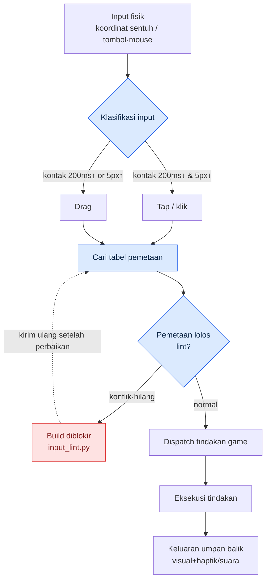

# 14.3 Desain Input Sentuh / Mouse

Anggota tim B yang baru menerima build QA mengernyitkan dahi sambil memegang ponsel dengan satu tangan. "Saya menekan skill tiga kali, tapi cuma keluar dua kali." Ketika saya mengamati layarnya, pada saat ibu jarinya menekan tombol skill, jari yang sama menutupi sekitar 1/3 area di sebelah tombol. Ini masalah yang tidak pernah muncul sama sekali saat diuji dengan mouse. Karena mouse tidak punya jari.

Adegan ini merangkum esensi sentuh dan mouse dalam satu baris. Keduanya adalah input yang "menunjuk satu titik", tetapi yang satu alat penunjuknya menutupi layar dan yang lain tidak. Di sinilah dimulai alasan mengapa tindakan yang sama harus dipecahkan secara berbeda pada kedua input. Pada bab ini saya akan terlebih dahulu merapikan perbedaan kedua input, lalu mengikuti satu tulang punggung worked transcript (rekaman sesi nyata) sampai tuntas — meminta saran pemetaan input dari AI, lalu memverifikasi sendiri konflik dan keterjangkauannya.

---

## 14.3.1 Perbedaan Esensial Kedua Input

Ketebalan jari, halangan pandang, batas multi-sentuh, dan presisi semuanya berbeda. Sebelum membakukannya ke dalam tabel, mari kita tangkap dulu rasanya lewat satu adegan. Kursor mouse adalah ujung pena setebal 1 piksel, sedangkan jari adalah stempel berdiameter hampir 1 sentimeter. Ujung pena bisa menulis, tetapi satu huruf dalam satu waktu. Stempel bisa mencap cepat tetapi tak bisa menulis huruf, dan saat mencap, kertasnya tidak terlihat.

| Properti | Sentuh | Mouse |
|---|---|---|
| Presisi | sekitar 7\~10mm (bidang kontak jari) | satuan 1px |
| Halangan pandang | jari menutupi area sekitar titik kontak | tidak ada |
| Hover mungkin | hampir tidak (kontak = input) | bebas (gerak ≠ input) |
| Input serentak | multi-sentuh 2\~10 titik | kiri·kanan·tengah·roda |
| Pembedaan drag/tap | harus disimpulkan dari waktu·jarak | klik/drag jelas |
| Umpan balik haptik | bisa | hampir tidak ada |

Dua baris yang paling besar pengaruhnya pada desain di sini adalah "halangan pandang" dan "hover". Halangan pandang memaksa di mana hasil harus ditampilkan, sedangkan ketiadaan hover berarti satu kanal informasi bernama tooltip lenyap seutuhnya di perangkat seluler. Empat baris sisanya lebih mendekati detail turunan dari dua baris ini.

Standar publik memaku perbedaan ini sebagai angka — standar publik seperti sentuh 44pt (HIG)·48dp (Material)·kontras 4.5:1·target sentuh 24 piksel CSS (WCAG SC2.5.8) mengikuti rulebook (buku aturan) §9.1. Angka-angka ini bukan soal selera melainkan produk dari tubuh manusia dan pengukuran, sehingga tolok ukur yang kita pakai saat memverifikasi pemetaan pun pada akhirnya adalah standar ini.

## 14.3.2 Pemetaan per Tindakan Game

Gerak·serang·skill — jika ketiga tindakan ini dipecahkan ke dalam dua input, hasilnya terbelah sebagai berikut. Adanya tiga cara untuk satu tindakan bukan berarti tidak ada jawaban benar, melainkan bahwa identitas game memaksa pilihan.

- Gerak — Sentuh: ⓐ joystick virtual (kiri) ⓑ tap layar→gerak otomatis ⓒ drag→putar kamera / Mouse: ⓐ WASD ⓑ klik→gerak otomatis ⓒ gerak mouse→sudut pandang
- Serang — Sentuh: ⓐ tap tombol serang ⓑ tap musuh→serang otomatis ⓒ swipe→combo / Mouse: ⓐ klik kiri ⓑ klik musuh→serang otomatis ⓒ klik beruntun→combo
- Skill — Sentuh: ⓐ tap slot ⓑ tekan-tahan slot untuk membidik ⓒ gestur / Mouse: ⓐ tombol 1\~8 ⓑ tombol+mouse untuk membidik ⓒ makro

Proyek A (MMORPG mobile-first) yang sedang saya kerjakan untuk gerak memilih hibrida ⓐ+ⓑ pada mobile (joystick dan gerak otomatis berdampingan), dan WASD+gerak otomatis pada PC. Untuk serang, mobile memakai ⓑ+ⓐ (tap musuh lalu tombol), PC memakai ⓐ·ⓑ bebas pilih. Untuk skill, mobile memakai ⓐ atau ⓑ saat menargetkan, PC menumpangkan bidikan mouse pada tombol 1\~8. Game yang sama, tindakan yang sama, namun keluar dua lembar tabel pemetaan — itulah inti seluruh bab ini.

Masalahnya, semakin panjang tabel pemetaan, semakin tersembunyi konfliknya. Apa yang terjadi jika tekan-tahan slot (membidik skill) dan drag layar (putar kamera) tumpang tindih di area yang sama? Bagaimana jika tombol 1\~8 sudah dipakai untuk skill, lalu seseorang juga mengusulkan tombol pintas inventory sebagai 1? Menelusuri tabel dengan mata manusia akan melewatkannya. Karena itu diperlukan alur kerja di mana pemetaan diminta dari AI, tetapi verifikasi diserahkan ke alat.

## 14.3.3 Worked Transcript — Saran Pemetaan AI dan Verifikasi lint

Dari sini adalah tulang punggung bab ini. Saya akan memindahkan utuh satu siklus: meminta draf pemetaan keyboard/mouse PC kepada Claude, manusia memverifikasi keluaran itu, menjalankan lint konflik·keterjangkauan untuk menolaknya, lalu meminta ulang. Saya tidak meringkasnya. Pada keluaran mentah pun ada kesalahan, dan kita justru ingin melihat proses menangkap kesalahan itu.

### Prompt (lengkap)

> Anda mendesain pemetaan input untuk MMORPG PC. Usulkan JSON yang memetakan daftar tindakan di bawah ini ke keyboard/mouse.
>
> Tindakan: gerak (depan-belakang-kiri-kanan), lari, lompat, serangan dasar, skill 1\~8, inventory, peta, jendela karakter, menu, toggle kunci sudut pandang, zoom-in/zoom-out, menu konteks (tindakan pendamping), toggle gerak otomatis.
>
> Batasan:
> - Ikuti konvensi industri (gerak WASD, menu ESC, dsb.).
> - Jangan tumpangkan dua tindakan pada satu tombol/tombol fisik yang sama.
> - Tiap item punya field `action`, `input`, `note`.
> Keluaran hanya berupa array JSON.

### Keluaran mentah Claude (apa adanya, tanpa disentuh)

```json
[
  {"action": "move_forward",  "input": "W",      "note": "gerak standar"},
  {"action": "move_back",     "input": "S",      "note": "gerak standar"},
  {"action": "move_left",     "input": "A",      "note": "gerak standar"},
  {"action": "move_right",    "input": "D",      "note": "gerak standar"},
  {"action": "run",           "input": "Shift",  "note": "lari selama ditekan"},
  {"action": "jump",          "input": "Space",  "note": "standar"},
  {"action": "attack_basic",  "input": "Mouse1", "note": "klik kiri tindakan utama"},
  {"action": "skill_1",       "input": "1",      "note": ""},
  {"action": "skill_2",       "input": "2",      "note": ""},
  {"action": "skill_3",       "input": "3",      "note": ""},
  {"action": "skill_4",       "input": "4",      "note": ""},
  {"action": "skill_5",       "input": "5",      "note": ""},
  {"action": "skill_6",       "input": "6",      "note": ""},
  {"action": "skill_7",       "input": "7",      "note": ""},
  {"action": "skill_8",       "input": "8",      "note": ""},
  {"action": "inventory",     "input": "I",      "note": "Tab diberikan untuk pergantian target"},
  {"action": "map",           "input": "M",      "note": ""},
  {"action": "character",     "input": "C",      "note": ""},
  {"action": "menu",          "input": "Escape", "note": "standar"},
  {"action": "cam_lock",      "input": "Mouse3", "note": "toggle kunci sudut pandang dengan klik roda"},
  {"action": "zoom_in",       "input": "WheelUp",   "note": ""},
  {"action": "zoom_out",      "input": "WheelDown", "note": ""},
  {"action": "context_menu",  "input": "Mouse2", "note": "tindakan pendamping klik kanan"},
  {"action": "auto_move",     "input": "Mouse2", "note": "gerak otomatis dengan klik kanan ganda"}
]
```

Keluaran tampak rapi. Justru karena itu berbahaya. Lihat dua baris paling bawah. `context_menu` dan `auto_move` keduanya terikat pada `Mouse2` (klik kanan). Padahal pada batasan sudah jelas ditulis "jangan tumpangkan dua tindakan pada satu tombol", tetapi model menumpangkannya dengan menempelkan dalih "dibedakan oleh klik ganda" pada `note`. Inilah alasan mengapa keluaran AI tidak boleh langsung dimasukkan ke build. Saat manusia menelusuri tabel, mudah melewatkan konflik antara baris ke-22 dan ke-23 dari 23 baris, dan model merasionalisasi konfliknya sendiri.

Maka verifikasi diserahkan bukan ke mata melainkan ke kode. Kita menjalankan lint kecil yang memeriksa konflik (duplikasi input yang sama) dan keterjangkauan (tindakan wajib yang hilang, di luar sudut ibu jari kedua tangan).

```python
# input_lint.py — pemeriksa konflik·keterjangkauan pemetaan input
import json, sys
from collections import defaultdict

REQUIRED = {"move_forward","move_back","move_left","move_right",
            "attack_basic","menu","inventory","map"}

def lint(mapping):
    errors, warns = [], []
    seen = defaultdict(list)
    for m in mapping:
        seen[m["input"]].append(m["action"])
    # 1) konflik: 2 tindakan atau lebih pada input yang sama
    for inp, acts in seen.items():
        if len(acts) > 1:
            errors.append(f"CONFLICT  {inp} <- {', '.join(acts)}")
    # 2) keterjangkauan: tindakan wajib yang hilang
    actions = {m["action"] for m in mapping}
    for r in sorted(REQUIRED - actions):
        errors.append(f"MISSING   required action '{r}'")
    # 3) peringatan note kosong (maksud desain tidak dicatat)
    for m in mapping:
        if not m["note"].strip():
            warns.append(f"NO_NOTE   {m['action']} ({m['input']})")
    return errors, warns

data = json.load(open(sys.argv[1], encoding="utf-8"))
errs, warns = lint(data)
for e in errs:  print("[ERROR]", e)
for w in warns: print("[WARN] ", w)
print(f"\n=> {len(errs)} error(s), {len(warns)} warning(s)")
sys.exit(1 if errs else 0)
```

Keluaran nyata saat JSON di atas disimpan sebagai `claude_map.json` dan lint dijalankan adalah sebagai berikut.

```
[ERROR] CONFLICT  Mouse2 <- context_menu, auto_move
[WARN]  NO_NOTE   skill_1 (1)
[WARN]  NO_NOTE   skill_2 (2)
[WARN]  NO_NOTE   skill_3 (3)
... (skill_4~8 sama)

=> 1 error(s), 8 warning(s)
```

lint menunjuk dengan tepat satu-satunya konflik yang dilewatkan mata manusia. Pemeriksaan keterjangkauan lolos (8 tindakan wajib semuanya ada). 8 `note` kosong hanyalah peringatan dan tidak menghalangi build, tetapi menyingkapkan utang berupa maksud desain yang tidak dicatat. Kini kita mengirim balik alasan penolakan ke model.

### Penolakan + permintaan ulang oleh manusia

> Berdasarkan hasil lint, `Mouse2` ditolak karena context_menu dan auto_move tumpang tindih. Pembedaan dengan klik ganda menimbulkan jeda pada klik kanan sehingga salah berfungsi saat tempur. Pisahkan auto_move ke input tersendiri. Selain itu, note skill_1\~8 kosong — isi satu baris untuk masing-masing slot yang menjelaskan skill kategori apa itu.

### Keluaran ulang Claude (hanya kutipan bagian yang menyelesaikan konflik)

```json
  {"action": "context_menu", "input": "Mouse2",      "note": "klik kanan = tindakan pendamping/konteks tunggal"},
  {"action": "auto_move",    "input": "Numpad0",     "note": "toggle gerak otomatis, terpisah secara fisik dari tombol tempur"},
  ...
  {"action": "skill_1", "input": "1", "note": "andalan jarak dekat"},
  {"action": "skill_8", "input": "8", "note": "skill menghindar/bertahan darurat — batas jangkauan jari kelingking, pertimbangkan penataan ulang ke Q"}
```

Baris terakhir keluaran ulang ini menarik. Model sendiri melaporkan masalah keterjangkauan secara sukarela dengan berkata "tombol 8 berada di batas jangkauan jari kelingking". Ini persis sama dengan topik verifikasi keterjangkauan yang akan kita bahas pada subbab berikutnya. Saat lint dijalankan ulang, ia lolos dengan `0 error(s)`. Intinya adalah ini. AI dengan cepat membuat draf 23 baris, tetapi keabsahan draf itu dijamin oleh aturan yang didefinisikan manusia (himpunan REQUIRED, definisi konflik) dan oleh kode. Usulan dari model, penilaian dari alat, keputusan dari manusia.

## 14.3.4 Alur Input — Hingga Pemetaan Menyentuh Layar

Jika kita menggambar jalur satu input fisik diubah menjadi tindakan game, akan terlihat di titik mana lint di atas menyisip.



Input fisik yang masuk dari kiri atas pertama-tama diklasifikasikan sebagai tap atau drag (kriteria 200ms/5px dari subbab berikutnya). Input yang sudah diklasifikasikan mencari tabel pemetaan, dan inti dari gambar ini adalah bahwa tabel itu harus lolos `input_lint.py` sebelum masuk ke build. Jika ada konflik atau yang hilang, ia tidak bisa lanjut ke tahap dispatch dan diblokir. Verifikasi pemetaan harus selesai sebelum runtime, di gerbang build.

## 14.3.5 Lima Prinsip Desain Sentuh

Sekarang anggaplah pemetaan sudah lolos, lalu kita mendesain permukaan tempat pemetaan itu bertemu jari.

**Prinsip 1 — Luas sentuh minimum.** Apple HIG 44pt, Material 48dp adalah batas bawah. Jika diambil sekitar 100px pada layar HD (200px pada lingkungan Retina 2x), kedua standar terpenuhi sekaligus. Turun di bawah ini, "tiga tekan jadi dua" pada bagian pembuka di atas akan muncul sebagai statistik.

**Prinsip 2 — Area jangkauan ibu jari.** Pada MMORPG mobile, genggaman dua tangan lanskap adalah standar, dan elemen yang ditekan ditempatkan di kedua sudut bawah·item konsumsi/slot di tengah bawah (dasar model tiga area ada di §9.1). Tindakan P0 (kiri=gerak, kanan=serang·skill) ditempatkan di dalam dua sudut kiri·kanan bawah, dan informasi yang jarang dilihat ditempatkan di bagian atas di luar batas jangkauan. Fakta bahwa kedua sudut digabung pun tidak mencapai separuh layar adalah inti dalam desain input. SVG berikut menunjukkan area jangkauan ibu jari kedua tangan dan baris slot tengah bawah pada mode lanskap.

<svg viewBox="0 0 420 240" xmlns="http://www.w3.org/2000/svg" role="img" aria-label="Area jangkauan ibu jari kedua tangan pada mode lanskap">
  <rect x="10" y="10" width="400" height="220" rx="14" fill="#f7f7fa" stroke="#333" stroke-width="2"/>
  <!-- kipas ibu jari kiri -->
  <path d="M 30 230 A 150 150 0 0 1 180 80 L 30 80 Z" fill="#3a7bd5" opacity="0.20"/>
  <path d="M 30 230 A 95 95 0 0 1 125 135 L 30 135 Z" fill="#3a7bd5" opacity="0.40"/>
  <!-- kipas ibu jari kanan -->
  <path d="M 390 230 A 150 150 0 0 0 240 80 L 390 80 Z" fill="#d5533a" opacity="0.20"/>
  <path d="M 390 230 A 95 95 0 0 0 295 135 L 390 135 Z" fill="#d5533a" opacity="0.40"/>
  <!-- area kotak tengah atas -->
  <rect x="150" y="22" width="120" height="50" rx="6" fill="#999" opacity="0.18"/>
  <text x="210" y="52" font-size="12" text-anchor="middle" fill="#444">Atas = di luar jangkauan (tampilan info)</text>
  <!-- baris slot tengah bawah (amber — konsumsi·quickslot) -->
  <rect x="160" y="178" width="100" height="36" rx="6" fill="#f59e0b" opacity="0.35" stroke="#f59e0b" stroke-width="1.5" stroke-dasharray="4 3"/>
  <text x="210" y="200" font-size="10" text-anchor="middle" fill="#92400e">Tengah bawah = konsumsi·quickslot</text>
  <text x="78" y="205" font-size="12" text-anchor="middle" fill="#1c4a8a">Ibu jari kiri</text>
  <text x="342" y="205" font-size="12" text-anchor="middle" fill="#8a2a1c">Ibu jari kanan</text>
  <text x="78" y="160" font-size="10" text-anchor="middle" fill="#1c4a8a">Nyaman</text>
  <text x="342" y="160" font-size="10" text-anchor="middle" fill="#8a2a1c">Nyaman</text>
  <text x="210" y="225" font-size="11" text-anchor="middle" fill="#555">Area pekat = penempatan tombol P0 / Area pucat = batas jangkauan</text>
</svg>

Kipas pekat adalah tempat ibu jari mencapai tanpa kesulitan, sedangkan kipas pucat adalah batas yang baru terjangkau jika tangan diregangkan. Jika "batas jari kelingking tombol 8" yang dilaporkan model pada keluaran ulang 14.3.3 adalah versi PC, maka versi mobile-nya adalah kesalahan menempatkan tombol P0 tepat di area pucat ini.

**Prinsip 3 — Hindari halangan pandang.** Jari tidak hanya menutupi titik kontak, melainkan seluruh tangan di atasnya menyelimuti layar. Jika skill kanan bawah di-tap, sekitar 1/4 bagian kanan bawah tidak terlihat. Karena itu hasil tindakan (angka damage, perubahan status) ditampilkan di area yang tak tersentuh jari. Tangan yang menggenggam joystick kiri menyerobot posisi karakter dan minimap, jadi minimap dipindahkan ke kanan atas.

**Prinsip 4 — Pembedaan drag/tap.** Berbeda dengan mouse, sentuh harus menyimpulkan maksud pengguna dari waktu dan jarak. Disatukan dengan satu kriteria di seluruh game — misalnya jika kontak dalam 200ms sekaligus pergerakan dalam 5px maka tap, lebih dari itu maka drag. Jika kedua angka ini tidak konsisten, kegagalan maksud seperti "niat tap malah karakter berguling" akan menumpuk. Titik percabangan pada mermaid di atas tepatnya adalah penilaian ini.

**Prinsip 5 — Haptik.** Getaran adalah satu-satunya kanal yang tersampaikan tanpa melihat layar. Namun jika getaran diberikan pada setiap input, ia menjadi noise. Tap biasa tanpa getaran, penggunaan skill pendek, tindakan berisiko seperti konfirmasi pembayaran kuat, pengalahan musuh halus — kelola dalam kisaran 4\~5 jenis.

## 14.3.6 Lima Prinsip Desain Mouse

Mouse menikmati tiga kemewahan yang tak dimiliki sentuh. Hover, banyak tombol, dan presisi kursor.

**Prinsip 1 — Hover.** Mouse bisa menunjuk tanpa menekan. Jika mouse diletakkan di slot skill, muncul tooltip nama·cooldown (CD, waktu jeda)·deskripsi, dan jika diklik ia digunakan. Sentuh tidak punya keadaan tengah ini, sehingga hover adalah kanal yang memungkinkan PC menumpuk lebih banyak informasi. Namun, perlu disadari sejak dini di tahap pemetaan 14.3.3 bahwa informasi yang hanya bergantung pada hover akan kehilangan tempat pada versi mobile.

**Prinsip 2 — Banyak tombol.** Klik kiri tindakan utama, klik kanan pendamping/konteks, klik roda reset sudut pandang, roda untuk zoom. Konflik yang ditangkap lint di atas tepatnya adalah kasus menumpangkan dua tindakan pada klik kanan ini. Banyaknya tombol tidak berarti semuanya harus diisi, lalu malah menimbulkan konflik.

**Prinsip 3 — Standar keyboard.** ESC=menu, M=peta, 1\~8=skill, WASD=gerak, Shift=lari, Space=lompat. Pengguna harus bisa menebak tanpa mempelajarinya. Tombol yang menyimpang dari standar dicatat alasannya yang setimpal pada `note`, dan keputusan memberikan Tab untuk pergantian target alih-alih inventory pada 14.3.3 adalah contohnya.

**Prinsip 4 — Kontrol sudut pandang.** Putar sudut pandang dengan drag mouse, tetapi toggle dengan jelas antara mode game yang mengunci kursor ke layar dan mode UI yang melepasnya. Jika toggle ini ambigu, timbul kebingungan kursor menghilang padahal menu sudah ditutup.

**Prinsip 5 — Rentang izin makro·otomatis.** Sampai sejauh mana serang otomatis·gerak otomatis diizinkan adalah persoalan identitas game. Jika terlalu longgar, PC menjadi layar makro; jika dilarang mutlak, hambatan masuk bagi pengguna yang pindah dari mobile meninggi. Jawabannya adalah memilih satu titik pada spektrum yang sesuai dengan warna game, bukan kedua ekstrem.

## 14.3.7 Sama-Sama Berlaku — Penyatuan Umpan Balik Input

Prinsipnya berbeda tiap platform, tetapi "rasa" yang diterima pengguna pada tindakan yang sama harus tetap sama meskipun platform berubah. Pengguna yang pindah dari mobile ke PC tidak boleh dibuat mempelajari ulang makna kilauan tombol.

| Situasi | Sentuh | Mouse |
|---|---|---|
| Input dikenali | tombol berkilau + haptik singkat | tombol berkilau + suara klik |
| Input gagal | tombol bergetar + haptik | tombol bergetar + suara peringatan |
| Cooldown berjalan | gauge melingkar | gauge melingkar |
| Pulih siap pakai | berkilau + haptik | berkilau + suara |

Kanal visual (kilauan·getaran·gauge) sama di kedua sisi, dan hanya kanal pendamping yang terbelah menjadi haptik↔suara sesuai platform. Konsistensi ini memangkas separuh biaya belajar pengguna multi-platform.

## 14.3.8 Kegagalan Umum dan Resepnya

| Pola | Resep |
|---|---|
| Tombol di bawah batas bawah standar (44pt/48dp) | paksa sekitar 100px |
| Hasil ditampilkan di area halangan jari | pindahkan ke area tak terhalang |
| Haptik berlebihan | dalam 4\~5 jenis |
| Dua tindakan tumpang tindih pada klik kanan | blokir konflik dengan lint lalu pisahkan |
| Informasi khusus hover langsung dipakai di mobile | mobile pakai kanal pengganti tap/long-tap |
| Pemetaan tombol terkunci | izinkan kustomisasi pengguna |
| Memaksa pemetaan identik di kedua platform | pemetaan alami per platform |

Baris keempat tabel ini adalah kesimpulan worked transcript 14.3.3. Konflik klik kanan hampir selalu terlewat saat menelusuri tabel dengan mata manusia, dan hampir selalu tertangkap jika lint dipasang di gerbang build.

---

### Poin-Poin Penting
- Sentuh adalah stempel yang jarinya menutupi layar, mouse adalah ujung pena yang tidak menutupi — memindahkan UX satu sisi apa adanya akan berbenturan dengan tangan.
- Pemetaan input diusulkan AI tetapi konflik·keterjangkauan dinilai lint — mata manusia melewatkan satu baris konflik di antara 23 baris.
- Kanal visual umpan balik disatukan di kedua platform, hanya kanal pendamping yang terbelah menjadi haptik↔suara.

### Pratinjau Bab Berikutnya
- 15.1 Live Ops (operasional game) — siklus game hidup setelah rilis

---

### Coba Sendiri (setup → prompt → verify)

1. **setup** — Rapikan daftar tindakan dan batasan dalam satu berkas (gerak·serang·skill·UI·sudut pandang). Tempatkan `input_lint.py` di atas pada proyek Anda. Ganti himpunan `REQUIRED` dengan tindakan wajib game Anda sendiri.
2. **prompt** — Pakai prompt lengkap 14.3.3 apa adanya, hanya ganti daftar tindakannya. Kunci agar keluaran hanya diterima berupa array JSON.
3. **verify** — Jalankan JSON yang diterima dengan `python input_lint.py claude_map.json`. Sampai ERROR menjadi 0, minta ulang dengan menyebutkan alasan penolakan (input konflik·tindakan hilang) secara eksplisit. WARN (note kosong) dicatat terpisah sebagai utang maksud desain yang tidak dicatat.

### Versi Ringkas Solo
Jika game kecil yang Anda buat sendiri, kurangi alatnya. Jika tindakan di bawah 10, lint 20 baris yang hanya menyisakan dua pemeriksaan — himpunan `REQUIRED` dan "duplikasi input yang sama" — sudah cukup. Mintalah pemetaan dari AI, saring hanya konfliknya dengan mini lint ini, lalu tekan sekali pada perangkat nyata untuk memeriksa apakah ibu jari (atau jari kelingking) terjangkau. Usulan dari model, penilaian konflik dari kode, penilaian jangkauan dari tangan Anda sendiri — selama ketiga ini dipatuhi, ia berlaku tanpa peduli skala.
