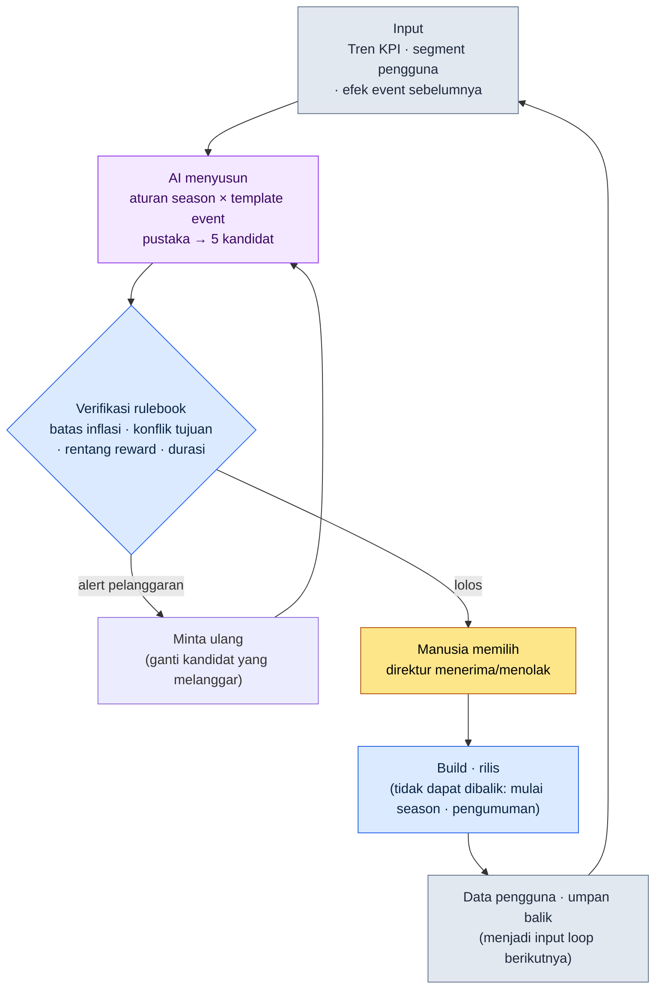

# 15.1 Gambaran Umum Live Ops — AI Menyusun Kandidat Event, Rulebook Menyaring, Manusia Memilih

> Pembaca utama: Game Designer yang untuk pertama kali bertanggung jawab atas Live Ops (operasional game) pascarilis (tim berskala menengah, 10\~50 orang)
> Versi ringkas untuk pembaca solo/hobi: §15.1.7 "Kalau Sendirian, Cukup Sebatas Ini"
>
> **Premis**: Penulis pernah menangani Live Ops sebuah mobile MMORPG yang dirilis secara global, termasuk hingga ekonomi P2E (Play To Earn), lalu menggabungkannya dengan alur kerja AI prarilis dari proyek saat ini untuk menulis bab ini. Worked transcript (rekaman sesi nyata) berikut adalah hasil dari benar-benar menjalankan satu kali pola "input → AI menyusun → verifikasi rulebook → manusia memilih" dalam format Live Ops. Perkiraan dan pengamatan saya tandai dengan jelas sebagai perkiraan dan pengamatan, dan saya tidak menyertakan tabel KPI yang dibuat-buat.

Pagi hari setelah rilis, suasana kantor berbeda dari sebelum rilis. Milestone sudah selesai, tetapi pekerjaan tidak berkurang — malah satuannya saja yang jadi lebih kecil. Jadwal yang tadinya disusun per kuartal kini terpecah menjadi satuan minggu, hari, dan jam. Dan setiap minggu pertanyaan yang sama kembali muncul di ruang rapat. "Event apa yang kita jalankan akhir pekan ini?"

Kalau pertanyaan ini selalu dimulai lagi dari kertas kosong setiap minggu, tim Live Ops akan cepat lelah. Bab ini membahas cara mengeluarkan pertanyaan itu dari kertas kosong. Intinya ada dua. Pertama, alih-alih menyusun event dan season dari nol setiap kali, kita menumpuknya sebagai **pustaka format yang sudah terverifikasi**. Kedua, pekerjaan draf yang membosankan — "menggabungkan format-format itu untuk membuat 5 kandidat minggu depan" — kita serahkan kepada AI, dan manusia hanya menentukan **kandidat mana yang dipilih di antara kandidat yang lolos verifikasi rulebook**. Membuat dari nol dan memilih satu dari lima adalah beban kerja yang berbeda.

---

## 15.1.1 Live Ops Bukan 'Perasaan', Melainkan 'Loop'

Banyak buku yang menyuruh Anda menghafal siklus standar Live Ops dalam bentuk tabel. Ceritanya: lapor di hari Senin, persiapan Selasa-Rabu, dan rilis di hari Jumat. Semuanya benar, tetapi sekadar menghafal tabel tidak memperlihatkan bagaimana keputusan "event minggu ini" — yang berulang setiap minggu — sebenarnya diambil. Esensi Live Ops bukanlah jadwal, melainkan **loop tertutup** — satu putaran di mana kandidat lahir, lolos verifikasi, dipilih manusia, dirilis lewat build, dan data pengguna kembali menjadi input bagi kandidat berikutnya.

Di atas loop ini, empat sumbu Live Ops (konten, event, balance, CS) berputar masing-masing dengan kecepatannya sendiri. Konten berputar bulanan\~kuartalan, event mingguan\~bulanan, balance mingguan\~dwimingguan, dan CS dalam satuan hari dan jam. Kalau keempat sumbu berputar terpisah, dari data pengguna yang sama pun bisa lahir keputusan yang berbeda setiap minggu. Karena itu, tujuan bab ini adalah mengikat keempat sumbu menjadi satu loop, lalu membuat satu kotak dari loop itu (pembuatan kandidat event) menjadi bentuk yang bisa dijalankan AI.



Tempat yang disentuh tangan manusia hanya ada dua. Di paling atas, tempat untuk memasukkan input (KPI, segment, efek masa lalu) secara bersih, dan tempat untuk menentukan kandidat mana yang ditampilkan di antara yang lolos verifikasi. Di antara keduanya, pekerjaan membosankan "menyusun 5 kombinasi" dan "menyaring pelanggaran aturan" dijalankan oleh AI dan rulebook. Dan satu baris di paling bawah — bahwa data pengguna yang dihasilkan event yang sudah dirilis kembali menjadi input — inilah yang menjadikan loop ini benar-benar Live Ops. Desain prarilis sekali keluar maka selesai, tetapi pada Live Ops, hasilnya menjadi input berikutnya.

Detail dua pustaka yang masuk ke loop ini (aturan season dan template event) dibahas di §15.2, dan kotak terakhir (klasifikasi otomatis umpan balik pengguna) di §15.3. Bab ini berfokus pada menjalani satu putaran loop sampai tuntas.

---

## 15.1.2 [Worked Transcript] Menyusun 5 Kandidat Event → Verifikasi Rulebook → Manusia Memilih

Saya tunjukkan satu siklus sampai tuntas, bagaimana ini sebenarnya dijalankan. Berikut adalah reproduksi sebuah sesi di mana saya benar-benar menjalankan satu kali pola "menyusun pustaka → verifikasi rulebook → manusia memilih" — yang sudah saya verifikasi pada alat konten prarilis — dengan memindahkannya ke format Live Ops (aturan season + template event). Prompt input bisa langsung disalin dan dipakai, sedangkan keluarannya saya rekonstruksi dari sesi tersebut.

### Langkah 1 — Input: Lemparkan Pustaka dan Situasi Terkini Apa Adanya

Pertama, letakkan dua bahan penyusun dalam bentuk yang bisa dibaca mesin: pustaka template event (format yang sudah terverifikasi) dan pustaka aturan season, ditambah situasi terkini minggu ini (KPI, segment). Pustaka cukup dibuat sekali, lalu dipakai ulang setiap minggu.

```yaml
# event_templates.yaml — pustaka template event terverifikasi (cuplikan, 4 dari 9 jenis)
- id: tpl_attendance      # reward kehadiran
  tujuan: [perolehan_pengguna_baru, mengembalikan_pengguna_dorman]
  durasi_disarankan: 7~14 hari
  tingkat_reward: rendah~sedang
- id: tpl_coop_raid       # raid kooperatif
  tujuan: [mengaktifkan_pengguna_eksisting, komunitas]
  durasi_disarankan: 3~7 hari
  tingkat_reward: sedang~tinggi
- id: tpl_pvp_season      # season kompetitif
  tujuan: [komunitas, mengaktifkan_pengguna_eksisting]
  durasi_disarankan: 14~28 hari
  tingkat_reward: tinggi
- id: tpl_limited_package # paket terbatas
  tujuan: [pendapatan]
  durasi_disarankan: 3~7 hari
  tingkat_reward: tinggi (terhubung pembayaran)

# season_rules.yaml — potongan aturan season (cuplikan)
season_inflation_cap: event reward tingkat 'tinggi' per kuartal ≤ 3 kali
purpose_conflict_rule: dilarang ada 2 event bertujuan [pendapatan] bersamaan dalam satu minggu
overlap_rule: dilarang ada 2 event reward 'tinggi' bersamaan (kelelahan · inflasi)

# current_state.yaml — situasi minggu ini
minggu: 2026-W23
event_pendapatan_2_minggu_terakhir: 1 kali (akumulasi kuartal tingkat 'tinggi' 2 kali)
tren_DAU: penurunan landai (4 minggu terakhir -6%, secara pengamatan industri masuk zona 'waspada')
segment_utama: porsi lapisan dorman_yang_mungkin_kembali meningkat
jadwal_eksternal_mendatang: tidak ada
```

### Langkah 2 — Prompt: Suruh Ia Menyusun, tetapi Paksakan Format dan Aturan

```
Dengan yaml template, aturan season, dan situasi minggu ini yang terlampir, susun saja 5 kandidat event untuk minggu depan.
Jangan ciptakan mekanik baru, gunakan hanya kombinasi template terlampir, tandai sendiri apakah ada pelanggaran aturan season,
dan untuk tiap kandidat lampirkan satu baris alasan mengapa ia cocok dengan sinyal saat ini (DAU menurun · pengguna dorman kembali).
Sebarkan agar tujuan tidak menumpuk ke pendapatan saja, dan tandai yang ambigu lalu serahkan kepada saya.
Dalam bentuk tabel saja, kolomnya: kandidat · kombinasi template · tujuan utama · durasi · pelanggaran aturan · alasan · ambigu.
```

Perhatikan bahwa di antara lima baris aturan itu, tidak satu pun yang menyebut "apa yang harus dibuat". Semuanya adalah batasan "di dalam kerangka mana, dengan dasar apa, kamu harus menjawab". Sebab kalau Anda memberi AI kebebasan, ia akan memuntahkan event rata-rata RPG generik. **Membatasi bahan ke pustaka (aturan 1), mewajibkan pemeriksaan mandiri terhadap aturan season (aturan 2), mewajibkan dasar respons terhadap sinyal saat ini (aturan 3), menyebar tujuan (aturan 4), dan jalan keluar "kalau ambigu, serahkan ke manusia" (aturan 5)** — lima baris ini bersama-sama menetapkan bukan bentuk kandidat, melainkan kelayakan kandidat.

### Langkah 3 — Keluaran Claude (Rekonstruksi, Cuplikan)

Berikut adalah keluaran mentah yang tidak diringkas. Pelanggaran aturan dan laporan ambigu bercampur di dalamnya.

```
| Kandidat | Kombinasi template          | Tujuan utama         | Durasi  | Pelanggaran | Alasan                                              | Ambigu |
|----------|-----------------------------|----------------------|---------|-------------|-----------------------------------------------------|--------|
| C1       | tpl_attendance              | kembalikan dorman    | 10 hari | tidak ada   | langsung merespons naiknya porsi lapisan dorman, reward 'sedang' | -      |
| C2       | tpl_coop_raid               | aktifkan eksisting   | 5 hari  | tidak ada   | memberi motivasi login di masa DAU menurun, memicu komunitas     | -      |
| C3       | tpl_attendance+tpl_coop_raid | kembalikan dorman+aktivasi | 7 hari | tidak ada | kehadiran memancing dorman kembali + raid menahan retensi, sinergi gabungan | - |
| C4       | tpl_pvp_season              | komunitas            | 21 hari | tidak ada   | season jangka panjang menarik naik kurva retensi itu sendiri      | ★      |
| C5       | tpl_limited_package         | pendapatan           | 5 hari  | ★melanggar  | akumulasi kuartal tingkat 'tinggi' 2 kali → bila ditambah mendekati/melewati batas | - |

Hasil pemeriksaan aturan:
- C5: berisiko melanggar season_inflation_cap. Event reward tingkat 'tinggi'
  pada kuartal ini sudah 2 kali. Bila C5 ditambahkan menjadi 3 kali, mendekati batas.
  Mendorong pendapatan di masa DAU menurun bisa menambah kelelahan pengguna,
  jadi juga berlawanan arah dengan sinyal.
- C4: tidak ada pelanggaran aturan, tetapi season PvP 21 hari menempati 3 minggu,
  bukan hanya satu minggu ini. Perlu pertimbangan kebijakan operasional apakah ia
  layak sebagai 'kandidat minggu ini' → ditandai ambigu.
- C1·C2·C3 lolos aturan, selaras dengan sinyal saat ini (dorman · DAU).
```

Bagian paling berharga dari keluaran ini bukanlah tabelnya, melainkan **tiga baris pemeriksaan aturan di paling bawah**. AI menangkap dan menandai sendiri pelanggaran inflasi pada C5, dan untuk C4 ia menyerahkannya kepada manusia sambil berkata "bukan pelanggaran, tetapi penilaiannya terbelah". Prompt yang baik membuat AI mampu melaporkan keterbatasannya sendiri dan menyerahkan bola kepada manusia.

### Langkah 4 — Verifikasi dan Pemilihan (Tempat Manusia)

Keluaran ini tidak boleh diterima begitu saja. Dihantam sekali lagi dengan rulebook, lalu setelah itu barulah manusia memilih. Dalam sesi ini, dua hal benar-benar terbelah.

Pertama, **C5 ditolak**. AI sudah menandai pelanggaran inflasi, dan kode rulebook (§15.1.3) pun memberi keputusan yang sama. Ia menyentuh batas tingkat 'tinggi' kuartal, dan mendorong pendapatan di masa DAU menurun berlawanan arah dengan sinyal saat ini. Tidak ada yang perlu didebatkan. Dikeluarkan.

Berikutnya, **C4 (season PvP 21 hari)**. Ini tempat yang diserahkan AI sebagai "ambigu". Tidak ada pelanggaran aturan, tetapi ini bukan "event minggu ini", melainkan "keputusan season ini". Bukan perkara yang bisa diputus seketika dalam loop sepekan, melainkan harus dinaikkan ke rapat integrasi season. Karena itu, untuk kandidat minggu ini ia ditangguhkan, dan dikeluarkan tersendiri sebagai agenda kalender season.

Dari sisa C1·C2·C3, direktur yang memilih. Yang paling cocok dengan sinyal saat ini (naiknya lapisan dorman yang kembali + penurunan DAU yang landai) adalah **C3 (gabungan kehadiran + raid kooperatif)**. Sinergi gabungan — menarik lapisan dorman lewat kehadiran dan menahan pengguna yang sudah ditarik lewat raid — selaras dengan sinyal minggu ini. C1·C2 disimpan di pool kandidat minggu depan.

Masih ada satu kandidat yang belum tuntas di sini. Setelah memutuskan mengadopsi C3, durasi 7 hari ternyata beririsan satu hari dengan jadwal pemeliharaan rutin yang akan datang. Karena itu, satu kali permintaan ulang berputar.

```
Saya mengadopsi C3. Hanya saja, hari terakhir dari durasi 7 hari beririsan dengan hari pemeliharaan rutin.
Sesuaikan durasi agar partisipasi di penghujung event tidak terputus oleh pemeliharaan, lalu ajukan ulang.
Pertahankan total reward, geser saja jadwalnya lebih awal.
```

AI menggeser tanggal mulai satu hari lebih awal agar event berakhir sebelum pemeliharaan, dan penyesuaian itu lolos rulebook. Satu siklus — input → AI menyusun → verifikasi rulebook → manusia memilih → penyesuaian jadwal ulang — tertutup di sini.

Satu putaran inilah standar Show untuk seluruh buku ini. Kalau Anda tidak pernah melihat sampai tuntas, walau sekali saja, apa yang disusun AI, apa yang disaring rulebook, apa yang dipilih manusia dan apa yang ditolaknya, maka kalimat "menarik kandidat event dengan AI" hanyalah kalimat kosong.

---

## 15.1.3 Rulebook sebagai Kode — Verifikasi Otomatis Kandidat

Kalau setiap minggu Anda memeriksa dengan mata telanjang apakah kandidat mematuhi aturan season, Anda akan kelewatan lagi. Dari tiga aturan di §15.1.2, yang bisa diputuskan dengan angka kita buat agar kode yang memeriksanya. Manusia hanya menghabiskan waktu pada "ambigu" dan "pilihan" yang tidak bisa ditangkap kode.

```python
# event_lint.py — verifikasi kandidat event minggu depan (kerangka)
# input: daftar kandidat yang disusun AI + aturan season + status akumulasi kuartal
# output: daftar pelanggaran aturan (alert, bukan penolakan otomatis)

def lint(candidates, season, quarter_state):
    issues = []
    high_used = quarter_state["high_reward_count"]  # jumlah akumulasi tingkat 'tinggi' kuartal
    for c in candidates:
        # Aturan A: batas inflasi (tingkat 'tinggi' per kuartal ≤ 3)
        if c["tingkat_reward"] == "tinggi" and high_used + 1 > season["inflation_cap"]:
            issues.append(f"[A] {c['id']}: menambah tingkat 'tinggi' melewati batas kuartal "
                          f"{season['inflation_cap']} kali (sekarang {high_used})")
        # Aturan B: dilarang 2 event bertujuan [pendapatan] dalam minggu yang sama
    sales = [c for c in candidates if "pendapatan" in c["tujuan"]]
    if len(sales) > 1:
        issues.append(f"[B] {len(sales)} kandidat bertujuan [pendapatan] bersamaan → batasi jadi 1")
        # Aturan C: penumpukan tujuan (bila satu tujuan menjadi mayoritas dari 5, kurang tersebar)
    from collections import Counter
    top = Counter(c["tujuan_utama"] for c in candidates).most_common(1)[0]
    if top[1] > len(candidates) // 2:
        issues.append(f"[C] tujuan '{top[0]}' menumpuk {top[1]} (kurang tersebar)")
    return issues
```

Kode ini menyelesaikan perdebatan "ini reward-nya terlalu kuat, bukan?" di rapat dengan satu baris angka. Kalau kode mengeluarkan `[A] tpl_limited_package: menambah tingkat 'tinggi' melewati batas kuartal 3 kali (sekarang 2)`, tidak ada yang perlu didebatkan. Tinggal dikeluarkan. Ini memindahkan verification gate (gerbang verifikasi) lint yang dibahas di §14.1 (HUD mobile) ke ranah Live Ops — pembagian tugas "yang bisa ditangkap secara deterministik dikerjakan kode, yang butuh penilaian dikerjakan manusia" tetap berlaku sama persis dalam operasional.

Hanya saja, ada satu hal yang berbeda. Lint ini **tidak otomatis membuang kandidat** walaupun menemukan pelanggaran. Ia hanya mengangkat alert. Ini desain yang sama seperti yang kita lihat di §6.2 (pembangkit kota). Kalau Anda memasang verifikasi tipe penolakan otomatis, mesin akan ikut membunuh variasi yang disengaja (misalnya keputusan kampanye yang sengaja memasukkan event pendapatan walau tahu batas kuartal). Kandidat yang mencurigakan ditarik oleh mesin, tetapi apakah dibunuh atau dibiarkan hidup ditentukan direktur. Penolakan C5 di §15.1.2 pun bukan lint yang membunuhnya, melainkan keputusan yang ditentukan manusia setelah melihat alert dari lint.

---

## 15.1.4 Sebelum dan Sesudah Rilis — Apa yang Berubah

Titik di mana loop di atas berbeda secara menentukan dari loop desain prarilis ada dua. Daripada mendaftarkannya dalam tabel, saya tunjuk persis dua hal ini saja.

Pertama, **hasil menjadi input berikutnya.** Sebelum rilis, begitu Anda menulis GDD, ia mengalir satu arah hingga ke build. Pada Live Ops, data pengguna yang dihasilkan event minggu ini (tingkat partisipasi, churn, pendapatan, umpan balik) kembali menjadi input penyusunan kandidat minggu depan (`current_state.yaml`). Panah di paling bawah loop §15.1.1 adalah regresi itu. Karena itu, KPI Live Ops bukanlah "menebak tepat sekali", melainkan "menyesuaikan dengan sinyal setiap minggu".

Kedua, **biaya eksperimen mengecil, tetapi titik yang tidak dapat dibalik justru lebih tajam.** Kalau sebelum rilis satu keputusan menentukan satu kuartal, pada masa live Anda bisa menjalankan event sepekan, dan kalau tidak cocok diganti minggu depan. Eksperimen yang bisa di-rollback bertambah. Namun, **mulainya season dan pengumuman event bersifat tidak dapat dibalik.** Prinsip "rekaman · casting = tahap yang tidak dapat dibalik" yang dibahas di §5.4.5 berlaku sama persis. Aturan season dan reward yang sudah dilihat pengguna, walau "dibatalkan", tetap meninggalkan jejak pada persepsi komunitas. Karena itu, semua verifikasi pada loop §15.1.1 (AI menyusun, rulebook, manusia memilih) harus selesai pada tahap yang dapat dibalik, **sebelum** masuk ke kotak tidak dapat dibalik yang bernama build dan pengumuman. Mengeluarkan C4 (season 21 hari) dari keputusan seketika minggu ini lalu menaikkannya ke rapat season juga merupakan prinsip ini — semakin besar keputusan di titik yang tidak dapat dibalik, semakin panjang tinjauan reversibel yang harus dilaluinya.

Dua hal inilah yang menjadikan Live Ops sebagai pekerjaan yang berbeda dari desain prarilis. Sisanya (satuan waktu dari kuartal→minggu, umpan balik dari beta→real-time) adalah turunan dari kedua sumbu ini.

---

## 15.1.5 Dari Penerapan Konservatif ke Penerapan Progresif

Worked transcript di §15.1.2 adalah satu adegan penerapan progresif. AI menyusun kandidat, dan manusia menentukan adopsinya. Namun, tidak semua tim langsung sampai sejauh ini dari awal. Ada tahapannya.

Pada **penerapan konservatif**, manusia mengajukan kandidat. Tim operasional merancang event sendiri di rapat Senin, menulis aturan season dengan tangan, dan mengklasifikasikan umpan balik pengguna secara manual. Otomasi hanya menangani pengukuran (dasbor KPI) dan pengujian regresi (pemeriksaan build). Secara pengamatan industri, sebagian besar operasional MMORPG live saat ini mendekati tahap ini.

Pada **penerapan progresif**, AI menyodorkan draf hingga ke "pengajuan kandidat event" dan "klasifikasi umpan balik". §15.1.2 adalah adegan yang pertama, sedangkan yang kedua (clustering otomatis umpan balik) dibahas di §15.3. Keputusan manusia menyempit menjadi meta-keputusan seperti "kandidat mana yang diadopsi" dan "bagaimana menyikapi umpan balik yang diklasifikasikan AI".

Agar penerapan progresif mapan, tiga hal harus tersedia. **Pustaka** tempat template event dan aturan season dipisah serta diakumulasi sebagai unit yang bisa disusun ulang (`event_templates.yaml` di §15.1.2 adalah benihnya), **pembangkit kandidat** yang menerima input sinyal saat ini lalu mengeluarkan kandidat dalam bentuk draf (prompt di §15.1.2), dan **clustering** yang mengklasifikasikan umpan balik masuk secara otomatis (§15.3). Bahwa ketiga hal ini adalah kerangka yang sama dengan §5.3.12 (world BT (Behavior Tree, pohon perilaku) · quest cloud) dan §8.1.8 (balancing progresif) merupakan pesan konsisten buku ini — bidangnya berbeda, tetapi strukturnya sama: "menumpuk potongan terverifikasi sebagai pustaka, AI mengeluarkan kandidat susunan, dan manusia mengadopsi".

Di sini saya perjelas satu hal. Gagasan seperti pustaka, pembangkit kandidat, dan clustering secara teoretis sudah mungkin di tahun 2010-an juga. Yang menghalanginya adalah AI belum bisa menulis **bahasa alami yang akan dibaca pengguna** seperti teks pengumuman event dan penjelasan aturan, dan belum bisa meringkas serta mengklasifikasikan ratusan\~ribuan umpan balik per hari dalam bahasa alami. Setelah perkembangan LLM (2023\~), kedua tembok itu merendah, dan sebagian besar operasional progresif yang tadinya hanya ada di atas kertas masuk ke ranah yang bisa diwujudkan.

---

## 15.1.6 Kegagalan yang Umum

| Pola | Mengapa gagal | Resep |
|---|---|---|
| Merancang event dari kertas kosong setiap minggu | Tim operasional cepat terkuras, kualitas kandidat naik-turun mengikuti kondisi | Akumulasi lewat pustaka template event (§15.1.2) |
| Mendelegasikan bulat-bulat "AI, buatkan event dong" | Tanpa pustaka dan aturan, yang keluar rata-rata RPG generik | Batasi bahan + paksa pemeriksaan mandiri aturan season (§15.1.2) |
| Memeriksa kandidat hanya dengan mata | Inflasi dan penumpukan tujuan kelewatan setiap minggu | Verifikasi otomatis dengan `event_lint.py` (§15.1.3) |
| Menjadikan lint tipe penolakan otomatis | Mesin ikut membunuh keputusan kampanye yang disengaja | Alert saja, adopsi tetap di direktur (§15.1.3) |
| Memutus seketika keputusan tidak dapat dibalik dalam loop mingguan | Rollback setelah pengumuman season meninggalkan jejak komunitas | Pisahkan keputusan besar ke rapat season (§15.1.4) |
| Hanya mengejar KPI tunggal (DAU · pendapatan) | Kelelahan pengguna menumpuk, kandidat yang berlawanan arah dengan sinyal teradopsi | Masukkan sinyal multi-sumbu ke current_state (§15.1.2) |

---

## 15.1.7 Coba Sendiri — Satu Langkah yang Bisa Anda Lakukan Hari Ini

Cobalah satu langkah saja dengan urutan **setup → prompt → verify**.

- **setup**: Tuliskan dengan tangan 4\~5 format event terverifikasi dari game Anda sendiri (atau game yang pernah Anda operasikan) dalam format `event_templates.yaml` (cukup tujuan, durasi, tingkat reward). Untuk aturan season, tiga baris satu kalimat sudah cukup — batas inflasi, larangan konflik tujuan, larangan tumpang tindih.
- **prompt**: Tempelkan apa adanya prompt dari §15.1.2, isi situasi minggu ini (arah KPI, segment utama) ke `current_state.yaml`, lalu jalankan satu kali.
- **verify**: Dari 5 kandidat yang keluar, pilih sendiri 1 yang melanggar aturan, lalu sanggah dengan "ini kena batas inflasi, keluarkan dan ulangi". Dengan melihat bagaimana AI menggantinya, Anda akan merasakan langsung bahwa menyusun event adalah ikatan dari penilaian-penilaian seperti apa.

> **Kalau Sendirian, Cukup Sebatas Ini**: Anda tidak butuh yaml pustaka maupun kode lint. Ingat-ingat saja 5\~6 event kuartal lalu dari game favorit Anda, lalu tuliskan dalam tiga kolom "tujuan · durasi · reward". Hanya dengan itu pun akan terlihat bahwa game itu tidak menyusun dari kertas kosong setiap minggu, melainkan memakai ulang format. Tabel itulah pustaka template pertama Anda.

Kalau Anda bekerja dalam tim, mulailah dengan satu langkah berikut. Kumpulkan event dari 1\~2 kuartal terakhir lalu normalisasikan menjadi `event_templates.yaml` (hanya format yang terverifikasi), dan masukkan dulu tiga baris aturan season ke dalam kode lewat `event_lint.py`. Kalau pustaka dan aturan sudah ada, baik kandidat susunan AI maupun draf manusia bisa diukur dengan garis yang sama.

---

### Poin-Poin Penting
- Live Ops bukan jadwal, melainkan loop tertutup — hasil menjadi input berikutnya.
- Penyusunan kandidat event ke AI, pelanggaran aturan ke lint, adopsi ke direktur.
- Mulainya season dan pengumuman bersifat tidak dapat dibalik — semua verifikasi diselesaikan di tahap dapat dibalik sebelumnya.

### Pratinjau Bab Berikutnya
- 15.2 Operasional Event · Season — bagaimana menumpuk pustaka template dan aturan season
